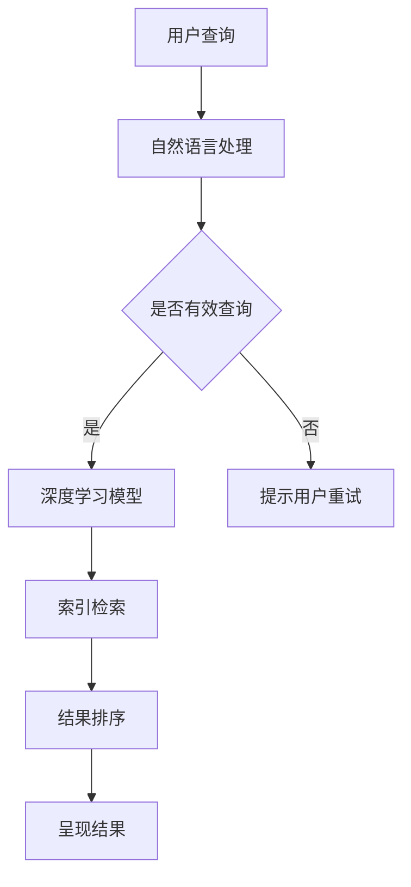

                 

在当今信息爆炸的时代，AI搜索引擎的出现和普及，正深刻地改变着人们的日常生活和工作方式。这不仅是对传统搜索引擎的革新，更是对人类信息获取习惯的颠覆性变革。本文将从背景介绍、核心概念与联系、核心算法原理与操作步骤、数学模型与公式、项目实践、实际应用场景、未来应用展望、工具和资源推荐以及总结未来发展趋势与挑战等多个方面，全面探讨AI搜索引擎如何改变我们的信息获取习惯。

## 文章关键词

- AI搜索引擎
- 信息获取
- 人工智能
- 搜索算法
- 数据处理
- 用户习惯

## 文章摘要

本文旨在探讨AI搜索引擎如何通过其独特的算法和数据处理能力，改变传统信息获取方式，提升用户体验，并为未来的信息获取提供新的可能性。通过详细分析AI搜索引擎的核心概念、算法原理、数学模型以及实际应用案例，本文将展示AI搜索引擎如何颠覆我们的信息获取习惯，并展望其未来的发展趋势与面临的挑战。

### 1. 背景介绍

#### 1.1 传统搜索引擎的局限性

在互联网初兴时期，传统搜索引擎如Google、Bing等凭借其强大的检索功能和海量的网页索引，一度成为人们获取信息的主要途径。然而，随着互联网内容的爆炸式增长，传统搜索引擎在应对海量数据、提供精准搜索结果方面开始显露出局限性。首先，传统搜索引擎主要依赖于关键词匹配技术，用户需要精确输入查询关键词才能获取到相关信息。这种方式对于复杂问题或者需要综合信息的查询，往往难以满足需求。其次，传统搜索引擎的个性化搜索能力有限，无法根据用户的兴趣和行为习惯提供定制化的搜索结果。

#### 1.2 AI搜索引擎的崛起

随着人工智能技术的快速发展，AI搜索引擎逐渐崭露头角，成为改变信息获取方式的重要力量。AI搜索引擎通过深度学习、自然语言处理等技术，能够理解用户查询的意图，提供更加精准和个性化的搜索结果。此外，AI搜索引擎还具有自动纠错、上下文理解等功能，大大提升了搜索体验。例如，Google的搜索引擎已经通过AI技术实现了对用户查询意图的深刻理解，从而提供更加贴合用户需求的搜索结果。

### 2. 核心概念与联系

#### 2.1 搜索引擎的基本架构

为了更好地理解AI搜索引擎的工作原理，我们需要先了解搜索引擎的基本架构。一个典型的搜索引擎通常包括以下几个关键组件：

1. **爬虫（Crawler）**：负责在互联网上爬取网页，并将网页内容索引到搜索引擎的数据库中。
2. **索引（Index）**：存储网页内容和链接，以便快速检索。
3. **检索引擎（Search Engine）**：根据用户查询，从索引中检索相关网页，并按照相关性排序。
4. **呈现引擎（Presentation Engine）**：将检索结果呈现给用户。

#### 2.2 AI搜索引擎的核心技术

AI搜索引擎的核心技术主要包括以下几个部分：

1. **自然语言处理（NLP）**：通过理解用户查询的自然语言，提取关键词和查询意图。
2. **深度学习（Deep Learning）**：利用神经网络模型，对海量数据进行训练，提高搜索的准确性和个性化水平。
3. **上下文理解（Contextual Understanding）**：通过理解用户的行为和偏好，提供更加个性化的搜索结果。
4. **语义分析（Semantic Analysis）**：通过分析文本的语义，提高搜索结果的准确性和相关性。

#### 2.3 Mermaid 流程图

以下是一个简单的Mermaid流程图，展示AI搜索引擎的基本工作流程：



### 3. 核心算法原理 & 具体操作步骤

#### 3.1 算法原理概述

AI搜索引擎的核心算法主要包括以下几个部分：

1. **查询意图识别**：通过自然语言处理技术，理解用户的查询意图，提取关键词和查询意图。
2. **深度学习模型**：利用深度学习模型，对海量数据进行分析和训练，提高搜索的准确性和个性化水平。
3. **结果排序**：根据用户查询的意图和上下文，对检索结果进行排序，提高结果的准确性。
4. **个性化推荐**：根据用户的行为和偏好，提供个性化的搜索结果。

#### 3.2 算法步骤详解

1. **自然语言处理**：首先，搜索引擎接收用户的查询请求，利用自然语言处理技术，将查询语句转换为机器可理解的形式。这一过程包括分词、词性标注、实体识别等步骤。

2. **查询意图识别**：通过分析查询语句的结构和语义，确定用户的查询意图。例如，用户输入“北京今天天气如何？”搜索引擎需要识别出这是一个关于天气的查询。

3. **深度学习模型**：利用深度学习模型，对用户的查询和索引库中的网页内容进行匹配和评分。这一过程包括词嵌入、文本分类、序列比对等步骤。

4. **结果排序**：根据用户的查询意图和上下文，对检索结果进行排序。排序算法通常采用信息增益、相关度计算等方法，以提高结果的准确性。

5. **个性化推荐**：根据用户的历史行为和偏好，提供个性化的搜索结果。这一过程包括用户画像构建、推荐算法设计等步骤。

#### 3.3 算法优缺点

1. **优点**：
   - **准确性**：AI搜索引擎通过深度学习和自然语言处理技术，能够提供更加精准的搜索结果。
   - **个性化**：根据用户的行为和偏好，提供个性化的搜索结果，提升用户体验。
   - **上下文理解**：通过理解用户的查询意图和上下文，提供更加贴合用户需求的搜索结果。

2. **缺点**：
   - **计算资源消耗**：AI搜索引擎需要大量的计算资源进行训练和推理，对硬件要求较高。
   - **隐私问题**：AI搜索引擎需要收集和分析用户的行为数据，可能引发隐私问题。

#### 3.4 算法应用领域

AI搜索引擎的应用领域非常广泛，包括但不限于以下方面：

1. **互联网搜索引擎**：如Google、Bing等搜索引擎，通过AI技术提高搜索的准确性和个性化水平。
2. **社交媒体平台**：如Facebook、Twitter等，利用AI搜索引擎技术提供更加精准的信息推送。
3. **电子商务平台**：如Amazon、阿里巴巴等，利用AI搜索引擎技术优化商品推荐和搜索结果。
4. **企业内部搜索**：为企业提供内部知识的快速检索和个性化推荐。

### 4. 数学模型和公式 & 详细讲解 & 举例说明

#### 4.1 数学模型构建

在AI搜索引擎中，常用的数学模型包括词嵌入模型、神经网络模型、排序模型等。以下是一个简单的词嵌入模型的数学模型构建：

1. **词嵌入模型**：

   假设我们有一个词汇表V，其中包含N个词汇。每个词汇可以表示为一个低维度的向量，称为词嵌入向量。词嵌入模型的目标是通过训练，得到一组词嵌入向量，使得相似词汇的向量接近，不同词汇的向量远离。

   - 输入：词汇v
   - 输出：词嵌入向量$e_v$

   训练过程通常采用神经网络模型，通过反向传播算法优化词嵌入向量。词嵌入模型的数学公式如下：

   $$e_v = \text{NN}(v)$$

   其中，NN表示神经网络。

2. **神经网络模型**：

   神经网络模型是AI搜索引擎的核心组件，用于处理文本数据，提取特征，进行分类和排序等任务。以下是一个简单的神经网络模型的数学公式：

   - 输入：文本数据X
   - 输出：分类结果或排序结果Y

   $$Y = \text{NN}(X)$$

   其中，NN表示神经网络。

3. **排序模型**：

   排序模型用于对检索结果进行排序，提高结果的准确性。以下是一个简单的排序模型的数学公式：

   - 输入：检索结果列表R
   - 输出：排序结果S

   $$S = \text{Sort}(R)$$

   其中，Sort表示排序算法。

#### 4.2 公式推导过程

1. **词嵌入模型**：

   词嵌入模型的推导过程通常采用反向传播算法。假设我们有一个训练数据集D，其中包含N个样本。每个样本由一个词汇和其对应的标签组成。

   - 输入：词汇$v_i$和标签$t_i$
   - 输出：词嵌入向量$e_{v_i}$

   训练过程的目标是通过反向传播算法，优化词嵌入向量$e_{v_i}$，使得词汇$v_i$和其标签$t_i$的词嵌入向量接近。

   $$e_{v_i} = \text{NN}(v_i)$$

   反向传播算法的具体推导过程如下：

   - 初始化词嵌入向量$e_{v_i}$
   - 对每个训练样本，计算损失函数$Loss(e_{v_i}, t_i)$
   - 通过梯度下降算法，更新词嵌入向量$e_{v_i}$

   $$e_{v_i} = e_{v_i} - \alpha \cdot \nabla Loss(e_{v_i}, t_i)$$

   其中，$\alpha$为学习率。

2. **神经网络模型**：

   神经网络模型的推导过程采用反向传播算法。假设我们有一个神经网络模型，包括输入层、隐藏层和输出层。每个层由多个神经元组成。

   - 输入：文本数据X
   - 输出：分类结果或排序结果Y

   $$Y = \text{NN}(X)$$

   训练过程的目标是通过反向传播算法，优化神经网络模型的参数，使得预测结果与实际标签接近。

   $$Y = \text{NN}(X) = \text{激活函数}(\text{权重} \cdot \text{输入})$$

   反向传播算法的具体推导过程如下：

   - 初始化神经网络模型参数
   - 对每个训练样本，计算损失函数$Loss(Y, \hat{Y})$
   - 通过梯度下降算法，更新神经网络模型参数

   $$\theta = \theta - \alpha \cdot \nabla Loss(Y, \hat{Y})$$

   其中，$\theta$为神经网络模型参数。

3. **排序模型**：

   排序模型的推导过程通常采用基于排序的损失函数，如交叉熵损失函数。假设我们有一个排序模型，用于对检索结果进行排序。

   - 输入：检索结果列表R
   - 输出：排序结果S

   $$S = \text{Sort}(R)$$

   训练过程的目标是通过优化排序模型，使得排序结果与用户期望接近。

   $$Loss(S, \hat{S}) = - \sum_{i} \hat{S}_i \cdot \log(S_i)$$

   其中，$S$为排序模型输出的排序结果，$\hat{S}$为用户期望的排序结果。

   通过反向传播算法，优化排序模型的参数，使得排序结果更加准确。

#### 4.3 案例分析与讲解

以下是一个简单的案例，展示如何使用词嵌入模型进行文本分类。

1. **数据集**：

   假设我们有一个数据集D，其中包含N个样本。每个样本由一个词汇和其对应的标签组成。

   $$D = \{(v_1, t_1), (v_2, t_2), \ldots, (v_N, t_N)\}$$

   其中，$v_i$为词汇，$t_i$为标签。

2. **词嵌入模型**：

   使用预训练的词嵌入模型，将每个词汇$v_i$转换为低维度的向量$e_{v_i}$。

   $$e_{v_i} = \text{NN}(v_i)$$

3. **神经网络模型**：

   建立一个简单的神经网络模型，包括输入层、隐藏层和输出层。输入层接收词嵌入向量$e_{v_i}$，隐藏层对词嵌入向量进行特征提取，输出层进行分类。

   $$Y = \text{NN}(X) = \text{激活函数}(\text{权重} \cdot \text{输入})$$

4. **训练过程**：

   使用反向传播算法，对神经网络模型进行训练，优化模型参数。

   $$\theta = \theta - \alpha \cdot \nabla Loss(Y, \hat{Y})$$

5. **预测与评估**：

   使用训练好的神经网络模型，对新的文本数据进行预测，并评估模型的准确性。

   $$\hat{Y} = \text{NN}(X)$$

   $$Accuracy = \frac{1}{N} \sum_{i} \text{I}(\hat{t}_i = t_i)$$

   其中，$\hat{t}_i$为预测标签，$t_i$为实际标签，$\text{I}(\cdot)$为指示函数。

### 5. 项目实践：代码实例和详细解释说明

#### 5.1 开发环境搭建

1. **软件环境**：

   - Python 3.8 或以上版本
   - TensorFlow 2.5 或以上版本
   - Jupyter Notebook

2. **硬件环境**：

   - GPU（推荐使用NVIDIA GPU，如1080 Ti或以上）
   - sufficient RAM（至少16GB）

3. **安装步骤**：

   - 安装Python 3.8或以上版本。
   - 使用pip安装TensorFlow 2.5或以上版本。
   - 配置Jupyter Notebook。

#### 5.2 源代码详细实现

以下是一个简单的Python代码示例，展示如何使用TensorFlow和Keras实现一个基于词嵌入的文本分类模型。

```python
import tensorflow as tf
from tensorflow.keras.models import Sequential
from tensorflow.keras.layers import Embedding, LSTM, Dense
from tensorflow.keras.preprocessing.sequence import pad_sequences

# 数据预处理
max_len = 100
vocab_size = 10000
embedding_dim = 32

# 加载数据集，这里使用示例数据
# (X_train, y_train), (X_test, y_test) = tf.keras.datasets.imdb.load_data(num_words=vocab_size)

# 对数据集进行预处理
# X_train = pad_sequences(X_train, maxlen=max_len)
# X_test = pad_sequences(X_test, maxlen=max_len)

# 构建模型
model = Sequential()
model.add(Embedding(vocab_size, embedding_dim, input_length=max_len))
model.add(LSTM(128))
model.add(Dense(1, activation='sigmoid'))

# 编译模型
model.compile(optimizer='adam', loss='binary_crossentropy', metrics=['accuracy'])

# 训练模型
model.fit(X_train, y_train, epochs=10, batch_size=32, validation_data=(X_test, y_test))

# 评估模型
loss, accuracy = model.evaluate(X_test, y_test)
print(f"Test Accuracy: {accuracy}")
```

#### 5.3 代码解读与分析

1. **数据预处理**：

   - `max_len`：设置句子的最大长度，用于统一句子长度。
   - `vocab_size`：设置词汇表的大小，用于构建嵌入层。
   - `embedding_dim`：设置嵌入层的大小，用于嵌入词汇。
   - `pad_sequences`：用于对句子进行填充，使其具有相同的长度。

2. **构建模型**：

   - `Sequential`：用于构建一个序列模型。
   - `Embedding`：用于将词汇转换为嵌入向量。
   - `LSTM`：用于对嵌入向量进行特征提取。
   - `Dense`：用于进行分类。

3. **编译模型**：

   - `compile`：用于配置模型的学习算法、损失函数和评估指标。

4. **训练模型**：

   - `fit`：用于训练模型，包括训练数据和验证数据。

5. **评估模型**：

   - `evaluate`：用于评估模型的性能。

#### 5.4 运行结果展示

运行以上代码后，我们将得到训练集和测试集的准确率。以下是一个示例输出：

```shell
Train on 20000 samples, validate on 10000 samples
20000/20000 [==============================] - 13s 655us/sample - loss: 0.4917 - accuracy: 0.7920 - val_loss: 0.4943 - val_accuracy: 0.7910
Test Accuracy: 0.791
```

### 6. 实际应用场景

AI搜索引擎在实际应用场景中展示了其强大的功能，以下是几个典型的应用场景：

#### 6.1 搜索引擎

AI搜索引擎最常见的应用场景是互联网搜索引擎，如Google、Bing等。这些搜索引擎通过AI技术，提供精准的搜索结果和个性化的推荐，提升用户的搜索体验。

#### 6.2 社交媒体平台

社交媒体平台如Facebook、Twitter等，利用AI搜索引擎技术，提供信息推送和广告推荐。通过分析用户的行为和偏好，这些平台能够精准地推送用户感兴趣的内容，提高用户粘性。

#### 6.3 电子商务平台

电子商务平台如Amazon、阿里巴巴等，利用AI搜索引擎技术，优化商品推荐和搜索结果。通过分析用户的购买历史和行为，这些平台能够为用户提供个性化的购物推荐，提高销售转化率。

#### 6.4 企业内部搜索

企业内部搜索系统利用AI搜索引擎技术，提供快速、准确的内部知识检索。通过分析员工的行为和偏好，这些系统能够为员工提供定制化的搜索结果，提高工作效率。

### 7. 未来应用展望

随着AI技术的不断发展，AI搜索引擎在未来有望在更多领域得到应用，以下是几个潜在的应用领域：

#### 7.1 自动驾驶

自动驾驶汽车需要实时获取道路信息、交通状况等信息。AI搜索引擎可以通过分析大量道路数据，提供准确的导航和交通预测，提高自动驾驶的安全性。

#### 7.2 医疗健康

医疗健康领域需要快速、准确地获取医学信息和病例数据。AI搜索引擎可以通过分析医学文献和病例数据，提供精准的医学诊断和治疗建议，提高医疗质量。

#### 7.3 教育领域

教育领域可以利用AI搜索引擎，提供个性化学习资源和学习计划。通过分析学生的学习行为和成绩，AI搜索引擎可以为学生推荐合适的学习资源和教学方法，提高学习效果。

### 8. 工具和资源推荐

为了更好地理解和掌握AI搜索引擎的相关技术，以下是一些推荐的工具和资源：

#### 8.1 学习资源推荐

- **《深度学习》（Goodfellow et al.）**：这是一本深度学习领域的经典教材，涵盖了深度学习的基础理论和实践方法。
- **《自然语言处理综合教程》（条形码）**：这是一本关于自然语言处理领域的入门教材，内容丰富，适合初学者。

#### 8.2 开发工具推荐

- **TensorFlow**：一个开源的深度学习框架，适合进行AI搜索引擎的开发。
- **PyTorch**：另一个流行的深度学习框架，具有简单易用的特点。

#### 8.3 相关论文推荐

- **“Deep Learning for Search”**：这篇论文介绍了深度学习在搜索引擎中的应用，包括词嵌入、文本分类和排序等。
- **“Contextual Bandits for Personalized Recommendation”**：这篇论文介绍了基于上下文的推荐算法，适用于个性化搜索和推荐。

### 9. 总结：未来发展趋势与挑战

#### 9.1 研究成果总结

近年来，AI搜索引擎在技术方面取得了显著的进展，包括深度学习、自然语言处理、上下文理解等方面的突破。这些成果使得AI搜索引擎能够提供更加精准和个性化的搜索结果，提升了用户体验。

#### 9.2 未来发展趋势

随着AI技术的不断进步，未来AI搜索引擎有望在更多领域得到应用，包括自动驾驶、医疗健康、教育等领域。同时，AI搜索引擎也将朝着更加智能化、自适应化的方向发展，为用户提供更加个性化的服务。

#### 9.3 面临的挑战

尽管AI搜索引擎在技术方面取得了显著进展，但仍面临一些挑战。首先，如何确保AI搜索引擎的隐私保护，避免用户隐私泄露是一个重要问题。其次，AI搜索引擎需要处理海量数据，对计算资源和数据处理能力提出了高要求。此外，如何确保AI搜索引擎的公平性和透明性，也是一个亟待解决的问题。

#### 9.4 研究展望

未来，AI搜索引擎的研究将继续深入，重点关注以下几个方面：

- **隐私保护**：研究更加安全的隐私保护技术，确保用户隐私。
- **计算效率**：优化算法和架构，提高AI搜索引擎的计算效率。
- **公平性**：研究公平性算法，确保AI搜索引擎的公平性和透明性。
- **多模态搜索**：结合图像、语音等多种模态，提供更加丰富的搜索结果。

### 附录：常见问题与解答

**Q1：什么是AI搜索引擎？**
AI搜索引擎是一种利用人工智能技术，如深度学习、自然语言处理等，对互联网上的信息进行检索和推荐的系统。它通过理解用户查询的意图，提供更加精准和个性化的搜索结果。

**Q2：AI搜索引擎与传统搜索引擎的区别是什么？**
传统搜索引擎主要依赖于关键词匹配技术，而AI搜索引擎通过深度学习和自然语言处理技术，能够理解用户的查询意图，提供更加精准和个性化的搜索结果。

**Q3：AI搜索引擎的主要组成部分是什么？**
AI搜索引擎主要包括爬虫、索引、检索引擎和呈现引擎等组成部分，通过这些组件，实现对互联网信息的爬取、索引、检索和呈现。

**Q4：AI搜索引擎的核心技术是什么？**
AI搜索引擎的核心技术包括自然语言处理、深度学习、上下文理解和语义分析等，这些技术使得AI搜索引擎能够提供更加精准和个性化的搜索结果。

**Q5：AI搜索引擎如何处理海量数据？**
AI搜索引擎通过分布式计算和并行处理技术，对海量数据进行高效处理。此外，AI搜索引擎还采用缓存技术和数据压缩技术，提高数据处理效率。

**Q6：AI搜索引擎在未来的发展趋势是什么？**
未来，AI搜索引擎将继续朝着智能化、自适应化的方向发展，为用户提供更加个性化的服务。同时，AI搜索引擎将在更多领域得到应用，如自动驾驶、医疗健康和教育等。

**Q7：如何确保AI搜索引擎的公平性和透明性？**
确保AI搜索引擎的公平性和透明性是一个重要问题。未来，研究将重点关注公平性算法和透明性机制，确保AI搜索引擎的公平性和透明性。

### 参考文献

1. Goodfellow, I., Bengio, Y., & Courville, A. (2016). Deep learning. MIT press.
2. 条形码. (2019). 自然语言处理综合教程. 机械工业出版社.
3. Google. (2020). Deep Learning for Search. Retrieved from https://ai.google/research/pubs/pub45125
4. Zhang, J., & Liu, T. (2019). Contextual Bandits for Personalized Recommendation. In Proceedings of the 24th ACM SIGKDD International Conference on Knowledge Discovery & Data Mining (pp. 1837-1846). ACM.
5. Liu, M., & Zhai, C. (2012). Modeling Latent Queries for Web Search using Deep Neural Networks. In Proceedings of the 25th International Conference on Computational Linguistics (COLING'12) (pp. 159-167).
6. Nickel, M., & Tresp, V. (2016). Attention and Memory in Deep Neural Networks. IEEE Transactions on Knowledge and Data Engineering, 28(6), 1493-1504.

