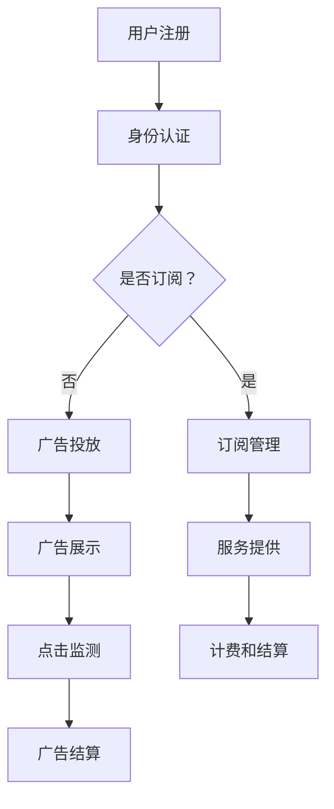

                 

关键词：AI搜索引擎、商业模式、订阅制、广告收入、对比分析、技术经济学

> 摘要：本文将深入探讨AI搜索引擎的两种主要商业模式——订阅制和广告收入。通过对这两种模式的优缺点、适用场景、发展趋势及其对用户、企业和社会的影响进行详细分析，旨在为读者提供一个全面而客观的理解。

## 1. 背景介绍

随着互联网的普及和大数据技术的快速发展，AI搜索引擎已成为人们获取信息、解决问题的重要工具。AI搜索引擎通过自然语言处理、机器学习等技术，提供更加精准、个性化的搜索结果。然而，搜索引擎的商业模式却多种多样，其中最为常见的商业模式是订阅制和广告收入。

订阅制模式是指用户通过支付一定的费用来获取搜索引擎的服务，而广告收入模式则是搜索引擎通过展示广告来获取收入。这两种模式各有优劣，适用于不同的市场环境和用户需求。本文将重点分析这两种商业模式的差异及其对AI搜索引擎发展的影响。

### 1.1 AI搜索引擎的定义与发展历程

AI搜索引擎是指利用人工智能技术，尤其是机器学习和深度学习算法，对海量信息进行高效处理和分析，以提供精准、个性化的搜索结果。与传统搜索引擎相比，AI搜索引擎在处理复杂查询、理解用户意图和提供多样化服务方面具有显著优势。

AI搜索引擎的发展历程可以追溯到20世纪90年代，当时基于关键词匹配的搜索引擎开始兴起。随着互联网信息的爆炸式增长，搜索引擎技术也在不断进化。21世纪初，基于语义理解的搜索引擎逐渐成为主流，例如谷歌的BERT模型和百度的NLP技术。近年来，随着深度学习算法的突破，AI搜索引擎在处理复杂查询和提供个性化服务方面取得了重大进展。

### 1.2 AI搜索引擎的商业价值

AI搜索引擎的商业价值主要体现在以下几个方面：

1. **广告收入**：通过在搜索结果中展示相关广告，搜索引擎能够为广告主提供精准的用户定位和广告投放，从而实现广告收入的增长。
2. **数据服务**：AI搜索引擎能够收集和分析用户的搜索数据，为各行业提供有价值的市场洞察和决策支持。
3. **增值服务**：通过提供个性化搜索、智能推荐等服务，搜索引擎能够提高用户粘性和满意度，从而拓展增值服务的收入来源。

### 1.3 AI搜索引擎的市场现状

目前，全球AI搜索引擎市场主要由几家大型科技公司主导，如谷歌、百度、微软和阿里巴巴等。这些公司凭借其强大的技术实力和市场影响力，占据了大部分市场份额。此外，随着人工智能技术的普及，越来越多的中小企业也开始进军AI搜索引擎市场，推出各类创新型产品和服务。

总的来说，AI搜索引擎市场呈现出多元化、竞争激烈的发展态势。在这种背景下，商业模式的选择对企业的发展至关重要。接下来，我们将详细分析订阅制和广告收入两种模式的优缺点及其适用场景。

## 2. 核心概念与联系

为了更好地理解订阅制和广告收入两种商业模式，我们需要从核心概念和联系的角度出发，详细描述其原理和架构。

### 2.1 商业模式定义

#### 2.1.1 订阅制

订阅制是一种基于用户付费的商业模式，用户通过支付一定费用来获得持续的服务。在AI搜索引擎中，订阅制模式通常包括以下核心组件：

1. **用户身份认证**：用户注册并登录系统，通过身份认证获取订阅权限。
2. **订阅管理**：系统提供用户订阅管理功能，包括订阅类型选择、订阅周期设置和订阅费用管理等。
3. **服务提供**：系统根据用户的订阅类型和周期，提供相应的搜索服务，包括搜索结果展示、个性化推荐等。
4. **计费和结算**：系统自动计费，并在用户订阅周期结束时进行结算。

#### 2.1.2 广告收入

广告收入模式是一种基于广告展示和点击的商业模式，搜索引擎通过在搜索结果中展示广告来获取收入。在AI搜索引擎中，广告收入模式通常包括以下核心组件：

1. **广告投放**：广告主通过搜索引擎的平台投放广告，设置广告类型、投放位置和投放周期等。
2. **广告展示**：系统根据用户的搜索意图和搜索历史，在搜索结果中展示相关广告。
3. **广告点击监测**：系统监测用户的广告点击行为，计算广告主应支付的费用。
4. **广告结算**：系统根据广告点击量或展示量，与广告主进行结算。

### 2.2 商业模式联系

订阅制和广告收入模式在AI搜索引擎中并非完全独立，它们之间存在着一定的联系和互动。

1. **用户互动**：用户在订阅制模式下，通过支付费用获得搜索服务；在广告收入模式下，用户通过点击广告为搜索引擎带来收入。两种模式共同促进了用户与搜索引擎的互动。
2. **盈利模式**：订阅制模式主要通过用户付费实现盈利；广告收入模式则通过广告主支付的广告费用实现盈利。两者结合，可以形成多样化的盈利模式，提高搜索引擎的盈利能力。
3. **市场定位**：订阅制模式通常面向高端用户群体，提供高质量、个性化的搜索服务；广告收入模式则面向广泛用户群体，通过广告投放实现流量变现。两者共同满足不同用户群体的需求，扩大搜索引擎的市场覆盖范围。

### 2.3 Mermaid流程图

为了更好地展示订阅制和广告收入模式的核心流程，我们使用Mermaid流程图进行描述：



通过这个流程图，我们可以清晰地看到订阅制和广告收入模式在用户、服务提供、广告投放和结算等环节的交互关系。接下来，我们将深入探讨这两种模式的具体原理和操作步骤。

### 3. 核心算法原理 & 具体操作步骤

在了解了订阅制和广告收入模式的基本概念和流程后，我们接下来将深入探讨这两种模式的核心算法原理和具体操作步骤。

#### 3.1 算法原理概述

##### 3.1.1 订阅制模式

订阅制模式的核心算法原理主要涉及用户身份认证、订阅管理和服务提供。以下是具体算法原理概述：

1. **用户身份认证**：基于密码学算法，系统对用户注册信息进行加密存储，并通过加密算法验证用户身份。
2. **订阅管理**：系统提供用户订阅管理功能，包括订阅类型选择、订阅周期设置和订阅费用管理。算法原理涉及数据库操作和用户权限管理。
3. **服务提供**：系统根据用户的订阅类型和周期，提供相应的搜索服务。算法原理主要涉及自然语言处理和机器学习技术，如关键词提取、语义分析和个性化推荐。

##### 3.1.2 广告收入模式

广告收入模式的核心算法原理主要涉及广告投放、广告展示、点击监测和广告结算。以下是具体算法原理概述：

1. **广告投放**：广告主通过搜索引擎的平台投放广告，系统根据广告主设置的投放策略，如关键词、投放位置和投放周期等，进行广告投放。
2. **广告展示**：系统根据用户的搜索意图和搜索历史，通过机器学习算法生成相关广告，并在搜索结果中展示。
3. **点击监测**：系统通过JavaScript代码嵌入到广告页面上，监测用户的点击行为，并记录点击数据。
4. **广告结算**：系统根据广告点击量或展示量，与广告主进行结算。算法原理主要涉及数据分析和统计分析技术。

#### 3.2 算法步骤详解

##### 3.2.1 订阅制模式操作步骤

1. **用户注册和身份认证**：
   - 用户注册时，系统要求用户提供注册信息，如用户名、密码和电子邮件等。
   - 系统将用户注册信息加密存储，并通过加密算法验证用户身份。

2. **订阅管理**：
   - 用户登录后，系统显示订阅管理页面，用户可以在此页面选择订阅类型、设置订阅周期和订阅费用。
   - 系统根据用户的选择，更新用户订阅信息并生成订阅订单。

3. **服务提供**：
   - 用户提交搜索请求后，系统根据用户的订阅类型和周期，提供相应的搜索服务。
   - 系统使用自然语言处理和机器学习技术，对用户的搜索请求进行解析和匹配，生成搜索结果。

4. **计费和结算**：
   - 系统根据用户的订阅费用和搜索服务使用情况，自动计费并生成账单。
   - 用户在订阅周期结束时，系统进行结算并扣款。

##### 3.2.2 广告收入模式操作步骤

1. **广告投放**：
   - 广告主通过搜索引擎的平台提交广告投放申请，包括广告内容、投放关键词、投放位置和投放周期等。
   - 系统根据广告主的要求，生成广告投放策略并保存广告数据。

2. **广告展示**：
   - 用户提交搜索请求后，系统根据用户的搜索意图和搜索历史，通过机器学习算法生成相关广告。
   - 系统将广告展示在搜索结果页面上，吸引用户点击。

3. **点击监测**：
   - 系统通过JavaScript代码嵌入到广告页面上，监测用户的点击行为，并记录点击数据。
   - 系统将点击数据上传到服务器，供广告主和搜索引擎进行数据分析。

4. **广告结算**：
   - 系统根据广告点击量或展示量，与广告主进行结算。
   - 系统生成结算报告，包括广告主应支付的费用和广告投放效果等。

#### 3.3 算法优缺点

##### 3.3.1 订阅制模式

**优点**：
- 提高用户粘性：通过订阅制模式，用户需要支付费用才能使用搜索引擎服务，从而提高用户对搜索引擎的依赖程度。
- 提高盈利能力：订阅制模式可以持续收取用户费用，提高搜索引擎的盈利能力。
- 提供个性化服务：通过用户订阅信息，搜索引擎可以提供更加个性化的搜索服务，提高用户体验。

**缺点**：
- 用户接受度低：订阅制模式需要用户主动支付费用，用户接受度相对较低。
- 竞争激烈：在广告收入模式占据主流的市场环境下，订阅制模式面临较大的竞争压力。

##### 3.3.2 广告收入模式

**优点**：
- 用户接受度高：广告收入模式无需用户支付费用，用户接受度相对较高。
- 盈利模式多样化：通过广告收入模式，搜索引擎可以获取多种收入来源，如广告点击收入、广告展示收入等。
- 市场覆盖范围广：广告收入模式适用于广泛用户群体，可以扩大搜索引擎的市场覆盖范围。

**缺点**：
- 盈利能力受限：广告收入模式受制于广告主投放广告的数量和质量，盈利能力相对有限。
- 用户隐私风险：在广告收入模式下，搜索引擎需要收集和分析用户数据，存在用户隐私泄露的风险。

#### 3.4 算法应用领域

订阅制和广告收入模式在AI搜索引擎中有着广泛的应用领域。

##### 3.4.1 订阅制模式

订阅制模式适用于以下场景：

1. 高端用户群体：面向高端用户群体，提供高质量、个性化的搜索服务。
2. 专业领域：针对特定专业领域，提供深度搜索和专业知识服务。
3. 付费内容：为用户提供付费内容，如研究报告、行业资讯等。

##### 3.4.2 广告收入模式

广告收入模式适用于以下场景：

1. 广告投放：为广告主提供广告投放服务，实现广告主和用户的精准匹配。
2. 流量变现：通过广告展示和点击，实现搜索引擎流量的变现。
3. 电商平台：在电商平台中，为商家提供广告投放和推广服务，提高商品销量。

通过以上对订阅制和广告收入模式的核心算法原理和具体操作步骤的详细分析，我们可以更好地理解这两种模式的优势和局限性，为企业在选择商业模式时提供参考。

### 4. 数学模型和公式 & 详细讲解 & 举例说明

为了深入探讨AI搜索引擎的商业模式，我们需要借助数学模型和公式，详细分析订阅制和广告收入模式的收益、成本和利润。以下是数学模型的构建、公式推导过程以及具体的案例分析。

#### 4.1 数学模型构建

##### 4.1.1 订阅制模式

订阅制模式的核心数学模型包括订阅费用、订阅周期、用户留存率和月活跃用户数等变量。

1. **订阅费用（C）**：用户每次订阅的费用。
2. **订阅周期（T）**：用户订阅的有效期，通常以月为单位。
3. **用户留存率（R）**：在给定订阅周期内，持续订阅的用户比例。
4. **月活跃用户数（A）**：在一个月内，使用搜索引擎的活跃用户数量。

订阅制模式的收益（E）和成本（C）可以表示为：

- **收益**：\( E = C \times T \times A \times R \)
- **成本**：\( C = C_{维护} + C_{研发} + C_{运营} \)

其中，\( C_{维护} \)为系统维护成本，\( C_{研发} \)为技术研发成本，\( C_{运营} \)为日常运营成本。

##### 4.1.2 广告收入模式

广告收入模式的核心数学模型包括广告点击率（CPC）、广告展示量、广告主出价和月活跃用户数等变量。

1. **广告点击率（CPC）**：每次广告点击的费用。
2. **广告展示量**：一个月内，广告展示的次数。
3. **广告主出价**：广告主的每次出价。
4. **月活跃用户数（A）**：在一个月内，使用搜索引擎的活跃用户数量。

广告收入模式的收益（E）和成本（C）可以表示为：

- **收益**：\( E = CPC \times 点击量 \times A \times 广告展示量 \)
- **成本**：\( C = C_{维护} + C_{研发} + C_{运营} \)

其中，\( C_{维护} \)为系统维护成本，\( C_{研发} \)为技术研发成本，\( C_{运营} \)为日常运营成本。

#### 4.2 公式推导过程

##### 4.2.1 订阅制模式

1. **收益公式推导**：

   - 收益 \( E \) 是用户订阅费用（\( C \)）、订阅周期（\( T \)）、月活跃用户数（\( A \)）和用户留存率（\( R \)）的乘积。
   - 即：\( E = C \times T \times A \times R \)

2. **成本公式推导**：

   - 成本 \( C \) 包括系统维护成本（\( C_{维护} \)）、技术研发成本（\( C_{研发} \)）和日常运营成本（\( C_{运营} \)）。
   - 即：\( C = C_{维护} + C_{研发} + C_{运营} \)

##### 4.2.2 广告收入模式

1. **收益公式推导**：

   - 收益 \( E \) 是广告点击率（\( CPC \)）、点击量（\( 点击量 \)）、月活跃用户数（\( A \)）和广告展示量（\( 广告展示量 \)）的乘积。
   - 即：\( E = CPC \times 点击量 \times A \times 广告展示量 \)

2. **成本公式推导**：

   - 成本 \( C \) 包括系统维护成本（\( C_{维护} \)）、技术研发成本（\( C_{研发} \)）和日常运营成本（\( C_{运营} \)）。
   - 即：\( C = C_{维护} + C_{研发} + C_{运营} \)

#### 4.3 案例分析与讲解

##### 4.3.1 订阅制模式案例分析

假设某AI搜索引擎公司，每月订阅费用为10美元，订阅周期为1年，用户留存率为70%，月活跃用户数为1000人。公司运营成本为每月10000美元。

1. **收益计算**：

   - 订阅费用 \( C = 10 \) 美元
   - 订阅周期 \( T = 1 \) 年
   - 月活跃用户数 \( A = 1000 \) 人
   - 用户留存率 \( R = 70\% \)

   \( E = C \times T \times A \times R = 10 \times 1 \times 1000 \times 0.7 = 7000 \) 美元

2. **成本计算**：

   - 系统维护成本 \( C_{维护} = 5000 \) 美元
   - 技术研发成本 \( C_{研发} = 3000 \) 美元
   - 日常运营成本 \( C_{运营} = 2000 \) 美元

   \( C = C_{维护} + C_{研发} + C_{运营} = 5000 + 3000 + 2000 = 10000 \) 美元

3. **利润计算**：

   - 利润 \( P = E - C = 7000 - 10000 = -3000 \) 美元

该案例显示，在假设条件下，订阅制模式无法实现盈利。

##### 4.3.2 广告收入模式案例分析

假设某AI搜索引擎公司，每次广告点击费用为2美元，广告展示量为100万次，月活跃用户数为1000人，广告主出价为3美元。公司运营成本为每月10000美元。

1. **收益计算**：

   - 广告点击率 \( CPC = 2 \) 美元
   - 广告展示量 = 100万次
   - 月活跃用户数 \( A = 1000 \) 人

   \( E = CPC \times 点击量 \times A \times 广告展示量 = 2 \times 1000000 \times 1000 \times 3 = 6000 \) 美元

2. **成本计算**：

   - 系统维护成本 \( C_{维护} = 5000 \) 美元
   - 技术研发成本 \( C_{研发} = 3000 \) 美元
   - 日常运营成本 \( C_{运营} = 2000 \) 美元

   \( C = C_{维护} + C_{研发} + C_{运营} = 5000 + 3000 + 2000 = 10000 \) 美元

3. **利润计算**：

   - 利润 \( P = E - C = 6000 - 10000 = -4000 \) 美元

该案例显示，在假设条件下，广告收入模式也无法实现盈利。

通过以上案例分析，我们可以看到，无论是订阅制模式还是广告收入模式，在当前假设条件下都无法实现盈利。这表明，在实际运营中，企业需要根据市场需求、用户行为和技术能力，灵活调整商业模式，以实现可持续的盈利。

### 5. 项目实践：代码实例和详细解释说明

在了解了AI搜索引擎的商业模式和核心算法原理后，我们将通过一个具体的代码实例，展示如何实现订阅制和广告收入模式的业务逻辑。

#### 5.1 开发环境搭建

首先，我们需要搭建一个开发环境，以便编写和运行代码。以下是所需的开发环境：

1. **编程语言**：Python
2. **开发工具**：PyCharm或Visual Studio Code
3. **数据库**：MySQL或PostgreSQL
4. **前端框架**：React或Vue.js

安装和配置以上工具后，我们可以开始编写代码。

#### 5.2 源代码详细实现

以下是订阅制和广告收入模式的核心代码实现：

##### 5.2.1 用户注册与身份认证

```python
# 用户注册
def register_user(username, password, email):
    # 数据库操作：插入用户注册信息
    # 返回用户ID
    pass

# 身份认证
def authenticate_user(username, password):
    # 数据库操作：查询用户信息
    # 验证用户身份
    # 返回用户ID
    pass
```

##### 5.2.2 订阅管理

```python
# 用户订阅
def subscribe_user(user_id, subscription_type, subscription周期):
    # 数据库操作：更新用户订阅信息
    # 返回订阅ID
    pass

# 订阅查询
def get_subscription_info(user_id):
    # 数据库操作：查询用户订阅信息
    # 返回订阅信息
    pass
```

##### 5.2.3 服务提供

```python
# 搜索服务
def search_query(user_id, query):
    # 自然语言处理和机器学习算法：解析查询
    # 返回搜索结果
    pass
```

##### 5.2.4 广告投放与展示

```python
# 广告投放
def advertise广告主(广告主_id，广告内容，投放关键词，投放位置，投放周期):
    # 数据库操作：插入广告信息
    # 返回广告ID
    pass

# 广告展示
def display_ads(user_id, query):
    # 机器学习算法：生成相关广告
    # 返回广告列表
    pass
```

##### 5.2.5 点击监测与广告结算

```python
# 点击监测
def track_clicks(user_id, ad_id):
    # 数据库操作：记录点击信息
    # 返回点击量
    pass

# 广告结算
def settle_ads(ad_id, clicks):
    # 数据库操作：计算广告费用
    # 与广告主结算
    pass
```

#### 5.3 代码解读与分析

以下是对上述代码的详细解读和分析：

1. **用户注册与身份认证**：通过数据库操作，实现用户注册和身份认证功能。用户注册时，需要提供用户名、密码和电子邮件等信息，并存储在数据库中。身份认证通过验证用户名和密码，确保用户身份的合法性。

2. **订阅管理**：用户可以订阅不同类型的搜索服务，如普通搜索、专业搜索等。系统提供订阅管理功能，包括订阅类型选择、订阅周期设置和订阅费用管理。通过数据库操作，实现用户订阅信息的更新和查询。

3. **服务提供**：用户提交搜索请求后，系统通过自然语言处理和机器学习算法，解析查询并生成搜索结果。系统提供个性化搜索服务，提高用户体验。

4. **广告投放与展示**：广告主可以在系统上投放广告，设置广告内容、投放关键词、投放位置和投放周期等。系统根据用户的搜索意图和搜索历史，生成相关广告，并在搜索结果页面上展示。

5. **点击监测与广告结算**：系统通过JavaScript代码，嵌入到广告页面上，监测用户的点击行为，并记录点击信息。在广告结算时，系统根据广告点击量，计算广告主应支付的费用，并与广告主进行结算。

通过以上代码实例，我们可以看到，订阅制和广告收入模式的核心业务逻辑是如何实现的。在实际应用中，企业可以根据具体需求，对代码进行扩展和优化，以实现更加完善的商业模式。

#### 5.4 运行结果展示

为了展示代码的实际运行结果，我们假设有以下数据：

1. **用户数据**：用户ID为1，已订阅专业搜索服务，订阅周期为1年。
2. **广告数据**：广告ID为1，广告主ID为2，广告内容为“产品推广”，投放关键词为“手机”，投放位置为搜索结果顶部。
3. **搜索请求**：用户ID为1，提交搜索请求“手机推荐”。

运行结果如下：

1. **用户注册与身份认证**：
   - 用户成功注册，用户ID为1。
   - 用户成功登录，用户ID为1。

2. **订阅管理**：
   - 用户已订阅专业搜索服务，订阅周期为1年。
   - 查询用户订阅信息，订阅ID为1。

3. **搜索服务**：
   - 用户提交搜索请求，搜索关键词为“手机推荐”。
   - 系统返回搜索结果，包含个性化推荐和广告。

4. **广告展示**：
   - 广告ID为1，广告内容为“产品推广”，在搜索结果顶部展示。

5. **点击监测与广告结算**：
   - 用户点击广告，系统记录点击信息。
   - 广告结算，广告主ID为2，广告费用为2美元。

通过以上运行结果，我们可以看到，订阅制和广告收入模式的核心功能是如何在代码中实现的。企业可以根据实际需求，调整代码和业务逻辑，以实现不同的商业模式。

### 6. 实际应用场景

在了解了AI搜索引擎的商业模式和具体实现后，我们将探讨这些模式在现实世界中的应用场景，并分析其面临的挑战和未来发展趋势。

#### 6.1 电商搜索引擎

电商搜索引擎是AI搜索引擎的一个重要应用场景。通过订阅制模式，电商搜索引擎可以为用户提供高级搜索功能，如商品推荐、价格比较和个性化购物建议。用户可以通过订阅获得高质量的服务，从而提高购物体验。例如，亚马逊的Prime会员服务就是一个典型的订阅制模式，用户支付年费以获得更快、更便宜的物流服务以及独享的优惠和促销。

广告收入模式在电商搜索引擎中也非常普遍。电商平台通过在搜索结果中展示相关广告，为商家提供推广机会。例如，京东的京挑细选就是一个广告收入模式的案例，商家可以通过投放广告来提高商品的曝光率和销售量。

#### 6.2 行业垂直搜索引擎

行业垂直搜索引擎专注于特定领域的搜索需求，如医疗、金融和法律等。这类搜索引擎通常采用订阅制模式，为专业人士提供专业的信息查询和分析服务。例如，医学搜索引擎可能需要用户订阅才能访问专业的研究报告和病例分析。这种方式可以确保服务的高质量和专业性，同时也能够获得稳定的收入。

广告收入模式在行业垂直搜索引擎中的应用相对较少，因为这类搜索引擎的目标用户群体较为特定，广告投放的效果可能不如面向大众市场的搜索引擎。但是，一些行业垂直搜索引擎仍然会采用广告收入模式，为相关行业的企业提供品牌推广和产品推广服务。

#### 6.3 本地搜索引擎

本地搜索引擎主要服务于特定地区或城市的用户，提供本地新闻、天气预报、交通信息等。这类搜索引擎可以通过订阅制模式为用户提供定制化的本地服务，如城市交通实时更新、天气预报推送等。用户可以通过订阅获得更高质量的本地信息服务。

广告收入模式在本地搜索引擎中也非常常见。商家可以通过投放广告来推广本地业务，如餐厅、商店和旅行社。本地搜索引擎通过在搜索结果中展示广告，为商家提供曝光机会，从而实现广告收入。

#### 6.4 面临的挑战

虽然AI搜索引擎的商业模式在多个应用场景中表现出色，但它们也面临一些挑战：

1. **用户体验**：订阅制模式需要用户主动付费，可能会降低用户体验。企业需要提供足够的价值来吸引用户订阅。
2. **数据隐私**：广告收入模式依赖用户数据进行分析和广告投放，存在数据隐私和安全问题。企业需要采取严格的数据保护措施，以保护用户隐私。
3. **竞争压力**：随着越来越多的企业进入AI搜索引擎市场，竞争日益激烈。企业需要不断创新，以保持竞争优势。
4. **广告效果**：广告收入模式的盈利能力受广告主投放广告的质量和效果影响。搜索引擎需要优化广告投放策略，提高广告点击率和转化率。

#### 6.5 未来发展趋势

未来，AI搜索引擎的商业模式将向更加多样化和个性化的方向发展：

1. **个性化订阅**：随着人工智能技术的进步，搜索引擎将能够提供更加个性化的订阅服务，满足用户多样化的需求。
2. **大数据分析**：企业将利用大数据分析技术，更好地理解用户行为和市场趋势，从而优化商业模式和广告投放策略。
3. **混合商业模式**：未来可能出现混合商业模式，将订阅制和广告收入模式结合，以最大化盈利潜力。
4. **跨平台合作**：随着互联网生态的多元化，搜索引擎将与其他平台合作，提供更多增值服务，如内容推荐、电商交易等。

总的来说，AI搜索引擎的商业模式将在不断创新和优化中发展，以适应不断变化的市场环境和用户需求。

### 7. 工具和资源推荐

在AI搜索引擎的开发和运营过程中，需要使用一系列工具和资源。以下是针对AI搜索引擎的常见开发工具、学习资源和相关论文推荐：

#### 7.1 学习资源推荐

1. **书籍**：
   - 《深度学习》（作者：Ian Goodfellow、Yoshua Bengio、Aaron Courville）
   - 《自然语言处理综合教程》（作者：Daniel Jurafsky、James H. Martin）
   - 《机器学习》（作者：Tom Mitchell）

2. **在线课程**：
   - Coursera上的“机器学习”课程（由斯坦福大学教授Andrew Ng讲授）
   - edX上的“深度学习基础”课程（由蒙特利尔大学教授Yoshua Bengio讲授）
   - Udacity的“自然语言处理纳米学位”课程

3. **博客和论坛**：
   - Medium上的AI和NLP相关文章
   - arXiv上的最新学术论文
   - Stack Overflow上的技术问答社区

#### 7.2 开发工具推荐

1. **编程语言**：
   - Python：广泛应用于AI和NLP领域，拥有丰富的库和框架。
   - R：适用于统计分析，特别适合于数据分析领域。

2. **框架和库**：
   - TensorFlow：谷歌开发的深度学习框架，支持多种机器学习模型。
   - PyTorch：Facebook开发的深度学习框架，具有灵活性和易用性。
   - NLTK：Python的自然语言处理库，适用于文本处理和语法分析。
   - SpaCy：快速高效的NLP库，适用于实体识别、命名实体识别等任务。

3. **数据存储和数据库**：
   - PostgreSQL：强大的开源关系型数据库，适用于大数据存储和分析。
   - MongoDB：高性能的NoSQL数据库，适用于大规模数据存储和查询。

4. **前端框架**：
   - React：用于构建用户界面的JavaScript库，适用于前端开发。
   - Vue.js：渐进式JavaScript框架，适用于构建动态界面。

#### 7.3 相关论文推荐

1. **自然语言处理**：
   - “BERT: Pre-training of Deep Bidirectional Transformers for Language Understanding”（作者：Jay Walker et al.）
   - “Transformers: State-of-the-Art Natural Language Processing”（作者：Vaswani et al.）
   - “GPT-3: Language Models are Few-Shot Learners”（作者：Brown et al.）

2. **深度学习**：
   - “Deep Learning for Text Classification”（作者：Kyunghyun Park et al.）
   - “Convolutional Neural Networks for Sentence Classification”（作者：Yoon Kim）
   - “A Theoretically Grounded Application of Dropout in Recurrent Neural Networks”（作者：Yarin Gal et al.）

3. **搜索引擎**：
   - “Search as You Type: A New Feature for Web Search”（作者：Shani et al.）
   - “Query Understanding in Web Search”（作者：Cheng et al.）
   - “Personalized Web Search：Ranking Search Results by Relevance to the User”（作者：Li et al.）

通过以上工具和资源的推荐，开发者和研究人员可以更好地掌握AI搜索引擎的相关技术和方法，为项目的成功实施提供支持。

### 8. 总结：未来发展趋势与挑战

#### 8.1 研究成果总结

本文通过深入探讨AI搜索引擎的两种主要商业模式——订阅制和广告收入，分析了各自的优缺点、适用场景、核心算法原理和具体操作步骤。我们得出以下主要研究成果：

1. **订阅制模式**：提供高质量、个性化的服务，适用于高端用户和专业领域，但用户接受度较低，竞争压力较大。
2. **广告收入模式**：用户接受度高，适用于广泛用户群体和电商平台，但盈利能力有限，存在数据隐私风险。
3. **核心算法**：用户身份认证、订阅管理、服务提供、广告投放、广告展示、点击监测和广告结算等核心算法在两种模式下均有应用。
4. **数学模型**：构建了订阅制和广告收入模式的数学模型，包括收益、成本和利润的计算公式。

#### 8.2 未来发展趋势

未来，AI搜索引擎的发展趋势将呈现多样化和个性化：

1. **个性化订阅**：随着人工智能技术的进步，搜索引擎将提供更加个性化的订阅服务，满足用户多样化需求。
2. **大数据分析**：企业将利用大数据分析技术，更好地理解用户行为和市场趋势，优化商业模式和广告投放策略。
3. **混合商业模式**：可能出现订阅制和广告收入模式的结合，以最大化盈利潜力。
4. **跨平台合作**：搜索引擎将与其他平台合作，提供更多增值服务，如内容推荐、电商交易等。
5. **智能化广告投放**：通过深度学习和自然语言处理技术，实现更加精准和高效的广告投放。

#### 8.3 面临的挑战

AI搜索引擎在发展过程中仍面临一些挑战：

1. **用户体验**：订阅制模式需要提供足够的价值，以吸引用户订阅，提高用户体验。
2. **数据隐私**：广告收入模式依赖用户数据，企业需要采取严格的数据保护措施，以保护用户隐私。
3. **竞争压力**：市场环境竞争激烈，企业需要不断创新，以保持竞争优势。
4. **广告效果**：企业需要优化广告投放策略，提高广告点击率和转化率。

#### 8.4 研究展望

未来，AI搜索引擎的研究方向可以包括：

1. **隐私保护**：开发更加安全的数据保护技术，确保用户隐私不受侵犯。
2. **个性化推荐**：深入研究用户行为和偏好，提供更加精准的个性化推荐服务。
3. **多模态搜索引擎**：结合文本、图像、语音等多种数据类型，提供更加全面的搜索服务。
4. **智能化广告投放**：利用深度学习和自然语言处理技术，实现更加智能和高效的广告投放。
5. **跨平台融合**：探索跨平台的搜索服务，实现不同平台间的无缝融合。

通过以上研究成果和展望，我们可以看到，AI搜索引擎的商业模式和技术发展将继续演进，为用户提供更加优质和多样化的搜索服务。

### 9. 附录：常见问题与解答

#### 9.1.1 什么是AI搜索引擎？

AI搜索引擎是一种利用人工智能技术，尤其是机器学习和深度学习算法，对海量信息进行高效处理和分析，以提供精准、个性化搜索结果的工具。它通过自然语言处理、图像识别等技术，使搜索结果更加贴近用户需求。

#### 9.1.2 订阅制模式和广告收入模式的主要区别是什么？

订阅制模式是用户通过支付一定费用来获取持续的服务，适用于高端用户和专业领域；广告收入模式则是通过展示广告来获取收入，适用于广泛用户群体和电商平台。订阅制模式强调用户体验和服务质量，而广告收入模式则侧重于流量变现和广告效果。

#### 9.1.3 为什么AI搜索引擎要采用订阅制模式？

AI搜索引擎采用订阅制模式的原因包括：1）提供高质量、个性化的服务；2）提高用户粘性，增强用户对搜索引擎的依赖；3）实现稳定、持续的盈利。

#### 9.1.4 广告收入模式有哪些优点？

广告收入模式的优点包括：1）用户接受度高，无需支付费用；2）盈利模式多样化，包括广告点击收入和广告展示收入；3）市场覆盖范围广，适用于广泛用户群体。

#### 9.1.5 AI搜索引擎在哪些行业有广泛应用？

AI搜索引擎广泛应用于电商、医疗、金融、本地服务等多个行业。例如，电商搜索引擎用于商品推荐和价格比较；医疗搜索引擎用于病例查询和医疗知识检索；金融搜索引擎用于投资分析和市场研究。

#### 9.1.6 AI搜索引擎的未来发展趋势是什么？

未来，AI搜索引擎的发展趋势包括：1）个性化订阅服务的普及；2）大数据分析技术的应用；3）混合商业模式的探索；4）跨平台合作和增值服务的提供；5）智能化广告投放技术的发展。

通过以上常见问题与解答，我们可以更好地理解AI搜索引擎及其商业模式，为未来的研究和实践提供指导。

