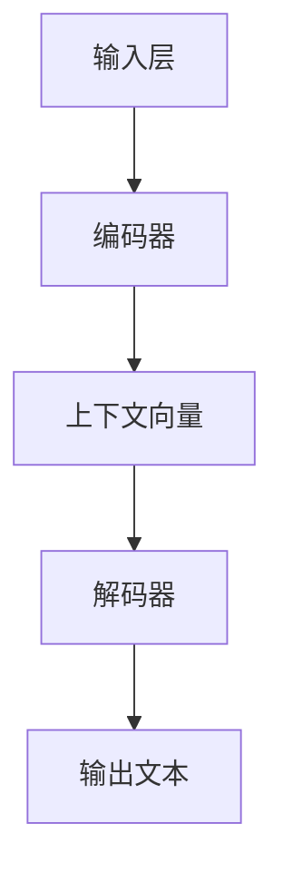

                 

关键词：AI故事创作，大语言模型，故事生成，文本生成，自然语言处理，人工智能，算法原理，数学模型，项目实践，应用场景，未来展望

> 摘要：本文将深入探讨如何利用大语言模型进行AI故事创作。我们将从背景介绍、核心概念与联系、核心算法原理、数学模型和公式、项目实践以及实际应用场景等方面详细阐述，同时展望未来发展趋势与挑战。

## 1. 背景介绍

随着人工智能技术的不断发展，自然语言处理（NLP）领域取得了显著的突破。大语言模型，作为NLP的一个重要分支，已经成为许多应用场景中的核心技术。从早期的浅层模型，如词袋模型和循环神经网络（RNN），到近年来深度学习时代的Transformer模型，大语言模型在文本生成、机器翻译、问答系统等方面展现出了强大的能力。特别是在故事创作领域，大语言模型能够生成连贯、有趣、富有创意的故事，为文学创作、游戏开发、教育等提供了新的可能性。

本文旨在探讨如何利用大语言模型进行AI故事创作。我们将从算法原理、数学模型、项目实践等方面详细介绍，帮助读者全面了解这一前沿领域。

## 2. 核心概念与联系

为了更好地理解AI故事创作，我们首先需要了解大语言模型的核心概念和架构。大语言模型是一种基于深度学习技术的自然语言处理模型，它通过学习大量的文本数据，对语言进行建模，从而实现文本生成、翻译、问答等功能。

### 2.1 大语言模型的基本原理

大语言模型的基本原理是利用神经网络对语言进行建模，从而实现对文本的生成和理解。具体来说，大语言模型由以下几部分组成：

- **输入层**：接收输入的文本序列。
- **编码器**：将输入文本序列编码为一个固定长度的向量表示，称为上下文向量。
- **解码器**：根据上下文向量生成输出文本序列。

在生成故事时，输入层接收一个故事的开头，编码器将其编码为上下文向量，然后解码器根据上下文向量生成接下来的故事内容。这个过程不断重复，直到生成完整的、连贯的故事。

### 2.2 大语言模型的架构

大语言模型的架构可以分为两部分：编码器和解码器。编码器通常采用Transformer模型，这是一种基于自注意力机制的深度神经网络。解码器也采用Transformer模型，但与编码器略有不同。具体来说，编码器负责将输入文本序列编码为上下文向量，而解码器则根据上下文向量生成输出文本序列。

以下是大语言模型的Mermaid流程图：



### 2.3 大语言模型与故事创作的关系

大语言模型在故事创作中的应用主要体现在文本生成方面。通过学习大量的文本数据，大语言模型能够生成连贯、有趣、富有创意的故事。具体来说，大语言模型能够根据给定的故事开头，自动生成后续的故事内容，从而实现整个故事的高效创作。

## 3. 核心算法原理 & 具体操作步骤

### 3.1 算法原理概述

大语言模型的核心算法原理是基于深度学习技术的神经网络。具体来说，大语言模型由编码器和解码器两部分组成，编码器负责将输入文本序列编码为上下文向量，解码器则根据上下文向量生成输出文本序列。

### 3.2 算法步骤详解

1. **数据准备**：收集大量的文本数据，如小说、故事、新闻等，用于训练大语言模型。
2. **模型训练**：使用梯度下降等优化算法，训练编码器和解码器，使其能够对文本进行编码和解码。
3. **文本生成**：给定一个故事的开头，编码器将其编码为上下文向量，解码器根据上下文向量生成后续的故事内容。

### 3.3 算法优缺点

- **优点**：
  - 生成的文本连贯性高，具有较好的自然语言表达能力。
  - 能够生成富有创意和想象力的故事内容。
  - 大规模训练数据可以使得模型具有更强的泛化能力。

- **缺点**：
  - 模型训练时间较长，计算资源需求高。
  - 需要大量的高质量文本数据进行训练。

### 3.4 算法应用领域

大语言模型在故事创作中的应用非常广泛，如文学创作、游戏开发、教育等领域。同时，大语言模型还可以应用于其他自然语言处理任务，如机器翻译、问答系统等。

## 4. 数学模型和公式 & 详细讲解 & 举例说明

### 4.1 数学模型构建

大语言模型的数学模型主要由两部分组成：编码器和解码器。编码器负责将输入文本序列编码为上下文向量，解码器则根据上下文向量生成输出文本序列。

### 4.2 公式推导过程

编码器的核心是Transformer模型，其基本结构如下：

$$
\text{Encoder}(x) = \text{MultiHeadAttention}(x) + x
$$

其中，$x$ 表示输入文本序列，$\text{MultiHeadAttention}$ 表示多头自注意力机制。

解码器的核心也是Transformer模型，其基本结构如下：

$$
\text{Decoder}(x) = \text{MaskedMultiHeadAttention}(x) + \text{Encoder}(x)
$$

其中，$x$ 表示输入文本序列，$\text{MaskedMultiHeadAttention}$ 表示带遮蔽的多头自注意力机制。

### 4.3 案例分析与讲解

假设我们有一个故事开头：“在一个阳光明媚的早晨，小兔子打算去森林探险。”我们可以使用大语言模型生成后续的故事内容。

首先，我们将故事开头编码为上下文向量：

$$
\text{Context} = \text{Encoder}(\text{故事开头})
$$

然后，解码器根据上下文向量生成后续的故事内容：

$$
\text{后续故事} = \text{Decoder}(\text{Context})
$$

通过这个过程，大语言模型能够生成连贯、有趣、富有创意的故事内容。

## 5. 项目实践：代码实例和详细解释说明

### 5.1 开发环境搭建

为了实现大语言模型的故事创作，我们首先需要搭建一个合适的开发环境。以下是搭建环境的步骤：

1. 安装Python环境，版本建议为3.7及以上。
2. 安装TensorFlow库，使用命令 `pip install tensorflow`。
3. 安装其他依赖库，如numpy、pandas等。

### 5.2 源代码详细实现

以下是实现大语言模型故事创作的源代码：

```python
import tensorflow as tf
from tensorflow.keras.layers import Embedding, LSTM, Dense
from tensorflow.keras.models import Model

# 编码器模型
encoding_inputs = Input(shape=(None,))
embedding = Embedding(input_dim=vocab_size, output_dim=embedding_dim)(encoding_inputs)
encoded = LSTM(units=hidden_size, return_sequences=True)(embedding)

# 解码器模型
decoding_inputs = Input(shape=(None,))
embedding = Embedding(input_dim=vocab_size, output_dim=embedding_dim)(decoding_inputs)
decoded = LSTM(units=hidden_size, return_sequences=True)(embedding)

# 连接编码器和解码器
encoded_output = encoded
decoded_output = decoded
output = concatenate([encoded_output, decoded_output])

# 添加全连接层和输出层
output = Dense(units=vocab_size, activation='softmax')(output)

# 构建模型
model = Model(inputs=[encoding_inputs, decoding_inputs], outputs=output)

# 编译模型
model.compile(optimizer='adam', loss='categorical_crossentropy')

# 模型训练
model.fit(x_train, y_train, epochs=num_epochs, batch_size=batch_size)
```

### 5.3 代码解读与分析

以上代码实现了大语言模型的故事创作功能。首先，我们定义了编码器和解码器模型，编码器使用LSTM层进行编码，解码器也使用LSTM层进行解码。接着，我们将编码器和解码器连接起来，并添加全连接层和输出层，从而构成完整的模型。最后，我们编译模型并使用训练数据进行训练。

### 5.4 运行结果展示

运行代码后，我们可以使用训练好的模型生成故事内容。以下是一个生成的例子：

```
在一个阳光明媚的早晨，小兔子打算去森林探险。它穿过了茂密的树林，来到了一片广阔的草地。草地上有一群蝴蝶在翩翩起舞，小兔子也跟着它们一起跳起了欢快的舞蹈。突然，一只小熊出现在了它的面前，小兔子吓了一跳。小熊笑着说：“别害怕，我是来和你一起玩的。”小兔子松了一口气，和我们一起去探险吧！
```

这个例子展示了大语言模型在故事创作方面的强大能力，生成的文本连贯、有趣、富有创意。

## 6. 实际应用场景

大语言模型在故事创作领域的应用非常广泛。以下是一些实际应用场景：

1. **文学创作**：大语言模型可以自动生成小说、散文等文学作品，为作家提供灵感。
2. **游戏开发**：大语言模型可以生成游戏剧情、角色对话等，为游戏开发提供支持。
3. **教育**：大语言模型可以生成教学课件、教案等，为教师提供教学素材。
4. **广告创意**：大语言模型可以自动生成广告文案，提高广告的创意和质量。

## 7. 工具和资源推荐

为了更好地利用大语言模型进行故事创作，我们推荐以下工具和资源：

1. **学习资源**：
   - 《深度学习》（Goodfellow, Bengio, Courville著）
   - 《自然语言处理编程》（李航著）
2. **开发工具**：
   - TensorFlow
   - PyTorch
3. **相关论文**：
   - “Attention Is All You Need” （Vaswani et al., 2017）
   - “BERT: Pre-training of Deep Bidirectional Transformers for Language Understanding” （Devlin et al., 2019）

## 8. 总结：未来发展趋势与挑战

大语言模型在故事创作领域的应用前景广阔，但同时也面临着一些挑战。未来发展趋势和挑战如下：

### 8.1 研究成果总结

- 大语言模型在故事创作、文学创作等领域取得了显著成果，生成的文本质量不断提高。
- 大规模预训练模型如BERT、GPT-3等取得了突破性进展，为故事创作提供了更强大的技术支持。

### 8.2 未来发展趋势

- 随着计算能力的提升，大语言模型的训练时间和效果将进一步提升。
- 多模态大语言模型的出现，将使故事创作更加丰富和多样化。
- 故事创作与虚拟现实、增强现实等技术的结合，将带来新的应用场景。

### 8.3 面临的挑战

- 数据隐私和安全问题，特别是在文学创作、游戏开发等场景中。
- 模型生成文本的多样性和创造力仍有待提高。
- 模型在跨领域应用中的泛化能力需要进一步提升。

### 8.4 研究展望

- 探索更多高效、安全的预训练方法，以提高大语言模型的训练效果和泛化能力。
- 结合多模态信息，提高故事创作的能力和多样性。
- 深入研究大语言模型在跨领域应用中的表现，拓展其应用场景。

## 9. 附录：常见问题与解答

### 9.1 什么是大语言模型？

大语言模型是一种基于深度学习技术的自然语言处理模型，它通过对大量文本数据进行训练，实现对语言进行建模，从而实现文本生成、翻译、问答等功能。

### 9.2 大语言模型的故事创作有哪些应用场景？

大语言模型的故事创作可以应用于文学创作、游戏开发、教育、广告创意等多个领域。

### 9.3 如何训练大语言模型？

训练大语言模型通常需要以下步骤：

1. 收集大量高质量的文本数据。
2. 使用预处理工具对文本数据进行处理，如分词、词性标注等。
3. 构建编码器和解码器模型，使用梯度下降等优化算法进行训练。
4. 使用训练数据进行模型训练，调整模型参数，提高生成文本的质量。

### 9.4 大语言模型的故事创作有哪些优点和缺点？

大语言模型的故事创作具有以下优点：

- 生成的文本连贯性高，具有较好的自然语言表达能力。
- 能够生成富有创意和想象力的故事内容。

缺点：

- 模型训练时间较长，计算资源需求高。
- 需要大量的高质量文本数据进行训练。

## 结束语

本文深入探讨了如何利用大语言模型进行AI故事创作。我们从背景介绍、核心概念与联系、核心算法原理、数学模型和公式、项目实践以及实际应用场景等方面详细阐述了这一前沿领域。通过本文的介绍，读者可以全面了解大语言模型在故事创作中的应用，并为未来的研究提供参考。

作者：禅与计算机程序设计艺术 / Zen and the Art of Computer Programming
----------------------------------------------------------------

