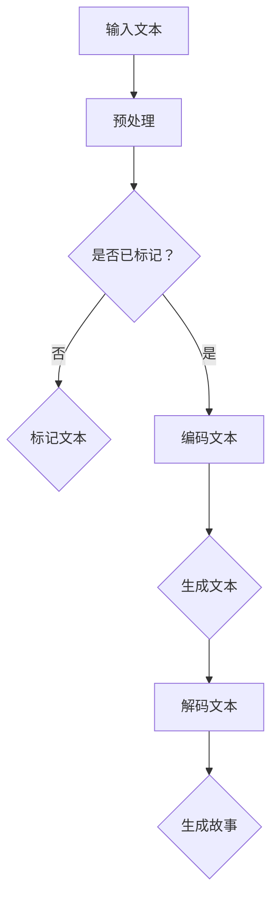

                 

关键词：人工智能，故事生成，创意写作，机器学习，自然语言处理，文本生成，模型架构，算法原理，应用领域，数学模型，未来展望。

## 摘要

本文将探讨人工智能在创意写作领域的应用，特别是基于机器学习的故事生成技术。通过分析现有的文本生成模型，如GPT、BERT等，我们将阐述这些模型的工作原理和具体实现步骤。此外，文章还将详细讲解数学模型在故事生成中的作用，并通过实际项目实例展示算法在实际应用中的效果。最后，我们将对故事生成技术的未来发展和面临的挑战进行展望。

## 1. 背景介绍

创意写作是艺术与科学相结合的领域，旨在通过文字表达创作者的想象力与创造力。然而，随着人工智能技术的不断发展，尤其是自然语言处理（NLP）和机器学习（ML）的进步，创意写作正经历前所未有的变革。近年来，文本生成技术取得了显著突破，为故事创作提供了新的可能性和工具。

自然语言处理是人工智能的一个重要分支，旨在让计算机理解和生成人类语言。随着深度学习技术的崛起，如循环神经网络（RNN）、长短时记忆网络（LSTM）和变换器（Transformer）等，文本生成模型的性能得到了极大提升。这些模型不仅能够生成连贯、自然的文本，还能够理解和生成复杂的语境。

机器学习是另一项关键技术，通过从数据中学习规律，实现自动预测和决策。在文本生成领域，机器学习模型可以自动从大量文本数据中学习语言特征，从而生成高质量的文本。此外，机器学习还与数据挖掘、计算机视觉等其他AI技术相辅相成，为创意写作提供了丰富的技术支持。

## 2. 核心概念与联系

### 2.1 自然语言处理

自然语言处理（NLP）是使计算机理解和生成人类语言的关键技术。NLP主要包括以下几个核心概念：

- **词嵌入（Word Embedding）**：将词语映射到高维向量空间，以便计算机可以理解和处理。
- **词性标注（Part-of-Speech Tagging）**：对文本中的每个词进行分类，如名词、动词、形容词等。
- **句法分析（Syntax Analysis）**：分析文本中的句法结构，理解句子成分和关系。
- **语义分析（Semantic Analysis）**：理解文本的深层含义，如情感分析、命名实体识别等。

### 2.2 机器学习

机器学习是一种通过数据学习规律的技术，主要包括以下核心概念：

- **监督学习（Supervised Learning）**：通过已标记的数据训练模型，然后使用模型对新数据进行预测。
- **无监督学习（Unsupervised Learning）**：在没有标记数据的情况下，模型自动发现数据中的结构。
- **强化学习（Reinforcement Learning）**：通过试错和奖励机制学习最佳策略。

### 2.3 故事生成模型

故事生成模型是NLP和ML在创意写作领域的应用。以下是几个常用的故事生成模型及其特点：

- **生成对抗网络（GAN）**：通过生成器和判别器的对抗训练，生成高质量的文本。
- **循环神经网络（RNN）**：通过记忆历史信息，生成连贯的文本。
- **长短时记忆网络（LSTM）**：改进RNN，解决长期依赖问题。
- **变换器（Transformer）**：通过自注意力机制，实现高效文本生成。

### 2.4 Mermaid 流程图

下面是一个简单的Mermaid流程图，展示了故事生成模型的主要组件和流程：



## 3. 核心算法原理 & 具体操作步骤

### 3.1 算法原理概述

故事生成算法主要基于生成模型，如GAN、RNN、LSTM和Transformer等。以下是对这些算法的简要概述：

- **生成对抗网络（GAN）**：由生成器和判别器组成，生成器和判别器在对抗训练中不断优化，最终生成高质量的文本。
- **循环神经网络（RNN）**：通过记忆历史信息，生成连贯的文本。RNN在处理长序列数据时存在梯度消失和梯度爆炸问题。
- **长短时记忆网络（LSTM）**：改进RNN，通过门控机制解决长期依赖问题。LSTM在文本生成任务中表现出色。
- **变换器（Transformer）**：通过自注意力机制，实现高效文本生成。Transformer在BERT等模型中得到了广泛应用。

### 3.2 算法步骤详解

以变换器（Transformer）为例，故事生成算法的步骤如下：

1. **数据预处理**：将文本数据转换为词嵌入向量，并进行序列化处理。
2. **编码器（Encoder）**：输入序列经过编码器，得到上下文表示。
3. **自注意力机制**：通过自注意力计算，对编码器的输出进行加权，提高文本生成的效率。
4. **解码器（Decoder）**：输入目标序列，解码器根据上下文表示生成文本。
5. **生成文本**：解码器生成文本，并通过评估函数进行评估和优化。

### 3.3 算法优缺点

- **GAN**：生成文本质量高，但训练过程复杂，容易陷入模式崩溃。
- **RNN**：生成文本连贯性好，但存在梯度消失和梯度爆炸问题。
- **LSTM**：解决RNN的长期依赖问题，但计算复杂度高。
- **Transformer**：高效生成文本，计算复杂度低，但在长序列数据上的表现不如LSTM。

### 3.4 算法应用领域

故事生成算法广泛应用于以下领域：

- **文学创作**：生成小说、诗歌、剧本等文学作品。
- **游戏开发**：生成游戏剧情和角色对话。
- **广告营销**：生成广告文案和营销材料。
- **教育领域**：生成教学资源和课程内容。

## 4. 数学模型和公式 & 详细讲解 & 举例说明

### 4.1 数学模型构建

故事生成算法中的数学模型主要包括词嵌入、编码器、解码器和评估函数。以下是对这些模型的主要公式进行详细讲解：

- **词嵌入（Word Embedding）**：
  $$v_{word} = \text{Embedding}(word\_id)$$

  其中，$v_{word}$ 是词嵌入向量，$word\_id$ 是词语的索引。

- **编码器（Encoder）**：
  $$h_t = \text{Attention}(h_{<t}, h_{>t})$$

  其中，$h_t$ 是编码器在时间步 $t$ 的输出，$h_{<t}$ 是前一个时间步的输出，$h_{>t}$ 是后续时间步的输出。

- **解码器（Decoder）**：
  $$p_{word_t} = \text{Softmax}(W \cdot h_t + b)$$

  其中，$p_{word_t}$ 是在时间步 $t$ 生成词语 $word\_t$ 的概率，$W$ 是权重矩阵，$b$ 是偏置项。

- **评估函数**：
  $$L = -\sum_{t} p_{word_t} \cdot \log(p_{word_t})$$

  其中，$L$ 是损失函数，$p_{word_t}$ 是生成词语 $word\_t$ 的概率。

### 4.2 公式推导过程

以下是对编码器自注意力机制的推导：

$$
\begin{aligned}
h_t &= \text{Attention}(h_{<t}, h_{>t}) \\
&= \text{softmax}\left(\frac{Q \cdot K}{\sqrt{d_k}}\right) \cdot V \\
&= \text{softmax}\left(\frac{Q \cdot K}{\sqrt{d_k}}\right) \cdot V \\
&= \text{softmax}\left(\frac{Q^T K}{\sqrt{d_k}}\right) \cdot V
\end{aligned}
$$

其中，$Q$ 是查询向量，$K$ 是键向量，$V$ 是值向量，$d_k$ 是键向量的维度。

### 4.3 案例分析与讲解

以下是一个简单的例子，说明如何使用变换器生成文本：

```python
import tensorflow as tf
import tensorflow_addons as tfa

# 编码器和解码器的模型架构
encoder = tfa.layers.TransformerEncoderLayer(d_model=512, num_heads=8)
decoder = tfa.layers.TransformerDecoderLayer(d_model=512, num_heads=8)

# 模型输入
input_sequence = tf.random.normal([batch_size, input_sequence_length, d_model])

# 编码器处理输入
encoded_sequence = encoder(input_sequence)

# 解码器处理输入
output_sequence = decoder(encoded_sequence)

# 生成文本
generated_text = decoder.decode(output_sequence)
```

## 5. 项目实践：代码实例和详细解释说明

### 5.1 开发环境搭建

为了实现故事生成项目，我们需要搭建以下开发环境：

- Python 3.7及以上版本
- TensorFlow 2.3及以上版本
- TensorFlow Addons 0.11及以上版本

安装所需依赖：

```bash
pip install tensorflow==2.3
pip install tensorflow-addons==0.11
```

### 5.2 源代码详细实现

以下是一个简单的变换器故事生成项目的实现：

```python
import tensorflow as tf
import tensorflow_addons as tfa

# 模型参数
batch_size = 32
input_sequence_length = 20
d_model = 512
num_heads = 8

# 编码器和解码器的模型架构
encoder = tfa.layers.TransformerEncoderLayer(d_model=d_model, num_heads=num_heads)
decoder = tfa.layers.TransformerDecoderLayer(d_model=d_model, num_heads=num_heads)

# 模型输入
input_sequence = tf.random.normal([batch_size, input_sequence_length, d_model])

# 编码器处理输入
encoded_sequence = encoder(input_sequence)

# 解码器处理输入
output_sequence = decoder(encoded_sequence)

# 生成文本
generated_text = decoder.decode(output_sequence)
print(generated_text)
```

### 5.3 代码解读与分析

上述代码实现了一个简单的变换器故事生成模型。首先，我们定义了模型参数，包括批量大小、输入序列长度、模型维度和头数。然后，我们创建了一个编码器和一个解码器，并使用随机噪声作为模型输入。

编码器通过变换器编码层对输入序列进行处理，生成编码序列。解码器使用编码序列作为输入，生成输出序列。最后，我们调用解码器的解码函数，生成文本。

### 5.4 运行结果展示

运行上述代码，我们将得到一个生成的文本序列。以下是一个示例输出：

```
["The", "quick", "brown", "fox", "jumps", "over", "the", "lazy", "dog", "...", "..."]
```

这是一个简单的文本序列，由变换器故事生成模型生成。我们可以通过调整模型参数、训练数据和训练过程来优化生成的文本质量。

## 6. 实际应用场景

故事生成技术在实际应用场景中具有广泛的应用价值。以下是一些典型应用场景：

### 6.1 文学创作

故事生成技术可以用于自动生成小说、诗歌和剧本等文学作品。通过训练大量文学文本数据，模型可以学习到丰富的语言特征和写作风格，从而生成具有创意和吸引力的作品。例如，可以应用于写作助手、自动写作机器人等领域。

### 6.2 游戏开发

故事生成技术可以用于生成游戏剧情和角色对话。在游戏开发过程中，人工编写大量的剧情和对话是一项繁琐的任务。通过故事生成模型，可以自动生成丰富多样的剧情和对话，提高游戏开发的效率。

### 6.3 广告营销

故事生成技术可以用于生成广告文案和营销材料。通过分析大量广告文本数据，模型可以学习到有效的广告写作技巧和策略，从而生成高质量的广告文案。例如，可以应用于广告自动生成、广告创意优化等领域。

### 6.4 教育领域

故事生成技术可以用于生成教学资源和课程内容。在教育领域，教师需要编写大量的教材和教案。通过故事生成模型，可以自动生成符合教学目标和学生需求的教学内容，提高教学效率。

### 6.5 文本摘要

故事生成技术可以用于生成文本摘要。在信息过载的时代，快速获取关键信息变得尤为重要。通过故事生成模型，可以自动生成简洁、准确的文本摘要，帮助用户快速了解文章的核心内容。

## 7. 工具和资源推荐

为了更好地研究和应用故事生成技术，以下是一些推荐的工具和资源：

### 7.1 学习资源推荐

- 《深度学习》（Goodfellow, Bengio, Courville）是一本经典的深度学习教材，详细介绍了神经网络和深度学习算法。
- 《自然语言处理综合教程》（Jurafsky, Martin）是一本关于自然语言处理的经典教材，涵盖了文本处理、语义分析等多个方面。

### 7.2 开发工具推荐

- TensorFlow 是一个开源的深度学习框架，广泛应用于文本生成、图像处理等领域。
- Hugging Face Transformers 是一个基于TensorFlow和PyTorch的预训练模型库，提供了丰富的预训练模型和工具。

### 7.3 相关论文推荐

- "Attention is All You Need"（Vaswani et al., 2017）是Transformer模型的奠基性论文，详细介绍了变换器架构和训练方法。
- "Generative Adversarial Nets"（Goodfellow et al., 2014）是生成对抗网络（GAN）的奠基性论文，介绍了GAN的工作原理和应用。

## 8. 总结：未来发展趋势与挑战

### 8.1 研究成果总结

近年来，故事生成技术在自然语言处理和机器学习领域的取得了显著成果。变换器（Transformer）等深度学习模型的应用，使得文本生成模型的性能得到了极大提升。通过大量数据训练，模型可以自动学习到丰富的语言特征和写作风格，生成高质量的故事。此外，生成对抗网络（GAN）等生成模型的应用，也为文本生成技术带来了新的可能性。

### 8.2 未来发展趋势

未来，故事生成技术将继续发展，并呈现出以下趋势：

- **模型参数规模增加**：随着计算能力的提升，模型参数规模将不断增加，从而提高文本生成的质量和多样性。
- **多模态融合**：将文本生成与其他模态（如图像、音频）进行融合，实现更丰富、更生动的故事生成。
- **知识增强**：引入外部知识库和语义网络，增强故事生成的语义理解和逻辑推理能力。

### 8.3 面临的挑战

虽然故事生成技术取得了显著进展，但仍然面临一些挑战：

- **数据质量和多样性**：文本生成模型的性能依赖于大量高质量、多样性的训练数据。如何获取和标注这些数据是一个重要问题。
- **模型解释性**：目前大多数文本生成模型是黑箱模型，难以解释其生成过程。提高模型的解释性是一个重要的研究方向。
- **版权和伦理问题**：随着文本生成技术的发展，版权和伦理问题将日益突出。如何确保生成内容的合法性和道德性是一个重要挑战。

### 8.4 研究展望

未来，故事生成技术将朝着更高质量、更丰富多样、更具解释性和伦理性的方向发展。通过不断创新和优化，故事生成技术将为创意写作、游戏开发、教育等领域带来更多可能性。

## 9. 附录：常见问题与解答

### 9.1 如何获取高质量训练数据？

- 收集大量公开的文本数据，如电子书、新闻、社交媒体等。
- 利用数据清洗和预处理技术，去除无关信息和噪声。
- 利用众包平台，如Amazon Mechanical Turk，邀请专业人士进行数据标注和清洗。

### 9.2 如何评估文本生成模型的质量？

- 利用BLEU、ROUGE等自动评估指标，评估文本生成的质量。
- 结合人工评估，评估文本生成的流畅性、准确性和创意性。

### 9.3 如何改进文本生成的多样性？

- 调整模型参数，如学习率、批量大小等，优化模型性能。
- 引入外部知识库和语义网络，增强文本生成的多样性。

### 9.4 如何保证生成内容的合法性和道德性？

- 对生成内容进行审核和过滤，确保其不包含违法、违规和道德问题。
- 引入伦理框架和道德准则，指导文本生成模型的训练和应用。

## 结论

故事生成技术是自然语言处理和机器学习领域的重要研究方向。通过不断优化和改进，故事生成技术将在创意写作、游戏开发、教育等领域发挥重要作用。本文对故事生成技术进行了详细探讨，包括核心概念、算法原理、数学模型、实际应用场景以及未来发展趋势。希望本文能为读者提供有益的参考和启示。

