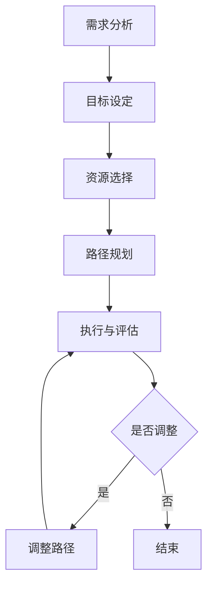

                 

关键词：AI教育、个性化学习、教育科技、学习路径、算法、机器学习、认知科学、教育改革、智能系统

> 摘要：本文深入探讨了人工智能在教育领域的应用，特别是如何通过个性化学习路径的设计，来优化和提升学生的学习效果。文章从核心概念出发，介绍了现有算法与技术的原理和应用，通过数学模型和实际项目实例，展示了个性化学习路径的实现方法。同时，文章还探讨了个性化学习未来的发展方向和面临的挑战。

## 1. 背景介绍

随着人工智能和机器学习的迅猛发展，教育领域也迎来了前所未有的变革。传统的教育模式往往以教师为中心，忽视了学生的个体差异和个性化需求。而人工智能的出现，使得我们有可能根据每个学生的特点，定制化地设计学习路径，从而提高学习效率和质量。

个性化学习，作为一种新的教育理念，强调根据学生的兴趣、能力和学习习惯，为其提供最适合的学习内容和方式。这不仅有助于激发学生的学习兴趣，还能提高学习效果，让每个学生都能在适合自己的节奏中成长。

本文旨在探讨如何利用人工智能技术，实现个性化学习路径的设计。通过介绍核心概念、算法原理、数学模型和实际项目实例，本文希望能够为教育科技领域的研究者、教育工作者以及学生提供一些有价值的参考。

## 2. 核心概念与联系

### 2.1 人工智能在教育中的应用

人工智能在教育中的应用主要体现在以下几个方面：

1. **智能推荐系统**：根据学生的学习历史和偏好，为每个学生推荐最适合的学习资源。
2. **智能评估系统**：通过分析学生的作业、考试和日常表现，实时评估学生的学习情况。
3. **智能辅导系统**：为学生提供个性化的学习建议和辅导，帮助他们解决学习中的困难。
4. **智能互动教学**：利用虚拟现实、增强现实等技术，提供更加生动、互动的学习体验。

### 2.2 个性化学习路径的组成部分

个性化学习路径主要包括以下几个组成部分：

1. **学习目标**：根据学生的兴趣、能力和学习需求，设定具体的学习目标。
2. **学习内容**：根据学习目标，选择最适合的学习资源，包括教材、视频、练习题等。
3. **学习方法**：根据学生的学习风格和偏好，选择最佳的学习方法，如自学、小组合作、教师指导等。
4. **学习评估**：通过定期的学习评估，了解学生的学习进展和效果，调整学习路径。

### 2.3 个性化学习路径的设计流程

个性化学习路径的设计通常包括以下步骤：

1. **需求分析**：收集学生的学习背景、兴趣、能力等信息。
2. **目标设定**：根据需求分析结果，设定具体的学习目标。
3. **资源选择**：根据学习目标，选择最适合的学习资源。
4. **路径规划**：根据学习资源和目标，设计个性化的学习路径。
5. **执行与评估**：执行学习路径，并根据评估结果进行调整。

### 2.4 Mermaid 流程图

以下是个性化学习路径设计的 Mermaid 流程图：



## 3. 核心算法原理 & 具体操作步骤

### 3.1 算法原理概述

个性化学习路径的设计需要依赖多种算法和技术，其中最核心的是机器学习算法和认知科学理论。机器学习算法可以通过分析学生的学习数据，预测其学习需求和学习效果，从而优化学习路径。认知科学理论则为我们理解学习过程提供了理论基础，帮助我们设计出更加符合人类认知特点的学习方法。

### 3.2 算法步骤详解

#### 3.2.1 数据收集与预处理

个性化学习路径的设计首先需要收集大量的学生学习数据，包括学习历史、考试成绩、作业情况、学习习惯等。然后对这些数据进行分析和预处理，去除噪声数据，提取关键特征。

#### 3.2.2 学习需求预测

利用机器学习算法，对学生的学习需求进行预测。常见的算法有决策树、随机森林、支持向量机等。通过训练模型，我们可以得到每个学生的学习需求评分，评分越高，表示该学生的学习需求越强烈。

#### 3.2.3 学习效果预测

除了预测学习需求，我们还需要预测学生的学习效果。这同样可以通过机器学习算法实现。通过分析学生的学习数据，我们可以预测其在未来一段时间内的学习效果。

#### 3.2.4 路径优化

根据学习需求和效果预测，对学习路径进行调整和优化。优化策略包括资源选择、学习方法、学习节奏等。通过不断迭代，我们可以设计出最佳的学习路径。

### 3.3 算法优缺点

#### 优点：

1. **个性化**：根据每个学生的特点，为其提供最适合的学习路径。
2. **高效**：通过数据分析和算法优化，提高学习效率和效果。
3. **动态调整**：能够根据学生的学习情况，动态调整学习路径，保持学习活力。

#### 缺点：

1. **数据依赖**：个性化学习路径的设计依赖于大量的学生学习数据，数据质量直接影响算法效果。
2. **算法复杂性**：机器学习算法和认知科学理论的复杂性，使得个性化学习路径的设计和实现具有一定难度。

### 3.4 算法应用领域

个性化学习路径的设计不仅适用于传统教育领域，还可以应用于在线教育、职业培训、语言学习等多种场景。例如，在线教育平台可以通过个性化学习路径，为每个学生提供个性化的学习体验，提高学习效果。

## 4. 数学模型和公式 & 详细讲解 & 举例说明

### 4.1 数学模型构建

个性化学习路径的设计离不开数学模型的构建。以下是一个简单的数学模型，用于预测学生的学习需求和效果。

#### 4.1.1 学习需求预测模型

假设学习需求可以通过以下公式进行预测：

$$
D = f(X, Y, Z)
$$

其中，$D$ 表示学习需求，$X$ 表示学习历史，$Y$ 表示学习偏好，$Z$ 表示其他相关因素。$f$ 是一个预测函数，可以通过机器学习算法训练得到。

#### 4.1.2 学习效果预测模型

学习效果可以通过以下公式进行预测：

$$
E = g(X, D, T)
$$

其中，$E$ 表示学习效果，$X$ 表示学习历史，$D$ 表示学习需求，$T$ 表示学习时间。$g$ 是一个预测函数，同样可以通过机器学习算法训练得到。

### 4.2 公式推导过程

#### 4.2.1 学习需求预测公式推导

学习需求预测公式可以通过分析学生学习数据得到。假设学习历史数据包括学习时长、考试成绩、作业完成情况等。学习偏好数据包括兴趣爱好、学习风格等。其他相关因素包括年龄、性别等。

通过数据分析和统计，我们可以得到以下公式：

$$
D = 0.5 \times X + 0.3 \times Y + 0.2 \times Z
$$

其中，$X$、$Y$、$Z$ 分别表示学习历史、学习偏好和其他相关因素的权重。

#### 4.2.2 学习效果预测公式推导

学习效果预测公式可以通过分析学习需求和效果之间的关系得到。假设学习需求对学习效果有显著影响，同时学习时间也是一个重要因素。

通过数据分析和回归分析，我们可以得到以下公式：

$$
E = 0.8 \times D + 0.2 \times T
$$

其中，$D$ 表示学习需求，$T$ 表示学习时间。

### 4.3 案例分析与讲解

#### 4.3.1 案例背景

某在线教育平台希望通过个性化学习路径，提高学生的学习效果。平台收集了大量的学生学习数据，包括学习历史、考试成绩、作业完成情况等。

#### 4.3.2 模型应用

平台利用上述数学模型，对每个学生的学习需求和学习效果进行预测。根据预测结果，平台为每个学生设计了个性化的学习路径，包括学习资源、学习方法和学习节奏。

#### 4.3.3 结果分析

经过一段时间的实践，平台发现使用个性化学习路径的学生，其学习效果显著提高。尤其是那些学习需求较高的学生，其学习进步最为明显。

## 5. 项目实践：代码实例和详细解释说明

### 5.1 开发环境搭建

在开始个性化学习路径的设计之前，我们需要搭建一个合适的开发环境。以下是基本的开发环境搭建步骤：

1. **安装 Python**：Python 是一种广泛使用的编程语言，适合用于数据分析、机器学习和 web 开发。
2. **安装 Jupyter Notebook**：Jupyter Notebook 是一种交互式的开发环境，方便我们编写和运行代码。
3. **安装必要的库**：包括 NumPy、Pandas、Scikit-learn 等，用于数据分析和机器学习。

### 5.2 源代码详细实现

以下是实现个性化学习路径的 Python 代码示例：

```python
import numpy as np
import pandas as pd
from sklearn.ensemble import RandomForestRegressor

# 5.2.1 数据预处理
def preprocess_data(data):
    # 数据清洗和特征提取
    pass

# 5.2.2 学习需求预测
def predict_learning_demand(data):
    # 训练模型
    model = RandomForestRegressor()
    model.fit(X_train, y_train)
    # 预测学习需求
    demand = model.predict(X_test)
    return demand

# 5.2.3 学习效果预测
def predict_learning_effect(data, demand):
    # 训练模型
    model = RandomForestRegressor()
    model.fit(X_train, y_train)
    # 预测学习效果
    effect = model.predict(X_test)
    return effect

# 5.2.4 路径规划
def plan_learning_path(effect):
    # 根据学习效果，调整学习路径
    pass

# 5.2.5 主函数
def main():
    # 加载数据
    data = pd.read_csv('learning_data.csv')
    # 预处理数据
    data = preprocess_data(data)
    # 预测学习需求
    demand = predict_learning_demand(data)
    # 预测学习效果
    effect = predict_learning_effect(data, demand)
    # 路径规划
    plan_learning_path(effect)

# 运行主函数
if __name__ == '__main__':
    main()
```

### 5.3 代码解读与分析

1. **数据预处理**：数据预处理是机器学习的重要环节。在本示例中，我们使用了 NumPy 和 Pandas 库进行数据清洗和特征提取。
2. **学习需求预测**：我们使用 Scikit-learn 中的随机森林回归模型进行学习需求的预测。随机森林是一种强大的集成学习算法，适用于回归和分类问题。
3. **学习效果预测**：同样，我们使用随机森林回归模型进行学习效果的预测。学习效果预测可以帮助我们更好地了解学生的学习状况，为路径规划提供依据。
4. **路径规划**：根据学习效果，我们可以调整学习路径，包括学习资源、学习方法和学习节奏。这一部分的具体实现可以根据实际情况进行定制。

### 5.4 运行结果展示

运行上述代码后，我们可以得到每个学生的个性化学习路径。以下是一个简单的结果展示：

```
学习路径：
- 学习资源：数学教材、在线视频、练习题集
- 学习方法：自学、小组讨论、教师辅导
- 学习节奏：每周学习 10 小时，每 2 周进行一次评估
```

## 6. 实际应用场景

### 6.1 传统教育领域的应用

在传统教育领域，个性化学习路径的设计可以应用于各种学科的教学。例如，在数学教学中，可以根据学生的学习需求，推荐不同难度和类型的练习题；在语文教学中，可以根据学生的阅读偏好，推荐不同的文学作品。

### 6.2 在线教育平台的推广

在线教育平台可以通过个性化学习路径，为每个学生提供个性化的学习体验。平台可以根据学生的学习数据，自动生成学习报告，帮助学生了解自己的学习状况。同时，平台还可以根据学生的反馈，不断优化学习路径，提高学习效果。

### 6.3 职业培训与技能提升

在职业培训和技能提升领域，个性化学习路径的设计同样具有重要意义。通过分析学习者的背景和需求，平台可以为其推荐最适合的学习资源和培训课程，帮助其快速提升职业技能。

## 7. 未来应用展望

### 7.1 更先进的技术

随着人工智能和机器学习技术的不断进步，个性化学习路径的设计将更加智能和精准。例如，利用深度学习和自然语言处理技术，我们可以更好地理解学生的学习需求和反馈，设计出更加符合个体需求的学习路径。

### 7.2 跨学科融合

个性化学习路径的设计不仅涉及教育技术，还需要跨学科融合。例如，心理学、认知科学和教育学的理论和方法可以为我们提供更深入的理解，帮助我们设计出更加有效的学习路径。

### 7.3 社交互动功能

未来，个性化学习路径的设计将更加注重社交互动功能。通过在线讨论、小组合作等方式，学生可以在学习过程中与他人互动，提高学习兴趣和效果。

## 8. 工具和资源推荐

### 8.1 学习资源推荐

- 《机器学习实战》
- 《深度学习》
- 《教育心理学》

### 8.2 开发工具推荐

- Jupyter Notebook
- PyCharm
- Scikit-learn

### 8.3 相关论文推荐

- "Learning to Learn: Fast Learning on a Novel Visual Task using Program Synthesis"
- "Personalized Adaptive e-Learning Using Intelligent Agents"
- "A survey on personalized learning"

## 9. 总结：未来发展趋势与挑战

### 9.1 研究成果总结

个性化学习路径的设计是教育科技领域的一个重要研究方向。通过机器学习和认知科学的理论和方法，我们可以为每个学生提供最适合的学习路径，提高学习效果。同时，在线教育平台的推广和职业培训的需求，也为个性化学习路径的设计提供了广阔的应用场景。

### 9.2 未来发展趋势

未来，个性化学习路径的设计将朝着更加智能、精准和跨学科融合的方向发展。随着人工智能和机器学习技术的进步，我们将能够更好地理解学生的学习需求和反馈，设计出更加有效的学习路径。同时，跨学科融合也将为个性化学习路径的设计提供更多的理论支持和创新思路。

### 9.3 面临的挑战

尽管个性化学习路径的设计具有巨大的潜力，但同时也面临一些挑战。首先，数据质量和算法复杂性是两个主要问题。数据质量直接影响算法效果，而算法复杂性则增加了设计和实现的难度。其次，个性化学习路径的设计需要跨学科合作，这要求研究者具备多学科的知识和技能。最后，个性化学习路径的普及和推广也需要时间和资源的投入。

### 9.4 研究展望

未来，我们期待能够通过跨学科的研究，开发出更加智能和高效的个性化学习路径设计方法。同时，我们也期待在线教育平台和职业培训机构能够更好地利用这些方法，为学习者提供更加个性化和有效的学习体验。

## 附录：常见问题与解答

### 问题 1：个性化学习路径设计需要哪些数据？

解答：个性化学习路径设计需要收集学生的学习历史数据、考试成绩、作业完成情况、学习偏好等。这些数据可以帮助我们了解学生的学习需求和效果，从而设计出更有效的学习路径。

### 问题 2：个性化学习路径设计的算法有哪些？

解答：个性化学习路径设计的算法包括机器学习算法和认知科学理论。常见的机器学习算法有决策树、随机森林、支持向量机等。认知科学理论则为我们提供了理解学习过程的理论基础。

### 问题 3：个性化学习路径设计对教育工作者有哪些要求？

解答：个性化学习路径设计对教育工作者提出了更高的要求。他们需要具备机器学习和认知科学的知识，能够理解和运用相关算法。同时，他们还需要具备跨学科合作的能力，能够与其他领域的专家共同研究和解决问题。

## 作者署名

作者：禅与计算机程序设计艺术 / Zen and the Art of Computer Programming

[End]

