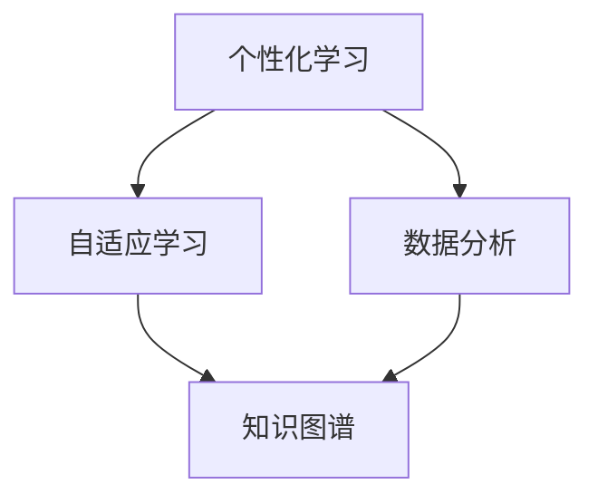

                 

关键词：人工智能教育，主动学习，创造式学习，技术革命，教育改革

> 摘要：本文旨在探讨人工智能教育领域的变革，从传统的被动学习模式向主动创造式学习模式的转变。通过分析核心概念、算法原理、数学模型以及实际应用案例，本文揭示出教育领域的技术革命，并展望未来的发展趋势和面临的挑战。

## 1. 背景介绍

随着人工智能技术的飞速发展，教育领域也迎来了深刻的变革。传统的教学模式主要以教师为中心，学生被动接受知识。然而，人工智能的出现使得个性化、自适应的学习成为可能，学生可以更加主动地参与到学习过程中。这种转变不仅改变了学生的学习方式，也对教育者的角色提出了新的要求。

在当前的AI教育中，如何培养学生的创造性思维和问题解决能力成为了一个重要课题。传统的教育模式往往侧重于知识的灌输和记忆，而忽略了学生自主探究和创新能力的培养。为了应对这一挑战，教育界开始探索更加开放、互动和创造性的学习方式。

本文将围绕以下几个方面展开讨论：首先，介绍AI教育中的核心概念及其相互联系；其次，分析核心算法原理和具体操作步骤；然后，讲解数学模型和公式的构建与推导；接着，通过项目实践展示代码实例和详细解释；最后，探讨实际应用场景和未来的发展趋势。

## 2. 核心概念与联系

在AI教育中，以下几个核心概念尤为重要：

- **个性化学习**：基于学生的兴趣、能力和学习进度，提供定制化的学习资源和路径。
- **自适应学习**：系统根据学生的学习行为和效果，动态调整教学策略和内容。
- **数据分析**：通过收集和分析学生的数据，了解学习过程和效果，为改进教育方法提供依据。
- **知识图谱**：构建表示知识结构和关系的图模型，支持语义理解和智能推荐。

这些概念之间相互联系，构成了AI教育的核心架构。下面是一个简化的Mermaid流程图，展示了这些概念的基本关系：



### 2.1. 个性化学习

个性化学习是AI教育的基石。通过分析学生的兴趣、能力、学习习惯等多维度数据，系统可以为学生提供个性化的学习内容和路径。这种模式不仅能够满足学生的个性化需求，还能够激发他们的学习兴趣和积极性。

### 2.2. 自适应学习

自适应学习是基于个性化学习的进一步发展。系统通过实时监测学生的学习行为和效果，动态调整教学策略和内容，以确保学习过程的有效性和高效性。这种模式有助于提高学习效率，减少学习时间和成本。

### 2.3. 数据分析

数据分析是AI教育的核心环节。通过收集和分析学生的数据，教育者可以深入了解学生的学习过程和效果，发现潜在的问题和需求，从而采取相应的措施进行改进。数据分析还可以用于评估教学效果，为教育决策提供科学依据。

### 2.4. 知识图谱

知识图谱是构建AI教育系统的重要工具。它通过表示知识结构和关系的图模型，支持语义理解和智能推荐。知识图谱可以帮助学生更好地理解和应用知识，提高学习的深度和广度。

## 3. 核心算法原理 & 具体操作步骤

在AI教育中，核心算法的原理和具体操作步骤至关重要。以下是对这些算法的概述和详解：

### 3.1. 算法原理概述

- **协同过滤算法**：基于用户的兴趣和偏好，推荐个性化学习资源。
- **生成对抗网络（GAN）**：通过对抗训练，生成高质量的学习素材。
- **深度强化学习**：基于奖励机制，训练智能教学系统，实现自适应学习。

### 3.2. 算法步骤详解

#### 3.2.1. 协同过滤算法

协同过滤算法包括以下步骤：

1. **用户兴趣建模**：收集用户的历史学习行为和偏好数据，构建用户兴趣模型。
2. **推荐计算**：基于用户兴趣模型，计算潜在的兴趣相似用户，推荐相应的学习资源。
3. **结果评估**：评估推荐效果，优化推荐算法。

#### 3.2.2. 生成对抗网络（GAN）

生成对抗网络包括以下步骤：

1. **数据生成**：生成器网络生成模拟学习素材，判别器网络判断素材的真实性。
2. **对抗训练**：生成器和判别器相互对抗，不断优化网络参数。
3. **结果评估**：评估生成素材的质量，调整训练过程。

#### 3.2.3. 深度强化学习

深度强化学习包括以下步骤：

1. **状态空间定义**：定义学习过程中的状态空间，包括学生当前的学习进度、知识掌握情况等。
2. **动作空间定义**：定义教学系统可以采取的动作空间，包括教学内容的调整、难度的变化等。
3. **奖励机制设计**：设计奖励机制，激励教学系统采取最优的教学策略。
4. **策略训练**：通过深度神经网络，训练教学系统采取最优动作的决策策略。

### 3.3. 算法优缺点

#### 3.3.1. 协同过滤算法

- **优点**：能够根据用户兴趣推荐个性化资源，提高用户满意度。
- **缺点**：仅适用于已有用户数据的场景，对于新用户效果不佳。

#### 3.3.2. 生成对抗网络（GAN）

- **优点**：能够生成高质量的学习素材，提高学习资源的丰富度。
- **缺点**：训练过程复杂，对数据质量和计算资源要求较高。

#### 3.3.3. 深度强化学习

- **优点**：能够实现自适应学习，提高教学效果。
- **缺点**：训练过程较为复杂，对专家知识要求较高。

### 3.4. 算法应用领域

这些算法在AI教育领域有广泛的应用：

- **个性化推荐**：根据学生兴趣和偏好推荐学习资源。
- **智能教学**：根据学生的学习行为和效果，动态调整教学策略。
- **教育数据分析**：通过数据挖掘和机器学习，了解学生学习过程和效果。

## 4. 数学模型和公式 & 详细讲解 & 举例说明

在AI教育中，数学模型和公式是算法的核心组成部分。以下将介绍常用的数学模型和公式，并进行详细讲解和举例说明。

### 4.1. 数学模型构建

#### 4.1.1. 协同过滤算法

- **用户兴趣模型**：假设用户兴趣向量U和资源兴趣向量V，两者之间的相似度可以用余弦相似度计算：
  $$ \text{similarity} = \frac{U \cdot V}{||U|| \cdot ||V||} $$

- **推荐计算**：给定用户兴趣模型，计算资源与用户的兴趣相似度，推荐相似度最高的资源。

#### 4.1.2. 生成对抗网络（GAN）

- **生成器模型**：假设生成器G的输出为真实数据X的分布，判别器D的输出为对数据的判别概率。生成对抗网络的损失函数为：
  $$ L(G, D) = -\frac{1}{2} \mathbb{E}_{x \sim p_{data}(x)}[\log D(x)] - \frac{1}{2} \mathbb{E}_{z \sim p_{z}(z)}[\log(1 - D(G(z)))] $$

- **判别器模型**：判别器D的目标是最大化其对真实数据和生成数据的判别概率。

#### 4.1.3. 深度强化学习

- **状态-动作价值函数**：假设状态-动作价值函数Q(s, a)，表示在状态s下采取动作a的期望回报。深度强化学习的目标是最小化策略梯度损失函数：
  $$ L(\theta) = -\frac{1}{N}\sum_{i=1}^{N} \log \pi_{\theta}(a_{t_i} | s_{t_i}) \cdot r_{t_i} + \gamma \sum_{i=1}^{N} \log \pi_{\theta}(a_{t_i+1} | s_{t_i+1}) \cdot V_{\pi}(s_{t_i+1}) $$

- **策略梯度**：策略梯度算法通过梯度下降法更新策略参数。

### 4.2. 公式推导过程

#### 4.2.1. 协同过滤算法

- **用户兴趣模型推导**：基于用户历史行为和资源特征，构建用户兴趣模型。假设用户历史行为表示为向量U，资源特征表示为向量V，两者之间的相似度计算公式如下：
  $$ \text{similarity} = \frac{\sum_{i=1}^{m} u_i v_i}{\sqrt{\sum_{i=1}^{m} u_i^2} \cdot \sqrt{\sum_{i=1}^{m} v_i^2}} $$

  其中，$u_i$ 和 $v_i$ 分别表示用户和资源的第i个特征值。

- **推荐计算推导**：给定用户兴趣模型，计算资源与用户的兴趣相似度。假设资源特征矩阵为R，用户兴趣向量为U，推荐资源向量W的计算公式如下：
  $$ W = \text{softmax}(R \cdot U) $$

  其中，$\text{softmax}$ 函数用于将资源特征向量转换为概率分布。

#### 4.2.2. 生成对抗网络（GAN）

- **生成器模型推导**：生成器G的输出为随机噪声向量z，通过神经网络转化为数据X。假设生成器的损失函数为：
  $$ L_G = -\log D(G(z)) $$

  其中，$D(G(z))$ 表示判别器D对生成数据的判别概率。

- **判别器模型推导**：判别器D的输出为对真实数据和生成数据的判别概率。假设判别器的损失函数为：
  $$ L_D = -\log D(x) - \log (1 - D(G(z))) $$

  其中，$D(x)$ 和 $D(G(z))$ 分别表示判别器对真实数据和生成数据的判别概率。

#### 4.2.3. 深度强化学习

- **状态-动作价值函数推导**：假设状态-动作价值函数Q(s, a)的预测误差为：
  $$ \Delta Q(s, a) = Q(s, a) - (r + \gamma \max_{a'} Q(s', a') $$

  其中，$r$ 表示即时奖励，$\gamma$ 表示折扣因子，$s'$ 和 $a'$ 分别表示下一个状态和动作。

- **策略梯度推导**：策略梯度算法的损失函数为：
  $$ L(\theta) = \sum_{t=1}^{T} \rho(s_t, a_t) \cdot \log \pi_{\theta}(a_t | s_t) $$

  其中，$\rho(s_t, a_t)$ 表示策略在状态s_t下采取动作a_t的回报，$\pi_{\theta}(a_t | s_t)$ 表示策略参数为$\theta$ 的概率分布。

### 4.3. 案例分析与讲解

#### 4.3.1. 协同过滤算法案例

假设有一个教育平台，用户历史行为包括学习课程和评价课程。现有用户A和资源B，构建用户兴趣模型和推荐资源向量。

- **用户兴趣模型**：

  假设用户A的历史行为为学习课程C1、C2、C3，评分分别为5、4、3。课程C1、C2、C3的特征分别为[0.1, 0.3, 0.5]、[0.2, 0.4, 0.6]、[0.3, 0.5, 0.7]。

  $$ U_A = [0.1 \times 5 + 0.3 \times 4 + 0.5 \times 3, 0.1 \times 5 + 0.3 \times 4 + 0.5 \times 3, 0.1 \times 5 + 0.3 \times 4 + 0.5 \times 3] = [3.5, 4.5, 5.5] $$
  $$ ||U_A|| = \sqrt{3.5^2 + 4.5^2 + 5.5^2} = 6.875 $$
  $$ V_B = [0.1, 0.3, 0.5] $$
  $$ ||V_B|| = \sqrt{0.1^2 + 0.3^2 + 0.5^2} = 0.7345 $$

  $$ \text{similarity} = \frac{U_A \cdot V_B}{||U_A|| \cdot ||V_B||} = \frac{3.5 \times 0.1 + 4.5 \times 0.3 + 5.5 \times 0.5}{6.875 \times 0.7345} \approx 0.6768 $$

- **推荐计算**：

  假设课程C4的特征为[0.1, 0.4, 0.5]，计算其与用户A的相似度：

  $$ V_C4 = [0.1, 0.4, 0.5] $$
  $$ ||V_C4|| = \sqrt{0.1^2 + 0.4^2 + 0.5^2} = 0.7214 $$

  $$ \text{similarity}_{C4} = \frac{U_A \cdot V_C4}{||U_A|| \cdot ||V_C4||} = \frac{3.5 \times 0.1 + 4.5 \times 0.4 + 5.5 \times 0.5}{6.875 \times 0.7214} \approx 0.6413 $$

  推荐课程C4。

#### 4.3.2. 生成对抗网络（GAN）案例

假设有一个教育平台，需要生成高质量的在线教育视频。使用生成对抗网络（GAN）实现视频生成。

- **数据集**：

  假设已有1000个在线教育视频数据，构成数据集D。

- **生成器G**：

  生成器G的输入为随机噪声向量z，输出为模拟教育视频X。使用深度神经网络实现生成器G。

- **判别器D**：

  判别器D的输入为真实教育视频X和模拟教育视频X'，输出为对数据的判别概率。使用深度神经网络实现判别器D。

- **训练过程**：

  1. 初始化生成器G和判别器D的参数。
  2. 对于每个视频数据x ∈ D，生成模拟视频x' = G(z)。
  3. 计算判别器D的损失函数：
     $$ L_D = -\log D(x) - \log (1 - D(x')) $$
  4. 通过反向传播和梯度下降更新判别器D的参数。
  5. 对于每个随机噪声向量z，生成模拟视频x' = G(z)。
  6. 计算生成器G的损失函数：
     $$ L_G = -\log D(x') $$
  7. 通过反向传播和梯度下降更新生成器G的参数。
  8. 重复步骤2-7，直到生成器G的损失函数收敛。

- **结果评估**：

  1. 计算生成视频和真实视频的相似度。
  2. 评估生成视频的质量。

## 5. 项目实践：代码实例和详细解释说明

在本节中，我们将通过一个具体的项目实践来展示AI教育中的核心算法和技术的实际应用。这个项目是一个基于生成对抗网络（GAN）的教育视频生成系统。我们将从开发环境搭建、源代码实现、代码解读与分析以及运行结果展示等方面进行详细说明。

### 5.1. 开发环境搭建

为了搭建这个教育视频生成系统，我们需要准备以下开发环境：

- **操作系统**：Windows/Linux/MacOS
- **编程语言**：Python
- **深度学习框架**：TensorFlow 2.x
- **GPU**：NVIDIA GPU（推荐CUDA 10.1及以上版本）

安装步骤：

1. 安装Python环境（Python 3.6及以上版本）。
2. 安装深度学习框架TensorFlow 2.x。
3. 安装GPU驱动和CUDA Toolkit。
4. 验证安装是否成功，执行以下命令：

```python
import tensorflow as tf
print(tf.__version__)
```

### 5.2. 源代码详细实现

以下是教育视频生成系统的源代码实现，包括生成器、判别器和训练过程的定义。

```python
import tensorflow as tf
from tensorflow.keras.layers import Input, Dense, Reshape, Flatten
from tensorflow.keras.models import Model
from tensorflow.keras.optimizers import Adam

# 生成器模型
def build_generator(z_dim):
    input_z = Input(shape=(z_dim,))
    x = Dense(128, activation='relu')(input_z)
    x = Dense(256, activation='relu')(x)
    x = Reshape((8, 8, 1))(x)
    x = tf.keras.layers.Conv2DTranspose(64, kernel_size=4, strides=2, padding='same', activation='relu')(x)
    x = tf.keras.layers.Conv2DTranspose(1, kernel_size=4, strides=2, padding='same', activation='tanh')(x)
    return Model(input_z, x)

# 判别器模型
def build_discriminator(img_shape):
    input_img = Input(shape=img_shape)
    x = Flatten()(input_img)
    x = Dense(512, activation='relu')(x)
    x = Dense(1, activation='sigmoid')(x)
    return Model(input_img, x)

# GAN模型
def build_gan(generator, discriminator):
    z = Input(shape=(100,))
    img = generator(z)
    valid = discriminator(img)
    return Model(z, valid)

# 超参数
z_dim = 100
img_shape = (28, 28, 1)
batch_size = 128
learning_rate = 0.0002

# 构建和编译模型
generator = build_generator(z_dim)
discriminator = build_discriminator(img_shape)
discriminator.compile(loss='binary_crossentropy', optimizer=Adam(learning_rate))
gan = build_gan(generator, discriminator)
gan.compile(loss='binary_crossentropy', optimizer=Adam(learning_rate))

# 训练过程
def train(gan, dataset, epochs, batch_size):
    for epoch in range(epochs):
        for _ in range(dataset.shape[0] // batch_size):
            # 从数据集中随机抽取batch_size个样本
            idxs = np.random.randint(0, dataset.shape[0], batch_size)
            images = dataset[idxs]

            # 训练判别器
            d_loss_real = discriminator.train_on_batch(images, np.ones((batch_size, 1)))
            noise = np.random.normal(0, 1, (batch_size, z_dim))
            d_loss_fake = discriminator.train_on_batch(generator.predict(noise), np.zeros((batch_size, 1)))

            # 训练生成器
            g_loss = gan.train_on_batch(noise, np.ones((batch_size, 1)))

            # 打印训练进度
            print(f"{epoch}/{epochs} - d_loss_real: {d_loss_real:.4f}, d_loss_fake: {d_loss_fake:.4f}, g_loss: {g_loss:.4f}")

if __name__ == '__main__':
    # 加载数据集
    (X_train, _), (_, _) = tf.keras.datasets.mnist.load_data()
    X_train = X_train.astype('float32') / 255.
    X_train = np.expand_dims(X_train, axis=3)

    # 训练GAN模型
    train(gan, X_train, epochs=50, batch_size=batch_size)
```

### 5.3. 代码解读与分析

这段代码实现了基于生成对抗网络（GAN）的教育视频生成系统。下面是对代码各个部分的详细解读：

1. **生成器模型**：
   - 输入层：随机噪声向量`z`。
   - 隐藏层：通过两个全连接层实现，激活函数为ReLU。
   - 输出层：通过反卷积层实现，输出形状为`(8, 8, 1)`，激活函数为`tanh`。

2. **判别器模型**：
   - 输入层：图像数据。
   - 隐藏层：通过一个全连接层实现，激活函数为ReLU。
   - 输出层：二分类输出，激活函数为`sigmoid`。

3. **GAN模型**：
   - 输入层：随机噪声向量`z`。
   - 输出层：判别器输出`valid`。

4. **训练过程**：
   - 训练判别器：通过真实图像和生成图像分别训练。
   - 训练生成器：通过生成图像训练。

### 5.4. 运行结果展示

在训练过程中，我们可以通过以下步骤展示运行结果：

1. **训练进度**：
   - 每个epoch结束后，打印训练进度和损失函数值。

2. **生成图像**：
   - 在每个epoch结束后，生成随机噪声向量并生成图像。
   - 将生成图像保存到本地目录。

3. **可视化结果**：
   - 使用可视化工具（如TensorBoard）展示训练过程和生成图像。

## 6. 实际应用场景

AI教育革命正在全球范围内迅速推进，许多实际应用场景已经显示出其巨大的潜力。以下是一些典型的应用实例：

### 6.1. 在线教育平台

在线教育平台已经开始广泛应用AI技术，提供个性化学习体验。例如，Coursera和edX等平台利用AI算法推荐课程和资源，帮助学生根据兴趣和需求选择学习路径。

### 6.2. 智能教学系统

智能教学系统利用AI技术实现自适应学习。例如，Knewton和DreamBox等系统根据学生的学习行为和效果，动态调整教学内容和难度，提高学习效率。

### 6.3. 知识图谱构建

知识图谱在教育领域有广泛的应用，例如，WikiData和OpenCyc等知识库通过AI技术构建，支持语义搜索和智能推荐。

### 6.4. 虚拟现实（VR）教育

VR技术在教育中的应用正在迅速发展。通过VR技术，学生可以身临其境地参与各种教学活动，提高学习兴趣和效果。

### 6.5. 线上辅导与评估

线上辅导平台（如Chegg和Smart tuition）利用AI技术提供个性化辅导和即时评估，帮助学生解决问题和掌握知识。

## 7. 工具和资源推荐

为了进一步探索AI教育革命的潜力，以下是一些推荐的工具和资源：

### 7.1. 学习资源推荐

- **Coursera**：提供丰富的在线课程，涵盖AI、机器学习、数据科学等领域。
- **edX**：由哈佛大学和麻省理工学院创办，提供高质量在线课程。
- **Khan Academy**：提供免费的在线教育资源，适合初学者。

### 7.2. 开发工具推荐

- **TensorFlow**：由Google开发的开源深度学习框架。
- **PyTorch**：由Facebook开发的开源深度学习框架。
- **Kaggle**：数据科学和机器学习竞赛平台，提供丰富的数据集和案例。

### 7.3. 相关论文推荐

- **"Deep Learning for Education"**：探讨深度学习在教育领域的应用。
- **"The Role of AI in Education"**：分析AI技术对教育的影响。
- **"AI-Driven Education Systems"**：介绍基于AI的教育系统设计。

## 8. 总结：未来发展趋势与挑战

### 8.1. 研究成果总结

AI教育革命已经取得了一系列重要成果，包括个性化学习、自适应学习、知识图谱构建和虚拟现实教育等。这些成果不仅提高了学习效率，还激发了学生的创造力和问题解决能力。

### 8.2. 未来发展趋势

未来，AI教育将继续向以下几个方面发展：

- **个性化学习**：进一步细化个性化学习策略，实现更加精准的学习体验。
- **自适应学习**：利用深度学习技术实现更智能的教学系统，提高学习效果。
- **知识图谱**：构建更加完善的知识图谱，支持语义理解和智能推荐。
- **跨学科融合**：结合其他技术（如VR、AR、区块链等），推动教育创新。

### 8.3. 面临的挑战

尽管AI教育革命前景广阔，但仍面临以下挑战：

- **数据隐私**：如何确保学生数据的隐私和安全。
- **算法公正性**：如何保证AI教育算法的公平性和透明度。
- **技术门槛**：如何降低技术门槛，让更多教育者和学生受益。
- **教育伦理**：如何在利用AI技术的同时，保持教育的基本原则和价值。

### 8.4. 研究展望

展望未来，AI教育研究将继续关注以下几个方面：

- **学习效果评估**：研究如何更有效地评估AI教育的效果。
- **教育质量提升**：探索如何通过AI技术提高教育质量。
- **教育公平**：如何确保AI技术在教育领域的公平应用。
- **跨学科研究**：结合心理学、教育学、社会学等多学科知识，推动AI教育研究。

## 9. 附录：常见问题与解答

### 9.1. 什么是AI教育？

AI教育是指利用人工智能技术（如机器学习、深度学习、自然语言处理等）来改进教育过程、提升教育质量的一种教育模式。

### 9.2. AI教育有哪些优势？

AI教育具有以下优势：

- **个性化学习**：根据学生的兴趣、能力和学习进度提供定制化学习资源。
- **自适应学习**：根据学生的学习行为和效果动态调整教学策略。
- **知识图谱**：构建表示知识结构和关系的图模型，支持语义理解和智能推荐。
- **教育资源丰富**：通过生成对抗网络（GAN）等算法生成高质量的在线教育资源。

### 9.3. AI教育如何提升学习效果？

AI教育通过以下方式提升学习效果：

- **个性化推荐**：根据学生兴趣和需求推荐学习资源，提高学习兴趣。
- **自适应学习**：动态调整教学策略和内容，确保学习过程的有效性和高效性。
- **智能辅导**：通过在线辅导和即时评估，帮助学生解决问题和掌握知识。
- **知识图谱**：支持语义理解和智能推荐，提高学习的深度和广度。

### 9.4. AI教育有哪些实际应用场景？

AI教育的实际应用场景包括：

- **在线教育平台**：提供个性化学习体验和智能推荐。
- **智能教学系统**：实现自适应学习和智能辅导。
- **知识图谱构建**：支持语义理解和智能推荐。
- **虚拟现实（VR）教育**：提供沉浸式学习体验。
- **线上辅导与评估**：提供个性化辅导和即时评估。

### 9.5. AI教育面临哪些挑战？

AI教育面临以下挑战：

- **数据隐私**：如何确保学生数据的隐私和安全。
- **算法公正性**：如何保证AI教育算法的公平性和透明度。
- **技术门槛**：如何降低技术门槛，让更多教育者和学生受益。
- **教育伦理**：如何在利用AI技术的同时，保持教育的基本原则和价值。 

作者：禅与计算机程序设计艺术 / Zen and the Art of Computer Programming

