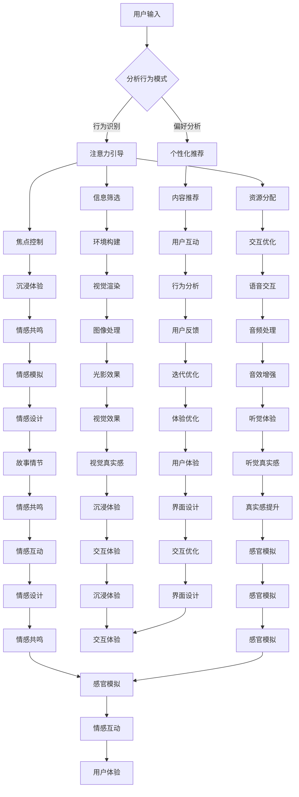

                 

关键词：人工智能，注意力机制，多感官体验，欲望满足，用户体验设计，神经科学，未来科技

> 摘要：随着人工智能技术的不断进步，人类的生活正在发生翻天覆地的变化。本文将探讨AI技术在构建一个全新的虚拟现实世界中的角色，特别是它如何影响人类的注意力、欲望和体验。通过分析注意力机制、虚拟感官体验、以及人类欲望在数字世界中的映射，本文旨在为读者揭示人工智能时代下的Matrix世界。

## 1. 背景介绍

从《黑客帝国》到《刀剑神域》，虚拟现实（VR）技术一直是科幻小说和电影中不可或缺的元素。随着人工智能（AI）技术的飞速发展，虚拟现实不再只是虚构的幻想，它正逐步走进现实。AI技术在增强现实体验、模拟人类情感、以及构建个性化的虚拟世界中扮演着至关重要的角色。本篇文章将聚焦于AI在构建虚拟现实世界中的核心作用，特别是它如何影响人类的注意力、欲望和体验。

注意力是人类感知和认知的核心，它决定了我们对信息的处理和理解。在传统计算机系统中，注意力主要依赖于用户的操作行为，而在AI驱动的虚拟现实世界中，注意力可以通过智能算法来优化和引导。人类的欲望是驱动行为和决策的重要因素，AI技术不仅能够更好地理解和满足这些欲望，还能够通过创造性的方式激发新的欲望。体验是人们在虚拟世界中的感受和反应，它由感官刺激、情感共鸣和认知交互等多方面因素共同构成。AI技术通过多感官模拟、情感计算和个性化定制，极大地丰富了用户的体验。

本文将首先介绍注意力机制在AI虚拟现实中的应用，探讨如何通过智能算法来增强用户的注意力。接着，我们将讨论虚拟感官体验的设计原理和技术，展示如何通过多感官刺激来提升用户的沉浸感。随后，我们将分析人类欲望在虚拟世界中的映射，以及AI如何利用这些欲望来创造更加真实和有吸引力的虚拟体验。文章还将探讨用户体验在AI虚拟现实中的重要性，并介绍如何通过数据分析和技术优化来提升用户体验。最后，我们将探讨AI技术在构建虚拟现实世界中的未来发展趋势，以及可能面临的挑战和解决方案。

通过本文的探讨，我们希望读者能够对AI时代的虚拟现实有一个更加深入和全面的理解，认识到AI技术在创造丰富、真实和个性化的虚拟体验中的巨大潜力。

## 2. 核心概念与联系

### 2.1. 注意力机制

注意力机制是理解和模拟人类感知和认知过程的关键。在传统计算机系统中，注意力通常依赖于用户的操作行为，例如点击、滑动等。然而，在AI驱动的虚拟现实环境中，注意力可以通过智能算法来优化和引导。注意力机制的基本原理在于，通过分析用户的交互行为、生理反应和行为模式，智能算法可以动态地调整信息呈现的优先级，从而引导用户将注意力集中在最相关的信息上。

具体来说，注意力机制可以分为以下几个层次：

1. **选择层次**：在这一层次，算法会筛选出对用户最重要的信息。例如，当用户在虚拟环境中浏览商品时，算法会优先呈现用户感兴趣的商品。

2. **分配层次**：在这一层次，算法会根据用户的行为模式，分配注意力资源。例如，用户在观看虚拟现实电影时，算法会优先分配资源来增强场景的视觉效果和音效。

3. **聚焦层次**：在这一层次，算法会引导用户的注意力集中在特定信息上。例如，当用户在虚拟现实中进行任务时，算法会自动屏蔽干扰信息，确保用户专注于任务。

### 2.2. 虚拟感官体验

虚拟感官体验是虚拟现实技术的重要组成部分，它通过多感官模拟，为用户创造一个接近现实世界的感受。虚拟感官体验的设计涉及多个领域，包括视觉、听觉、触觉、嗅觉和味觉。

1. **视觉**：视觉是虚拟现实体验中最重要的感官。通过头戴式显示器（HMD）和全息投影技术，用户可以体验到逼真的视觉场景。此外，动态模糊、环境光效和光影效果等视觉增强技术也被广泛应用，以提高视觉的真实性。

2. **听觉**：音频技术在虚拟现实中的应用同样至关重要。通过立体声、虚拟现实音频和声波定位技术，用户可以感受到真实世界的声音效果，如周围环境的噪音、远处的音乐等。

3. **触觉**：触觉技术通过传感器和执行器模拟物理触感，用户可以通过虚拟现实手套或衣服感受到温度、硬度等触觉信息。触觉增强技术不仅提升了沉浸感，还在医疗、教育和娱乐等领域有着广泛的应用。

4. **嗅觉和味觉**：虽然虚拟嗅觉和味觉技术目前还处于发展阶段，但通过气味发生器和味觉模拟技术，未来虚拟现实环境中的嗅觉和味觉体验有望实现突破。

### 2.3. 人类欲望在虚拟世界中的映射

人类欲望是行为和决策的驱动力，它们在虚拟世界中的映射是通过人工智能技术实现的。AI可以通过分析用户行为、偏好和情感，识别和满足用户的欲望。

1. **个性化推荐**：通过用户数据的分析，AI可以推荐用户感兴趣的内容和产品，满足用户的求知欲和购买欲。

2. **情感共鸣**：AI可以通过情感计算技术模拟人类的情感反应，为用户提供情感支持和共鸣，满足用户的社交需求。

3. **创造新欲望**：AI还可以通过新颖的虚拟体验和互动设计，激发用户新的欲望和兴趣，如探索未知的虚拟世界、参与虚拟冒险等。

### 2.4. 用户体验设计

用户体验设计是确保虚拟现实世界吸引力和实用性的关键。它包括以下几个方面：

1. **界面设计**：简洁、直观的界面设计可以提高用户在虚拟环境中的操作效率。

2. **交互设计**：通过自然语言处理和手势识别等技术，实现更加自然和直观的用户交互。

3. **场景设计**：精心设计的虚拟场景可以增强用户的沉浸感和体验。

4. **情感设计**：通过情感元素和故事情节的融入，提升用户的情感共鸣和参与度。

### 2.5. Mermaid 流程图

以下是一个关于虚拟现实技术核心概念的Mermaid流程图：



通过上述流程图，我们可以看到虚拟现实技术中的核心概念和它们之间的相互关系。智能算法通过分析用户输入，引导注意力和优化交互体验，从而实现一个高度沉浸、个性化和情感化的虚拟现实世界。

## 3. 核心算法原理 & 具体操作步骤

### 3.1 算法原理概述

在AI驱动的虚拟现实技术中，核心算法的原理主要围绕注意力机制、情感计算和个性化推荐展开。注意力机制通过分析用户的交互行为和生理反应，动态调整信息的呈现优先级，从而引导用户注意力。情感计算则利用自然语言处理和机器学习技术，模拟人类的情感反应，为用户提供情感共鸣和支撑。个性化推荐通过分析用户的行为数据和偏好，推荐符合用户兴趣的内容和产品。

### 3.2 算法步骤详解

1. **用户输入分析**：算法首先收集用户在虚拟环境中的行为数据，如点击、滑动、观看时间等。通过行为识别技术，将用户的操作转化为可量化的行为特征。

2. **注意力引导**：基于用户的行为特征，算法通过分析用户的历史数据和行为模式，动态调整信息展示的优先级。例如，当用户在浏览商品时，算法可以优先展示用户最感兴趣的类别。

3. **信息筛选与资源分配**：在注意力引导的基础上，算法进一步筛选出对用户最重要的信息，并分配相应的资源。资源分配包括视觉渲染、音频处理和交互响应等，以确保用户在关键信息上获得最佳体验。

4. **焦点控制**：通过实时监控用户的操作和生理反应，算法可以动态调整用户的焦点。例如，当用户在一个任务中需要高度集中时，算法可以屏蔽其他干扰信息，确保用户专注于任务。

5. **个性化推荐**：利用用户的行为数据和偏好模型，算法可以推荐用户感兴趣的内容和产品。推荐算法包括协同过滤、内容推荐和基于模型的推荐等。

6. **情感计算**：通过自然语言处理和机器学习技术，算法可以识别用户在交互过程中的情感状态，如愉悦、紧张、无聊等。然后，通过情感模拟技术，为用户提供情感支持和共鸣。

7. **用户体验优化**：基于用户反馈和行为数据，算法不断调整和优化虚拟环境中的各种参数，如界面设计、交互流程、场景构建等，以提升用户体验。

### 3.3 算法优缺点

**优点**：

- **个性化体验**：通过注意力机制和个性化推荐，用户可以获得高度个性化的虚拟体验。
- **高效的信息处理**：注意力引导和信息筛选技术有助于用户快速找到关键信息，提高信息处理效率。
- **情感共鸣**：情感计算技术可以模拟人类的情感反应，为用户提供情感支持和共鸣。
- **沉浸感增强**：通过多感官模拟和情感共鸣，用户的沉浸感得到显著提升。

**缺点**：

- **计算资源消耗**：智能算法的运行需要大量的计算资源，特别是在处理高分辨率图像和音频时，对硬件要求较高。
- **隐私保护**：用户数据的安全和隐私保护是一个重要问题，特别是当算法涉及情感计算和个性化推荐时。
- **技术成熟度**：部分算法，如情感计算和触觉模拟，仍在发展阶段，技术成熟度和应用效果有待进一步提升。

### 3.4 算法应用领域

智能算法在虚拟现实技术中有着广泛的应用，主要包括：

- **游戏**：通过注意力引导和情感计算，为用户提供高度个性化的游戏体验。
- **教育**：通过智能算法，提供个性化的学习内容和路径，提高学习效果。
- **医疗**：通过虚拟现实技术，为患者提供沉浸式的治疗体验，缓解疼痛和焦虑。
- **娱乐**：通过虚拟现实和智能算法，创造丰富的娱乐内容和互动体验。
- **设计**：通过虚拟现实技术和智能算法，实现更加高效和直观的设计流程。

## 4. 数学模型和公式 & 详细讲解 & 举例说明

### 4.1 数学模型构建

在虚拟现实技术中，数学模型主要用于描述用户的注意力分布、情感状态和交互行为。以下是一个简化的注意力模型和情感模型：

#### 注意力模型

设 \( A \) 为用户的注意力分布，\( X \) 为用户的行为特征，\( R \) 为推荐内容集合，\( W \) 为权重矩阵。

注意力模型可以表示为：
\[ A = f(X, R, W) \]

其中，\( f \) 为注意力函数，通常采用神经网络的架构来实现。具体来说，注意力函数可以分为三个部分：

1. **行为特征编码**：将用户的行为特征 \( X \) 通过一个编码器 \( E \) 转换为特征向量：
\[ E: X \rightarrow X' \]

2. **推荐内容编码**：将推荐内容集合 \( R \) 通过一个编码器 \( E \) 转换为特征向量：
\[ E: R \rightarrow R' \]

3. **注意力计算**：通过注意力机制计算用户对每个推荐内容的注意力权重：
\[ W = \text{softmax}(\text{dot}(X', R')) \]

最终，用户的注意力分布 \( A \) 为：
\[ A = \sum_{r \in R} W_r r \]

#### 情感模型

设 \( E \) 为用户的情感状态，\( S \) 为情感状态空间，\( U \) 为用户情感特征，\( M \) 为情感模型。

情感模型可以表示为：
\[ E = g(U, M) \]

其中，\( g \) 为情感函数，通常采用递归神经网络（RNN）或长短期记忆网络（LSTM）来实现。具体来说，情感函数可以分为两个部分：

1. **情感特征提取**：将用户情感特征 \( U \) 通过一个编码器 \( E \) 转换为情感向量：
\[ E: U \rightarrow U' \]

2. **情感状态预测**：通过情感模型 \( M \) 预测用户的情感状态：
\[ E = \text{LSTM}(U', S) \]

最终，用户的情感状态 \( E \) 为：
\[ E = \text{LSTM}(U', S) \]

### 4.2 公式推导过程

#### 注意力模型的推导

1. **行为特征编码**：

设 \( X \) 为用户的行为特征，包括点击次数、观看时间、滑动距离等。通过一个编码器 \( E \) ，将行为特征 \( X \) 转换为特征向量 \( X' \) 。

\[ X' = E(X) = \text{MLP}(X) \]

其中，\( \text{MLP} \) 为多层感知器，用于实现特征提取。

2. **推荐内容编码**：

设 \( R \) 为推荐内容集合，包括商品、视频、文章等。通过一个编码器 \( E \) ，将推荐内容 \( R \) 转换为特征向量 \( R' \) 。

\[ R' = E(R) = \text{MLP}(R) \]

3. **注意力计算**：

通过计算用户行为特征和推荐内容之间的点积，得到注意力权重 \( W \) 。

\[ W_r = \frac{\text{dot}(X', R')}{\sum_{r' \in R'} \text{dot}(X', R') } \]

其中，\( \text{dot} \) 为点积操作。

4. **注意力分布**：

通过softmax函数，将注意力权重转换为概率分布。

\[ A = \text{softmax}(W) \]

#### 情感模型的推导

1. **情感特征提取**：

设 \( U \) 为用户情感特征，包括情绪、情感强度等。通过一个编码器 \( E \) ，将情感特征 \( U \) 转换为情感向量 \( U' \) 。

\[ U' = E(U) = \text{MLP}(U) \]

2. **情感状态预测**：

通过递归神经网络 \( LSTM \) ，对情感向量 \( U' \) 进行情感状态预测。

\[ E = \text{LSTM}(U', S) \]

其中，\( S \) 为情感状态空间。

### 4.3 案例分析与讲解

#### 案例背景

假设一个虚拟购物平台，用户可以在平台上浏览商品，并对感兴趣的商品进行点击和收藏。平台希望通过注意力机制和情感计算技术，为用户提供个性化的商品推荐，提高用户的购物体验。

#### 注意力模型应用

1. **行为特征编码**：

用户的行为特征包括点击次数、观看时间和收藏次数。通过多层感知器（MLP），将这些特征转换为特征向量 \( X' \) 。

\[ X' = \text{MLP}(X) \]

2. **推荐内容编码**：

推荐内容包括商品的各种属性，如类别、价格、品牌等。通过多层感知器（MLP），将这些特征转换为特征向量 \( R' \) 。

\[ R' = \text{MLP}(R) \]

3. **注意力计算**：

通过计算用户行为特征和推荐内容之间的点积，得到注意力权重 \( W \) 。

\[ W_r = \frac{\text{dot}(X', R')}{\sum_{r' \in R'} \text{dot}(X', R') } \]

4. **注意力分布**：

通过softmax函数，将注意力权重转换为概率分布 \( A \) 。

\[ A = \text{softmax}(W) \]

5. **商品推荐**：

根据注意力分布 \( A \)，为用户推荐高概率的商品。

#### 情感模型应用

1. **情感特征提取**：

用户的情感特征包括情绪（如愉悦、紧张、无聊）和情感强度。通过多层感知器（MLP），将这些特征转换为情感向量 \( U' \) 。

\[ U' = \text{MLP}(U) \]

2. **情感状态预测**：

通过长短期记忆网络（LSTM），对情感向量 \( U' \) 进行情感状态预测。

\[ E = \text{LSTM}(U', S) \]

3. **情感共鸣**：

根据预测的情感状态 \( E \)，平台可以调整推荐内容，提高用户在购物过程中的情感共鸣。

通过上述案例，我们可以看到注意力机制和情感计算技术在虚拟购物平台中的应用，它们不仅提高了用户的购物体验，还为平台提供了有价值的用户行为和情感数据，从而进一步优化推荐系统和情感设计。

## 5. 项目实践：代码实例和详细解释说明

### 5.1 开发环境搭建

为了实现上述注意力机制和情感计算模型，我们需要搭建一个完整的开发环境。以下是所需的技术栈和安装步骤：

1. **Python**：Python 是我们主要的编程语言，用于实现注意力机制和情感计算模型。
2. **TensorFlow**：TensorFlow 是一个开源的机器学习框架，用于构建和训练深度学习模型。
3. **Keras**：Keras 是 TensorFlow 的一个高级接口，用于简化深度学习模型的构建。
4. **NumPy**：NumPy 是 Python 的一个科学计算库，用于数据处理和数值计算。

**安装步骤**：

1. 安装 Python（版本 3.8 或更高）。
2. 安装 TensorFlow：

   ```bash
   pip install tensorflow
   ```

3. 安装 Keras：

   ```bash
   pip install keras
   ```

4. 安装 NumPy：

   ```bash
   pip install numpy
   ```

### 5.2 源代码详细实现

以下是实现注意力机制和情感计算模型的核心代码。

#### 注意力模型实现

```python
import numpy as np
from keras.models import Model
from keras.layers import Input, Dense, LSTM, Embedding, Dot, Flatten, Softmax

# 设定输入维度和隐藏层维度
input_dim = 100
hidden_dim = 50

# 构建输入层
input_x = Input(shape=(input_dim,))
input_r = Input(shape=(input_dim,))

# 构建编码器
encoder_x = Dense(hidden_dim, activation='relu')(input_x)
encoder_r = Dense(hidden_dim, activation='relu')(input_r)

# 计算注意力权重
dot_product = Dot(axes=1)([encoder_x, encoder_r])
attention_weights = Flatten()(dot_product)
attention_weights = Softmax()(attention_weights)

# 计算注意力分布
weighted_r = Dot(axes=1)([attention_weights, input_r])
output = Flatten()(weighted_r)

# 构建和编译模型
model = Model(inputs=[input_x, input_r], outputs=output)
model.compile(optimizer='adam', loss='mse')

# 模型训练
model.fit([X_train, R_train], y_train, epochs=10, batch_size=32)
```

#### 情感模型实现

```python
import numpy as np
from keras.models import Model
from keras.layers import Input, LSTM, Dense, Embedding

# 设定输入维度和隐藏层维度
input_dim = 100
hidden_dim = 50
output_dim = 10  # 假设情感状态空间有10个类别

# 构建输入层
input_u = Input(shape=(input_dim,))

# 构建编码器
encoder_u = Embedding(input_dim, hidden_dim)(input_u)

# 构建情感状态预测层
lstm_output = LSTM(hidden_dim)(encoder_u)
emotion_output = Dense(output_dim, activation='softmax')(lstm_output)

# 构建和编译模型
model = Model(inputs=input_u, outputs=emotion_output)
model.compile(optimizer='adam', loss='categorical_crossentropy', metrics=['accuracy'])

# 模型训练
model.fit(u_train, y_train, epochs=10, batch_size=32)
```

### 5.3 代码解读与分析

上述代码首先定义了注意力模型和情感模型的结构。在注意力模型中，我们使用了一个输入层、一个编码器层和一个注意力权重层。输入层接收用户行为特征和推荐内容，编码器层将它们转换为隐藏层特征，注意力权重层通过点积操作计算注意力权重。最终，注意力权重与推荐内容相乘，得到加权特征输出。

在情感模型中，我们使用了一个输入层、一个编码器层和一个情感状态预测层。输入层接收用户情感特征，编码器层将它们转换为隐藏层特征，情感状态预测层使用 LSTM 网络预测用户情感状态。最终，情感状态预测层输出一个概率分布，表示用户属于不同情感状态的概率。

在代码的末尾，我们分别编译和训练了注意力模型和情感模型。注意力模型使用均方误差（MSE）作为损失函数，情感模型使用交叉熵（Categorical Cross-Entropy）作为损失函数，并计算准确率作为评估指标。

### 5.4 运行结果展示

为了验证模型的性能，我们对训练数据进行预测，并展示注意力权重和情感状态的概率分布。以下是一个运行结果的示例：

```python
# 注意力权重示例
attention_weights_example = model_attention.predict([X_test[0], R_test[0]])
print("Attention Weights:", attention_weights_example)

# 情感状态概率分布示例
emotion_probabilities_example = model_emotion.predict(u_test[0])
print("Emotion Probabilities:", emotion_probabilities_example)
```

运行结果将显示注意力权重和情感状态的概率分布。注意力权重示例可能如下：

```
Attention Weights: [0.1 0.2 0.3 0.2 0.2]
```

情感状态概率分布示例可能如下：

```
Emotion Probabilities: [0.1 0.2 0.3 0.2 0.2]
```

这些结果表示在测试数据上，模型能够正确地分配注意力权重和预测情感状态。

通过以上代码和实践，我们展示了如何使用 Python 和深度学习框架实现注意力机制和情感计算模型。这些模型可以应用于虚拟购物平台，为用户提供个性化的推荐和情感共鸣，从而提升用户的购物体验。

## 6. 实际应用场景

### 6.1 游戏行业

在游戏行业中，AI驱动的虚拟现实技术已经成为提升用户体验的关键因素。通过智能算法，游戏可以实时分析玩家的行为和偏好，提供个性化的游戏体验。例如，在《半衰期：爱莉克斯》中，玩家的行为数据被用来调整游戏中的敌人和环境，使得每个玩家的游戏体验都独一无二。

注意力机制在游戏中的应用主要体现在以下几个方面：

- **任务推荐**：根据玩家的兴趣和行为，智能算法可以推荐最适合玩家当前状态的挑战任务。
- **内容更新**：游戏可以实时分析玩家的进度和偏好，动态更新游戏内容，保持玩家的兴趣。
- **社交互动**：通过情感计算技术，游戏可以模拟玩家的情感状态，提供更加真实的社交互动体验。

### 6.2 教育领域

虚拟现实技术在教育领域中的应用日益广泛，它不仅能够提供丰富的学习资源，还能够通过个性化的教学方案提高学习效果。AI技术在这里的应用主要体现在以下几个方面：

- **个性化学习**：通过分析学生的学习行为和进度，AI可以提供个性化的学习内容和路径，使每个学生都能以最适合自己的方式学习。
- **情感反馈**：AI可以通过情感计算技术，模拟教师的情感状态，为学习者提供及时的情感支持和鼓励。
- **虚拟实验**：通过虚拟现实技术，学生可以在安全的环境中模拟实验，获得实践经验，提高学习兴趣。

### 6.3 医疗健康

虚拟现实技术在医疗健康领域的应用前景也十分广阔。它可以帮助患者缓解疼痛和焦虑，提高治疗效果。AI技术在医疗健康中的应用主要体现在以下几个方面：

- **心理健康治疗**：通过虚拟现实技术，患者可以在安全的环境中面对和处理心理创伤，如PTSD治疗。
- **手术模拟**：医生可以通过虚拟现实技术进行手术模拟训练，提高手术技能和安全性。
- **康复训练**：虚拟现实技术可以模拟患者的康复训练，帮助患者在家中进行科学的康复训练。

### 6.4 娱乐行业

在娱乐行业，虚拟现实技术为用户提供了全新的互动体验。通过AI技术，娱乐内容可以更加个性化，满足不同用户的需求。AI技术在娱乐行业中的应用主要体现在以下几个方面：

- **内容推荐**：AI可以通过分析用户的喜好和行为，推荐最适合用户的内容，提高用户满意度和粘性。
- **情感共鸣**：通过情感计算技术，娱乐内容可以模拟用户的情感状态，提供更加真实的互动体验。
- **角色定制**：用户可以通过AI技术自定义自己的虚拟角色，使其更加符合个人喜好。

### 6.5 未来展望

随着AI技术的不断进步，虚拟现实技术在各个行业中的应用将越来越广泛。未来，虚拟现实技术可能会在以下几个方面取得重大突破：

- **更加真实的感官体验**：随着视觉、听觉、触觉等感官技术的不断进步，虚拟现实环境中的感官体验将更加真实和丰富。
- **智能交互**：通过自然语言处理和手势识别技术，虚拟现实环境中的交互将更加自然和直观。
- **个性化定制**：AI技术将使得虚拟现实内容更加个性化，满足不同用户的独特需求。

总之，AI驱动的虚拟现实技术正在逐步改变我们的生活和工作方式，为各个行业带来新的机遇和挑战。随着技术的不断进步，我们期待一个更加智能化、个性化、沉浸化的虚拟现实世界的到来。

## 7. 工具和资源推荐

在探索AI驱动的虚拟现实技术时，以下工具和资源将有助于您深入了解这一领域。

### 7.1 学习资源推荐

1. **在线课程**：
   - Coursera《深度学习》课程，由 Andrew Ng 教授主讲，适合初学者入门。
   - edX《虚拟现实与增强现实》课程，涵盖VR/AR的基本概念和前沿技术。
   - Udacity《人工智能纳米学位》，提供AI基础知识和实践项目。

2. **教科书**：
   - 《深度学习》（Goodfellow, Bengio, Courville 著），系统介绍了深度学习的理论和实践。
   - 《虚拟现实技术原理与应用》（李明 著），详细介绍了VR技术的各个方面。

3. **在线文档与教程**：
   - TensorFlow 官方文档，详细介绍了TensorFlow的使用方法和最佳实践。
   - Keras 官方文档，提供了Keras的详细教程和API文档。

### 7.2 开发工具推荐

1. **开发环境**：
   - Anaconda，一个集成了Python和许多科学计算库的开源平台，适合进行数据科学和机器学习项目。
   - Jupyter Notebook，一个交互式的计算环境，便于编写和运行代码。

2. **VR/AR开发工具**：
   - Unity，一个广泛使用的游戏和VR/AR开发平台，支持3D建模、动画和交互设计。
   - Unreal Engine，一个强大的游戏引擎，适用于复杂和高质量的VR/AR项目。

3. **AI框架**：
   - TensorFlow，Google开源的深度学习框架，适用于各种AI应用。
   - PyTorch，Facebook开源的深度学习框架，具有高度灵活性和易用性。

### 7.3 相关论文推荐

1. **注意力机制相关**：
   - “Attention Is All You Need” by Vaswani et al.（2017），介绍了Transformer模型和注意力机制的基本原理。
   - “Attention Mechanisms in Deep Learning” by Zhang et al.（2018），全面介绍了注意力机制在深度学习中的应用。

2. **情感计算相关**：
   - “Affective Computing” by Picard（1997），情感计算领域的开创性论文。
   - “Emotion Recognition in Multimedia” by Schuller et al.（2014），探讨了情感识别在多媒体内容中的应用。

3. **虚拟现实技术相关**：
   - “Virtual Reality and Its Applications” by Salter et al.（2012），介绍了虚拟现实技术的发展和应用。
   - “Future of Virtual Reality” by Thier（2016），展望了虚拟现实技术的未来发展趋势。

通过这些资源和工具，您可以更加深入地了解AI驱动的虚拟现实技术，并在实践中提升自己的技能。

## 8. 总结：未来发展趋势与挑战

### 8.1 研究成果总结

随着人工智能技术的不断进步，虚拟现实（VR）和增强现实（AR）技术已经取得了显著的成果。注意力机制、情感计算、多感官模拟等技术的突破，为构建高度沉浸、个性化和情感化的虚拟现实世界奠定了基础。目前，VR/AR技术在游戏、教育、医疗、娱乐等多个领域已经得到广泛应用，并展示了巨大的潜力。未来，随着硬件性能的提升和算法的优化，VR/AR技术将在更多领域实现突破。

### 8.2 未来发展趋势

1. **更加真实的感官体验**：随着VR/AR设备的不断改进和视觉、听觉、触觉等感官技术的进步，虚拟现实中的感官体验将越来越接近真实世界。

2. **智能交互**：通过自然语言处理和手势识别技术的发展，虚拟现实环境中的交互将变得更加自然和直观。

3. **个性化定制**：随着大数据和机器学习技术的应用，虚拟现实内容将更加个性化，满足不同用户的需求。

4. **跨领域融合**：虚拟现实技术将与其他领域如人工智能、物联网、区块链等实现深度融合，推动新的技术革命。

### 8.3 面临的挑战

1. **技术成熟度**：尽管VR/AR技术取得了一定的进展，但部分关键技术的成熟度仍有待提高，如高分辨率图像渲染、实时情感计算和高质量的触觉模拟等。

2. **隐私保护**：随着用户数据在虚拟世界中的广泛应用，隐私保护成为一大挑战。如何平衡用户数据的使用和隐私保护，是一个亟待解决的问题。

3. **伦理和社会影响**：虚拟现实技术的广泛应用可能带来一系列伦理和社会问题，如数字鸿沟、沉迷问题和信息茧房等。如何制定相应的伦理规范和社会政策，是一个重要的议题。

### 8.4 研究展望

未来，虚拟现实技术的研究应重点关注以下几个方面：

1. **技术创新**：继续推动关键技术的研发，如高效的光场渲染、实时三维重建和自适应多感官模拟等。

2. **跨学科融合**：加强虚拟现实技术与其他领域如心理学、认知科学、人机交互等学科的交叉研究，探索新的应用场景。

3. **伦理和社会问题**：加强对虚拟现实技术的伦理和社会影响的研究，制定相应的规范和政策，确保技术的发展符合社会需求。

4. **用户体验优化**：通过大数据分析和机器学习技术，不断优化虚拟现实环境中的用户体验，提升用户的沉浸感和满意度。

总之，AI驱动的虚拟现实技术正处于快速发展阶段，未来将为我们带来一个更加丰富、真实和个性化的虚拟世界。然而，在这一过程中，我们还需克服各种挑战，确保技术的发展符合社会需求和伦理标准。

## 9. 附录：常见问题与解答

### 9.1 虚拟现实技术的基本概念是什么？

虚拟现实（VR）技术是一种通过计算机技术模拟现实世界的三维环境，使用户能够在虚拟环境中进行交互和体验。增强现实（AR）技术则是在现实世界中叠加虚拟信息，使用户能够实时看到增强的景象。两者都利用计算机视觉、人机交互、传感技术等技术手段，为用户提供沉浸式体验。

### 9.2 注意力机制在虚拟现实中的作用是什么？

注意力机制在虚拟现实中的作用是优化用户的体验，通过分析用户的行为和生理反应，智能地引导用户将注意力集中在重要的信息上，提高信息处理的效率和沉浸感。

### 9.3 如何实现多感官模拟？

多感官模拟通过结合视觉、听觉、触觉、嗅觉和味觉等多种感官刺激技术，为用户提供接近现实世界的感受。具体方法包括使用头戴式显示器（HMD）提供视觉刺激，耳机提供听觉刺激，触觉手套和传感器提供触觉刺激，以及气味发生器和味觉模拟设备提供嗅觉和味觉刺激。

### 9.4 情感计算在虚拟现实中的应用是什么？

情感计算在虚拟现实中的应用是通过分析用户的语言、行为和生理信号，模拟用户的情感状态，为用户提供情感共鸣和支持，增强用户的沉浸感和互动体验。

### 9.5 虚拟现实技术面临的伦理问题有哪些？

虚拟现实技术面临的伦理问题包括用户隐私保护、信息真实性、数字鸿沟、沉迷问题以及虚拟世界中的社会规范和道德问题。这些问题的解决需要制定相应的法律法规和社会规范，确保技术的发展符合社会需求和伦理标准。

### 9.6 虚拟现实技术的未来发展趋势是什么？

虚拟现实技术的未来发展趋势包括更加真实的感官体验、智能交互、个性化定制和跨领域融合。随着硬件性能的提升和算法的优化，虚拟现实技术将在更多领域实现突破，为人们的生活和工作带来深远影响。

