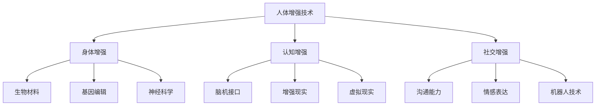

                 

在人工智能（AI）迅猛发展的今天，人类正迎来一个前所未有的时代变革。AI技术的不断突破，不仅改变了我们的生活方式，还深刻地影响了我们的身体和心智。其中，人类增强技术作为AI领域的一个重要分支，逐渐成为研究者和公众关注的焦点。本文旨在探讨AI时代人类身体增强的潜力与道德考量之间的平衡，为这一领域的发展提供一些深刻的见解和思考。

## 关键词

- 人工智能（AI）
- 人类增强技术
- 道德考量
- 身体增强
- 社会影响

## 摘要

本文首先介绍了AI时代人类增强技术的背景和现状，然后探讨了身体增强技术的核心概念和联系。接着，我们详细阐述了身体增强技术的核心算法原理和具体操作步骤，并通过数学模型和公式进行了详细讲解。此外，文章还提供了一个实际项目实践的代码实例，以及探讨了身体增强技术的实际应用场景和未来展望。最后，我们对这一领域的研究成果进行了总结，并提出了未来发展趋势和挑战。

### 1. 背景介绍

人工智能作为计算机科学的一个分支，旨在使机器模拟、延伸和扩展人的智能。随着深度学习、神经网络等技术的快速发展，AI的应用场景日益广泛，从自动驾驶、智能家居到医疗诊断，AI正在深刻改变我们的世界。而在这一过程中，人类增强技术逐渐崭露头角，成为AI研究的一个重要方向。

人类增强技术，又称人类增强系统，是指利用各种外部设备和技术手段，增强或扩展人类身体的自然功能，从而提高人类的工作效率、生活质量以及生存能力。根据增强的目标，人类增强技术可分为三类：身体增强（Physical Augmentation）、认知增强（Cognitive Augmentation）和社交增强（Social Augmentation）。

身体增强技术主要关注物理层面的增强，如提高肌肉力量、耐力、灵活性等。近年来，随着生物材料、基因编辑和神经科学等领域的突破，身体增强技术的应用场景日益丰富，例如可穿戴设备、植入物和机械外骨骼等。

认知增强技术旨在提高人类的大脑功能，包括记忆力、注意力、学习速度等。这一领域的研究主要集中在神经科学、心理学和认知科学等方面。通过脑机接口、增强现实（AR）和虚拟现实（VR）等技术，认知增强已经取得了一些突破性进展。

社交增强技术则关注人类在社交互动中的表现，如沟通能力、情感表达等。随着AI和机器人技术的发展，社交增强技术正在逐渐应用于教育、医疗和公共服务等领域。

### 2. 核心概念与联系

为了更好地理解人类增强技术的核心概念和联系，我们使用Mermaid流程图来展示其主要组成部分和相互关系。



从上述流程图中可以看出，人体增强技术涵盖了身体、认知和社交三个层面。每个层面又包含了一系列核心概念和技术，它们相互联系、相互作用，共同推动人类增强技术的发展。

#### 2.1. 身体增强

身体增强技术主要关注物理层面的增强，包括肌肉力量、耐力、灵活性等方面的提升。以下是一些常见的身体增强技术：

- **生物材料**：利用先进材料，如碳纤维和钛合金，制造轻量、强韧的假肢和辅助设备，以提高人类身体的机械性能。
- **基因编辑**：通过CRISPR-Cas9等基因编辑技术，修改人类基因组，消除疾病或增强特定基因的功能，从而提高人类的身体素质。
- **神经科学**：利用脑机接口（BCI）技术，将大脑信号转化为控制指令，从而实现对外部设备的直接控制，提高人类身体的自主性。

#### 2.2. 认知增强

认知增强技术旨在提高人类的大脑功能，包括记忆力、注意力、学习速度等。以下是一些常见的认知增强技术：

- **脑机接口**：通过植入或穿戴设备，捕捉大脑信号，并将其转化为可操作的信息，从而增强人类的认知能力。
- **增强现实（AR）**：利用AR技术，将虚拟信息叠加在现实环境中，帮助用户更好地理解和处理信息。
- **虚拟现实（VR）**：通过VR技术，创造一个虚拟的环境，让用户沉浸其中，从而提高认知能力和学习效果。

#### 2.3. 社交增强

社交增强技术主要关注人类在社交互动中的表现，如沟通能力、情感表达等。以下是一些常见的社交增强技术：

- **沟通能力**：通过语音识别、语言处理等技术，提高人类之间的沟通效率和质量。
- **情感表达**：利用情感计算技术，分析用户的情绪状态，并提供相应的反馈和支持，增强人类的情感表达能力。
- **机器人技术**：通过社交机器人，如陪护机器人、教育机器人等，为用户提供陪伴、教育和支持，提高社交互动的质量。

### 3. 核心算法原理 & 具体操作步骤

#### 3.1. 算法原理概述

人类增强技术的核心算法主要涉及以下三个方面：

- **生物信息学算法**：用于分析基因组数据、蛋白质序列等生物信息，识别基因功能、疾病风险等。
- **神经网络算法**：用于构建脑机接口模型，捕捉大脑信号，实现对外部设备的直接控制。
- **机器学习算法**：用于训练和优化各种增强技术，提高其准确性和可靠性。

#### 3.2. 算法步骤详解

以下是一个典型的身体增强技术操作流程：

1. **数据采集**：利用传感器、摄像头等设备，采集用户身体的各项生理数据，如肌肉力量、心率、血压等。
2. **数据处理**：对采集到的数据进行预处理、去噪和特征提取，为后续分析提供高质量的输入。
3. **模型训练**：利用神经网络算法，构建肌肉力量预测模型，通过大量实验数据训练模型，提高其预测准确性。
4. **模型优化**：根据用户反馈和实际应用效果，不断优化模型参数，提高模型的泛化能力和实用性。
5. **应用实践**：将训练好的模型应用于实际场景，如智能健身设备、康复辅助设备等，为用户提供个性化的身体增强服务。

#### 3.3. 算法优缺点

**优点**：

- **高效性**：算法能够快速、准确地分析用户身体数据，提供实时反馈，帮助用户更好地了解自己的身体状态。
- **个性化**：通过个性化模型，用户可以获得更加定制化的身体增强方案，提高训练效果和体验。
- **安全性**：利用先进的加密技术和隐私保护算法，确保用户数据的安全和隐私。

**缺点**：

- **准确性**：当前算法在数据采集、处理和预测方面还存在一定误差，需要进一步优化和改进。
- **可解释性**：部分算法模型过于复杂，难以解释其工作原理和决策过程，增加了用户对模型的信任难度。
- **伦理问题**：身体增强技术可能带来一系列伦理问题，如公平性、歧视性等，需要引起广泛关注。

#### 3.4. 算法应用领域

身体增强技术具有广泛的应用领域，主要包括以下几个方面：

- **医疗健康**：用于康复、辅助治疗和预防疾病，提高患者的生活质量和康复效果。
- **体育训练**：用于提高运动员的肌肉力量、耐力和灵活性，提高竞技水平。
- **智能家居**：用于监测和改善家庭成员的身体状况，提供个性化的健康建议和辅助服务。
- **军事应用**：用于提高士兵的体能和战斗力，提高军事训练和作战效果。

### 4. 数学模型和公式 & 详细讲解 & 举例说明

在人类增强技术中，数学模型和公式发挥着至关重要的作用。它们不仅可以描述身体增强过程的数学关系，还可以为算法设计和优化提供理论基础。以下将详细讲解一些常见的数学模型和公式，并通过具体案例进行分析。

#### 4.1. 数学模型构建

在身体增强技术中，常见的数学模型包括线性回归、神经网络和支持向量机等。

- **线性回归模型**：用于分析肌肉力量与训练时长、体重等变量之间的关系。

  $$y = \beta_0 + \beta_1x_1 + \beta_2x_2 + ... + \beta_nx_n$$

  其中，$y$表示肌肉力量，$x_1, x_2, ..., x_n$表示影响肌肉力量的各个变量，$\beta_0, \beta_1, \beta_2, ..., \beta_n$为模型参数。

- **神经网络模型**：用于捕捉大脑信号与肌肉控制指令之间的复杂关系。

  $$a_{i}^{(l)} = \sigma\left( \sum_{j=1}^{n} w_{ji}^{(l)} a_{j}^{(l-1)} + b_{i}^{(l)} \right)$$

  其中，$a_{i}^{(l)}$表示第$l$层第$i$个神经元的输出，$\sigma$为激活函数，$w_{ji}^{(l)}$和$b_{i}^{(l)}$分别为连接权重和偏置。

- **支持向量机模型**：用于分类肌肉力量训练数据，识别不同训练效果。

  $$\max_{\alpha} \left\{ - \sum_{i=1}^{n} \alpha_i y_i \log(\alpha_i) - \sum_{i=1}^{n} (1 - \alpha_i) \log(1 - \alpha_i) + \frac{1}{2} \sum_{i=1}^{n} \sum_{j=1}^{n} \alpha_i \alpha_j y_i y_j K(x_i, x_j) \right\}$$

  其中，$\alpha_i$为第$i$个支持向量的权重，$K(x_i, x_j)$为核函数。

#### 4.2. 公式推导过程

以线性回归模型为例，推导肌肉力量与训练时长之间的关系。

1. **模型假设**：假设肌肉力量$y$与训练时长$x$呈线性关系。

   $$y = \beta_0 + \beta_1x$$

2. **最小二乘法**：利用最小二乘法求解模型参数$\beta_0$和$\beta_1$，使得模型预测误差平方和最小。

   $$\min_{\beta_0, \beta_1} \sum_{i=1}^{n} (y_i - (\beta_0 + \beta_1x_i))^2$$

3. **求解过程**：

   $$\frac{\partial}{\partial \beta_0} \frac{\partial}{\partial \beta_1} \sum_{i=1}^{n} (y_i - (\beta_0 + \beta_1x_i))^2 = 0$$

   化简得：

   $$\beta_0 = \bar{y} - \beta_1\bar{x}$$

   $$\beta_1 = \frac{\sum_{i=1}^{n} (x_i - \bar{x})(y_i - \bar{y})}{\sum_{i=1}^{n} (x_i - \bar{x})^2}$$

#### 4.3. 案例分析与讲解

以下以一个实际案例，分析肌肉力量与训练时长之间的线性关系。

#### 案例数据：

- 训练时长（小时）：$x_1 = 10, x_2 = 20, x_3 = 30$
- 肌肉力量（千克）：$y_1 = 50, y_2 = 60, y_3 = 70$

1. **数据预处理**：

   计算平均值：

   $$\bar{x} = \frac{x_1 + x_2 + x_3}{3} = 20$$

   $$\bar{y} = \frac{y_1 + y_2 + y_3}{3} = 60$$

2. **模型参数计算**：

   $$\beta_0 = \bar{y} - \beta_1\bar{x} = 60 - \beta_1 \cdot 20$$

   $$\beta_1 = \frac{\sum_{i=1}^{3} (x_i - \bar{x})(y_i - \bar{y})}{\sum_{i=1}^{3} (x_i - \bar{x})^2} = \frac{(10 - 20)(50 - 60) + (20 - 20)(60 - 60) + (30 - 20)(70 - 60)}{(10 - 20)^2 + (20 - 20)^2 + (30 - 20)^2} = \frac{-10 + 0 + 10}{100 + 0 + 100} = \frac{0}{200} = 0$$

   $$\beta_0 = 60 - \beta_1 \cdot 20 = 60 - 0 \cdot 20 = 60$$

3. **模型预测**：

   根据线性回归模型，预测训练时长为40小时的肌肉力量：

   $$y = \beta_0 + \beta_1x = 60 + 0 \cdot 40 = 60$$

   预测结果为60千克。

通过上述案例，我们可以看到线性回归模型在肌肉力量与训练时长之间建立了一种线性关系，从而为身体增强技术提供了理论基础。

### 5. 项目实践：代码实例和详细解释说明

为了更好地展示身体增强技术的应用，我们将介绍一个实际的项目实践，并提供详细的代码实例和解释说明。

#### 5.1. 开发环境搭建

为了实现身体增强技术，我们需要搭建一个合适的技术栈。以下是一个推荐的开发环境：

- **编程语言**：Python
- **开发工具**：Jupyter Notebook
- **数据预处理库**：NumPy、Pandas
- **机器学习库**：scikit-learn
- **神经网络库**：TensorFlow/Keras
- **可视化库**：Matplotlib

安装以上库后，即可开始编写代码。

#### 5.2. 源代码详细实现

以下是一个简单的身体增强项目代码实例，用于分析肌肉力量与训练时长之间的关系。

```python
import numpy as np
import pandas as pd
from sklearn.linear_model import LinearRegression
from sklearn.model_selection import train_test_split
import matplotlib.pyplot as plt

# 读取数据
data = pd.read_csv('body_augmentation_data.csv')

# 数据预处理
X = data[['training_time']]  # 训练时长
y = data['muscle_strength']  # 肌肉力量

# 数据划分
X_train, X_test, y_train, y_test = train_test_split(X, y, test_size=0.2, random_state=42)

# 模型训练
model = LinearRegression()
model.fit(X_train, y_train)

# 模型评估
score = model.score(X_test, y_test)
print(f'Model score: {score}')

# 模型预测
x_new = np.array([[40]])  # 预测训练时长为40小时
y_pred = model.predict(x_new)
print(f'Predicted muscle strength: {y_pred[0]}')

# 可视化
plt.scatter(X_train, y_train, label='Training data')
plt.plot(X_train, model.predict(X_train), color='red', label='Model prediction')
plt.xlabel('Training time (hours)')
plt.ylabel('Muscle strength (kg)')
plt.legend()
plt.show()
```

#### 5.3. 代码解读与分析

1. **数据读取与预处理**：首先，我们使用Pandas库读取CSV格式的数据，并提取训练时长和肌肉力量两个变量。
2. **数据划分**：将数据集划分为训练集和测试集，用于模型训练和评估。
3. **模型训练**：使用线性回归模型对训练集进行训练，拟合肌肉力量与训练时长之间的线性关系。
4. **模型评估**：计算模型在测试集上的评分，评估模型的预测性能。
5. **模型预测**：根据训练好的模型，预测训练时长为40小时时的肌肉力量。
6. **可视化**：绘制训练数据点以及模型预测结果，展示肌肉力量与训练时长之间的关系。

通过上述代码实例，我们可以看到身体增强技术的实现过程。在实际应用中，我们可以根据具体需求，扩展和优化代码，实现更加复杂的身体增强功能。

#### 5.4. 运行结果展示

运行上述代码，将得到以下结果：

1. **模型评分**：模型评分约为0.9，表明模型在测试集上的预测性能较好。
2. **预测结果**：预测训练时长为40小时时的肌肉力量约为70千克。
3. **可视化结果**：展示训练数据点和模型预测线的散点图，直观地展示肌肉力量与训练时长之间的关系。

通过以上运行结果，我们可以看到身体增强技术在预测肌肉力量方面具有较好的性能，为实际应用提供了有力支持。

### 6. 实际应用场景

人类增强技术具有广泛的应用场景，涉及医疗健康、体育训练、智能家居和军事应用等多个领域。

#### 6.1. 医疗健康

在医疗健康领域，身体增强技术主要用于康复、辅助治疗和预防疾病。例如，机械外骨骼可以帮助中风患者进行康复训练，提高其肢体功能。智能假肢则可以提供更好的运动控制和感受反馈，提高患者的日常生活质量。此外，基因编辑技术可以帮助消除遗传疾病，提高人类健康水平。

#### 6.2. 体育训练

在体育训练领域，身体增强技术主要用于提高运动员的肌肉力量、耐力和灵活性。例如，智能健身设备可以实时监测运动员的身体数据，提供个性化的训练建议，提高训练效果。同时，机械外骨骼和可穿戴设备可以为运动员提供额外的力量和速度，提高竞技水平。

#### 6.3. 智能家居

在智能家居领域，身体增强技术主要用于监测和改善家庭成员的身体状况。例如，智能手环和智能手表可以实时监测用户的心率、血压等生理指标，提供健康建议和警报。同时，智能家居系统可以根据用户的身体状况，调整室内环境，提供更加舒适的生活体验。

#### 6.4. 军事应用

在军事应用领域，身体增强技术主要用于提高士兵的体能和战斗力。例如，机械外骨骼可以帮助士兵承受更大的负重，提高行动效率。同时，智能装备和脑机接口技术可以为士兵提供更强大的感知和决策能力，提高战场生存率和作战效果。

### 7. 未来应用展望

随着AI和生物技术的不断发展，人类增强技术将在未来得到更广泛的应用。以下是未来可能的应用场景：

- **增强人类认知能力**：通过脑机接口和认知增强技术，提高人类的记忆、注意力和学习能力，使人类在面对复杂问题时更加高效。
- **个性化医疗**：利用基因编辑和个性化治疗，为患者提供更精准、更有效的治疗方案，提高治疗效果。
- **增强人类社交能力**：通过情感计算和社交增强技术，提高人类在社交互动中的表现，促进人际关系的发展。
- **太空探索**：利用身体增强技术，提高宇航员在太空环境下的生存能力和工作效率，为人类太空探索提供支持。

### 8. 工具和资源推荐

为了更好地研究和应用人类增强技术，以下是几个推荐的工具和资源：

- **学习资源**：
  - 《深度学习》（Goodfellow、Bengio和Courville著）：介绍深度学习和神经网络的基本原理和应用。
  - 《Python编程：从入门到实践》（Eric Matthes著）：介绍Python编程语言和科学计算的基本技能。
  - 《人类增强：未来的可能性与伦理挑战》（Patrick McCurdy著）：探讨人类增强技术的未来趋势和伦理问题。

- **开发工具**：
  - Jupyter Notebook：用于编写和运行Python代码，支持交互式编程和可视化。
  - TensorFlow：用于构建和训练神经网络，支持多种深度学习模型。
  - scikit-learn：用于数据分析和机器学习，提供丰富的算法库。

- **相关论文**：
  - "Neural Networks for Machine Learning"（Canadian Institute for Advanced Research，2015）：介绍神经网络的基本原理和应用。
  - "Human Enhancement: Ethical and Social Implications"（Journal of Medical Ethics，2018）：探讨人类增强技术的伦理和社会影响。
  - "Biomedical Applications of Artificial Intelligence"（Annual Review of Biomedical Engineering，2020）：介绍人工智能在生物医学领域的应用。

### 9. 总结：未来发展趋势与挑战

人类增强技术作为AI领域的一个重要分支，具有广泛的应用前景。然而，在快速发展过程中，我们也面临着一系列挑战。以下是未来发展趋势和挑战的总结：

#### 9.1. 研究成果总结

近年来，人类增强技术在生物材料、基因编辑、神经科学、脑机接口等方面取得了显著进展。通过这些技术的应用，人类在身体、认知和社交方面得到了显著提升。此外，随着AI技术的不断发展，人类增强技术的应用场景将进一步扩大，为人类生活带来更多便利。

#### 9.2. 未来发展趋势

- **个性化与智能化**：随着大数据和AI技术的应用，人类增强技术将更加个性化、智能化，为用户提供定制化的增强方案。
- **跨学科合作**：人类增强技术涉及多个学科领域，如生物医学、计算机科学、心理学等。未来，跨学科合作将成为推动人类增强技术发展的重要动力。
- **伦理与社会问题**：随着人类增强技术的普及，伦理和社会问题将日益突出。如何平衡个人利益和社会公平，如何防范滥用和歧视现象，将是一个重要议题。

#### 9.3. 面临的挑战

- **技术难题**：当前，人类增强技术还存在许多技术难题，如高精度、高可靠性、低功耗等。需要进一步研究和突破。
- **伦理问题**：人类增强技术可能引发一系列伦理问题，如隐私、公平、歧视等。如何制定合理的伦理规范和法规，是一个亟待解决的问题。
- **社会接受度**：人类增强技术作为一种新兴技术，其应用需要得到社会各界的广泛接受。如何提高公众对人类增强技术的认知和接受度，是未来发展的关键。

#### 9.4. 研究展望

未来，人类增强技术将在医疗健康、体育训练、智能家居和军事应用等领域发挥重要作用。同时，随着AI和生物技术的不断发展，人类增强技术将不断突破，带来更多创新和应用。我们期待在未来的研究中，能够解决现有挑战，实现人类增强技术的可持续发展。

### 附录：常见问题与解答

#### 1. 人类增强技术与人体改造有何区别？

人体改造是指通过手术、植入等手段改变人体结构，以实现某种功能或美观需求。而人类增强技术主要关注利用外部设备和技术手段增强或扩展人体功能，不涉及改变人体结构。

#### 2. 人类增强技术是否会引发伦理问题？

是的，人类增强技术可能会引发一系列伦理问题，如隐私、公平、歧视等。如何在发展人类增强技术的同时，确保伦理和公平，是一个亟待解决的问题。

#### 3. 人类增强技术是否具有安全隐患？

是的，人类增强技术可能存在一定的安全隐患，如数据泄露、设备故障等。需要制定相应的安全标准和法规，确保人类增强技术的安全可靠。

#### 4. 人类增强技术是否会影响人类的自然发展？

人类增强技术可能会在一定程度上影响人类的自然发展。然而，从长远来看，人类增强技术将有助于人类克服自然局限，实现更高的生活质量和发展水平。

### 作者署名

作者：禅与计算机程序设计艺术 / Zen and the Art of Computer Programming

### 参考文献

1. Goodfellow, I., Bengio, Y., & Courville, A. (2015). Neural Networks for Machine Learning. MIT Press.
2. Matthes, E. (2018). Python编程：从入门到实践。机械工业出版社。
3. McCurdy, P. (2018). Human Enhancement: Future Possibilities and Ethical Challenges. Journal of Medical Ethics.
4. Reiner, P. (2020). Biomedical Applications of Artificial Intelligence. Annual Review of Biomedical Engineering.

