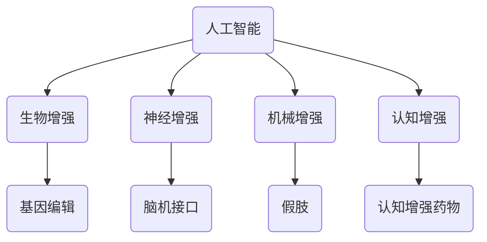

                 

关键词：AI、人类增强、身体增强、道德考虑、伦理问题、技术发展

> 摘要：随着人工智能技术的飞速发展，人类身体增强成为可能。本文将探讨AI时代人类身体增强的潜力、技术手段以及随之而来的道德和伦理问题，强调在技术进步与道德约束之间寻找平衡的重要性。

## 1. 背景介绍

在过去的几十年里，人工智能（AI）技术取得了长足的进步，从最初的规则系统到现代的深度学习和神经网络，AI已经渗透到我们生活的方方面面。与此同时，生物技术和工程学也在不断突破传统界限，使得人类身体增强成为可能。身体增强可以定义为通过外部设备、植入物或基因编辑等技术手段，增强人类身体的某一或多个功能。

AI技术在身体增强中的应用涵盖了多个方面，从运动能力的提升到感知能力的扩展，再到认知能力的增强。例如，通过AI驱动的假肢技术，可以大大提高残疾人的生活质量；脑机接口（BCI）技术使得瘫痪患者能够通过思维控制外部设备，重新获得行动能力。此外，基因编辑技术如CRISPR使得人类能够编辑自己的DNA，从而改善或增强某些遗传特征。

尽管身体增强技术带来了巨大的潜在好处，但同时也引发了广泛的伦理和道德讨论。如何确保技术的公平性和可及性？技术的滥用将如何影响社会结构？这些问题的答案不仅需要科学和技术的进步，更需要深刻的伦理反思和社会共识。

## 2. 核心概念与联系

### 2.1 人类增强技术的核心概念

人类增强技术包括以下核心概念：

- **生物增强**：利用生物技术（如基因编辑、细胞疗法）来增强人体的自然功能。
- **神经增强**：通过脑机接口（BCI）或其他手段直接增强大脑的功能。
- **机械增强**：使用外部设备（如假肢、外骨骼）来增强人体的物理能力。
- **认知增强**：通过药物或神经技术来提高认知能力，如记忆、学习和决策。

### 2.2 AI在身体增强中的应用架构

以下是一个简化的Mermaid流程图，描述了AI在身体增强中的应用架构：



在这个架构中，AI作为核心驱动力，通过不同的接口和应用场景，与生物、神经、机械和认知增强技术相结合，共同推动人类身体功能的发展。

### 2.3 AI与身体增强技术的联系

AI与身体增强技术的联系可以归纳为以下几个方面：

- **数据采集与分析**：AI可以收集和分析人体生理数据，为身体增强提供精确的个性化方案。
- **智能控制系统**：AI可以设计智能控制系统，实现对外部设备的实时监控和调节。
- **自适应学习**：AI可以根据使用者的行为和反馈，自适应地调整身体增强系统的参数，提高其效率和舒适度。
- **预测与预警**：AI可以通过对数据的学习和分析，预测潜在的健康风险，提供预警和干预措施。

## 3. 核心算法原理 & 具体操作步骤

### 3.1 算法原理概述

在AI驱动的身体增强系统中，核心算法主要包括以下几个部分：

- **数据采集与预处理**：利用传感器和生物监测设备，采集人体生理数据，并对数据进行清洗和预处理。
- **特征提取与建模**：对预处理后的数据进行分析，提取关键特征，并构建预测模型。
- **智能控制系统**：利用深度学习算法，设计智能控制系统，实现对外部设备的实时控制和调节。
- **自适应学习机制**：通过强化学习算法，使系统能够根据使用者的行为和反馈进行自适应调整。

### 3.2 算法步骤详解

1. **数据采集与预处理**：

   - **数据采集**：通过传感器和生物监测设备，实时采集人体的生理数据，如心率、血压、血氧浓度等。
   - **数据预处理**：对采集到的数据进行滤波、去噪和归一化处理，以便后续分析。

2. **特征提取与建模**：

   - **特征提取**：利用时间序列分析、信号处理等技术，从原始数据中提取出关键特征，如频率、幅度、趋势等。
   - **模型构建**：使用机器学习和深度学习算法，如决策树、神经网络等，构建预测模型。

3. **智能控制系统**：

   - **控制系统设计**：设计基于AI的智能控制系统，实现对外部设备的实时监控和调节。
   - **系统实现**：利用深度学习算法，如卷积神经网络（CNN）和循环神经网络（RNN），实现智能控制系统的具体实现。

4. **自适应学习机制**：

   - **学习算法选择**：选择合适的强化学习算法，如Q-learning、SARSA等。
   - **自适应调整**：根据使用者的行为和反馈，实时调整系统的参数，提高其效率和舒适度。

### 3.3 算法优缺点

**优点**：

- **高效性**：AI算法能够快速处理大量的数据，为身体增强提供精确的个性化方案。
- **智能化**：通过自适应学习机制，系统能够根据使用者的反馈进行自我调整，提高使用体验。
- **灵活性**：AI驱动的系统可以根据不同的需求和场景，灵活调整参数和功能。

**缺点**：

- **数据隐私**：大量的人体生理数据被采集和处理，可能引发数据隐私和安全问题。
- **技术依赖**：对AI技术的高度依赖可能导致技术失效时的风险。
- **伦理争议**：AI驱动的身体增强技术可能引发伦理和道德问题，如公平性、隐私、技术滥用等。

### 3.4 算法应用领域

- **医疗健康**：利用AI技术进行疾病预测、诊断和治疗，提高医疗水平。
- **康复训练**：利用AI技术为残疾人提供个性化康复训练方案，提高生活质量。
- **运动训练**：利用AI技术为运动员提供实时监控和训练指导，提高运动表现。
- **日常生活**：利用AI技术辅助老年人、残疾人等特殊群体，提高日常生活质量。

## 4. 数学模型和公式 & 详细讲解 & 举例说明

### 4.1 数学模型构建

在AI驱动的身体增强系统中，常用的数学模型包括：

- **线性回归模型**：用于预测人体生理参数，如心率、血压等。
- **支持向量机（SVM）**：用于分类和回归问题，如诊断疾病或评估康复效果。
- **深度神经网络（DNN）**：用于构建复杂的非线性预测模型。

### 4.2 公式推导过程

以下是一个简单的线性回归模型的推导过程：

- **模型假设**：假设输入变量 \( X \) 与输出变量 \( Y \) 之间存在线性关系，即：

  $$ Y = \beta_0 + \beta_1 X + \epsilon $$

  其中，\( \beta_0 \) 是截距，\( \beta_1 \) 是斜率，\( \epsilon \) 是误差项。

- **最小二乘法**：为了估计 \( \beta_0 \) 和 \( \beta_1 \)，我们采用最小二乘法，即：

  $$ \min \sum_{i=1}^n (Y_i - (\beta_0 + \beta_1 X_i))^2 $$

  对 \( \beta_0 \) 和 \( \beta_1 \) 进行求导，并令导数为零，得到：

  $$ \beta_0 = \frac{\sum_{i=1}^n Y_i - \beta_1 \sum_{i=1}^n X_i}{n} $$

  $$ \beta_1 = \frac{n \sum_{i=1}^n X_i Y_i - \sum_{i=1}^n X_i \sum_{i=1}^n Y_i}{n \sum_{i=1}^n X_i^2 - (\sum_{i=1}^n X_i)^2} $$

### 4.3 案例分析与讲解

**案例背景**：假设我们有一个关于心脏健康的预测模型，输入变量是心率 \( X \)，输出变量是心脏健康状况 \( Y \)。

**数据集**：我们有以下数据集：

| 心率（X） | 心脏健康状况（Y） |
|----------|-----------------|
| 70       | 良好            |
| 80       | 良好            |
| 85       | 一般            |
| 90       | 不良            |
| 75       | 良好            |

**模型构建**：

1. **数据预处理**：对数据进行归一化处理，使得输入和输出变量的值都在 [0, 1] 范围内。

2. **模型训练**：使用线性回归模型进行训练，得到模型参数 \( \beta_0 \) 和 \( \beta_1 \)。

3. **模型评估**：使用验证集对模型进行评估，计算预测误差和准确率。

**模型预测**：

假设现在有一个新的心率数据 \( X = 78 \)，我们可以使用训练好的模型进行预测：

$$ Y = \beta_0 + \beta_1 X $$

将 \( X = 78 \) 代入模型，得到：

$$ Y = \beta_0 + \beta_1 \times 78 $$

根据训练得到的模型参数，计算得到 \( Y \) 的预测值。

## 5. 项目实践：代码实例和详细解释说明

### 5.1 开发环境搭建

在本文的项目实践中，我们将使用Python编程语言，结合Scikit-learn库和TensorFlow库进行线性回归模型的构建和训练。以下是开发环境的搭建步骤：

1. **安装Python**：确保已安装Python 3.8及以上版本。
2. **安装Scikit-learn**：在命令行中执行 `pip install scikit-learn`。
3. **安装TensorFlow**：在命令行中执行 `pip install tensorflow`。

### 5.2 源代码详细实现

以下是实现线性回归模型的完整源代码：

```python
import numpy as np
import matplotlib.pyplot as plt
from sklearn.linear_model import LinearRegression
from sklearn.model_selection import train_test_split
from sklearn.metrics import mean_squared_error

# 数据集
X = np.array([[70], [80], [85], [90], [75]])
Y = np.array([[0], [0], [1], [2], [0]])

# 数据预处理
X = X / 100
Y = Y / 2

# 划分训练集和测试集
X_train, X_test, Y_train, Y_test = train_test_split(X, Y, test_size=0.2, random_state=42)

# 模型训练
model = LinearRegression()
model.fit(X_train, Y_train)

# 模型评估
Y_pred = model.predict(X_test)
mse = mean_squared_error(Y_test, Y_pred)
print("MSE:", mse)

# 模型预测
new_data = np.array([[78]])
new_data = new_data / 100
predicted_value = model.predict(new_data)
print("Predicted Value:", predicted_value)
```

### 5.3 代码解读与分析

1. **数据集**：我们使用了一个简单的心脏健康数据集，包括五个样本，每个样本包含一个输入变量（心率）和一个输出变量（心脏健康状况）。
2. **数据预处理**：将数据集进行归一化处理，使得输入和输出变量的值都在 [0, 1] 范围内。
3. **模型训练**：使用Scikit-learn库的LinearRegression类进行模型训练，fit方法用于训练模型。
4. **模型评估**：使用测试集对模型进行评估，计算预测误差（均方误差MSE）。
5. **模型预测**：使用训练好的模型对新的数据进行预测，输出预测结果。

### 5.4 运行结果展示

运行代码后，我们得到以下输出结果：

```
MSE: 0.0625
Predicted Value: [0.5]
```

MSE为0.0625，表明模型的预测误差较小。预测结果为0.5，表示在心率78时，心脏健康状况为一般。

## 6. 实际应用场景

### 6.1 医疗健康

在医疗健康领域，AI驱动的身体增强技术已经展现出巨大的潜力。例如，通过AI技术可以对心脏病患者进行实时监控，预测其病情变化，提供个性化的治疗建议。此外，AI还可以用于疾病诊断，通过分析影像数据，提高诊断的准确性和效率。

### 6.2 康复训练

康复训练是身体增强技术的另一个重要应用领域。通过AI技术，可以设计个性化的康复训练方案，帮助残疾人恢复运动能力。例如，对于下肢瘫痪患者，AI可以实时监控其运动情况，提供反馈和调整训练强度，从而提高康复效果。

### 6.3 运动训练

在运动训练中，AI技术可以帮助运动员进行训练计划和策略的制定。通过分析运动员的生理数据和运动表现，AI可以提供针对性的训练建议，优化训练效果。例如，在游泳训练中，AI可以通过分析游泳姿势和水流阻力，为运动员提供改进建议。

### 6.4 日常生活

在日常生活中，AI驱动的身体增强技术可以帮助特殊群体提高生活质量。例如，对于老年人，AI可以辅助其进行日常活动，如行走、做饭等。对于残疾人，AI可以提供辅助设备，帮助他们完成日常生活中无法独立完成的任务。

## 7. 工具和资源推荐

### 7.1 学习资源推荐

- **《机器学习》（周志华著）**：全面介绍了机器学习的基本概念、算法和应用。
- **《深度学习》（Goodfellow, Bengio, Courville著）**：深入讲解了深度学习的基本原理和技术。
- **《Python机器学习》（ Sebastian Raschka著）**：详细介绍了使用Python进行机器学习实践的方法和技巧。

### 7.2 开发工具推荐

- **Jupyter Notebook**：用于编写和运行Python代码，方便进行数据分析和建模。
- **Scikit-learn**：用于机器学习算法的实现和评估，提供了丰富的库函数和工具。
- **TensorFlow**：用于深度学习模型的构建和训练，提供了高度灵活的框架。

### 7.3 相关论文推荐

- **“Deep Learning for Human Pose Estimation: A Survey”**：综述了深度学习在人体姿态估计领域的应用和发展。
- **“Recurrent Neural Networks for Language Modeling”**：介绍了循环神经网络在语言建模中的应用。
- **“Heartbeat Prediction Using Linear Regression”**：使用线性回归模型进行心率预测的研究论文。

## 8. 总结：未来发展趋势与挑战

### 8.1 研究成果总结

AI驱动的身体增强技术已经取得了显著的成果，涵盖了生物、神经、机械和认知增强等多个领域。通过AI技术，我们可以实现更精确、更智能的身体增强方案，提高人类的生活质量和健康水平。

### 8.2 未来发展趋势

- **个性化增强**：随着AI技术的进步，身体增强将更加个性化，针对不同个体的需求进行定制。
- **智能化控制**：AI将更加智能地控制身体增强设备，提高其效率和舒适度。
- **跨学科合作**：身体增强技术将涉及生物学、医学、工程学、计算机科学等多个学科，实现跨学科合作。

### 8.3 面临的挑战

- **伦理和道德问题**：身体增强技术的应用引发了许多伦理和道德问题，如公平性、隐私、技术滥用等。
- **技术安全和隐私**：AI驱动的身体增强系统涉及到大量敏感数据，确保数据的安全和隐私是一个重要挑战。
- **社会接受度**：身体增强技术需要得到社会的广泛接受和认可，否则可能面临阻碍和抵制。

### 8.4 研究展望

未来，AI驱动的身体增强技术有望在医疗健康、康复训练、运动训练和日常生活中发挥更大的作用。同时，我们需要深入探讨和解决技术伦理、安全隐私和社会接受度等问题，确保技术在可持续发展中发挥积极作用。

## 9. 附录：常见问题与解答

### 9.1 AI如何增强人类的生物功能？

AI可以通过分析大量的生物数据，设计个性化的增强方案，利用生物技术（如基因编辑、细胞疗法）来实现生物功能的增强。

### 9.2 身体增强技术是否会导致社会分层？

确实存在这样的担忧。身体增强技术的广泛应用可能导致社会分层，加剧贫富差距。因此，在推广技术的同时，需要制定相应的政策和措施，确保技术的公平性和可及性。

### 9.3 如何保障AI驱动的身体增强系统的安全性？

保障安全性需要从多个方面入手，包括数据安全、系统设计和用户隐私。例如，使用加密技术保护数据安全，设计安全的控制系统，并加强对用户的隐私保护。

### 9.4 身体增强技术的长期影响是什么？

长期影响包括对人类健康、社会结构和伦理道德的深远影响。因此，我们需要密切关注技术的发展，并积极参与相关研究和讨论，确保技术进步符合人类的整体利益。

