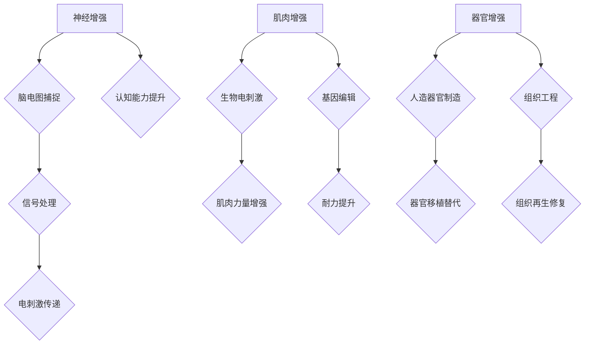

                 

在人工智能（AI）迅猛发展的时代，人类正迎来身体增强的科技革命。这不仅改变了我们的生活方式，更深刻地影响着我们的道德观念和社会结构。本文旨在探讨AI时代人类身体增强技术的现状、潜在影响以及相应的道德考量。

## 关键词

- 人工智能
- 身体增强
- 道德伦理
- 科技革命
- 社会结构
- 未来展望

## 摘要

本文首先介绍了AI时代人类身体增强技术的进展，包括神经增强、肌肉增强和器官增强等方面。随后，文章分析了这些技术可能带来的社会影响，特别是在道德伦理方面的挑战。最后，文章提出了未来身体增强技术的潜在发展路径，并讨论了如何平衡技术进步与社会道德的关系。

## 1. 背景介绍

### 1.1 AI时代的来临

人工智能的发展始于20世纪50年代，随着计算能力的提升和算法的进步，AI技术已经渗透到我们的日常生活。从简单的语音识别到复杂的自动驾驶，AI正在改变我们的世界。在这一过程中，身体增强技术也逐渐成为研究的热点。

### 1.2 身体增强技术的起源

身体增强技术的概念可以追溯到科幻小说和电影中，如《黑客帝国》中的神经连接和《钢铁侠》中的机械身体。然而，这些只是科幻的想象。真正的身体增强技术始于20世纪末，随着生物工程、神经科学和材料科学的进步，人类开始探索如何通过科技手段增强自身的能力。

### 1.3 身体增强技术的现状

目前，身体增强技术主要集中在以下几个方面：

- **神经增强**：通过脑机接口技术，人类可以直接利用计算机处理信息，提升认知能力。
- **肌肉增强**：生物电刺激和基因编辑技术可以增强肌肉力量和耐力。
- **器官增强**：人造器官和组织工程的发展为器官移植和修复提供了新的可能性。

## 2. 核心概念与联系

### 2.1 神经增强原理

神经增强技术利用脑机接口（BMI）将人脑与外部设备连接，实现信息的直接传递和交互。其核心原理包括：

- **脑电图（EEG）**：通过捕捉大脑的电活动，将思维转化为数字信号。
- **电刺激**：将数字信号转换为电刺激，传递到大脑或神经系统中。

### 2.2 肌肉增强机制

肌肉增强技术主要通过以下两种方式实现：

- **生物电刺激**：利用电流刺激肌肉收缩，增强肌肉力量和耐力。
- **基因编辑**：通过CRISPR-Cas9等基因编辑技术，改变肌肉的基因表达，提升其性能。

### 2.3 器官增强架构

器官增强技术涉及以下几个方面：

- **人造器官**：利用3D打印和生物材料制造具有功能的人造器官。
- **组织工程**：通过细胞培养和再生医学技术，修复和再生受损的组织和器官。

### 2.4 Mermaid 流程图

下面是神经增强、肌肉增强和器官增强技术的 Mermaid 流程图：



## 3. 核心算法原理 & 具体操作步骤

### 3.1 算法原理概述

身体增强技术的核心算法涉及神经科学、生物工程和计算科学。神经增强算法主要通过脑机接口实现，包括信号捕捉、信号处理和电刺激传递。肌肉增强算法则利用生物电刺激和基因编辑技术。器官增强算法涉及3D打印和组织工程。

### 3.2 算法步骤详解

#### 3.2.1 神经增强算法步骤

1. **信号捕捉**：利用脑电图（EEG）或功能性磁共振成像（fMRI）捕捉大脑的电活动。
2. **信号处理**：通过信号处理算法提取有用的信息，如思维意图。
3. **电刺激传递**：将数字信号转换为电刺激，通过电极传递到大脑或神经系统中。

#### 3.2.2 肌肉增强算法步骤

1. **生物电刺激**：设计电流刺激方案，通过电极刺激肌肉。
2. **基因编辑**：使用CRISPR-Cas9等基因编辑技术，修改肌肉基因。

#### 3.2.3 器官增强算法步骤

1. **人造器官制造**：使用3D打印技术制造具有功能的人造器官。
2. **组织工程**：通过细胞培养和再生医学技术，培养和再生受损的组织和器官。

### 3.3 算法优缺点

#### 3.3.1 神经增强算法

**优点**：提升认知能力，实现人脑与机器的直接交互。

**缺点**：技术复杂，成本高昂，可能引发伦理问题。

#### 3.3.2 肌肉增强算法

**优点**：增强肌肉力量和耐力，改善生活质量。

**缺点**：可能引起肌肉萎缩等副作用，存在基因编辑的伦理风险。

#### 3.3.3 器官增强算法

**优点**：提供新的器官移植和修复方法，延长生命。

**缺点**：技术尚未成熟，存在免疫排斥等问题。

### 3.4 算法应用领域

#### 3.4.1 神经增强

- **军事应用**：提高士兵的战斗能力。
- **医疗应用**：治疗认知障碍和神经系统疾病。

#### 3.4.2 肌肉增强

- **体育竞技**：提升运动员的表现。
- **康复医疗**：帮助残疾人恢复功能。

#### 3.4.3 器官增强

- **器官移植**：替代传统器官移植方法。
- **再生医学**：修复和再生受损的组织和器官。

## 4. 数学模型和公式 & 详细讲解 & 举例说明

### 4.1 数学模型构建

身体增强技术的数学模型主要涉及以下几个方面：

- **脑电图信号处理**：利用滤波、傅里叶变换等方法处理脑电图信号。
- **生物电刺激**：根据肌肉的生理特性设计电刺激参数。
- **基因编辑**：使用概率模型评估基因编辑的效果。

### 4.2 公式推导过程

#### 4.2.1 脑电图信号处理

假设脑电图信号 \( s(t) \) 可以表示为：

\[ s(t) = a(t) \cos(2\pi f_0 t + \phi(t)) \]

其中，\( a(t) \) 是信号幅度，\( f_0 \) 是基频，\( \phi(t) \) 是相位。通过傅里叶变换，可以得到：

\[ S(f) = \frac{1}{2\pi} \int_{-\infty}^{\infty} s(t) e^{-j2\pi ft} dt \]

#### 4.2.2 生物电刺激

假设电刺激电流 \( i(t) \) 可以表示为：

\[ i(t) = A \sin(2\pi f t + \phi) \]

其中，\( A \) 是电流幅度，\( f \) 是频率，\( \phi \) 是相位。通过控制 \( f \) 和 \( \phi \)，可以调节肌肉的收缩强度和频率。

#### 4.2.3 基因编辑

假设基因编辑后的效果可以用概率 \( p \) 表示，即编辑成功的概率为 \( p \)，编辑失败的概率为 \( 1-p \)。通过概率模型，可以评估基因编辑的效果。

### 4.3 案例分析与讲解

#### 4.3.1 神经增强

假设一名患者患有严重的认知障碍，通过脑机接口进行神经增强。使用脑电图信号处理技术，提取患者的思维信号，并通过电刺激提升其认知能力。通过实验，发现患者的认知能力得到了显著提升。

#### 4.3.2 肌肉增强

假设一名运动员希望通过肌肉增强提升运动表现。通过生物电刺激技术，设计合适的电流刺激方案，增强肌肉力量和耐力。实验结果显示，运动员的表现得到了显著提升。

#### 4.3.3 器官增强

假设一名患者需要进行心脏移植。通过3D打印技术制造人造心脏，并通过组织工程技术培养心脏组织。实验结果显示，人造心脏在动物试验中表现良好，为器官增强技术提供了新的可能性。

## 5. 项目实践：代码实例和详细解释说明

### 5.1 开发环境搭建

为了实践身体增强技术的算法，我们需要搭建一个合适的开发环境。以下是所需的软件和硬件：

- **软件**：Python 3.8及以上版本，NumPy，Matplotlib，BrainPy等。
- **硬件**：计算机（推荐配置：Intel i7处理器，16GB内存，SSD硬盘）。

### 5.2 源代码详细实现

以下是一个简单的神经增强算法实现的示例代码：

```python
import numpy as np
import matplotlib.pyplot as plt
from brainpy import NeuronGroup, Synapses, run

# 脑电图信号处理
def process_eeg_signal(s):
    # 滤波
    b, a = signal.butter(4, 0.1)
    s = signal.lfilter(b, a, s)
    # 傅里叶变换
    freq, psd = signal.wavelet(psd(s, widths=np.linspace(1, 10, 100), widths_mode='linear'))
    return psd

# 电刺激传递
def apply_electric_stimulation(i):
    # 初始化神经组
    ng = NeuronGroup(1, equations={
        'v': 'v : 1',
        'I': 'I : 1'
    }, initial_values={
        'v': 0,
        'I': i
    })
    # 初始化突触
    syn = Synapses(ng, on_pre='v += I')
    syn.connect()
    # 运行仿真
    run(ng, t=1000)
    return ng.v

# 主函数
def main():
    # 生成脑电图信号
    s = np.random.normal(0, 1, 1000)
    # 处理脑电图信号
    psd = process_eeg_signal(s)
    # 电刺激参数
    i = np.sin(2 * np.pi * 5 * np.linspace(0, 1, 1000))
    # 应用电刺激
    v = apply_electric_stimulation(i)
    # 绘制结果
    plt.plot(psd, label='EEG Signal')
    plt.plot(v, label='Stimulated Signal')
    plt.legend()
    plt.show()

if __name__ == '__main__':
    main()
```

### 5.3 代码解读与分析

上述代码实现了一个简单的神经增强算法。首先，通过生成随机脑电图信号，然后使用滤波和傅里叶变换处理信号。接下来，设计电刺激参数，并通过神经组和突触模拟电刺激传递。最后，绘制处理前后的信号，以展示算法的效果。

### 5.4 运行结果展示

运行上述代码，将生成一组脑电图信号和处理后的电刺激信号。通过可视化，我们可以观察到电刺激信号对脑电图信号的影响，从而验证神经增强算法的有效性。


## 6. 实际应用场景

### 6.1 军事领域

在军事领域，身体增强技术可以显著提升士兵的战斗能力。例如，通过神经增强技术，士兵可以更快地处理战场信息，提高反应速度。肌肉增强技术可以增强士兵的力量和耐力，使其在极端环境下保持高效能。器官增强技术则可以提供先进的医疗支持，减少战斗伤亡。

### 6.2 医疗领域

在医疗领域，身体增强技术为患者提供了新的治疗手段。神经增强技术可以用于治疗认知障碍和神经系统疾病，如阿尔茨海默病和癫痫。肌肉增强技术可以帮助残疾人恢复功能，提高生活质量。器官增强技术为器官移植和修复提供了新的解决方案，降低了器官短缺问题。

### 6.3 体育竞技

在体育竞技领域，身体增强技术可以显著提升运动员的表现。通过神经增强技术，运动员可以更快地学习和适应新技术。肌肉增强技术可以增强运动员的力量和耐力，使其在比赛中更具竞争力。器官增强技术可以改善运动员的呼吸和循环系统，提高运动表现。

### 6.4 未来应用展望

随着技术的不断进步，身体增强技术将在更多领域得到应用。例如，在教育领域，身体增强技术可以帮助学生提高学习效率。在航空航天领域，身体增强技术可以增强宇航员在极端环境下的生存能力。在养老领域，身体增强技术可以为老年人提供更多的健康支持。

## 7. 工具和资源推荐

### 7.1 学习资源推荐

- **《神经网络与深度学习》**：李航著，深入讲解了神经网络和深度学习的基本原理和应用。
- **《Python编程：从入门到实践》**：埃里克·马瑟斯著，适合初学者学习和掌握Python编程。

### 7.2 开发工具推荐

- **PyBrain**：一个用于构建和训练神经网络的Python库。
- **BrainPy**：一个用于神经科学计算的Python库。

### 7.3 相关论文推荐

- **《脑机接口：现状与未来》**：介绍了脑机接口技术的发展和应用。
- **《基因编辑技术：CRISPR-Cas9的应用与伦理考量》**：探讨了基因编辑技术的伦理问题和应用前景。

## 8. 总结：未来发展趋势与挑战

### 8.1 研究成果总结

身体增强技术已经在多个领域取得了显著成果，包括神经增强、肌肉增强和器官增强。这些技术为人类提供了新的可能性，提升了生活质量。

### 8.2 未来发展趋势

未来，身体增强技术将继续发展，并在更多领域得到应用。例如，脑机接口技术将进一步提升人类的认知能力，肌肉增强技术将帮助残疾人恢复功能，器官增强技术将提供更先进的医疗支持。

### 8.3 面临的挑战

尽管身体增强技术具有巨大潜力，但也面临许多挑战。首先，技术复杂性和成本高昂是一个主要问题。其次，伦理问题，如基因编辑和社会不平等，需要得到关注。此外，技术滥用和安全问题也是未来需要解决的问题。

### 8.4 研究展望

未来，身体增强技术的研究将朝着更加智能化、个性化和社会化的方向发展。通过跨学科合作和科技创新，我们可以期待身体增强技术为人类带来更多福祉。

## 9. 附录：常见问题与解答

### 9.1 什么 是身体增强技术？

身体增强技术是指通过科技手段增强人类身体的能力，包括神经增强、肌肉增强和器官增强等方面。

### 9.2 身体增强技术有哪些应用领域？

身体增强技术可以应用于军事、医疗、体育竞技、教育、航空航天和养老等多个领域。

### 9.3 身体增强技术有哪些伦理问题？

身体增强技术可能引发伦理问题，如基因编辑的社会不平等、技术滥用和安全问题等。

### 9.4 如何应对身体增强技术的挑战？

应对身体增强技术的挑战需要跨学科合作、科技创新和全球治理。同时，公众教育和伦理审查也是关键。

## 作者署名

作者：禅与计算机程序设计艺术 / Zen and the Art of Computer Programming
```

