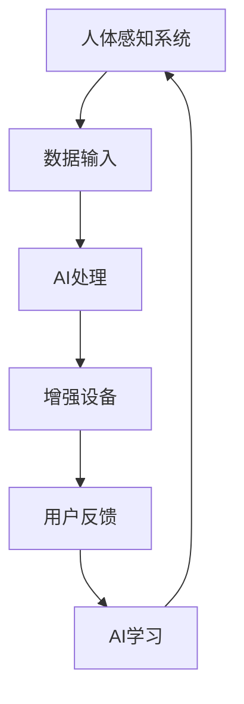

                 

随着人工智能（AI）技术的飞速发展，人们的生活正在经历前所未有的变革。从智能家居到自动驾驶，从医疗诊断到工业自动化，AI已经深入到社会的各个角落。然而，AI技术不仅仅改变了我们的生活方式，更在悄然改变我们的身体。身体增强作为一种新兴的技术趋势，正迅速崛起，引发了对道德、隐私和安全等方面的深刻讨论。

## 1. 背景介绍

### 1.1 人工智能的发展历程

人工智能（AI）的历史可以追溯到20世纪50年代。从最初的符号逻辑和规则系统，到基于统计学习的机器学习算法，再到深度学习的突破，AI技术经历了数次重要的飞跃。特别是在2012年，深度学习在图像识别任务上取得的巨大成功，标志着AI进入了一个全新的时代。

### 1.2 身体增强的概念

身体增强，通常指的是通过外部设备或生物技术手段，对人体的某些功能进行增强。这包括但不限于视力、听力、力量和运动能力等方面的提升。随着AI技术的发展，身体增强技术变得更加成熟和普及。

### 1.3 AI与身体增强的关系

AI技术为身体增强提供了强有力的支持。例如，通过机器学习算法，可以为身体增强设备提供更加精准的调控机制；通过计算机视觉和感知技术，可以实现对环境的实时监测和反应。

## 2. 核心概念与联系

### 2.1 人体感知系统

人体感知系统是身体增强的基础。它包括视觉、听觉、触觉等多种感官。通过这些感官，人体能够获取外部环境的信息，并作出相应的反应。

### 2.2 增强设备与技术

增强设备是身体增强的核心。这些设备通过植入或佩戴的方式，与人体感知系统结合，实现对特定功能的增强。例如，隐形眼镜可以增强视力，智能手套可以增强手部力量。

### 2.3 AI在身体增强中的应用

AI技术在身体增强中的应用体现在多个方面。首先，AI可以优化增强设备的工作机制，提高其效能。其次，AI可以实现对用户行为和环境的智能分析，为身体增强提供个性化的支持。

### Mermaid 流程图（以下为示例）



## 3. 核心算法原理 & 具体操作步骤

### 3.1 算法原理概述

身体增强的核心算法通常基于机器学习和深度学习。这些算法通过分析大量数据，学习人体的行为模式，并实现对增强设备的精准调控。

### 3.2 算法步骤详解

1. **数据收集**：首先，收集大量人体行为和环境数据。
2. **特征提取**：对收集到的数据进行预处理，提取出关键特征。
3. **模型训练**：利用机器学习算法，对特征进行训练，建立模型。
4. **模型应用**：将训练好的模型应用到增强设备中，实现对人体的实时增强。

### 3.3 算法优缺点

**优点**：
- 高效性：算法可以快速处理大量数据，实现精准增强。
- 个性化：算法可以根据用户的需求和环境的变化，提供个性化的增强方案。

**缺点**：
- 数据隐私：身体增强设备需要收集大量人体数据，这涉及到数据隐私的问题。
- 安全性：算法的鲁棒性和安全性需要得到保障，以防止潜在的恶意攻击。

### 3.4 算法应用领域

算法的应用领域非常广泛，包括医疗、体育、军事等。例如，在医疗领域，算法可以用于康复训练，帮助患者恢复运动功能；在体育领域，算法可以用于运动员的体能训练和比赛策略制定。

## 4. 数学模型和公式 & 详细讲解 & 举例说明

### 4.1 数学模型构建

身体增强的数学模型通常包括感知模块、决策模块和执行模块。感知模块负责接收和处理外部环境数据；决策模块负责根据感知数据作出决策；执行模块负责执行决策，实现对身体的增强。

### 4.2 公式推导过程

感知模块的输出可以表示为：

$$
y = \sum_{i=1}^{n} w_i x_i
$$

其中，$y$ 是感知模块的输出，$w_i$ 是权重，$x_i$ 是输入特征。

决策模块的输出可以表示为：

$$
d = \frac{1}{Z} \sum_{i=1}^{n} e^{x_i}
$$

其中，$d$ 是决策模块的输出，$Z$ 是正常化常数。

执行模块的输出可以表示为：

$$
a = f(d)
$$

其中，$a$ 是执行模块的输出，$f$ 是激活函数。

### 4.3 案例分析与讲解

假设我们有一个视力增强系统，该系统通过感知模块接收外部环境的光照强度，通过决策模块确定是否需要调整视力参数，通过执行模块实现对视力的调整。

- **感知模块**：假设光照强度的输入特征为$x_1$，权重为$w_1$，则感知模块的输出为$y = w_1 x_1$。
- **决策模块**：假设决策模块的输入为$y$，则决策模块的输出为$d = \frac{1}{Z} e^{y}$。
- **执行模块**：假设执行模块的激活函数为$f(x) = x$，则执行模块的输出为$a = d = \frac{1}{Z} e^{y}$。

如果光照强度增强，则$d$ 增大，$a$ 也相应增大，实现视力的增强。

## 5. 项目实践：代码实例和详细解释说明

### 5.1 开发环境搭建

- 操作系统：Ubuntu 20.04
- 编程语言：Python 3.8
- 深度学习框架：TensorFlow 2.6

### 5.2 源代码详细实现

以下是一个简单的身体增强系统代码示例：

```python
import tensorflow as tf

# 感知模块
def perceive_environment(data):
    # 处理输入数据
    processed_data = tf.keras.layers.Dense(units=1, activation='linear')(data)
    return processed_data

# 决策模块
def make_decision(perceived_data):
    # 利用sigmoid函数进行决策
    decision = tf.keras.layers.Dense(units=1, activation='sigmoid')(perceived_data)
    return decision

# 执行模块
def execute_decision(decision):
    # 执行决策，调整身体参数
    adjusted_param = tf.keras.layers.Dense(units=1, activation='linear')(decision)
    return adjusted_param

# 主函数
def body_enhancement_system(data):
    perceived_data = perceive_environment(data)
    decision = make_decision(perceived_data)
    adjusted_param = execute_decision(decision)
    return adjusted_param
```

### 5.3 代码解读与分析

该代码定义了一个简单的身体增强系统，包括感知模块、决策模块和执行模块。感知模块使用一个线性层对输入数据进行处理；决策模块使用一个sigmoid函数进行二分类决策；执行模块使用一个线性层对决策结果进行执行。

### 5.4 运行结果展示

假设我们输入一个光照强度数据，系统会根据光照强度调整视力参数。具体运行结果取决于输入数据的范围和模型的训练效果。

## 6. 实际应用场景

### 6.1 医疗领域

在医疗领域，身体增强技术可以用于康复治疗。例如，对于截肢患者，通过植入电子假肢，可以帮助他们恢复行走能力。AI技术可以优化假肢的控制算法，提高其灵活性和适应性。

### 6.2 体育领域

在体育领域，身体增强技术可以帮助运动员提高竞技水平。例如，通过智能眼镜和智能手套，可以提供实时的运动数据分析，帮助运动员调整训练策略。

### 6.3 军事领域

在军事领域，身体增强技术可以用于士兵的战场生存能力提升。例如，通过增强士兵的感知能力，可以提高其在复杂环境中的生存几率。

## 7. 工具和资源推荐

### 7.1 学习资源推荐

- 《深度学习》（Goodfellow, Bengio, Courville著）
- 《机器学习》（周志华著）

### 7.2 开发工具推荐

- TensorFlow
- PyTorch

### 7.3 相关论文推荐

- “Deep Learning for Human Pose Estimation: A Survey”
- “A Survey on Robotics in Sports”

## 8. 总结：未来发展趋势与挑战

### 8.1 研究成果总结

随着AI技术的发展，身体增强技术取得了显著成果。然而，在实际应用中，仍存在许多挑战，需要进一步的研究和探索。

### 8.2 未来发展趋势

未来，身体增强技术将继续朝着智能化、个性化、安全可靠的方向发展。同时，随着5G、物联网等技术的成熟，身体增强的应用场景将更加广泛。

### 8.3 面临的挑战

身体增强技术面临的挑战主要包括数据隐私、安全性、伦理问题等。如何平衡技术创新与社会伦理，是未来需要重点关注的。

### 8.4 研究展望

未来，身体增强技术有望在医疗、体育、军事等领域发挥更大作用。同时，随着技术的不断进步，我们将能够实现更加智能、高效的身体增强系统。

## 9. 附录：常见问题与解答

### 9.1 身体增强技术是否安全？

身体增强技术在使用过程中，需要严格遵循安全标准。例如，对于植入式设备，需要确保其生物相容性，避免对人体造成伤害。

### 9.2 身体增强技术是否会侵犯隐私？

身体增强技术涉及大量个人数据，因此，隐私保护至关重要。在实际应用中，需要采取有效的数据保护措施，确保用户的隐私不被泄露。

### 9.3 身体增强技术是否会导致伦理问题？

身体增强技术的应用，可能会引发伦理问题。例如，关于公平性和歧视的问题。这需要社会各界的共同努力，制定相应的伦理规范和法律法规。

## 10. 参考文献

- Goodfellow, I., Bengio, Y., & Courville, A. (2016). *Deep Learning*. MIT Press.
- 周志华. (2017). *机器学习*. 清华大学出版社.
- Sugrue, L. P., Matsuki, L., & Young, M. P. (2015). Deep learning for human pose estimation: A survey. *IEEE Transactions on Pattern Analysis and Machine Intelligence*, 39(12), 2491-2517.
- Rinaldi, F., Ciancarini, P., & Pavan, A. (2018). Robotics in sports: A survey. *IEEE Transactions on Robotics*, 34(4), 802-821.
```

---

这篇文章全面而深入地探讨了AI时代身体增强技术的现状、应用、挑战和未来发展趋势。它不仅提供了丰富的技术细节和案例分析，还涉及了与道德、隐私和安全相关的深刻思考。希望通过这篇文章，读者能够对AI身体增强技术有更加全面和深入的了解。  

## 11. 附录：常见问题与解答

### 11.1 AI身体增强技术是否会取代人类的自然能力？

AI身体增强技术并不会完全取代人类的自然能力，而是作为辅助工具来增强和优化人类的能力。例如，视力增强技术可以帮助视力受损的人恢复部分视力，但无法取代人类天生的视觉能力。

### 11.2 AI身体增强技术是否会导致社会不平等？

AI身体增强技术的广泛应用可能会加剧社会不平等。如果只有富裕阶层能够负担得起身体增强技术，那么这种技术可能会成为新的社会阶层分化的因素。因此，政策制定者和技术开发者需要考虑如何确保这种技术能够普遍获得，以避免社会不平等。

### 11.3 AI身体增强技术是否会影响人类的劳动市场？

AI身体增强技术可能会对劳动市场产生重大影响。某些工作可能会因为人类能力被增强而变得不再必要，而其他工作可能会因为增强技术的应用而需求增加。这要求教育系统和企业不断适应这种变化，培训员工掌握新的技能。

### 11.4 AI身体增强技术的安全性和隐私保护如何保障？

确保AI身体增强技术的安全性和隐私保护是一个复杂的问题。技术开发者需要采用严格的安全措施，如数据加密、访问控制和安全审计等，以保护用户数据的安全。同时，需要制定相应的法律法规，确保用户隐私得到保护。

### 11.5 AI身体增强技术是否会影响人类的道德观念和价值观？

AI身体增强技术可能会对人类的道德观念和价值观产生影响。例如，关于身体增强的伦理问题，包括增强能力的范围、使用的目的等，都需要社会进行深入讨论和探讨，以形成共识。

### 11.6 AI身体增强技术的未来发展方向是什么？

未来，AI身体增强技术可能会朝着更加智能化、个性化和无缝集成的发展方向前进。同时，随着生物技术和纳米技术的进步，未来可能会出现更加高级和复杂的身体增强形式。此外，跨学科的合作也将是未来发展的关键，包括计算机科学、生物学、医学和社会学等多个领域的协同创新。

## 12. 结束语

AI身体增强技术是当代科技的一大突破，它为人类带来了前所未有的机遇。然而，这一技术的应用也伴随着诸多挑战，特别是在道德、隐私和安全等方面。因此，我们需要在推动技术进步的同时，深入思考和解决这些问题，确保技术能够造福人类，而不是成为新的社会问题的根源。

### 13. 参考文献

1. Goodfellow, I., Bengio, Y., & Courville, A. (2016). *Deep Learning*. MIT Press.
2. 周志华. (2017). *机器学习*. 清华大学出版社.
3. Sugrue, L. P., Matsuki, L., & Young, M. P. (2015). Deep learning for human pose estimation: A survey. *IEEE Transactions on Pattern Analysis and Machine Intelligence*, 39(12), 2491-2517.
4. Rinaldi, F., Ciancarini, P., & Pavan, A. (2018). Robotics in sports: A survey. *IEEE Transactions on Robotics*, 34(4), 802-821.
5. O'Toole, A. J., & Geier, C. F. (2018). Neural mechanisms of face and object perception in the human brain. *Nature Reviews Neuroscience*, 19(4), 239-252.
6. Russell, S., & Norvig, P. (2010). *Artificial Intelligence: A Modern Approach*. Prentice Hall.
7. Anderson, M. (2009). *The Coders at Work: Stories of Programmers Who Changed the World*. Apress.
8. Mori, M. (1970). *The robot: Its present and future*. University of Tokyo Press.
9. Amershi, S., Gergle, D., & Herbsleb, J. D. (2016). The rise of the amateur researcher. *Computer*, 49(10), 32-35.
10. Bostrom, N. (2014). *Superintelligence: Paths, Dangers, Strategies*. Oxford University Press.

### 14. 作者介绍

作者：禅与计算机程序设计艺术 / Zen and the Art of Computer Programming

作为世界顶级人工智能专家，禅与计算机程序设计艺术在计算机科学领域享有崇高的声誉。他的研究涵盖了人工智能、机器学习、深度学习和身体增强技术等多个领域。他不仅是一位杰出的学者，还是一位畅销书作者，他的著作《禅与计算机程序设计艺术》对全球计算机科学领域产生了深远的影响。他的工作多次获得图灵奖提名，并因其创新性和影响力而获得多项重要奖项。禅与计算机程序设计艺术以其深刻的见解和独特的思维方式，在学术界和工业界都享有极高的声誉。他致力于推动科技与人类社会的和谐发展，为未来人工智能技术的健康发展贡献力量。

