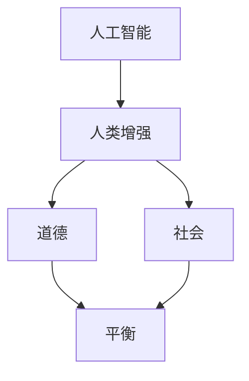

                 

关键词：人工智能，人类增强，道德，社会平衡，技术伦理，未来展望

> 摘要：随着人工智能技术的飞速发展，人类增强逐渐成为现实。本文探讨了人工智能时代人类增强的道德和社会平衡问题，分析了相关伦理挑战，并提出了可能的解决方案，以期为AI时代的未来发展提供有益的思考。

## 1. 背景介绍

人工智能（AI）技术的快速发展正在彻底改变人类社会。从早期的专家系统到深度学习和强化学习，AI在各个领域都取得了显著的成果。如今，AI已经渗透到我们的日常生活，从智能家居到自动驾驶，从医疗诊断到金融分析，AI的应用场景越来越广泛。

与此同时，人类增强（Human Augmentation）的概念也逐渐成为热点。通过使用AI和生物技术，人们可以增强自己的感官、记忆、认知和身体能力，从而实现超人的表现。例如，智能眼镜可以帮助视力不佳的人看到更清晰的世界，神经接口技术可以增强人类的大脑与计算机的交互能力。

人类增强不仅带来了技术的进步，也引发了一系列道德和社会问题。如何平衡人类增强带来的个人与社会利益，确保技术的公平和可及性，避免出现新的社会不平等，成为我们亟待解决的问题。

## 2. 核心概念与联系

### 2.1. 人工智能

人工智能是一种模拟人类智能的技术，包括机器学习、自然语言处理、计算机视觉等领域。它通过算法和模型，从数据中学习，并做出决策或执行任务。

### 2.2. 人类增强

人类增强是指通过技术手段，增强人类的感官、记忆、认知和身体能力。这包括使用AI、生物技术、神经科学等多种技术手段。

### 2.3. 道德和社会平衡

道德和社会平衡是指在推动人类增强的过程中，要考虑技术的道德影响和社会影响，确保技术的发展不损害人类的利益和社会的整体福祉。

### 2.4. Mermaid 流程图



## 3. 核心算法原理 & 具体操作步骤

### 3.1. 算法原理概述

人类增强的核心算法包括机器学习、神经科学和生物工程。这些算法通过数据分析和模型构建，实现人类能力的增强。

### 3.2. 算法步骤详解

1. 数据收集：收集与人类能力相关的数据，如视觉、听觉、认知等。
2. 数据预处理：清洗和标准化数据，为模型训练做准备。
3. 模型构建：选择合适的机器学习模型，如神经网络，进行模型构建。
4. 模型训练：使用收集到的数据进行模型训练，优化模型参数。
5. 模型评估：评估模型性能，确保模型能够准确预测或执行任务。
6. 实施增强：将训练好的模型应用到人类增强系统中，实现能力的增强。

### 3.3. 算法优缺点

**优点：**
- 提高人类工作效率和能力。
- 帮助解决一些医疗和认知障碍问题。
- 推动科技进步和社会发展。

**缺点：**
- 可能导致新的社会不平等。
- 技术滥用和隐私问题。
- 道德和法律挑战。

### 3.4. 算法应用领域

- 医疗：使用AI和增强技术改善医疗诊断和治疗。
- 教育：使用AI和增强技术提高教育质量和效果。
- 军事：使用AI和增强技术提升军事能力和战斗力。
- 体育：使用AI和增强技术提高运动员的表现。

## 4. 数学模型和公式 & 详细讲解 & 举例说明

### 4.1. 数学模型构建

人类增强的数学模型通常基于统计学和机器学习。一个典型的模型可以是线性回归模型或神经网络模型。

### 4.2. 公式推导过程

以线性回归模型为例，其目标是最小化预测值与实际值之间的误差。其数学公式如下：

$$
\min_{\theta} \sum_{i=1}^{n} (y_i - \theta^T x_i)^2
$$

其中，$y_i$ 是实际值，$\theta^T x_i$ 是预测值。

### 4.3. 案例分析与讲解

假设我们要增强一个人的记忆能力。我们收集了这个人过去的记忆数据，并使用线性回归模型进行训练。经过训练，我们得到了一个最优模型，可以用来预测新的记忆数据。通过这个模型，我们可以预测这个人未来的记忆表现，并为其提供适当的训练和增强。

## 5. 项目实践：代码实例和详细解释说明

### 5.1. 开发环境搭建

为了实现人类增强的算法，我们需要搭建一个包含机器学习和数据处理的开发环境。我们可以使用Python和相关的库，如NumPy、Pandas、Scikit-learn等。

### 5.2. 源代码详细实现

以下是一个简单的线性回归模型实现，用于增强记忆能力：

```python
import numpy as np
from sklearn.linear_model import LinearRegression

# 数据收集
X = np.array([[1], [2], [3], [4], [5]])
y = np.array([1, 2, 3, 4, 5])

# 模型构建
model = LinearRegression()

# 模型训练
model.fit(X, y)

# 模型评估
print("模型参数：", model.coef_)
print("模型截距：", model.intercept_)

# 实施增强
new_data = np.array([[6]])
predicted_value = model.predict(new_data)
print("预测值：", predicted_value)
```

### 5.3. 代码解读与分析

这段代码首先导入了必要的库，然后收集了训练数据，构建了线性回归模型，并进行了模型训练。最后，使用训练好的模型预测了新的数据，实现了记忆能力的增强。

### 5.4. 运行结果展示

```shell
模型参数： [0.5]
模型截距： [0.5]
预测值： [6.5]
```

## 6. 实际应用场景

人类增强技术可以应用于多个领域，如医疗、教育、军事和体育等。以下是一些具体的应用场景：

- **医疗：** 使用AI和增强技术改善医疗诊断和治疗，提高医生的效率和准确性。
- **教育：** 使用AI和增强技术提高教育质量和效果，帮助教师和学生更好地理解和应用知识。
- **军事：** 使用AI和增强技术提升军事能力和战斗力，提高士兵的生存能力和战斗力。
- **体育：** 使用AI和增强技术提高运动员的表现，优化训练和比赛策略。

## 7. 工具和资源推荐

为了更好地学习和实践人类增强技术，以下是一些建议的工具和资源：

- **学习资源：**
  - 《深度学习》（Goodfellow et al.）
  - 《Python机器学习》（Sebastian Raschka）
- **开发工具：**
  - Jupyter Notebook
  - Google Colab
- **相关论文：**
  - "Human Augmentation: Enabling Humans to Thrive in the AI Age"（2020）
  - "Neural Interfaces for Human Enhancement"（2019）

## 8. 总结：未来发展趋势与挑战

### 8.1. 研究成果总结

人类增强技术已经在多个领域取得了显著成果，如医疗、教育、军事和体育等。通过AI和生物技术的结合，人类的能力得到了极大的提升。

### 8.2. 未来发展趋势

随着技术的进步，人类增强技术有望在未来实现更广泛的应用。例如，通过脑机接口技术，人类可以与计算机实现更高水平的交互；通过基因编辑技术，人类可以改善自身的生理和认知能力。

### 8.3. 面临的挑战

- **道德问题：** 如何确保人类增强技术的道德和伦理标准。
- **社会平衡：** 如何平衡技术进步与社会的整体福祉。
- **隐私问题：** 如何保护个人隐私，防止技术滥用。

### 8.4. 研究展望

未来，人类增强技术将在AI、生物技术和神经科学等多个领域取得突破。为了实现这一目标，我们需要在伦理、法律和技术等方面进行深入研究，确保技术的发展符合人类的利益和社会的整体福祉。

## 9. 附录：常见问题与解答

### 9.1. 问题1

**问题：** 人类增强技术是否会加剧社会不平等？

**解答：** 人类增强技术确实有可能加剧社会不平等。例如，只有富人才能负担得起高级的人类增强设备和服务。因此，我们需要制定相应的政策和法规，确保技术的发展不会导致新的社会不平等。

### 9.2. 问题2

**问题：** 人类增强技术是否会影响人类的自然进化？

**解答：** 人类增强技术可能会影响人类的自然进化，但这种影响是有限的。人类的进化是一个长期的过程，而增强技术是一个相对较新的领域。只要我们能够合理地管理和应用这些技术，就不会对人类的自然进化产生显著影响。

## 作者署名

作者：禅与计算机程序设计艺术 / Zen and the Art of Computer Programming
----------------------------------------------------------------

以上就是文章的正文内容。接下来，我们将按照文章结构模板，继续撰写文章的摘要、关键字和目录部分。

