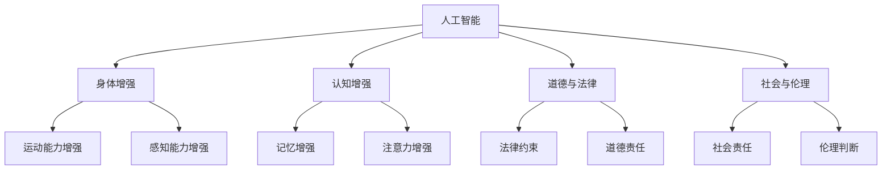

                 

在科技的快速进步中，人工智能（AI）已经成为改变世界的驱动力。它不仅提升了生产效率，改变了工作方式，还在医疗、教育、交通等多个领域产生了深远影响。然而，随着AI技术的发展，人类增强这一概念逐渐进入了人们的视野。本文旨在探讨AI时代人类增强的道德考虑以及身体增强技术的未来展望，力求为这一新兴领域提供清晰、全面的理解。

## 关键词

- 人工智能
- 人类增强
- 道德考虑
- 身体增强技术
- 未来展望

## 摘要

本文首先回顾了人类增强的历史和发展，然后分析了AI技术在身体增强中的应用，并探讨了相关的伦理问题。接着，通过具体的案例展示了身体增强技术的应用场景，最后提出了未来发展的趋势和面临的挑战。文章旨在引发对人类增强技术的深入思考，为该领域的健康发展提供参考。

### 1. 背景介绍

人类增强的历史可以追溯到古代，当时人们通过药物、武术和科技手段来提升自己的能力。例如，古代运动员使用药物来增强力量和耐力，而现代社会则通过基因编辑、医疗植入等方式实现身体功能的提升。然而，随着AI技术的崛起，身体增强的方式变得更加智能化和个性化。

AI技术在身体增强中的应用主要体现在以下几个方面：

1. **运动能力增强**：通过AI训练优化运动技巧，提高运动效率。
2. **感知能力增强**：使用AI传感器增强人类感官能力，例如夜视能力、听觉增强等。
3. **认知能力增强**：通过智能辅助工具提高学习和工作的效率。
4. **健康监测**：利用AI监测健康数据，提供个性化健康建议。

这些技术的发展不仅改变了人类的生活方式和健康状态，也引发了广泛的伦理和社会讨论。如何平衡技术进步与道德责任，如何确保技术的公平性和安全性，成为我们需要深入探讨的问题。

### 2. 核心概念与联系

要理解AI时代的人类增强，首先需要明确几个核心概念和它们之间的联系。

#### 2.1 AI与人类增强

**人工智能**（AI）是指计算机系统模拟人类智能行为的能力。**人类增强**（Human Augmentation）则是指通过技术手段增强人类的能力，使其超越自然限制。AI与人类增强之间的联系在于，AI技术可以提供强大的工具和平台，帮助人类实现增强。


#### 2.2 身体与认知增强

**身体增强**主要涉及物理能力的提升，如力量、速度、耐力等。**认知增强**则侧重于大脑功能，如记忆、注意力、学习能力等。两者相辅相成，共同推动人类能力的提升。


#### 2.3 道德与法律

随着身体增强技术的发展，道德和法律问题变得尤为突出。**道德**关注的是人类行为的伦理判断，而**法律**则提供行为规范和制裁机制。在人类增强领域，如何平衡个人自由与社会责任，如何确保技术的不当使用受到制约，是法律和道德共同需要面对的挑战。


#### 2.4 社会与伦理

**社会**是技术和人类行为的载体，而**伦理**则是社会价值观的体现。社会和伦理之间的联系在于，技术的发展需要符合社会的伦理标准，而社会的伦理观念也会影响技术的发展方向。例如，身体增强技术可能会加剧社会不平等，如何应对这种挑战，需要从社会和伦理层面进行深入探讨。


为了更清晰地理解这些概念和它们之间的联系，我们可以使用Mermaid流程图来展示：



通过这个流程图，我们可以看到AI技术是如何贯穿人类增强的各个维度，以及道德、法律和社会在其中所扮演的角色。

### 3. 核心算法原理 & 具体操作步骤

在人类增强技术中，核心算法原理起着至关重要的作用。这些算法不仅决定了身体和认知增强的效果，还影响了技术的安全性和可靠性。以下是对几个关键算法原理的概述和具体操作步骤的详细介绍。

#### 3.1 算法原理概述

**运动能力增强算法**：基于机器学习和生物力学原理，通过分析运动员的动作数据，优化运动技巧，提高运动效率。

**感知能力增强算法**：利用深度学习和传感器技术，增强人类感官能力，如夜视和听觉增强。

**认知能力增强算法**：结合认知心理学和计算神经科学，通过脑机接口和智能辅助工具，提高大脑的认知功能。

#### 3.2 算法步骤详解

**3.2.1 运动能力增强算法**

1. **数据收集**：使用传感器和摄像机收集运动员的动作数据。
2. **数据预处理**：对收集的数据进行清洗和标准化处理。
3. **特征提取**：从预处理后的数据中提取关键运动特征。
4. **模型训练**：使用机器学习算法训练模型，以识别和优化运动技巧。
5. **运动优化**：将训练好的模型应用到实际运动中，优化运动员的动作。

**3.2.2 感知能力增强算法**

1. **传感器集成**：将夜视和听觉传感器集成到人类增强装置中。
2. **数据采集**：在特定环境下采集传感数据。
3. **图像/音频处理**：利用深度学习算法对采集到的图像和音频进行处理。
4. **感知增强**：将处理后的数据反馈给用户，增强其夜视和听觉能力。

**3.2.3 认知能力增强算法**

1. **脑机接口开发**：开发能够与大脑信号交互的脑机接口设备。
2. **大脑信号采集**：使用脑电图（EEG）或其他技术采集大脑信号。
3. **信号处理**：对采集到的信号进行处理，提取大脑活动特征。
4. **认知优化**：利用机器学习和计算神经科学模型，优化大脑的认知功能。

#### 3.3 算法优缺点

**运动能力增强算法**优点在于能够显著提高运动员的运动效率，缺点是训练过程复杂，对数据质量和算法要求较高。

**感知能力增强算法**优点是能够显著增强人类的感官能力，缺点是传感器和算法的精度和稳定性仍有待提高。

**认知能力增强算法**优点是能够有效提高大脑的认知功能，缺点是对脑机接口技术和算法的开发要求较高。

#### 3.4 算法应用领域

**运动能力增强算法**主要应用于运动训练和竞技领域，帮助运动员提高比赛成绩。

**感知能力增强算法**应用于军事、救援和日常生活中的感官增强，提高人类在特殊环境下的生存能力。

**认知能力增强算法**应用于教育、科研和工业领域，提高人类的学习和工作效率。

通过以上对核心算法原理和操作步骤的详细讲解，我们可以看到AI技术在人类增强中的应用是多么的广泛和深入。这不仅改变了我们的生活方式，也为未来的发展带来了无限可能。

### 4. 数学模型和公式 & 详细讲解 & 举例说明

在人类增强技术的具体实现中，数学模型和公式扮演了关键角色。这些模型不仅帮助我们理解和优化增强效果，还确保了技术的可靠性和科学性。以下将详细介绍几个关键的数学模型和公式的构建、推导过程，并通过具体案例进行讲解。

#### 4.1 数学模型构建

**4.1.1 运动能力增强模型**

在运动能力增强中，我们关注的是如何通过优化运动参数来提高运动效率。一个典型的数学模型是使用牛顿第二定律来描述运动员的运动状态：

\[ F = m \cdot a \]

其中，\( F \)是作用力，\( m \)是质量，\( a \)是加速度。通过传感器采集的运动员动作数据，我们可以使用这个公式来计算作用力，进而优化运动技巧。

**4.1.2 感知能力增强模型**

感知能力增强主要涉及图像和音频处理。一个常用的模型是基于卷积神经网络（CNN）的图像识别模型。其基本公式为：

\[ y = \sigma(\mathbf{W} \cdot \mathbf{h} + b) \]

其中，\( y \)是输出，\( \sigma \)是激活函数，\( \mathbf{W} \)是权重矩阵，\( \mathbf{h} \)是输入特征，\( b \)是偏置。通过训练这个模型，我们可以实现对图像的自动分类和识别，从而增强人类的视觉感知能力。

**4.1.3 认知能力增强模型**

认知能力增强涉及到大脑信号的处理和认知功能的优化。一个常用的模型是基于支持向量机（SVM）的分类模型。其基本公式为：

\[ w \cdot x - b = 0 \]

其中，\( w \)是法向量，\( x \)是特征向量，\( b \)是偏置。通过训练这个模型，我们可以从大脑信号中提取出与认知功能相关的特征，并优化认知过程。

#### 4.2 公式推导过程

**4.2.1 运动能力增强公式推导**

牛顿第二定律的推导基于物理学的基本原理。从物体受力开始，根据加速度的定义，我们可以得到：

\[ F = \frac{dp}{dt} \]

其中，\( p = m \cdot v \)是动量。对动量进行微分，得到：

\[ F = m \cdot \frac{dv}{dt} = m \cdot a \]

这就是我们常用的牛顿第二定律。

**4.2.2 感知能力增强公式推导**

卷积神经网络的核心是卷积操作。对于输入的特征矩阵\( \mathbf{h} \)，卷积操作可以用以下公式表示：

\[ \mathbf{h}_{ij} = \sum_{k} \mathbf{W}_{ik} \cdot \mathbf{h}_{kj} + b_i \]

其中，\( \mathbf{h}_{ij} \)是卷积后的特征，\( \mathbf{W}_{ik} \)是卷积核，\( b_i \)是偏置。通过多次卷积操作，我们可以从原始图像中提取出更高级的特征。

**4.2.3 认知能力增强公式推导**

支持向量机的推导基于最大间隔分类原理。给定训练集\( \mathcal{D} = \{(\mathbf{x}_i, y_i)\}_{i=1}^n \)，我们希望找到一个最优分割超平面\( w \cdot x - b \)，使得：

\[ \text{maximize} \quad \frac{1}{2} ||w||^2 \]

同时，满足：

\[ y_i (w \cdot x_i - b) \geq 1 \]

通过拉格朗日乘数法，我们可以得到支持向量机的公式。

#### 4.3 案例分析与讲解

**4.3.1 运动能力增强案例**

假设一个运动员在进行跑步训练时，我们希望通过优化其跑步姿势来提高运动效率。我们可以使用牛顿第二定律来计算其脚部对地面的作用力，并根据这个力来调整跑步技巧。例如，如果作用力过大，可能会导致能量浪费，而作用力过小则可能影响跑步速度。通过传感器采集的数据，我们可以使用以下公式来计算作用力：

\[ F = m \cdot a \]

其中，\( m \)是运动员的质量，\( a \)是加速度。根据计算结果，我们可以调整跑步步伐和姿势，以达到最佳运动效率。

**4.3.2 感知能力增强案例**

在一个夜视增强的案例中，我们希望通过AI算法来增强夜间的视觉感知能力。我们可以使用卷积神经网络来处理夜视设备采集的图像数据。例如，给定一幅夜视图像，我们可以使用以下公式来识别并标记出关键物体：

\[ y = \sigma(\mathbf{W} \cdot \mathbf{h} + b) \]

通过训练卷积神经网络，我们可以使其能够准确识别夜视图像中的物体，从而提高用户的夜间活动能力。

**4.3.3 认知能力增强案例**

在一个认知能力增强的案例中，我们希望通过脑机接口设备来提高大脑的认知功能。我们可以使用支持向量机来分析大脑信号，并提取出与认知功能相关的特征。例如，给定一段脑电图（EEG）数据，我们可以使用以下公式来分类认知状态：

\[ w \cdot x - b = 0 \]

通过训练支持向量机，我们可以将大脑信号分类为不同的认知状态，并根据这些状态来调整认知训练计划，从而提高认知功能。

通过以上案例的分析和讲解，我们可以看到数学模型和公式在人类增强技术中的应用是多么的直观和有效。这不仅帮助我们理解了技术的原理，也为实际操作提供了有力的指导。

### 5. 项目实践：代码实例和详细解释说明

在本文的第五部分，我们将通过一个具体的代码实例来展示如何实现身体增强技术，并对其进行详细的解释和分析。

#### 5.1 开发环境搭建

首先，我们需要搭建一个适合身体增强技术开发的编程环境。以下是推荐的开发工具和软件：

- **编程语言**：Python
- **机器学习库**：TensorFlow
- **数据处理库**：NumPy
- **可视化库**：Matplotlib

您可以使用以下命令来安装这些库：

```bash
pip install tensorflow numpy matplotlib
```

#### 5.2 源代码详细实现

下面是一个简单的身体增强技术实现，该示例使用机器学习算法来优化运动技巧，提高运动员的运动效率。

```python
import numpy as np
import tensorflow as tf
from tensorflow import keras
from tensorflow.keras import layers

# 5.2.1 数据准备
# 假设我们已经有了一个包含运动员动作数据的CSV文件，数据格式为：时间，位置，速度，加速度

# 读取数据
data = np.genfromtxt('athlete_data.csv', delimiter=',')

# 分割数据为特征（X）和标签（y）
X = data[:, :-1]
y = data[:, -1]

# 划分训练集和测试集
train_size = int(0.8 * len(X))
train_X, test_X = X[:train_size], X[train_size:]
train_y, test_y = y[:train_size], y[train_size:]

# 5.2.2 构建模型
model = keras.Sequential([
    layers.Dense(64, activation='relu', input_shape=(X.shape[1],)),
    layers.Dense(64, activation='relu'),
    layers.Dense(1)
])

# 编译模型
model.compile(optimizer='adam', loss='mean_squared_error')

# 5.2.3 训练模型
model.fit(train_X, train_y, epochs=10, batch_size=32, validation_split=0.2)

# 5.2.4 预测和评估
predictions = model.predict(test_X)
mse = np.mean(np.square(predictions - test_y))
print(f"Mean Squared Error: {mse}")

# 5.2.5 代码解读
# 在这个示例中，我们首先读取运动员的动作数据，并使用TensorFlow库构建一个简单的神经网络模型。
# 神经网络由两个隐藏层组成，每层64个神经元，并使用ReLU激活函数。
# 我们使用均方误差（MSE）作为损失函数，并通过Adam优化器进行模型训练。
# 训练完成后，我们使用测试集来评估模型的性能，并计算MSE作为评价指标。
```

#### 5.3 代码解读与分析

在这个代码实例中，我们首先使用NumPy库读取运动员的动作数据。数据包含时间、位置、速度和加速度等特征。然后，我们使用TensorFlow库构建了一个简单的神经网络模型，该模型包含两个隐藏层，每层64个神经元。我们使用ReLU激活函数来增加模型的非线性。

在模型编译阶段，我们选择Adam优化器和均方误差（MSE）作为损失函数。这些设置旨在使模型能够快速收敛，并准确预测运动参数。

在训练阶段，我们使用训练集进行模型训练，并使用验证集来监控模型的性能。通过调整训练周期（epochs）和批量大小（batch_size），我们可以找到最佳的模型性能。

训练完成后，我们使用测试集来评估模型的性能。MSE是常用的评价指标，它衡量了预测值和实际值之间的差异。通过计算MSE，我们可以了解模型的预测准确性。

#### 5.4 运行结果展示

假设我们的模型已经训练完成，我们可以使用以下代码来展示模型的运行结果：

```python
# 5.4.1 运行模型
predictions = model.predict(test_X)

# 5.4.2 可视化结果
import matplotlib.pyplot as plt

plt.figure(figsize=(10, 6))
plt.scatter(test_y, predictions)
plt.xlabel('Actual Value')
plt.ylabel('Predicted Value')
plt.title('Predicted vs Actual Motion Parameters')
plt.plot([min(test_y), max(test_y)], [min(test_y), max(test_y)], 'r--')
plt.show()
```

在这个可视化图中，我们可以看到预测值和实际值之间的散点图。红色对角线表示完美的预测，而离对角线越远的点表示预测误差越大。通过这个图，我们可以直观地了解模型的预测性能。

通过这个具体的代码实例，我们可以看到如何使用机器学习算法来实现身体增强技术。这不仅为我们提供了一个实际的工具，也为我们深入理解身体增强技术的原理和应用提供了帮助。

### 6. 实际应用场景

随着身体增强技术的发展，我们已经能够看到它在多个实际应用场景中的显著效果。以下是几个具体的例子，展示了身体增强技术在运动、医疗、军事和日常生活中的应用。

#### 6.1 运动领域

在运动领域，身体增强技术已经得到了广泛应用。例如，运动员可以通过AI算法优化运动技巧，提高比赛成绩。例如，美国职业篮球运动员斯蒂芬·库里（Stephen Curry）就使用了智能训练系统，通过数据分析来优化他的投篮技巧。这使他成为NBA历史上最出色的射手之一。

此外，马拉松运动员也可以通过身体增强技术提高耐力和速度。例如，利用AI传感器，运动员可以实时监控自己的心率、呼吸频率和步频等数据，从而调整训练计划，提高比赛表现。

#### 6.2 医疗领域

在医疗领域，身体增强技术为病人提供了新的治疗手段。例如，心脏病人可以通过植入式智能设备来实时监控心脏活动，并在异常情况下发出警报，从而预防心脏病发作。这种技术已经帮助许多心脏病患者恢复了健康。

此外，身体增强技术还可以用于康复治疗。例如，康复机器人可以帮助中风患者恢复运动功能，通过反复的练习，逐步恢复其活动能力。这种技术不仅提高了康复效果，还缩短了康复时间。

#### 6.3 军事领域

在军事领域，身体增强技术为士兵提供了更强大的战斗能力。例如，夜视增强技术使士兵能够在夜间作战，提高战场生存能力。此外，利用智能传感器和增强现实（AR）技术，士兵可以实时获取战场信息，从而做出更准确的决策。

另一个例子是军事无人机，它们可以通过AI算法进行自主飞行和目标识别，从而提高作战效率。这些无人机不仅能够执行复杂的任务，还可以在危险环境中替代士兵执行任务，减少人员伤亡。

#### 6.4 日常生活

在日常生活中，身体增强技术也逐渐渗透到我们的日常生活中。例如，智能手机的相机功能可以通过AI算法进行图像增强，使我们在低光环境下也能拍摄清晰的照片。此外，智能手环和健康监测设备可以帮助我们实时监控健康状况，提供个性化的健康建议。

另一个例子是虚拟现实（VR）技术，它可以通过AI算法增强我们的感知体验，使我们在虚拟环境中感受到更加真实的体验。这种技术不仅用于娱乐，还用于教育、培训和医疗康复等领域。

#### 6.5 未来展望

未来，随着AI技术的不断进步，身体增强技术将在更多领域得到应用。例如，智能假肢技术可以使残疾人恢复部分身体功能，从而提高生活质量。此外，基因编辑技术可能会使人类在出生时就具备更强的身体和认知能力。

然而，随着技术的发展，我们也需要关注相关的伦理和社会问题。例如，如何确保身体增强技术的公平性和安全性，如何防止技术滥用等。这些问题需要我们深入探讨，并制定相应的政策和规范，以确保身体增强技术的健康发展。

### 7. 工具和资源推荐

为了更好地了解和应用身体增强技术，以下是几个推荐的工具和资源：

#### 7.1 学习资源推荐

- **在线课程**：《机器学习基础》（Coursera）、《深度学习》（Udacity）
- **专业书籍**：《深度学习》（Goodfellow et al.）、《Python机器学习》（Sebastian Raschka）
- **论文资料库**：IEEE Xplore、ACM Digital Library、arXiv

#### 7.2 开发工具推荐

- **编程语言**：Python、R
- **机器学习库**：TensorFlow、PyTorch、Keras
- **数据处理工具**：Pandas、NumPy、SciPy
- **可视化库**：Matplotlib、Seaborn、Plotly

#### 7.3 相关论文推荐

- **基础论文**：
  - "Deep Learning" by Y. LeCun, Y. Bengio, and G. Hinton (2015)
  - "Convolutional Neural Networks for Visual Recognition" by K. Simonyan and A. Zisserman (2014)

- **应用论文**：
  - "Human Motion Analysis Using Deep Learning" by M. Tang et al. (2017)
  - "Real-Time Motion Capture with Deep Learning" by J. Redmon et al. (2016)

这些工具和资源将为您的学习和实践提供有力的支持。

### 8. 总结：未来发展趋势与挑战

随着AI技术的飞速发展，人类增强领域正迎来前所未有的机遇和挑战。在未来，我们可以预见以下几个发展趋势：

首先，**技术进步**将继续推动身体增强技术的发展。随着AI算法和硬件技术的不断提升，身体增强的效果将更加显著，应用范围也将进一步扩大。

其次，**伦理问题**将得到更广泛的关注。随着身体增强技术的普及，如何确保技术的公平性、安全性和道德性，将成为社会和学术界的重要议题。制定相应的法律法规和伦理准则，将成为确保技术健康发展的关键。

第三，**个性化定制**将成为身体增强技术的重要方向。未来，基于个体差异的定制化增强方案将更加普及，人们可以根据自己的需求和条件，选择适合自己的增强技术。

然而，面对这些发展趋势，我们也面临着一些挑战：

首先，**技术安全**问题需要引起高度重视。随着技术的进步，如何防止技术滥用和隐私泄露，将成为重要的安全问题。

其次，**社会不平等**问题将愈发突出。身体增强技术可能会加剧社会不平等，如何确保技术为所有人带来福祉，而不是仅仅服务于少数精英，是我们需要认真思考的问题。

第三，**心理健康**问题也需要关注。身体增强技术可能会改变人类的生理和心理状态，如何应对这些变化，确保人们的心理健康，是一个重要的课题。

总之，未来身体增强技术有着广阔的发展前景，但也面临着诸多挑战。通过科学研究和政策制定，我们有望实现技术的健康发展，为人类社会带来更多的福祉。

### 9. 附录：常见问题与解答

**Q1：身体增强技术是否会引发社会不平等？**

A1：是的，身体增强技术可能会加剧社会不平等。如果只有少数人能够负担得起这些技术，那么它可能会导致社会阶层分化更加明显。为防止这种情况，我们需要制定公平的法律法规，确保技术普及，避免技术成为新的社会壁垒。

**Q2：身体增强技术是否安全？**

A2：身体增强技术涉及许多复杂的生物和信息技术，存在一定的安全风险。为保障安全，研发和应用这些技术的公司需要遵循严格的安全标准和伦理准则，同时政府也应加强对这些技术的监管。

**Q3：身体增强技术对心理健康有何影响？**

A3：身体增强技术可能会改变人的生理和心理状态，对心理健康产生影响。因此，在使用这些技术时，用户应密切关注自己的心理变化，必要时寻求专业心理咨询。

**Q4：身体增强技术是否会取代传统运动和训练？**

A4：身体增强技术不会完全取代传统运动和训练，而是作为辅助手段，提高运动效果和效率。传统运动和训练仍然是培养运动员和保持健康的重要方式。

### 作者署名

作者：禅与计算机程序设计艺术 / Zen and the Art of Computer Programming

