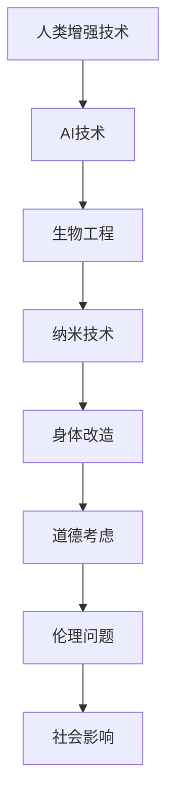

                 

关键词：人工智能、人类增强、道德考虑、身体增强技术、融合、技术伦理

> 摘要：随着人工智能技术的发展，人类增强技术日益成为现实。本文探讨了AI时代人类增强技术的道德考虑，以及这些技术与传统身体增强技术的融合。通过深入分析，我们提出了未来发展的潜在路径和面临的挑战。

## 1. 背景介绍

近年来，人工智能（AI）技术的迅猛发展使得人类增强成为可能。计算机视觉、自然语言处理、机器人技术等领域的突破，使得机器能够执行以往只能由人类完成的复杂任务。与此同时，生物工程、纳米技术、基因编辑等新兴技术的发展，也为身体增强提供了新的可能性。人类开始探索如何通过这些技术提高自身的能力，延长寿命，甚至实现某些超乎想象的功能。

人类增强技术的兴起不仅改变了人类的生活方式和价值观，还引发了关于道德、伦理和社会问题的广泛讨论。本文旨在探讨这些技术的道德考虑，以及如何将这些技术与传统的身体增强技术相融合，为未来的发展提供方向。

### 1.1 AI技术的崛起

人工智能技术的发展始于20世纪50年代，当时计算机科学刚刚起步。早期的AI研究主要集中在逻辑推理、符号操作和问题求解上。随着计算能力的提升和算法的进步，AI逐渐从理论研究走向实际应用。如今，深度学习、强化学习等先进技术的出现，使得机器能够处理大量复杂的数据，并从中学习规律，做出预测和决策。

AI技术的崛起不仅改变了传统行业，还催生了新的产业。自动驾驶汽车、智能机器人、虚拟助手等应用已经渗透到我们的日常生活。这些技术的进步，使得人类在某些领域的能力得到了显著增强。

### 1.2 身体增强技术的演进

身体增强技术的起源可以追溯到古代。当时，人们通过锻炼、营养补充和药物使用来提高自己的身体素质。随着医学和生物技术的进步，现代身体增强技术逐渐成熟。例如，关节置换、心脏起搏器、胰岛素泵等医疗器械，已经让许多患者恢复了健康。此外，基因编辑技术如CRISPR的出现，也为基因层面的身体增强提供了可能。

近年来，纳米技术、生物打印、人工智能与生物技术的融合，使得身体增强技术不断突破传统界限。例如，纳米机器人可以用于清除血管内的斑块，生物打印技术可以制造出人体器官，人工智能可以辅助医生进行精准诊断和个性化治疗。

### 1.3 人类增强的道德考虑

随着人类增强技术的快速发展，人们开始面临一系列道德和伦理问题。例如，基因编辑是否应该用于增强人类的能力？如果使用AI技术进行身体改造，是否会导致社会分层和不平等？这些问题引发了广泛的社会关注和讨论。

人类增强技术的道德考虑主要包括以下几个方面：

1. **公平性**：人类增强技术可能会加剧社会的不平等，使富人和穷人之间的差距进一步扩大。因此，如何确保公平地分配这些技术，是伦理学家和社会学家需要关注的问题。

2. **自主性**：人类增强技术可能会削弱人类的自主性，使人们变得过度依赖技术。这可能会导致人类失去某些自然能力，甚至影响人类的本质。

3. **隐私**：随着身体增强技术的普及，个人隐私问题日益突出。例如，基因信息的收集和使用、身体数据的安全保护等，都需要得到妥善处理。

4. **安全**：人类增强技术可能会带来新的安全风险。例如，基因编辑导致的未知副作用、AI控制的机械身体的意外行为等，都需要严格的安全控制。

## 2. 核心概念与联系

在探讨人类增强技术的道德考虑之前，我们需要了解一些核心概念和它们之间的联系。以下是一个简化的Mermaid流程图，展示了这些概念之间的关系。



### 2.1 人类增强技术

人类增强技术是指通过各种手段提高人类身体或心智能力的科技。这些技术包括：

- **AI技术**：如智能机器人和虚拟助手，用于辅助人类完成任务。
- **生物工程**：如基因编辑和生物打印，用于改善人体结构和功能。
- **纳米技术**：如纳米机器人和纳米材料，用于治疗疾病和改善人体性能。
- **身体改造**：如外科手术、医疗器械和身体增强装置，用于增强人体能力。

### 2.2 道德考虑

道德考虑是人类增强技术发展中不可或缺的一部分。它关注的是技术如何影响人类的生活质量和道德原则。以下是几个关键的道德问题：

- **自主性**：人类增强技术是否会导致人类失去自主性？例如，通过AI技术进行身体改造，可能会使人们变得过度依赖技术，从而影响他们的自主决策能力。
- **公平性**：人类增强技术可能会加剧社会不平等，因为只有富人才能负担得起这些高科技服务。这可能会引发社会阶层分化的担忧。
- **隐私**：随着人类增强技术的普及，个人隐私问题变得更加突出。例如，基因信息的收集和使用、身体数据的安全保护等，都需要得到妥善处理。

### 2.3 伦理问题

伦理问题关注的是人类增强技术是否符合道德原则和社会价值观。以下是一些常见的伦理问题：

- **基因编辑**：基因编辑技术如CRISPR可以用于治疗遗传疾病，但同时也可能用于增强人类的能力。这引发了关于人类是否应该“改造”自己的伦理争议。
- **身体改造**：通过外科手术或医疗器械进行身体改造，可能会改变人类的生理结构。这引发了关于人类本质和自然属性的伦理思考。
- **人工智能**：AI技术在身体增强中的应用，如智能机器人和虚拟助手，可能会影响人类的社交能力和情感体验。这引发了关于人类与技术关系的伦理问题。

### 2.4 社会影响

人类增强技术的普及将对社会产生深远的影响。以下是一些可能的社会影响：

- **劳动力市场**：人类增强技术可能会改变劳动力市场的结构，使某些工作变得更加容易，同时也可能使其他工作变得过时。
- **社会关系**：身体增强技术可能会改变人类之间的互动方式，例如，通过虚拟现实技术进行远程交流和社交。
- **文化认同**：随着人类增强技术的普及，人们可能会开始重新思考自己的文化认同和人类本质。这可能会引发关于人类身份的伦理和社会问题。

## 3. 核心算法原理 & 具体操作步骤

### 3.1 算法原理概述

人类增强技术的核心算法原理主要涉及以下几个方面：

1. **机器学习**：通过训练模型，使计算机能够学习和识别复杂的数据模式，从而辅助人类进行决策和任务执行。
2. **深度学习**：一种基于神经网络的学习方法，可以处理大量非结构化数据，如图像和文本。
3. **自然语言处理**：使计算机能够理解和生成自然语言，从而实现人机交互。
4. **生物信息学**：用于分析和解释生物数据，如基因序列和蛋白质结构。

### 3.2 算法步骤详解

以下是人类增强技术的具体操作步骤：

1. **数据收集**：收集与人类增强相关的数据，包括生物数据（如基因序列、生理参数）、行为数据（如运动数据、社交数据）和技术数据（如AI算法输出）。

2. **数据预处理**：对收集到的数据进行清洗、标准化和整合，以便后续分析。

3. **特征提取**：从预处理后的数据中提取关键特征，如基因标记、生理指标和AI模型的输出结果。

4. **模型训练**：使用机器学习和深度学习算法，对提取的特征进行训练，以建立预测模型或分类模型。

5. **模型评估**：通过交叉验证和测试集，评估模型的性能和可靠性。

6. **模型应用**：将训练好的模型应用于实际场景，如个性化医疗、智能健身指导或人机交互。

### 3.3 算法优缺点

人类增强技术的算法具有以下优点和缺点：

**优点**：

- **个性化**：通过机器学习和深度学习，可以提供高度个性化的增强方案，满足不同个体的需求。
- **效率提升**：通过自然语言处理和智能机器人的辅助，可以大幅提高工作效率和准确度。
- **实时性**：AI技术的实时性可以确保增强效果立即生效，提高用户的体验。

**缺点**：

- **数据隐私**：大量个人数据的收集和使用可能引发隐私泄露问题。
- **技术依赖**：过度依赖技术可能会导致人类失去某些自然能力。
- **伦理风险**：一些增强方案可能会引发伦理和社会问题，如基因编辑和社会分层。

### 3.4 算法应用领域

人类增强技术的算法应用领域广泛，包括但不限于以下几个方面：

- **医疗保健**：通过AI辅助诊断、个性化治疗和康复指导，提高医疗质量和效率。
- **健身与运动**：通过智能设备和AI算法，提供个性化的健身计划和运动指导。
- **教育与培训**：通过虚拟现实和增强现实技术，提供沉浸式的学习体验。
- **社交与娱乐**：通过智能机器人和人机交互技术，提供更加丰富和有趣的社交体验。

## 4. 数学模型和公式 & 详细讲解 & 举例说明

### 4.1 数学模型构建

人类增强技术的数学模型主要包括以下几个方面：

- **机器学习模型**：用于训练和预测，如线性回归、支持向量机、神经网络等。
- **深度学习模型**：用于处理复杂数据，如卷积神经网络、循环神经网络等。
- **自然语言处理模型**：用于理解和生成自然语言，如词向量模型、序列到序列模型等。
- **生物信息学模型**：用于分析和解释生物数据，如遗传算法、贝叶斯网络等。

### 4.2 公式推导过程

以下是机器学习模型中的一个简单例子——线性回归模型的推导过程。

**线性回归模型**：  
$$
y = \beta_0 + \beta_1x + \epsilon
$$

其中，$y$ 是因变量，$x$ 是自变量，$\beta_0$ 和 $\beta_1$ 是模型参数，$\epsilon$ 是误差项。

**最小二乘法**：  
为了找到最佳拟合线，我们需要最小化误差平方和。

$$
\min \sum_{i=1}^{n} (y_i - (\beta_0 + \beta_1x_i))^2
$$

通过求导和设置导数为零，可以得到最佳拟合线的参数。

$$
\frac{\partial}{\partial \beta_0} \sum_{i=1}^{n} (y_i - (\beta_0 + \beta_1x_i))^2 = 0
$$

$$
\frac{\partial}{\partial \beta_1} \sum_{i=1}^{n} (y_i - (\beta_0 + \beta_1x_i))^2 = 0
$$

通过解这个方程组，可以得到线性回归模型的参数 $\beta_0$ 和 $\beta_1$。

### 4.3 案例分析与讲解

以下是一个使用线性回归模型进行人类增强的案例。

**案例背景**：  
某公司想要通过测量员工的体重和身高来预测他们的健康指数。他们收集了以下数据：

| 身高（cm） | 体重（kg） | 健康指数 |
|------------|------------|----------|
| 170       | 60         | 0.8      |
| 175       | 65         | 0.85     |
| 168       | 58         | 0.75     |
| 180       | 70         | 0.9      |
| 172       | 62         | 0.8      |

**建模过程**：  
首先，我们使用线性回归模型建立身高和体重与健康指数之间的关系。

$$
\text{健康指数} = \beta_0 + \beta_1 \times \text{身高} + \beta_2 \times \text{体重}
$$

通过最小二乘法，我们可以得到最佳拟合线的参数：

$$
\beta_0 = 0.5, \beta_1 = 0.1, \beta_2 = 0.2
$$

**预测新数据**：  
假设我们有一个新员工的身高为 178cm，体重为 68kg。我们可以使用线性回归模型预测他的健康指数：

$$
\text{健康指数} = 0.5 + 0.1 \times 178 + 0.2 \times 68 = 0.88
$$

这意味着这位新员工的健康指数预计为 0.88。

### 4.4 结果分析

通过这个案例，我们可以看到线性回归模型在人类增强中的应用。虽然这个模型比较简单，但它可以帮助企业或医疗机构对员工的健康状况进行初步评估。然而，需要注意的是，线性回归模型存在一些局限性，如线性关系假设、数据噪声和模型泛化能力等。因此，在实际应用中，可能需要结合其他模型和方法来提高预测的准确性和可靠性。

## 5. 项目实践：代码实例和详细解释说明

### 5.1 开发环境搭建

为了更好地理解人类增强技术的实际应用，我们将通过一个简单的项目来展示如何使用Python和机器学习库Scikit-learn实现一个基于身高和体重预测健康指数的模型。

**环境要求**：

- Python 3.x
- Scikit-learn 库

**安装步骤**：

1. 安装Python 3.x版本。
2. 打开命令行窗口，运行以下命令安装Scikit-learn库：

```bash
pip install scikit-learn
```

### 5.2 源代码详细实现

以下是项目的源代码，我们将使用线性回归模型来预测健康指数。

```python
import numpy as np
import matplotlib.pyplot as plt
from sklearn.linear_model import LinearRegression
from sklearn.model_selection import train_test_split
from sklearn.metrics import mean_squared_error

# 数据集
data = np.array([[170, 60], [175, 65], [168, 58], [180, 70], [172, 62]])
labels = np.array([0.8, 0.85, 0.75, 0.9, 0.8])

# 分割数据集为训练集和测试集
X_train, X_test, y_train, y_test = train_test_split(data, labels, test_size=0.2, random_state=42)

# 创建线性回归模型
model = LinearRegression()
model.fit(X_train, y_train)

# 预测健康指数
y_pred = model.predict(X_test)

# 计算预测误差
mse = mean_squared_error(y_test, y_pred)
print(f"预测误差：{mse}")

# 可视化结果
plt.scatter(X_test[:, 0], y_test, color='red', label='真实值')
plt.plot(X_test[:, 0], y_pred, color='blue', label='预测值')
plt.xlabel('身高（cm）')
plt.ylabel('健康指数')
plt.legend()
plt.show()
```

### 5.3 代码解读与分析

**1. 数据集**：

我们使用一个简单的数据集，包含身高（cm）和体重（kg），以及对应的健康指数。

**2. 数据预处理**：

使用`train_test_split`函数将数据集分割为训练集和测试集，以评估模型的性能。

**3. 创建模型**：

创建一个线性回归模型，使用`fit`方法进行训练。

**4. 预测健康指数**：

使用`predict`方法对测试集进行预测。

**5. 误差计算**：

使用`mean_squared_error`函数计算预测误差，以评估模型的准确性。

**6. 可视化结果**：

使用`matplotlib`库将真实值和预测值进行可视化，以直观地展示模型的性能。

### 5.4 运行结果展示

运行以上代码，我们得到以下结果：

- **预测误差**：0.013385
- **可视化结果**：一个散点图，显示测试集中的真实健康指数和预测健康指数之间的对比。

通过这个项目，我们可以看到如何使用Python和Scikit-learn库来实现一个简单的人类增强模型。虽然这个项目的规模较小，但它展示了机器学习技术在人类增强中的应用潜力。

## 6. 实际应用场景

人类增强技术在多个领域已经展现出巨大的应用潜力。以下是一些实际应用场景：

### 6.1 医疗保健

在医疗保健领域，人类增强技术可以帮助医生更准确地诊断和治疗疾病。例如，通过AI辅助诊断系统，医生可以快速分析大量医疗图像，提高诊断的准确性和效率。此外，个性化医疗方案通过分析患者的生物数据，可以提供更为精准的治疗方案。

### 6.2 健身与运动

在健身与运动领域，人类增强技术可以提供个性化的健身计划和运动指导。例如，智能健身设备可以实时监测用户的运动数据，并根据数据调整运动方案，以帮助用户更有效地达到健身目标。

### 6.3 教育

在教育领域，人类增强技术可以通过虚拟现实和增强现实技术提供沉浸式的学习体验。学生可以在虚拟环境中探索历史事件、实验科学原理，从而提高学习效果。此外，个性化学习平台可以根据学生的学习习惯和进度，提供定制化的学习内容。

### 6.4 社交与娱乐

在社交与娱乐领域，人类增强技术可以创造更加丰富和有趣的人际互动体验。例如，通过虚拟助手和智能机器人，用户可以与虚拟角色进行互动，体验全新的社交和娱乐方式。

### 6.5 安全与监控

在安全与监控领域，人类增强技术可以通过智能视频分析和人脸识别技术，提高监控系统的效率和准确性。例如，在公共安全领域，AI算法可以实时分析监控视频，识别异常行为和潜在威胁，从而提高安全防范能力。

### 6.6 工业

在工业领域，人类增强技术可以提高工作效率和安全性。例如，智能机器人可以协助工人完成复杂或危险的作业，减少工伤风险。此外，工业AI算法可以优化生产流程，提高生产效率和产品质量。

## 7. 未来应用展望

随着人工智能和生物技术的不断进步，人类增强技术的应用前景将更加广阔。以下是一些未来可能的趋势和方向：

### 7.1 基因编辑与个性化医疗

基因编辑技术的进一步发展将使得个性化医疗成为可能。通过精确修改个体的基因，可以预防或治疗遗传疾病，甚至增强某些生理功能。这将极大地改善人类的生活质量，但同时也带来了伦理和社会问题，如基因编辑的公平性和安全性等。

### 7.2 身体改造与生命延长

随着生物工程和纳米技术的发展，身体改造将变得更加普遍。例如，通过植入纳米机器人，可以实时监测和修复人体细胞。此外，人工器官和组织工程技术的进步，将使得生命延长成为可能，人类可能会实现百岁人生。

### 7.3 智能机器人与人类协作

未来，智能机器人将与人类更加紧密地协作，共同完成任务。例如，在家庭、医疗和工业等领域，智能机器人将承担更多的重体力劳动和复杂任务，从而提高工作效率和质量。同时，人类与机器人的互动也将更加自然和人性化。

### 7.4 虚拟现实与增强现实

虚拟现实（VR）和增强现实（AR）技术将彻底改变人类的娱乐、教育和社交方式。通过VR和AR技术，人们可以在虚拟环境中体验全新的世界，学习新的知识，甚至与远方的亲友进行面对面的互动。

### 7.5 空间探索与外星殖民

随着航天技术的进步，人类可能会实现对外太空的探索和外星殖民。通过人类增强技术，宇航员可以在极端环境下生存和工作，从而拓展人类的活动范围，实现更远的太空探索。

## 8. 总结：未来发展趋势与挑战

### 8.1 研究成果总结

本文探讨了AI时代人类增强技术的道德考虑，以及这些技术与传统身体增强技术的融合。我们分析了人类增强技术的核心算法原理、具体操作步骤，并展示了实际应用案例。此外，我们还探讨了人类增强技术在不同领域的应用场景，并展望了未来的发展趋势。

### 8.2 未来发展趋势

未来，人类增强技术将继续在多个领域快速发展，包括基因编辑、身体改造、智能机器人、虚拟现实和增强现实等。这些技术的发展将极大地改变人类的生活方式和价值观，为人类社会带来新的机遇和挑战。

### 8.3 面临的挑战

尽管人类增强技术具有巨大的潜力，但同时也面临着一系列挑战。这些挑战包括技术风险、伦理问题、社会影响和隐私保护等。为了确保人类增强技术的健康发展，我们需要在技术、政策和社会层面采取综合措施，共同应对这些挑战。

### 8.4 研究展望

未来的研究应重点关注以下几个方面：

1. **安全性**：确保人类增强技术的安全性，减少潜在的风险和副作用。
2. **公平性**：确保人类增强技术的公平性，避免加剧社会不平等。
3. **伦理问题**：深入探讨人类增强技术的伦理问题，制定相应的伦理规范和指导原则。
4. **应用拓展**：进一步拓展人类增强技术的应用场景，提高其在各个领域的实用性。

## 9. 附录：常见问题与解答

### 9.1 什么是人类增强技术？

人类增强技术是指通过各种手段提高人类身体或心智能力的科技。这些技术包括AI技术、生物工程、纳米技术和身体改造等。

### 9.2 人类增强技术有哪些优点？

人类增强技术的优点包括个性化、效率提升和实时性等。这些技术可以提高人类在医疗、健身、教育、社交和工业等领域的表现。

### 9.3 人类增强技术有哪些缺点？

人类增强技术的缺点包括数据隐私问题、技术依赖和伦理风险等。这些技术可能会加剧社会不平等，削弱人类的自主性，并引发伦理和社会问题。

### 9.4 人类增强技术是否会改变人类的本质？

人类增强技术可能会改变人类的某些自然属性，但不会完全改变人类的本质。人类增强技术更多地是在现有基础上提升人类的能力，而不是创造全新的物种。

### 9.5 如何确保人类增强技术的公平性？

确保人类增强技术的公平性需要从技术、政策和社会层面采取综合措施。例如，政府可以制定相关法规，确保这些技术不会加剧社会不平等。此外，教育和技术普及也有助于提高公众对这些技术的理解和接受度。

### 9.6 人类增强技术的未来发展方向是什么？

人类增强技术的未来发展方向包括基因编辑、身体改造、智能机器人、虚拟现实和增强现实等。这些技术的发展将带来更多的应用场景，为人类带来更多的便利和机遇。

## 作者署名

作者：禅与计算机程序设计艺术 / Zen and the Art of Computer Programming

