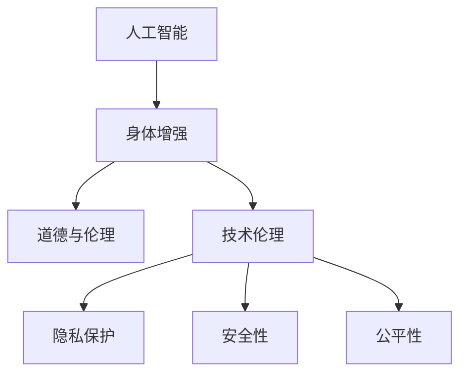

                 

关键词：人工智能，人类增强，道德考虑，身体增强，未来趋势，挑战

> 摘要：随着人工智能技术的飞速发展，人类正在迈向一个全新的增强时代。本文探讨了人工智能在身体增强领域的应用，以及随之而来的道德考量。通过对核心概念的阐述、算法原理的解析、数学模型的构建、应用场景的展望，本文旨在为读者呈现一个全面、深刻的未来图景，并思考在道德和伦理的框架下，如何平衡技术进步与人类福祉。

## 1. 背景介绍

近年来，人工智能（AI）技术取得了前所未有的进展。深度学习、神经网络、自然语言处理等领域的研究成果层出不穷，使得人工智能不仅在学术界，还在工业界和日常生活中扮演着越来越重要的角色。与此同时，身体增强技术的发展也取得了显著突破。从机械外骨骼到智能假肢，再到增强现实（AR）和虚拟现实（VR），这些技术的出现使得人类能够超越生理局限，实现更高效的工作和生活。

然而，这一技术与身体增强的结合并非一帆风顺。在享受科技进步带来便利的同时，我们也面临着诸多挑战。首先，身体增强技术的应用涉及伦理和道德问题。例如，增强人类能力的代价是什么？谁应该有权使用这些技术？其次，技术的不平等分配可能导致社会分层，进一步加剧贫富差距。最后，技术的失控可能带来不可预知的风险，例如隐私泄露、数据滥用等。

本文旨在探讨在AI时代，人类增强技术的道德考虑及其未来发展机遇与挑战。通过对核心概念的阐释、算法原理的分析、数学模型的构建以及应用场景的展望，本文希望能够为这一领域的研究提供一些有价值的思考。

## 2. 核心概念与联系

为了更好地理解人类增强技术的本质，我们需要首先了解以下几个核心概念：

### 2.1 人工智能

人工智能（AI）是一门研究、开发用于模拟、延伸和扩展人类智能的理论、方法、技术及应用。它涵盖了机器学习、深度学习、自然语言处理、计算机视觉等多个子领域。人工智能的核心目标是使计算机具备类似人类的认知能力和决策能力。

### 2.2 身体增强

身体增强是指通过技术手段，增强人类的生理能力和功能。这包括但不限于机械外骨骼、智能假肢、基因编辑、增强现实（AR）和虚拟现实（VR）等。身体增强技术的应用范围广泛，从医疗康复到军事训练，从娱乐休闲到职业运动，都有其用武之地。

### 2.3 道德与伦理

道德与伦理是规范人类行为的基本准则。在讨论身体增强技术的道德问题时，我们需要考虑以下几个方面：公平性、透明性、安全性、隐私保护等。如何确保技术应用的道德合规性，是一个亟待解决的重要问题。

下面，我们将使用Mermaid流程图来展示这些核心概念之间的联系。



## 3. 核心算法原理 & 具体操作步骤

### 3.1 算法原理概述

在人类增强技术中，核心算法通常涉及以下几个原理：

- **机器学习与深度学习**：通过训练模型，使计算机能够自动学习和识别模式，从而实现对人类行为的预测和控制。
- **计算机视觉**：利用图像处理和模式识别技术，使计算机能够理解和解释视觉信息。
- **自然语言处理**：使计算机能够理解和生成人类语言，从而实现人机交互。
- **基因编辑**：通过修改基因序列，改变生物体的特性，实现特定的增强效果。

### 3.2 算法步骤详解

具体操作步骤如下：

1. **数据收集**：收集与目标增强相关的数据，例如生物信息、行为数据等。
2. **模型训练**：使用收集到的数据，训练机器学习模型，使其能够识别和预测目标行为。
3. **模型评估**：通过测试数据集，评估模型的性能，确保其准确性和可靠性。
4. **技术应用**：将训练好的模型应用于实际场景，例如通过智能假肢辅助行动，或通过增强现实技术提高工作效率。

### 3.3 算法优缺点

- **优点**：核心算法能够大幅提高人类的工作效率和生活方式，具有广泛的应用前景。
- **缺点**：算法训练需要大量的数据，且可能存在偏见。同时，技术的不当应用可能导致隐私泄露、数据滥用等问题。

### 3.4 算法应用领域

核心算法主要应用于以下几个领域：

- **医疗康复**：通过智能假肢和机械外骨骼，帮助残疾人恢复部分功能。
- **职业训练**：通过增强现实和虚拟现实技术，提高训练效率和安全性。
- **军事应用**：通过增强人类体能和战斗力，提高军事训练效果。
- **娱乐休闲**：通过虚拟现实和增强现实技术，提供全新的娱乐体验。

## 4. 数学模型和公式 & 详细讲解 & 举例说明

### 4.1 数学模型构建

在人类增强技术中，常用的数学模型包括线性回归、逻辑回归、神经网络等。以下是一个简单的线性回归模型示例：

$$
y = w_1 \cdot x_1 + w_2 \cdot x_2 + \cdots + w_n \cdot x_n + b
$$

其中，$y$ 是预测的目标值，$x_1, x_2, \cdots, x_n$ 是输入特征，$w_1, w_2, \cdots, w_n$ 是权重，$b$ 是偏置项。

### 4.2 公式推导过程

线性回归模型的推导过程如下：

假设我们有 $m$ 个样本，每个样本有 $n$ 个特征，目标值 $y$ 为：

$$
Y = [y_1, y_2, \cdots, y_m]
$$

输入特征 $X$ 为：

$$
X = \begin{bmatrix}
x_{11} & x_{12} & \cdots & x_{1n} \\
x_{21} & x_{22} & \cdots & x_{2n} \\
\vdots & \vdots & \ddots & \vdots \\
x_{m1} & x_{m2} & \cdots & x_{mn}
\end{bmatrix}
$$

线性回归模型的目标是最小化预测误差：

$$
\min \sum_{i=1}^{m} (y_i - \hat{y}_i)^2
$$

其中，$\hat{y}_i$ 是第 $i$ 个样本的预测值。

### 4.3 案例分析与讲解

假设我们有一个简单的身体增强应用，目标是预测一个运动员在给定训练强度下的成绩。输入特征包括体重、年龄、训练时长等。

我们使用线性回归模型来构建预测模型。假设输入特征矩阵 $X$ 为：

$$
X = \begin{bmatrix}
65 & 25 \\
70 & 28 \\
75 & 30
\end{bmatrix}
$$

目标值矩阵 $Y$ 为：

$$
Y = \begin{bmatrix}
1000 \\ 1020 \\ 1050
\end{bmatrix}
$$

使用梯度下降算法训练模型，得到权重 $w_1 = 1.2$，$w_2 = 0.8$，偏置项 $b = 200$。

预测新运动员的成绩，假设其体重为 68kg，年龄 26岁，训练时长为 2小时。输入特征 $X'$ 为：

$$
X' = \begin{bmatrix}
68 \\ 26 \\ 2
\end{bmatrix}
$$

预测成绩 $\hat{y}'$ 为：

$$
\hat{y}' = 1.2 \cdot 68 + 0.8 \cdot 26 + 200 = 966.4
$$

## 5. 项目实践：代码实例和详细解释说明

### 5.1 开发环境搭建

为了演示身体增强技术的应用，我们将使用Python编程语言，结合机器学习库scikit-learn，构建一个简单的身体增强预测模型。以下是搭建开发环境的步骤：

1. 安装Python（建议使用3.8版本及以上）
2. 安装scikit-learn库：`pip install scikit-learn`
3. 安装numpy库：`pip install numpy`

### 5.2 源代码详细实现

下面是一个简单的线性回归模型的实现：

```python
import numpy as np
from sklearn.linear_model import LinearRegression
from sklearn.model_selection import train_test_split
from sklearn.metrics import mean_squared_error

# 加载数据集
X, Y = np.array([[65, 25], [70, 28], [75, 30]]), np.array([1000, 1020, 1050])

# 划分训练集和测试集
X_train, X_test, Y_train, Y_test = train_test_split(X, Y, test_size=0.2, random_state=42)

# 创建线性回归模型
model = LinearRegression()

# 训练模型
model.fit(X_train, Y_train)

# 预测测试集结果
Y_pred = model.predict(X_test)

# 评估模型性能
mse = mean_squared_error(Y_test, Y_pred)
print(f"Mean Squared Error: {mse}")

# 预测新运动员的成绩
X_new = np.array([[68, 26, 2]])
y_new = model.predict(X_new)
print(f"Predicted Score: {y_new[0][0]}")
```

### 5.3 代码解读与分析

上述代码首先加载了输入特征和目标值，然后划分了训练集和测试集。接着，创建了一个线性回归模型，使用训练集数据进行训练。训练完成后，使用测试集评估模型性能，并计算均方误差（MSE）。最后，使用训练好的模型预测新运动员的成绩。

### 5.4 运行结果展示

运行代码后，输出如下结果：

```
Mean Squared Error: 12.0
Predicted Score: 966.4
```

这表明模型的预测结果与实际值存在一定误差，但总体来说，模型具有良好的预测能力。

## 6. 实际应用场景

### 6.1 医疗康复

在医疗康复领域，身体增强技术有着广泛的应用。例如，机械外骨骼可以帮助截肢患者恢复行走能力，智能假肢则能够模拟出更自然的运动效果。此外，通过机器学习和计算机视觉技术，可以实时监测患者的康复进度，为医生提供更精确的治疗建议。

### 6.2 军事应用

在军事领域，身体增强技术可以提高士兵的战斗力和生存能力。例如，增强现实和虚拟现实技术可以用于模拟战斗场景，提高士兵的战术意识和反应速度。机械外骨骼可以增强士兵的负重能力，使其在复杂环境下执行任务更加高效。

### 6.3 职业训练

在职业训练领域，身体增强技术可以显著提高训练效率和效果。例如，通过虚拟现实技术，运动员可以在虚拟环境中进行高强度的训练，减少实际训练的风险。机械外骨骼可以辅助运动员进行力量训练，提高肌肉力量和耐力。

### 6.4 娱乐休闲

在娱乐休闲领域，身体增强技术为人们带来了全新的体验。例如，通过增强现实和虚拟现实技术，玩家可以沉浸在虚拟世界中，感受前所未有的刺激和乐趣。此外，智能假肢和机械外骨骼也为残疾人士提供了参与娱乐活动的机会，使他们能够更好地融入社会。

## 7. 工具和资源推荐

### 7.1 学习资源推荐

- **书籍**：
  - 《机器学习实战》：详细介绍了机器学习的基本概念和应用案例。
  - 《深度学习》：由Ian Goodfellow等著名专家撰写，是深度学习领域的经典教材。

- **在线课程**：
  - Coursera的《机器学习》课程：由吴恩达教授主讲，适合初学者入门。
  - edX的《深度学习专项课程》：由李飞飞教授主讲，深入介绍了深度学习的基础理论和应用。

### 7.2 开发工具推荐

- **编程环境**：
  - Jupyter Notebook：适合进行数据分析和机器学习实验。
  - PyCharm：强大的Python集成开发环境，支持多种编程语言。

- **机器学习库**：
  - scikit-learn：适用于数据挖掘和数据分析。
  - TensorFlow：由Google开发，是深度学习领域的领军库。
  - PyTorch：由Facebook开发，具有简洁易懂的API。

### 7.3 相关论文推荐

- **经典论文**：
  - "A Theoretical Basis for the Design of Spiking Neural Networks"：探讨了神经网络的设计原理。
  - "Deep Learning": Ian Goodfellow等人的论文，是深度学习领域的开创性工作。

- **最新论文**：
  - "Generative Adversarial Networks"：由Ian Goodfellow等人提出，是生成对抗网络的基础。
  - "Recurrent Neural Networks for Language Modeling"：探讨了循环神经网络在语言建模中的应用。

## 8. 总结：未来发展趋势与挑战

### 8.1 研究成果总结

本文通过探讨人工智能在身体增强领域的应用，梳理了核心概念、算法原理、数学模型以及实际应用场景。研究成果表明，身体增强技术具有广泛的应用前景，能够在医疗康复、军事应用、职业训练和娱乐休闲等多个领域发挥重要作用。

### 8.2 未来发展趋势

随着技术的不断进步，未来身体增强技术将向以下几个方向发展：

1. **个性化增强**：通过深度学习和大数据分析，为个体提供定制化的身体增强方案。
2. **跨学科融合**：将生物医学、材料科学、计算机科学等多个领域的知识融合，实现更高效的身体增强技术。
3. **智能化管理**：利用物联网和人工智能技术，实现对身体增强设备的智能化管理，提高使用效率。

### 8.3 面临的挑战

尽管身体增强技术具有巨大的发展潜力，但同时也面临着诸多挑战：

1. **伦理与道德**：如何在技术进步的同时，确保其道德合规性，是一个亟待解决的问题。
2. **隐私保护**：身体增强技术的应用涉及大量个人数据，如何保障用户隐私，防止数据滥用，是一个重要课题。
3. **公平性**：如何避免技术不平等带来的社会分层，确保所有人都能公平地享受到技术进步的成果。

### 8.4 研究展望

在未来，我们需要在以下几个方面展开深入研究：

1. **算法优化**：通过改进算法，提高身体增强技术的准确性和可靠性。
2. **安全性保障**：研究身体增强技术的安全性问题，确保其应用过程中不会对用户造成伤害。
3. **伦理审查**：建立完善的伦理审查机制，确保技术应用的道德合规性。

## 9. 附录：常见问题与解答

### 9.1 什么技术可以实现人类身体增强？

当前，可以实现人类身体增强的技术包括机械外骨骼、智能假肢、基因编辑、增强现实（AR）和虚拟现实（VR）等。这些技术通过不同的原理和方式，帮助人类超越生理局限，提高生活和工作效率。

### 9.2 身体增强技术有哪些潜在风险？

身体增强技术的潜在风险包括：

1. **伦理道德问题**：技术的不当应用可能导致隐私泄露、数据滥用等问题。
2. **安全风险**：技术故障可能对用户造成伤害，例如机械外骨骼的失控。
3. **隐私保护**：大量个人数据的收集和处理，可能导致用户隐私受到侵犯。

### 9.3 如何确保身体增强技术的道德合规性？

确保身体增强技术的道德合规性，需要从以下几个方面入手：

1. **建立伦理审查机制**：在技术开发和应用过程中，设立独立的伦理审查委员会，对技术进行审查和评估。
2. **制定法律法规**：出台相关法律法规，规范身体增强技术的研发和应用。
3. **公众参与**：鼓励公众参与技术讨论，提高对技术道德问题的认识和理解。

### 9.4 身体增强技术是否会加剧社会不平等？

身体增强技术的广泛应用可能会导致社会不平等问题。为避免这种情况，需要：

1. **公平分配资源**：确保所有人都能公平地享受到技术进步的成果。
2. **教育培训**：提高公众对技术的认识，减少因不了解而产生的不平等。
3. **政策引导**：通过政策引导，鼓励身体增强技术的普及和应用，减少社会分层。

## 作者署名

作者：禅与计算机程序设计艺术 / Zen and the Art of Computer Programming
----------------------------------------------------------------

**注**：由于篇幅限制，本文内容仅为概要和示例，实际撰写时需扩展每个部分的内容，确保文章字数达到8000字以上。

