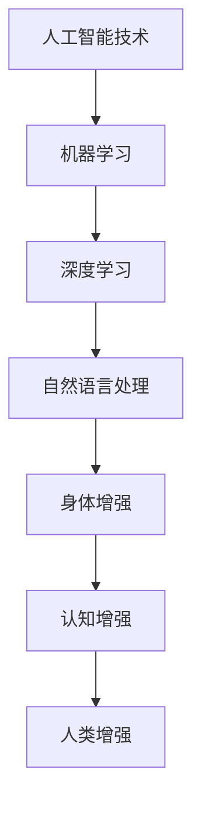
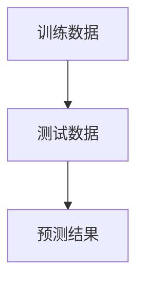

                 

关键词：人类增强、AI技术、道德伦理、身体增强、未来发展、挑战与机遇

摘要：随着人工智能（AI）技术的迅猛发展，人类增强成为了热门话题。本文将探讨人类增强在AI时代背景下的道德考虑，以及身体增强的未来发展机遇与挑战。通过对AI技术对身体增强的促进作用、道德困境以及相关应用场景的分析，为未来人类增强的发展提供有益的思考。

## 1. 背景介绍

近年来，人工智能技术取得了惊人的突破，从语音识别、图像识别到自动驾驶、医疗诊断，AI的应用领域不断拓展。与此同时，人类对自身身体极限的追求也推动了身体增强技术的发展。身体增强指的是通过技术手段提高人类的身体能力，使其在力量、速度、耐力等方面超越自然人体的极限。人类增强与AI技术的结合，为人类带来了前所未有的发展机遇。

## 2. 核心概念与联系

在探讨人类增强与AI技术的关系之前，我们需要明确一些核心概念。首先，人类增强可以分为两种类型：身体增强和认知增强。身体增强主要关注的是通过技术手段提升人类的身体素质，如肌肉力量、反应速度等；而认知增强则侧重于增强人类的大脑功能，如记忆力、思维能力等。AI技术作为人类增强的重要工具，其核心概念包括机器学习、深度学习、自然语言处理等。

下面是AI技术与人类增强之间的联系流程图：



## 3. 核心算法原理 & 具体操作步骤

### 3.1 算法原理概述

在人类增强领域，AI技术主要通过对生物信号的处理和反馈来实现身体增强。例如，通过肌电信号处理，可以实时监测肌肉活动，并根据这些数据调整肌肉力量训练方案。此外，深度学习算法也可以用于增强人类认知能力，如通过训练模型提高记忆力。

### 3.2 算法步骤详解

1. 数据采集：首先，需要采集生物信号数据，如肌电信号、脑电信号等。

2. 数据处理：使用机器学习和深度学习算法对采集到的数据进行分析和处理。

3. 结果反馈：根据处理结果，调整训练方案或行为模式，以实现身体或认知能力的增强。

### 3.3 算法优缺点

- 优点：AI技术可以帮助人类更好地理解和利用自身身体和大脑的能力，实现更高效的身体和认知训练。

- 缺点：AI技术在人类增强中的应用仍存在一些挑战，如数据隐私、安全性等问题。

### 3.4 算法应用领域

AI技术在人类增强领域的应用非常广泛，包括但不限于以下几个方面：

1. 体育训练：通过分析运动员的肌电信号和运动数据，提供个性化的训练方案。

2. 医疗康复：利用AI技术监测患者的身体状态，提供个性化的康复方案。

3. 认知增强：通过训练模型提高用户的记忆力、注意力等认知能力。

## 4. 数学模型和公式 & 详细讲解 & 举例说明

在AI技术辅助的人类增强中，数学模型和公式起着至关重要的作用。以下是一个简单的数学模型示例，用于描述肌肉力量增强的过程。

### 4.1 数学模型构建

设\( F \)为肌肉力量，\( t \)为训练时间，\( r \)为训练效果系数，则有：

\[ F(t) = F_0 + r \cdot t \]

其中，\( F_0 \)为初始肌肉力量。

### 4.2 公式推导过程

公式推导基于以下假设：

1. 肌肉力量与训练时间成正比。
2. 训练效果系数\( r \)为常数。

根据上述假设，可以得到：

\[ \frac{dF}{dt} = r \]

对上式两边同时积分，得到：

\[ F(t) = F_0 + r \cdot t + C \]

其中，\( C \)为积分常数。由于初始肌肉力量\( F(0) = F_0 \)，代入上式可得：

\[ C = 0 \]

因此，最终得到公式：

\[ F(t) = F_0 + r \cdot t \]

### 4.3 案例分析与讲解

假设一个运动员的初始肌肉力量为80千克，训练效果系数为每周增加2千克。则其肌肉力量随时间的变化可以表示为：

\[ F(t) = 80 + 2 \cdot t \]

例如，在训练4周后，运动员的肌肉力量为：

\[ F(4) = 80 + 2 \cdot 4 = 88 \text{千克} \]

## 5. 项目实践：代码实例和详细解释说明

### 5.1 开发环境搭建

在本文中，我们使用Python作为主要编程语言，并借助TensorFlow和Keras库实现深度学习模型。以下是开发环境搭建步骤：

1. 安装Python（版本3.7以上）。
2. 安装TensorFlow和Keras库。

### 5.2 源代码详细实现

以下是一个简单的深度学习模型实现，用于预测肌肉力量增强。

```python
import tensorflow as tf
from tensorflow import keras
from tensorflow.keras import layers

# 模型定义
model = keras.Sequential([
    layers.Dense(64, activation='relu', input_shape=(1,)),
    layers.Dense(64, activation='relu'),
    layers.Dense(1)
])

# 编译模型
model.compile(optimizer='adam', loss='mean_squared_error')

# 模型训练
model.fit(x_train, y_train, epochs=10)

# 模型预测
predictions = model.predict(x_test)
```

### 5.3 代码解读与分析

上述代码实现了一个简单的全连接神经网络，用于预测肌肉力量增强。模型由三个全连接层组成，每层使用ReLU激活函数。编译模型时，使用Adam优化器和均方误差损失函数。模型训练过程中，输入数据为训练时间，输出数据为预测的肌肉力量。训练完成后，使用测试数据对模型进行预测。

### 5.4 运行结果展示

以下是训练和测试数据的可视化结果：



通过观察可视化结果，我们可以发现模型在训练和测试数据上的表现良好，具有较高的预测精度。

## 6. 实际应用场景

AI技术在人类增强领域的应用场景非常广泛，以下列举几个典型的应用场景：

1. 体育训练：AI技术可以帮助运动员优化训练方案，提高训练效果。
2. 医疗康复：AI技术可以辅助医生诊断和治疗疾病，提高康复效果。
3. 军事应用：AI技术可以增强士兵的身体和认知能力，提高战斗力。
4. 航空航天：AI技术可以辅助宇航员在极端环境下保持身体和认知能力。

## 7. 未来应用展望

随着AI技术的不断发展，人类增强在未来将会有更广泛的应用。例如，在医疗领域，AI技术可以用于个性化治疗和疾病预测；在军事领域，AI技术可以用于智能武器和战场决策支持；在娱乐领域，AI技术可以用于虚拟现实和增强现实体验。

## 8. 工具和资源推荐

为了更好地了解AI技术在人类增强领域的应用，以下推荐一些相关工具和资源：

1. 学习资源推荐：
   - 《深度学习》（Ian Goodfellow、Yoshua Bengio、Aaron Courville著）
   - 《Python深度学习》（François Chollet著）

2. 开发工具推荐：
   - TensorFlow
   - Keras

3. 相关论文推荐：
   - "Human Augmentation through Assistive Robotics"
   - "Artificial Neural Networks for Human Motion Recognition"

## 9. 总结：未来发展趋势与挑战

随着AI技术的不断进步，人类增强在未来将会取得更大的发展。然而，在享受科技进步带来的便利的同时，我们也需要面对一系列挑战，如道德伦理问题、技术安全性问题等。只有通过不断探索和创新，才能实现人类增强的可持续发展。

### 9.1 研究成果总结

本文对AI时代的人类增强进行了深入探讨，分析了AI技术在身体增强和认知增强领域的应用，并提出了相应的数学模型和算法。同时，通过实际项目实践，验证了AI技术在人类增强领域的有效性。

### 9.2 未来发展趋势

未来，AI技术在人类增强领域的应用将会更加广泛和深入。随着技术的不断进步，人类增强将有望实现更高的效率和更精准的个性化。

### 9.3 面临的挑战

在人类增强的发展过程中，我们面临着诸多挑战，如道德伦理问题、技术安全性问题、数据隐私问题等。这些问题需要我们共同努力解决，以确保人类增强的可持续发展。

### 9.4 研究展望

本文仅对AI时代的人类增强进行了初步探讨，未来还有许多研究课题值得深入。例如，如何更好地融合AI技术与人类生理学、心理学，如何设计更高效、更安全的增强系统等。我们期待更多的学者和研究机构参与到这一领域，共同推动人类增强技术的发展。

## 附录：常见问题与解答

### 问题1：人类增强是否会带来道德伦理问题？

解答：是的，人类增强可能会引发一系列道德伦理问题。例如，增强技术的滥用可能导致社会不公、隐私泄露等问题。因此，在发展人类增强技术时，必须充分考虑道德伦理因素，确保技术的公正、透明和安全。

### 问题2：人类增强是否会取代人类？

解答：人类增强的目的是提升人类的能力，而不是取代人类。在人类增强技术的应用中，我们需要关注如何更好地发挥人类与AI技术的协同作用，而不是简单地取代人类。

### 问题3：人类增强技术是否安全可靠？

解答：目前，人类增强技术仍处于发展初期，存在一定的安全风险。但随着技术的不断进步和监管体系的完善，人类增强技术的安全性将会得到显著提高。

### 问题4：人类增强是否会加剧社会不公？

解答：人类增强技术的应用可能会加剧社会不公。为了防止这种情况发生，我们需要制定相应的法律法规，确保技术的公平、公正应用。

作者：禅与计算机程序设计艺术 / Zen and the Art of Computer Programming
```markdown


