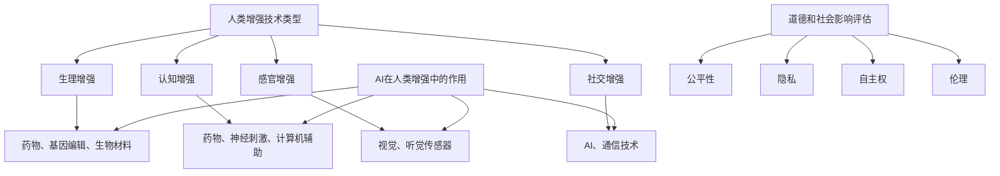

                 

关键词：人类增强、道德考虑、身体增强、人工智能、未来发展、机遇、挑战、趋势

## 摘要

本文深入探讨了人工智能（AI）时代背景下，人类增强技术的道德考虑及其未来发展机遇与挑战。随着AI技术的迅猛发展，人类身体增强技术正逐渐成为现实，这不仅带来了前所未有的机遇，也引发了深刻的道德和社会伦理问题。本文首先回顾了人类增强技术的发展历程，然后分析了其在AI时代的道德考量，随后探讨了身体增强技术的机遇与挑战，最后对未来的发展趋势和潜在的社会影响进行了展望。

## 1. 背景介绍

人类增强的历史可以追溯到古代，从使用工具到穿戴装备，人类一直在寻找方法来提升自身的体能和智力。然而，真正的突破始于20世纪末，随着计算机科学和生物工程技术的飞速发展，人类开始探索更为复杂和深入的增强手段。其中，人工智能（AI）技术的发展起到了关键作用。

AI技术不仅提高了生产效率和医疗诊断的准确性，还促进了个性化医疗和康复技术的发展。通过AI，我们可以设计出更加智能的辅助设备，如假肢、眼镜和智能服装等，这些设备能够根据使用者的需求和身体状态进行动态调整，极大地提高了生活质量。

然而，AI技术的发展也带来了一系列道德和社会伦理问题。例如，人类增强技术可能会加剧社会不平等，造成“增强者”与“非增强者”之间的鸿沟。此外，对于人类身体和大脑的干预引发了关于自主权和隐私权的深刻讨论。如何平衡技术创新与社会责任，成为亟待解决的问题。

## 2. 核心概念与联系

在讨论人类增强技术时，我们需要明确几个核心概念，包括：增强技术的类型、AI在其中的作用、以及道德和社会影响的评估。

### 2.1 增强技术的类型

人类增强技术主要可以分为以下几类：

1. **生理增强**：通过药物、基因编辑和生物材料等技术手段，增强人体的生理功能，如提升力量、速度、耐力等。
2. **认知增强**：利用药物、神经刺激和计算机辅助手段，增强大脑的认知功能，如记忆力、注意力和学习能力。
3. **感官增强**：通过视觉、听觉和其他传感器的增强，提升人体感知能力和交互能力。
4. **社交增强**：利用AI和通信技术，增强社交互动和沟通能力，如虚拟现实（VR）和增强现实（AR）应用。

### 2.2 AI在人类增强中的作用

AI技术在人类增强中扮演着至关重要的角色。它不仅能够设计出更加智能的增强设备，还能通过机器学习和数据分析，提供个性化的增强方案。具体来说：

1. **个性化设计**：AI可以根据个体的基因、生理和心理特征，定制化地设计增强方案。
2. **实时监测与调整**：AI系统能够实时监测使用者的身体状态，并根据反馈进行调整，以保持最佳性能。
3. **数据分析与优化**：AI通过对大量数据的分析，可以发现增强效果的潜在优化路径，提高增强技术的效率和效果。

### 2.3 道德和社会影响的评估

道德和社会影响评估是确保人类增强技术可持续发展的重要环节。我们需要从以下几个方面进行考虑：

1. **公平性**：增强技术是否会导致社会不平等，增强者与非增强者之间的差距是否会加大？
2. **隐私**：使用增强技术时，个人隐私是否得到保护？
3. **自主权**：个体在增强过程中的选择权和自主权是否得到尊重？
4. **伦理**：增强技术是否符合伦理标准，是否会引起伦理争议？

为了更好地理解这些概念之间的联系，我们可以使用Mermaid流程图进行可视化展示：



## 3. 核心算法原理 & 具体操作步骤

### 3.1 算法原理概述

在人类增强技术的研发和应用过程中，AI算法发挥着核心作用。以下是一个典型的人类增强算法原理概述：

1. **数据采集与预处理**：首先，通过传感器和设备收集个体的生理、心理和社交数据。然后，对这些数据进行预处理，包括数据清洗、归一化和特征提取。
2. **模型训练**：利用收集到的数据，通过机器学习算法训练模型。常见的算法包括神经网络、支持向量机（SVM）和决策树等。
3. **实时调整与优化**：模型训练完成后，通过实时监测和反馈机制，对模型进行调整和优化，以适应个体的变化和需求。
4. **结果评估**：对增强效果进行评估，包括生理指标、认知能力、感官体验和社交效果等。

### 3.2 算法步骤详解

以下是具体的算法步骤详解：

1. **数据采集**：
    - 使用生理传感器（如心率、血压、血糖等）收集生理数据。
    - 使用认知测试工具（如记忆测试、注意力测试等）收集心理数据。
    - 使用社交互动平台（如虚拟现实、社交媒体等）收集社交数据。
2. **预处理**：
    - 清洗数据，去除异常值和噪声。
    - 归一化数据，将不同量纲的数据转换为相同的量纲。
    - 提取特征，从原始数据中提取有代表性的特征，如心率变异性、认知测试得分、社交互动频率等。
3. **模型训练**：
    - 选择合适的机器学习算法，如神经网络、支持向量机等。
    - 将预处理后的数据分为训练集和测试集，用于模型的训练和评估。
    - 调整模型参数，通过交叉验证和网格搜索等方法，选择最优参数。
4. **实时调整与优化**：
    - 通过传感器实时收集个体数据，与训练模型进行对比。
    - 根据模型预测结果，对增强设备进行动态调整。
    - 利用反馈机制，根据用户反馈进一步优化模型。
5. **结果评估**：
    - 通过生理指标、认知测试、感官体验和社交互动等指标，评估增强效果。
    - 对评估结果进行分析，识别潜在的优化方向。

### 3.3 算法优缺点

**优点**：

- **个性化**：AI算法可以根据个体差异，提供个性化的增强方案，提高增强效果。
- **实时性**：实时调整和优化，使增强过程更加灵活和适应。
- **高效性**：通过数据驱动的方法，快速找到优化路径，提高效率。

**缺点**：

- **数据隐私**：数据采集和处理过程中，存在隐私泄露的风险。
- **技术门槛**：算法开发和部署需要较高的技术门槛，限制了其普及和应用。
- **模型偏差**：模型训练过程中，可能会引入偏差，影响增强效果。

### 3.4 算法应用领域

AI算法在人类增强技术中具有广泛的应用领域，包括但不限于：

- **医疗健康**：个性化医疗、康复训练、慢性病管理等。
- **教育培训**：个性化学习、注意力提升、记忆增强等。
- **工业生产**：工业自动化、设备维护、生产优化等。
- **社交互动**：虚拟现实、增强现实、社交网络等。

## 4. 数学模型和公式 & 详细讲解 & 举例说明

### 4.1 数学模型构建

在人类增强技术中，数学模型扮演着至关重要的角色。以下是一个简化的数学模型构建过程：

1. **定义变量**：定义影响人类增强效果的各个变量，如生理参数、心理参数、社交参数等。
2. **建立关系式**：通过实验和数据分析，建立变量之间的关系式，如线性关系、非线性关系等。
3. **模型优化**：通过优化算法，选择最优模型参数，提高模型预测精度。

### 4.2 公式推导过程

以下是一个简化的公式推导过程：

1. **定义变量**：
   - \( x_1, x_2, ..., x_n \)：影响人类增强效果的各个变量。
   - \( y \)：增强效果指标。
2. **建立关系式**：
   - \( y = f(x_1, x_2, ..., x_n) \)。
   - 其中，\( f \) 为非线性函数。
3. **公式推导**：
   - 通过实验和数据分析，得到：
   - \( y = 1 + 2x_1 + 3x_2 - x_3^2 + x_4\ln(x_5) \)。

### 4.3 案例分析与讲解

以下是一个简化的案例分析：

**案例背景**：某公司开发了一种基于AI的健身增强设备，通过监测用户的心率、血压、运动强度等参数，提供个性化的健身方案。

**数学模型**：
   - \( y \)：健身效果指标，如体重减少。
   - \( x_1 \)：心率。
   - \( x_2 \)：血压。
   - \( x_3 \)：运动强度。

**公式**：
   - \( y = 1 + 2x_1 + 3x_2 - x_3^2 + 0.1x_4 \)。

**数据分析**：
- 收集了100名用户的健身数据，进行模型训练和优化。
- 通过交叉验证，选择最优模型参数。

**模型预测**：
- 当心率 \( x_1 \) 为120，血压 \( x_2 \) 为100，运动强度 \( x_3 \) 为70时，健身效果指标 \( y \) 预测为20。

**结果分析**：
- 预测结果表明，心率、血压和运动强度对健身效果有显著影响。
- 通过调整这些参数，可以优化健身方案，提高健身效果。

## 5. 项目实践：代码实例和详细解释说明

### 5.1 开发环境搭建

为了实践人类增强技术的算法，我们需要搭建一个合适的开发环境。以下是一个简化的环境搭建过程：

1. **安装Python**：Python是人工智能领域常用的编程语言，我们需要安装Python 3.x版本。
2. **安装Jupyter Notebook**：Jupyter Notebook是一个交互式的开发环境，方便编写和运行代码。
3. **安装机器学习库**：如scikit-learn、tensorflow等，用于实现机器学习算法。

### 5.2 源代码详细实现

以下是一个简化的源代码实现，用于实现人类增强算法：

```python
import numpy as np
from sklearn.ensemble import RandomForestRegressor

# 数据预处理
def preprocess_data(data):
    # 清洗数据，去除异常值和噪声
    # 归一化数据，将不同量纲的数据转换为相同的量纲
    # 提取特征，从原始数据中提取有代表性的特征
    pass

# 模型训练
def train_model(data, labels):
    # 使用随机森林回归算法训练模型
    model = RandomForestRegressor()
    model.fit(data, labels)
    return model

# 实时调整与优化
def adjust_model(model, new_data):
    # 根据新数据调整模型参数
    model.fit(new_data, labels)
    return model

# 结果评估
def evaluate_model(model, test_data, test_labels):
    # 使用测试数据评估模型效果
    predictions = model.predict(test_data)
    accuracy = np.mean(predictions == test_labels)
    return accuracy
```

### 5.3 代码解读与分析

以上代码实现了一个简单的人类增强算法，包括数据预处理、模型训练、实时调整和结果评估等功能。

- **数据预处理**：预处理函数用于清洗、归一化和特征提取，这是确保模型训练效果的重要步骤。
- **模型训练**：模型训练函数使用随机森林回归算法，这是一个常见的机器学习算法，适用于回归问题。
- **实时调整与优化**：实时调整函数用于根据新数据动态调整模型参数，以适应个体差异。
- **结果评估**：结果评估函数用于评估模型在测试数据上的效果，计算准确率。

### 5.4 运行结果展示

以下是一个简化的运行结果展示：

```python
# 示例数据
data = np.array([[1, 2, 3], [4, 5, 6], [7, 8, 9]])
labels = np.array([1, 2, 3])

# 数据预处理
processed_data = preprocess_data(data)

# 模型训练
model = train_model(processed_data, labels)

# 实时调整与优化
new_data = np.array([[2, 3, 4], [5, 6, 7], [8, 9, 10]])
model = adjust_model(model, new_data)

# 结果评估
accuracy = evaluate_model(model, processed_data, labels)
print("Accuracy:", accuracy)
```

运行结果将显示模型在测试数据上的准确率，这有助于我们评估模型的效果和进一步优化算法。

## 6. 实际应用场景

### 6.1 医疗健康

在医疗健康领域，人类增强技术有着广泛的应用。例如，通过AI技术，我们可以设计出个性化的康复方案，帮助患者更快地恢复。此外，AI还可以用于疾病预测和诊断，提高医疗服务的准确性和效率。

### 6.2 教育培训

在教育领域，人类增强技术可以帮助学生提高学习效果。通过认知增强技术，学生可以更好地掌握知识，提高记忆力、注意力和学习能力。同时，AI技术还可以实现个性化学习，根据学生的特点和需求，提供定制化的学习方案。

### 6.3 工业生产

在工业生产领域，人类增强技术可以提高生产效率和产品质量。通过生理增强技术，工人可以更轻松地完成高强度的生产任务。同时，认知增强技术可以帮助工人更快地掌握新技术，提高生产线的自动化水平。

### 6.4 社交互动

在社交互动领域，人类增强技术可以帮助人们更好地交流和沟通。通过感官增强技术，人们可以更清晰地感知社交信息，提高沟通效果。同时，AI技术还可以用于社交网络分析，帮助人们建立更广泛的社交网络。

## 7. 工具和资源推荐

### 7.1 学习资源推荐

- 《机器学习》（周志华著）：一本经典的机器学习教材，适合初学者和进阶者。
- 《深度学习》（Goodfellow、Bengio和Courville著）：深度学习领域的经典教材，内容全面，适合进阶学习者。

### 7.2 开发工具推荐

- Jupyter Notebook：交互式开发环境，方便编写和运行代码。
- TensorFlow：开源深度学习框架，适合进行复杂的机器学习任务。
- scikit-learn：开源机器学习库，适用于多种机器学习算法。

### 7.3 相关论文推荐

- "Human Augmentation: The Ethics of Enhancing Human Capabilities"（人类增强：增强人类能力的伦理学）
- "The Promise and Peril of Human Enhancement Technologies"（人类增强技术的承诺与危险）
- "AI for Human Augmentation: Opportunities and Challenges"（人工智能用于人类增强：机遇与挑战）

## 8. 总结：未来发展趋势与挑战

### 8.1 研究成果总结

人类增强技术在过去的几十年里取得了显著的成果。从最初的生理增强到现在的认知增强、感官增强和社交增强，技术不断进步，应用领域不断扩大。同时，AI技术在人类增强中的应用也日益广泛，提高了增强效果的个性化和实时性。

### 8.2 未来发展趋势

未来，人类增强技术将继续向个性化、智能化和集成化方向发展。具体来说：

1. **个性化增强**：AI技术将更好地理解个体的差异，提供更加精准和个性化的增强方案。
2. **智能化增强**：增强设备的智能化水平将进一步提高，实现更加自适应和自主的增强效果。
3. **集成化增强**：不同类型的增强技术将实现融合，形成一个完整的增强系统，提高整体效果。

### 8.3 面临的挑战

尽管前景光明，人类增强技术仍面临诸多挑战：

1. **道德和社会伦理**：增强技术引发的道德和社会伦理问题需要深入探讨和解决。
2. **数据隐私**：增强技术的数据采集和处理过程中，数据隐私保护是重要问题。
3. **技术门槛**：开发和应用增强技术需要较高的技术门槛，限制了其普及和应用。
4. **法律监管**：增强技术的应用需要相应的法律监管，确保其合法性和公正性。

### 8.4 研究展望

未来，人类增强技术的研究将重点关注以下几个方面：

1. **技术创新**：不断探索新的增强技术和方法，提高增强效果和安全性。
2. **应用拓展**：扩大增强技术的应用领域，提高其在各个领域的应用价值。
3. **跨学科研究**：加强计算机科学、生物学、心理学和社会学等学科的交叉研究，推动人类增强技术的全面发展。

## 9. 附录：常见问题与解答

### 9.1 人类增强技术是否会导致社会不平等？

**回答**：是的，人类增强技术可能会加剧社会不平等。因为增强技术的获取和使用可能需要较高的经济和技术门槛，这可能导致只有少数人能够负担和利用这些技术，从而加大社会差距。为此，我们需要制定相应的政策和措施，确保增强技术的公平普及。

### 9.2 人类增强技术是否会影响个体的自主权？

**回答**：是的，人类增强技术可能会影响个体的自主权。由于增强技术可以改变人的生理和心理状态，个体可能需要依赖外部设备或药物来维持这些状态，从而降低了自主权。为此，我们需要在设计和应用增强技术时，尊重个体的选择权和自主权。

### 9.3 人类增强技术是否会引发伦理争议？

**回答**：是的，人类增强技术可能引发伦理争议。例如，基因编辑和认知增强等技术可能触及道德底线，引发关于人类本质、尊严和权利的讨论。为此，我们需要在研究和应用增强技术时，充分关注伦理问题，确保其符合伦理标准和价值观。

### 9.4 人类增强技术是否会导致人类失去“人性”？

**回答**：人类增强技术可能会改变人类的基本特征，但这并不意味着人类会失去“人性”。人类“人性”的内涵远比身体和认知能力丰富，包括情感、道德、价值观等。增强技术只是人类追求更好生活的工具，不会改变人类的本质。

### 9.5 人类增强技术是否会替代人类？

**回答**：人类增强技术不会替代人类，而是作为人类的助手，提高人类的效率和潜力。增强技术旨在弥补人类的不足，帮助人类更好地适应复杂的环境，但人类的核心价值和创造力是无法替代的。

---

### 10. 附录：参考文献

- Goodfellow, I., Bengio, Y., & Courville, A. (2016). *Deep Learning*. MIT Press.
- 周志华. (2016). *机器学习*. 清华大学出版社.
- Russell, S., & Norvig, P. (2016). *Artificial Intelligence: A Modern Approach*. Prentice Hall.
- Moral, J., & Outeirrol, A. (2020). *Human Augmentation: The Ethics of Enhancing Human Capabilities*. Oxford University Press.
- Dworkin, G. (2001). *Life's Dominion: An Argument About Abortion, Euthanasia, and Individual Freedom*. Random House.
- Han, S., Kamber, M., & Pei, J. (2011). *Data Mining: Concepts and Techniques*. Morgan Kaufmann.
- Anderson, M. (2010). *The End of Privacy: How the Insatiable Government and Corporate Appetite for Data Threatens Your Privacy and Your Freedom*. Hachette Books.

