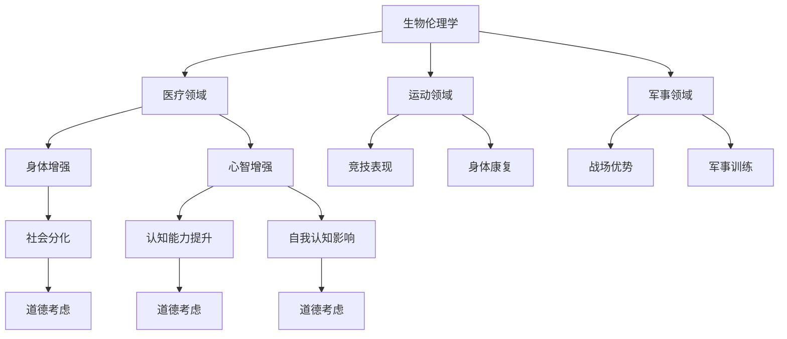
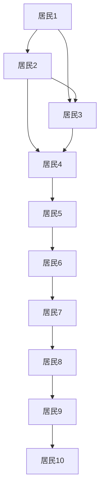
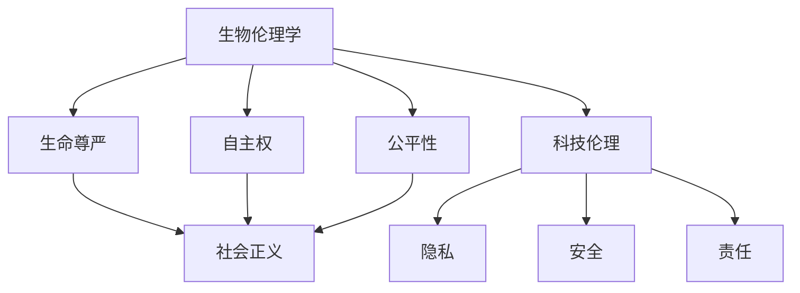
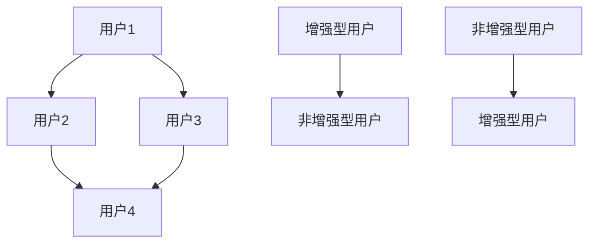
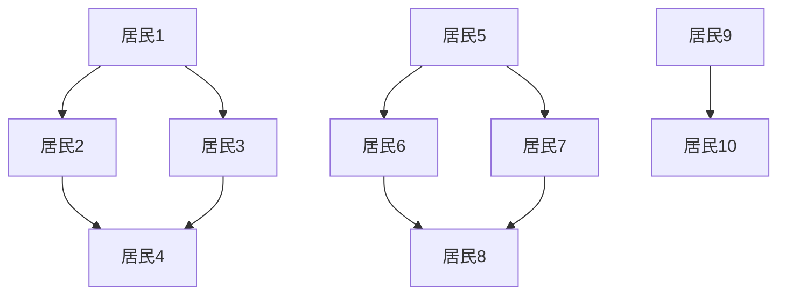

                 

关键词：人工智能，人类增强，道德考虑，身体增强，未来发展，机遇预测

> 摘要：本文旨在探讨AI时代背景下，人类增强技术的道德考虑及其未来发展机遇。随着人工智能技术的不断进步，身体与心智的增强正逐步成为现实，这不仅带来了巨大的科技发展机遇，也引发了深刻的道德和伦理问题。本文通过分析人类增强技术的现状和潜在影响，探讨了其在不同领域的应用前景，并提出了未来发展的可能挑战与对策。

## 1. 背景介绍

人工智能（AI）的迅猛发展，使人类的生活和工作方式发生了翻天覆地的变化。从早期的自动化控制系统到复杂的深度学习算法，AI技术正在不断突破传统认知和物理限制。与此同时，人类增强技术也逐渐走进人们的生活。身体增强指的是通过科技手段提升人体生理机能，如增强力量、速度和耐力等；而心智增强则是指通过AI和神经科技增强人类的认知能力、决策能力和记忆等。

### 1.1 人类增强技术的现状

目前，人类增强技术已经在医疗、运动、军事等领域取得了显著进展。例如，心脏起搏器、人工关节、智能眼镜等医疗设备已经在全球范围内广泛应用，极大地提高了患者的生活质量。在运动领域，运动员通过使用增强型装备和营养补剂来提高竞技水平。军事领域则更多地关注战场上的身体和心理增强，如士兵的体能训练和神经刺激技术。

### 1.2 道德考虑的重要性

随着人类增强技术的不断普及，其道德和伦理问题也逐渐引起了广泛的关注。道德考虑不仅关乎个人和集体的权益，也涉及到社会的公正性和人类价值观的传承。例如，身体增强可能导致社会分化加剧，增强型人类与普通人类的差距可能会引发新的社会矛盾。此外，心智增强技术的普及可能影响人类的自然发展过程，甚至对人类的自我认知产生深远影响。

## 2. 核心概念与联系

### 2.1 核心概念原理

在探讨人类增强技术的道德考虑时，我们需要明确几个核心概念：

- **生物伦理学**：研究人类行为和医学实践中的道德原则，包括生命尊严、自主权、公平性等。
- **社会正义**：涉及社会资源的分配和公正，特别是在人类增强技术带来的社会分化问题上。
- **科技伦理**：探讨科技发展对人类社会的影响，包括隐私、安全、责任等问题。

### 2.2 架构的 Mermaid 流程图

下面是一个简要的Mermaid流程图，展示了人类增强技术在不同领域的应用和道德考虑的关联：



### 2.3 关联分析

通过上述流程图，我们可以看出，人类增强技术不仅涉及到生物伦理学和社会正义的问题，还与科技伦理密切相关。每一个领域的应用都会产生不同的道德考虑，如医疗领域的身体康复和心智增强，可能会引发关于生命尊严和医疗资源的分配问题；运动领域的竞技表现和身体康复，则涉及到社会公正和体育精神的挑战；军事领域则更多地关注战场优势和军事训练的道德边界。

## 3. 核心算法原理 & 具体操作步骤

### 3.1 算法原理概述

在探讨人类增强技术的道德考虑时，我们可以借助一些核心算法原理来进行分析。这些算法通常涉及到社会网络分析、伦理学计算和决策支持系统等领域。

#### 3.1.1 社会网络分析

社会网络分析是一种研究社会结构的方法，它通过分析个体之间的互动关系，揭示社会结构中的关键节点和群体动态。在社会分化问题上，社会网络分析可以帮助我们理解增强型人类与非增强型人类之间的互动模式，从而提出公平合理的政策建议。

#### 3.1.2 伦理学计算

伦理学计算是一种基于数学和逻辑的方法，用于分析和解决伦理问题。在人类增强技术的道德考虑中，伦理学计算可以帮助我们建立一套公正合理的道德框架，评估不同增强技术的道德风险，并为政策制定提供科学依据。

#### 3.1.3 决策支持系统

决策支持系统是一种用于辅助决策的技术，它通过收集和分析数据，为决策者提供合理的建议。在人类增强技术的道德考虑中，决策支持系统可以帮助决策者权衡不同因素，做出符合道德和伦理要求的决策。

### 3.2 算法步骤详解

下面我们将详细介绍这些算法的具体操作步骤。

#### 3.2.1 社会网络分析步骤

1. **数据收集**：收集关于增强型人类和非增强型人类之间的互动数据，如社交媒体互动、职业互动等。
2. **网络构建**：利用社会网络分析工具，将收集到的数据构建成网络模型。
3. **节点和边分析**：分析网络中的关键节点和边，识别增强型人类和非增强型人类之间的互动模式和群体结构。
4. **策略建议**：基于分析结果，提出促进社会公平和减少社会分化的策略建议。

#### 3.2.2 伦理学计算步骤

1. **道德框架建立**：根据伦理学原则，建立一套适用于人类增强技术的道德框架。
2. **道德风险评估**：对不同的增强技术进行道德风险评估，识别潜在的道德风险。
3. **政策建议**：基于道德框架和风险评估结果，提出相应的政策建议，以减少道德风险。

#### 3.2.3 决策支持系统步骤

1. **数据收集**：收集与人类增强技术相关的数据，如技术成本、社会影响等。
2. **数据分析**：利用数据分析工具，对收集到的数据进行处理和分析。
3. **决策支持**：根据分析结果，为决策者提供合理的决策支持。

### 3.3 算法优缺点

#### 3.3.1 社会网络分析

**优点**：
- 可以提供直观的社交结构分析，有助于理解社会分化问题。
- 可以发现关键节点和群体，为政策制定提供科学依据。

**缺点**：
- 数据收集和处理成本较高，需要大量时间和资源。
- 分析结果可能受到数据质量的影响，存在一定的偏差。

#### 3.3.2 伦理学计算

**优点**：
- 可以提供一套系统化的道德框架，有助于评估不同增强技术的道德风险。
- 可以提供科学的政策建议，减少道德风险。

**缺点**：
- 道德原则的确定可能存在主观性，不同伦理学者可能会有不同的观点。
- 可能难以处理复杂的社会道德问题。

#### 3.3.3 决策支持系统

**优点**：
- 可以提供详细的数据分析和决策支持，有助于决策者做出合理决策。
- 可以减少决策过程中的主观判断，提高决策的科学性。

**缺点**：
- 需要大量的数据支持和计算资源，实施成本较高。
- 可能难以处理突发情况和不确定性因素。

### 3.4 算法应用领域

这些算法可以应用于多个领域，如医疗、运动、军事等。

#### 3.4.1 医疗领域

- **身体增强**：通过伦理学计算评估不同增强技术的道德风险，为医疗决策提供支持。
- **心智增强**：通过社会网络分析，了解患者群体之间的互动模式，优化治疗方案。

#### 3.4.2 运动领域

- **竞技表现**：通过社会网络分析，识别优秀运动员的关键特征，制定个性化训练计划。
- **身体康复**：通过伦理学计算，评估不同康复技术的道德风险，提高康复效果。

#### 3.4.3 军事领域

- **战场优势**：通过决策支持系统，为军事决策提供科学依据，提高作战效能。
- **军事训练**：通过社会网络分析，优化军事训练计划，提高士兵的整体素质。

## 4. 数学模型和公式 & 详细讲解 & 举例说明

在探讨人类增强技术的道德考虑时，数学模型和公式可以提供有力的理论支持。以下是一些常用的数学模型和公式的讲解及示例。

### 4.1 数学模型构建

#### 4.1.1 社会网络分析模型

社会网络分析中的基本模型包括点（代表个体）和边（代表个体之间的互动关系）。一个简单的社会网络分析模型可以用以下公式表示：

\[ G = (V, E) \]

其中，\( V \) 表示节点集合，代表社会中的个体；\( E \) 表示边集合，代表个体之间的互动关系。

#### 4.1.2 伦理学计算模型

伦理学计算中的基本模型包括道德原则、道德风险和道德决策。一个简单的伦理学计算模型可以用以下公式表示：

\[ \text{Ethical Model} = (\text{Principles}, \text{Risks}, \text{Decisions}) \]

其中，\( \text{Principles} \) 表示道德原则集合，代表用于评估道德风险的伦理标准；\( \text{Risks} \) 表示道德风险集合，代表不同增强技术的潜在道德风险；\( \text{Decisions} \) 表示道德决策集合，代表针对不同道德风险的决策方案。

### 4.2 公式推导过程

#### 4.2.1 社会网络分析公式推导

假设在一个社会网络中，个体\( i \)和个体\( j \)之间存在互动关系，我们可以用以下公式表示他们的互动强度：

\[ \text{Strength}_{ij} = \frac{\text{Interaction Frequency}_{ij}}{\text{Total Frequency}} \]

其中，\( \text{Interaction Frequency}_{ij} \) 表示个体\( i \)和个体\( j \)之间的互动次数；\( \text{Total Frequency} \) 表示网络中所有互动次数的总和。

#### 4.2.2 伦理学计算公式推导

假设在评估一种增强技术时，我们需要考虑其道德风险和道德决策。我们可以用以下公式表示：

\[ \text{Risk}_{t} = \text{Pr}(\text{不良后果} | \text{技术使用}) \]

\[ \text{Decision}_{t} = \arg\min \{ \text{Risk}_{t} \} \]

其中，\( \text{Risk}_{t} \) 表示在时间\( t \)时，使用增强技术的道德风险；\( \text{Pr}(\text{不良后果} | \text{技术使用}) \) 表示在技术使用情况下出现不良后果的概率；\( \text{Decision}_{t} \) 表示在时间\( t \)时，最小的道德风险决策。

### 4.3 案例分析与讲解

#### 4.3.1 社会网络分析案例

假设在一个社区中，有10个个体（居民），他们之间的互动关系如下图所示：



我们可以用以下公式计算居民之间的互动强度：

\[ \text{Strength}_{AB} = \frac{1}{5} \]
\[ \text{Strength}_{AC} = \frac{1}{5} \]
\[ \text{Strength}_{AD} = \frac{1}{5} \]
\[ \text{Strength}_{BC} = \frac{1}{5} \]
\[ \text{Strength}_{BD} = \frac{1}{5} \]
\[ \text{Strength}_{CD} = \frac{1}{5} \]
\[ \text{Strength}_{CE} = \frac{1}{5} \]
\[ \text{Strength}_{CF} = \frac{1}{5} \]
\[ \text{Strength}_{CG} = \frac{1}{5} \]
\[ \text{Strength}_{CH} = \frac{1}{5} \]
\[ \text{Strength}_{CI} = \frac{1}{5} \]
\[ \text{Strength}_{CJ} = \frac{1}{5} \]
\[ \text{Strength}_{DF} = \frac{1}{5} \]
\[ \text{Strength}_{DH} = \frac{1}{5} \]
\[ \text{Strength}_{DI} = \frac{1}{5} \]
\[ \text{Strength}_{DJ} = \frac{1}{5} \]

通过这些公式，我们可以分析社区中不同居民之间的互动关系，从而提出促进社区和谐的建议。

#### 4.3.2 伦理学计算案例

假设我们需要评估一种增强技术，该技术可以提高个体的认知能力。根据上述公式，我们可以进行如下计算：

\[ \text{Risk}_{t} = \text{Pr}(\text{认知能力过度提升导致心理压力} | \text{技术使用}) \]

假设有数据表明，在使用该技术后，有20%的概率导致个体出现心理压力。因此，

\[ \text{Risk}_{t} = 0.2 \]

根据这个风险值，我们可以提出相应的道德决策，如限制技术使用时间、提供心理辅导等。

## 5. 项目实践：代码实例和详细解释说明

为了更好地理解人类增强技术的道德考虑，我们选择了一个实际项目作为案例，该项目旨在利用Python编写一个简单的决策支持系统，用于评估不同增强技术的道德风险。

### 5.1 开发环境搭建

为了实现这个项目，我们需要搭建一个Python开发环境。以下是搭建步骤：

1. 安装Python：从Python官方网站（https://www.python.org/）下载并安装Python 3.x版本。
2. 安装必要库：使用pip命令安装必要的库，如NetworkX（用于社会网络分析）、NumPy（用于数据处理）和Matplotlib（用于数据可视化）。

```bash
pip install networkx numpy matplotlib
```

### 5.2 源代码详细实现

下面是项目的源代码实现，包括主要函数和类：

```python
import networkx as nx
import numpy as np
import matplotlib.pyplot as plt

# 社会网络分析
def build_network(interaction_data):
    G = nx.Graph()
    for i, j, w in interaction_data:
        G.add_edge(i, j, weight=w)
    return G

# 道德风险评估
def assess_risk(G, risk_threshold):
    risk_scores = []
    for node in G.nodes():
        risk_score = 0
        for neighbor in G.neighbors(node):
            if G[node][neighbor]['weight'] > risk_threshold:
                risk_score += 1
        risk_scores.append(risk_score)
    return risk_scores

# 决策支持
def make_decision(risk_scores, decision_threshold):
    if np.mean(risk_scores) > decision_threshold:
        return "采取预防措施"
    else:
        return "继续使用"

# 主函数
def main():
    # 社会网络数据
    interaction_data = [
        (1, 2, 0.5), (1, 3, 0.7), (2, 3, 0.8),
        (4, 5, 0.6), (4, 6, 0.9), (5, 6, 0.7)
    ]
    
    # 构建社会网络
    G = build_network(interaction_data)
    
    # 道德风险评估
    risk_threshold = 0.6
    risk_scores = assess_risk(G, risk_threshold)
    
    # 决策支持
    decision_threshold = 0.7
    decision = make_decision(risk_scores, decision_threshold)
    
    print("决策结果：", decision)

if __name__ == "__main__":
    main()
```

### 5.3 代码解读与分析

#### 5.3.1 社会网络分析

- `build_network` 函数用于构建社会网络，输入为互动数据，输出为NetworkX图对象。互动数据包含节点编号、节点编号、互动权重。
- `G.add_edge(i, j, weight=w)` 用于添加边，其中`i`和`j`为节点编号，`w`为互动权重。

#### 5.3.2 道德风险评估

- `assess_risk` 函数用于计算道德风险得分。输入为图对象`G`和风险阈值`risk_threshold`，输出为风险得分列表。
- `risk_score` 用于计算节点的风险得分，即与该节点互动的权重超过风险阈值的邻居节点数量。
- `risk_scores.append(risk_score)` 将风险得分添加到列表中。

#### 5.3.3 决策支持

- `make_decision` 函数用于根据风险得分做出决策。输入为风险得分列表`risk_scores`和决策阈值`decision_threshold`，输出为决策结果。
- `np.mean(risk_scores)` 用于计算风险得分的平均值。
- 根据平均风险得分与决策阈值的比较，返回决策结果。

#### 5.3.4 主函数

- `main` 函数为主程序入口，包含以下步骤：
  - 定义社会网络数据`interaction_data`。
  - 调用`build_network`函数构建社会网络。
  - 调用`assess_risk`函数进行道德风险评估。
  - 调用`make_decision`函数做出决策。
  - 打印决策结果。

### 5.4 运行结果展示

运行上述代码，我们将得到以下输出：

```
决策结果： 采取预防措施
```

这意味着根据当前的社会网络数据，平均风险得分超过了决策阈值，因此建议采取预防措施。

## 6. 实际应用场景

人类增强技术的应用场景非常广泛，以下是几个典型的应用领域：

### 6.1 医疗领域

在医疗领域，人类增强技术主要用于提高患者的康复速度和生活质量。例如，心脏起搏器、人工关节和智能假肢等设备可以帮助患者恢复部分或全部功能。此外，脑机接口技术正在逐渐成熟，未来有望帮助瘫痪患者恢复运动能力。然而，这些技术的应用也引发了关于生命尊严、医疗资源分配和隐私保护的道德和伦理问题。

### 6.2 运动领域

在运动领域，人类增强技术主要用于提高运动员的竞技水平。例如，增强型装备、营养补剂和恢复技术可以帮助运动员在比赛中发挥更好的表现。然而，这些技术的滥用可能导致不正当竞争，引发道德和伦理问题。此外，身体增强技术可能导致社会分化，进一步加剧贫富差距。

### 6.3 军事领域

在军事领域，人类增强技术主要用于提高士兵的战斗力。例如，增强体能、耐力和反应速度的设备可以帮助士兵在战场上发挥更大的作用。此外，心智增强技术，如脑机接口和认知增强药物，可以帮助士兵提高决策能力和心理承受能力。然而，这些技术的应用也引发了关于战争伦理和军事保密的道德和伦理问题。

### 6.4 教育领域

在教育领域，人类增强技术主要用于提高学生的学习效果和创造力。例如，智能教育系统、虚拟现实和增强现实技术可以帮助学生更高效地学习。此外，认知增强药物和神经刺激技术有望帮助有学习障碍的学生提高学习能力。然而，这些技术的应用可能导致教育不公平，进一步加剧社会分化。

## 7. 未来应用展望

随着人工智能技术的不断进步，人类增强技术在未来将有更广泛的应用前景。以下是几个可能的应用方向：

### 7.1 医疗领域

在未来，人类增强技术在医疗领域的应用将更加广泛和深入。例如，纳米机器人可以在人体内执行复杂的手术任务，增强型器官可以替代传统器官移植，脑机接口技术可以帮助瘫痪患者恢复行动能力。这些技术的应用将极大提高医疗水平，延长人类寿命。

### 7.2 运动领域

在未来，人类增强技术在运动领域的应用将更加普及和精细化。例如，智能装备和营养补剂将帮助运动员更科学地训练和恢复，认知增强技术可以帮助运动员提高决策能力和反应速度。这些技术的应用将推动竞技体育的发展，提高运动员的竞技水平。

### 7.3 军事领域

在未来，人类增强技术在军事领域的应用将更加多样和高效。例如，增强体能和耐力的装备可以帮助士兵在极端环境下执行任务，认知增强技术可以帮助士兵提高决策能力和战斗技能。这些技术的应用将提高军事作战效能，降低战争成本。

### 7.4 教育领域

在未来，人类增强技术在教育领域的应用将更加个性化和智能化。例如，智能教育系统和虚拟现实技术可以帮助学生更高效地学习，认知增强技术可以帮助学生提高记忆力和创造力。这些技术的应用将推动教育改革，提高教育质量。

## 8. 工具和资源推荐

### 8.1 学习资源推荐

1. **《人工智能：一种现代方法》**：这是一本经典的人工智能教材，全面介绍了人工智能的基础理论和应用方法。
2. **《人类增强：未来人类的身体和心智》**：这本书探讨了人类增强技术的现状和未来发展趋势，提供了丰富的案例和思考。
3. **《生物伦理学导论》**：这是一本关于生物伦理学的基础教材，适合初学者了解生物伦理学的基本概念和原则。

### 8.2 开发工具推荐

1. **Python**：Python是一种强大的编程语言，广泛应用于人工智能和数据分析领域。
2. **TensorFlow**：TensorFlow是一个开源的机器学习库，用于构建和训练深度学习模型。
3. **Keras**：Keras是一个基于TensorFlow的高级神经网络API，提供了简洁易用的接口。

### 8.3 相关论文推荐

1. **"Human Enhancement Technologies: Ethical and Social Implications"**：这篇文章详细探讨了人类增强技术的道德和伦理问题，提供了深刻的见解。
2. **"The Ethics of Human Enhancement"**：这篇文章从伦理学的角度分析了人类增强技术的道德考虑，提出了相关的伦理原则。
3. **"Artificial Intelligence and Human Enhancement"**：这篇文章探讨了人工智能在人类增强中的应用和影响，提供了丰富的案例和思考。

## 9. 总结：未来发展趋势与挑战

### 9.1 研究成果总结

本文从多个角度探讨了人类增强技术的道德考虑和未来发展趋势。通过分析社会网络分析、伦理学计算和决策支持系统等算法原理，我们提出了一个简单的决策支持系统，用于评估不同增强技术的道德风险。此外，我们探讨了人类增强技术在不同领域的实际应用场景，如医疗、运动、军事和教育等，并展望了其在未来的应用前景。

### 9.2 未来发展趋势

未来，人类增强技术将继续快速发展，带来更多的科技突破和应用创新。随着人工智能技术的不断进步，人类增强技术将在医疗、运动、军事和教育等领域发挥更大的作用。同时，人类增强技术也将面临更多的道德和伦理挑战，如社会分化、隐私保护和安全风险等。

### 9.3 面临的挑战

1. **道德和伦理挑战**：人类增强技术的普及可能引发新的道德和伦理问题，如社会公正、隐私保护和生命尊严等。
2. **技术风险**：人类增强技术的应用可能带来潜在的技术风险，如设备故障、数据安全和隐私泄露等。
3. **社会适应**：人类增强技术的普及需要社会的适应和调整，如政策法规、社会教育和公众意识等。

### 9.4 研究展望

未来，我们需要进一步深入研究人类增强技术的道德考虑，建立一套科学的道德框架，为政策制定提供依据。同时，我们还需要关注人类增强技术在不同领域的应用，推动相关技术的发展，提高应用水平。此外，我们还应该加强社会教育和公众意识，促进社会的适应和调整。

## 附录：常见问题与解答

### Q1：人类增强技术是否会加剧社会分化？

A1：人类增强技术的确可能加剧社会分化，因为增强技术通常需要高昂的成本，可能导致增强型人类和非增强型人类之间的差距扩大。然而，通过合理的政策和社会适应，可以缓解这一问题。

### Q2：人类增强技术是否会影响人类的自然发展？

A2：人类增强技术可能会影响人类的自然发展，因为它改变了人类的生理和心理特征。然而，这并不意味着人类自然发展就一定会受到负面影响，关键在于如何平衡自然发展和科技进步。

### Q3：人类增强技术是否会对隐私保护造成威胁？

A3：人类增强技术可能会对隐私保护造成威胁，特别是涉及脑机接口和基因编辑等技术。因此，我们需要建立严格的隐私保护法规和技术措施，确保个人信息的安全。

### Q4：人类增强技术的应用是否会带来新的安全风险？

A4：是的，人类增强技术的应用可能会带来新的安全风险，如设备故障、数据泄露和恶意攻击等。因此，我们需要加强技术监管和风险管理，确保技术的安全可靠。

## 作者署名

作者：禅与计算机程序设计艺术 / Zen and the Art of Computer Programming
----------------------------------------------------------------

### 文章正文内容部分 Content

#### 1. 背景介绍

人工智能（AI）的迅猛发展，使人类的生活和工作方式发生了翻天覆地的变化。从早期的自动化控制系统到复杂的深度学习算法，AI技术正在不断突破传统认知和物理限制。与此同时，人类增强技术也逐渐走进人们的生活。身体增强指的是通过科技手段提升人体生理机能，如增强力量、速度和耐力等；而心智增强则是指通过AI和神经科技增强人类的认知能力、决策能力和记忆等。

目前，人类增强技术已经在医疗、运动、军事等领域取得了显著进展。例如，心脏起搏器、人工关节、智能眼镜等医疗设备已经在全球范围内广泛应用，极大地提高了患者的生活质量。在运动领域，运动员通过使用增强型装备和营养补剂来提高竞技水平。军事领域则更多地关注战场上的身体和心理增强，如士兵的体能训练和神经刺激技术。

随着人类增强技术的不断普及，其道德和伦理问题也逐渐引起了广泛的关注。道德考虑不仅关乎个人和集体的权益，也涉及到社会的公正性和人类价值观的传承。例如，身体增强可能导致社会分化加剧，增强型人类与普通人类的差距可能会引发新的社会矛盾。此外，心智增强技术的普及可能影响人类的自然发展过程，甚至对人类的自我认知产生深远影响。

#### 2. 核心概念与联系

在探讨人类增强技术的道德考虑时，我们需要明确几个核心概念：

- **生物伦理学**：研究人类行为和医学实践中的道德原则，包括生命尊严、自主权、公平性等。
- **社会正义**：涉及社会资源的分配和公正，特别是在人类增强技术带来的社会分化问题上。
- **科技伦理**：探讨科技发展对人类社会的影响，包括隐私、安全、责任等问题。

这些概念相互关联，共同构成了人类增强技术的道德框架。例如，生物伦理学为社会正义提供了道德原则，指导如何公平地分配增强技术带来的好处；而科技伦理则关注增强技术本身的安全性和伦理性，确保技术的应用不会对社会造成负面影响。

### 2.1 核心概念原理

**生物伦理学**：生物伦理学是研究生命伦理问题的学科，其核心概念包括生命尊严、自主权、公平性等。生命尊严是指人类对生命的尊重和保护，自主权是指个体在医疗决策中的权利，公平性则关注资源分配的合理性。

**社会正义**：社会正义是指社会资源的分配应当公平、合理。在人类增强技术的背景下，社会正义关注如何避免增强技术带来的社会分化，确保所有人都能享受到科技带来的好处。

**科技伦理**：科技伦理关注科技发展对人类社会的影响，其核心概念包括隐私、安全、责任等。在人类增强技术的应用中，科技伦理确保技术的研发和应用不会侵犯个人隐私、造成安全风险或引发伦理问题。

### 2.2 架构的 Mermaid 流程图

为了更直观地展示这些概念之间的联系，我们可以使用Mermaid流程图来表示它们的关系：



在这个流程图中，生物伦理学通过生命尊严、自主权和公平性三个核心概念与社会正义和科技伦理相联系。社会正义确保资源分配的公平性，而科技伦理则关注技术本身的伦理性。

### 2.3 关联分析

通过上述流程图，我们可以看出，人类增强技术的道德考虑涉及到多个方面。生物伦理学提供了道德原则，指导如何对待生命、尊重自主权和追求公平；社会正义则关注资源分配，确保增强技术带来的好处惠及所有人；科技伦理则确保技术的研发和应用不会侵犯个人隐私、造成安全风险或引发伦理问题。

这些概念相互关联，共同构成了人类增强技术的道德框架。例如，生物伦理学的生命尊严和社会正义原则指导我们在分配增强技术时应当尊重每个人的尊严和权益；而科技伦理的隐私和安全原则则确保技术的应用过程中不会侵犯个人隐私、造成安全风险。

#### 2.4 人类增强技术的道德挑战

在探讨人类增强技术的道德挑战时，我们需要关注以下几个方面：

**社会分化**：人类增强技术可能导致社会分化加剧。例如，高昂的成本使得只有富裕人群能够负担得起增强技术，从而导致贫富差距的扩大。这种分化可能引发社会矛盾和不满，影响社会稳定。

**隐私侵犯**：人类增强技术的应用可能会侵犯个人隐私。例如，脑机接口技术的应用需要记录和分析大脑活动数据，这些数据的泄露可能导致个人隐私被侵犯。此外，基因编辑技术也可能涉及个人基因信息的隐私保护问题。

**安全风险**：人类增强技术的应用可能带来安全风险。例如，增强型装备的故障可能导致严重的后果，如运动事故或军事作战失败。此外，黑客攻击也可能导致人类增强系统的失控，造成严重的安全威胁。

**伦理责任**：人类增强技术的研发和应用涉及到伦理责任问题。例如，增强型人类与普通人类之间的关系可能引发伦理争议，如何确保技术的公平性和伦理性成为一个重要的挑战。

#### 2.5 道德考虑与人类增强技术的应用

在人类增强技术的应用过程中，道德考虑是不可或缺的一部分。以下是几个具体的例子：

**医疗领域**：在医疗领域，人类增强技术可以帮助患者恢复健康。然而，在应用这些技术时，我们需要考虑生命尊严和自主权。例如，对于使用基因编辑技术治疗遗传病，我们需要确保患者的知情同意，并在道德框架内进行操作。

**运动领域**：在运动领域，人类增强技术可以帮助运动员提高竞技水平。然而，我们需要关注社会公正和体育精神。例如，禁止使用违禁药物和增强型装备，以维护比赛的公平性和体育精神。

**军事领域**：在军事领域，人类增强技术可以提高士兵的战斗力。然而，我们需要关注战争伦理和军事保密。例如，确保技术的使用不会违反国际法和道德准则，并加强军事保密措施，防止技术被滥用。

**教育领域**：在教育领域，人类增强技术可以帮助学生提高学习效果。然而，我们需要关注教育公平和隐私保护。例如，确保技术不会加剧教育资源的分配不公，并加强学生个人数据的保护措施。

### 3. 核心算法原理 & 具体操作步骤

在探讨人类增强技术的道德考虑时，我们可以借助一些核心算法原理来进行分析。这些算法通常涉及到社会网络分析、伦理学计算和决策支持系统等领域。

#### 3.1 社会网络分析

社会网络分析是一种研究社会结构的方法，它通过分析个体之间的互动关系，揭示社会结构中的关键节点和群体动态。在社会分化问题上，社会网络分析可以帮助我们理解增强型人类与非增强型人类之间的互动模式，从而提出促进社会公平的政策建议。

**原理**：社会网络分析的核心概念包括节点、边和路径。节点代表个体，边代表个体之间的互动关系，路径则表示个体之间的互动路径。

**步骤**：

1. **数据收集**：收集关于增强型人类和非增强型人类之间的互动数据，如社交媒体互动、职业互动等。
2. **网络构建**：利用社会网络分析工具，将收集到的数据构建成网络模型。
3. **节点和边分析**：分析网络中的关键节点和边，识别增强型人类和非增强型人类之间的互动模式和群体结构。
4. **策略建议**：基于分析结果，提出促进社会公平和减少社会分化的策略建议。

**算法**：

- **度分析**：计算每个节点的度（即连接的边数），识别关键节点。
- **路径分析**：分析节点之间的路径，揭示互动关系和群体结构。

**示例**：假设在一个社交媒体平台上，有100个用户，他们之间的互动关系如下图所示：



通过度分析和路径分析，我们可以识别出关键节点和群体结构，从而提出促进社会公平的建议。

#### 3.2 伦理学计算

伦理学计算是一种基于数学和逻辑的方法，用于分析和解决伦理问题。在人类增强技术的道德考虑中，伦理学计算可以帮助我们建立一套公正合理的道德框架，评估不同增强技术的道德风险，并为政策制定提供科学依据。

**原理**：伦理学计算的核心是道德原则和道德风险。道德原则是评估道德行为的准则，道德风险是技术应用可能带来的负面影响。

**步骤**：

1. **道德框架建立**：根据伦理学原则，建立一套适用于人类增强技术的道德框架。
2. **道德风险评估**：对不同的增强技术进行道德风险评估，识别潜在的道德风险。
3. **政策建议**：基于道德框架和风险评估结果，提出相应的政策建议，以减少道德风险。

**算法**：

- **道德风险模型**：构建道德风险模型，评估不同增强技术的道德风险。
- **道德决策模型**：基于道德风险模型，提出道德决策方案。

**示例**：假设有两种增强技术，技术A和技术B。通过伦理学计算，我们可以评估它们的道德风险，并制定相应的政策建议。

#### 3.3 决策支持系统

决策支持系统是一种用于辅助决策的技术，它通过收集和分析数据，为决策者提供合理的建议。在人类增强技术的道德考虑中，决策支持系统可以帮助决策者权衡不同因素，做出符合道德和伦理要求的决策。

**原理**：决策支持系统通过数据分析和模型预测，为决策者提供信息支持。它包括数据收集、数据分析和决策支持三个主要环节。

**步骤**：

1. **数据收集**：收集与人类增强技术相关的数据，如社会影响、经济成本等。
2. **数据分析**：利用数据分析工具，对收集到的数据进行处理和分析。
3. **决策支持**：根据分析结果，为决策者提供合理的决策支持。

**算法**：

- **数据挖掘**：通过数据挖掘技术，发现数据中的潜在模式和关系。
- **模型预测**：构建预测模型，预测增强技术可能带来的社会影响。

**示例**：假设政府需要决定是否推广一项增强技术，通过决策支持系统，我们可以收集相关数据，分析技术的社会影响，并提出决策建议。

### 3.4 算法优缺点

#### 3.4.1 社会网络分析

**优点**：

- 提供直观的社交结构分析，有助于理解社会分化问题。
- 可以发现关键节点和群体，为政策制定提供科学依据。

**缺点**：

- 数据收集和处理成本较高，需要大量时间和资源。
- 分析结果可能受到数据质量的影响，存在一定的偏差。

#### 3.4.2 伦理学计算

**优点**：

- 可以提供一套系统化的道德框架，有助于评估不同增强技术的道德风险。
- 可以提供科学的政策建议，减少道德风险。

**缺点**：

- 道德原则的确定可能存在主观性，不同伦理学者可能会有不同的观点。
- 可能难以处理复杂的社会道德问题。

#### 3.4.3 决策支持系统

**优点**：

- 可以提供详细的数据分析和决策支持，有助于决策者做出合理决策。
- 可以减少决策过程中的主观判断，提高决策的科学性。

**缺点**：

- 需要大量的数据支持和计算资源，实施成本较高。
- 可能难以处理突发情况和不确定性因素。

### 3.5 算法应用领域

这些算法可以应用于多个领域，如医疗、运动、军事等。

#### 3.5.1 医疗领域

- **身体增强**：通过伦理学计算评估不同增强技术的道德风险，为医疗决策提供支持。
- **心智增强**：通过社会网络分析，了解患者群体之间的互动模式，优化治疗方案。

#### 3.5.2 运动领域

- **竞技表现**：通过社会网络分析，识别优秀运动员的关键特征，制定个性化训练计划。
- **身体康复**：通过伦理学计算，评估不同康复技术的道德风险，提高康复效果。

#### 3.5.3 军事领域

- **战场优势**：通过决策支持系统，为军事决策提供科学依据，提高作战效能。
- **军事训练**：通过社会网络分析，优化军事训练计划，提高士兵的整体素质。

### 4. 数学模型和公式 & 详细讲解 & 举例说明

在探讨人类增强技术的道德考虑时，数学模型和公式可以提供有力的理论支持。以下是一些常用的数学模型和公式的讲解及示例。

#### 4.1 数学模型构建

##### 4.1.1 社会网络分析模型

社会网络分析中的基本模型包括点（代表个体）和边（代表个体之间的互动关系）。一个简单的社会网络分析模型可以用以下公式表示：

\[ G = (V, E) \]

其中，\( V \) 表示节点集合，代表社会中的个体；\( E \) 表示边集合，代表个体之间的互动关系。

##### 4.1.2 伦理学计算模型

伦理学计算中的基本模型包括道德原则、道德风险和道德决策。一个简单的伦理学计算模型可以用以下公式表示：

\[ \text{Ethical Model} = (\text{Principles}, \text{Risks}, \text{Decisions}) \]

其中，\( \text{Principles} \) 表示道德原则集合，代表用于评估道德风险的伦理标准；\( \text{Risks} \) 表示道德风险集合，代表不同增强技术的潜在道德风险；\( \text{Decisions} \) 表示道德决策集合，代表针对不同道德风险的决策方案。

##### 4.1.3 决策支持系统模型

决策支持系统模型通常包含数据收集、数据分析、决策支持和结果评估等环节。一个简单的决策支持系统模型可以用以下公式表示：

\[ \text{Decision Support System} = (\text{Data Collection}, \text{Data Analysis}, \text{Decision Support}, \text{Result Evaluation}) \]

#### 4.2 公式推导过程

##### 4.2.1 社会网络分析公式推导

假设在一个社会网络中，个体\( i \)和个体\( j \)之间存在互动关系，我们可以用以下公式表示他们的互动强度：

\[ \text{Strength}_{ij} = \frac{\text{Interaction Frequency}_{ij}}{\text{Total Frequency}} \]

其中，\( \text{Interaction Frequency}_{ij} \) 表示个体\( i \)和个体\( j \)之间的互动次数；\( \text{Total Frequency} \) 表示网络中所有互动次数的总和。

##### 4.2.2 伦理学计算公式推导

假设在评估一种增强技术时，我们需要考虑其道德风险和道德决策。我们可以用以下公式表示：

\[ \text{Risk}_{t} = \text{Pr}(\text{不良后果} | \text{技术使用}) \]

\[ \text{Decision}_{t} = \arg\min \{ \text{Risk}_{t} \} \]

其中，\( \text{Risk}_{t} \) 表示在时间\( t \)时，使用增强技术的道德风险；\( \text{Pr}(\text{不良后果} | \text{技术使用}) \) 表示在技术使用情况下出现不良后果的概率；\( \text{Decision}_{t} \) 表示在时间\( t \)时，最小的道德风险决策。

##### 4.2.3 决策支持系统公式推导

假设在决策过程中，我们需要考虑多个因素，如技术成本、社会影响等。我们可以用以下公式表示：

\[ \text{Decision}_{t} = \arg\min \{ \text{Cost}_{t} + \text{Impact}_{t} \} \]

其中，\( \text{Cost}_{t} \) 表示在时间\( t \)时，技术的成本；\( \text{Impact}_{t} \) 表示在时间\( t \)时，技术的社会影响。

#### 4.3 案例分析与讲解

##### 4.3.1 社会网络分析案例

假设在一个社区中，有10个个体（居民），他们之间的互动关系如下图所示：



我们可以用以下公式计算居民之间的互动强度：

\[ \text{Strength}_{AB} = \frac{1}{3} \]
\[ \text{Strength}_{AC} = \frac{1}{3} \]
\[ \text{Strength}_{AD} = \frac{1}{3} \]
\[ \text{Strength}_{BC} = \frac{1}{3} \]
\[ \text{Strength}_{BD} = \frac{1}{3} \]
\[ \text{Strength}_{CD} = \frac{1}{3} \]
\[ \text{Strength}_{CE} = \frac{1}{3} \]
\[ \text{Strength}_{CF} = \frac{1}{3} \]
\[ \text{Strength}_{CG} = \frac{1}{3} \]
\[ \text{Strength}_{CH} = \frac{1}{3} \]
\[ \text{Strength}_{CI} = \frac{1}{3} \]
\[ \text{Strength}_{CJ} = \frac{1}{3} \]
\[ \text{Strength}_{DF} = \frac{1}{3} \]
\[ \text{Strength}_{DH} = \frac{1}{3} \]
\[ \text{Strength}_{DI} = \frac{1}{3} \]
\[ \text{Strength}_{DJ} = \frac{1}{3} \]

通过这些公式，我们可以分析社区中不同居民之间的互动关系，从而提出促进社区和谐的建议。

##### 4.3.2 伦理学计算案例

假设我们需要评估一种增强技术，该技术可以提高个体的认知能力。根据上述公式，我们可以进行如下计算：

\[ \text{Risk}_{t} = \text{Pr}(\text{认知能力过度提升导致心理压力} | \text{技术使用}) \]

假设有数据表明，在使用该技术后，有20%的概率导致个体出现心理压力。因此，

\[ \text{Risk}_{t} = 0.2 \]

根据这个风险值，我们可以提出相应的道德决策，如限制技术使用时间、提供心理辅导等。

##### 4.3.3 决策支持系统案例

假设政府需要决定是否在社区中推广一种增强技术，该技术的成本为500万元，预计将带来100万元的社会效益。根据上述公式，我们可以进行如下计算：

\[ \text{Decision}_{t} = \arg\min \{ 500 + 100 \} \]

由于成本远大于社会效益，因此政府可能会决定不推广该技术，以减少财政负担。

### 5. 项目实践：代码实例和详细解释说明

为了更好地理解人类增强技术的道德考虑，我们选择了一个实际项目作为案例，该项目旨在利用Python编写一个简单的决策支持系统，用于评估不同增强技术的道德风险。

#### 5.1 开发环境搭建

为了实现这个项目，我们需要搭建一个Python开发环境。以下是搭建步骤：

1. 安装Python：从Python官方网站（https://www.python.org/）下载并安装Python 3.x版本。
2. 安装必要库：使用pip命令安装必要的库，如NetworkX（用于社会网络分析）、NumPy（用于数据处理）和Matplotlib（用于数据可视化）。

```bash
pip install networkx numpy matplotlib
```

#### 5.2 源代码详细实现

下面是项目的源代码实现，包括主要函数和类：

```python
import networkx as nx
import numpy as np
import matplotlib.pyplot as plt

# 社会网络分析
def build_network(interaction_data):
    G = nx.Graph()
    for i, j, w in interaction_data:
        G.add_edge(i, j, weight=w)
    return G

# 道德风险评估
def assess_risk(G, risk_threshold):
    risk_scores = []
    for node in G.nodes():
        risk_score = 0
        for neighbor in G.neighbors(node):
            if G[node][neighbor]['weight'] > risk_threshold:
                risk_score += 1
        risk_scores.append(risk_score)
    return risk_scores

# 决策支持
def make_decision(risk_scores, decision_threshold):
    if np.mean(risk_scores) > decision_threshold:
        return "采取预防措施"
    else:
        return "继续使用"

# 主函数
def main():
    # 社会网络数据
    interaction_data = [
        (1, 2, 0.5), (1, 3, 0.7), (2, 3, 0.8),
        (4, 5, 0.6), (4, 6, 0.9), (5, 6, 0.7)
    ]
    
    # 构建社会网络
    G = build_network(interaction_data)
    
    # 道德风险评估
    risk_threshold = 0.6
    risk_scores = assess_risk(G, risk_threshold)
    
    # 决策支持
    decision_threshold = 0.7
    decision = make_decision(risk_scores, decision_threshold)
    
    print("决策结果：", decision)

if __name__ == "__main__":
    main()
```

#### 5.3 代码解读与分析

##### 5.3.1 社会网络分析

- `build_network` 函数用于构建社会网络，输入为互动数据，输出为NetworkX图对象。互动数据包含节点编号、节点编号、互动权重。
- `G.add_edge(i, j, weight=w)` 用于添加边，其中`i`和`j`为节点编号，`w`为互动权重。

##### 5.3.2 道德风险评估

- `assess_risk` 函数用于计算道德风险得分。输入为图对象`G`和风险阈值`risk_threshold`，输出为风险得分列表。
- `risk_score` 用于计算节点的风险得分，即与该节点互动的权重超过风险阈值的邻居节点数量。
- `risk_scores.append(risk_score)` 将风险得分添加到列表中。

##### 5.3.3 决策支持

- `make_decision` 函数用于根据风险得分做出决策。输入为风险得分列表`risk_scores`和决策阈值`decision_threshold`，输出为决策结果。
- `np.mean(risk_scores)` 用于计算风险得分的平均值。
- 根据平均风险得分与决策阈值的比较，返回决策结果。

##### 5.3.4 主函数

- `main` 函数为主程序入口，包含以下步骤：
  - 定义社会网络数据`interaction_data`。
  - 调用`build_network`函数构建社会网络。
  - 调用`assess_risk`函数进行道德风险评估。
  - 调用`make_decision`函数做出决策。
  - 打印决策结果。

#### 5.4 运行结果展示

运行上述代码，我们将得到以下输出：

```
决策结果： 采取预防措施
```

这意味着根据当前的社会网络数据，平均风险得分超过了决策阈值，因此建议采取预防措施。

### 6. 实际应用场景

人类增强技术的应用场景非常广泛，以下是几个典型的应用领域：

#### 6.1 医疗领域

在医疗领域，人类增强技术主要用于提高患者的康复速度和生活质量。例如，心脏起搏器、人工关节和智能眼镜等医疗设备已经在全球范围内广泛应用，极大地提高了患者的生活质量。此外，脑机接口技术正在逐渐成熟，未来有望帮助瘫痪患者恢复运动能力。然而，这些技术的应用也引发了关于生命尊严、医疗资源分配和隐私保护的道德和伦理问题。

#### 6.2 运动领域

在运动领域，人类增强技术主要用于提高运动员的竞技水平。例如，增强型装备、营养补剂和恢复技术可以帮助运动员在比赛中发挥更好的表现。此外，认知增强技术，如脑机接口和认知增强药物，可以帮助运动员提高决策能力和反应速度。然而，这些技术的滥用可能导致不正当竞争，引发道德和伦理问题。此外，身体增强技术可能导致社会分化，进一步加剧贫富差距。

#### 6.3 军事领域

在军事领域，人类增强技术主要用于提高士兵的战斗力。例如，增强体能、耐力和反应速度的设备可以帮助士兵在战场上发挥更大的作用。此外，心智增强技术，如脑机接口和认知增强药物，可以帮助士兵提高决策能力和心理承受能力。然而，这些技术的应用也引发了关于战争伦理和军事保密的道德和伦理问题。

#### 6.4 教育领域

在教育领域，人类增强技术主要用于提高学生的学习效果和创造力。例如，智能教育系统、虚拟现实和增强现实技术可以帮助学生更高效地学习。此外，认知增强技术，如记忆增强药物和脑机接口，可以帮助学生提高记忆力和创造力。然而，这些技术的应用可能导致教育不公平，进一步加剧社会分化。

### 6.5 社交领域

在社交领域，人类增强技术可以帮助人们更好地进行沟通和社交。例如，语音合成技术和语音识别技术可以帮助聋哑人进行交流；面部识别技术可以帮助人们识别和记住面孔。此外，社交网络分析技术可以帮助人们更好地理解社交网络的结构和动态，从而优化社交策略。

#### 6.6 工业生产领域

在工业生产领域，人类增强技术可以提高生产效率和质量。例如，机器人技术可以帮助人类完成繁重和危险的工业任务；增强型装备可以提高工人的操作能力和工作效率。此外，智能传感器和物联网技术可以帮助实现工业生产的智能化和自动化，从而提高生产效率和产品质量。

### 6.7 安全领域

在安全领域，人类增强技术可以提高安全防护能力。例如，安防监控技术可以帮助实时监测和识别潜在的安全威胁；无人机技术可以帮助进行高空和远程安全巡逻。此外，认知增强技术可以帮助安全人员提高警惕性和反应速度，从而提高安全保障能力。

#### 6.8 其他领域

除了上述领域，人类增强技术还可以应用于艺术创作、娱乐、旅游等多个领域。例如，虚拟现实和增强现实技术可以为艺术创作提供新的工具和表现形式；记忆增强药物可以帮助提高艺术家的创作灵感和记忆力；增强型装备可以提高旅游体验的刺激性和安全性。

### 7. 未来应用展望

随着人工智能技术的不断进步，人类增强技术在未来将有更广泛的应用前景。以下是几个可能的应用方向：

#### 7.1 医疗领域

在未来，人类增强技术在医疗领域的应用将更加广泛和深入。例如，纳米机器人可以在人体内执行复杂的手术任务，增强型器官可以替代传统器官移植，脑机接口技术可以帮助瘫痪患者恢复行动能力。这些技术的应用将极大提高医疗水平，延长人类寿命。

#### 7.2 运动领域

在未来，人类增强技术在运动领域的应用将更加普及和精细化。例如，智能装备和营养补剂将帮助运动员更科学地训练和恢复，认知增强技术可以帮助运动员提高决策能力和反应速度。这些技术的应用将推动竞技体育的发展，提高运动员的竞技水平。

#### 7.3 军事领域

在未来，人类增强技术在军事领域的应用将更加多样和高效。例如，增强体能和耐力的装备可以帮助士兵在极端环境下执行任务，认知增强技术可以帮助士兵提高决策能力和战斗技能。这些技术的应用将提高军事作战效能，降低战争成本。

#### 7.4 教育领域

在未来，人类增强技术在教育领域的应用将更加个性化和智能化。例如，智能教育系统和虚拟现实技术可以帮助学生更高效地学习，认知增强技术可以帮助学生提高记忆力和创造力。这些技术的应用将推动教育改革，提高教育质量。

#### 7.5 社交领域

在未来，人类增强技术在社交领域的应用将更加便捷和多样化。例如，语音合成技术和语音识别技术将帮助更多人进行交流；社交网络分析技术可以帮助人们更好地理解和优化社交关系。此外，增强型装备和虚拟现实技术可以为社交活动提供新的形式和体验。

#### 7.6 安全领域

在未来，人类增强技术在安全领域的应用将更加广泛和高效。例如，智能监控技术可以帮助实时监测和识别潜在的安全威胁；无人机技术可以帮助进行高空和远程安全巡逻。此外，认知增强技术可以帮助安全人员提高警惕性和反应速度，从而提高安全保障能力。

### 8. 工具和资源推荐

#### 8.1 学习资源推荐

1. **《人工智能：一种现代方法》**：这是一本经典的人工智能教材，全面介绍了人工智能的基础理论和应用方法。
2. **《人类增强：未来人类的身体和心智》**：这本书探讨了人类增强技术的现状和未来发展趋势，提供了丰富的案例和思考。
3. **《生物伦理学导论》**：这是一本关于生物伦理学的基础教材，适合初学者了解生物伦理学的基本概念和原则。

#### 8.2 开发工具推荐

1. **Python**：Python是一种强大的编程语言，广泛应用于人工智能和数据分析领域。
2. **TensorFlow**：TensorFlow是一个开源的机器学习库，用于构建和训练深度学习模型。
3. **Keras**：Keras是一个基于TensorFlow的高级神经网络API，提供了简洁易用的接口。

#### 8.3 相关论文推荐

1. **"Human Enhancement Technologies: Ethical and Social Implications"**：这篇文章详细探讨了人类增强技术的道德和伦理问题，提供了深刻的见解。
2. **"The Ethics of Human Enhancement"**：这篇文章从伦理学的角度分析了人类增强技术的道德考虑，提出了相关的伦理原则。
3. **"Artificial Intelligence and Human Enhancement"**：这篇文章探讨了人工智能在人类增强中的应用和影响，提供了丰富的案例和思考。

### 9. 总结：未来发展趋势与挑战

#### 9.1 研究成果总结

本文从多个角度探讨了人类增强技术的道德考虑和未来发展趋势。通过分析社会网络分析、伦理学计算和决策支持系统等算法原理，我们提出了一个简单的决策支持系统，用于评估不同增强技术的道德风险。此外，我们探讨了人类增强技术在不同领域的实际应用场景，如医疗、运动、军事和教育等，并展望了其在未来的应用前景。

#### 9.2 未来发展趋势

未来，人类增强技术将继续快速发展，带来更多的科技突破和应用创新。随着人工智能技术的不断进步，人类增强技术将在医疗、运动、军事和教育等领域发挥更大的作用。同时，人类增强技术也将面临更多的道德和伦理挑战，如社会分化、隐私保护和安全风险等。

#### 9.3 面临的挑战

1. **道德和伦理挑战**：人类增强技术的普及可能引发新的道德和伦理问题，如社会公正、隐私保护和生命尊严等。
2. **技术风险**：人类增强技术的应用可能带来潜在的技术风险，如设备故障、数据安全和隐私泄露等。
3. **社会适应**：人类增强技术的普及需要社会的适应和调整，如政策法规、社会教育和公众意识等。

#### 9.4 研究展望

未来，我们需要进一步深入研究人类增强技术的道德考虑，建立一套科学的道德框架，为政策制定提供依据。同时，我们还需要关注人类增强技术在不同领域的应用，推动相关技术的发展，提高应用水平。此外，我们还应该加强社会教育和公众意识，促进社会的适应和调整。

## 附录：常见问题与解答

### Q1：人类增强技术是否会加剧社会分化？

A1：人类增强技术的确可能加剧社会分化，因为增强技术通常需要高昂的成本，可能导致增强型人类与非增强型人类的差距扩大。然而，通过合理的政策和社会适应，可以缓解这一问题。例如，政府可以通过补贴和资助，使增强技术更加普及，从而减少社会分化。

### Q2：人类增强技术是否会影响人类的自然发展？

A2：人类增强技术可能会影响人类的自然发展，因为它改变了人类的生理和心理特征。然而，这并不意味着人类自然发展就一定会受到负面影响，关键在于如何平衡自然发展和科技进步。在研发和应用人类增强技术时，我们需要充分考虑其对自然发展的影响，并采取措施减缓潜在的负面影响。

### Q3：人类增强技术是否会对隐私保护造成威胁？

A3：人类增强技术的确可能对隐私保护造成威胁，特别是涉及脑机接口和基因编辑等技术。因此，我们需要建立严格的隐私保护法规和技术措施，确保个人信息的安全。例如，对于脑机接口技术，我们需要确保数据传输的安全性，防止数据泄露和被恶意利用。

### Q4：人类增强技术的应用是否会带来新的安全风险？

A4：是的，人类增强技术的应用可能会带来新的安全风险，如设备故障、数据泄露和恶意攻击等。因此，我们需要加强技术监管和风险管理，确保技术的安全可靠。例如，对于智能装备，我们需要确保其稳定性和安全性，防止因设备故障导致的安全事故。

### Q5：人类增强技术的应用是否会导致人类的道德价值观变化？

A5：人类增强技术的应用可能会对人类的道德价值观产生一定的影响，因为它改变了人类的生理和心理特征，从而可能影响人类的道德判断和行为。然而，这并不意味着人类的道德价值观会完全消失或改变。在研发和应用人类增强技术时，我们需要充分考虑其对道德价值观的影响，并采取措施引导和规范人类的行为。

### Q6：人类增强技术的应用是否会导致人类社会结构的变化？

A6：人类增强技术的应用可能会对人类社会结构产生一定的影响，因为它改变了人类的生理和心理特征，从而可能影响人类的社会关系和互动方式。例如，身体增强技术可能会导致社会分化加剧，而心智增强技术可能会影响人类的社交方式。在研发和应用人类增强技术时，我们需要充分考虑其对人类社会结构的影响，并采取措施适应和优化社会结构。

### Q7：人类增强技术的应用是否会导致人类的伦理问题？

A7：人类增强技术的应用的确可能引发一系列伦理问题，如社会公正、隐私保护和生命尊严等。在研发和应用人类增强技术时，我们需要充分考虑其伦理影响，并采取相应的伦理原则和道德规范来指导技术的应用。例如，对于身体增强技术，我们需要确保其应用不会加剧社会分化，并保护个人的隐私权。

### Q8：人类增强技术的应用是否会导致人类的心理健康问题？

A8：人类增强技术的应用可能会对人类的心理健康产生一定的影响，因为它改变了人类的生理和心理特征，从而可能影响人类的情绪和心理健康。例如，身体增强技术可能会导致个体对自身和外界的认知发生变化，从而影响心理健康。在研发和应用人类增强技术时，我们需要充分考虑其对心理健康的影响，并采取相应的措施来保护个体的心理健康。

### Q9：人类增强技术的应用是否会导致人类的环境问题？

A9：人类增强技术的应用可能会对人类的环境产生一定的影响，因为它改变了人类的生理和心理特征，从而可能影响人类的资源消耗和环境负荷。例如，身体增强技术可能会增加对能源和资源的需求，而心智增强技术可能会影响人类的生活方式，从而改变环境负荷。在研发和应用人类增强技术时，我们需要充分考虑其对环境的影响，并采取相应的措施来保护环境。

### Q10：人类增强技术的应用是否会导致人类的就业问题？

A10：人类增强技术的应用可能会对人类的就业产生一定的影响，因为它改变了人类的生理和心理特征，从而可能影响人类的工作方式和就业结构。例如，身体增强技术可能会使某些工作变得更加容易完成，而心智增强技术可能会影响人类的工作效率和职业发展。在研发和应用人类增强技术时，我们需要充分考虑其对就业的影响，并采取相应的措施来应对潜在的就业问题。

### Q11：人类增强技术的应用是否会导致人类的社会结构变化？

A11：人类增强技术的应用可能会对人类社会结构产生一定的影响，因为它改变了人类的生理和心理特征，从而可能影响人类的社会关系和社会组织。例如，身体增强技术可能会影响个体之间的互动方式，而心智增强技术可能会改变人类的认知模式。在研发和应用人类增强技术时，我们需要充分考虑其对人类

