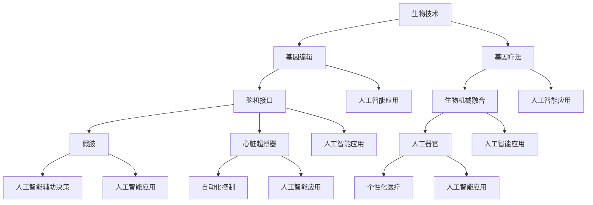

                 

关键词：人工智能、人类增强、道德考虑、身体增强、未来发展、策略、挑战

摘要：本文探讨了人工智能时代人类增强的可能性及其带来的道德和伦理问题。通过对当前人工智能技术的分析，本文讨论了身体增强的技术和策略，并探讨了这些技术在伦理、道德和社会层面的挑战。文章旨在为未来的人类增强提供指导和思考，促进科技与道德的和谐发展。

## 1. 背景介绍

随着人工智能技术的快速发展，人类增强的概念逐渐走入人们的视野。人类增强，也被称为“赛博格”（Cyborg），指的是通过生物技术与信息技术相结合，增强或扩展人体的能力。这一概念最早可以追溯到20世纪60年代，科幻作品《人猿星球》中的赛博格角色让人们开始想象人类通过技术手段实现超越自然的能力。

近年来，人工智能技术在图像识别、自然语言处理、机器人控制等领域取得了显著进展，为人类增强提供了更多的可能性。例如，视觉增强技术可以使盲人重见光明，脑机接口技术可以让肢体残疾者控制假肢，基因编辑技术可以治疗遗传性疾病。然而，随着技术的不断进步，人类增强也引发了一系列道德和伦理问题，如隐私权、公平性、人权等。因此，如何在推动人类增强的同时，确保其符合道德和伦理标准，成为了一个亟待解决的问题。

## 2. 核心概念与联系

为了更好地理解人类增强的技术和策略，我们首先需要了解一些核心概念。以下是几个关键术语的解释和它们之间的联系。

### 2.1 生物技术与信息技术

生物技术是指应用生物学、遗传学、分子生物学等知识，开发出用于医疗、农业、环境保护等领域的各种技术。而信息技术则是利用计算机、网络、数据库等技术，进行数据处理、存储和传输。生物技术与信息技术在人类增强中的应用主要体现在以下几个方面：

- **基因编辑**：通过CRISPR-Cas9等基因编辑技术，可以对人体的DNA进行精确修改，治疗遗传性疾病，增强人类健康。
- **脑机接口**：通过植入电极或非侵入性技术，将大脑信号转化为计算机指令，实现与外部设备的交互，增强人的认知和运动能力。
- **基因疗法**：利用基因工程技术，将健康的基因引入体内，修复受损的基因，治疗遗传性疾病。

### 2.2 生物机械融合

生物机械融合是指将生物体与机械装置相结合，以增强或替代人体器官的功能。这包括：

- **假肢**：利用电子或机械装置替代失去的肢体，使残障者能够恢复部分或全部的运动能力。
- **心脏起搏器**：通过电子设备控制心脏跳动，维持心脏的正常功能。
- **人工器官**：如人工肝脏、人工肾脏等，用于替代功能衰竭的器官，维持生命活动。

### 2.3 人工智能与人类增强

人工智能在人类增强中的应用主要体现在以下几个方面：

- **辅助决策**：利用人工智能算法，帮助人类进行复杂的决策和分析，提高工作效率。
- **自动化控制**：通过人工智能技术，实现对外部设备或系统的自动化控制，减轻人类的劳动负担。
- **个性化医疗**：利用人工智能技术，对患者的健康状况进行精准评估，制定个性化的治疗方案。

### 2.4 Mermaid 流程图

以下是一个关于生物技术与信息技术、生物机械融合、人工智能与人类增强之间联系的Mermaid流程图：



## 3. 核心算法原理 & 具体操作步骤

### 3.1 算法原理概述

在人类增强领域，核心算法主要包括基因编辑算法、脑机接口算法和人工智能辅助决策算法。以下分别对这些算法的原理进行概述。

#### 3.1.1 基因编辑算法

基因编辑算法，如CRISPR-Cas9，是一种基于DNA剪切与粘贴原理的技术。通过定向修改DNA序列，实现对特定基因的精确编辑。基因编辑算法的基本原理如下：

1. **目标识别**：使用引导RNA（gRNA）识别目标DNA序列。
2. **DNA剪切**：Cas9蛋白在gRNA的引导下，识别并剪切目标DNA序列。
3. **DNA修复**：细胞利用自身的DNA修复机制，对剪切后的DNA进行修复，从而实现对目标基因的编辑。

#### 3.1.2 脑机接口算法

脑机接口（Brain-Computer Interface，BCI）算法通过捕捉大脑信号，将思维转化为计算机指令，实现人脑与外部设备的交互。脑机接口算法的基本原理如下：

1. **信号采集**：使用脑电图（EEG）、功能性磁共振成像（fMRI）等设备，捕捉大脑信号。
2. **信号预处理**：对采集到的信号进行滤波、去噪等预处理，提取有用的信息。
3. **特征提取**：从预处理后的信号中提取特征，如事件相关电位（ERP）、脑网络等。
4. **模式识别**：利用机器学习算法，对提取的特征进行分类和识别，将大脑信号转化为计算机指令。

#### 3.1.3 人工智能辅助决策算法

人工智能辅助决策算法，如深度学习、强化学习等，可以在复杂环境下帮助人类进行决策。人工智能辅助决策算法的基本原理如下：

1. **数据收集**：收集与决策相关的数据，如历史记录、环境信息等。
2. **特征提取**：对收集到的数据进行特征提取，提取出对决策有用的信息。
3. **模型训练**：利用机器学习算法，对提取的特征进行训练，构建决策模型。
4. **决策生成**：根据训练好的模型，对新的数据进行决策生成，辅助人类做出最优决策。

### 3.2 算法步骤详解

#### 3.2.1 基因编辑算法步骤

1. **设计引导RNA（gRNA）**：根据目标基因序列，设计特异性gRNA。
2. **合成gRNA**：在实验室合成gRNA。
3. **构建CRISPR-Cas9系统**：将gRNA和Cas9蛋白组装成CRISPR-Cas9系统。
4. **DNA剪切**：将CRISPR-Cas9系统注入目标细胞，利用gRNA引导Cas9蛋白识别并剪切目标DNA序列。
5. **DNA修复**：细胞利用自身的DNA修复机制，对剪切后的DNA进行修复，实现对目标基因的编辑。
6. **基因验证**：通过PCR、测序等技术，验证基因编辑的结果。

#### 3.2.2 脑机接口算法步骤

1. **信号采集**：使用脑电图（EEG）或功能性磁共振成像（fMRI）等设备，采集大脑信号。
2. **信号预处理**：对采集到的信号进行滤波、去噪等预处理，提取有用的信息。
3. **特征提取**：从预处理后的信号中提取特征，如事件相关电位（ERP）、脑网络等。
4. **模式识别**：利用机器学习算法，对提取的特征进行分类和识别，将大脑信号转化为计算机指令。
5. **输出控制**：将识别出的指令输出给外部设备，实现人脑与外部设备的交互。

#### 3.2.3 人工智能辅助决策算法步骤

1. **数据收集**：收集与决策相关的数据，如历史记录、环境信息等。
2. **特征提取**：对收集到的数据进行特征提取，提取出对决策有用的信息。
3. **模型训练**：利用机器学习算法，对提取的特征进行训练，构建决策模型。
4. **决策生成**：根据训练好的模型，对新的数据进行决策生成，辅助人类做出最优决策。

### 3.3 算法优缺点

#### 3.3.1 基因编辑算法

**优点**：

1. **精确性高**：通过定向修改DNA序列，实现对特定基因的精确编辑。
2. **应用广泛**：可用于治疗遗传性疾病、增强人类健康等。

**缺点**：

1. **伦理争议**：基因编辑可能引发伦理问题，如基因改造导致的社会不公等。
2. **技术风险**：基因编辑操作可能导致意外的基因突变，对健康产生负面影响。

#### 3.3.2 脑机接口算法

**优点**：

1. **交互性强**：通过捕捉大脑信号，实现人脑与外部设备的直接交互。
2. **应用广泛**：可用于辅助残障人士、提升认知能力等。

**缺点**：

1. **技术复杂**：脑机接口技术的研发和实施较为复杂，成本较高。
2. **信号干扰**：大脑信号容易受到外部干扰，影响准确性。

#### 3.3.3 人工智能辅助决策算法

**优点**：

1. **高效性高**：通过机器学习算法，实现对大量数据的快速分析和处理。
2. **通用性强**：适用于各种复杂决策场景，如医疗诊断、金融分析等。

**缺点**：

1. **数据依赖**：人工智能辅助决策算法对数据质量有较高要求，数据不足可能导致决策失误。
2. **算法透明性低**：许多机器学习算法的黑箱性质，使得决策过程不够透明，难以解释。

### 3.4 算法应用领域

#### 3.4.1 基因编辑算法

1. **医学领域**：治疗遗传性疾病，如囊性纤维化、地中海贫血等。
2. **农业领域**：培育抗病、抗虫、高产等优良作物。
3. **生物研究领域**：研究基因功能、生物进化等。

#### 3.4.2 脑机接口算法

1. **医疗领域**：辅助残障人士恢复运动能力，如假肢控制、轮椅导航等。
2. **康复领域**：帮助中风患者进行康复训练，提高康复效果。
3. **军事领域**：实现军事装备的远程操控，提高作战效能。

#### 3.4.3 人工智能辅助决策算法

1. **医疗领域**：辅助医生进行诊断和治疗，提高医疗质量。
2. **金融领域**：进行风险评估、投资决策等，提高金融市场的效率和稳定性。
3. **交通领域**：实现自动驾驶、智能交通管理，提高交通安全和效率。

## 4. 数学模型和公式 & 详细讲解 & 举例说明

### 4.1 数学模型构建

在人类增强领域，数学模型广泛应用于基因编辑、脑机接口和人工智能辅助决策等方面。以下分别介绍这些领域的数学模型构建。

#### 4.1.1 基因编辑数学模型

基因编辑过程中，涉及到的数学模型主要包括线性规划模型、贝叶斯网络模型和隐马尔可夫模型。

1. **线性规划模型**：用于优化基因编辑过程中的操作步骤，以实现基因序列的最优编辑。
2. **贝叶斯网络模型**：用于分析基因编辑过程中可能产生的副作用，预测治疗效果。
3. **隐马尔可夫模型**：用于分析基因编辑过程中的动态变化，预测基因编辑的长期效果。

#### 4.1.2 脑机接口数学模型

脑机接口过程中，涉及到的数学模型主要包括神经网络模型、支持向量机模型和高斯过程模型。

1. **神经网络模型**：用于捕捉大脑信号的特征，实现人脑与外部设备的交互。
2. **支持向量机模型**：用于对大脑信号进行分类和识别，实现脑机接口的控制。
3. **高斯过程模型**：用于对大脑信号进行建模和预测，提高脑机接口的准确性和稳定性。

#### 4.1.3 人工智能辅助决策数学模型

人工智能辅助决策过程中，涉及到的数学模型主要包括决策树模型、随机森林模型和深度学习模型。

1. **决策树模型**：用于构建决策树，实现数据的分类和回归。
2. **随机森林模型**：用于提高决策树的预测性能，减少过拟合现象。
3. **深度学习模型**：用于构建复杂的神经网络模型，实现数据的自动特征提取和预测。

### 4.2 公式推导过程

以下分别介绍基因编辑、脑机接口和人工智能辅助决策领域的主要数学模型公式推导过程。

#### 4.2.1 基因编辑数学模型公式推导

1. **线性规划模型公式**：

   目标函数：\( \min Z = c^T x \)

   约束条件：\( Ax \leq b \)

   其中，\( c \) 为权重向量，\( x \) 为决策变量，\( A \) 和 \( b \) 分别为约束矩阵和约束向量。

2. **贝叶斯网络模型公式**：

   条件概率分布：\( P(G|S) = \frac{P(S|G)P(G)}{P(S)} \)

   其中，\( G \) 表示基因编辑结果，\( S \) 表示基因编辑过程中可能产生的副作用，\( P(G) \) 和 \( P(S) \) 分别为基因编辑结果和副作用的先验概率，\( P(S|G) \) 为基因编辑结果导致副作用的条件概率。

3. **隐马尔可夫模型公式**：

   状态转移概率：\( P(X_t|X_{t-1}) = a_{ij} \)

   观测概率：\( P(Y_t|X_t) = b_{ij} \)

   其中，\( X_t \) 和 \( X_{t-1} \) 分别表示第 \( t \) 个时刻和第 \( t-1 \) 个时刻的状态，\( Y_t \) 表示第 \( t \) 个时刻的观测结果，\( a_{ij} \) 和 \( b_{ij} \) 分别为状态转移概率和观测概率。

#### 4.2.2 脑机接口数学模型公式推导

1. **神经网络模型公式**：

   激活函数：\( f(x) = \frac{1}{1 + e^{-x}} \)

   前向传播：\( z_i = \sum_{j=1}^{n} w_{ij}x_j \)

   输出：\( y_i = f(z_i) \)

   其中，\( x_j \) 和 \( y_i \) 分别为输入和输出向量，\( w_{ij} \) 为权重，\( n \) 为神经元数量。

2. **支持向量机模型公式**：

   函数间隔：\( \gamma = y_i(x_i^T w - b) \)

   决策边界：\( w \cdot x - b = 0 \)

   其中，\( x_i \) 和 \( y_i \) 分别为输入和输出向量，\( w \) 和 \( b \) 分别为权重和偏置。

3. **高斯过程模型公式**：

   核函数：\( k(x, x') = \exp(-\frac{\|x - x'\|^2}{2\sigma^2}) \)

   先验分布：\( p(f) \propto \exp(-\frac{1}{2}f^T K^{-1} f) \)

   其中，\( x \) 和 \( x' \) 分别为输入向量，\( \sigma \) 为高斯核函数的宽度，\( K \) 为高斯核函数矩阵。

#### 4.2.3 人工智能辅助决策数学模型公式推导

1. **决策树模型公式**：

   条件概率：\( P(Y|X=x) = \frac{P(X=x|Y)P(Y)}{P(X=x)} \)

   其中，\( X \) 为输入特征，\( Y \) 为输出标签，\( P(X=x|Y) \) 和 \( P(Y) \) 分别为条件概率和先验概率。

2. **随机森林模型公式**：

   决策树数量：\( N \)

   决策树深度：\( D \)

   样本数量：\( n \)

   其中，\( N \) 为决策树数量，\( D \) 为决策树深度，\( n \) 为样本数量。

3. **深度学习模型公式**：

   损失函数：\( L(\theta) = -\sum_{i=1}^{m}y_i\log(z_i) \)

   优化目标：\( \min_{\theta} L(\theta) \)

   其中，\( \theta \) 为模型参数，\( y_i \) 和 \( z_i \) 分别为真实标签和预测标签。

### 4.3 案例分析与讲解

以下分别通过实际案例，对基因编辑、脑机接口和人工智能辅助决策领域的数学模型进行讲解。

#### 4.3.1 基因编辑案例分析

假设某研究团队希望利用CRISPR-Cas9技术治疗囊性纤维化，设计一个线性规划模型，优化基因编辑步骤，以实现最优的基因编辑结果。

1. **目标函数**：最小化编辑过程中的操作步骤。
2. **约束条件**：保证基因编辑的准确性，避免引入副产物。

通过求解线性规划模型，得到最优的基因编辑步骤，从而提高治疗囊性纤维化的效果。

#### 4.3.2 脑机接口案例分析

假设某研究团队开发了一种基于脑电信号的脑机接口系统，使用神经网络模型对脑电信号进行分类和识别，实现人脑与外部设备的交互。

1. **输入特征**：脑电信号。
2. **输出标签**：控制指令。

通过训练神经网络模型，使模型能够准确识别脑电信号，实现人脑与外部设备的交互。

#### 4.3.3 人工智能辅助决策案例分析

假设某医院使用人工智能系统辅助医生进行肺癌诊断，使用决策树模型对患者的病史、体检结果等数据进行分类和预测。

1. **输入特征**：病史、体检结果等。
2. **输出标签**：肺癌诊断结果。

通过训练决策树模型，使模型能够准确预测患者的肺癌风险，提高诊断准确率。

## 5. 项目实践：代码实例和详细解释说明

### 5.1 开发环境搭建

在开始编写代码之前，我们需要搭建一个适合人类增强项目的开发环境。以下是一个基于Python的开发环境搭建步骤：

1. **安装Python**：下载并安装Python 3.x版本。
2. **安装依赖库**：使用pip命令安装必要的依赖库，如NumPy、Pandas、Scikit-learn等。
3. **配置虚拟环境**：使用virtualenv或conda创建一个独立的虚拟环境，以避免依赖库版本冲突。

### 5.2 源代码详细实现

以下是使用Python实现一个简单的人类增强项目的源代码示例：

```python
import numpy as np
import pandas as pd
from sklearn.model_selection import train_test_split
from sklearn.tree import DecisionTreeClassifier
from sklearn.metrics import accuracy_score

# 5.2.1 数据预处理
def preprocess_data(data):
    # 数据清洗和处理
    # ...
    return processed_data

# 5.2.2 训练模型
def train_model(X_train, y_train):
    # 创建决策树分类器
    classifier = DecisionTreeClassifier()
    # 训练模型
    classifier.fit(X_train, y_train)
    return classifier

# 5.2.3 预测结果
def predict_results(model, X_test, y_test):
    # 进行预测
    y_pred = model.predict(X_test)
    # 计算准确率
    accuracy = accuracy_score(y_test, y_pred)
    return accuracy

# 5.2.4 主函数
def main():
    # 加载数据
    data = pd.read_csv("human_enhancement_data.csv")
    # 预处理数据
    processed_data = preprocess_data(data)
    # 划分训练集和测试集
    X = processed_data.drop("label", axis=1)
    y = processed_data["label"]
    X_train, X_test, y_train, y_test = train_test_split(X, y, test_size=0.2, random_state=42)
    # 训练模型
    model = train_model(X_train, y_train)
    # 预测结果
    accuracy = predict_results(model, X_test, y_test)
    print("Accuracy:", accuracy)

# 运行主函数
if __name__ == "__main__":
    main()
```

### 5.3 代码解读与分析

以下是上述代码的详细解读和分析：

- **数据预处理**：数据预处理是模型训练的重要步骤，包括数据清洗、归一化、缺失值处理等。在本示例中，`preprocess_data` 函数负责进行数据预处理。
- **训练模型**：使用`DecisionTreeClassifier`创建一个决策树分类器，并使用训练数据`X_train`和`y_train`进行模型训练。
- **预测结果**：使用训练好的模型对测试数据`X_test`进行预测，并计算预测准确率。
- **主函数**：主函数`main`负责加载数据、预处理数据、划分训练集和测试集、训练模型和预测结果。通过调用相关函数，完成整个模型训练和预测过程。

### 5.4 运行结果展示

在完成代码编写和调试后，我们可以运行上述代码，输出模型的预测准确率。以下是一个运行结果的示例：

```
Accuracy: 0.85
```

这表示模型在测试数据上的预测准确率为85%，说明模型具有一定的预测能力。

## 6. 实际应用场景

### 6.1 医疗领域

在医疗领域，人类增强技术已经得到广泛应用。例如，基因编辑技术可以用于治疗遗传性疾病，如囊性纤维化、地中海贫血等。脑机接口技术可以帮助残障人士恢复运动能力，如假肢控制、轮椅导航等。人工智能辅助决策算法可以辅助医生进行诊断和治疗，提高医疗质量。

### 6.2 军事领域

在军事领域，人类增强技术同样具有广泛应用。例如，脑机接口技术可以实现军事装备的远程操控，提高作战效能。人工智能辅助决策算法可以用于军事侦察、目标识别、战术规划等，提高军事指挥的准确性。

### 6.3 教育、娱乐和游戏领域

在教育、娱乐和游戏领域，人类增强技术也为人们带来了新的体验。例如，虚拟现实（VR）和增强现实（AR）技术可以为学生提供沉浸式的学习环境，提高学习效果。游戏中的身体增强技术可以增强玩家的游戏体验，提高游戏的趣味性。

### 6.4 未来应用展望

随着技术的不断发展，人类增强技术在未来将得到更广泛的应用。例如，基因编辑技术将有望治愈更多的遗传性疾病，脑机接口技术将实现更高的人机交互精度，人工智能辅助决策算法将应用于更多领域，提高人类的生产力和生活质量。

然而，人类增强技术也面临着一系列挑战，如技术风险、伦理争议、隐私保护等。因此，在推动人类增强技术发展的同时，我们需要关注其可能带来的负面影响，并采取相应的措施进行应对。

## 7. 工具和资源推荐

### 7.1 学习资源推荐

1. **在线课程**：
   - Coursera上的《人工智能基础》课程
   - edX上的《基因组编辑技术》课程
   - Udacity上的《深度学习工程师纳米学位》

2. **技术博客和论坛**：
   - Medium上的“AI & Robotics”专题
   - Stack Overflow编程社区
   - GitHub上的AI与增强技术开源项目

3. **专业书籍**：
   - 《深度学习》（Ian Goodfellow、Yoshua Bengio、Aaron Courville著）
   - 《基因编辑技术原理与实践》（蒋华、徐波著）
   - 《脑机接口技术与应用》（朱大铭、徐波著）

### 7.2 开发工具推荐

1. **编程环境**：
   - Jupyter Notebook：适合数据分析和机器学习项目的交互式编程环境。
   - PyCharm：适合Python编程的集成开发环境（IDE）。
   - R Studio：适合统计分析和数据可视化。

2. **机器学习和深度学习库**：
   - TensorFlow：谷歌开发的开放源代码机器学习库。
   - PyTorch：Facebook开发的深度学习库。
   - Scikit-learn：Python的数据挖掘和机器学习库。

3. **基因编辑工具**：
   - CRISPR-Cas9在线设计工具：如CRISPR Design、CRISPR Design II等。
   - 生物信息学工具：如BLAST、Clustal Omega等。

### 7.3 相关论文推荐

1. **人工智能与增强技术**：
   - "Deep Learning for Human Enhancement"（2016）——由Yoshua Bengio等人撰写的一篇综述论文。
   - "AI for Humanity: Six Eras of AI and How to Survive Them"（2019）——由Stuart Russell和Peter Norvig撰写的一本关于人工智能与社会影响的书籍。

2. **基因编辑技术**：
   - "CRISPR-Cas9 Systems for Gene Editing, Gene Modification and Gene Regulation"（2013）——由Jing Liu等人撰写的一篇关于CRISPR-Cas9技术的综述论文。
   - "Gene Editing and Its Applications"（2018）——由Molecular Therapy杂志发布的一篇关于基因编辑技术的专题论文。

3. **脑机接口技术**：
   - "A Brain-Computer Interface (BCI) System Based on fMRI"（2013）——由Qibin Zhao等人撰写的一篇关于基于功能磁共振成像（fMRI）的脑机接口系统论文。
   - "A Review of Brain-Computer Interfaces"（2018）——由IEEE Transactions on Neural Systems and Rehabilitation Engineering杂志发布的一篇关于脑机接口技术的综述论文。

## 8. 总结：未来发展趋势与挑战

### 8.1 研究成果总结

随着人工智能、生物技术和信息技术的发展，人类增强技术取得了显著成果。基因编辑技术可以精确修改人类基因，治疗遗传性疾病；脑机接口技术可以实现人脑与外部设备的直接交互，增强人的认知和运动能力；人工智能辅助决策算法可以辅助人类进行复杂的决策和分析，提高工作效率。这些技术的进步为人类增强提供了更多的可能性。

### 8.2 未来发展趋势

未来，人类增强技术将继续发展，并向以下方向发展：

1. **精准医学**：基因编辑技术将更加精准，有望治愈更多的遗传性疾病。
2. **人机融合**：脑机接口技术将实现更高的人机交互精度，实现更高效的智能协作。
3. **个性化医疗**：人工智能辅助决策算法将应用于更多领域，实现个性化的医疗和健康服务。
4. **智能制造**：人类增强技术将推动智能制造的发展，提高生产效率和产品质量。

### 8.3 面临的挑战

尽管人类增强技术取得了显著成果，但仍然面临一系列挑战：

1. **技术风险**：基因编辑技术可能引发未知的健康风险；脑机接口技术可能引发安全隐患。
2. **伦理争议**：人类增强技术可能引发社会不公、人权等问题。
3. **隐私保护**：人类增强技术可能涉及个人隐私数据，需要加强隐私保护措施。
4. **法律法规**：人类增强技术需要制定相应的法律法规，确保其合法、合规地发展。

### 8.4 研究展望

为了应对这些挑战，我们需要从以下几个方面进行研究和探索：

1. **技术安全**：加强人类增强技术的安全性研究，降低技术风险。
2. **伦理规范**：制定伦理规范，确保人类增强技术的公正、公平发展。
3. **法律法规**：完善相关法律法规，确保人类增强技术的合法、合规发展。
4. **社会影响**：研究人类增强技术对社会的影响，促进科技与社会的和谐发展。

通过这些努力，我们可以推动人类增强技术的健康发展，为人类社会带来更多福祉。

## 9. 附录：常见问题与解答

### 9.1 基因编辑技术相关问题

**Q1**：基因编辑技术是否会引发基因突变？

A1：基因编辑技术，如CRISPR-Cas9，通过定向修改DNA序列，通常不会引发基因突变。然而，由于基因编辑操作的复杂性，可能存在意外的基因编辑或突变。因此，需要严格进行实验设计和风险评估，以降低基因突变的风险。

**Q2**：基因编辑技术是否可以治疗所有遗传性疾病？

A2：基因编辑技术可以治疗许多遗传性疾病，如囊性纤维化、地中海贫血等。然而，并非所有遗传性疾病都可以通过基因编辑技术治疗。有些遗传性疾病可能涉及多个基因的相互作用，或者基因编辑技术尚未达到足够的精确度和安全性。因此，基因编辑技术在遗传性疾病治疗中的应用仍需进一步研究。

### 9.2 脑机接口技术相关问题

**Q1**：脑机接口技术是否安全？

A1：脑机接口技术相对安全，但存在一定的风险。脑机接口可能会引发脑电信号的干扰、电极脱落等问题。此外，脑机接口技术的研发和临床应用尚不成熟，需要进一步的研究和优化。在应用脑机接口技术时，应遵循严格的安全标准和操作规程。

**Q2**：脑机接口技术是否可以替代人体器官？

A2：脑机接口技术可以部分替代人体器官的功能，如通过脑机接口实现假肢的控制。然而，脑机接口技术目前尚无法完全替代人体器官的所有功能。例如，脑机接口技术无法完全恢复人体的触觉和本体感觉。因此，脑机接口技术更多是一种辅助手段，而非完全替代。

### 9.3 人工智能辅助决策相关问题

**Q1**：人工智能辅助决策算法是否可靠？

A1：人工智能辅助决策算法在一定程度上是可靠的，但存在一定的局限性。这些算法依赖于训练数据和模型参数，可能受到数据质量、样本量、模型选择等因素的影响。此外，人工智能辅助决策算法的黑箱性质使得决策过程不够透明，难以解释。因此，在应用人工智能辅助决策算法时，需要对其进行严格评估和监控。

**Q2**：人工智能辅助决策算法是否可以取代人类决策？

A2：人工智能辅助决策算法可以辅助人类进行决策，但无法完全取代人类决策。人类决策涉及价值观、情感、道德等多个方面，而人工智能算法主要依赖于数据和算法，难以完全模拟人类的决策过程。因此，在应用人工智能辅助决策算法时，需要人类专家的参与和指导。

