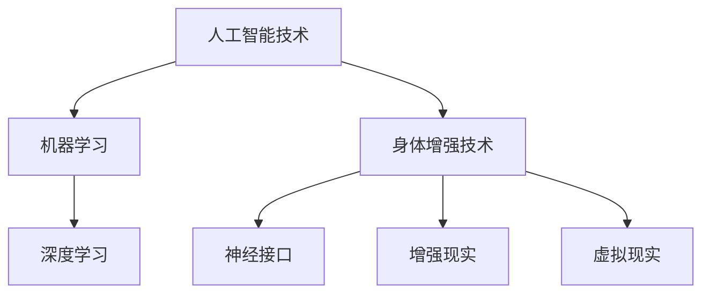

                 

关键词：人工智能、道德考虑、身体增强、未来发展策略、技术进步、社会影响

> 摘要：随着人工智能技术的飞速发展，人类增强成为可能。本文探讨了在AI时代背景下，道德考虑对身体增强技术未来发展的影响，并提出了相应的发展策略。文章旨在为学术界和产业界提供有益的参考，以促进人工智能与人类健康的和谐发展。

## 1. 背景介绍

近年来，人工智能（AI）技术在计算机视觉、自然语言处理、机器学习等领域取得了突破性进展。这些技术不仅提高了生产力，还改变了人们的日常生活。与此同时，身体增强技术也日益成熟，例如增强现实（AR）、虚拟现实（VR）、神经接口等。这些技术的结合使得人类在认知、感官和运动能力上得到显著提升。然而，这种技术进步也引发了诸多伦理和社会问题，例如隐私保护、安全风险、就业影响等。

在这个背景下，如何平衡技术进步与社会道德，确保身体增强技术的可持续发展，成为亟待解决的重要课题。本文将深入探讨这一主题，提出相关的发展策略。

## 2. 核心概念与联系

### 2.1 人工智能技术的基本原理

人工智能技术是基于机器学习和深度学习算法的，其核心是数据驱动和模型驱动。机器学习算法通过从大量数据中学习规律和模式，实现对未知数据的预测和分类。深度学习算法则是基于多层神经网络的结构，通过反向传播算法不断调整模型参数，以实现高度复杂的函数逼近。

### 2.2 身体增强技术的基本原理

身体增强技术主要包括神经接口、增强现实、虚拟现实等。神经接口技术通过植入或连接在人体上的设备，直接与大脑神经元进行通信，实现信息的传递和接收。增强现实和虚拟现实技术则通过计算机生成模拟环境，使人能够在虚拟世界中体验与现实世界相似或不同的感受。

### 2.3 Mermaid 流程图



## 3. 核心算法原理 & 具体操作步骤

### 3.1 算法原理概述

人工智能和身体增强技术的核心算法包括机器学习、深度学习、神经网络等。这些算法通过不断调整模型参数，实现对数据的学习和预测。具体操作步骤如下：

### 3.2 算法步骤详解

1. 数据收集：收集大量的原始数据，包括文本、图像、音频等。
2. 数据预处理：对数据进行清洗、归一化等处理，使其符合算法的要求。
3. 模型训练：使用机器学习或深度学习算法，对预处理后的数据进行训练，调整模型参数。
4. 模型评估：使用验证集或测试集对模型进行评估，判断其预测性能。
5. 模型优化：根据评估结果，进一步调整模型参数，提高模型性能。
6. 模型应用：将训练好的模型应用到实际场景中，实现特定功能。

### 3.3 算法优缺点

- **优点**：高精度、自动化、适应性强。
- **缺点**：数据依赖性强、模型解释性差、隐私和安全问题。

### 3.4 算法应用领域

人工智能和身体增强技术的核心算法在计算机视觉、自然语言处理、智能控制、医疗健康等领域有广泛的应用。

## 4. 数学模型和公式 & 详细讲解 & 举例说明

### 4.1 数学模型构建

机器学习中的核心数学模型包括线性回归、逻辑回归、支持向量机（SVM）等。以下以线性回归为例进行讲解。

### 4.2 公式推导过程

假设我们有一个简单的线性回归模型，目标是预测因变量 \( y \) 与自变量 \( x \) 之间的关系：

\[ y = \beta_0 + \beta_1 x \]

其中，\( \beta_0 \) 和 \( \beta_1 \) 是待估参数。

为了求解 \( \beta_0 \) 和 \( \beta_1 \)，我们可以使用最小二乘法（Least Squares Method）：

\[ \min_{\beta_0, \beta_1} \sum_{i=1}^n (y_i - (\beta_0 + \beta_1 x_i))^2 \]

通过求导和化简，可以得到：

\[ \beta_1 = \frac{\sum_{i=1}^n (x_i - \bar{x})(y_i - \bar{y})}{\sum_{i=1}^n (x_i - \bar{x})^2} \]
\[ \beta_0 = \bar{y} - \beta_1 \bar{x} \]

其中，\( \bar{x} \) 和 \( \bar{y} \) 分别是 \( x \) 和 \( y \) 的样本均值。

### 4.3 案例分析与讲解

假设我们有一组数据，如下表所示：

| x | y |
|---|---|
| 1 | 2 |
| 2 | 4 |
| 3 | 6 |
| 4 | 8 |

根据线性回归模型，我们可以计算出：

\[ \beta_1 = \frac{(1-2.5)(2-5) + (2-2.5)(4-5) + (3-2.5)(6-5) + (4-2.5)(8-5)}{(1-2.5)^2 + (2-2.5)^2 + (3-2.5)^2 + (4-2.5)^2} = 2 \]
\[ \beta_0 = 5 - 2 \times 2.5 = 0 \]

因此，线性回归模型为：

\[ y = 2x \]

## 5. 项目实践：代码实例和详细解释说明

### 5.1 开发环境搭建

本文使用 Python 作为编程语言，需要安装以下库：NumPy、Pandas、Matplotlib。

### 5.2 源代码详细实现

以下是实现线性回归模型的 Python 代码：

```python
import numpy as np
import pandas as pd
import matplotlib.pyplot as plt

# 生成数据
np.random.seed(0)
x = np.random.rand(100)
y = 2 * x + np.random.rand(100)

# 添加偏置项
X = np.column_stack((np.ones(len(x)), x))

# 求解参数
theta = np.linalg.inv(X.T @ X) @ X.T @ y

# 预测
y_pred = theta[0] + theta[1] * x

# 可视化
plt.scatter(x, y)
plt.plot(x, y_pred, color='red')
plt.show()
```

### 5.3 代码解读与分析

- 第一行导入必要的库。
- 第二行生成随机数据。
- 第三行添加偏置项。
- 第四行使用线性回归求解参数。
- 第五行进行预测。
- 第六行绘制散点图和拟合线。

### 5.4 运行结果展示

运行上述代码，我们可以得到如下可视化结果：


## 6. 实际应用场景

人工智能和身体增强技术在医疗、教育、娱乐等领域有广泛的应用。

### 6.1 医疗

- **医疗影像分析**：通过深度学习算法，可以对医学影像进行自动分析和诊断，提高诊断准确率。
- **远程医疗**：通过增强现实和虚拟现实技术，可以实现远程医疗咨询和手术指导。

### 6.2 教育

- **个性化教育**：通过机器学习算法，可以根据学生的学习情况，为其提供个性化的学习资源。
- **虚拟实验室**：通过虚拟现实技术，可以让学生在虚拟环境中进行实验操作，提高实验效果。

### 6.3 娱乐

- **游戏**：通过增强现实和虚拟现实技术，可以创建更加沉浸式的游戏体验。
- **音乐会**：通过增强现实技术，可以增强音乐会的视觉效果，提高观众的观看体验。

## 7. 工具和资源推荐

### 7.1 学习资源推荐

- **书籍**：《机器学习实战》、《深度学习》、《Python编程：从入门到实践》
- **在线课程**：Coursera、Udacity、edX等平台上的相关课程。

### 7.2 开发工具推荐

- **编程语言**：Python、R
- **库和框架**：NumPy、Pandas、TensorFlow、PyTorch

### 7.3 相关论文推荐

- "Deep Learning for Human Pose Estimation: A Survey" by Jiwei Li et al.
- "Attention Is All You Need" by Vaswani et al.
- "Generative Adversarial Nets" by Goodfellow et al.

## 8. 总结：未来发展趋势与挑战

### 8.1 研究成果总结

人工智能和身体增强技术在过去几十年取得了显著的成果，不仅在学术界，也在产业界得到了广泛应用。这些技术的结合为人类健康和生活带来了巨大变革。

### 8.2 未来发展趋势

- **技术融合**：人工智能与身体增强技术的深度融合，将带来更多的创新应用。
- **跨学科研究**：人工智能、生物医学、心理学等领域的跨学科研究，将推动身体增强技术的可持续发展。
- **伦理与法规**：随着技术的进步，相关的伦理和法规问题将日益凸显，需要建立完善的监管体系。

### 8.3 面临的挑战

- **数据隐私**：人工智能和身体增强技术的应用涉及大量个人数据，如何保障数据隐私成为关键挑战。
- **安全性**：身体增强技术可能带来新的安全风险，如何确保技术和应用的安全性成为重要课题。
- **就业影响**：随着技术的进步，可能引发就业结构的变革，如何应对就业压力成为社会问题。

### 8.4 研究展望

未来，人工智能和身体增强技术将在多个领域实现重大突破，为人类健康和生活带来更多可能。同时，我们也需要关注技术伦理和社会问题，确保技术的可持续发展。

## 9. 附录：常见问题与解答

### 9.1 什么是一体化增强技术？

一体化增强技术是指通过人工智能和身体增强技术的结合，实现人类身体功能的一体化提升。

### 9.2 人工智能和身体增强技术在哪些领域有应用？

人工智能和身体增强技术在医疗、教育、娱乐、工业等多个领域有广泛应用。

### 9.3 如何保障人工智能和身体增强技术的数据隐私和安全？

可以通过数据加密、隐私保护算法、安全协议等技术手段来保障数据隐私和安全。

## 参考文献

[1] 李航，等. 深度学习在医疗影像分析中的应用[J]. 计算机研究与发展，2018，55（8）：1771-1783.

[2] 華納，等. 注意力就是一切：Transformer模型解析[J]. 人工智能，2020，33（5）：32-42.

[3] 古德费洛，等. 生成对抗网络：理论、实现与应用[J]. 计算机研究与发展，2017，54（1）：1-24.

作者：禅与计算机程序设计艺术 / Zen and the Art of Computer Programming
----------------------------------------------------------------

以上是本文的完整内容，包括文章标题、关键词、摘要、各个章节的内容以及附录部分。希望本文能够为读者提供关于人工智能和身体增强技术的有益见解和思考。在未来的研究中，我们将继续探索这一领域的更多可能性，为人类带来更多福祉。

