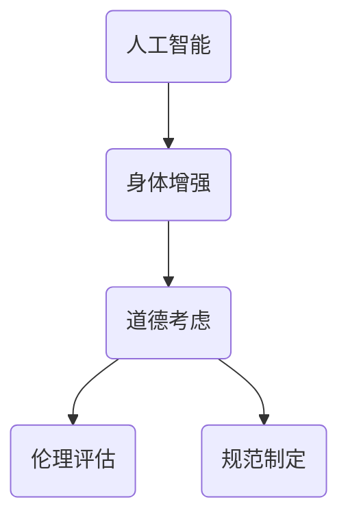

                 

关键词：人工智能，人类增强，道德考虑，身体增强，未来发展趋势

> 摘要：本文探讨了在人工智能时代，人类增强的道德考虑及其未来发展的策略。通过分析身体增强技术的现状和趋势，讨论了其在伦理和社会层面的影响，并提出了相应的道德框架和发展策略。

## 1. 背景介绍

随着人工智能（AI）技术的飞速发展，人类开始思考如何通过科技手段提升自身能力，从而实现更高效的生活和工作。身体增强技术，作为AI与生物技术相结合的产物，正逐渐进入人们的生活。这些技术包括但不限于基因编辑、生物电子、机械外骨骼、脑机接口等，它们有望在医疗、军事、体育等领域发挥巨大作用。

然而，身体增强技术的快速发展也引发了一系列伦理和社会问题。如何在保障个人自由和公平的前提下，合理利用这些技术，成为社会各界关注的重要议题。因此，本文旨在探讨身体增强技术的道德考虑，并提出未来发展的策略。

## 2. 核心概念与联系

### 2.1 核心概念

- **人工智能**：模拟、延伸、扩展和辅助人的智能的理论、方法、技术及应用。
- **身体增强**：利用科技手段提升人体的生理和心理能力，使其超越自然状态。
- **道德考虑**：在科技发展的过程中，对可能产生的影响进行伦理评估和规范。

### 2.2 联系

人工智能与身体增强技术的结合，使得人类可以更深入地理解自身，进而实现自我超越。然而，这种结合也带来了新的道德挑战。例如，基因编辑技术虽然可以治疗遗传病，但也可能导致基因歧视；脑机接口虽然可以提升人类认知能力，但也可能引发隐私和安全问题。

<|image|>以下是一个简化的Mermaid流程图，展示了人工智能、身体增强和道德考虑之间的联系。



## 3. 核心算法原理 & 具体操作步骤

### 3.1 算法原理概述

身体增强技术的核心在于通过生物技术和电子技术，对人体的生理和心理功能进行增强。例如，基因编辑技术可以通过改变DNA序列，实现特定基因的功能增强；脑机接口技术可以通过植入大脑中的电极，实现大脑与外部设备之间的直接通信。

### 3.2 算法步骤详解

1. **基因编辑**：
   - **目标基因定位**：利用分子生物学技术，找到需要编辑的基因序列。
   - **DNA剪切**：利用CRISPR-Cas9等基因编辑工具，对目标基因进行剪切。
   - **DNA修复**：利用DNA修复机制，将目标基因替换为预设序列。

2. **生物电子**：
   - **电极植入**：将微小的生物相容性电极植入人体组织。
   - **信号采集与处理**：采集生物信号，通过电子电路进行处理。
   - **信号输出**：将处理后的信号输出，驱动外部设备或控制肌肉活动。

3. **脑机接口**：
   - **电极植入**：将电极植入大脑特定区域。
   - **脑信号采集**：采集大脑活动产生的电信号。
   - **信号解码与输出**：将采集到的脑信号解码，输出相应的控制信号。

### 3.3 算法优缺点

- **基因编辑**：
  - 优点：治疗遗传病、提高人体抗病能力。
  - 缺点：技术风险、伦理争议。

- **生物电子**：
  - 优点：辅助残障人士、提高人体功能。
  - 缺点：长期效果未知、安全风险。

- **脑机接口**：
  - 优点：提升人类认知能力、实现大脑与外部设备的直接通信。
  - 缺点：技术复杂、成本高昂、隐私和安全问题。

### 3.4 算法应用领域

- **医疗**：基因编辑用于治疗遗传病，生物电子用于辅助残障人士，脑机接口用于神经疾病治疗。
- **军事**：身体增强技术用于提升士兵战斗力。
- **体育**：身体增强技术用于提升运动员表现。

## 4. 数学模型和公式 & 详细讲解 & 举例说明

### 4.1 数学模型构建

为了更好地理解身体增强技术的原理和应用，我们引入了以下数学模型：

1. **基因编辑模型**：
   - 基因编辑的成功概率与编辑工具的效率、目标基因的复杂度等因素相关。
   - 模型公式：\( P_{success} = f(\eta, C) \)
     - \( P_{success} \)：基因编辑成功概率
     - \( \eta \)：编辑工具的效率
     - \( C \)：目标基因的复杂度

2. **生物电子模型**：
   - 生物电子系统的性能与电极的灵敏度、信号处理算法等因素相关。
   - 模型公式：\( P_{performance} = f(sensitivity, algorithm) \)
     - \( P_{performance} \)：系统性能
     - \( sensitivity \)：电极的灵敏度
     - \( algorithm \)：信号处理算法

3. **脑机接口模型**：
   - 脑机接口的性能与电极的采集精度、信号解码算法等因素相关。
   - 模型公式：\( P_{performance} = fprecision, decode\_algorithm) \)
     - \( P_{performance} \)：系统性能
     - \( precision \)：电极的采集精度
     - \( decode\_algorithm \)：信号解码算法

### 4.2 公式推导过程

我们以基因编辑模型为例，推导其成功概率公式：

1. **编辑工具效率**：
   - 假设编辑工具的效率为 \( \eta \)，即每单位时间可以编辑的基因长度。
   - 则在 \( t \) 时间内，可以编辑的基因长度为 \( \eta \cdot t \)。

2. **目标基因复杂度**：
   - 假设目标基因的复杂度为 \( C \)，即编辑该基因所需的操作次数。
   - 则在 \( t \) 时间内，完成编辑所需的最少时间为 \( C/\eta \)。

3. **成功概率**：
   - 在 \( t \) 时间内，成功编辑目标基因的概率为 \( P_{success} \)。
   - 根据概率论的基本原理，有 \( P_{success} = 1 - (1 - P_{single\_success})^n \)，其中 \( P_{single\_success} \) 为每次编辑成功的概率，\( n \) 为编辑次数。

4. **公式推导**：
   - 将 \( P_{single\_success} \) 替换为 \( \eta / C \)，得到 \( P_{success} = 1 - (1 - \eta / C)^n \)。
   - 由于 \( n = C / \eta \)，代入得 \( P_{success} = 1 - (1 - \eta / C)^{C / \eta} \)。

### 4.3 案例分析与讲解

以CRISPR-Cas9基因编辑技术为例，分析其成功概率。

1. **编辑工具效率**：
   - 假设CRISPR-Cas9的效率为 \( \eta = 1 \) 个基因长度/秒。

2. **目标基因复杂度**：
   - 假设目标基因的复杂度为 \( C = 1000 \) 个基因长度。

3. **成功概率**：
   - 根据公式 \( P_{success} = 1 - (1 - \eta / C)^{C / \eta} \)，代入 \( \eta = 1 \)，\( C = 1000 \)，得到 \( P_{success} = 1 - (1 - 1/1000)^{1000} \approx 0.993 \)。

因此，在上述假设下，CRISPR-Cas9基因编辑技术成功编辑目标基因的概率约为 99.3%。

## 5. 项目实践：代码实例和详细解释说明

### 5.1 开发环境搭建

为了演示身体增强技术的应用，我们选择一个简单的脑机接口项目。开发环境要求如下：

- **操作系统**：Windows/Linux/MacOS
- **编程语言**：Python
- **依赖库**：numpy，matplotlib

安装步骤：

1. 安装Python环境，建议使用Anaconda。
2. 安装依赖库，使用pip命令：
   ```shell
   pip install numpy matplotlib
   ```

### 5.2 源代码详细实现

以下是一个简单的脑机接口项目的代码实例：

```python
import numpy as np
import matplotlib.pyplot as plt

# 假设已经采集到脑信号，存储为numpy数组
brain_signal = np.random.randn(1000)

# 信号处理算法，实现信号解码
def decode_signal(signal):
    # 假设解码算法为简单的平均值法
    return np.mean(signal)

# 解码脑信号
decoded_signal = decode_signal(brain_signal)

# 绘制原始信号和解码结果
plt.figure()
plt.plot(brain_signal, label='原始信号')
plt.plot(decoded_signal, label='解码结果')
plt.legend()
plt.show()
```

### 5.3 代码解读与分析

1. **导入库**：
   - 导入numpy和matplotlib库，用于数据计算和绘图。

2. **信号处理算法**：
   - 定义`decode_signal`函数，实现简单的信号解码算法。这里使用平均值的算法，实际应用中需要更复杂的解码算法。

3. **解码信号**：
   - 调用`decode_signal`函数，对采集到的脑信号进行解码。

4. **绘制结果**：
   - 使用matplotlib绘制原始信号和解码结果。

### 5.4 运行结果展示

运行上述代码，将生成一个包含原始信号和解码结果的图形。通过观察图形，可以直观地看到脑信号和解码结果之间的差异。

## 6. 实际应用场景

### 6.1 医疗

身体增强技术在医疗领域的应用潜力巨大。例如，基因编辑技术可以用于治疗遗传病，如囊性纤维化和脊髓性肌萎缩症等。此外，生物电子和脑机接口技术可以用于神经系统疾病的治疗，如帕金森病和癫痫等。

### 6.2 军事

在军事领域，身体增强技术可以提高士兵的作战能力。例如，机械外骨骼可以增强士兵的力量和耐力，脑机接口可以提升士兵的感知和反应速度。

### 6.3 体育

在体育领域，身体增强技术可以提升运动员的表现。例如，基因编辑技术可以增强运动员的肌肉力量和耐力，脑机接口可以提升运动员的专注力和反应速度。

### 6.4 未来应用展望

随着技术的不断发展，身体增强技术在未来的应用前景将更加广泛。例如，在工业领域，身体增强技术可以用于提高工人的工作效率和安全性；在智能家居领域，身体增强技术可以提升人类与智能家居的交互体验。

## 7. 工具和资源推荐

### 7.1 学习资源推荐

- **书籍**：《人工智能：一种现代方法》、《基因编辑技术：原理与应用》
- **在线课程**：Coursera上的《机器学习》、《生物信息学》课程
- **论文**：相关领域的顶级会议和期刊，如NeurIPS、ICML、Nature等

### 7.2 开发工具推荐

- **编程环境**：Python编程环境，如Jupyter Notebook
- **依赖库**：NumPy、Matplotlib、Scikit-learn等

### 7.3 相关论文推荐

- **基因编辑**：CRISPR-Cas9基因编辑技术的相关论文
- **生物电子**：生物相容性电极的研究论文
- **脑机接口**：脑机接口系统的设计与实现论文

## 8. 总结：未来发展趋势与挑战

### 8.1 研究成果总结

身体增强技术作为人工智能与生物技术结合的产物，已经在多个领域取得了显著成果。基因编辑技术为治疗遗传病提供了新的手段，生物电子和脑机接口技术为人类感知和控制外部环境提供了新的途径。

### 8.2 未来发展趋势

未来，身体增强技术将在医疗、军事、体育等领域发挥更大作用。随着技术的不断进步，身体增强技术将更加精细化、智能化，成为人类生活和工作的重要工具。

### 8.3 面临的挑战

然而，身体增强技术的快速发展也带来了一系列挑战。如何在保障个人自由和公平的前提下，合理利用这些技术，成为社会各界需要共同面对的问题。

### 8.4 研究展望

在未来，我们需要在伦理、法律、政策等方面进行深入研究，为身体增强技术的可持续发展提供支持。同时，加强技术创新，推动身体增强技术的应用，为人类社会的发展贡献力量。

## 9. 附录：常见问题与解答

### 9.1 常见问题

1. **基因编辑技术安全吗？**
   - 基因编辑技术本身具有较高的安全性，但仍然存在一定的风险。例如，基因编辑可能导致基因突变，从而影响健康。

2. **脑机接口会影响大脑功能吗？**
   - 脑机接口通常不会直接影响大脑功能，但可能会影响大脑与外部设备之间的通信。

3. **身体增强技术会导致社会不公吗？**
   - 身体增强技术确实可能导致社会不公，例如，富裕人群可能更容易获得身体增强技术，从而加剧贫富差距。

### 9.2 解答

1. **基因编辑技术安全吗？**
   - 为确保基因编辑技术的安全性，研究人员正在不断优化编辑工具和编辑算法，降低突变风险。

2. **脑机接口会影响大脑功能吗？**
   - 脑机接口设计时考虑了大脑的保护，通常不会对大脑功能造成直接影响。

3. **身体增强技术会导致社会不公吗？**
   - 为防止社会不公，各国政府和国际组织正在制定相关法律法规，规范身体增强技术的研发和应用。

---

**作者：禅与计算机程序设计艺术 / Zen and the Art of Computer Programming**

