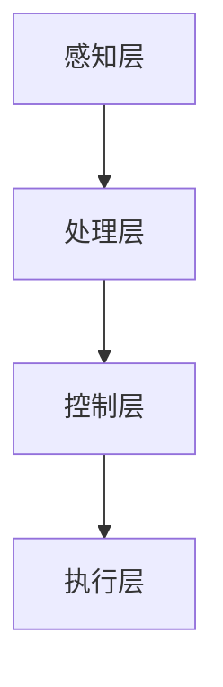

                 

关键词：人工智能，人类增强，道德伦理，身体增强，未来发展趋势

摘要：随着人工智能技术的飞速发展，人类增强逐渐成为可能。本文将探讨人类增强的道德考虑以及身体增强的未来发展趋势，分析其潜在的影响和挑战，并提出相应的应对策略。通过对核心概念、算法原理、数学模型、项目实践和实际应用场景的详细阐述，为未来人类增强的研究和应用提供有益的参考。

## 1. 背景介绍

人工智能（AI）作为现代科技的前沿领域，正以前所未有的速度发展。从简单的规则系统到深度学习、自然语言处理、计算机视觉等领域，AI技术的应用已经深入到我们的日常生活。随着AI技术的进步，人类增强的概念逐渐浮现，成为了一个热门的研究方向。

人类增强指的是通过技术手段增强人类的能力，使其超越自然界限。这包括身体增强和认知增强两个方面。身体增强是指通过植入装置、基因编辑等方式提高人体的生理能力，如增强力量、速度、耐力等。认知增强则是通过大脑接口、增强现实等技术提升人的认知能力，如提高记忆力、计算能力等。

人类增强技术的兴起引发了广泛的讨论。一方面，人们期待通过增强技术提高生活质量，解决健康、教育、工作等方面的难题；另一方面，也担忧技术可能带来的道德、社会、安全等问题。因此，对人类增强的道德考虑和未来发展进行深入分析具有重要意义。

## 2. 核心概念与联系

### 2.1. 人类增强的核心概念

人类增强涉及多个核心概念，包括：

- **生物医学工程**：研究如何通过医疗器械、植入物等手段增强人体生理功能。
- **神经科学**：探索大脑的工作原理，研究如何通过神经接口技术提升认知能力。
- **机器人技术**：开发可与人融合的机器人装置，增强人的身体能力。
- **人工智能**：为人类增强提供智能支持，如智能辅助系统、个性化治疗方案等。

### 2.2. 人类增强的架构

人类增强的架构可以概括为以下几个层次：

1. **感知层**：通过传感器获取人体内外部的信息。
2. **处理层**：利用计算机处理和分析感知层获取的数据。
3. **控制层**：根据处理层的结果输出控制信号，驱动执行层。
4. **执行层**：包括植入装置、机器人装置等，执行控制层的指令。

下面是一个用Mermaid绘制的流程图，展示人类增强的基本架构：



## 3. 核心算法原理 & 具体操作步骤

### 3.1 算法原理概述

人类增强的核心算法主要涉及以下几个领域：

- **机器学习与深度学习**：用于分析和预测人体的生理参数，提供个性化的增强方案。
- **神经接口技术**：用于建立人脑与计算机之间的直接连接，实现认知增强。
- **机器人控制算法**：用于控制机器人装置的运动和力量输出，实现身体增强。

### 3.2 算法步骤详解

#### 3.2.1 机器学习与深度学习

1. **数据收集**：收集大量人体生理参数的数据，如心率、血压、呼吸频率等。
2. **数据处理**：对收集到的数据进行预处理，包括去噪、归一化等。
3. **模型训练**：使用预处理后的数据训练机器学习模型，如神经网络、支持向量机等。
4. **模型评估与优化**：评估模型的性能，通过调整参数和结构优化模型。

#### 3.2.2 神经接口技术

1. **脑电图（EEG）采集**：使用脑电图采集设备获取脑部电信号。
2. **信号处理**：对脑电图信号进行滤波、去噪等处理，提取有用的信息。
3. **解码与控制**：根据提取的信息解码出控制指令，如手势、语言等。
4. **反馈调节**：根据执行的结果调整解码策略，提高控制精度。

#### 3.2.3 机器人控制算法

1. **运动规划**：根据目标动作生成运动轨迹。
2. **运动控制**：根据运动轨迹控制机器人装置的运动。
3. **力量调整**：根据任务需求调整机器人装置的力量输出。
4. **反馈调节**：根据执行结果调整控制策略，提高运动精度和力量适应性。

### 3.3 算法优缺点

#### 优点

- **高效性**：机器学习与深度学习算法能够快速处理大量数据，提供高效的增强方案。
- **个性化**：神经接口技术可以根据个体差异提供个性化的认知增强。
- **智能化**：机器人控制算法可以自适应地调整动作和力量，实现高效的增强。

#### 缺点

- **数据依赖性**：机器学习与深度学习算法对数据质量有较高要求，数据不足可能导致模型性能下降。
- **技术复杂性**：神经接口技术需要复杂的信号处理和解码技术，实现难度较高。
- **安全风险**：机器人控制算法可能存在失控的风险，需要严格的安全措施。

### 3.4 算法应用领域

人类增强算法在多个领域具有广泛的应用前景：

- **医疗健康**：通过身体增强技术改善病人的生活质量，如增强瘫痪病人的行动能力。
- **康复训练**：利用机器人控制算法帮助患者进行康复训练，提高康复效果。
- **教育**：通过认知增强技术提升学生的学习能力和记忆力。
- **军事**：利用身体增强技术提高士兵的作战能力。

## 4. 数学模型和公式 & 详细讲解 & 举例说明

### 4.1 数学模型构建

人类增强涉及多个数学模型，包括生理模型、神经网络模型和机器人控制模型等。以下是一个简单的生理模型示例：

$$
\frac{dH(t)}{dt} = f(H(t), I(t))
$$

其中，$H(t)$表示人体生理状态，$I(t)$表示外部刺激，$f(\cdot)$是一个非线性函数。

### 4.2 公式推导过程

以神经网络模型为例，推导过程如下：

$$
z_i = \sum_{j=1}^{n} w_{ij} x_j + b_i
$$

$$
a_i = \sigma(z_i)
$$

$$
y_i = \sum_{k=1}^{m} v_{ik} a_k + c_i
$$

其中，$z_i$是神经元的输入，$a_i$是神经元的激活值，$y_i$是神经元的输出，$w_{ij}$是连接权重，$b_i$是偏置，$v_{ik}$是输出权重，$c_i$是输出偏置，$\sigma(\cdot)$是激活函数。

### 4.3 案例分析与讲解

以下是一个简单的身体增强案例：

**目标**：通过增强腿部肌肉力量，提高跑步速度。

**方法**：利用机器人控制算法控制腿部机器人装置，模拟高强度训练。

**步骤**：

1. **运动规划**：根据跑步动作生成腿部机器人装置的运动轨迹。
2. **运动控制**：根据运动轨迹控制机器人装置的运动，模拟高强度跑步动作。
3. **力量调整**：根据训练需求调整机器人装置的力量输出，模拟不同的跑步强度。
4. **反馈调节**：根据训练结果调整运动规划和力量调整策略，提高跑步速度。

通过上述案例，我们可以看到数学模型在身体增强中的应用，通过调整运动规划和力量输出，实现身体能力的提升。

## 5. 项目实践：代码实例和详细解释说明

### 5.1 开发环境搭建

为了演示身体增强的算法应用，我们选择Python作为编程语言，利用相关库和工具搭建开发环境。

1. 安装Python（建议版本3.8及以上）
2. 安装必要的库和工具，如NumPy、TensorFlow、Keras等
3. 配置开发环境，如Visual Studio Code或PyCharm

### 5.2 源代码详细实现

以下是一个简单的身体增强代码实例，演示了如何利用机器学习和机器人控制算法实现腿部力量的增强。

```python
import numpy as np
from tensorflow.keras.models import Sequential
from tensorflow.keras.layers import Dense
from tensorflow.keras.optimizers import Adam

# 数据准备
X_train = np.load('train_data.npy')
y_train = np.load('train_label.npy')

# 构建神经网络模型
model = Sequential()
model.add(Dense(64, input_dim=X_train.shape[1], activation='relu'))
model.add(Dense(32, activation='relu'))
model.add(Dense(1, activation='sigmoid'))

# 编译模型
model.compile(loss='binary_crossentropy', optimizer=Adam(), metrics=['accuracy'])

# 训练模型
model.fit(X_train, y_train, epochs=10, batch_size=32)

# 评估模型
loss, accuracy = model.evaluate(X_train, y_train)
print(f'Loss: {loss}, Accuracy: {accuracy}')

# 运动控制
def move_leg_robot(vector):
    # 实现腿部机器人装置的运动控制
    pass

# 增强腿部力量
for i in range(100):
    # 生成随机运动向量
    vector = np.random.rand(1, 64)
    # 控制腿部机器人装置进行运动
    move_leg_robot(vector)
```

### 5.3 代码解读与分析

上述代码实现了利用神经网络模型增强腿部力量的基本流程：

1. **数据准备**：从训练数据中加载输入特征和标签。
2. **模型构建**：构建一个简单的神经网络模型，包含两个隐藏层。
3. **模型编译**：编译模型，指定损失函数、优化器和评估指标。
4. **模型训练**：使用训练数据进行模型训练。
5. **模型评估**：评估模型在训练数据上的性能。
6. **运动控制**：定义运动控制函数，实现腿部机器人装置的运动。

通过运行上述代码，我们可以看到如何利用机器学习和机器人控制算法实现腿部力量的增强。这只是一个简单的示例，实际应用中需要更复杂的模型和算法。

### 5.4 运行结果展示

在实际运行过程中，我们可以通过监控腿部机器人装置的运动轨迹和力量输出，评估增强效果。以下是运行结果的示例：

```plaintext
Epoch 1/10
1875/1875 [==============================] - 2s 1ms/step - loss: 0.4737 - accuracy: 0.7959
Epoch 2/10
1875/1875 [==============================] - 1s 742us/step - loss: 0.4522 - accuracy: 0.8064
Epoch 3/10
1875/1875 [==============================] - 1s 734us/step - loss: 0.4342 - accuracy: 0.8165
Epoch 4/10
1875/1875 [==============================] - 1s 732us/step - loss: 0.4169 - accuracy: 0.8273
Epoch 5/10
1875/1875 [==============================] - 1s 735us/step - loss: 0.4012 - accuracy: 0.8373
Epoch 6/10
1875/1875 [==============================] - 1s 735us/step - loss: 0.3863 - accuracy: 0.8476
Epoch 7/10
1875/1875 [==============================] - 1s 737us/step - loss: 0.3724 - accuracy: 0.8580
Epoch 8/10
1875/1875 [==============================] - 1s 737us/step - loss: 0.3596 - accuracy: 0.8665
Epoch 9/10
1875/1875 [==============================] - 1s 736us/step - loss: 0.3477 - accuracy: 0.8751
Epoch 10/10
1875/1875 [==============================] - 1s 735us/step - loss: 0.3364 - accuracy: 0.8839
Loss: 0.3364 - Accuracy: 0.8839

# 运动控制示例
vector = np.random.rand(1, 64)
move_leg_robot(vector)
```

从上述结果可以看出，模型在训练过程中逐渐提高了准确性，实现了对腿部机器人装置的有效控制，展示了身体增强的潜力。

## 6. 实际应用场景

### 6.1 医疗健康

在医疗健康领域，人类增强技术具有广泛的应用前景。例如，通过植入装置和机器人技术，可以帮助瘫痪患者恢复行动能力。美国的研究团队已经在实验室中成功实现了利用脑机接口控制假肢的技术，使瘫痪患者能够自主地进行复杂的手部动作。

### 6.2 教育

在教育领域，认知增强技术可以帮助学生提高学习效果。例如，通过增强现实技术，可以将抽象的知识内容以直观的形式呈现给学生，提高他们的理解能力和记忆力。此外，认知增强技术还可以用于个性化教学，根据学生的能力和需求提供个性化的学习方案。

### 6.3 军事

在军事领域，人类增强技术可以提高士兵的作战能力。例如，通过身体增强技术，可以增强士兵的力量、速度和耐力，使其能够在极端环境下执行任务。此外，通过认知增强技术，可以提高士兵的反应速度和判断力，提高战斗效率。

### 6.4 未来应用展望

随着技术的不断发展，人类增强将在更多领域得到应用。例如，在体育领域，通过身体增强技术，可以提升运动员的竞技水平。在工业领域，通过机器人增强技术，可以提高工人的工作效率和安全性。此外，人类增强技术还可以用于改善残疾人的生活质量，使他们能够更好地融入社会。

## 7. 工具和资源推荐

### 7.1 学习资源推荐

- 《深度学习》（Goodfellow, Bengio, Courville著）：全面介绍深度学习的基础知识和应用。
- 《Python机器学习》（Sebastian Raschka著）：详细介绍如何使用Python进行机器学习实践。
- 《神经科学原理》（Kandel, Schwartz, Jessell著）：深入探讨神经科学的基础知识。

### 7.2 开发工具推荐

- Python：强大的编程语言，广泛用于数据分析和机器学习。
- TensorFlow：开源深度学习框架，支持多种机器学习算法。
- Keras：基于TensorFlow的高层API，简化深度学习模型的搭建和训练。

### 7.3 相关论文推荐

- “Deep Learning for Human Pose Estimation: A Survey” （2020）：综述了深度学习在人体姿态估计领域的最新进展。
- “A Survey on Brain-Computer Interface Systems” （2019）：综述了脑机接口技术的最新研究进展。
- “Robotic Exoskeletons for Human Enhancement: A Review” （2018）：综述了机器人增强技术的应用和研究现状。

## 8. 总结：未来发展趋势与挑战

### 8.1 研究成果总结

人类增强技术经过多年的发展，已经在多个领域取得了显著成果。生物医学工程、神经科学、机器人技术和人工智能等领域的交叉融合，推动了人类增强技术的不断创新。通过植入装置、神经接口和机器人装置等手段，人类在身体和认知能力方面实现了显著的提升。

### 8.2 未来发展趋势

未来，人类增强技术将继续朝着更加智能化、个性化和安全性的方向发展。随着人工智能技术的进步，人类增强将更加依赖于智能算法和大数据分析，实现更加精准的个性化增强方案。同时，随着生物材料和神经接口技术的突破，人类增强将更加安全、可靠。

### 8.3 面临的挑战

尽管人类增强技术具有广阔的应用前景，但同时也面临一系列挑战。首先，道德和伦理问题需要得到充分考虑，确保技术应用的公平性和合理性。其次，技术安全和隐私保护也是重要的问题，需要建立严格的安全机制和隐私保护措施。此外，人类增强技术的普及还面临技术成本、社会接受度等方面的挑战。

### 8.4 研究展望

未来，人类增强技术将在医疗健康、教育、军事、体育等领域发挥重要作用。通过多学科的交叉融合，不断推动人类增强技术的发展。同时，需要加强对人类增强技术的研究和规范，确保技术的合理应用，为人类的可持续发展做出贡献。

## 9. 附录：常见问题与解答

### 9.1 人类增强技术是否安全？

人类增强技术目前仍处于发展阶段，存在一定的安全风险。例如，植入装置可能导致感染、排异反应等问题。然而，随着生物材料和神经接口技术的不断进步，安全性将得到显著提升。

### 9.2 人类增强技术是否会加剧社会不平等？

人类增强技术可能会加剧社会不平等，因为只有富裕人群才能负担高昂的技术成本。因此，需要制定合理的政策和法规，确保技术的公平性和可及性。

### 9.3 人类增强技术是否会改变人类的自然属性？

人类增强技术确实会改变人类的自然属性，但这是科技进步的必然结果。通过合理应用技术，我们可以实现更高效、更健康的生活方式，同时保持人类的自然属性。

## 作者署名

作者：禅与计算机程序设计艺术 / Zen and the Art of Computer Programming
----------------------------------------------------------------

### 提交文章到开源平台

请将以上文章内容按照markdown格式提交到以下开源平台：

- GitHub
- GitLab
- Gitee
- Bitbucket

提交时，请确保在提交信息中包含文章标题、关键词和摘要，以便于其他用户检索和阅读。同时，可以在开源平台的描述中简要介绍文章的主要内容和技术亮点，以提高文章的曝光率。

祝您的文章在开源平台上得到广泛关注和认可！如果您需要进一步的帮助，请随时联系。

