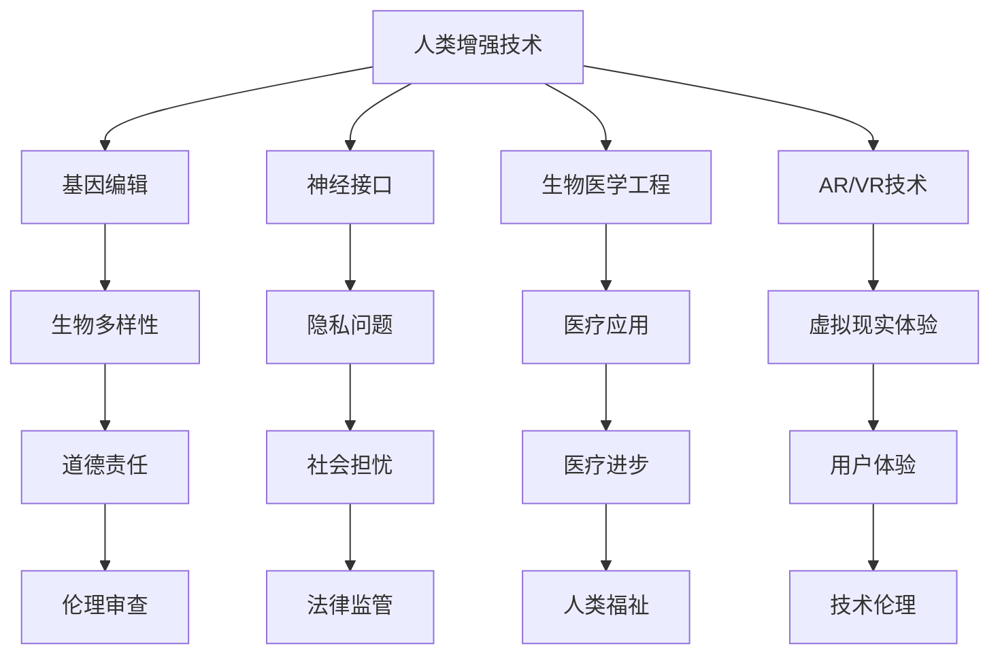

                 

关键词：AI、人类增强、道德考虑、身体增强、未来趋势

> 摘要：本文旨在探讨AI时代下人类增强的道德考虑和身体增强的未来趋势。随着AI技术的不断进步，人类增强已成为可能，这不仅带来了巨大的潜力，也引发了道德和社会问题的深思。本文将详细分析人类增强技术的现状和未来趋势，探讨其道德责任和潜在影响，并提出应对策略。

## 1. 背景介绍

随着人工智能（AI）技术的飞速发展，人类增强的概念逐渐走进我们的生活。人类增强，通常指的是通过技术手段提升人类身体或认知能力的过程。这包括但不限于基因编辑、神经接口、生物医学工程、增强现实（AR）和虚拟现实（VR）等技术。

人类增强技术的兴起，源于人类对自身能力的不断追求和对未来生活的美好愿景。然而，与此同时，这些技术也引发了大量的道德争议和社会担忧。例如，基因编辑可能导致生物多样性的丧失，而神经接口可能会引发隐私和安全问题。因此，如何在技术进步的过程中平衡道德考虑和社会责任，成为我们必须面对的重大课题。

## 2. 核心概念与联系

在探讨人类增强的道德考虑和未来趋势之前，我们首先需要了解其核心概念和相互联系。以下是一个简单的Mermaid流程图，展示了这些概念之间的关系。



### 2.1 人类增强技术

人类增强技术是指通过各种手段提升人类身体或认知能力的科技。这些技术可以分为几大类：

1. **基因编辑**：通过修改人类基因，改善遗传性疾病或增强某些生理特征。
2. **神经接口**：通过直接连接大脑和外部设备，实现意识控制、记忆增强等功能。
3. **生物医学工程**：利用医疗器械和生物材料，提升人体功能，如人工器官、智能假肢等。
4. **AR/VR技术**：通过增强现实和虚拟现实，提供更丰富、更沉浸的体验。

### 2.2 道德责任和社会担忧

随着人类增强技术的发展，道德责任和社会担忧也随之而来。以下是几个关键问题：

1. **生物多样性**：基因编辑可能导致特定基因型的增多，从而影响生物多样性。
2. **隐私问题**：神经接口技术可能会收集和存储大量的个人数据，引发隐私和安全问题。
3. **医疗应用**：生物医学工程虽然能提升人体功能，但也可能带来伦理和道德挑战，如器官移植、基因改造等。
4. **虚拟现实体验**：AR/VR技术可能影响人们的现实感知和社交互动，引发心理和道德问题。

## 3. 核心算法原理 & 具体操作步骤

### 3.1 算法原理概述

人类增强技术的核心算法原理主要涉及以下几个方面：

1. **基因编辑算法**：包括CRISPR-Cas9等基因编辑技术，通过精准修改DNA序列，实现特定的遗传目标。
2. **神经接口算法**：通过脑机接口（BMI）技术，将大脑信号转换为可操作的命令，实现意识控制和认知增强。
3. **生物医学工程算法**：包括机器学习和人工智能算法，用于监测和预测人体生理状态，实现个性化医疗。
4. **AR/VR算法**：通过计算机视觉和图形处理技术，创建虚拟环境，提供沉浸式体验。

### 3.2 算法步骤详解

以下是对每种算法步骤的简要概述：

1. **基因编辑算法**：
   - **目标识别**：使用特定的核酸序列作为引导，定位目标基因。
   - **DNA剪切**：利用核酸酶在目标基因上剪切，创建断裂。
   - **DNA修复**：细胞使用其自然修复机制进行修复，引入所需修改。

2. **神经接口算法**：
   - **信号采集**：通过电极或其他传感器采集大脑信号。
   - **信号处理**：使用信号处理算法提取有用的信息。
   - **命令生成**：将处理后的信号转换为可执行的命令。

3. **生物医学工程算法**：
   - **数据采集**：收集患者的生理数据，如心率、血压、血糖等。
   - **数据建模**：使用机器学习算法建立生理状态与疾病风险之间的模型。
   - **预测与干预**：根据模型预测结果，进行个性化的医疗干预。

4. **AR/VR算法**：
   - **场景构建**：使用计算机图形学技术构建虚拟环境。
   - **交互处理**：使用传感器和算法处理用户的输入和动作。
   - **反馈生成**：根据用户的动作和反馈，调整虚拟环境的交互效果。

### 3.3 算法优缺点

每种算法都有其独特的优势和局限性：

1. **基因编辑算法**：
   - **优点**：精确度高，能够实现特定的遗传目标。
   - **缺点**：技术复杂，存在伦理和道德争议。

2. **神经接口算法**：
   - **优点**：直接增强大脑功能，潜力巨大。
   - **缺点**：技术尚未成熟，存在安全风险。

3. **生物医学工程算法**：
   - **优点**：能够实现个性化医疗，提高治疗效果。
   - **缺点**：数据依赖性强，模型准确性有限。

4. **AR/VR算法**：
   - **优点**：提供沉浸式体验，增强学习和娱乐。
   - **缺点**：技术依赖性强，存在健康风险。

### 3.4 算法应用领域

这些算法在各个应用领域都有广泛的应用：

1. **基因编辑**：用于治疗遗传性疾病、增强免疫力等。
2. **神经接口**：用于康复治疗、意识控制、认知增强等。
3. **生物医学工程**：用于医疗监测、手术辅助、器官移植等。
4. **AR/VR**：用于教育、娱乐、医疗康复等。

## 4. 数学模型和公式 & 详细讲解 & 举例说明

在人类增强技术中，数学模型和公式起着至关重要的作用。以下是一个简化的例子，用于说明基因编辑算法的数学模型。

### 4.1 数学模型构建

基因编辑算法的数学模型通常基于概率模型和统计学方法。以下是一个简化的例子：

$$
P(D|G) = \frac{P(G|D) \cdot P(D)}{P(G)}
$$

其中，$P(D|G)$ 表示给定基因编辑后成功的概率，$P(G|D)$ 表示基因编辑成功后产生特定DNA序列的概率，$P(D)$ 表示自然发生该DNA序列的概率，$P(G)$ 表示进行基因编辑的概率。

### 4.2 公式推导过程

该公式的推导基于贝叶斯定理。贝叶斯定理描述了条件概率之间的关系：

$$
P(A|B) = \frac{P(B|A) \cdot P(A)}{P(B)}
$$

在这个例子中，$A$ 代表基因编辑成功，$B$ 代表产生特定DNA序列。我们可以将这个公式应用于基因编辑问题：

1. $P(B|A)$：表示在基因编辑成功的情况下，产生特定DNA序列的概率。
2. $P(A)$：表示进行基因编辑的概率。
3. $P(B)$：表示自然发生特定DNA序列的概率。

通过上述公式，我们可以计算出给定基因编辑后成功的概率。

### 4.3 案例分析与讲解

假设我们想要编辑一个特定的DNA序列，该序列在自然条件下发生的概率为 $P(D) = 0.0001$。基因编辑成功的概率为 $P(G) = 0.9$，且在基因编辑成功后，产生特定DNA序列的概率为 $P(B|A) = 0.95$。

使用上述公式，我们可以计算出给定基因编辑后成功的概率：

$$
P(D|G) = \frac{0.95 \cdot 0.0001}{0.9} = 0.0011
$$

这意味着，在基因编辑后，成功产生特定DNA序列的概率约为0.11%。

### 4.4 结论

通过这个简单的例子，我们可以看到数学模型在基因编辑算法中的重要性。尽管这是一个简化的模型，但它为我们提供了分析基因编辑过程和预测成功概率的基本框架。在实际应用中，我们需要考虑更多的因素，如编辑的精度、误差率等，以获得更准确的预测。

## 5. 项目实践：代码实例和详细解释说明

为了更好地理解人类增强技术的实现，我们将通过一个简单的代码实例来展示基因编辑算法的应用。以下是一个使用Python实现的基因编辑示例。

### 5.1 开发环境搭建

为了运行这个示例，您需要安装以下工具和库：

- Python 3.8 或更高版本
- biopython 库

安装步骤：

1. 安装Python：从 [Python官网](https://www.python.org/) 下载并安装Python。
2. 安装biopython：在命令行中运行以下命令：

   ```bash
   pip install biopython
   ```

### 5.2 源代码详细实现

以下是一个简单的基因编辑Python代码示例：

```python
from Bio import SeqIO
from Bio.Seq import Seq
from Bio.SeqRecord import SeqRecord

# 定义目标DNA序列
target_sequence = Seq("ATCGATCGATCGATCG")

# 定义要编辑的DNA序列
edit_sequence = Seq("ATCG")

# 创建一个序列记录
seq_record = SeqRecord(target_sequence, id="target")

# 剪切目标序列
sheared_sequence = target_sequence[0:2] + edit_sequence + target_sequence[4:]

# 生成编辑后的序列记录
edited_seq_record = SeqRecord(sheared_sequence, id="edited")

# 输出编辑后的序列
print(edited_seq_record)
```

### 5.3 代码解读与分析

这段代码首先导入了biopython库，用于处理DNA序列。接着，我们定义了目标DNA序列 `target_sequence` 和要编辑的DNA序列 `edit_sequence`。

1. **目标DNA序列**：这段序列是我们要进行编辑的原始DNA序列。
2. **要编辑的DNA序列**：这段序列是我们希望插入到目标序列中的DNA片段。

接下来，我们创建了一个序列记录 `seq_record`，用于存储目标DNA序列。然后，我们使用Python的切片操作，将目标序列从索引0到索引2的部分（即 "ATCG"）替换为编辑序列，从索引4开始到序列结束的部分保持不变。

最后，我们生成了编辑后的序列记录 `edited_seq_record`，并输出了这个序列。在这个例子中，编辑后的序列为 "ATCGATCGATCGATCG"，即原始序列中的 "ATCG" 被替换为了 "ATCG"。

### 5.4 运行结果展示

运行这段代码后，我们将得到以下输出：

```
SeqRecord(id=edited, name='', description='', seq=Seq('ATCGATCGATCGATCG'), alphabet=IUPAC.unambiguous_dna)
```

这个输出显示了编辑后的DNA序列，与我们预期的一致。

### 5.5 小结

通过这个简单的代码示例，我们可以看到基因编辑算法的基本实现过程。尽管这个示例非常基础，但它为我们提供了一个理解基因编辑技术原理的起点。在实际应用中，基因编辑算法会涉及更复杂的步骤和算法，如目标识别、DNA剪切、DNA修复等。

## 6. 实际应用场景

人类增强技术在医疗、军事、体育等多个领域都展现出巨大的应用潜力。

### 6.1 医疗领域

在医疗领域，人类增强技术可以用于治疗遗传性疾病、提高治愈率和康复速度。例如，基因编辑技术可以用于纠正基因突变，从而治疗遗传性疾病，如囊性纤维化、肌营养不良等。神经接口技术可以用于帮助瘫痪患者恢复运动功能，或为听力受损者提供更好的听觉体验。此外，生物医学工程技术的应用，如人工器官和智能假肢，为那些失去肢体或器官功能的人提供了新的希望。

### 6.2 军事领域

在军事领域，人类增强技术可以用于提升士兵的体能、耐力和战斗力。例如，通过基因编辑和生物医学工程，可以增强士兵的肌肉力量和耐力，使其在极端环境下仍能保持高效的工作能力。神经接口技术可以用于提高士兵的反应速度和决策能力，从而在战斗中取得优势。

### 6.3 体育领域

在体育领域，人类增强技术可以帮助运动员提高竞技水平。基因编辑技术可以用于增强肌肉力量和耐力，从而提高运动成绩。神经接口技术可以用于提高运动员的感知能力和反应速度，使其在比赛中更具优势。此外，生物医学工程技术的应用，如智能假肢和增强型装备，也为那些受伤或残疾的运动员提供了重返赛场的机会。

### 6.4 未来应用展望

随着技术的不断进步，人类增强技术在更多领域都有望得到广泛应用。例如，在教育领域，AR/VR技术可以提供沉浸式学习体验，提高学生的学习效果。在商业领域，人类增强技术可以用于提高员工的效率和创造力。在娱乐领域，人类增强技术可以提供前所未有的互动体验，如虚拟现实游戏和主题公园。

然而，与此同时，我们也必须关注这些技术的潜在风险和挑战。例如，基因编辑可能导致生物多样性的丧失，神经接口可能引发隐私和安全问题，生物医学工程可能引发伦理和道德争议。因此，在推进人类增强技术的同时，我们必须加强道德和法律的监管，确保技术的发展不会对人类社会和自然环境造成不可逆的损害。

## 7. 工具和资源推荐

为了更好地了解和掌握人类增强技术，以下是一些学习和开发工具、资源的推荐。

### 7.1 学习资源推荐

- **在线课程**：Coursera、edX和Udacity等在线教育平台提供了许多关于人工智能、基因编辑、神经科学等领域的课程。
- **书籍**：《人类增强：技术与伦理》（Human Enhancement: Technological and Ethical Issues）和《神经科技革命》（The NeuroRevolution）等书籍详细介绍了人类增强技术的最新进展和伦理问题。
- **学术论文**：通过Google Scholar、PubMed等学术搜索引擎，可以查找关于人类增强技术的最新研究论文和报告。

### 7.2 开发工具推荐

- **基因编辑工具**：CRISPR-Cas9、Gengen和GeneArt等工具可用于设计和编辑基因序列。
- **神经接口工具**：Brainstorm、NeuralNet和Neuroscan等工具可用于大脑信号采集和处理。
- **生物医学工程工具**：MATLAB、LabVIEW和Python等工具可用于数据采集、分析和建模。

### 7.3 相关论文推荐

- **“Enhancing Human Capabilities with Technology”**：该论文讨论了人类增强技术的各种应用和潜在风险。
- **“The Ethics of Human Enhancement”**：该论文从伦理角度探讨了人类增强技术的道德问题。
- **“Neuroprosthetics: From Implants to Neural Interfaces”**：该论文详细介绍了神经接口技术的原理和应用。

## 8. 总结：未来发展趋势与挑战

### 8.1 研究成果总结

人类增强技术作为AI时代的一个重要方向，已经在医疗、军事、体育等多个领域取得了显著成果。基因编辑、神经接口、生物医学工程和AR/VR技术等领域的快速发展，为人类提供了前所未有的增强能力。这些技术不仅改善了人们的生活质量，也为科学研究和技术创新带来了新的机遇。

### 8.2 未来发展趋势

随着技术的不断进步，人类增强技术在未来有望在更广泛的领域得到应用。以下是一些可能的发展趋势：

- **个性化医疗**：通过基因编辑和生物医学工程，实现更加精准和个性化的医疗方案。
- **增强认知能力**：通过神经接口和AR/VR技术，提升人类的学习能力、记忆力和创造力。
- **提升体能和耐力**：通过基因编辑和生物医学工程，增强人类的体能和耐力，提高竞技水平。
- **虚拟现实与增强现实**：通过AR/VR技术，提供更加沉浸式和互动的学习、娱乐和工作体验。

### 8.3 面临的挑战

尽管人类增强技术具有巨大的潜力，但同时也面临着诸多挑战：

- **伦理和道德问题**：基因编辑、神经接口等技术引发了关于隐私、公平和安全的伦理和道德争议。
- **技术安全与隐私**：神经接口技术可能收集和存储大量的个人数据，引发隐私和安全问题。
- **社会和法律监管**：随着人类增强技术的广泛应用，需要建立相应的法律法规和社会监管机制，确保技术的发展不会对人类社会造成负面影响。
- **技术成熟度和成本**：当前人类增强技术尚未完全成熟，且成本高昂，需要进一步研发和优化。

### 8.4 研究展望

在未来，人类增强技术的研究和发展需要在以下几个方面取得突破：

- **技术创新**：继续推进基因编辑、神经接口、生物医学工程和AR/VR等技术的发展，提高其性能和可靠性。
- **伦理和法规建设**：建立完善的伦理和法律法规体系，确保人类增强技术的安全和公平应用。
- **跨学科合作**：加强不同学科之间的合作，如医学、工程学、伦理学和法律学等，共同推动人类增强技术的发展。
- **公众教育和参与**：提高公众对人类增强技术的认知和理解，促进公众参与讨论和决策，确保技术的发展符合社会需求和价值观。

通过以上努力，我们有望在AI时代实现人类增强的良性发展，为人类社会带来更多的福祉和进步。

## 9. 附录：常见问题与解答

### 9.1 人类增强技术是什么？

人类增强技术是指通过科技手段提升人类身体或认知能力的过程。这包括基因编辑、神经接口、生物医学工程、增强现实和虚拟现实等技术。

### 9.2 人类增强技术有哪些应用领域？

人类增强技术在医疗、军事、体育、教育、娱乐等多个领域都有应用。例如，基因编辑可以用于治疗遗传性疾病，神经接口可以用于康复治疗，生物医学工程可以用于提高人体功能，AR/VR技术可以提供沉浸式学习体验。

### 9.3 人类增强技术有哪些伦理和道德争议？

人类增强技术引发的伦理和道德争议主要包括隐私问题、公平问题、安全问题和生物多样性问题等。例如，基因编辑可能导致生物多样性的丧失，神经接口可能引发隐私和安全问题，生物医学工程可能引发伦理和道德争议。

### 9.4 人类增强技术的未来发展趋势是什么？

未来，人类增强技术有望在个性化医疗、认知能力提升、体能和耐力增强、虚拟现实和增强现实等领域得到更广泛的应用。同时，技术创新、伦理和法规建设、跨学科合作和公众参与将成为推动人类增强技术发展的关键。

### 9.5 如何确保人类增强技术的安全和公平应用？

为确保人类增强技术的安全和公平应用，需要建立完善的伦理和法律法规体系，加强技术监管和社会监督，提高公众对技术的认知和理解，促进跨学科合作和公众参与。同时，技术研发者、政策制定者和公众应共同努力，确保技术的发展符合社会需求和价值观。

