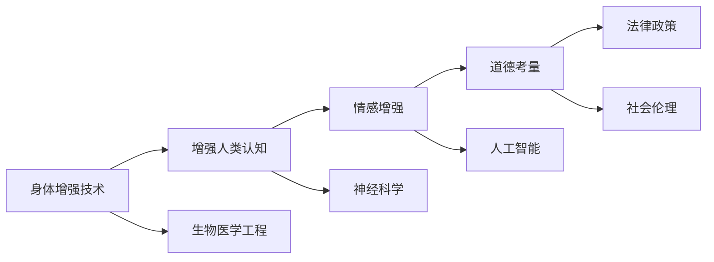

                 

# AI时代的人类增强：道德考虑和身体增强技术的未来

## 1. 背景介绍

随着人工智能技术的迅速发展，人类增强（Human Enhancement）成为当前学术界和产业界关注的热点话题。通过科技手段提升人类的身体、认知和情感等能力，旨在让人类更好地适应未来复杂多变的世界。身体增强技术（Body Enhancement）作为其中的重要组成部分，利用生物医学工程和人工智能的最新成果，为人类提供更多健康、高效、智能的解决方案。本文将深入探讨身体增强技术的核心概念、前沿进展和面临的道德挑战，为AI时代的人类增强未来提供有益的思考和建议。

## 2. 核心概念与联系

### 2.1 核心概念概述

1. **身体增强技术（Body Enhancement Technologies）**：利用生物医学工程和人工智能技术，提升或修复人体功能的技术手段。包括假肢、助听器、仿生耳、植入式神经刺激器、生物反馈设备、增强现实（AR）和虚拟现实（VR）等。

2. **增强人类认知（Cognitive Enhancement）**：通过脑科学、神经工程和人工智能技术，提升人类大脑处理信息、学习、记忆、决策等方面的能力。包括脑机接口（BCI）、神经反馈、认知训练游戏等。

3. **情感增强（Emotional Enhancement）**：利用AI技术，提升人类的情感感知和表达能力，增强情绪调节和心理稳定性。包括情感AI、情绪识别、情绪控制算法等。

4. **道德考量（Ethical Considerations）**：人类增强技术在应用过程中面临的伦理、法律和社会问题。包括隐私保护、公平性、安全性、责任归属等。

### 2.2 核心概念原理和架构的 Mermaid 流程图



## 3. 核心算法原理 & 具体操作步骤

### 3.1 算法原理概述

身体增强技术的核心算法包括生物信号处理、深度学习、强化学习、神经网络模拟等。通过这些技术，身体增强设备能够实现对人类身体的精确控制和优化，从而提升人类的身体功能。

### 3.2 算法步骤详解

#### 3.2.1 数据采集与处理

1. **生物信号采集**：使用传感器采集人体的生理信号，如心电图（ECG）、脑电图（EEG）、肌电图（EMG）等。
2. **数据预处理**：对采集到的信号进行滤波、降噪、归一化等处理，确保数据的准确性和可靠性。

#### 3.2.2 算法模型训练

1. **深度学习模型训练**：使用卷积神经网络（CNN）、递归神经网络（RNN）、长短时记忆网络（LSTM）等深度学习模型，对信号数据进行特征提取和模式识别。
2. **强化学习模型训练**：使用强化学习算法，如Q-learning、Deep Q-learning等，训练模型在特定环境中做出最优决策。

#### 3.2.3 信号解码与控制

1. **信号解码**：将处理后的信号数据解码为控制指令，如机械臂动作、假肢姿态等。
2. **控制执行**：将控制指令发送给执行器，如电动轮椅、智能假肢等，实现对身体的精确控制。

### 3.3 算法优缺点

#### 3.3.1 优点

1. **高精度控制**：深度学习模型能够精确识别和处理复杂的生物信号，实现高精度的身体控制。
2. **实时性**：强化学习算法能够实时调整控制策略，确保身体增强设备在实际应用中的高效性和可靠性。
3. **灵活性**：人工智能技术可以根据用户需求动态调整模型参数，满足不同用户的个性化需求。

#### 3.3.2 缺点

1. **数据隐私**：生物信号采集涉及个人隐私，可能引发数据安全问题。
2. **伦理争议**：过度依赖身体增强技术可能引发对自然属性和个体自主性的质疑。
3. **技术局限**：现有技术仍存在一定的局限性，如信号噪声、算法鲁棒性等问题，有待进一步优化。

### 3.4 算法应用领域

身体增强技术在多个领域得到了广泛应用，包括医疗、康复、体育、娱乐等。

1. **医疗康复**：利用假肢、助听器等设备，帮助残疾人恢复正常生活。
2. **体育竞技**：通过智能假肢和神经反馈设备，提高运动员的体能和竞技水平。
3. **娱乐休闲**：通过AR/VR设备和脑机接口，提升娱乐体验和游戏乐趣。
4. **日常辅助**：利用智能穿戴设备和健康监测系统，提升生活质量和健康水平。

## 4. 数学模型和公式 & 详细讲解 & 举例说明

### 4.1 数学模型构建

假设我们要训练一个用于控制电动轮椅的深度学习模型，其输入为ECG信号，输出为轮椅的控制指令。数学模型可表示为：

$$
y = f(x; \theta)
$$

其中，$y$ 表示轮椅的控制指令，$x$ 表示ECG信号，$\theta$ 表示模型参数。

### 4.2 公式推导过程

1. **输入层**：将ECG信号转化为向量形式 $x = (x_1, x_2, ..., x_n)$。
2. **隐藏层**：使用多层神经网络对信号进行特征提取，得到高维特征表示 $h = (h_1, h_2, ..., h_m)$。
3. **输出层**：将高维特征映射为轮椅的控制指令 $y = (y_1, y_2, ..., y_k)$。

### 4.3 案例分析与讲解

假设我们收集了一组电动轮椅用户的数据，包括其ECG信号和对应的轮椅控制指令。我们使用卷积神经网络（CNN）对ECG信号进行处理，得到特征表示 $h$。然后，通过全连接层将特征映射为轮椅的控制指令 $y$。训练过程中，我们使用交叉熵损失函数 $L$ 进行优化：

$$
L = -\sum_{i=1}^{N} \sum_{j=1}^{k} y_{ij} \log p_{ij}
$$

其中，$N$ 表示样本数，$k$ 表示控制指令的种类，$y_{ij}$ 表示第 $i$ 个样本第 $j$ 个控制指令的标签，$p_{ij}$ 表示模型预测的概率。

## 5. 项目实践：代码实例和详细解释说明

### 5.1 开发环境搭建

1. **安装Python**：确保你的系统中安装了Python，版本建议为3.6或以上。
2. **安装相关库**：使用pip安装TensorFlow、Keras、PyTorch等深度学习库。
3. **数据收集与预处理**：收集电动轮椅用户的数据，并进行预处理，如滤波、归一化等。

### 5.2 源代码详细实现

以下是一个简单的深度学习模型实现代码：

```python
import tensorflow as tf
from tensorflow.keras import layers

# 定义模型
model = tf.keras.Sequential()
model.add(layers.Conv2D(32, (3, 3), activation='relu', input_shape=(128, 128, 1)))
model.add(layers.MaxPooling2D((2, 2)))
model.add(layers.Flatten())
model.add(layers.Dense(64, activation='relu'))
model.add(layers.Dense(10, activation='softmax'))

# 编译模型
model.compile(optimizer=tf.keras.optimizers.Adam(),
              loss='categorical_crossentropy',
              metrics=['accuracy'])

# 训练模型
model.fit(train_x, train_y, epochs=10, validation_data=(val_x, val_y))
```

### 5.3 代码解读与分析

1. **模型定义**：使用Sequential模型，添加卷积层、池化层、全连接层等。
2. **编译模型**：设置优化器、损失函数和评估指标。
3. **训练模型**：使用训练数据进行模型训练，并使用验证数据进行性能评估。

### 5.4 运行结果展示

训练结束后，可以保存模型并使用测试数据进行评估，例如：

```python
test_loss, test_acc = model.evaluate(test_x, test_y)
print('Test accuracy:', test_acc)
```

## 6. 实际应用场景

### 6.1 医疗康复

利用假肢和助听器，帮助残疾人和听力障碍者恢复基本生活能力。通过深度学习技术，优化假肢的响应速度和精度，提升用户的舒适度和体验感。

### 6.2 体育竞技

通过智能假肢和神经反馈设备，提升运动员的体能和竞技水平。使用强化学习算法，训练运动员在特定环境下的动作控制和决策能力。

### 6.3 娱乐休闲

通过AR/VR设备和脑机接口，提升娱乐体验和游戏乐趣。使用深度学习技术，根据用户的行为和反馈，优化虚拟环境的交互体验和实时性。

### 6.4 未来应用展望

1. **可穿戴设备的普及**：随着技术的进步和成本的降低，越来越多的可穿戴设备将进入家庭和工作场所，提升人类的生活品质和工作效率。
2. **个性化健康管理**：利用身体增强技术，实现对人类健康的全面监测和个性化管理，预防疾病，提升生活质量。
3. **智能家居与城市管理**：通过智能家居设备和智能城市管理，提升生活便利性和环境舒适度。

## 7. 工具和资源推荐

### 7.1 学习资源推荐

1. **《Human Augmentation: The Ethical Challenges of Enhancing Human Capabilities》**：探讨人类增强技术面临的伦理、法律和社会问题。
2. **《The Science and Ethics of Human Enhancement》**：介绍人类增强技术的科学原理和道德考量。
3. **《Human Augmentation: Engineering for a Better Future》**：展示身体增强技术在医疗、体育、娱乐等领域的实际应用。

### 7.2 开发工具推荐

1. **TensorFlow**：深度学习框架，支持多种深度学习模型和算法。
2. **PyTorch**：深度学习框架，灵活易用，适用于科研和工程开发。
3. **Jupyter Notebook**：交互式编程环境，便于代码调试和数据分析。

### 7.3 相关论文推荐

1. **"Human Performance Enhancement through Brain-Computer Interface"**：介绍脑机接口技术在提升人类认知方面的应用。
2. **"Human Enhancement Technologies: A Review"**：综述当前人类增强技术的进展和应用。
3. **"Ethical Considerations in Human Augmentation"**：讨论人类增强技术的伦理和法律问题。

## 8. 总结：未来发展趋势与挑战

### 8.1 研究成果总结

人类增强技术在医疗、体育、娱乐等领域取得了显著进展，提升了人类的身体、认知和情感能力。然而，随之而来的伦理、法律和社会问题也不容忽视，需要进一步探讨和解决。

### 8.2 未来发展趋势

1. **技术融合**：身体增强技术与人工智能、生物医学工程、神经科学等领域的深度融合，将进一步提升技术的性能和应用范围。
2. **个性化定制**：利用大数据和机器学习技术，实现对不同用户的个性化定制，满足个性化需求。
3. **多模态融合**：将身体增强技术与多种传感器和设备融合，实现多模态信息协同工作。

### 8.3 面临的挑战

1. **数据隐私**：身体增强技术涉及大量个人数据，数据隐私和安全问题亟需解决。
2. **伦理争议**：过度依赖身体增强技术可能引发对自然属性和个体自主性的质疑。
3. **技术局限**：现有技术仍存在一定的局限性，如信号噪声、算法鲁棒性等问题，有待进一步优化。

### 8.4 研究展望

1. **伦理框架**：制定和完善人类增强技术的伦理框架，保障技术的公平性和安全性。
2. **技术标准**：制定和实施技术标准，确保身体增强设备的可靠性和安全性。
3. **公共教育**：加强对公众的科普教育，提高社会对人类增强技术的理解和接受度。

## 9. 附录：常见问题与解答

**Q1：人类增强技术的发展方向有哪些？**

A：人类增强技术的发展方向包括但不限于以下几个方面：

1. **生物医学工程**：开发新型的生物材料、医疗设备和技术，提升人类的身体功能和健康水平。
2. **人工智能**：利用深度学习、强化学习等技术，提升人类的认知和情感能力。
3. **生物反馈**：通过脑机接口、神经反馈等技术，改善人类的情绪调节和心理稳定性。
4. **个性化健康管理**：利用大数据和机器学习技术，实现对不同用户的个性化健康管理。

**Q2：身体增强技术在应用过程中可能存在哪些风险？**

A：身体增强技术在应用过程中可能存在的风险包括：

1. **数据隐私和安全**：生物信号采集涉及个人隐私，可能引发数据安全问题。
2. **伦理争议**：过度依赖身体增强技术可能引发对自然属性和个体自主性的质疑。
3. **技术局限**：现有技术仍存在一定的局限性，如信号噪声、算法鲁棒性等问题，有待进一步优化。

**Q3：如何应对身体增强技术面临的伦理挑战？**

A：应对身体增强技术面临的伦理挑战，可以从以下几个方面入手：

1. **伦理框架**：制定和完善人类增强技术的伦理框架，保障技术的公平性和安全性。
2. **公共教育**：加强对公众的科普教育，提高社会对人类增强技术的理解和接受度。
3. **技术标准**：制定和实施技术标准，确保身体增强设备的可靠性和安全性。

**Q4：身体增强技术在实际应用中需要注意哪些问题？**

A：身体增强技术在实际应用中需要注意以下问题：

1. **数据隐私**：确保生物信号采集和处理的合法性和安全性。
2. **伦理争议**：考虑技术对个体自主性和自然属性的影响，避免过度依赖。
3. **技术局限**：不断优化和改进技术，提升其精度和鲁棒性。

---

作者：禅与计算机程序设计艺术 / Zen and the Art of Computer Programming

