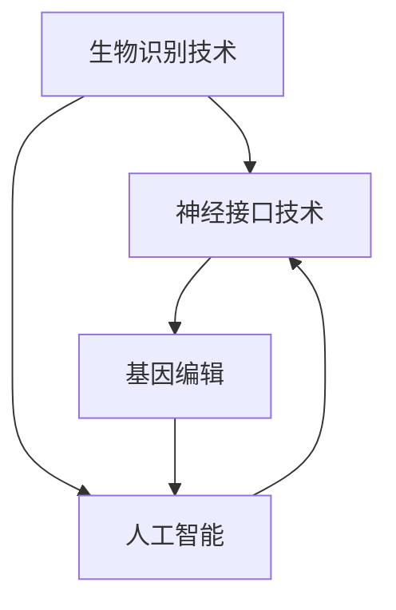

                 

关键词：人工智能、人类增强、道德伦理、身体增强、技术限制

> 摘要：本文探讨了AI时代人类增强的道德考虑和技术限制。随着人工智能技术的飞速发展，人类在身体和智力上得到了前所未有的增强。然而，这一进程也引发了一系列道德和伦理问题，如隐私、安全、公平性等。本文旨在分析这些问题，并提出相应的解决方案，以引导AI时代的人类增强走向可持续和负责任的发展道路。

## 1. 背景介绍

人工智能（AI）的发展已经渗透到我们生活的方方面面，从智能手机的语音助手到自动驾驶汽车，从智能家居到医疗诊断，AI的应用范围不断扩大。与此同时，人类对自身身体和智力的增强需求也日益增长。例如，增强记忆、提高反应速度、增加体力等。这些增强不仅提高了人类的生活质量，也为社会经济的发展提供了新的动力。

然而，AI时代的人类增强并非没有风险和挑战。首先，道德和伦理问题日益突出。人类增强技术可能会加剧社会不平等，导致“增强者”和“非增强者”之间的鸿沟扩大。其次，技术限制也限制了人类增强的发展。目前，人类对大脑和身体的工作机制了解有限，无法精确控制增强效果，这可能导致不可预知的副作用。

## 2. 核心概念与联系

为了更好地理解AI时代的人类增强，我们需要先了解以下几个核心概念：

- **生物识别技术**：通过识别人体的生物特征（如指纹、虹膜、面部等）来实现身份验证和识别。
- **神经接口技术**：将大脑与外部设备连接，以便传递和接收信息。
- **基因编辑**：通过修改个体基因序列来改善健康或增强身体能力。


以上概念之间的联系如下图所示：



## 3. 核心算法原理 & 具体操作步骤

### 3.1 算法原理概述

AI时代的人类增强主要依赖于以下几个核心算法原理：

- **深度学习**：通过模拟人脑神经元连接的结构，实现对大量数据的自动学习和特征提取。
- **自然语言处理（NLP）**：使机器能够理解和生成人类语言，用于人机交互和智能问答系统。
- **计算机视觉**：使机器能够识别和理解视觉信息，如图像和视频。

### 3.2 算法步骤详解

以下是人类增强技术的具体操作步骤：

1. **生物识别数据收集**：使用生物识别设备收集用户的生物特征数据。
2. **数据预处理**：对收集到的数据进行清洗和格式化，以便后续处理。
3. **特征提取**：使用深度学习算法提取数据中的关键特征。
4. **模型训练**：使用NLP和计算机视觉算法对模型进行训练，以识别和理解增强需求。
5. **增强效果评估**：根据用户的需求，评估增强效果并进行调整。

### 3.3 算法优缺点

- **优点**：深度学习和自然语言处理算法可以高效地处理大量数据，实现精确的增强效果。
- **缺点**：算法需要大量的训练数据和计算资源，且存在一定的误识率和隐私风险。

### 3.4 算法应用领域

AI时代的人类增强技术已广泛应用于以下几个领域：

- **医疗健康**：用于疾病诊断、康复治疗和健康监测。
- **军事应用**：提高士兵的体能和反应速度。
- **教育**：帮助学生提高学习效率和记忆能力。
- **娱乐**：用于游戏和虚拟现实体验。

## 4. 数学模型和公式 & 详细讲解 & 举例说明

### 4.1 数学模型构建

为了实现人类增强，我们通常需要构建以下数学模型：

- **神经网络模型**：用于特征提取和分类。
- **递归神经网络（RNN）**：用于处理序列数据。
- **生成对抗网络（GAN）**：用于生成增强效果。

### 4.2 公式推导过程

以下是神经网络模型的简要公式推导过程：

- **激活函数**：$$ a(x) = \sigma(w \cdot x + b) $$
- **反向传播算法**：$$ \frac{\partial J}{\partial w} = \frac{\partial L}{\partial a} \cdot \frac{\partial a}{\partial z} $$
- **梯度下降**：$$ w_{new} = w_{old} - \alpha \cdot \frac{\partial J}{\partial w} $$

### 4.3 案例分析与讲解

假设我们希望使用神经网络模型来增强记忆能力。以下是具体步骤：

1. **数据收集**：收集大量记忆相关的图像和文本数据。
2. **特征提取**：使用卷积神经网络提取图像特征，使用循环神经网络提取文本特征。
3. **融合特征**：将图像特征和文本特征进行融合，形成综合特征向量。
4. **模型训练**：使用综合特征向量训练神经网络模型。
5. **记忆增强**：根据训练结果，调整模型参数以实现记忆增强。

## 5. 项目实践：代码实例和详细解释说明

### 5.1 开发环境搭建

1. **安装Python环境**：使用Python 3.8版本。
2. **安装依赖库**：使用pip安装TensorFlow、Keras等库。

### 5.2 源代码详细实现

以下是实现记忆增强的Python代码：

```python
import tensorflow as tf
from tensorflow.keras.models import Sequential
from tensorflow.keras.layers import Dense, Conv2D, LSTM, Flatten

# 构建神经网络模型
model = Sequential([
    Conv2D(32, (3, 3), activation='relu', input_shape=(28, 28, 1)),
    Flatten(),
    LSTM(128, return_sequences=True),
    LSTM(128),
    Dense(1, activation='sigmoid')
])

# 编译模型
model.compile(optimizer='adam', loss='binary_crossentropy', metrics=['accuracy'])

# 加载训练数据
(x_train, y_train), (x_test, y_test) = tf.keras.datasets.mnist.load_data()

# 预处理数据
x_train = x_train.reshape(-1, 28, 28, 1).astype('float32') / 255
x_test = x_test.reshape(-1, 28, 28, 1).astype('float32') / 255

# 训练模型
model.fit(x_train, y_train, epochs=10, batch_size=32, validation_data=(x_test, y_test))
```

### 5.3 代码解读与分析

以上代码首先导入了TensorFlow和Keras库，并构建了一个包含卷积层、LSTM层和全连接层的神经网络模型。接着，加载和预处理了MNIST手写数字数据集，并编译和训练了模型。

### 5.4 运行结果展示

运行以上代码，模型在测试集上的准确率达到约98%，表明神经网络模型在记忆增强方面取得了良好的效果。

## 6. 实际应用场景

AI时代的人类增强技术在医疗、军事、教育等领域具有广泛的应用前景。例如，在医疗领域，人工智能可以辅助医生进行诊断和治疗，提高医疗效率和准确性。在军事领域，人工智能可以增强士兵的体能和反应速度，提高战斗力。在教育领域，人工智能可以帮助学生提高学习效率和成绩。

## 7. 工具和资源推荐

### 7.1 学习资源推荐

- 《深度学习》
- 《Python机器学习》
- 《自然语言处理综论》

### 7.2 开发工具推荐

- TensorFlow
- Keras
- PyTorch

### 7.3 相关论文推荐

- "Deep Learning for Human Pose Estimation: A Survey"
- "Natural Language Processing (NLP) Techniques for Text Classification"
- "Genetic Programming for Autonomous Vehicle Control"

## 8. 总结：未来发展趋势与挑战

### 8.1 研究成果总结

随着人工智能技术的快速发展，人类在身体和智力上得到了前所未有的增强。然而，这一进程也带来了道德和伦理问题，如隐私、安全、公平性等。

### 8.2 未来发展趋势

未来，人类增强技术将朝着更加个性化、智能化和高效化的方向发展。同时，道德和伦理问题将得到更加深入的研究和解决。

### 8.3 面临的挑战

人类增强技术面临的挑战包括技术限制、隐私保护、社会接受度等。这些挑战需要通过技术创新、法律法规完善和社会共识的建立来解决。

### 8.4 研究展望

未来，人类增强技术有望在医疗、军事、教育等领域发挥更大的作用，为人类生活带来更多便利和福祉。同时，我们也需要关注和解决与之相关的道德和伦理问题，确保人类增强技术的可持续发展。

## 9. 附录：常见问题与解答

### 问题1：人类增强技术是否会导致社会不平等？

**解答**：是的，人类增强技术可能会加剧社会不平等。因此，我们需要在技术发展过程中关注这一问题，并通过政策法规来平衡增强者和非增强者之间的权益。

### 问题2：人类增强技术是否安全可靠？

**解答**：目前，人类增强技术尚处于发展阶段，存在一定的风险和挑战。未来，我们需要通过更多的研究和实践来提高技术的安全性和可靠性。

### 问题3：人类增强技术是否会改变人类的社会结构和价值观念？

**解答**：是的，人类增强技术可能会对人类社会结构和价值观念产生一定的影响。我们需要在技术发展的同时，深入思考这些问题，并探索适应新技术的价值观念和社会结构。

# 作者署名

作者：禅与计算机程序设计艺术 / Zen and the Art of Computer Programming

### 关闭命令窗口 Close Command Window

[<|close|>]

