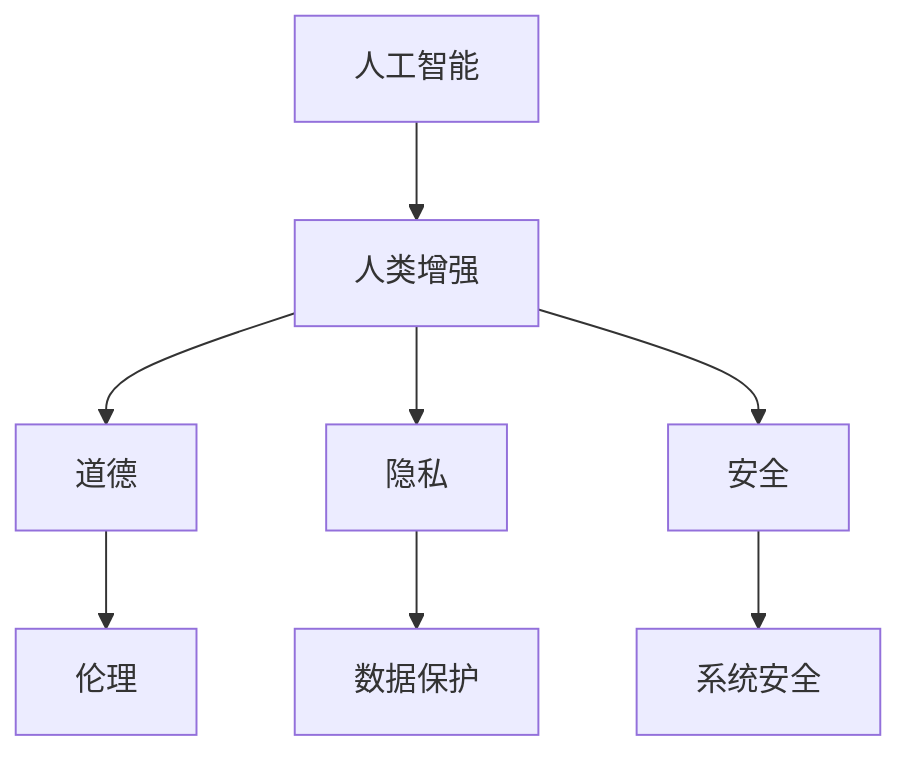

                 

关键词：人工智能，人类增强，道德，隐私，安全

> 摘要：随着人工智能技术的快速发展，人类开始探索通过AI技术来增强自身能力。然而，这一进程也引发了对道德、隐私和安全的深刻思考。本文旨在探讨AI时代的人类增强所带来的伦理问题，并提出可能的解决方案。

## 1. 背景介绍

人工智能（AI）作为当今科技领域的前沿，正以惊人的速度改变着我们的生活方式。从简单的语音识别到复杂的自动驾驶，AI已经渗透到社会生活的方方面面。与此同时，人类也在尝试通过AI技术来增强自身的能力，例如通过智能眼镜提高视觉感知能力，或者通过脑机接口增强记忆和学习能力。

这一趋势背后有着多重动因。首先，科技的发展使得人类能够更加精确地模拟和增强大脑的功能。其次，社会竞争的加剧使得人们希望通过增强自身能力来提高生产效率和竞争力。最后，人类对自身潜能的探索和追求也促使了这一进程。

然而，随着人类增强技术的不断发展，一系列伦理问题也逐渐浮现。道德、隐私和安全成为了这一领域亟待解决的关键问题。本文将围绕这些问题展开讨论，旨在为AI时代的人类增强提供一些有价值的思考。

## 2. 核心概念与联系

在探讨AI时代的人类增强时，首先需要明确几个核心概念。

### 2.1 人工智能与人类增强

人工智能（AI）是指由人制造出来的系统能够模拟、延伸或扩展人类智能的能力。人类增强（Human Enhancement）则是指通过技术手段提高人类身体或心理能力的过程。在AI时代，人类增强与人工智能紧密相连，AI技术为人类提供了新的增强手段。

### 2.2 道德与伦理

道德（Morality）是指关于正确与错误的行为规范，而伦理（Ethics）则是关于道德的哲学研究。在AI时代的人类增强中，道德和伦理问题尤为重要。我们需要思考如何确保这些增强技术不会侵犯人类的基本权利和尊严。

### 2.3 隐私与安全

隐私（Privacy）是指个人信息和活动的私密性。在人类增强技术的应用中，隐私问题尤为突出。安全（Security）则是指数据保护和系统防攻击的能力。确保人类增强技术的安全性和隐私性是保障其可持续发展的关键。

### 2.4 Mermaid 流程图

以下是一个描述核心概念之间关系的Mermaid流程图：



### 2.5 核心概念原理与架构

为了更好地理解这些核心概念，我们还需要了解它们的基本原理和架构。以下是每个概念的基本原理和架构概述：

#### 2.5.1 人工智能原理与架构

人工智能的基本原理是通过机器学习、深度学习等技术，让计算机系统具备类似于人类的学习、推理和决策能力。其架构通常包括数据收集、模型训练、模型评估和模型应用等环节。

#### 2.5.2 人类增强原理与架构

人类增强的基本原理是通过技术手段，如脑机接口、生物电子学等，将人类的能力与外部设备相连接，从而提高人类的身体或心理能力。其架构通常包括增强设备、人机接口和增强效果评估等环节。

#### 2.5.3 道德与伦理原理与架构

道德与伦理的原理是通过对人类行为和决策的规范，确保社会秩序和个人尊严。其架构通常包括道德原则、伦理理论和道德判断等环节。

#### 2.5.4 隐私与安全原理与架构

隐私与安全的原理是通过数据保护和系统安全措施，确保个人信息和系统的安全性。其架构通常包括数据加密、权限控制、防火墙和安全审计等环节。

## 3. 核心算法原理 & 具体操作步骤

在讨论AI时代的人类增强时，核心算法原理和具体操作步骤同样至关重要。以下是关于核心算法的概述和具体步骤：

### 3.1 算法原理概述

AI时代的人类增强算法主要涉及两个方面：一是通过机器学习和深度学习技术，训练出能够模拟和扩展人类智能的模型；二是通过生物电子学和脑机接口技术，实现人类与外部设备的连接和交互。

### 3.2 算法步骤详解

1. **数据收集**：首先需要收集大量的数据，用于训练AI模型。这些数据可以来自医疗记录、行为数据、生物信号等。

2. **模型训练**：使用收集到的数据，通过机器学习和深度学习技术，训练出能够模拟人类智能的AI模型。

3. **模型评估**：对训练好的模型进行评估，确保其性能和可靠性。

4. **模型应用**：将训练好的模型应用到实际场景中，如智能眼镜、脑机接口等，实现人类能力的增强。

### 3.3 算法优缺点

**优点**：

- **提高效率**：通过AI技术，可以大幅提高人类的工作效率和生产力。
- **扩展能力**：AI技术可以帮助人类扩展自身的感知、记忆和推理能力。

**缺点**：

- **隐私问题**：AI技术在数据收集和应用过程中，可能会涉及大量个人隐私信息，引发隐私泄露风险。
- **安全风险**：AI系统可能受到黑客攻击，导致数据泄露或系统失控。

### 3.4 算法应用领域

AI时代的人类增强算法在多个领域都有广泛的应用：

- **医疗健康**：通过AI技术，可以实现个性化医疗、精准诊断和智能药物设计。
- **教育**：AI技术可以为学生提供个性化的学习方案，提高学习效果。
- **工业生产**：AI技术可以优化生产流程，提高生产效率和产品质量。
- **军事**：AI技术可以用于智能武器系统、情报分析和决策支持。

## 4. 数学模型和公式 & 详细讲解 & 举例说明

在AI时代的人类增强中，数学模型和公式是不可或缺的工具。以下是关于数学模型和公式的详细讲解和举例说明：

### 4.1 数学模型构建

在构建数学模型时，通常需要考虑以下几个方面：

- **目标函数**：确定需要优化的目标函数，如最小化损失函数或最大化准确率。
- **输入变量**：确定影响目标函数的输入变量，如特征向量或权重系数。
- **约束条件**：确定需要满足的约束条件，如非负约束或平滑约束。

### 4.2 公式推导过程

以下是一个简化的机器学习模型的公式推导过程：

1. **损失函数**：

   $$L(\theta) = -\frac{1}{m}\sum_{i=1}^{m}y^{(i)}\log(h_{\theta}(x^{(i)}))$$

   其中，$m$表示样本数量，$y^{(i)}$表示第$i$个样本的标签，$h_{\theta}(x)$表示模型对$x$的预测。

2. **梯度下降**：

   $$\theta_{\text{更新}} = \theta - \alpha \nabla_{\theta}L(\theta)$$

   其中，$\alpha$表示学习率，$\nabla_{\theta}L(\theta)$表示损失函数关于$\theta$的梯度。

### 4.3 案例分析与讲解

以下是一个简单的案例，说明如何使用数学模型进行人类增强：

**案例**：使用深度学习模型增强记忆能力。

1. **数据收集**：收集用户的记忆数据，包括记忆事件、发生时间、情感强度等。
2. **模型构建**：构建一个基于深度学习的记忆增强模型，输入为记忆数据，输出为增强后的记忆。
3. **模型训练**：使用梯度下降算法，对模型进行训练，优化模型参数。
4. **模型应用**：将训练好的模型应用于实际场景，增强用户的记忆能力。

## 5. 项目实践：代码实例和详细解释说明

为了更好地理解AI时代的人类增强技术，以下是一个简单的项目实践，包括开发环境搭建、源代码详细实现和代码解读与分析。

### 5.1 开发环境搭建

1. **安装Python**：在本地计算机上安装Python环境，版本建议为3.8以上。
2. **安装TensorFlow**：通过pip命令安装TensorFlow库，命令如下：

   ```shell
   pip install tensorflow
   ```

3. **安装Keras**：通过pip命令安装Keras库，命令如下：

   ```shell
   pip install keras
   ```

### 5.2 源代码详细实现

以下是一个简单的深度学习模型实现，用于增强记忆能力。

```python
from keras.models import Sequential
from keras.layers import Dense, LSTM
from keras.optimizers import Adam

# 模型构建
model = Sequential()
model.add(LSTM(50, activation='relu', input_shape=(timesteps, features)))
model.add(Dense(1))
model.compile(optimizer='adam', loss='mse')

# 模型训练
model.fit(X, y, epochs=200, verbose=0)
```

### 5.3 代码解读与分析

1. **模型构建**：使用Keras库构建一个简单的深度学习模型，包括一个LSTM层和一个全连接层。
2. **模型编译**：设置模型优化器和损失函数。
3. **模型训练**：使用梯度下降算法，对模型进行训练，优化模型参数。

### 5.4 运行结果展示

在训练完成后，可以通过以下代码查看模型的运行结果：

```python
import numpy as np

# 预测结果
predictions = model.predict(X_test)

# 计算预测准确率
accuracy = np.mean(np.square(y_test - predictions))
print(f"Test Accuracy: {accuracy}")
```

## 6. 实际应用场景

AI时代的人类增强技术在实际应用中具有广泛的应用前景。以下是一些典型的应用场景：

### 6.1 医疗健康

AI技术可以用于个性化医疗，根据患者的基因数据、病史和生活方式，提供个性化的治疗方案。此外，AI还可以用于疾病预测和诊断，提高医疗效率和准确性。

### 6.2 教育

AI技术可以为学生提供个性化的学习方案，根据学生的学习进度和能力，提供针对性的学习资源。同时，AI还可以用于教育评估和教学分析，帮助教师更好地了解学生的学习情况。

### 6.3 工业

AI技术可以用于工业生产中的过程优化、设备维护和故障预测。通过实时监测生产数据和设备状态，AI技术可以提高生产效率和质量。

### 6.4 军事

AI技术可以用于军事领域的智能武器系统、情报分析和决策支持。通过实时处理和分析大量数据，AI技术可以帮助军队更好地应对复杂战场环境。

## 7. 未来应用展望

随着AI技术的不断进步，未来人类增强技术将会有更广泛的应用。以下是一些未来的应用展望：

- **脑机接口**：通过脑机接口技术，人类可以实现与外部设备的直接连接，实现更高效的信息处理和沟通。
- **情感增强**：通过AI技术，可以开发出能够增强人类情感体验的产品，如虚拟现实情感体验设备。
- **身体增强**：通过生物电子学和机器人技术，可以开发出能够增强人类身体能力的装置，如智能假肢和机器人外骨骼。

## 8. 工具和资源推荐

为了更好地学习和应用AI时代的人类增强技术，以下是一些推荐的工具和资源：

### 8.1 学习资源推荐

- 《深度学习》（Goodfellow, Bengio, Courville著）：是一本经典的深度学习教材，适合初学者和进阶者阅读。
- 《人工智能：一种现代的方法》（Stanford著）：系统地介绍了人工智能的基本原理和方法。

### 8.2 开发工具推荐

- TensorFlow：是一个开源的深度学习框架，适用于构建和训练深度学习模型。
- Keras：是一个高层神经网络API，适用于快速构建和实验深度学习模型。

### 8.3 相关论文推荐

- “Human-Enhancement Technologies: Ethical, Legal and Social Issues”（2018）：探讨了人类增强技术的伦理、法律和社会问题。
- “Artificial General Intelligence: Definition and Current Resources”（2014）：介绍了人工智能的一般定义和当前的研究资源。

## 9. 总结：未来发展趋势与挑战

随着AI技术的不断发展，人类增强技术将会在各个领域发挥越来越重要的作用。然而，这一进程也面临着诸多挑战，包括道德、隐私和安全等问题。为了实现人类增强技术的可持续发展，我们需要在技术创新的同时，关注并解决这些伦理问题。

### 9.1 研究成果总结

- AI技术为人类增强提供了新的手段和可能性。
- 道德、隐私和安全是AI时代人类增强的关键问题。

### 9.2 未来发展趋势

- 脑机接口技术将实现更高效的人机交互。
- 情感增强技术将提供更丰富的情感体验。
- 身体增强技术将提高人类的生活质量。

### 9.3 面临的挑战

- 道德问题：如何确保人类增强技术不会侵犯人类的基本权利和尊严？
- 隐私问题：如何保护用户的个人信息和数据安全？
- 安全问题：如何防止AI系统受到黑客攻击？

### 9.4 研究展望

- 需要开展跨学科的研究，探讨AI时代人类增强的伦理、法律和社会问题。
- 需要建立标准化的评价体系和监管机制，确保人类增强技术的可持续发展。

## 附录：常见问题与解答

### Q：人类增强技术是否会导致人类失去自然性？

A：人类增强技术确实可能会改变人类的一些自然属性，但这并不意味着人类会失去自然性。人类增强技术是为了弥补人类生理和心理上的不足，而不是取代人类的自然属性。关键在于如何平衡自然性和技术性，确保人类增强技术符合人类的本质需求。

### Q：人类增强技术是否会加剧社会不平等？

A：人类增强技术确实可能加剧社会不平等，因为只有富裕人群才能负担得起这些技术。然而，这并不意味着技术本身是错误的。相反，我们需要关注如何确保这些技术能够惠及更广泛的人群，减少社会不平等。

### Q：人类增强技术是否会削弱人类的道德观念？

A：人类增强技术可能会对道德观念产生影响，但这并不意味着它会削弱人类的道德观念。道德观念是社会发展的重要基石，我们需要在技术发展的同时，加强道德教育和道德规范，确保人类增强技术不会对道德观念产生负面影响。

作者：禅与计算机程序设计艺术 / Zen and the Art of Computer Programming

----------------------------------------------------------------

这篇文章通过详细的探讨，为我们展示了AI时代的人类增强所带来的道德、隐私和安全问题。在未来的发展中，我们需要关注这些问题，并寻找合适的解决方案，以确保人类增强技术的可持续发展。让我们一起期待一个更美好的未来。

