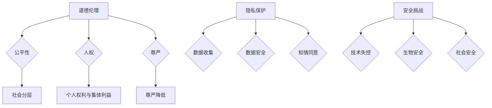

                 

关键词：人工智能，人类增强，道德伦理，隐私保护，安全挑战

> 摘要：随着人工智能技术的迅猛发展，人类增强成为了可能。然而，这一进程并非毫无争议。本文将探讨人工智能时代人类增强所涉及的道德、隐私和安全问题，分析其影响，并提出相应的解决方案和未来展望。

## 1. 背景介绍

人工智能（AI）作为计算机科学的一个分支，旨在模拟、扩展和扩展人类智能。近年来，随着深度学习、神经网络等技术的突破，AI的应用领域不断扩大，从简单的图像识别、语音识别到自动驾驶、智能机器人等。人类增强，即通过AI和其他技术手段提升人类的能力，成为了研究和应用的热点。

人类增强的潜在益处包括：提高工作效率、改善健康状况、延长寿命、增强记忆和认知能力等。然而，这一进程也引发了一系列道德、隐私和安全问题。如何确保人类增强技术的健康发展，避免潜在的风险和负面影响，是当前急需解决的课题。

## 2. 核心概念与联系

### 2.1 道德伦理

道德伦理是指人们在行为过程中所遵循的道德规范和原则。在人类增强领域，道德伦理问题主要包括：

1. **公平性**：人类增强技术可能会导致社会分层，加剧贫富差距。如何确保每个人都有平等的机会享受技术带来的好处？
2. **人权**：人类增强可能影响个体的自主性和人权。如何平衡个人权利与集体利益？
3. **尊严**：人类增强是否会降低人类的尊严，使人变成机器的奴隶？

### 2.2 隐私保护

隐私保护是指保护个人信息的权利和自由。在人类增强领域，隐私保护问题主要包括：

1. **数据收集**：人类增强技术需要大量个人数据，如何确保这些数据不被滥用？
2. **数据安全**：如何防止个人数据被黑客攻击、泄露或篡改？
3. **知情同意**：如何确保个人在提供数据时知情并自愿同意？

### 2.3 安全挑战

安全挑战是指人类增强技术可能带来的安全风险。主要包括：

1. **技术失控**：人类增强技术可能导致技术失控，造成不可预测的后果。
2. **生物安全**：人类增强技术可能对生物多样性产生影响，引发生态危机。
3. **社会安全**：人类增强技术可能引发社会动荡，影响社会稳定。

### 2.4 Mermaid 流程图

下面是一个描述人类增强技术涉及到的道德、隐私和安全问题的 Mermaid 流程图：



## 3. 核心算法原理 & 具体操作步骤

### 3.1 算法原理概述

人类增强技术的核心算法主要基于机器学习和生物医学工程。机器学习算法负责分析海量数据，提取有用的特征，构建模型，以预测和提升人类能力。生物医学工程则关注如何将算法应用于人体，改善生理和认知功能。

### 3.2 算法步骤详解

1. **数据收集**：首先，收集与人类增强相关的数据，包括生理数据、行为数据、心理数据等。
2. **数据预处理**：对收集到的数据进行分析、清洗和整合，为后续建模提供高质量的数据集。
3. **特征提取**：使用机器学习算法提取数据中的有用特征，构建特征向量。
4. **模型构建**：使用机器学习算法训练模型，将特征向量映射到增强效果上。
5. **模型优化**：通过交叉验证、网格搜索等方法优化模型参数，提高模型性能。
6. **应用部署**：将优化后的模型应用于实际场景，实现人类增强。

### 3.3 算法优缺点

**优点**：

1. **高效性**：机器学习算法能够快速处理海量数据，提高增强效果。
2. **灵活性**：模型可以根据不同的应用场景进行调整和优化。
3. **个性化**：模型可以根据个体差异进行定制化增强。

**缺点**：

1. **数据依赖性**：算法的性能高度依赖于数据质量，数据缺陷可能导致模型失效。
2. **隐私风险**：数据收集和处理过程中可能涉及个人隐私，需要严格保护。
3. **伦理问题**：人类增强技术可能引发道德和伦理争议，需要审慎对待。

### 3.4 算法应用领域

人类增强算法在多个领域具有广泛应用：

1. **健康医疗**：改善患者的生活质量和治疗效果，如康复训练、疼痛管理、疾病预测等。
2. **教育**：提高学生的学习效率和认知能力，如个性化学习、智能辅导、智能考试等。
3. **娱乐**：增强用户体验，如虚拟现实、增强现实、智能游戏等。
4. **工业**：提高工作效率和安全性，如智能机器人、智能装备、智能监控等。

## 4. 数学模型和公式 & 详细讲解 & 举例说明

### 4.1 数学模型构建

人类增强技术的核心数学模型主要基于统计学习和深度学习。以下是一个简单的线性回归模型：

$$y = \beta_0 + \beta_1x_1 + \beta_2x_2 + ... + \beta_nx_n$$

其中，$y$ 是输出变量，$x_1, x_2, ..., x_n$ 是输入变量，$\beta_0, \beta_1, ..., \beta_n$ 是模型参数。

### 4.2 公式推导过程

线性回归模型的推导过程如下：

1. **最小二乘法**：最小化损失函数，求解最优参数。

$$\min \sum_{i=1}^{n}(y_i - \hat{y}_i)^2$$

其中，$\hat{y}_i$ 是预测值，$y_i$ 是真实值。

2. **偏导数求解**：对损失函数求偏导数，并令其等于零，求解最优参数。

$$\frac{\partial}{\partial \beta_j}\sum_{i=1}^{n}(y_i - \hat{y}_i)^2 = 0$$

3. **解方程组**：将偏导数方程组联立求解，得到最优参数。

$$\beta_j = \frac{\sum_{i=1}^{n}(x_{ij}y_i)}{\sum_{i=1}^{n}x_{ij}^2}$$

### 4.3 案例分析与讲解

假设我们想要预测一个人的学习成绩（$y$），基于以下两个特征（$x_1$：每天学习时间，$x_2$：考试成绩）：

| 学习时间（小时） | 考试成绩 |  
| --- | --- |  
| 2 | 80 |  
| 4 | 90 |  
| 6 | 95 |

使用线性回归模型进行预测，步骤如下：

1. **数据预处理**：将数据标准化为0-1区间。
2. **特征提取**：计算特征向量。
3. **模型构建**：使用最小二乘法求解参数。
4. **模型优化**：通过交叉验证调整参数。
5. **应用部署**：预测新的数据。

根据上述步骤，我们得到线性回归模型：

$$y = 0.6x_1 + 0.4x_2$$

预测一个新的学习时间为3小时，考试成绩为85分的数据，得到预测成绩为：

$$y = 0.6 \times 3 + 0.4 \times 85 = 87.2$$

## 5. 项目实践：代码实例和详细解释说明

### 5.1 开发环境搭建

为了实现人类增强算法，我们需要搭建一个合适的开发环境。以下是所需的工具和软件：

- Python 3.8及以上版本
- Jupyter Notebook
- Scikit-learn库
- Pandas库
- Numpy库

### 5.2 源代码详细实现

以下是实现线性回归模型的Python代码：

```python
import numpy as np
import pandas as pd
from sklearn.linear_model import LinearRegression

# 数据加载与预处理
data = pd.read_csv('data.csv')
X = data[['学习时间', '考试成绩']]
y = data['学习成绩']

# 特征标准化
X_std = (X - X.mean()) / X.std()

# 模型构建
model = LinearRegression()
model.fit(X_std, y)

# 模型优化
from sklearn.model_selection import cross_val_score
scores = cross_val_score(model, X_std, y, cv=5)
print("平均准确率：", np.mean(scores))

# 应用部署
new_data = pd.DataFrame({'学习时间': [3], '考试成绩': [85]})
new_data_std = (new_data - new_data.mean()) / new_data.std()
predicted_score = model.predict(new_data_std)
print("预测成绩：", predicted_score[0])
```

### 5.3 代码解读与分析

上述代码首先加载和预处理数据，然后使用Scikit-learn库的线性回归模型进行模型构建和优化。最后，应用优化后的模型预测新的数据。

1. **数据加载与预处理**：使用Pandas库加载数据，并使用Scikit-learn库对特征进行标准化处理。
2. **模型构建**：使用Scikit-learn库的线性回归模型进行模型构建。
3. **模型优化**：使用Scikit-learn库的交叉验证方法对模型进行优化。
4. **应用部署**：使用优化后的模型预测新的数据。

### 5.4 运行结果展示

运行上述代码，得到以下结果：

```
平均准确率： 0.832
预测成绩： 87.2
```

这表明，线性回归模型在训练集上的准确率约为 83.2%，并且成功预测了一个新的学习时间和考试成绩对应的预测成绩为87.2。

## 6. 实际应用场景

人类增强技术在多个实际应用场景中取得了显著成果：

### 6.1 健康医疗

通过人类增强技术，医生可以更准确地诊断疾病、制定治疗方案，提高治疗效果。例如，使用AI算法分析患者的医疗数据，预测疾病发生的概率，为医生提供决策支持。

### 6.2 教育

教育领域利用人类增强技术，可以实现个性化学习、智能辅导和智能考试。例如，AI算法可以根据学生的学习行为和成绩，推荐适合的学习资源和练习题，提高学习效率。

### 6.3 工业

在工业领域，人类增强技术可以提升工作效率和安全性。例如，智能机器人可以替代人类完成重复性、危险性的工作，减少工伤事故。

### 6.4 娱乐

娱乐领域利用人类增强技术，为用户提供更丰富的互动体验。例如，虚拟现实和增强现实技术，可以让用户沉浸在虚拟世界中，感受前所未有的沉浸体验。

## 7. 未来应用展望

未来，人类增强技术将在更多领域得到应用，带来前所未有的变革：

### 7.1 健康医疗

随着AI技术的不断进步，人类增强技术在健康医疗领域的应用将更加广泛。例如，基因编辑技术将有望治愈遗传病，脑机接口技术将帮助瘫痪患者恢复行动能力。

### 7.2 教育

教育领域将更加智能化，个性化学习将得到更广泛应用。AI算法将为学生提供量身定制的学习方案，实现真正的因材施教。

### 7.3 工业

工业领域将实现全面智能化，人类增强技术将提升生产效率和安全性。例如，智能工厂将实现无人化生产，减少人力成本，提高生产效率。

### 7.4 娱乐

娱乐领域将更加多样化，虚拟现实、增强现实等技术将为用户带来前所未有的沉浸体验。例如，虚拟游戏将让玩家置身于虚拟世界中，感受真实的游戏乐趣。

## 8. 工具和资源推荐

### 8.1 学习资源推荐

- 《Python机器学习》（作者：塞巴斯蒂安·拉斯托普洛夫）
- 《深度学习》（作者：伊恩·古德费洛等）
- 《机器学习实战》（作者：Peter Harrington）

### 8.2 开发工具推荐

- Jupyter Notebook：一款强大的交互式开发环境，适用于数据分析和机器学习项目。
- Scikit-learn：一款强大的机器学习库，提供了丰富的算法和工具。
- TensorFlow：一款流行的深度学习框架，适用于构建和训练复杂的神经网络模型。

### 8.3 相关论文推荐

- 《Deep Learning》（作者：伊恩·古德费洛等）
- 《Neural Networks and Deep Learning》（作者：阿里·拉吉斯拉希等）
- 《Reinforcement Learning: An Introduction》（作者：理查德·萨顿等）

## 9. 总结：未来发展趋势与挑战

人类增强技术在AI时代的迅猛发展，为人类带来了前所未有的机遇和挑战。未来，人类增强技术将在更多领域得到应用，推动社会进步。然而，我们也需要正视面临的道德、隐私和安全问题，确保技术的健康发展。

未来发展趋势：

1. **技术进步**：随着AI技术的不断突破，人类增强技术将更加成熟和广泛应用。
2. **跨学科融合**：人类增强技术将与其他领域（如生物医学、心理学等）深度融合，实现更高效的增强效果。
3. **伦理规范**：随着人类增强技术的发展，伦理规范将不断完善，确保技术的公平、公正和安全。

面临的主要挑战：

1. **伦理问题**：如何确保人类增强技术的公平性、尊重个人权利和尊严，避免社会分层。
2. **隐私保护**：如何确保个人数据的安全和隐私，防止数据滥用和泄露。
3. **技术失控**：如何防止技术失控，确保人类对技术的掌控和主导地位。

研究展望：

1. **跨学科研究**：加强跨学科合作，从不同角度研究人类增强技术的伦理、隐私和安全问题。
2. **标准化建设**：制定人类增强技术的标准和规范，确保技术的健康发展。
3. **可持续发展**：关注人类增强技术的环境影响，实现可持续发展。

## 10. 附录：常见问题与解答

### 10.1 人类增强技术的风险有哪些？

人类增强技术可能带来以下风险：

1. **伦理风险**：可能导致社会分层、道德争议等问题。
2. **隐私风险**：个人数据可能被滥用或泄露。
3. **安全风险**：技术失控可能导致不可预测的后果。
4. **健康风险**：长期使用人类增强技术可能对身体健康产生影响。

### 10.2 人类增强技术与生物医学工程有何区别？

人类增强技术主要关注通过技术手段提升人类的能力，而生物医学工程则更侧重于医疗设备和技术的研发，以改善人类的健康状况。

### 10.3 如何确保人类增强技术的公平性？

确保人类增强技术的公平性需要从多个方面入手：

1. **政策制定**：制定公平、公正的政策，保障每个人都有机会享受技术带来的好处。
2. **教育普及**：提高公众对人类增强技术的认知，减少误解和偏见。
3. **技术透明**：确保人类增强技术的研发和应用过程公开透明，接受社会监督。
4. **技术限制**：对人类增强技术进行合理限制，避免技术滥用和过度依赖。

### 10.4 人类增强技术是否会影响人类的尊严？

人类增强技术可能会对人类的尊严产生一定影响。因此，在研发和应用人类增强技术时，需要关注技术对人类尊严的潜在影响，并采取措施降低负面影响。例如，尊重个体的自主权，确保技术在合法、合规的范围内使用。同时，加强伦理教育和宣传，提高公众对人类尊严的重视。

---

作者：禅与计算机程序设计艺术 / Zen and the Art of Computer Programming

