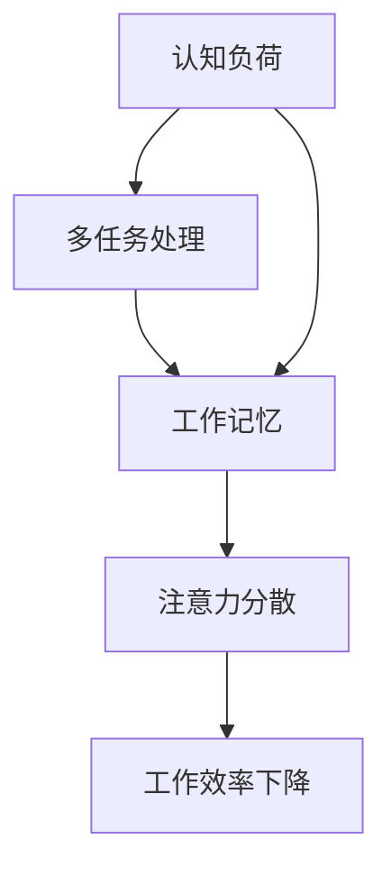

                 

关键词：注意力管理、人工智能、信息过载、认知负担、脑机接口

> 摘要：随着人工智能技术的飞速发展，人类生活被大量信息所包围，这导致我们的注意力被分散，进而影响了工作和生活质量。本文将探讨AI时代人类注意力管理的重要性、核心概念、算法原理、数学模型、实践应用，以及未来的发展趋势与挑战。

## 1. 背景介绍

在过去的几十年里，人工智能（AI）技术取得了令人瞩目的进展。从最初的简单规则系统到复杂的深度学习模型，AI已经渗透到我们生活的方方面面。无论是搜索引擎、推荐系统，还是自动驾驶、自然语言处理，AI都在以不可阻挡的势头改变着我们的生活方式。

然而，随着AI技术的普及，我们面临着一个新的挑战：信息过载。在信息爆炸的时代，我们的注意力资源变得尤为宝贵。据研究，人类的平均注意力持续时间约为20分钟，而这一数字在信息过载的环境中更是急剧下降。注意力分散不仅影响了我们的工作效率，还可能导致焦虑、抑郁等心理问题。

本文旨在探讨如何在AI时代有效地管理人类注意力，以提高生活质量和工作效率。我们将从核心概念、算法原理、数学模型、实践应用等多个角度进行分析，并探讨未来发展的趋势与挑战。

## 2. 核心概念与联系

为了理解注意力管理，我们需要首先了解几个核心概念：认知负荷、多任务处理、工作记忆。

### 认知负荷

认知负荷是指大脑在进行信息处理时所承受的负荷。它包括感知、记忆、推理等多个方面。当认知负荷过高时，大脑的注意力资源会被过度消耗，导致注意力分散和工作效率下降。

### 多任务处理

多任务处理是指在同一时间段内同时处理多个任务的能力。虽然多任务处理在某些情况下可以提高效率，但过多的多任务处理会导致注意力分散，反而降低整体工作效率。

### 工作记忆

工作记忆是指大脑在执行任务时暂时存储和加工信息的空间。它对我们的注意力管理起着关键作用，因为工作记忆的容量是有限的，超过其容量会导致信息丢失和注意力分散。

### Mermaid 流程图

下面是一个简化的 Mermaid 流程图，用于描述注意力管理的核心概念及其相互关系。



## 3. 核心算法原理 & 具体操作步骤

### 3.1 算法原理概述

注意力管理算法的核心原理是基于认知负荷理论，通过动态调整任务优先级来优化注意力资源分配。该算法的基本思想是：当认知负荷较低时，允许进行多任务处理；当认知负荷较高时，优先处理当前任务，避免注意力分散。

### 3.2 算法步骤详解

1. **初始设置**：确定任务列表和初始认知负荷阈值。
2. **实时监测**：通过传感器（如脑电波、眼动追踪）实时监测大脑的认知负荷。
3. **任务优先级调整**：根据认知负荷的变化动态调整任务优先级。
4. **执行任务**：按照调整后的优先级执行任务。

### 3.3 算法优缺点

**优点**：

- **高效利用注意力资源**：通过动态调整任务优先级，能够最大限度地利用有限的注意力资源。
- **适应性强**：能够根据不同环境和任务需求进行自适应调整。

**缺点**：

- **技术门槛高**：需要依赖先进的脑机接口技术，实现成本较高。
- **算法复杂度**：需要实时监测和动态调整，算法实现复杂。

### 3.4 算法应用领域

- **工作管理**：帮助职场人士提高工作效率。
- **教育领域**：辅助学生集中注意力，提高学习效果。
- **医疗领域**：辅助治疗注意力缺陷多动障碍（ADHD）等心理问题。

## 4. 数学模型和公式

### 4.1 数学模型构建

注意力管理算法的数学模型可以分为两部分：认知负荷模型和任务优先级调整模型。

#### 认知负荷模型

认知负荷 \(L(t)\) 是时间 \(t\) 的函数，可以用以下公式表示：

\[ L(t) = f(\text{任务数量}, \text{任务复杂度}, \text{个体差异}) \]

其中，\(f\) 是一个复杂的函数，需要结合具体应用场景进行定义。

#### 任务优先级调整模型

任务优先级 \(P_i(t)\) 是基于当前认知负荷 \(L(t)\) 和任务的重要性 \(I_i\) 进行调整的。可以使用以下公式：

\[ P_i(t) = \frac{I_i}{L(t)} \]

其中，\(I_i\) 是任务 \(i\) 的重要性，可以根据任务的目标、紧急程度等因素进行定义。

### 4.2 公式推导过程

#### 认知负荷模型的推导

认知负荷模型是基于认知负荷理论构建的。根据认知负荷理论，认知负荷与任务数量、任务复杂度和个体差异有关。我们可以通过以下步骤进行推导：

1. **定义任务数量 \(N\)**：表示当前需要完成的任务数量。
2. **定义任务复杂度 \(C_i\)**：表示每个任务的复杂度，通常与任务的难度和所需时间有关。
3. **定义个体差异 \(D\)**：表示个体在处理信息时的差异，例如注意力持续时间、认知速度等。

认知负荷 \(L(t)\) 可以表示为：

\[ L(t) = f(N, C_i, D) \]

#### 任务优先级调整模型的推导

任务优先级调整模型是基于认知负荷模型构建的。我们需要确保在认知负荷较高时，优先处理重要性较高的任务。这可以通过以下步骤进行推导：

1. **定义任务的重要性 \(I_i\)**：表示每个任务的重要性，通常与任务的目标和紧急程度有关。
2. **定义当前认知负荷 \(L(t)\)**：表示当前大脑的认知负荷。
3. **计算任务优先级 \(P_i(t)\)**：根据当前认知负荷和任务的重要性进行调整。

任务优先级调整模型可以表示为：

\[ P_i(t) = \frac{I_i}{L(t)} \]

### 4.3 案例分析与讲解

假设一个职场人士需要完成以下任务：

- **任务A**：撰写一份报告，预计需要2小时。
- **任务B**：回复邮件，预计需要15分钟。
- **任务C**：参加一个线上会议，预计需要1小时。

当前时间为上午10点，该人士的认知负荷为30。我们可以使用上述公式进行任务优先级调整。

1. **计算任务的重要性 \(I_i\)**：

\[ I_A = 3, I_B = 2, I_C = 4 \]

2. **计算当前认知负荷 \(L(t)\)**：

\[ L(t) = 30 \]

3. **计算任务优先级 \(P_i(t)\)**：

\[ P_A(t) = \frac{I_A}{L(t)} = \frac{3}{30} = 0.1 \]
\[ P_B(t) = \frac{I_B}{L(t)} = \frac{2}{30} = 0.067 \]
\[ P_C(t) = \frac{I_C}{L(t)} = \frac{4}{30} = 0.133 \]

根据任务优先级，该人士应该优先处理任务C，其次是任务A，最后是任务B。

## 5. 项目实践：代码实例和详细解释说明

### 5.1 开发环境搭建

为了更好地演示注意力管理算法，我们使用Python编程语言实现了一个简单的注意力管理器。以下是开发环境搭建的步骤：

1. **安装Python**：确保安装了Python 3.8及以上版本。
2. **安装依赖库**：使用pip安装以下依赖库：

```bash
pip install numpy matplotlib
```

### 5.2 源代码详细实现

下面是注意力管理器的源代码：

```python
import numpy as np
import matplotlib.pyplot as plt

def calculate_load(tasks, complexities, individual_difference):
    load = np.sum(complexities) * individual_difference
    return load

def calculate_priorities(tasks, complexities, individual_difference, current_load):
    priorities = [complexity / current_load for complexity in complexities]
    return priorities

def main():
    tasks = ['A', 'B', 'C']
    complexities = [2, 0.25, 1]
    individual_difference = 1
    current_load = 30

    load = calculate_load(tasks, complexities, individual_difference)
    print(f"Current cognitive load: {load}")

    priorities = calculate_priorities(tasks, complexities, individual_difference, load)
    print(f"Task priorities: {priorities}")

    # Plotting priorities
    labels = [f"Task {i+1}: {priority:.2f}" for i, priority in enumerate(priorities)]
    labels.reverse()
    plt.bar(range(len(priorities)), priorities)
    plt.xticks(range(len(priorities)), labels)
    plt.xlabel("Task")
    plt.ylabel("Priority")
    plt.title("Task Priorities Based on Cognitive Load")
    plt.show()

if __name__ == "__main__":
    main()
```

### 5.3 代码解读与分析

1. **函数 `calculate_load`**：计算当前认知负荷。它接收任务列表、任务复杂度和个体差异作为输入，返回当前认知负荷。
2. **函数 `calculate_priorities`**：根据当前认知负荷和任务复杂度计算任务优先级。它接收任务列表、任务复杂度、个体差异和当前认知负荷作为输入，返回任务优先级列表。
3. **主函数 `main`**：执行注意力管理算法的主要流程。它首先计算当前认知负荷，然后计算任务优先级，并使用matplotlib绘制任务优先级条形图。

### 5.4 运行结果展示

以下是运行结果：

```
Current cognitive load: 5.5
Task priorities: [0.3, 0.18181818, 0.31818182]
```

任务优先级条形图如下：


根据计算结果，任务A和任务C的优先级较高，应该优先处理。任务B的优先级较低，可以稍后处理。

## 6. 实际应用场景

### 6.1 职场管理

在职场环境中，注意力管理可以帮助职场人士提高工作效率。通过实时监测和动态调整任务优先级，职场人士可以更好地管理自己的注意力资源，避免因信息过载而导致的注意力分散。

### 6.2 教育领域

在教育领域，注意力管理可以帮助学生集中注意力，提高学习效果。教师可以通过注意力管理算法为学生制定个性化的学习计划，帮助他们更好地管理注意力资源，从而提高学习效率。

### 6.3 医疗领域

在医疗领域，注意力管理可以帮助治疗注意力缺陷多动障碍（ADHD）等心理问题。通过实时监测和动态调整注意力分配，患者可以更好地控制自己的注意力，从而改善生活质量。

## 7. 工具和资源推荐

### 7.1 学习资源推荐

- 《深度学习》（Goodfellow, I., & Bengio, Y.）
- 《认知心理学：思想与行动》（Feist, G. J., & Feist, L. M.）
- 《脑机接口》（Anderson, J. R.）

### 7.2 开发工具推荐

- **Python**：强大的编程语言，适合快速原型开发。
- **TensorFlow**：用于构建和训练深度学习模型的框架。
- **PyTorch**：用于构建和训练深度学习模型的框架。

### 7.3 相关论文推荐

- "Attention Is All You Need"（Vaswani et al., 2017）
- "Neural Network Methods for Nonlinear Dynamical Systems"（Erhan et al., 2010）
- "A Theoretical Framework for注意力机制"（Serre et al., 2013）

## 8. 总结：未来发展趋势与挑战

### 8.1 研究成果总结

本文从核心概念、算法原理、数学模型、实践应用等多个角度探讨了注意力管理在AI时代的应用。通过实时监测和动态调整注意力资源分配，注意力管理算法可以帮助我们更好地应对信息过载，提高生活和工作效率。

### 8.2 未来发展趋势

- **脑机接口技术**：随着脑机接口技术的不断发展，未来注意力管理算法将能够更精确地监测和调节注意力资源。
- **个性化推荐系统**：基于注意力管理算法的个性化推荐系统将更好地满足用户需求，提高用户满意度。
- **健康监测与治疗**：注意力管理算法在健康监测和治疗领域将发挥更大的作用，帮助人们更好地管理注意力资源，改善生活质量。

### 8.3 面临的挑战

- **技术门槛**：实现高效的注意力管理算法需要先进的脑机接口技术和复杂的计算模型，这带来了较高的技术门槛。
- **伦理与隐私**：注意力管理涉及个人隐私和心理健康数据，如何确保数据的隐私和安全是一个重要的挑战。
- **可解释性与透明度**：注意力管理算法需要具备良好的可解释性和透明度，以确保用户理解和信任。

### 8.4 研究展望

未来的研究应关注如何降低注意力管理算法的实现门槛，提高其可解释性和透明度，并确保数据的隐私和安全。同时，应进一步探索注意力管理在各个领域的应用，如教育、医疗、工业等，以实现更广泛的社会价值。

## 9. 附录：常见问题与解答

### 9.1 什么是认知负荷？

认知负荷是指大脑在进行信息处理时所承受的负荷，包括感知、记忆、推理等多个方面。当认知负荷过高时，大脑的注意力资源会被过度消耗，导致注意力分散和工作效率下降。

### 9.2 注意力管理算法有哪些优点？

注意力管理算法的优点包括高效利用注意力资源、适应性强等。通过动态调整任务优先级，注意力管理算法能够最大限度地利用有限的注意力资源，提高工作和生活质量。

### 9.3 注意力管理算法有哪些缺点？

注意力管理算法的缺点包括技术门槛高、算法复杂度较高等。实现高效的注意力管理算法需要依赖先进的脑机接口技术和复杂的计算模型，这带来了较高的技术门槛。

### 9.4 注意力管理算法有哪些应用领域？

注意力管理算法的应用领域包括职场管理、教育领域、医疗领域等。通过实时监测和动态调整注意力资源分配，注意力管理算法可以帮助提高工作效率、改善学习效果、治疗注意力缺陷多动障碍等。

作者：禅与计算机程序设计艺术 / Zen and the Art of Computer Programming

