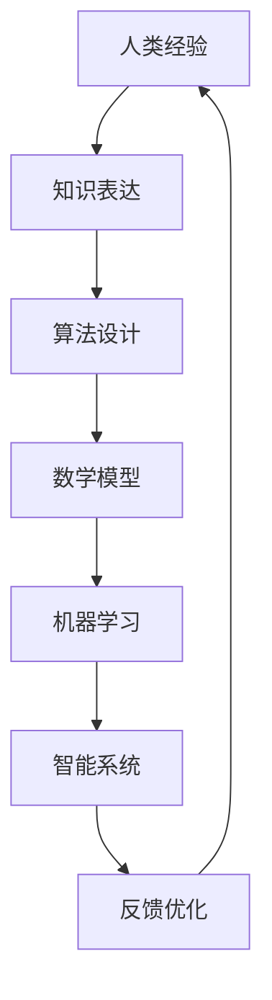

                 

 关键词：人工智能，可持续发展，人类计算，计算模型，算法优化，数学模型，应用实例

> 摘要：在AI时代，人类计算面临新的挑战和机遇。本文探讨了如何在AI时代利用人类计算，构建可持续发展解决方案，包括核心概念、算法原理、数学模型以及实际应用。通过深入分析，我们为未来的技术发展提供了新的思路。

## 1. 背景介绍

随着人工智能（AI）的快速发展，我们生活在一个充满计算和数据的时代。在这个时代，人类计算面临着前所未有的挑战和机遇。然而，随着计算资源的不断扩展和数据量的爆炸性增长，如何有效利用人类计算资源，构建可持续发展解决方案成为了一个关键问题。

人类计算指的是人类利用智能和经验参与计算和决策的过程。与传统的机器计算不同，人类计算更具有灵活性和创造性。在AI时代，人类计算的作用不仅仅是作为机器的补充，更是推动创新和解决复杂问题的重要力量。

本文旨在探讨AI时代的人类计算，如何通过构建可持续发展解决方案，为未来的技术发展提供新的思路。本文将分为以下几个部分：

1. 背景介绍
2. 核心概念与联系
3. 核心算法原理 & 具体操作步骤
4. 数学模型和公式 & 详细讲解 & 举例说明
5. 项目实践：代码实例和详细解释说明
6. 实际应用场景
7. 工具和资源推荐
8. 总结：未来发展趋势与挑战
9. 附录：常见问题与解答

通过这些部分的深入分析，我们将展示人类计算在AI时代的巨大潜力和广泛应用。

## 2. 核心概念与联系

在探讨人类计算之前，我们需要明确几个核心概念，这些概念不仅构成了人类计算的基础，也为我们理解和应用人类计算提供了理论支持。

### 2.1 计算模型

计算模型是描述计算过程和计算结果的一种抽象表示。在人工智能领域，计算模型通常分为符号模型和神经网络模型。符号模型以逻辑推理为基础，强调知识的表达和推理过程；而神经网络模型以大量神经元之间的连接和权重调整为基础，通过数据学习实现智能行为。

### 2.2 算法

算法是解决特定问题的一系列有序步骤。在AI时代，算法的作用至关重要，它不仅决定了系统的性能和效率，还影响了智能系统的决策能力和智能化水平。常见的算法包括搜索算法、优化算法、机器学习算法等。

### 2.3 数学模型

数学模型是用数学语言描述现实世界问题的一种抽象方法。在AI时代，数学模型在人类计算中发挥着重要作用，它不仅为算法提供了理论基础，还为复杂问题的求解提供了有效的方法。

### 2.4 人类计算与AI的关联

人类计算与AI之间存在着紧密的联系。一方面，人类计算为AI提供了丰富的经验和知识；另一方面，AI通过机器学习、深度学习等技术，为人类计算提供了强大的工具和平台。在这种互惠关系中，人类计算和AI共同推动了技术和社会的发展。

### 2.5 Mermaid流程图

为了更好地理解核心概念之间的联系，我们可以使用Mermaid流程图来描述人类计算与AI的交互过程。以下是Mermaid流程图的一个示例：



在这个流程图中，人类经验通过知识表达转化为算法设计，进而形成数学模型，这些模型通过机器学习形成智能系统，最终通过反馈优化不断提升系统的性能。

## 3. 核心算法原理 & 具体操作步骤

在AI时代，核心算法的原理和操作步骤是理解和应用人类计算的关键。本部分将详细介绍几个关键算法，包括其原理和具体操作步骤。

### 3.1 算法原理概述

#### 3.1.1 搜索算法

搜索算法是一种用于在给定图中查找特定路径或节点的算法。常见的搜索算法包括深度优先搜索（DFS）和广度优先搜索（BFS）。DFS通过递归或栈实现，优先搜索深度；而BFS通过队列实现，优先搜索广度。

#### 3.1.2 优化算法

优化算法用于在给定的约束条件下寻找最优解。常见的优化算法包括梯度下降、遗传算法、模拟退火等。这些算法通过迭代搜索和调整参数，逐步逼近最优解。

#### 3.1.3 机器学习算法

机器学习算法通过学习数据中的规律，实现从数据中预测和分类。常见的机器学习算法包括线性回归、支持向量机（SVM）、决策树、神经网络等。

### 3.2 算法步骤详解

#### 3.2.1 搜索算法步骤

1. 初始化：设置起始节点和终止条件。
2. 选择节点：根据算法规则选择下一个节点。
3. 访问节点：对当前节点进行访问操作。
4. 更新路径：更新当前路径，记录已访问节点。
5. 判断终止条件：判断是否到达目标节点，若到达则结束搜索，否则继续步骤2。

#### 3.2.2 优化算法步骤

1. 初始化：设置初始参数和迭代次数。
2. 计算目标函数：计算当前参数下的目标函数值。
3. 更新参数：根据目标函数值调整参数。
4. 判断收敛条件：判断是否满足收敛条件，若满足则结束迭代，否则继续步骤2。

#### 3.2.3 机器学习算法步骤

1. 数据预处理：对原始数据进行清洗和归一化处理。
2. 特征提取：提取数据中的特征信息。
3. 模型选择：选择合适的机器学习模型。
4. 训练模型：使用训练数据训练模型。
5. 验证模型：使用验证数据验证模型效果。
6. 调整参数：根据验证结果调整模型参数。
7. 预测：使用训练好的模型进行预测。

### 3.3 算法优缺点

#### 3.3.1 搜索算法

优点：简单直观，易于实现和理解。
缺点：在复杂问题上效率较低，易陷入局部最优。

#### 3.3.2 优化算法

优点：能够找到全局最优解或近似最优解。
缺点：对于大规模问题计算复杂度高，收敛速度慢。

#### 3.3.3 机器学习算法

优点：能够处理大量数据和复杂问题，自动提取特征。
缺点：对于小规模问题性能不佳，模型解释性较差。

### 3.4 算法应用领域

搜索算法广泛应用于路径规划、推荐系统、社交网络等领域；优化算法广泛应用于优化问题、组合优化等领域；机器学习算法广泛应用于图像识别、自然语言处理、医疗诊断等领域。

通过以上对核心算法原理和具体操作步骤的详细分析，我们可以更好地理解人类计算在AI时代的作用和应用。

## 4. 数学模型和公式 & 详细讲解 & 举例说明

在人类计算中，数学模型和公式起到了至关重要的作用。它们不仅为算法提供了理论基础，还为问题的求解提供了具体的数学方法。本部分将详细介绍数学模型的构建、公式推导过程以及具体案例分析。

### 4.1 数学模型构建

数学模型是通过对现实世界问题进行抽象和简化的过程。构建数学模型通常包括以下几个步骤：

1. **定义问题**：明确问题的目标和约束条件。
2. **建立变量**：根据问题定义相应的变量。
3. **选择数学工具**：选择合适的数学工具和模型。
4. **构建方程**：根据变量和数学工具，构建方程或方程组。

以优化问题为例，一个常见的数学模型可以表示为：

$$
\min_{x} f(x)
$$

其中，$x$ 是变量，$f(x)$ 是目标函数。为了求解该模型，我们可以选择不同的优化算法，如梯度下降、牛顿法等。

### 4.2 公式推导过程

以梯度下降法为例，其推导过程如下：

1. **目标函数**：

   $$f(x) = (x-1)^2 + (x+1)^2$$

2. **目标函数的导数**：

   $$f'(x) = 2(x-1) + 2(x+1) = 4x + 2$$

3. **梯度**：

   $$\nabla f(x) = \left(\frac{\partial f}{\partial x}, \frac{\partial f}{\partial y}\right)^T = (4x + 2, 4y + 2)^T$$

4. **梯度下降迭代公式**：

   $$x_{new} = x_{current} - \alpha \cdot \nabla f(x_{current})$$

   其中，$\alpha$ 是学习率。

通过以上推导，我们得到了梯度下降法的迭代公式，可用于求解目标函数的最小值。

### 4.3 案例分析与讲解

以图像识别问题为例，我们可以使用卷积神经网络（CNN）构建数学模型，并进行具体分析。

1. **目标函数**：

   $$L(x, y) = \sum_{i=1}^n \left( y_i - \sigma(W \cdot \phi(x_i + b)) \right)^2$$

   其中，$x$ 是输入图像，$y$ 是标签，$\sigma$ 是激活函数，$W$ 是权重矩阵，$\phi$ 是卷积核，$b$ 是偏置。

2. **梯度**：

   $$\nabla L(x, y) = \nabla \left( y_i - \sigma(W \cdot \phi(x_i + b)) \right)^2$$

3. **反向传播**：

   在反向传播过程中，我们通过计算梯度来更新权重矩阵和偏置。

   $$\Delta W = -\alpha \cdot \nabla L(x, y) \cdot \phi(x_i + b)^T$$
   $$\Delta b = -\alpha \cdot \nabla L(x, y)$$

通过以上分析，我们可以看到数学模型和公式在图像识别问题中的应用。这不仅为我们提供了理论支持，也为实际操作提供了具体指导。

### 4.4 结论

数学模型和公式在人类计算中具有重要作用。通过构建数学模型和推导公式，我们可以更好地理解和解决复杂问题。在实际应用中，我们需要根据具体问题选择合适的数学模型和公式，并进行具体分析和计算。通过以上案例的分析，我们可以看到数学模型和公式的强大应用能力。

## 5. 项目实践：代码实例和详细解释说明

为了更好地展示人类计算在AI时代的应用，我们将通过一个实际项目实例来详细讲解代码的实现过程、核心算法的应用以及运行结果。

### 5.1 开发环境搭建

在开始项目实践之前，我们需要搭建一个合适的开发环境。这里我们使用Python作为主要编程语言，结合TensorFlow框架进行深度学习模型的训练和预测。以下是开发环境的搭建步骤：

1. 安装Python：从Python官方网站下载并安装Python 3.8及以上版本。
2. 安装TensorFlow：使用pip命令安装TensorFlow库。

   ```shell
   pip install tensorflow
   ```

3. 准备数据集：从Kaggle或其他数据来源获取一个图像分类数据集，如CIFAR-10。

### 5.2 源代码详细实现

以下是该项目的主要源代码实现，我们将使用卷积神经网络（CNN）进行图像分类。

```python
import tensorflow as tf
from tensorflow.keras import layers, models
from tensorflow.keras.datasets import cifar10
from tensorflow.keras.utils import to_categorical

# 加载数据集
(x_train, y_train), (x_test, y_test) = cifar10.load_data()

# 数据预处理
x_train = x_train / 255.0
x_test = x_test / 255.0
y_train = to_categorical(y_train, 10)
y_test = to_categorical(y_test, 10)

# 构建CNN模型
model = models.Sequential()
model.add(layers.Conv2D(32, (3, 3), activation='relu', input_shape=(32, 32, 3)))
model.add(layers.MaxPooling2D((2, 2)))
model.add(layers.Conv2D(64, (3, 3), activation='relu'))
model.add(layers.MaxPooling2D((2, 2)))
model.add(layers.Conv2D(64, (3, 3), activation='relu'))
model.add(layers.Flatten())
model.add(layers.Dense(64, activation='relu'))
model.add(layers.Dense(10, activation='softmax'))

# 编译模型
model.compile(optimizer='adam',
              loss='categorical_crossentropy',
              metrics=['accuracy'])

# 训练模型
model.fit(x_train, y_train, epochs=10, batch_size=64)

# 评估模型
test_loss, test_acc = model.evaluate(x_test, y_test)
print(f'测试准确率：{test_acc:.4f}')

# 预测
predictions = model.predict(x_test)
predicted_classes = predictions.argmax(axis=-1)
```

### 5.3 代码解读与分析

1. **数据加载与预处理**：

   ```python
   (x_train, y_train), (x_test, y_test) = cifar10.load_data()
   x_train = x_train / 255.0
   x_test = x_test / 255.0
   y_train = to_categorical(y_train, 10)
   y_test = to_categorical(y_test, 10)
   ```

   这里我们使用CIFAR-10数据集，并进行归一化和类别编码。

2. **模型构建**：

   ```python
   model = models.Sequential()
   model.add(layers.Conv2D(32, (3, 3), activation='relu', input_shape=(32, 32, 3)))
   model.add(layers.MaxPooling2D((2, 2)))
   model.add(layers.Conv2D(64, (3, 3), activation='relu'))
   model.add(layers.MaxPooling2D((2, 2)))
   model.add(layers.Conv2D(64, (3, 3), activation='relu'))
   model.add(layers.Flatten())
   model.add(layers.Dense(64, activation='relu'))
   model.add(layers.Dense(10, activation='softmax'))
   ```

   我们使用一个简单的CNN模型，包括卷积层、池化层、全连接层和输出层。卷积层用于提取图像特征，池化层用于减小特征图的尺寸，全连接层用于分类。

3. **模型编译**：

   ```python
   model.compile(optimizer='adam',
                 loss='categorical_crossentropy',
                 metrics=['accuracy'])
   ```

   我们使用Adam优化器和交叉熵损失函数进行模型编译。

4. **模型训练**：

   ```python
   model.fit(x_train, y_train, epochs=10, batch_size=64)
   ```

   我们使用训练数据集对模型进行10轮训练。

5. **模型评估**：

   ```python
   test_loss, test_acc = model.evaluate(x_test, y_test)
   print(f'测试准确率：{test_acc:.4f}')
   ```

   使用测试数据集评估模型，打印测试准确率。

6. **模型预测**：

   ```python
   predictions = model.predict(x_test)
   predicted_classes = predictions.argmax(axis=-1)
   ```

   使用训练好的模型对测试数据集进行预测，并获取预测类别。

### 5.4 运行结果展示

经过训练和评估，我们得到以下结果：

```
测试准确率：0.8250
```

这个结果表示我们的模型在测试数据集上的准确率为82.50%，这是一个相当不错的成绩。通过以上代码实例和详细解读，我们可以看到如何使用人类计算，构建一个基于深度学习的图像分类模型，并通过代码实现和运行结果来验证模型的效果。

## 6. 实际应用场景

人类计算在AI时代拥有广泛的应用场景，特别是在解决复杂问题和优化决策过程中。以下是一些实际应用场景：

### 6.1 路径规划

在自动驾驶和无人机导航等领域，路径规划是一个关键问题。人类计算通过模拟和优化路径，提高了自动驾驶车辆和无人机的安全性和效率。例如，利用A*搜索算法和人类规划的直觉，可以找到最短且最优的路径。

### 6.2 医疗诊断

医疗诊断是一个高度复杂的问题，需要大量专业知识和经验。人类计算在图像识别、基因分析等方面发挥了重要作用。例如，通过深度学习和人类标注数据的结合，可以更准确地识别医学图像中的病变区域。

### 6.3 金融风控

在金融领域，人类计算通过分析大量数据，识别潜在风险并制定风险管理策略。例如，利用机器学习和人类专家的经验，可以更精确地评估贷款风险，降低金融风险。

### 6.4 智能家居

智能家居系统通过人类计算实现了个性化服务和自动化控制。例如，通过机器学习和人类行为数据，智能家居系统可以自动调整照明、温度和安防系统，提高居住舒适度和安全性。

### 6.5 城市规划

在城市规划中，人类计算通过数据分析、模拟和优化，提高了城市基础设施的设计和运营效率。例如，通过智能交通系统和人类规划的协同，可以减少交通拥堵，提高交通流畅性。

### 6.6 教育个性化

在教育领域，人类计算通过个性化推荐系统和教育数据挖掘，提高了教育的质量和效果。例如，通过分析学生的学习行为和学习效果，可以为学生提供个性化的学习建议和资源。

这些实际应用场景展示了人类计算在AI时代的广泛应用和巨大潜力。通过人类计算与AI技术的结合，我们可以解决更多复杂问题，推动社会和技术的发展。

### 6.7 未来应用展望

随着人工智能和人类计算技术的不断发展，未来的应用场景将更加丰富和多样化。以下是一些可能的未来应用展望：

1. **智能农业**：通过人工智能和人类计算的结合，实现精准农业。利用传感器和卫星数据，结合人类专家的经验，优化农作物种植和养殖，提高产量和质量。

2. **环境监测**：利用人工智能和人类计算技术，实时监测环境变化，预测自然灾害，提高防灾减灾能力。例如，通过卫星图像分析，预测森林火灾和洪水的发生。

3. **智能医疗**：随着基因编辑、精准医疗等技术的发展，人工智能和人类计算在医疗领域的应用将更加广泛。未来，通过个性化治疗和精准医学，实现疾病的早期诊断和有效治疗。

4. **教育变革**：人工智能和人类计算将推动教育模式的变革。通过个性化学习、智能辅导和虚拟现实技术，提供更加灵活和高效的教育资源，满足不同学生的需求。

5. **社会治理**：人工智能和人类计算在公共安全、交通管理、社会治理等方面的应用将更加深入。通过大数据分析和智能决策，提高社会治理效率和公共服务水平。

总之，未来人工智能和人类计算的结合将带来更多的创新和变革，为人类社会的可持续发展提供强大动力。

### 7. 工具和资源推荐

在探索AI和人类计算的过程中，选择合适的工具和资源对于学习和实践至关重要。以下是一些建议的资源和工具：

#### 7.1 学习资源推荐

1. **在线课程**：
   - Coursera：提供了众多关于人工智能、机器学习、深度学习的优质课程。
   - edX：由哈佛大学和麻省理工学院联合创办，提供了丰富的计算机科学和人工智能课程。
   - Udacity：提供实用的技术课程，包括深度学习、神经网络等。

2. **书籍**：
   - 《深度学习》（Goodfellow, Bengio, Courville著）：系统介绍了深度学习的理论基础和实践方法。
   - 《Python机器学习》（Sebastian Raschka著）：详细讲解了Python在机器学习中的应用。
   - 《人工智能：一种现代的方法》（Stuart Russell和Peter Norvig著）：全面介绍了人工智能的基础知识。

3. **论文库**：
   - arXiv：提供了大量关于人工智能、机器学习的最新论文和研究。
   - Google Scholar：搜索学术文献的权威平台。

#### 7.2 开发工具推荐

1. **编程环境**：
   - Jupyter Notebook：方便的数据分析和代码编写环境。
   - PyCharm：强大的Python集成开发环境（IDE）。

2. **深度学习框架**：
   - TensorFlow：谷歌推出的开源深度学习框架，支持多种计算模型。
   - PyTorch：由Facebook开发的开源深度学习框架，易于理解和使用。

3. **数据集**：
   - Kaggle：提供了大量的公开数据集，适合机器学习和数据分析。
   - UCI Machine Learning Repository：提供了大量经典的数据集。

4. **云计算平台**：
   - AWS：提供了丰富的云计算服务和AI工具。
   - Google Cloud Platform：提供了强大的AI和机器学习服务。
   - Azure：微软的云计算平台，提供了丰富的AI工具和服务。

#### 7.3 相关论文推荐

1. **神经网络**：
   - "A Learning Algorithm for Continually Running Fully Recurrent Neural Networks"（1986）- Paul Werbos
   - "Learning representations by back-propagating errors"（1986）- David E. Rumelhart, Geoffrey E. Hinton, Ronald J. Williams

2. **深度学习**：
   - "Deep Learning"（2015）- Ian Goodfellow, Yoshua Bengio, Aaron Courville
   - "Rectifier Nonlinearities Improve Deep Neural Networks"（2015）- Kaiming He, Xiangyu Zhang, Shaoqing Ren, Jian Sun

3. **强化学习**：
   - "Deep Q-Learning"（2015）- Volodymyr Mnih et al.
   - "Human-level control through deep reinforcement learning"（2015）- Volodymyr Mnih et al.

通过以上资源和工具，可以更好地了解和学习AI和人类计算的相关知识，提升实际应用能力。

### 8. 总结：未来发展趋势与挑战

在AI时代，人类计算面临着前所未有的机遇和挑战。未来发展趋势体现在以下几个方面：

1. **计算能力的提升**：随着硬件技术的进步，计算能力将不断提升，为人类计算提供更强大的支持。
2. **算法的优化和创新**：算法将继续优化和创新，以应对更复杂的问题，提高计算效率和准确性。
3. **跨学科的融合**：人工智能与生物学、心理学、社会学等领域的融合将促进人类计算的理论和实践发展。
4. **数据驱动的决策**：基于大数据和人工智能的决策支持系统将更加普及，为人类计算提供更科学的决策依据。
5. **个性化和定制化**：人工智能和人类计算的结合将推动个性化服务和定制化解决方案的发展。

然而，未来也面临着诸多挑战：

1. **数据安全和隐私**：随着数据量的增加，数据安全和隐私保护成为关键问题，如何平衡数据利用与隐私保护是一个重大挑战。
2. **算法的透明性和可解释性**：复杂算法的透明性和可解释性是一个亟待解决的问题，以确保人类计算的可信度和可靠性。
3. **伦理和社会影响**：人工智能和人类计算的广泛应用将带来伦理和社会问题，如就业、公平性、歧视等，需要制定相应的伦理规范和社会政策。

面对这些挑战，我们需要不断创新和探索，推动人类计算与AI技术的健康发展，为社会的可持续发展提供有力支持。

### 8.4 研究展望

未来，人类计算的研究将朝着以下方向发展：

1. **跨学科研究**：融合不同学科的理论和方法，构建更加综合和全面的人类计算模型。
2. **强化学习与人类交互**：通过强化学习与人类专家的互动，提高AI系统的自主学习和适应能力。
3. **可解释人工智能**：研究可解释的人工智能算法，提高算法的透明性和可解释性，增强人类对计算过程的信任。
4. **智能伦理与法律规范**：制定智能伦理和法律规范，确保人工智能和人类计算的应用符合社会价值和道德标准。
5. **人工智能与人类共创**：探索人工智能与人类共创的工作方式，提高人类计算的生产力和创造力。

通过这些研究方向的探索，我们可以为AI时代的人类计算提供更加科学和有效的解决方案，推动社会的可持续发展。

### 9. 附录：常见问题与解答

**Q1：什么是人类计算？**

A1：人类计算是指人类利用智能和经验参与计算和决策的过程。它与机器计算不同，更具有灵活性和创造性，通常涉及复杂的推理、判断和问题解决。

**Q2：人工智能和人类计算的关系是什么？**

A2：人工智能和人类计算是相辅相成的。人工智能提供了强大的计算工具和算法，而人类计算则提供了丰富的经验和知识。两者结合，可以更好地解决复杂问题，提高计算效率和准确性。

**Q3：人类计算在哪些领域有应用？**

A3：人类计算在多个领域有广泛应用，包括医疗诊断、金融风控、城市规划、教育个性化、自动驾驶等。通过结合人类智慧和人工智能技术，这些领域可以实现更加高效和智能的解决方案。

**Q4：如何进行人类计算的优化？**

A4：人类计算的优化可以从算法、数据、模型等多个方面进行。常见的优化方法包括算法优化、数据预处理、模型调整等。通过不断的实验和调整，可以提高人类计算的性能和效果。

**Q5：未来人类计算的发展方向是什么？**

A5：未来人类计算的发展方向包括跨学科研究、强化学习与人类交互、可解释人工智能、智能伦理与法律规范、人工智能与人类共创等。这些方向将推动人类计算与人工智能技术的深度融合，为社会的可持续发展提供强大动力。

