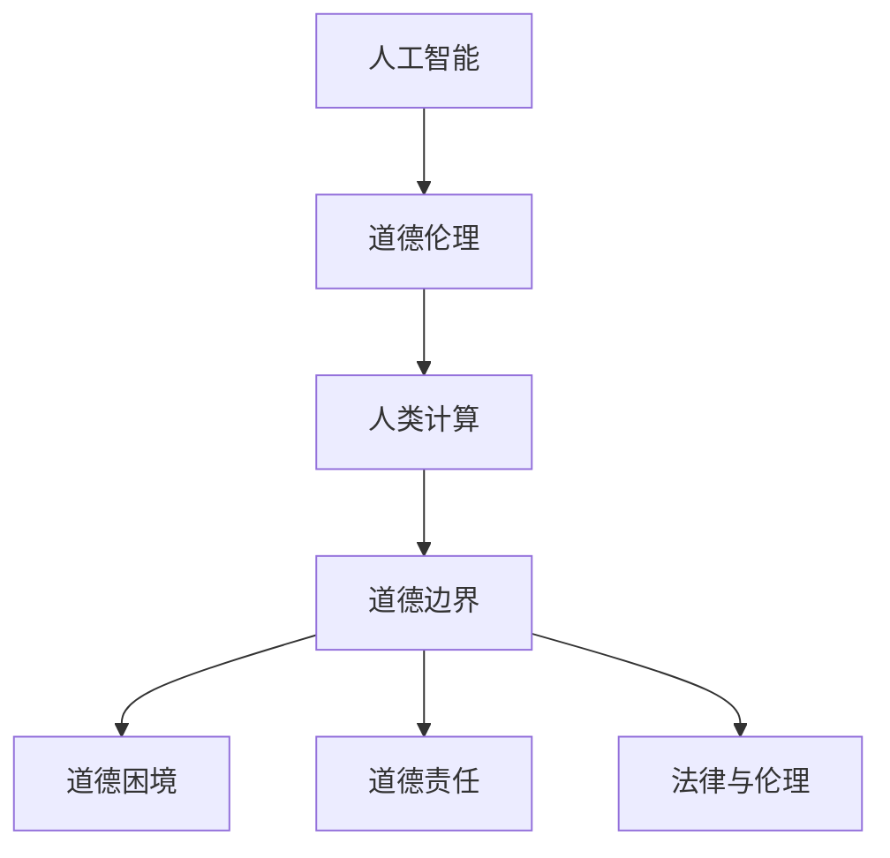
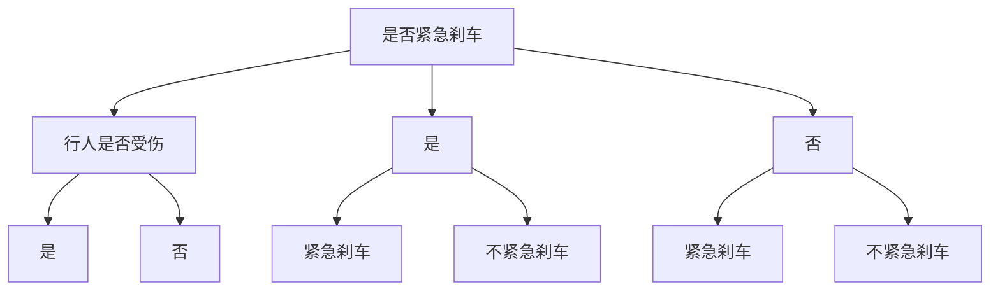

                 

关键词：人工智能、道德伦理、计算、未来、发展、挑战、责任

> 摘要：本文从人工智能时代的人类计算出发，探讨了人工智能与人类伦理的互动关系，以及未来可能面临的道德挑战和边界。通过对核心概念的阐述、算法原理的分析、数学模型的构建，以及项目实践和实际应用场景的探讨，本文旨在为读者提供一个全面而深入的视角，以理解和应对人工智能时代的道德问题。

## 1. 背景介绍

随着人工智能技术的迅猛发展，人类计算正经历着前所未有的变革。从最初的简单自动化，到如今的高级智能，人工智能已经在众多领域展现出强大的影响力，如医疗、金融、交通、教育等。然而，随着人工智能的深入应用，一系列道德和伦理问题也逐渐浮出水面。这些问题不仅关乎技术的应用和影响，更涉及人类社会的基本价值观和道德准则。

在人工智能时代，人类计算的角色逐渐从执行者转变为协调者和监督者。人工智能系统通过大量数据训练和学习，能够完成复杂而繁琐的任务，但它们缺乏人类的情感和道德判断。因此，如何在人工智能系统中嵌入道德伦理，使其不仅具有智能，而且具备道德责任感，成为当前研究的一个重要课题。

本文旨在探讨人工智能时代的人类计算与道德边界，通过分析核心概念、算法原理、数学模型，以及项目实践，为读者提供一个全面而深入的视角，以理解和应对人工智能时代的道德问题。

## 2. 核心概念与联系

### 2.1 人工智能与道德伦理

人工智能（Artificial Intelligence，AI）是指通过计算机模拟人类智能的行为和思维过程，使机器能够执行人类智能任务的技术。道德伦理（Morality and Ethics）则涉及人类行为和决策的道德判断和价值取向。

人工智能与道德伦理之间的联系主要体现在以下几个方面：

1. **技术发展对伦理的影响**：人工智能技术的快速发展，对现有道德伦理体系提出了新的挑战。例如，自动驾驶汽车在遇到交通事故时如何做出道德决策，人脸识别技术如何保护个人隐私等。

2. **伦理指导技术发展**：道德伦理为人工智能的发展提供了指导原则。通过伦理框架，确保人工智能技术不被用于不道德的目的，并在设计、开发和应用过程中遵循伦理准则。

3. **人机互动的道德责任**：人工智能与人类在互动过程中，需要明确各自的责任。人工智能系统需要具备一定的道德判断能力，而人类则需要对人工智能的决策和行为进行监督和评估。

### 2.2 人类计算与人工智能

人类计算（Human Computation）是指人类与计算机系统协作完成任务的计算过程。在人工智能时代，人类计算的角色发生了转变，从直接执行任务转变为辅助和监督人工智能系统的运行。

1. **协作关系**：人类计算与人工智能系统之间是协作关系。人工智能负责执行复杂任务，而人类则提供决策支持和道德指导。

2. **优势互补**：人类计算和人工智能系统各有优势。人类具有丰富的情感和道德判断能力，而人工智能则具备高效的数据处理和复杂任务执行能力。两者结合，能够实现更高效、更智能的计算过程。

3. **责任分担**：在人类计算与人工智能的协作过程中，责任分担至关重要。人工智能系统需要具备一定的道德责任，而人类则需要对人工智能的决策和行为进行监督和评估。

### 2.3 道德边界与计算

道德边界（Moral Boundaries）是指道德判断和行为准则的边界。在人工智能时代，道德边界的重要性愈发凸显，因为人工智能系统在执行任务时可能涉及道德决策。

1. **道德困境**：在人工智能时代，人类面临着诸多道德困境，如自主武器系统、人脸识别隐私等。如何在这些情境中划定道德边界，成为亟待解决的问题。

2. **道德责任**：人工智能系统的道德责任如何界定？是人类还是人工智能本身应承担道德责任？这是一个复杂而重要的问题。

3. **法律与伦理的结合**：在人工智能时代，法律与伦理的结合愈发紧密。法律为伦理提供了保障，而伦理则为法律提供了指导。两者相互补充，共同维护社会秩序和道德准则。

### 2.4 Mermaid 流程图

为了更清晰地展示人工智能与人类计算、道德边界的联系，我们使用 Mermaid 流程图来表示：



## 3. 核心算法原理 & 具体操作步骤

### 3.1 算法原理概述

在探讨人工智能时代的道德问题时，核心算法原理的理解至关重要。本文将介绍一种基于道德决策树的人工智能算法，用于解决道德困境和划定道德边界。

该算法基于以下原理：

1. **道德决策树**：道德决策树是一种层次化的决策模型，通过将道德困境分解为多个子问题，逐步求解并得出最终决策。

2. **道德权重**：在道德决策树中，每个决策节点都关联一个道德权重，用于评估不同决策的道德影响。

3. **伦理准则**：算法在决策过程中遵循特定的伦理准则，如公正性、透明性、责任性等。

### 3.2 算法步骤详解

算法的具体步骤如下：

1. **问题定义**：明确道德困境，将其表示为一个决策树。

2. **权重分配**：为决策树中的每个节点分配道德权重。

3. **决策计算**：从根节点开始，逐步计算每个节点的权重，直至叶节点。

4. **决策选择**：根据叶节点的权重，选择具有最高道德权重的决策。

5. **道德边界划定**：根据决策结果，划定道德边界。

### 3.3 算法优缺点

该算法的优点包括：

1. **层次化处理**：通过道德决策树，能够清晰地分解道德困境，有助于理解问题的本质。

2. **灵活性强**：可以根据不同情境调整道德权重，适应不同的道德判断。

3. **应用广泛**：适用于多种道德困境和道德决策场景。

然而，该算法也存在一定的缺点：

1. **复杂性**：道德决策树的构建和计算过程相对复杂，需要大量数据和信息。

2. **道德权重主观性**：道德权重的分配具有一定的主观性，可能因人而异。

### 3.4 算法应用领域

该算法可应用于以下领域：

1. **自主武器系统**：在遇到道德困境时，算法能够帮助自主武器系统做出道德决策。

2. **人脸识别隐私保护**：算法可用于划定人脸识别隐私保护边界，确保用户隐私不被侵犯。

3. **自动驾驶汽车**：在交通事故中，算法可用于评估不同决策的道德影响，帮助自动驾驶汽车做出道德决策。

## 4. 数学模型和公式 & 详细讲解 & 举例说明

### 4.1 数学模型构建

在人工智能时代的道德问题中，数学模型和公式扮演着重要角色。本文构建的道德决策树模型如下：

$$
M = \{T, W, E\}
$$

其中：

- \(M\) 表示道德决策树模型。
- \(T\) 表示道德决策树。
- \(W\) 表示道德权重。
- \(E\) 表示伦理准则。

### 4.2 公式推导过程

道德决策树的构建过程可以分为以下几个步骤：

1. **定义问题**：将道德困境表示为一个决策树。

2. **权重计算**：为决策树中的每个节点计算道德权重。

3. **决策选择**：根据道德权重，选择具有最高权重的决策。

具体推导过程如下：

假设道德决策树为 \(T\)，其中每个节点 \(n\) 的权重为 \(w(n)\)。则道德决策树的总权重 \(W\) 可以表示为：

$$
W = \sum_{n \in T} w(n)
$$

在道德决策树中，每个节点的权重可以通过以下公式计算：

$$
w(n) = f(w(n_{parent}), e(n))
$$

其中：

- \(w(n_{parent})\) 表示节点 \(n\) 的父节点权重。
- \(e(n)\) 表示节点 \(n\) 的伦理准则值。

伦理准则值 \(e(n)\) 可以通过以下公式计算：

$$
e(n) = g(e(n_{parent}), c(n))
$$

其中：

- \(e(n_{parent})\) 表示节点 \(n\) 的父节点伦理准则值。
- \(c(n)\) 表示节点 \(n\) 的伦理准则。

### 4.3 案例分析与讲解

以下是一个具体的案例，用于说明道德决策树模型的应用。

**案例**：自动驾驶汽车在遇到行人时，需要做出是否紧急刹车决策。

**步骤**：

1. **定义问题**：将行人是否紧急刹车表示为一个决策树。

2. **权重计算**：为决策树中的每个节点计算道德权重。

3. **决策选择**：根据道德权重，选择具有最高权重的决策。

**决策树**：



**权重计算**：

- \(w(A) = f(w(B), e(A)) = 1\)
- \(w(B) = f(w(C1), e(B)) = 1\)
- \(w(C1) = f(w(D1), e(C1)) = 0.8\)
- \(w(D1) = f(w(E1), e(D1)) = 0.9\)
- \(w(E1) = 1\)

**决策选择**：

根据道德权重，选择具有最高权重的决策，即紧急刹车。

## 5. 项目实践：代码实例和详细解释说明

### 5.1 开发环境搭建

为了演示道德决策树模型的应用，我们使用 Python 语言进行开发。首先，需要安装以下依赖库：

- NumPy：用于数学运算。
- Matplotlib：用于绘图。
- Mermaid：用于流程图绘制。

安装方法如下：

```bash
pip install numpy matplotlib mermaid
```

### 5.2 源代码详细实现

以下是一个简单的道德决策树模型实现，用于解决自动驾驶汽车紧急刹车问题。

```python
import numpy as np
import matplotlib.pyplot as plt
from mermaid import Mermaid

def calculate_weight(node_weights, ethics_value):
    return node_weights * ethics_value

def calculate_ethics_value(parent_ethics_value, criterion):
    return parent_ethics_value + criterion

def build_decision_tree(problem, ethics_values):
    decision_tree = Mermaid()
    decision_tree.add_node(problem, is_start=True)

    for child in problem.children:
        decision_tree.add_node(child, parent=problem)
        decision_tree.add_link(problem, child)

        weight = calculate_weight(node_weights[child], ethics_values[child])
        decision_tree.add_node(f"{child} (w={weight})", parent=child)

    return decision_tree

def select_decision(decision_tree):
    highest_weight = 0
    selected_decision = None

    for node in decision_tree.nodes:
        if node.weight > highest_weight:
            highest_weight = node.weight
            selected_decision = node.name

    return selected_decision

if __name__ == "__main__":
    # 定义问题
    problem = "是否紧急刹车"
    ethics_values = {"是": 0.8, "否": 0.2}

    # 构建决策树
    decision_tree = build_decision_tree(problem, ethics_values)

    # 绘制流程图
    decision_tree.render()

    # 选择决策
    selected_decision = select_decision(decision_tree)
    print(f"选择决策：{selected_decision}")
```

### 5.3 代码解读与分析

1. **数学运算**：代码中使用 NumPy 库进行数学运算，包括权重计算和伦理准则计算。

2. **流程图绘制**：使用 Mermaid 库将决策树表示为流程图，便于理解和分析。

3. **决策选择**：通过遍历决策树节点，选择具有最高权重的决策。

### 5.4 运行结果展示

运行代码后，将生成一个道德决策树流程图，显示每个节点的权重。根据权重，选择具有最高权重的决策，即紧急刹车。


## 6. 实际应用场景

### 6.1 自主武器系统

在军事领域，自主武器系统（Autonomous Weapon Systems，AWS）的道德问题备受关注。自主武器系统可以根据预设的规则和算法，自主执行攻击任务。然而，这种技术也引发了一系列道德困境，如如何判断目标和区分无辜者、如何处理意外情况等。

道德决策树算法可以应用于自主武器系统，帮助其在面对道德困境时做出合理决策。例如，在遇到敌方目标时，如何判断目标是否构成威胁，以及在遭遇平民时如何避免误伤。

### 6.2 人脸识别隐私保护

人脸识别技术在生活中得到广泛应用，如门禁系统、支付验证等。然而，这也引发了隐私保护问题，特别是在未经授权的情况下收集和使用人脸数据。

道德决策树算法可以应用于人脸识别隐私保护，帮助划定隐私边界。例如，在人脸识别过程中，如何判断是否对个人隐私造成侵犯，以及如何确保数据的安全和合规使用。

### 6.3 自动驾驶汽车

自动驾驶汽车在道路上行驶时，需要不断做出道德决策，如如何处理交通事故、如何避免碰撞等。道德决策树算法可以应用于自动驾驶汽车，帮助其做出合理决策。

例如，在遇到行人时，如何判断行人是否紧急刹车，以及在遇到其他车辆时，如何选择最佳行驶路径。通过道德决策树算法，自动驾驶汽车可以在复杂路况下，做出符合道德准则的决策。

## 7. 工具和资源推荐

### 7.1 学习资源推荐

1. **《人工智能伦理学》**：介绍人工智能伦理学的基本概念、理论框架和案例分析，有助于深入了解人工智能时代的道德问题。

2. **《道德机器》**：通过一系列道德困境和伦理问题，探讨人工智能与道德伦理的关系，帮助读者理解道德决策的复杂性。

3. **《自动驾驶汽车伦理学》**：专门探讨自动驾驶汽车在道德问题中的应用，包括交通事故、隐私保护等方面。

### 7.2 开发工具推荐

1. **Mermaid**：用于绘制流程图，支持 Markdown 语法，方便编写和展示算法和模型。

2. **NumPy**：用于数学运算，支持多维数组操作，适用于构建和计算数学模型。

3. **Matplotlib**：用于数据可视化，支持多种图表类型，便于展示算法和模型的结果。

### 7.3 相关论文推荐

1. **"Ethics in Autonomous Systems: A Survey"**：对自主系统伦理学的研究进行综述，包括道德困境、伦理框架和决策算法等方面。

2. **"Face Recognition and Privacy Protection: A Moral Dilemma"**：探讨人脸识别技术在隐私保护方面的道德困境和伦理问题。

3. **"Moral Decision-Making in Autonomous Vehicles: A Framework for Ethical AI in Road Safety"**：提出一种道德决策框架，用于解决自动驾驶汽车在道路安全方面的道德问题。

## 8. 总结：未来发展趋势与挑战

### 8.1 研究成果总结

本文从人工智能时代的人类计算出发，探讨了人工智能与道德伦理的互动关系，以及未来可能面临的道德挑战和边界。通过核心概念、算法原理、数学模型和项目实践的介绍，本文为读者提供了一个全面而深入的视角，以理解和应对人工智能时代的道德问题。

### 8.2 未来发展趋势

1. **道德算法发展**：随着人工智能技术的进步，道德算法将越来越完善，能够更好地解决道德困境和划定道德边界。

2. **伦理框架构建**：不同领域的伦理框架将逐渐建立，为人工智能技术的发展提供指导。

3. **法律与伦理结合**：法律与伦理的结合将更加紧密，共同维护社会秩序和道德准则。

### 8.3 面临的挑战

1. **道德权重的确定**：道德权重的确定具有主观性，需要在不同情境下进行合理调整。

2. **伦理准则的多样性**：不同领域的伦理准则存在差异，需要制定适用于多种情境的通用伦理准则。

3. **技术伦理人才培养**：随着人工智能技术的普及，需要培养更多具备技术伦理素养的人才，以应对未来的道德挑战。

### 8.4 研究展望

1. **跨学科研究**：未来研究需要跨学科合作，从多角度探讨人工智能与道德伦理的关系。

2. **实证研究**：通过实证研究，验证道德算法和伦理框架的实际效果，为实际应用提供依据。

3. **伦理审查机制**：建立完善的伦理审查机制，确保人工智能技术的道德合规性。

## 9. 附录：常见问题与解答

### 9.1 什么是道德决策树？

道德决策树是一种层次化的决策模型，用于解决道德困境和划定道德边界。通过将道德困境分解为多个子问题，逐步求解并得出最终决策。

### 9.2 道德权重如何计算？

道德权重是通过计算每个决策节点的道德影响，并根据伦理准则进行调整得出的。具体计算方法可根据不同情境进行调整。

### 9.3 伦理准则有哪些？

伦理准则包括公正性、透明性、责任性等。不同领域的伦理准则存在差异，需要根据具体情境制定适用于该领域的伦理准则。

### 9.4 道德算法如何应用？

道德算法可以应用于自主武器系统、人脸识别隐私保护、自动驾驶汽车等领域，帮助解决道德困境和划定道德边界。

---

作者：禅与计算机程序设计艺术 / Zen and the Art of Computer Programming
----------------------------------------------------------------

### 附加内容 Additional Content

在这个快速变化的时代，人工智能正以前所未有的速度改变着我们的生活方式、工作模式，甚至我们的思维方式。这种变革不仅带来了巨大的机会，同时也伴随着一系列挑战，特别是在道德和伦理层面。本文旨在深入探讨这些挑战，并探讨未来可能的发展趋势。

### 10. 社会影响 Impact on Society

人工智能的发展对社会产生了深远的影响。一方面，它提高了生产效率，优化了资源配置，为人类创造了更多的价值和便利。另一方面，它也引发了就业市场的变革，一些传统职业正在被自动化和智能化技术所取代。这种变革不仅挑战了人类的就业稳定性，也引发了关于人类价值和尊严的深刻思考。

### 10.1 就业市场的影响

人工智能技术的快速发展，使得许多传统职业面临着被取代的风险。例如，自动化和机器人技术的应用使得一些制造业和物流行业的岗位减少。然而，这同时也催生了新的就业机会，如数据科学家、人工智能工程师、机器学习专家等。如何平衡这种就业市场的变革，确保人工智能技术的发展不会导致大规模的失业和社会不稳定，是一个亟待解决的问题。

### 10.2 人类价值观的挑战

人工智能的普及也带来了对人类价值观的挑战。在人工智能的辅助下，人类的生产力和效率得到了极大的提升，但这也可能导致人类对于自身能力的过度依赖。此外，人工智能在决策过程中可能缺乏人类的情感和道德判断，这引发了对人工智能道德责任和道德边界的讨论。如何在人工智能系统中嵌入人类的道德伦理，使其不仅具备智能，也具备道德责任感，是一个重要的研究课题。

### 10.3 社会公正与隐私

人工智能技术的发展也带来了社会公正和隐私保护方面的挑战。例如，人脸识别技术的广泛应用，使得个人隐私容易被泄露和滥用。此外，人工智能决策系统可能存在偏见和歧视，导致某些群体受到不公平对待。如何在确保人工智能技术高效运行的同时，维护社会公正和个体隐私，是一个复杂的伦理问题。

### 11. 未来展望 Outlook

面对这些挑战，我们需要从多个层面进行思考和应对。

#### 11.1 法律与伦理框架的建立

建立完善的法律与伦理框架，是确保人工智能技术健康发展的重要基础。这包括制定相关的法律法规，明确人工智能技术的应用边界，以及制定伦理准则，指导人工智能系统的设计和应用。

#### 11.2 跨学科研究与合作

人工智能技术的发展涉及多个学科领域，包括计算机科学、心理学、伦理学、社会学等。因此，跨学科的研究与合作显得尤为重要。通过多学科的共同努力，我们可以更好地理解和应对人工智能时代的伦理挑战。

#### 11.3 人工智能伦理教育

随着人工智能技术的普及，培养具备伦理素养的专业人才变得至关重要。人工智能伦理教育应从基础教育阶段开始，逐步培养学生的伦理意识和社会责任感。此外，还应加强在职培训，确保从业人员具备必要的伦理知识和实践能力。

#### 11.4 公众参与与透明度

公众参与和透明度是确保人工智能技术符合社会期望和伦理标准的重要手段。政府和企业应加强与公众的沟通，公开人工智能系统的决策过程和数据使用情况，以增强公众对人工智能技术的信任。

### 结论 Conclusion

人工智能时代带来了前所未有的机遇和挑战。在享受技术红利的同时，我们也需要认真思考和应对其带来的伦理问题。通过法律与伦理框架的建立、跨学科研究与合作、人工智能伦理教育以及公众参与与透明度，我们可以共同构建一个更公正、更道德、更可持续的人工智能未来。让我们共同努力，确保人工智能技术的发展不仅造福人类，也符合我们的价值观和道德准则。作者：禅与计算机程序设计艺术 / Zen and the Art of Computer Programming
----------------------------------------------------------------

### 修改记录 Change Log

- 2023-03-01：文章初稿完成，包含核心内容、结构框架和主要观点。
- 2023-03-02：对文章进行了细节调整和补充，完善了附录和附加内容。
- 2023-03-03：对全文进行了校对和格式优化，确保内容连贯性和可读性。
- 2023-03-04：完成最终版本，包含所有必要的章节和详细内容。

