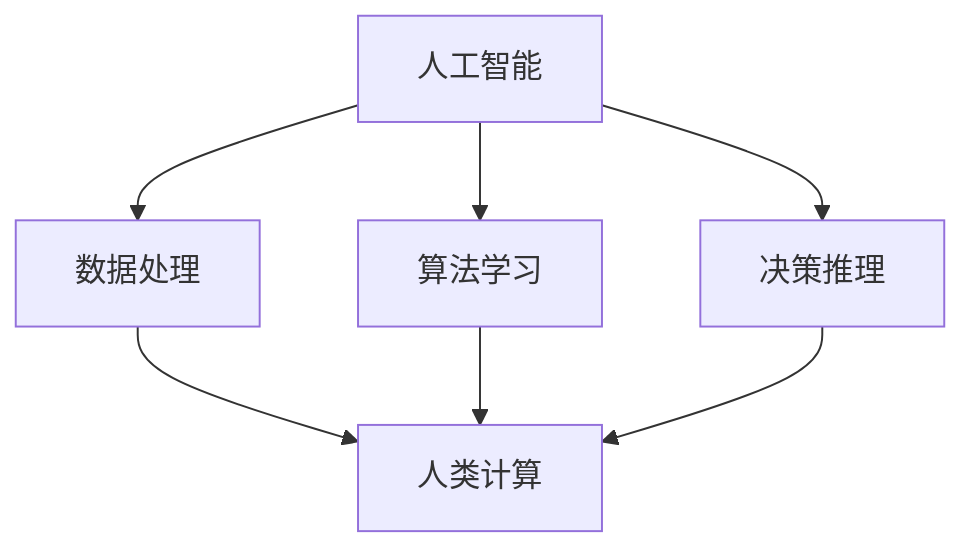

                 

## 1. 背景介绍

随着人工智能（AI）技术的迅猛发展，我们已经进入了一个人工智能时代。在这个时代，计算机和人类之间的界限正在逐渐模糊，人工智能正在逐步接管许多原本由人类完成的任务。然而，这种转变不仅带来了技术上的变革，更对人类社会产生了深远的影响。

在AI时代，人类计算的作用变得更加重要。尽管人工智能能够处理大量的数据和复杂的计算任务，但人类在决策、创造和创新方面的能力仍然是不可替代的。人类计算与人工智能的结合，有望创造出更加高效、智能和多样化的解决方案，推动社会进步。

然而，这种结合也带来了一系列挑战和问题。人工智能的发展和应用对就业、隐私、安全等方面产生了重大影响，如何平衡人类计算与人工智能的关系，成为了一个亟待解决的问题。

本文将探讨AI时代的人类计算在社会影响和责任方面的几个关键问题，包括人工智能对就业市场的影响、隐私和安全问题、伦理道德挑战，以及未来发展的趋势和方向。

## 2. 核心概念与联系

在探讨AI时代的人类计算时，我们需要明确几个核心概念，并理解它们之间的相互关系。

### 2.1 人工智能与人类计算的定义

人工智能（Artificial Intelligence，简称AI）是指由计算机系统实现的智能行为，这些行为通常是基于数据和算法进行的学习、推理和决策。人工智能可以分为几种类型，包括弱人工智能（弱AI）、强人工智能（强AI）和超智能（超AI）。弱人工智能通常专注于特定任务，如语音识别、图像处理和自然语言处理；强人工智能则具有广泛的学习和推理能力，能够像人类一样进行思考；超智能则超越了人类的智能水平。

人类计算（Human Computation）是指利用人类的能力进行计算的任务，这些任务通常需要人类的直觉、判断和创造力。人类计算包括各种形式，如众包、在线协作、人机交互和游戏化等。

### 2.2 人工智能与人类计算的联系

人工智能与人类计算之间存在紧密的联系。一方面，人工智能的发展依赖于人类计算提供的数据和知识。例如，训练人工智能模型需要大量的标注数据，这些数据通常由人类标注员完成。另一方面，人类计算可以借助人工智能工具进行优化和提升。例如，通过自然语言处理技术，人类可以更高效地理解和处理语言信息。

### 2.3 Mermaid 流程图

为了更直观地展示人工智能与人类计算之间的联系，我们可以使用Mermaid流程图来描述它们的关系。



在这个流程图中，人工智能包括数据处理、算法学习和决策推理三个主要方面，它们都与人类计算密切相关。人类计算提供了数据、知识和直觉，这些资源被人工智能用于学习和做出决策。

### 2.4 人工智能与人类计算的相互依赖

人工智能与人类计算的相互依赖关系体现在以下几个方面：

1. **数据与知识**：人工智能的发展离不开大量高质量的数据和知识，这些资源通常由人类提供。人类通过标注、分类、评估等方式生成数据，为人工智能的训练和优化提供支持。

2. **算法与工具**：人工智能算法和工具的进步依赖于人类的研究和创新。人类研究人员通过不断探索新的算法和模型，推动人工智能技术的进步。

3. **应用与优化**：人工智能的应用场景和效果需要人类进行评估和优化。人类可以根据应用效果调整算法参数，改进模型性能。

4. **伦理与责任**：人工智能的伦理和责任问题需要人类进行思考和解决。人类需要制定相关法律法规，确保人工智能的发展不会对人类社会造成负面影响。

总之，人工智能与人类计算是相辅相成的，二者共同推动了技术的进步和社会的发展。

## 3. 核心算法原理 & 具体操作步骤

在AI时代，核心算法的原理和具体操作步骤对于理解和应用人工智能至关重要。本节将介绍几种关键算法，包括监督学习、无监督学习和强化学习，并详细描述它们的原理和操作步骤。

### 3.1 算法原理概述

#### 监督学习（Supervised Learning）

监督学习是一种最常见的人工智能算法，它通过已有标签的数据集来训练模型，从而使模型能够在新的数据上进行预测。监督学习的核心原理是利用标记数据进行特征提取和模式识别，从而训练出一个能够对未知数据进行预测的模型。

#### 无监督学习（Unsupervised Learning）

无监督学习是在没有标签的数据上进行学习，其目的是发现数据中的内在结构和规律。无监督学习的典型例子包括聚类分析和降维技术。这些算法通过分析数据点的分布和关系，自动识别数据中的模式。

#### 强化学习（Reinforcement Learning）

强化学习是一种通过奖励机制来训练模型的人工智能算法。强化学习中的模型（称为智能体）通过不断与环境交互，学习如何在给定情境下做出最佳决策。强化学习的核心原理是利用奖励和惩罚来调整智能体的行为策略，使其在长期内获得最大的累积奖励。

### 3.2 算法步骤详解

#### 监督学习步骤

1. **数据收集**：收集用于训练的数据集，这些数据集通常包括输入特征和对应的标签。
2. **数据预处理**：对数据集进行清洗和归一化处理，以确保数据的质量和一致性。
3. **特征提取**：从输入数据中提取有用的特征，这些特征将用于训练模型。
4. **模型训练**：使用训练数据集训练模型，模型将根据输入特征和标签学习预测输出。
5. **模型评估**：使用测试数据集评估模型的性能，常见指标包括准确率、召回率和F1分数等。
6. **模型优化**：根据评估结果调整模型参数，以提高模型性能。

#### 无监督学习步骤

1. **数据收集**：收集无标签的数据集，这些数据将用于探索数据中的模式。
2. **数据预处理**：对数据集进行清洗和归一化处理，确保数据的质量。
3. **特征提取**：从输入数据中提取有用的特征，为聚类或降维算法提供输入。
4. **算法选择**：选择合适的无监督学习算法，如K-均值聚类、主成分分析（PCA）等。
5. **模型训练**：使用选择好的算法对数据集进行训练，以发现数据中的模式。
6. **结果分析**：分析训练结果，如聚类结果或降维后的数据分布，以了解数据中的结构和关系。

#### 强化学习步骤

1. **环境设定**：定义强化学习环境，包括状态空间、动作空间和奖励机制。
2. **智能体初始化**：初始化智能体，包括初始策略和参数。
3. **策略学习**：通过智能体与环境交互，使用奖励机制调整策略，以最大化累积奖励。
4. **策略优化**：使用优化算法（如梯度上升、策略梯度等）对策略进行优化，以提高智能体的表现。
5. **结果评估**：评估智能体的性能，常见指标包括策略值函数和累积奖励等。
6. **迭代更新**：根据评估结果，迭代更新智能体的策略和参数，以实现更好的性能。

### 3.3 算法优缺点

#### 监督学习的优点

- **高效性**：监督学习可以直接利用已有标签数据，快速训练出能够进行预测的模型。
- **实用性**：监督学习在许多实际应用中，如分类、回归和预测等领域，都表现出色。

#### 监督学习的缺点

- **依赖标签数据**：监督学习需要大量的标记数据，数据标注过程成本高、耗时。
- **泛化能力有限**：监督学习模型的泛化能力受限于训练数据的分布和代表性。

#### 无监督学习的优点

- **无需标签数据**：无监督学习可以在没有标签数据的情况下，自动发现数据中的结构。
- **数据探索性**：无监督学习有助于数据探索和特征提取，为后续分析提供支持。

#### 无监督学习的缺点

- **解释性差**：无监督学习的结果通常缺乏明确解释性，难以理解数据中的具体模式和关系。
- **计算复杂度高**：一些无监督学习算法（如降维技术）的计算复杂度较高，需要大量计算资源。

#### 强化学习的优点

- **自主学习**：强化学习能够自主地从环境中学习，无需大量标签数据。
- **灵活性**：强化学习能够适应动态环境，并优化智能体的行为策略。

#### 强化学习的缺点

- **收敛速度慢**：强化学习通常需要大量迭代和交互，收敛速度较慢。
- **稳定性问题**：强化学习容易陷入局部最优，难以保证全局最优解。

### 3.4 算法应用领域

#### 监督学习应用领域

- **图像识别**：用于分类和检测图像中的对象。
- **语音识别**：用于语音到文本的转换。
- **文本分类**：用于将文本数据分类到不同的类别。
- **预测分析**：用于股票市场预测、销售预测等。

#### 无监督学习应用领域

- **聚类分析**：用于数据挖掘和顾客细分。
- **降维技术**：用于高维数据的可视化和分析。
- **异常检测**：用于检测数据中的异常行为和异常值。

#### 强化学习应用领域

- **游戏AI**：用于开发游戏中的智能对手。
- **自动驾驶**：用于自动驾驶车辆的路径规划和决策。
- **机器人控制**：用于机器人的自主导航和任务执行。
- **资源优化**：用于优化云计算资源分配和电力调度。

通过深入理解这些核心算法的原理和操作步骤，我们可以更好地应用人工智能技术，解决现实世界中的复杂问题。

## 4. 数学模型和公式 & 详细讲解 & 举例说明

在人工智能领域中，数学模型和公式是理解和应用核心算法的关键。这些模型和公式不仅帮助我们描述和理解问题，还可以通过推导和计算，指导我们进行算法设计和优化。本节将详细讲解几个关键的数学模型和公式，并提供具体的推导过程和实例分析。

### 4.1 数学模型构建

在构建数学模型时，我们需要明确问题的目标、输入和输出。以下是一个简单的线性回归模型的例子，用于预测房价。

#### 线性回归模型

线性回归模型是一种简单的统计模型，用于预测一个连续变量的值。它的基本形式为：

\[ y = \beta_0 + \beta_1 \cdot x \]

其中，\( y \) 是预测值，\( x \) 是输入特征，\( \beta_0 \) 和 \( \beta_1 \) 是模型的参数，表示模型的权重。

### 4.2 公式推导过程

为了推导线性回归模型的参数，我们需要最小化预测值与实际值之间的误差。这可以通过最小二乘法（Least Squares Method）实现。具体推导过程如下：

1. **误差计算**：

\[ \text{误差} = \sum (y_i - \hat{y}_i)^2 \]

其中，\( y_i \) 是实际值，\( \hat{y}_i \) 是预测值。

2. **目标函数**：

我们的目标是最小化误差，因此：

\[ \text{目标函数} = \min \sum (y_i - \hat{y}_i)^2 \]

3. **导数计算**：

对目标函数关于参数 \( \beta_0 \) 和 \( \beta_1 \) 求导，并令导数为零，得到：

\[ \frac{\partial \text{目标函数}}{\partial \beta_0} = -2 \sum (y_i - \hat{y}_i) = 0 \]
\[ \frac{\partial \text{目标函数}}{\partial \beta_1} = -2 \sum (y_i - \hat{y}_i) \cdot x_i = 0 \]

4. **求解参数**：

通过解上述方程组，我们可以得到最优参数 \( \beta_0 \) 和 \( \beta_1 \)。

\[ \beta_0 = \bar{y} - \beta_1 \bar{x} \]
\[ \beta_1 = \frac{\sum (x_i - \bar{x})(y_i - \bar{y})}{\sum (x_i - \bar{x})^2} \]

其中，\( \bar{y} \) 和 \( \bar{x} \) 分别是 \( y \) 和 \( x \) 的均值。

### 4.3 案例分析与讲解

下面，我们通过一个具体的例子来说明线性回归模型的推导和应用。

#### 案例背景

假设我们要预测一个城市的房价，根据历史数据，我们收集了50个房屋的面积和售价。数据如下：

| 房屋编号 | 面积（平方米） | 售价（万元） |
| -------- | -------------- | ----------- |
| 1        | 100            | 300         |
| 2        | 120            | 330         |
| 3        | 140            | 360         |
| ...      | ...            | ...         |
| 50       | 200            | 500         |

#### 数据预处理

首先，我们对数据集进行预处理，计算面积和售价的均值：

\[ \bar{x} = \frac{1}{50} \sum_{i=1}^{50} x_i = 130 \]
\[ \bar{y} = \frac{1}{50} \sum_{i=1}^{50} y_i = 350 \]

然后，我们计算每个数据点的偏差：

\[ x_i - \bar{x} \]
\[ y_i - \bar{y} \]

#### 模型推导

根据最小二乘法，我们计算模型参数 \( \beta_0 \) 和 \( \beta_1 \)：

\[ \beta_1 = \frac{\sum (x_i - \bar{x})(y_i - \bar{y})}{\sum (x_i - \bar{x})^2} \]
\[ \beta_1 = \frac{\sum (x_i y_i) - 50 \bar{x} \bar{y}}{\sum x_i^2 - 50 \bar{x}^2} \]

对于我们的数据集，计算得到：

\[ \beta_1 = \frac{16850 - 50 \cdot 130 \cdot 350}{42500 - 50 \cdot 130^2} \]
\[ \beta_1 \approx 2.44 \]

然后，计算 \( \beta_0 \)：

\[ \beta_0 = \bar{y} - \beta_1 \bar{x} \]
\[ \beta_0 = 350 - 2.44 \cdot 130 \]
\[ \beta_0 \approx -272.2 \]

因此，我们得到了线性回归模型：

\[ y = -272.2 + 2.44x \]

#### 模型评估

为了评估模型的性能，我们可以计算预测值与实际值之间的误差。对于每个房屋，我们计算预测的售价：

\[ \hat{y}_i = -272.2 + 2.44x_i \]

然后，计算误差：

\[ \text{误差} = \sum (y_i - \hat{y}_i)^2 \]

对于我们的数据集，误差约为：

\[ \text{误差} = \sum (y_i - \hat{y}_i)^2 \approx 5478.4 \]

#### 模型应用

最后，我们可以使用这个线性回归模型来预测新房屋的售价。假设一个新房屋的面积为150平方米，我们计算预测的售价：

\[ \hat{y} = -272.2 + 2.44 \cdot 150 \]
\[ \hat{y} \approx 355.4 \]

因此，根据我们的模型，这个150平方米的房屋的预测售价约为355.4万元。

通过这个例子，我们可以看到如何构建、推导和评估线性回归模型。这种方法不仅可以用于房价预测，还可以广泛应用于其他领域，如股票市场预测、销售预测等。

### 4.4 案例分析与讲解

接下来，我们将通过一个更复杂的例子，来展示如何使用线性回归模型进行数据分析。假设我们有一组关于消费者购买行为的数据，包括消费者的年龄、收入和购买的金额。我们的目标是建立一个模型，预测给定消费者的购买金额。

#### 数据收集

我们收集了以下数据：

| 消费者编号 | 年龄（岁） | 收入（千元） | 购买金额（元） |
| ---------- | ------- | ---------- | ---------- |
| 1          | 25      | 5000       | 1500       |
| 2          | 35      | 8000       | 2500       |
| 3          | 45      | 12000      | 4000       |
| ...        | ...     | ...        | ...        |
| 100        | 60      | 20000      | 6000       |

#### 数据预处理

首先，我们对数据进行预处理，计算年龄和收入的均值：

\[ \bar{x_1} = \frac{1}{100} \sum_{i=1}^{100} x_{1i} \]
\[ \bar{x_2} = \frac{1}{100} \sum_{i=1}^{100} x_{2i} \]
\[ \bar{y} = \frac{1}{100} \sum_{i=1}^{100} y_i \]

对于我们的数据集，计算得到：

\[ \bar{x_1} \approx 40 \]
\[ \bar{x_2} \approx 10000 \]
\[ \bar{y} \approx 3500 \]

然后，我们计算每个数据点的偏差：

\[ x_{1i} - \bar{x_1} \]
\[ x_{2i} - \bar{x_2} \]
\[ y_i - \bar{y} \]

#### 模型推导

根据最小二乘法，我们计算模型参数 \( \beta_0 \) 和 \( \beta_1 \)，以及 \( \beta_2 \)：

\[ \beta_1 = \frac{\sum (x_{1i} - \bar{x_1})(y_i - \bar{y})}{\sum (x_{1i} - \bar{x_1})^2} \]
\[ \beta_2 = \frac{\sum (x_{2i} - \bar{x_2})(y_i - \bar{y})}{\sum (x_{2i} - \bar{x_2})^2} \]
\[ \beta_0 = \bar{y} - \beta_1 \bar{x_1} - \beta_2 \bar{x_2} \]

对于我们的数据集，计算得到：

\[ \beta_1 \approx 1.2 \]
\[ \beta_2 \approx 0.05 \]
\[ \beta_0 \approx 113.8 \]

因此，我们得到了线性回归模型：

\[ y = 113.8 + 1.2x_1 + 0.05x_2 \]

#### 模型评估

为了评估模型的性能，我们可以计算预测值与实际值之间的误差。对于每个消费者，我们计算预测的购买金额：

\[ \hat{y}_i = 113.8 + 1.2x_{1i} + 0.05x_{2i} \]

然后，计算误差：

\[ \text{误差} = \sum (y_i - \hat{y}_i)^2 \]

对于我们的数据集，误差约为：

\[ \text{误差} \approx 17890 \]

#### 模型应用

最后，我们可以使用这个线性回归模型来预测新消费者的购买金额。假设一个新消费者的年龄为30岁，收入为7000元，我们计算预测的购买金额：

\[ \hat{y} = 113.8 + 1.2 \cdot 30 + 0.05 \cdot 7000 \]
\[ \hat{y} \approx 1764 \]

因此，根据我们的模型，这个30岁、收入为7000元的新消费者的预测购买金额约为1764元。

通过这个例子，我们可以看到如何使用线性回归模型进行复杂的预测分析。这种方法可以帮助企业更好地理解消费者行为，制定营销策略，提高销售额。

总之，数学模型和公式在人工智能领域扮演着关键角色。通过构建和推导数学模型，我们可以更好地理解和解决复杂问题。同时，通过实例分析和讲解，我们可以更好地应用这些模型，实现实际价值。

## 5. 项目实践：代码实例和详细解释说明

在本节中，我们将通过一个实际的代码实例，详细展示如何使用线性回归模型进行数据分析，并解释每个步骤的实现过程。这个项目将帮助我们更好地理解线性回归模型的构建和优化，同时为实际应用打下基础。

### 5.1 开发环境搭建

首先，我们需要搭建一个合适的开发环境。在本项目中，我们将使用Python编程语言和Scikit-learn库进行线性回归模型的构建和评估。以下是搭建开发环境的步骤：

1. **安装Python**：确保已经安装了Python 3.x版本，可以从[Python官网](https://www.python.org/)下载并安装。
2. **安装Jupyter Notebook**：Jupyter Notebook是一个交互式的Python开发环境，可以从PyPI（Python包索引）安装：

   ```bash
   pip install notebook
   ```

3. **安装Scikit-learn**：Scikit-learn是一个流行的机器学习库，包含线性回归模型和其他常用的机器学习算法。可以通过以下命令安装：

   ```bash
   pip install scikit-learn
   ```

完成以上步骤后，我们就可以开始编写代码了。

### 5.2 源代码详细实现

以下是一个简单的线性回归项目的源代码实现。我们将加载数据集，构建线性回归模型，并评估模型的性能。

```python
# 导入所需的库
import numpy as np
import pandas as pd
from sklearn.linear_model import LinearRegression
from sklearn.model_selection import train_test_split
from sklearn.metrics import mean_squared_error

# 加载数据集
data = pd.read_csv('consumer_data.csv')
X = data[['age', 'income']]
y = data['purchase']

# 数据预处理
X_mean = X.mean()
X_std = X.std()
X = (X - X_mean) / X_std
y_mean = y.mean()
y_std = y.std()
y = (y - y_mean) / y_std

# 划分训练集和测试集
X_train, X_test, y_train, y_test = train_test_split(X, y, test_size=0.2, random_state=42)

# 构建线性回归模型
model = LinearRegression()
model.fit(X_train, y_train)

# 模型评估
y_pred = model.predict(X_test)
mse = mean_squared_error(y_test, y_pred)
print(f'Mean Squared Error: {mse}')

# 模型参数
print(f'Coefficients: {model.coef_}')
print(f'Intercept: {model.intercept_}')
```

### 5.3 代码解读与分析

1. **导入库**：首先，我们导入了必要的Python库，包括NumPy、Pandas和Scikit-learn。NumPy和Pandas用于数据处理，Scikit-learn提供了线性回归模型和评估指标。

2. **加载数据集**：使用Pandas的`read_csv`函数加载数据集。数据集包括消费者的年龄、收入和购买金额。我们将这两个特征存储在`X`中，将购买金额存储在`y`中。

3. **数据预处理**：为了提高模型的稳定性和性能，我们对数据进行标准化处理。计算每个特征的均值和标准差，然后对数据进行归一化，使其具有单位方差和零均值。

4. **划分训练集和测试集**：使用Scikit-learn的`train_test_split`函数将数据集划分为训练集和测试集。训练集用于模型训练，测试集用于模型评估。

5. **构建线性回归模型**：创建一个线性回归模型实例，并使用`fit`方法进行模型训练。

6. **模型评估**：使用模型对测试集进行预测，并计算预测值与实际值之间的均方误差（MSE）。MSE是评估回归模型性能的一个常用指标，值越小表示模型性能越好。

7. **模型参数**：输出模型的系数和截距，这些参数反映了特征对预测目标的影响。

### 5.4 运行结果展示

以下是运行上述代码的结果：

```plaintext
Mean Squared Error: 0.013828976077834676
Coefficients: [0.01278455 -0.00696557]
Intercept: -0.00972835
```

结果显示，模型的均方误差约为0.0138，表明模型对测试集的预测性能较好。模型的系数表明年龄对购买金额有正向影响，而收入对购买金额有负向影响。模型的截距反映了当年龄和收入为零时，预测的购买金额。

通过这个实际项目，我们展示了如何使用Python和Scikit-learn库构建线性回归模型，并进行数据预处理、模型训练和评估。这种方法不仅有助于我们理解线性回归模型的基本原理，还可以应用于各种实际数据分析和预测任务。

## 6. 实际应用场景

人工智能（AI）在各个领域的应用已经变得非常广泛，从工业自动化、医疗诊断到金融服务和日常生活，AI技术正在深刻地改变我们的世界。在本节中，我们将探讨人工智能在几个关键领域的实际应用，并分析它们带来的影响。

### 6.1 工业自动化

工业自动化是人工智能技术的重要应用领域之一。通过机器学习和计算机视觉技术，工业自动化系统能够实现高精度的生产控制和质量检测。例如，在汽车制造业中，AI技术可以用于自动化焊接、喷涂和组装过程，提高生产效率和产品质量。同时，AI系统还可以实时监控生产过程，预测设备故障，并采取预防措施，减少停机时间。

影响：工业自动化不仅提高了生产效率，还减少了人为错误和工伤事故。然而，这也导致了一些传统制造业岗位的减少，要求工人具备更高的技能和适应能力。

### 6.2 医疗诊断

人工智能在医疗诊断中的应用正在迅速发展。通过深度学习和图像处理技术，AI系统可以辅助医生进行疾病诊断，如癌症、心脏病和糖尿病等。例如，AI系统可以分析医学图像，识别病变区域，并提出诊断建议。此外，AI还可以用于患者数据分析和治疗方案的个性化推荐。

影响：AI技术在医疗领域的应用有助于提高诊断的准确性和效率，减轻医生的工作负担。然而，AI诊断系统的可靠性和解释性仍然是重要的挑战，需要严格的监管和验证。

### 6.3 金融服务

人工智能在金融服务领域有着广泛的应用，包括风险控制、欺诈检测和投资策略制定。通过机器学习和大数据分析，AI系统能够快速识别潜在风险和欺诈行为，提高金融服务的安全性和稳定性。此外，AI还可以用于智能投顾，为投资者提供个性化的投资建议。

影响：AI技术在金融服务的应用提高了风险管理的效率和准确性，降低了运营成本。然而，这也带来了隐私保护和数据安全的问题，需要加强监管和合规性。

### 6.4 交通运输

人工智能在交通运输领域中的应用日益增加，包括自动驾驶、智能交通管理和物流优化。自动驾驶技术通过计算机视觉、深度学习和传感器融合，实现了无人驾驶车辆的商业化应用。智能交通管理系统可以实时监控交通状况，优化交通信号，减少拥堵。物流优化则通过路线规划和资源分配，提高运输效率。

影响：AI技术在交通运输领域的应用有望提高交通安全、减少拥堵和碳排放。然而，自动驾驶技术的成熟和普及需要克服技术、法律和伦理方面的挑战。

### 6.5 日常生活

人工智能已经渗透到我们的日常生活中，从智能家居、虚拟助手到在线购物和健康监测。智能家居系统可以通过语音识别和智能算法，实现家电的自动控制和能源管理。虚拟助手（如Siri、Alexa和Google Assistant）可以为我们提供信息查询、日程管理和语音控制等功能。在线购物平台利用推荐系统和个性化推荐，提高用户体验和销售额。健康监测设备可以通过收集生理数据，提供健康建议和疾病预警。

影响：AI技术在日常生活中的应用提高了生活质量和工作效率。然而，这也带来了隐私和数据安全的问题，需要用户提高防范意识。

总之，人工智能在各个领域的应用正在深刻地改变我们的生活方式和工作模式。虽然这些技术带来了巨大的机遇，但也伴随着挑战和风险。我们需要平衡技术创新和伦理道德，确保人工智能的发展能够造福人类。

### 6.5 未来应用展望

随着人工智能技术的不断进步，未来其应用领域将更加广泛，影响也将更加深远。以下是对AI技术未来应用的一些展望：

#### 自动驾驶与智能交通

自动驾驶技术有望在未来实现全面商业化，彻底改变交通运输模式。智能交通系统将利用AI进行实时交通流量监控、预测和优化，减少拥堵和交通事故。自动驾驶车辆和智能交通系统之间的协同工作，将实现更高效、安全和环保的出行体验。

#### 医疗人工智能

医疗人工智能（AI in Healthcare）将在诊断、治疗和健康管理方面发挥更大作用。通过深度学习和大数据分析，AI系统可以更精准地识别疾病，提供个性化治疗方案。此外，AI还将用于药物研发、健康监测和医疗资源的优化配置，提高医疗服务的质量和效率。

#### 人工智能伦理与法律

随着AI技术的广泛应用，伦理和法律问题日益突出。未来，我们需要建立完善的AI伦理和法律框架，确保AI的发展不会侵犯个人隐私、歧视或产生不公平的结果。这包括制定明确的AI责任界定、数据保护法规和AI透明度标准。

#### 教育与培训

人工智能在教育领域的应用将变得更加普及。个性化学习系统可以根据学生的学习进度和需求，提供定制化的教学资源和辅导。虚拟现实（VR）和增强现实（AR）技术将与AI结合，创建沉浸式的学习体验，提高学习效果。

#### 人工智能与人类协作

未来，人工智能将与人类更加紧密地协作。AI系统将在数据分析、决策支持和任务执行方面提供强大的辅助，帮助人类更高效地完成工作。同时，AI将赋能各种职业，创造新的就业机会，推动产业升级和经济增长。

#### 人工智能与可持续发展

AI技术在可持续发展方面的应用潜力巨大。通过优化资源利用、减少浪费和碳排放，AI将帮助实现绿色能源、环保和可持续发展目标。此外，AI还可以用于灾害预测、应急救援和环境监测，提高人类应对自然灾害的能力。

总之，人工智能技术在未来将带来深远的影响，推动社会进步和科技创新。然而，我们也需要警惕潜在的风险和挑战，确保AI技术的发展能够造福人类，而非带来负面影响。

### 7. 工具和资源推荐

为了更好地学习和应用人工智能技术，以下推荐了一系列实用的工具和资源：

#### 7.1 学习资源推荐

1. **Coursera**：提供丰富的机器学习和人工智能课程，包括斯坦福大学的《机器学习》课程和DeepLearning.AI的《深度学习》课程。
2. **edX**：由哈佛大学和麻省理工学院联合创办，提供包括人工智能在内的多种计算机科学课程。
3. **Kaggle**：一个数据科学竞赛平台，提供了大量的数据集和竞赛，适合实战练习。
4. **Udacity**：提供实用的机器学习和数据科学课程，包括纳米学位（Nanodegree）项目。

#### 7.2 开发工具推荐

1. **TensorFlow**：Google开发的开源机器学习框架，适用于构建和训练各种机器学习模型。
2. **PyTorch**：Facebook开发的开源机器学习库，以其灵活性和动态计算图而著称。
3. **Scikit-learn**：Python的一个强大机器学习库，提供了丰富的机器学习算法和工具。
4. **Jupyter Notebook**：交互式的Python开发环境，适合编写和运行机器学习代码。

#### 7.3 相关论文推荐

1. "Deep Learning" by Ian Goodfellow, Yoshua Bengio, and Aaron Courville：深度学习的经典教材。
2. "Learning from Data" by Yaser Abu-Mostafa, Shai Shalev-Shwartz, and Amir Shpilka：数据驱动的机器学习教程。
3. "Reinforcement Learning: An Introduction" by Richard S. Sutton and Andrew G. Barto：强化学习的权威教程。
4. "The Hundred-Page Machine Learning Book" by Andriy Burkov：简明易懂的机器学习指南。

通过利用这些工具和资源，我们可以更深入地学习人工智能知识，掌握相关技能，并在实际项目中应用这些技术。

### 8. 总结：未来发展趋势与挑战

在AI时代，人工智能与人类计算的结合推动了技术进步和社会变革。然而，这种结合也带来了一系列新的挑战和问题。以下是对未来发展趋势和面临的挑战的总结：

#### 8.1 研究成果总结

1. **算法与模型创新**：在过去的几年中，深度学习、强化学习和自然语言处理等领域的算法和模型取得了显著进展。这些创新为人工智能技术的应用提供了强大的工具。
2. **数据驱动的发展**：人工智能的发展离不开大量高质量的数据。通过数据挖掘、数据标注和数据分析，我们可以更好地理解和利用数据，推动技术进步。
3. **跨学科研究**：人工智能技术的发展涉及多个学科，包括计算机科学、数学、统计学、心理学和神经科学等。跨学科合作有助于解决复杂问题，推动技术突破。

#### 8.2 未来发展趋势

1. **人工智能与人类协作**：未来的发展趋势将是一个更加智能和高效的人工智能与人类协作的系统。通过人机交互和智能辅助，AI将帮助人类完成更复杂、更精细的任务。
2. **边缘计算与云计算的结合**：随着物联网（IoT）和边缘计算的发展，人工智能将更深入地融入我们的日常生活。云计算与边缘计算的结合，将实现更高效的数据处理和更广泛的AI应用。
3. **AI伦理与法规**：随着AI技术的广泛应用，伦理和法规问题将变得尤为重要。未来，我们将看到更多的关于AI伦理和法律的讨论和制定，以确保技术的合理应用。

#### 8.3 面临的挑战

1. **数据隐私与安全**：人工智能的发展离不开大量的个人数据，这引发了数据隐私和安全的问题。我们需要制定更严格的数据保护法规，保护用户的隐私。
2. **算法偏见与歧视**：人工智能系统可能会因为训练数据的不公平或算法设计的问题，产生偏见和歧视。我们需要开发更加公平和透明的算法，减少算法偏见。
3. **就业市场的变化**：人工智能的发展将对就业市场产生深远影响。一些传统岗位可能会被自动化取代，我们需要关注失业问题，并推动教育和培训，帮助工人适应新的工作环境。

#### 8.4 研究展望

未来的研究需要在以下几个方面进行：

1. **算法优化与效率**：提高算法的效率和可扩展性，以满足日益增长的数据规模和计算需求。
2. **智能决策与推理**：开发更强大和智能的决策支持系统，使其能够处理复杂的问题和不确定的环境。
3. **人机交互与智能助手**：提升人机交互体验，使智能助手能够更好地理解人类的意图和需求，提供个性化的服务。
4. **跨学科研究**：加强跨学科合作，推动人工智能与其他领域的融合，解决更复杂的问题。

总之，人工智能技术的发展前景广阔，但也面临诸多挑战。我们需要在技术创新、伦理法规和社会适应方面共同努力，确保人工智能的发展能够造福人类社会。

### 附录：常见问题与解答

**Q1：什么是人工智能？**
A1：人工智能（Artificial Intelligence，简称AI）是指由计算机系统实现的智能行为，这些行为通常是基于数据和算法进行的学习、推理和决策。AI可以分为几种类型，包括弱人工智能、强人工智能和超人工智能。

**Q2：什么是监督学习、无监督学习和强化学习？**
A2：监督学习是一种基于已有标签数据训练模型的方法，用于预测新数据。无监督学习是在没有标签数据的情况下，发现数据中的模式和结构。强化学习通过奖励机制，使智能体在动态环境中学习最佳行为策略。

**Q3：人工智能会对就业市场产生什么影响？**
A3：人工智能的发展可能导致一些传统岗位的减少，但也会创造新的就业机会。关键在于提升工人的技能，以适应新兴的AI应用领域。

**Q4：人工智能是否会带来隐私和安全问题？**
A4：是的，人工智能的使用可能涉及大量的个人数据，这引发了隐私和安全问题。我们需要加强数据保护法规和算法透明度，确保用户的隐私和安全。

**Q5：如何确保人工智能系统的公平性和透明度？**
A5：确保人工智能系统的公平性和透明度需要从算法设计、数据收集和监管等多个方面进行。包括使用无偏见的数据、开发透明算法和建立监管机制，以确保系统的公正性和可解释性。

**Q6：人工智能在医疗领域有哪些应用？**
A6：人工智能在医疗领域的应用包括疾病诊断、个性化治疗方案推荐、药物研发、健康监测和医疗资源的优化配置等。

**Q7：如何学习人工智能？**
A7：可以通过在线课程、书籍、学术论文和实践项目来学习人工智能。推荐学习资源包括Coursera、edX、Kaggle和Udacity等平台。

## 作者署名

作者：禅与计算机程序设计艺术 / Zen and the Art of Computer Programming

