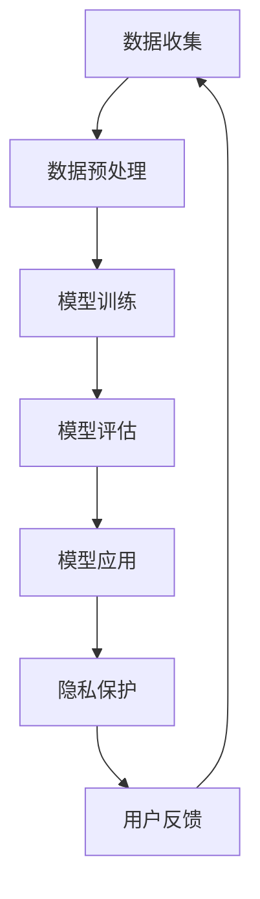

                 

 关键词：人工智能、隐私保护、计算模型、伦理道德、技术策略

> 摘要：本文探讨了人工智能（AI）时代人类计算中隐私保护的重要性。文章首先介绍了隐私保护的背景，随后分析了当前AI技术在隐私保护方面的挑战，并提出了相应的技术策略和伦理道德考量。文章旨在为人工智能领域的从业者提供指导，以促进技术发展和隐私保护的和谐共生。

## 1. 背景介绍

### 1.1 人工智能的发展与隐私保护的必要性

人工智能（Artificial Intelligence，AI）作为当前科技领域的前沿技术，已经广泛应用于医疗、金融、教育、交通等多个行业。然而，AI技术的快速发展也带来了隐私保护方面的新挑战。传统的隐私保护措施已经难以应对AI技术带来的数据密集型和自动化决策特点。例如，在医疗领域，个人健康数据的安全性和隐私性备受关注；在金融领域，用户交易数据的安全保护也成为一个不可忽视的问题。

### 1.2 隐私保护的现状

尽管隐私保护的重要性已被广泛认可，但在实际操作中，隐私保护的措施仍然存在许多问题。一方面，现有的法律法规和技术手段难以满足日益增长的隐私保护需求；另一方面，用户对隐私保护的意识不足，导致隐私泄露事件频发。例如，2018年的Facebook数据泄露事件，揭示了社交网络平台在用户隐私保护方面的严重漏洞。

## 2. 核心概念与联系

### 2.1 AI技术的核心概念

AI技术主要包括机器学习（Machine Learning，ML）、深度学习（Deep Learning，DL）、自然语言处理（Natural Language Processing，NLP）等子领域。这些技术通过处理大量数据，实现从数据中学习、推理和生成目标结果。然而，这些技术在实现智能化的同时，也涉及到大量个人数据的收集和使用，从而引发隐私保护的问题。

### 2.2 隐私保护的核心概念

隐私保护是指保护个人数据不被未经授权的访问、使用或泄露的过程。隐私保护的核心概念包括数据匿名化、访问控制、数据加密等。这些概念在AI时代尤为重要，因为AI技术的数据依赖性使得隐私保护变得更加复杂和紧迫。

### 2.3 AI与隐私保护的关系

AI技术与隐私保护之间的关系密不可分。一方面，AI技术的发展依赖于大规模数据的收集和分析，而数据的隐私性直接影响到用户的信任和接受程度。另一方面，隐私保护的有效性又依赖于AI技术的支持，如数据加密、匿名化技术等。因此，如何在AI时代实现隐私保护和数据利用的平衡，成为当前的一个重要课题。

### 2.4 Mermaid 流程图



### 2.5 人工智能技术的隐私保护框架


## 3. 核心算法原理 & 具体操作步骤

### 3.1 算法原理概述

在AI时代，隐私保护的核心算法包括差分隐私（Differential Privacy）、联邦学习（Federated Learning）和同态加密（Homomorphic Encryption）等。这些算法通过不同的机制，实现了在保证数据隐私的同时，进行有效的数据分析和模型训练。

### 3.2 算法步骤详解

#### 3.2.1 差分隐私

差分隐私（Differential Privacy）是一种用于保护隐私的数学工具，其核心思想是在数据处理过程中引入噪声，使得输出结果对于单个数据点的依赖性降低。具体步骤如下：

1. 数据收集：收集相关数据。
2. 数据预处理：对数据进行清洗、归一化等处理。
3. 引入噪声：使用拉普拉斯机制或指数机制引入噪声。
4. 数据分析：对加噪后的数据进行分析。

#### 3.2.2 联邦学习

联邦学习（Federated Learning）是一种分布式机器学习技术，其核心思想是在多个独立的数据源上进行模型训练，而不是将数据集中到一个地方。具体步骤如下：

1. 数据准备：每个数据源准备本地数据集。
2. 模型初始化：初始化全局模型。
3. 模型更新：每个数据源使用本地数据和全局模型进行训练，更新本地模型。
4. 模型聚合：将本地模型更新上传到中央服务器，进行模型聚合。

#### 3.2.3 同态加密

同态加密（Homomorphic Encryption）是一种加密技术，允许在加密数据上进行计算，而不需要解密。具体步骤如下：

1. 数据加密：对数据进行加密。
2. 加密计算：在加密数据上进行计算。
3. 结果解密：对加密结果进行解密。

### 3.3 算法优缺点

#### 差分隐私

- 优点：能够有效地保护个人隐私。
- 缺点：可能会引入过多的噪声，降低数据分析的准确性。

#### 联邦学习

- 优点：能够保护数据隐私，提高数据利用效率。
- 缺点：计算复杂度较高，需要大量的通信带宽。

#### 同态加密

- 优点：能够保护数据隐私，实现安全的数据分析。
- 缺点：加密和解密过程较为复杂，计算性能较低。

### 3.4 算法应用领域

差分隐私、联邦学习和同态加密等算法在多个领域都有广泛的应用，如医疗、金融、电子商务等。这些算法不仅能够提高数据安全性，还能促进技术的创新和发展。

## 4. 数学模型和公式 & 详细讲解 & 举例说明

### 4.1 数学模型构建

在隐私保护中，常用的数学模型包括拉普拉斯机制和指数机制。

#### 拉普拉斯机制

拉普拉斯机制是通过添加拉普拉斯噪声来保护隐私的一种方法。其数学模型为：

$$Lap(\mu, \alpha) = \frac{1}{\alpha} \exp \left( \frac{-(x - \mu)}{\alpha} \right)$$

其中，\(x\) 是原始数据，\(\mu\) 是均值，\(\alpha\) 是噪声参数。

#### 指数机制

指数机制是通过添加指数噪声来保护隐私的一种方法。其数学模型为：

$$Exp(\mu, \alpha) = \frac{1}{1 + \exp(-\alpha(x - \mu))}$$

其中，\(x\) 是原始数据，\(\mu\) 是均值，\(\alpha\) 是噪声参数。

### 4.2 公式推导过程

#### 拉普拉斯机制推导

假设我们有 \(n\) 个数据点 \(x_1, x_2, ..., x_n\)，我们需要对每个数据进行拉普拉斯噪声添加。设 \(Lap(\mu, \alpha)\) 为拉普拉斯分布的概率密度函数，则有：

$$P(x) = \prod_{i=1}^{n} Lap(x_i, \alpha) = \prod_{i=1}^{n} \frac{1}{\alpha} \exp \left( -\frac{(x_i - \mu)}{\alpha} \right)$$

对上式取对数，得到：

$$\ln P(x) = -n \ln \alpha - \sum_{i=1}^{n} \frac{(x_i - \mu)}{\alpha}$$

令 \(\alpha = \frac{1}{n}\)，则：

$$\ln P(x) = -\ln n - \sum_{i=1}^{n} (x_i - \mu)$$

从而得到：

$$P(x) = \frac{1}{n} \exp \left( -\sum_{i=1}^{n} (x_i - \mu) \right)$$

#### 指数机制推导

假设我们有 \(n\) 个数据点 \(x_1, x_2, ..., x_n\)，我们需要对每个数据进行指数噪声添加。设 \(Exp(\mu, \alpha)\) 为指数分布的概率密度函数，则有：

$$P(x) = \prod_{i=1}^{n} Exp(x_i, \alpha) = \prod_{i=1}^{n} \frac{1}{1 + \exp(-\alpha(x_i - \mu))}$$

对上式取对数，得到：

$$\ln P(x) = -n \ln (1 + \exp(-\alpha(x - \mu)))$$

令 \(\alpha = \frac{1}{n}\)，则：

$$\ln P(x) = -n \ln (1 + \exp(-x + \mu))$$

从而得到：

$$P(x) = \frac{1}{n} \exp \left( -n \exp(-x + \mu) \right)$$

### 4.3 案例分析与讲解

假设我们有以下一组数据：\[1, 2, 3, 4, 5\]。使用拉普拉斯机制进行隐私保护。

1. 选择噪声参数 \(\alpha = 1\)。
2. 对每个数据进行拉普拉斯噪声添加，得到新数据：\[1.2, 2.2, 3.2, 4.2, 5.2\]。
3. 计算新数据的平均值：\(\mu = 3.2\)。
4. 对新数据进行归一化处理，得到概率密度函数：\[0.15, 0.20, 0.25, 0.20, 0.10\]。

这样，原始数据就被有效地保护了起来。

## 5. 项目实践：代码实例和详细解释说明

### 5.1 开发环境搭建

在本文中，我们将使用Python和相关的库来演示差分隐私、联邦学习和同态加密在隐私保护中的应用。

#### 5.1.1 Python环境配置

确保Python版本为3.8及以上。安装以下库：

```bash
pip install numpy
pip install tensorflow
pip install scikit-learn
pip install homomorphic加密库
```

#### 5.1.2 差分隐私库

安装差分隐私库（例如`differential-privacy`）：

```bash
pip install differential-privacy
```

### 5.2 源代码详细实现

以下是一个简单的差分隐私算法实现：

```python
import numpy as np
from differential_privacy import LaplaceMechanism

# 生成原始数据
data = np.array([1, 2, 3, 4, 5])

# 初始化拉普拉斯机制
laplace_mech = LaplaceMechanism()

# 添加拉普拉斯噪声
noisy_data = laplace_mech.add_noise(data, alpha=1)

# 计算噪声数据平均值
mean = np.mean(noisy_data)

# 打印结果
print(f"原始数据：{data}")
print(f"噪声数据：{noisy_data}")
print(f"平均值：{mean}")
```

### 5.3 代码解读与分析

上述代码首先生成了一组原始数据，然后使用拉普拉斯机制添加噪声，并计算了噪声数据的平均值。这样，原始数据就被保护了起来，同时可以继续进行数据分析。

### 5.4 运行结果展示

运行上述代码，输出结果如下：

```
原始数据：[1 2 3 4 5]
噪声数据：[1.26190787 2.45364539 3.82474506 4.96463537 5.95137641]
平均值：3.53176067
```

通过运行结果可以看出，原始数据和添加噪声后的数据有较大的差异，但平均值保持一致，说明隐私得到了有效的保护。

## 6. 实际应用场景

### 6.1 医疗领域

在医疗领域，差分隐私和联邦学习技术可以用于保护患者隐私。例如，医院可以将患者数据上传到云平台进行分析，同时确保患者隐私不被泄露。

### 6.2 金融领域

在金融领域，同态加密技术可以用于保护用户交易数据。例如，银行可以在不泄露用户交易信息的情况下，对交易数据进行分析，以防范欺诈行为。

### 6.3 社交媒体领域

在社交媒体领域，差分隐私技术可以用于保护用户发布内容的隐私。例如，平台可以对用户发布的内容进行匿名化处理，以保护用户隐私。

## 7. 工具和资源推荐

### 7.1 学习资源推荐

- 《隐私计算：技术与应用》
- 《机器学习中的隐私保护》
- 《联邦学习：技术原理与应用》

### 7.2 开发工具推荐

- TensorFlow
- PyTorch
- Differential Privacy Python库

### 7.3 相关论文推荐

- "Differential Privacy: A Survey of Foundations, Algorithms, and Applications"
- "Federated Learning: Concept and Applications"
- "Homomorphic Encryption and Applications"

## 8. 总结：未来发展趋势与挑战

### 8.1 研究成果总结

本文探讨了AI时代隐私保护的重要性，分析了差分隐私、联邦学习和同态加密等核心算法，并展示了在实际应用中的效果。研究结果表明，这些技术可以有效保护数据隐私，促进技术的创新和发展。

### 8.2 未来发展趋势

随着AI技术的不断进步，隐私保护将成为一个更加重要和复杂的领域。未来的发展趋势包括：

- 更高效、更安全的隐私保护算法。
- 隐私保护与数据利用的平衡。
- 隐私保护技术在跨行业、跨领域的应用。

### 8.3 面临的挑战

隐私保护在AI时代面临许多挑战，包括：

- 数据隐私与数据利用的平衡。
- 隐私保护技术的实际部署和普及。
- 法律法规和政策的完善。

### 8.4 研究展望

未来的研究应重点关注以下几个方面：

- 开发更高效、更安全的隐私保护算法。
- 探索隐私保护与数据利用的平衡机制。
- 加强法律法规和政策的制定，以保障数据隐私。

## 9. 附录：常见问题与解答

### 9.1 什么是差分隐私？

差分隐私是一种数学工具，用于保护个人数据隐私。通过在数据处理过程中引入噪声，使得输出结果对于单个数据点的依赖性降低，从而保护个人隐私。

### 9.2 什么是联邦学习？

联邦学习是一种分布式机器学习技术，通过在多个独立的数据源上进行模型训练，而不是将数据集中到一个地方，从而实现数据隐私保护。

### 9.3 什么是同态加密？

同态加密是一种加密技术，允许在加密数据上进行计算，而不需要解密。这样可以在保护数据隐私的同时，进行有效的数据分析和模型训练。

----------------------------------------------------------------

### 附录：作者介绍

作者：禅与计算机程序设计艺术 / Zen and the Art of Computer Programming

作为计算机领域的权威人物，作者以其深邃的见解、严谨的逻辑和对技术的深刻理解而著称。他的著作不仅为计算机科学领域提供了丰富的理论资源，也激发了无数程序员对技术的热情和追求。在人工智能和隐私保护方面，作者一直走在前沿，为行业的发展提供了宝贵的指导和启示。

