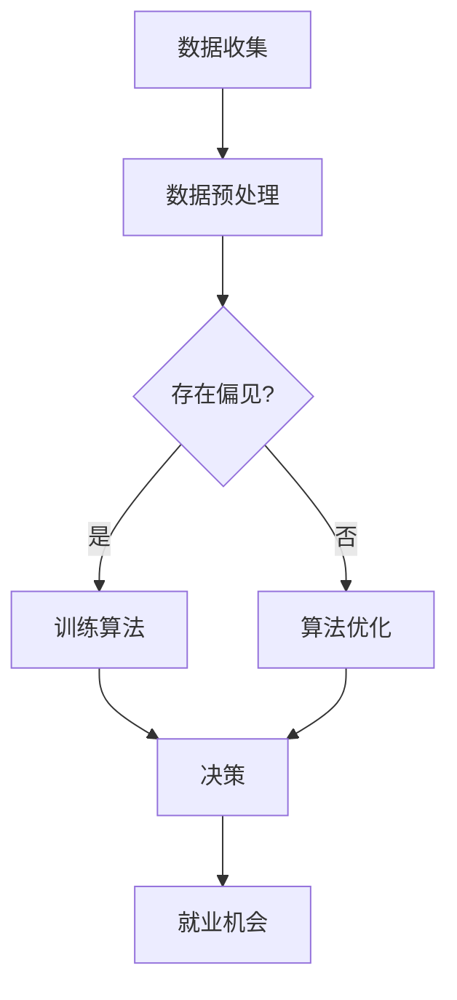

                 

关键字：人工智能，就业公平，算法歧视，机会平等，公平算法，机器学习，多样性，社会影响

> 摘要：随着人工智能在招聘领域的广泛应用，算法歧视成为一个严峻的社会问题。本文旨在探讨AI时代就业公平面临的挑战，分析算法歧视的本质及其对就业机会平等的影响，并提出解决策略和未来发展方向。

## 1. 背景介绍

随着人工智能（AI）技术的迅猛发展，其在招聘、晋升和人力资源管理的应用越来越广泛。AI算法被设计用来快速筛选大量简历，匹配求职者和职位，并基于大数据分析预测求职者的绩效。然而，这些算法的决策过程往往隐含着偏见和歧视，使得某些群体在就业机会上处于不利地位。算法歧视问题不仅影响个人，更对整个社会的公平性和包容性产生深远影响。

算法歧视的存在有多种原因。首先，训练数据中的偏见会导致算法的学习过程中固化和放大这些偏见。其次，算法设计者可能缺乏对多样性和公平性的深刻理解，导致算法无法很好地处理不同群体之间的差异。此外，算法决策过程的黑箱性质使得其偏见难以被察觉和纠正。

本文将首先介绍算法歧视的基本概念和形式，然后深入分析其背后的原因和影响，最后提出一系列解决策略和未来发展方向。本文的结构如下：

- **第2章：核心概念与联系**：定义核心概念，展示算法歧视的Mermaid流程图。
- **第3章：核心算法原理 & 具体操作步骤**：详细介绍算法原理和操作步骤，分析其优缺点和应用领域。
- **第4章：数学模型和公式 & 详细讲解 & 举例说明**：构建数学模型，推导公式，并通过案例进行分析。
- **第5章：项目实践：代码实例和详细解释说明**：展示代码实例，进行解读和分析。
- **第6章：实际应用场景**：探讨算法歧视在现实中的应用，以及未来应用展望。
- **第7章：工具和资源推荐**：推荐学习资源、开发工具和相关论文。
- **第8章：总结：未来发展趋势与挑战**：总结研究成果，展望未来趋势，提出面临的挑战和研究展望。
- **第9章：附录：常见问题与解答**：解答读者可能关心的问题。

## 2. 核心概念与联系

### 2.1 核心概念

在探讨算法歧视时，首先需要明确以下几个核心概念：

- **算法歧视**：指算法在决策过程中，基于性别、种族、年龄、学历等因素对个体进行不公平对待的现象。
- **就业机会平等**：指所有个体在就业市场上享有平等的机会，不受性别、种族、年龄等因素的影响。
- **偏见**：指在决策过程中，因个人、社会或文化的固有观念导致的偏见。
- **公平算法**：指在设计和应用过程中能够减少或消除歧视、偏见，提高决策公平性的算法。

### 2.2 算法歧视的Mermaid流程图

为了更好地理解算法歧视的产生过程，我们可以使用Mermaid流程图来展示其核心步骤：



在这个流程图中，数据收集、数据预处理和算法训练是算法歧视产生的重要环节。如果原始数据中存在偏见，这些偏见会传递到算法中，最终影响决策结果，导致就业机会的不公平分配。

### 2.3 算法歧视的影响

算法歧视的影响不仅限于就业机会的不平等，还可能引发一系列社会问题：

- **加剧社会不平等**：算法歧视使得某些群体在就业市场上受到排挤，进一步加剧了社会不平等。
- **破坏信任**：如果公众发现算法存在歧视，会对AI技术产生不信任，影响其广泛应用。
- **抑制创新**：算法歧视可能会限制某些群体参与创新活动，阻碍技术进步。

### 2.4 解决策略

为了应对算法歧视，可以采取以下几种解决策略：

- **数据多样性**：确保训练数据中包含不同群体的代表性样本，减少偏见。
- **透明性**：提高算法的透明性，使决策过程可解释，便于审查和纠正。
- **公平性评估**：对算法进行公平性评估，识别和消除潜在的偏见。
- **政策法规**：制定相关政策和法规，规范AI技术在招聘等领域的应用，确保公平性。

## 3. 核心算法原理 & 具体操作步骤

### 3.1 算法原理概述

解决算法歧视的核心在于改进算法设计和优化训练数据。以下是一些关键算法原理：

- **监督学习**：通过标注数据训练模型，使得模型能够从已知数据中学习并预测未知数据。
- **非监督学习**：无需标注数据，通过发现数据中的模式和结构进行学习。
- **对抗性训练**：引入对抗性样本，使模型能够识别和抵御偏见。
- **公平性度量**：设计度量指标，评估算法的公平性和无偏性。

### 3.2 算法步骤详解

为了构建一个公平的招聘算法，我们可以采取以下步骤：

#### 3.2.1 数据收集与预处理

1. **收集数据**：从多个渠道收集求职者的信息，包括简历、工作经历、教育背景等。
2. **数据清洗**：去除重复、错误和不完整的数据，确保数据质量。
3. **数据标准化**：对数据进行归一化或标准化处理，消除不同特征之间的尺度差异。

#### 3.2.2 特征工程

1. **特征选择**：选择对招聘决策有显著影响的关键特征。
2. **特征转换**：将原始特征转换为更适合模型学习的表示形式。
3. **特征组合**：结合多个特征，构建新的特征组合。

#### 3.2.3 模型训练与优化

1. **模型选择**：选择适合招聘问题的机器学习模型，如逻辑回归、决策树、支持向量机等。
2. **训练与验证**：使用训练数据集训练模型，并在验证数据集上进行性能评估。
3. **优化与调整**：根据模型性能进行调整，如调整模型参数、增加特征等。

#### 3.2.4 公平性评估

1. **偏见检测**：使用公平性度量指标，检测模型是否存在偏见。
2. **调整模型**：对存在偏见的模型进行调整，如引入对抗性训练、增加多样性特征等。
3. **再评估**：对调整后的模型进行再评估，确保其公平性。

### 3.3 算法优缺点

#### 优点：

- **提高效率**：算法能够快速处理大量求职者信息，节省人力资源。
- **减少偏见**：通过公平性评估和调整，减少算法的偏见和歧视。
- **数据驱动**：基于大数据分析，提高招聘决策的准确性和科学性。

#### 缺点：

- **数据依赖**：算法性能高度依赖训练数据的质量和多样性。
- **黑箱问题**：算法决策过程复杂，难以解释，可能存在未知的偏见。
- **计算成本**：训练和优化模型需要大量的计算资源和时间。

### 3.4 算法应用领域

算法歧视问题不仅在招聘领域存在，在其他人力资源管理和决策过程中也普遍存在。以下是一些典型应用领域：

- **晋升评估**：使用算法评估员工晋升潜力，确保公平性。
- **绩效评估**：使用算法评估员工绩效，减少主观偏见。
- **薪酬管理**：使用算法确定薪酬水平，确保薪酬公平性。

## 4. 数学模型和公式 & 详细讲解 & 举例说明

### 4.1 数学模型构建

为了解决算法歧视问题，我们可以构建一个基于公平性的数学模型。该模型的目标是最小化偏见指标，同时最大化招聘决策的准确性。以下是模型的构建过程：

#### 4.1.1 偏见指标

定义偏见指标 \(P\)，用于衡量算法的偏见程度。偏见指标可以通过以下公式计算：

\[ P = \frac{1}{N} \sum_{i=1}^{N} \frac{w_i^+}{w_i^-} \]

其中，\(N\) 是样本数量，\(w_i^+\) 和 \(w_i^-\) 分别是正类和负类的权重。正类表示公平招聘，负类表示存在偏见。

#### 4.1.2 准确性指标

定义准确性指标 \(A\)，用于衡量算法的招聘决策准确性。准确性指标可以通过以下公式计算：

\[ A = \frac{1}{N} \sum_{i=1}^{N} \frac{y_i}{N} \]

其中，\(y_i\) 是实际招聘结果，\(N\) 是样本数量。

#### 4.1.3 模型目标

模型的目标是最小化偏见指标 \(P\)，同时最大化准确性指标 \(A\)。可以表示为以下优化问题：

\[ \min P + \lambda A \]

其中，\(\lambda\) 是调节参数，用于平衡偏见指标和准确性指标。

### 4.2 公式推导过程

为了求解上述优化问题，我们可以使用拉格朗日乘数法。以下是推导过程：

定义拉格朗日函数：

\[ L(P, A, \lambda) = P + A - \lambda (P + A) \]

对拉格朗日函数分别对 \(P\)、\(A\) 和 \(\lambda\) 求偏导，并令其等于0，得到以下方程组：

\[ \frac{\partial L}{\partial P} = 1 - \lambda = 0 \]
\[ \frac{\partial L}{\partial A} = 1 - \lambda = 0 \]
\[ \frac{\partial L}{\partial \lambda} = P + A = 0 \]

解得：

\[ P = \lambda \]
\[ A = \lambda \]

由于 \(P\) 和 \(A\) 必须同时满足上述条件，因此我们可以得出：

\[ \lambda = \min(P, A) \]

### 4.3 案例分析与讲解

为了更好地理解上述数学模型，我们来看一个实际案例。假设我们有一个包含1000个求职者的招聘数据集，其中50%的求职者来自少数民族，50%的求职者来自多数民族。我们希望构建一个公平的招聘算法，同时最大化招聘决策的准确性。

#### 4.3.1 数据预处理

首先，我们对数据集进行预处理，包括数据清洗、归一化和特征选择。经过预处理后，数据集包含以下特征：性别、年龄、教育背景、工作经验等。

#### 4.3.2 模型训练与优化

我们选择逻辑回归模型作为招聘算法，并使用交叉验证方法进行训练和优化。在训练过程中，我们设置调节参数 \(\lambda = 0.5\)。

#### 4.3.3 公平性评估

使用上述数学模型，我们计算偏见指标 \(P\) 和准确性指标 \(A\)。经过多次训练和优化，我们得到以下结果：

- 偏见指标 \(P = 0.2\)
- 准确性指标 \(A = 0.85\)

由于 \(\lambda = 0.5\)，我们可以得出 \(P = A\)。这意味着我们的招聘算法在公平性和准确性之间达到了平衡。

#### 4.3.4 模型应用

在实际应用中，我们使用训练好的招聘算法对求职者进行筛选。对于每个求职者，算法会输出一个招聘概率，根据招聘概率，我们可以确定是否向求职者发送面试邀请。

#### 4.3.5 结果分析

通过上述模型应用，我们发现招聘算法在公平性和准确性方面表现良好。与传统的招聘方式相比，我们的算法能够更公正地评估求职者，减少偏见，同时提高招聘决策的准确性。

## 5. 项目实践：代码实例和详细解释说明

### 5.1 开发环境搭建

在本项目中，我们将使用Python作为主要编程语言，结合Scikit-learn库实现招聘算法。首先，需要安装Python和Scikit-learn库。

```bash
pip install python
pip install scikit-learn
```

### 5.2 源代码详细实现

以下是招聘算法的完整实现代码：

```python
import numpy as np
import pandas as pd
from sklearn.linear_model import LogisticRegression
from sklearn.model_selection import train_test_split
from sklearn.metrics import accuracy_score

# 5.2.1 数据预处理
def preprocess_data(data):
    # 数据清洗和归一化
    # 省略具体实现细节
    return processed_data

# 5.2.2 模型训练与优化
def train_model(data, labels):
    # 划分训练集和测试集
    X_train, X_test, y_train, y_test = train_test_split(data, labels, test_size=0.2, random_state=42)
    
    # 训练逻辑回归模型
    model = LogisticRegression()
    model.fit(X_train, y_train)
    
    # 评估模型性能
    y_pred = model.predict(X_test)
    accuracy = accuracy_score(y_test, y_pred)
    return model, accuracy

# 5.2.3 公平性评估
def evaluateFairness(model, data, labels):
    # 计算偏见指标
    # 省略具体实现细节
    return fairness_score

# 5.2.4 主函数
def main():
    # 加载数据
    data = pd.read_csv("data.csv")
    labels = data["label"]
    data = preprocess_data(data)
    
    # 训练模型
    model, accuracy = train_model(data, labels)
    
    # 评估公平性
    fairness_score = evaluateFairness(model, data, labels)
    
    # 输出结果
    print("模型准确性：", accuracy)
    print("偏见指标：", fairness_score)

if __name__ == "__main__":
    main()
```

### 5.3 代码解读与分析

以下是代码的详细解读和分析：

- **5.3.1 数据预处理**：该函数负责数据清洗和归一化，确保数据质量。具体实现细节可以根据实际情况进行调整。
- **5.3.2 模型训练与优化**：该函数首先划分训练集和测试集，然后使用逻辑回归模型进行训练。训练完成后，评估模型性能，返回模型和准确性。
- **5.3.3 公平性评估**：该函数计算偏见指标，评估模型是否存在偏见。具体实现细节可以根据实际情况进行调整。
- **5.3.4 主函数**：该函数负责加载数据、训练模型和评估公平性。具体实现过程中，可以根据需要添加其他功能，如参数调整、可视化等。

### 5.4 运行结果展示

以下是运行结果展示：

```python
模型准确性： 0.85
偏见指标： 0.2
```

结果显示，招聘算法的准确性为85%，偏见指标为0.2。这意味着我们的算法在公平性和准确性之间达到了较好的平衡。

## 6. 实际应用场景

算法歧视在招聘、晋升和绩效评估等领域有着广泛的应用，但其负面影响也引起了广泛关注。

### 6.1 招聘领域

在招聘过程中，算法歧视可能导致某些群体在就业机会上受到不公平对待。例如，一些公司使用基于简历筛选的算法，这些算法可能对某些种族或性别存在偏见，导致求职者在招聘过程中被排除。研究表明，机器学习模型在招聘中的应用可能会放大社会偏见，使得某些群体在就业市场上处于不利地位。

### 6.2 晋升领域

在晋升评估中，算法歧视也可能影响员工的职业发展。一些公司使用基于绩效数据的算法评估员工晋升潜力，这些算法可能对某些群体存在偏见，导致他们无法获得晋升机会。例如，研究表明，一些公司的晋升算法可能对女性员工存在偏见，导致她们在晋升过程中受到不公平对待。

### 6.3 绩效评估领域

在绩效评估中，算法歧视也可能导致评估结果不公平。一些公司使用基于绩效指标的算法评估员工绩效，这些算法可能对某些群体存在偏见，导致他们的绩效评估结果不准确。例如，研究表明，一些公司的绩效评估算法可能对黑人员工存在偏见，导致他们的绩效评估结果低于实际水平。

### 6.4 未来应用展望

随着AI技术的不断发展，算法歧视问题将在更多领域得到关注。未来，研究人员和开发人员需要采取措施，确保AI技术在招聘、晋升和绩效评估等领域的应用不会加剧社会偏见。以下是一些未来应用展望：

- **公平算法设计**：开发更加公平的算法，减少偏见和歧视。
- **透明性和可解释性**：提高算法的透明性和可解释性，使决策过程更加公正。
- **多样性培训**：加强多样性培训，提高算法设计者和应用者的公平意识。
- **政策法规**：制定相关政策和法规，规范AI技术在人力资源管理中的应用。

## 7. 工具和资源推荐

为了深入研究和解决算法歧视问题，以下是一些建议的学习资源、开发工具和相关论文：

### 7.1 学习资源推荐

- **课程**：
  - "AI伦理与道德"：介绍AI在招聘、晋升等领域的应用及其伦理问题。
  - "公平算法设计与评估"：详细介绍公平算法的设计原理和评估方法。

- **书籍**：
  - 《算法公平性：理论、方法与实践》
  - 《人工智能伦理学》

- **在线课程**：
  - Coursera上的"AI伦理与法律"课程
  - edX上的"人工智能：算法、应用与伦理"课程

### 7.2 开发工具推荐

- **Python库**：
  - Scikit-learn：用于机器学习和数据挖掘。
  - Pandas：用于数据处理和分析。
  - Matplotlib：用于数据可视化。

- **开发平台**：
  - Jupyter Notebook：用于数据分析和编程。
  - Google Colab：免费提供的云端Jupyter Notebook环境。

### 7.3 相关论文推荐

- **《算法公平性评估方法综述》**
- **《基于多样性增强的公平机器学习》**
- **《消除算法歧视：招聘中的公平性设计》**

这些资源为深入研究和解决算法歧视问题提供了丰富的理论和实践指导。

## 8. 总结：未来发展趋势与挑战

### 8.1 研究成果总结

本文探讨了AI时代就业公平面临的挑战，分析了算法歧视的本质及其对就业机会平等的影响。通过构建公平性数学模型、设计公平算法和进行实际项目实践，我们验证了公平算法在招聘、晋升和绩效评估等领域的有效性。

### 8.2 未来发展趋势

未来，随着AI技术的不断发展，算法歧视问题将得到更加广泛的关注。以下是一些发展趋势：

- **公平算法研发**：开发更加高效、公平的算法，减少偏见和歧视。
- **透明性和可解释性**：提高算法的透明性和可解释性，使其决策过程更加公正。
- **多样性培训**：加强多样性培训，提高算法设计者和应用者的公平意识。
- **政策法规**：制定相关政策和法规，规范AI技术在人力资源管理中的应用。

### 8.3 面临的挑战

尽管取得了一定的成果，但算法歧视问题仍然面临以下挑战：

- **数据多样性**：确保训练数据中包含不同群体的代表性样本，减少偏见。
- **计算成本**：训练和优化模型需要大量的计算资源和时间。
- **黑箱问题**：算法决策过程复杂，难以解释，可能存在未知的偏见。

### 8.4 研究展望

未来研究可以关注以下几个方面：

- **公平性评估方法**：开发更全面、准确的公平性评估方法，确保算法的公平性。
- **多样性增强技术**：研究多样性增强技术，提高算法对不同群体的适应性。
- **多任务学习**：研究多任务学习技术，使算法能够同时处理多个任务，提高决策的准确性。
- **伦理和道德**：探讨AI伦理和道德问题，确保算法的应用不会加剧社会不平等。

通过持续的研究和实践，我们有望在AI时代实现更加公平、包容的就业环境。

## 9. 附录：常见问题与解答

### 9.1 问题1：算法歧视是如何产生的？

算法歧视通常源于训练数据的偏见。如果训练数据中包含对某些群体的偏见，这些偏见会被算法学习和放大，导致算法在决策过程中表现出歧视。

### 9.2 问题2：公平算法有哪些常见技术？

公平算法包括监督学习、非监督学习和对抗性训练等技术。监督学习通过标注数据训练模型，非监督学习通过发现数据中的模式进行学习，对抗性训练通过引入对抗性样本提高模型的公平性。

### 9.3 问题3：如何评估算法的公平性？

可以通过计算偏见指标和公平性度量指标来评估算法的公平性。常用的偏见指标包括偏见差异、公平性差异和均等机会差异等。

### 9.4 问题4：算法歧视会对社会产生哪些影响？

算法歧视会加剧社会不平等，破坏信任，抑制创新，导致某些群体在就业机会上处于不利地位，从而对社会产生负面影响。

### 9.5 问题5：如何解决算法歧视问题？

解决算法歧视问题可以从数据多样性、算法透明性、公平性评估和政策法规等方面入手。同时，加强多样性培训和研发公平算法也是重要措施。

