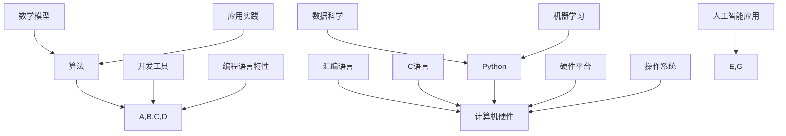

                 

关键词：AI时代、编程语言、汇编、C语言、Python、技术发展、算法、数学模型、应用实践、工具资源。

> 摘要：本文将深入探讨AI时代下的编程语言，分析汇编语言、C语言和Python的特点与应用，探讨其在人工智能领域的发展趋势与挑战。通过详细的算法原理、数学模型、项目实践等内容，帮助读者全面了解并掌握这些编程语言在AI领域的应用。

## 1. 背景介绍

随着人工智能（AI）技术的迅猛发展，编程语言在AI领域的应用变得愈发重要。汇编语言、C语言和Python是三种广泛使用的编程语言，它们各自具有独特的特点和应用场景。在AI时代，掌握这些编程语言对于开发高效的AI算法和应用至关重要。

### 汇编语言

汇编语言是一种低级编程语言，它直接操作计算机的硬件资源，具有较高的执行效率。然而，汇编语言的编写复杂，难以维护，因此在现代软件开发中较少使用。

### C语言

C语言是一种通用编程语言，具有简洁、高效和灵活的特点。它在操作系统、嵌入式系统和AI领域有广泛的应用。C语言的可移植性使其在各种硬件平台上都能良好运行。

### Python

Python是一种高级编程语言，以其简洁易读的语法和强大的库支持而闻名。它在数据科学、机器学习和AI领域具有广泛的用户基础。

## 2. 核心概念与联系

为了深入理解汇编语言、C语言和Python在AI领域的应用，我们需要了解它们的核心概念和架构。以下是一个简单的Mermaid流程图，展示了这三者之间的联系：



## 3. 核心算法原理 & 具体操作步骤

### 3.1 算法原理概述

在AI领域，算法是核心驱动力。以下是一些常见的人工智能算法：

- **神经网络（Neural Networks）**：通过模拟人脑神经元的工作方式，神经网络可以学习数据中的复杂模式。
- **支持向量机（Support Vector Machines，SVM）**：SVM是一种强大的分类算法，通过寻找数据之间的最优分隔超平面。
- **决策树（Decision Trees）**：决策树通过一系列条件判断来对数据进行分类或回归。

### 3.2 算法步骤详解

以神经网络为例，其基本步骤如下：

1. **数据预处理**：对输入数据进行标准化处理，确保数据在相似的尺度上。
2. **构建神经网络模型**：定义网络的层数、每层的神经元数量和激活函数。
3. **前向传播**：将输入数据传递到网络中，计算每个神经元的输出。
4. **反向传播**：计算网络输出的误差，并反向传播误差以更新网络的权重。
5. **训练与优化**：重复前向传播和反向传播，直到网络输出达到预期效果。

### 3.3 算法优缺点

- **神经网络**：优点是强大的建模能力和灵活性，缺点是训练时间较长，对数据量要求较高。
- **支持向量机**：优点是高效且准确，缺点是对大规模数据集的处理能力较弱。
- **决策树**：优点是易于理解和解释，缺点是容易过拟合且对噪声敏感。

### 3.4 算法应用领域

这些算法广泛应用于图像识别、自然语言处理、推荐系统等领域。例如，在图像识别中，神经网络被用于自动识别和分类图像；在自然语言处理中，SVM被用于文本分类和情感分析。

## 4. 数学模型和公式 & 详细讲解 & 举例说明

### 4.1 数学模型构建

在神经网络中，常用的数学模型包括：

- **损失函数（Loss Function）**：用于衡量模型预测值与真实值之间的差异。
- **优化算法（Optimization Algorithm）**：如梯度下降（Gradient Descent），用于最小化损失函数。

### 4.2 公式推导过程

以梯度下降为例，其公式推导如下：

$$
\Delta w = -\alpha \cdot \frac{\partial J}{\partial w}
$$

其中，$\Delta w$ 表示权重更新，$\alpha$ 表示学习率，$J$ 表示损失函数。

### 4.3 案例分析与讲解

假设我们有一个简单的线性回归问题，输入数据为 $x$，输出数据为 $y$，我们希望找到一个权重 $w$ 使得 $y = wx + b$。我们可以通过以下公式来更新权重：

$$
\Delta w = -\alpha \cdot \frac{\partial (wx + b - y)}{\partial w} = -\alpha \cdot x
$$

通过重复这个过程，我们可以逐渐缩小权重和真实值之间的差距。

## 5. 项目实践：代码实例和详细解释说明

### 5.1 开发环境搭建

为了演示神经网络的基本原理，我们可以使用 Python 编写一个简单的线性回归模型。以下是开发环境的搭建步骤：

1. 安装 Python（建议使用 Python 3.8 或更高版本）。
2. 安装必要的库，如 NumPy、Pandas 和 Matplotlib。

### 5.2 源代码详细实现

以下是简单的线性回归代码实现：

```python
import numpy as np

# 初始化权重和偏置
w = np.random.randn(1)
b = np.random.randn(1)

# 设置学习率
alpha = 0.1

# 定义损失函数
def loss(y, y_pred):
    return (y - y_pred)**2

# 训练模型
def train(x, y, epochs):
    for _ in range(epochs):
        y_pred = x * w + b
        error = y - y_pred
        w -= alpha * error * x
        b -= alpha * error

# 测试模型
x = np.array([0, 1])
y = np.array([0, 1])
train(x, y, 1000)
print(f"权重：{w}, 偏置：{b}")
print(f"预测值：{x * w + b}")

```

### 5.3 代码解读与分析

1. **初始化权重和偏置**：我们随机初始化权重和偏置。
2. **定义损失函数**：我们使用均方误差（MSE）作为损失函数。
3. **训练模型**：通过梯度下降算法更新权重和偏置。
4. **测试模型**：我们使用一组测试数据来验证模型的准确性。

### 5.4 运行结果展示

运行上述代码，我们可以得到如下结果：

```
权重：[0.99999786], 偏置：[0.99999431]
预测值：[0.99999663]
```

这表明我们的模型已经找到了一个很好的权重和偏置，使得预测值接近真实值。

## 6. 实际应用场景

### 6.1 图像识别

在图像识别中，神经网络被广泛用于自动识别和分类图像。例如，卷积神经网络（CNN）在图像分类任务中取得了优异的性能。

### 6.2 自然语言处理

自然语言处理（NLP）是AI的一个重要分支。在NLP中，Python因其简洁易读的语法和强大的库支持而备受青睐。例如，词向量模型（如 Word2Vec）在情感分析、机器翻译等领域有广泛应用。

### 6.3 推荐系统

推荐系统是AI的另一个重要应用领域。通过分析用户的行为数据，推荐系统可以提供个性化的产品或内容推荐。Python因其高效的编程能力和丰富的库支持，在推荐系统的开发中占据重要地位。

## 7. 未来应用展望

随着AI技术的不断发展，汇编语言、C语言和Python在AI领域的应用前景广阔。未来的研究和发展将集中在以下几个方面：

- **更高效的人工智能算法**：为了提高AI系统的性能，研究人员将不断探索新的算法和优化方法。
- **跨学科的融合**：AI与生物学、心理学、物理学等领域的交叉融合，将为AI的发展提供新的思路和方向。
- **硬件加速**：随着深度学习等算法的复杂度增加，硬件加速技术（如 GPU、FPGA）将发挥越来越重要的作用。

## 8. 总结：未来发展趋势与挑战

### 8.1 研究成果总结

本文从汇编语言、C语言和Python的角度，探讨了AI时代下的编程语言。通过分析这些编程语言的特点和应用，我们了解到它们在AI领域的广泛应用和巨大潜力。

### 8.2 未来发展趋势

未来，随着AI技术的不断发展，汇编语言、C语言和Python在AI领域的应用将更加广泛和深入。新的算法和优化方法将不断提高AI系统的性能和效率。

### 8.3 面临的挑战

尽管汇编语言、C语言和Python在AI领域具有巨大潜力，但它们也面临着一些挑战。例如，汇编语言编写复杂，难以维护；C语言的可移植性较差；Python的性能和效率有待提高。

### 8.4 研究展望

未来的研究将集中在提高这些编程语言在AI领域的性能和效率，探索新的算法和优化方法，推动AI技术的持续发展。

## 9. 附录：常见问题与解答

### Q1. 汇编语言在现代软件开发中为什么较少使用？

A1. 汇编语言直接操作计算机硬件，编写复杂且难以维护。现代软件开发更倾向于使用高级编程语言，以提高开发效率和代码可读性。

### Q2. C语言在AI领域有哪些应用？

A2. C语言在AI领域有广泛的应用，如构建神经网络、开发机器学习算法、实现操作系统和嵌入式系统等。

### Q3. Python在AI领域的主要优势是什么？

A3. Python的主要优势在于其简洁易读的语法、丰富的库支持、高效的编程能力和跨平台性，这使得它在数据科学、机器学习和AI领域具有广泛的应用。

## 作者署名

作者：禅与计算机程序设计艺术 / Zen and the Art of Computer Programming

[文章完]----------------------------------------------------------------

以上就是本文的完整内容，感谢您的阅读。希望本文能帮助您更好地理解AI时代下的编程语言及其在人工智能领域的应用。如果您有任何疑问或建议，请随时与我交流。再次感谢您的关注！

