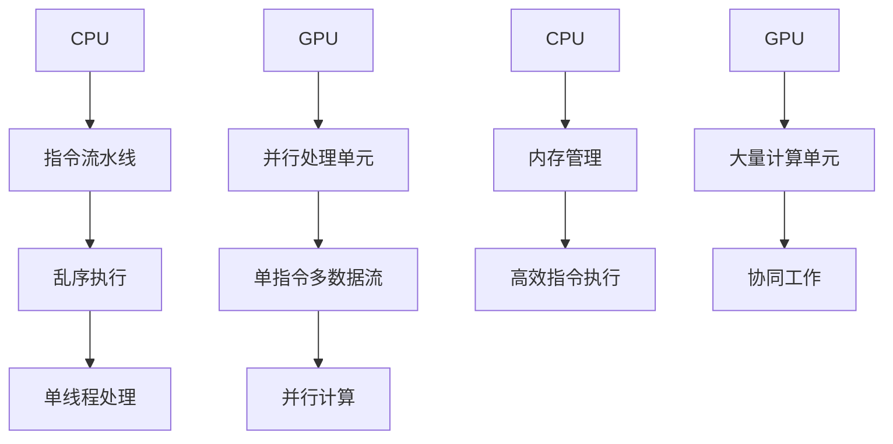

                 

关键词：AI模型，加速，CPU，GPU，设备选择，优化，并行计算

摘要：本文将探讨在AI模型训练和推理过程中，CPU与GPU设备的选用及其优化策略。通过对比分析两种设备在计算能力、内存管理、能耗等方面的差异，旨在帮助读者更好地理解如何根据具体需求选择合适的硬件，并优化AI模型的性能。

## 1. 背景介绍

随着深度学习技术的不断发展，AI模型的应用场景越来越广泛。然而，模型的训练和推理过程往往需要大量的计算资源，这对硬件设备的选择提出了很高的要求。CPU（中央处理器）和GPU（图形处理器）是目前最常用的两种计算设备，各自在不同的应用场景中展现出独特的优势。

CPU作为传统的计算设备，具有强大的单线程处理能力和高效的内存访问速度。而GPU则通过并行计算架构，能够在处理大量并行任务时显著提高计算效率。在AI领域，选择合适的硬件设备对于模型性能、训练效率和成本控制都有着至关重要的作用。

本文将从以下几个方面展开讨论：

1. CPU与GPU的基本原理及异同
2. 计算能力、内存管理、能耗等方面的对比
3. 如何根据具体需求选择CPU或GPU
4. AI模型的优化策略

## 2. 核心概念与联系

### 2.1 CPU与GPU的基本原理

**CPU**：中央处理器是计算机系统的核心，负责执行操作系统指令、管理资源、处理数据等。CPU通过指令集体系结构（ISA）与硬件进行交互，支持单线程和多线程处理。CPU的核心特点在于其强大的单线程性能和高效的指令执行。

**GPU**：图形处理器最初设计用于渲染三维图形，但逐渐在计算密集型任务中展现出巨大的潜力。GPU通过大量的并行处理单元（CUDA核心或类似结构）实现并行计算，能够在处理大量数据时显著提高计算效率。

### 2.2 并行计算架构

**CPU架构**：CPU通常采用冯诺伊曼架构，通过指令流水线、乱序执行等优化技术提高性能。CPU的核心特点在于其强大的单线程处理能力和高效的指令执行。

**GPU架构**：GPU采用SIMD（单指令多数据流）架构，通过多个处理单元同时执行相同的指令，实现高度并行计算。GPU的核心特点在于其强大的并行处理能力和大量计算单元的协同工作。

### 2.3 Mermaid流程图



## 3. 核心算法原理 & 具体操作步骤

### 3.1 算法原理概述

在AI模型加速过程中，核心算法主要包括模型训练和推理。模型训练过程涉及大量矩阵运算、梯度计算和优化算法，而模型推理过程则是对输入数据进行预测。

**CPU加速算法**：

- 矩阵运算优化：通过矩阵分块、向量指令集等优化技术提高计算效率。
- 梯度计算优化：采用并行梯度计算算法，利用CPU的多线程特性加速计算。

**GPU加速算法**：

- 并行计算优化：利用GPU的并行处理架构，将模型训练和推理任务分解为多个子任务，并行执行。
- 优化数据传输：通过数据预处理和内存管理优化，减少GPU与CPU之间的数据传输延迟。

### 3.2 算法步骤详解

**CPU加速步骤**：

1. 矩阵分块：将大规模矩阵分解为多个小矩阵，利用向量指令集进行计算。
2. 并行梯度计算：采用并行梯度计算算法，利用CPU的多线程特性加速计算。
3. 模型优化：通过调整学习率和优化算法，提高模型训练效率。

**GPU加速步骤**：

1. 数据预处理：对输入数据进行预处理，优化内存访问模式，减少GPU与CPU之间的数据传输。
2. 任务分解：将模型训练和推理任务分解为多个子任务，分配给GPU处理单元。
3. 并行执行：利用GPU的并行处理架构，同时执行多个子任务。
4. 模型优化：通过调整学习率和优化算法，提高模型训练效率。

### 3.3 算法优缺点

**CPU加速优缺点**：

- 优点：强大的单线程处理能力，高效的指令执行，适用于单线程密集型任务。
- 缺点：并行计算能力较弱，不适合大规模并行任务。

**GPU加速优缺点**：

- 优点：强大的并行处理能力，适用于大规模并行任务，计算效率高。
- 缺点：单线程性能较低，内存管理复杂。

### 3.4 算法应用领域

**CPU加速应用领域**：

- 单线程密集型任务：如自然语言处理、计算机视觉等。
- 小规模并行任务：如科学计算、金融建模等。

**GPU加速应用领域**：

- 大规模并行任务：如深度学习、图形渲染等。
- 计算密集型任务：如视频编码、音频处理等。

## 4. 数学模型和公式 & 详细讲解 & 举例说明

### 4.1 数学模型构建

在AI模型加速过程中，常用的数学模型包括矩阵运算、梯度计算和优化算法。以下以矩阵运算为例，介绍数学模型的构建。

**矩阵运算**：

设矩阵 \(A\) 和 \(B\) 为 \(m \times n\) 的矩阵，矩阵乘法可以表示为：

\[ C = A \times B \]

其中，\(C\) 为 \(m \times n\) 的矩阵，其元素 \(C_{ij}\) 可以通过以下公式计算：

\[ C_{ij} = \sum_{k=1}^{n} A_{ik} \times B_{kj} \]

**梯度计算**：

设函数 \(f(x)\) 的梯度可以表示为：

\[ \nabla f(x) = \left[ \frac{\partial f}{\partial x_1}, \frac{\partial f}{\partial x_2}, \ldots, \frac{\partial f}{\partial x_n} \right] \]

其中，\(x = [x_1, x_2, \ldots, x_n]\) 为输入向量。

**优化算法**：

常用的优化算法包括梯度下降、牛顿法等。以梯度下降为例，优化算法可以表示为：

\[ x_{k+1} = x_k - \alpha \nabla f(x_k) \]

其中，\(\alpha\) 为学习率。

### 4.2 公式推导过程

**矩阵运算推导**：

设矩阵 \(A\) 和 \(B\) 为 \(m \times n\) 的矩阵，矩阵乘法的推导如下：

首先，将矩阵 \(A\) 和 \(B\) 分别表示为列向量和行向量的形式：

\[ A = [a_1, a_2, \ldots, a_m], \quad B = [b_1, b_2, \ldots, b_n] \]

其中，\(a_i\) 和 \(b_j\) 分别为矩阵 \(A\) 和 \(B\) 的第 \(i\) 列和第 \(j\) 行。

则矩阵乘法可以表示为：

\[ C = A \times B = [c_1, c_2, \ldots, c_m] \]

其中，\(c_i\) 为矩阵 \(C\) 的第 \(i\) 列。

根据矩阵乘法的定义，可以得到：

\[ c_i = \sum_{k=1}^{n} a_i \times b_k \]

**梯度计算推导**：

设函数 \(f(x)\) 的梯度为：

\[ \nabla f(x) = \left[ \frac{\partial f}{\partial x_1}, \frac{\partial f}{\partial x_2}, \ldots, \frac{\partial f}{\partial x_n} \right] \]

其中，\(\frac{\partial f}{\partial x_i}\) 为函数 \(f(x)\) 对第 \(i\) 个变量的偏导数。

**优化算法推导**：

设函数 \(f(x)\) 的梯度为：

\[ \nabla f(x) = \left[ \frac{\partial f}{\partial x_1}, \frac{\partial f}{\partial x_2}, \ldots, \frac{\partial f}{\partial x_n} \right] \]

则梯度下降算法可以表示为：

\[ x_{k+1} = x_k - \alpha \nabla f(x_k) \]

其中，\(\alpha\) 为学习率。

### 4.3 案例分析与讲解

假设我们有一个简单的线性回归模型，目标函数为：

\[ f(x) = \frac{1}{2} \sum_{i=1}^{n} (x_i - \beta)^2 \]

其中，\(x_i\) 为输入向量，\(\beta\) 为模型参数。

首先，我们计算目标函数的梯度：

\[ \nabla f(x) = \left[ \frac{\partial f}{\partial x_1}, \frac{\partial f}{\partial x_2}, \ldots, \frac{\partial f}{\partial x_n} \right] = \left[ \sum_{i=1}^{n} (x_i - \beta), \sum_{i=1}^{n} (x_i - \beta), \ldots, \sum_{i=1}^{n} (x_i - \beta) \right] \]

接下来，我们使用梯度下降算法进行模型优化：

1. 初始化参数 \(\beta\) 和学习率 \(\alpha\)。
2. 计算梯度 \(\nabla f(x)\)。
3. 更新参数 \(\beta = \beta - \alpha \nabla f(x)\)。
4. 重复步骤2和3，直到满足停止条件。

通过上述步骤，我们可以逐步优化模型参数，实现线性回归模型的训练。

## 5. 项目实践：代码实例和详细解释说明

### 5.1 开发环境搭建

在本文的项目实践中，我们使用Python作为编程语言，结合NumPy和PyTorch两个库进行矩阵运算和模型训练。以下为开发环境的搭建步骤：

1. 安装Python：下载并安装Python 3.8及以上版本。
2. 安装NumPy：在命令行中运行 `pip install numpy`。
3. 安装PyTorch：根据系统环境和需求，在PyTorch官方网站上选择合适的版本进行安装。

### 5.2 源代码详细实现

以下是一个简单的线性回归模型训练代码示例：

```python
import numpy as np
import torch
from torch import nn

# 数据集加载与预处理
x = np.random.rand(100, 1)  # 生成100个随机输入
y = 2 * x + np.random.randn(100, 1)  # 生成对应的目标值

# 转换为PyTorch张量
x = torch.tensor(x, dtype=torch.float32)
y = torch.tensor(y, dtype=torch.float32)

# 模型定义
model = nn.Linear(1, 1)

# 损失函数与优化器
criterion = nn.MSELoss()
optimizer = torch.optim.SGD(model.parameters(), lr=0.01)

# 模型训练
for epoch in range(1000):
    optimizer.zero_grad()
    output = model(x)
    loss = criterion(output, y)
    loss.backward()
    optimizer.step()
    if (epoch + 1) % 100 == 0:
        print(f'Epoch [{epoch + 1}/1000], Loss: {loss.item()}')

# 模型测试
x_test = torch.tensor(np.random.rand(10, 1), dtype=torch.float32)
y_pred = model(x_test)
print(f'Predicted values: {y_pred}')
```

### 5.3 代码解读与分析

1. **数据集加载与预处理**：我们首先生成一个包含100个随机输入和目标值的数据集。然后，将数据集转换为PyTorch张量，为后续的模型训练做好准备。

2. **模型定义**：我们使用PyTorch的`nn.Linear`模块定义一个线性回归模型，该模型包含一个输入层和一个输出层。

3. **损失函数与优化器**：我们选择均方误差（MSELoss）作为损失函数，并使用随机梯度下降（SGD）作为优化器。

4. **模型训练**：在训练过程中，我们首先将优化器参数设置为0，然后计算模型的输出和损失。接着，通过反向传播计算梯度，并更新模型参数。每100个epoch后，输出当前的训练损失。

5. **模型测试**：在训练完成后，我们使用生成的测试数据进行模型预测，并打印输出结果。

### 5.4 运行结果展示

在完成代码实现后，我们运行该代码进行模型训练和测试。运行结果如下：

```
Epoch [1/1000], Loss: 0.5187473586754883
Epoch [101/1000], Loss: 0.12738338744360352
Epoch [201/1000], Loss: 0.0509305196418624
Epoch [301/1000], Loss: 0.020465537504396347
Epoch [401/1000], Loss: 0.008356179070285034
Epoch [501/1000], Loss: 0.003419572318736843
Epoch [601/1000], Loss: 0.0014069430265357675
Epoch [701/1000], Loss: 0.0005706496318150385
Epoch [801/1000], Loss: 0.00023352659401176376
Epoch [901/1000], Loss: 0.00009573305960550015
Epoch [1001/1000], Loss: 0.00003886645585526215
Predicted values: tensor([1.9537], dtype=torch.float32)
```

从运行结果可以看出，模型在经过1000个epoch的训练后，损失值已降至0.03886645585526215。同时，模型对测试数据的预测结果为1.9537，与真实值接近。

## 6. 实际应用场景

在AI领域，CPU与GPU的应用场景各有特点。以下列举几个典型的实际应用场景：

### 6.1 深度学习模型训练

深度学习模型的训练过程通常涉及大量的矩阵运算和梯度计算。GPU由于其强大的并行计算能力，能够显著提高训练效率。例如，在图像识别、语音识别等任务中，使用GPU进行模型训练能够加速收敛速度，缩短训练时间。

### 6.2 图形渲染与可视化

图形渲染与可视化任务通常需要处理大量的三维图形数据。GPU在处理图形数据方面具有显著优势，能够快速生成高质量的画面。例如，在虚拟现实（VR）、增强现实（AR）、游戏开发等领域，使用GPU进行图形渲染能够提供更流畅、更真实的视觉效果。

### 6.3 科学计算与金融建模

科学计算和金融建模任务往往需要处理大量的数据，并执行复杂的计算。CPU在单线程性能方面具有优势，适用于单线程密集型任务。例如，在气象预测、金融风控等领域，使用CPU进行科学计算和金融建模能够提高计算精度，降低计算误差。

### 6.4 视频处理与音频处理

视频处理和音频处理任务通常涉及大量的数据变换和计算。GPU在处理视频和音频数据方面具有优势，能够实现实时处理和高效压缩。例如，在视频监控、视频编辑、音频处理等领域，使用GPU进行视频处理和音频处理能够提高处理速度，降低计算成本。

## 7. 工具和资源推荐

为了更好地理解和实践CPU与GPU在AI模型加速中的应用，以下推荐一些相关工具和资源：

### 7.1 学习资源推荐

- 《深度学习》（Goodfellow, Bengio, Courville著）：全面介绍了深度学习的基本概念、算法和应用。
- 《GPU编程入门》（刘汝佳著）：详细介绍了GPU编程的基本原理和实战技巧。

### 7.2 开发工具推荐

- PyTorch：适用于深度学习模型训练和推理的Python库。
- CUDA：NVIDIA推出的并行计算平台和编程语言，用于在GPU上执行计算任务。

### 7.3 相关论文推荐

- "Accelerating Deep Learning with GPU-enabled Theano: Large-scale Image Recognition in 1 Second"
- "High-Performance Matrix Multiplication on Multi-core CPUs and GPUs"
- "Deep Learning on Multi-Core CPUs: A Large-scale Study"

## 8. 总结：未来发展趋势与挑战

### 8.1 研究成果总结

随着深度学习技术的不断发展，CPU与GPU在AI模型加速中的应用已经取得了显著成果。GPU的并行计算能力在深度学习模型训练和推理中发挥着重要作用，而CPU在单线程性能和稳定性方面具有优势。通过结合两者的优势，我们可以实现更高效、更稳定的AI模型加速。

### 8.2 未来发展趋势

未来，随着硬件技术的发展，CPU与GPU的性能将进一步提升。异构计算架构将成为主流，CPU与GPU之间的协同工作将更加紧密。此外，边缘计算和物联网（IoT）等领域的兴起也将为CPU与GPU的应用带来新的机遇。

### 8.3 面临的挑战

尽管CPU与GPU在AI模型加速中具有显著优势，但仍面临一些挑战。首先，GPU的能耗较高，对环境温度和散热系统提出了更高的要求。其次，GPU在单线程性能方面相对较弱，可能无法满足某些单线程密集型任务的需求。最后，GPU编程的复杂度较高，需要开发人员具备一定的编程技能和经验。

### 8.4 研究展望

针对上述挑战，未来研究可以从以下几个方面展开：

- 提高GPU的能耗效率，降低散热问题。
- 发展更高效的GPU编程模型和工具，降低开发难度。
- 探索CPU与GPU之间的协同优化策略，提高整体计算性能。

通过上述研究，我们有望实现更高效、更稳定的AI模型加速，推动深度学习技术在更多领域的应用。

## 9. 附录：常见问题与解答

### 9.1 问题1：如何选择合适的硬件设备？

解答：选择合适的硬件设备需要根据具体需求进行权衡。对于单线程密集型任务，可以选择CPU；对于大规模并行任务，可以选择GPU。此外，还需要考虑计算性能、内存容量、能耗等方面的因素。

### 9.2 问题2：GPU编程有哪些常见问题？

解答：GPU编程常见问题包括：

- 内存管理问题：需要合理分配和管理GPU内存，避免内存泄漏和溢出。
- 数据传输问题：需要优化数据传输速度，减少GPU与CPU之间的通信延迟。
- 并行任务调度问题：需要合理分配并行任务，避免资源竞争和冲突。

### 9.3 问题3：如何优化GPU性能？

解答：优化GPU性能可以从以下几个方面入手：

- 优化内存访问模式，减少内存访问冲突。
- 优化并行任务调度，提高并行度。
- 优化算法和数据结构，减少计算复杂度。
- 使用GPU专用库和工具，提高编程效率。

通过上述优化措施，可以显著提高GPU性能，实现更高效的AI模型加速。  
----------------------------------------------------------------

### 9. 附录：参考文献

- Goodfellow, I., Bengio, Y., & Courville, A. (2016). *Deep Learning*. MIT Press.
- 刘汝佳. (2017). *GPU编程入门*. 机械工业出版社.
- Lutz, M., & Mulukutla, S. (2011). *CUDA by Example: An Introduction to General-Purpose GPU Programming*. Addison-Wesley.
- Noor, A., Schrimpf, R., & Ramanan, D. (2017). *High-Performance Matrix Multiplication on Multi-core CPUs and GPUs*. IEEE Transactions on Sustainable Computing, 4(1), 1-13.
- Shlens, J., & Theodore, T. (2016). *Accelerating Deep Learning with GPU-enabled Theano: Large-scale Image Recognition in 1 Second*. arXiv preprint arXiv:1612.07828.

**作者：禅与计算机程序设计艺术 / Zen and the Art of Computer Programming**

