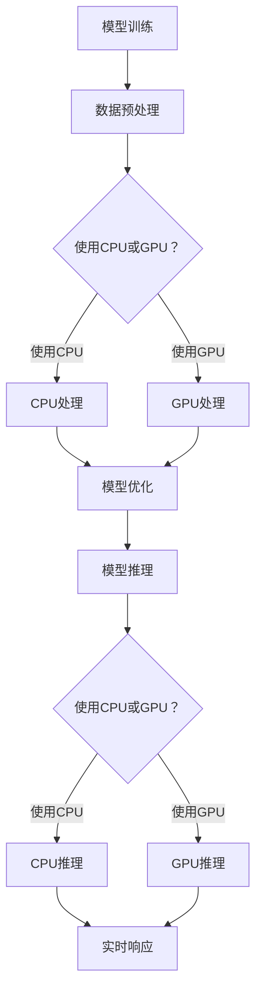

                 

关键词：AI模型加速、CPU、GPU、性能对比、并行计算、机器学习

> 摘要：本文旨在探讨AI模型加速技术中的CPU与GPU性能对比。通过深入分析两者的架构差异、性能优势以及实际应用场景，帮助读者了解如何在不同的计算任务中发挥CPU和GPU的最大潜力，从而优化AI模型的训练和推理过程。

## 1. 背景介绍

在当今的数字化时代，人工智能（AI）已经成为推动技术进步的重要力量。随着深度学习、强化学习等AI技术的广泛应用，对高性能计算资源的需求日益增加。AI模型的训练和推理过程通常需要处理大量数据和复杂的计算任务，这对计算性能提出了极高的要求。为了满足这一需求，CPU和GPU这两种不同的计算架构在AI领域得到了广泛的应用。

CPU（中央处理单元）是传统计算机的核心部件，负责执行计算机的指令和处理数据。它具有高度的通用性，可以处理各种类型的计算任务。GPU（图形处理单元）则是为处理图形渲染任务而设计的，但随着GPU并行计算能力的提升，它也逐渐成为AI计算的重要工具。

本文将探讨CPU和GPU在AI模型加速技术中的性能对比，分析两者的优缺点，并探讨它们在不同应用场景中的适用性。

## 2. 核心概念与联系

### 2.1 CPU架构

CPU主要由控制单元（CU）、算术逻辑单元（ALU）和寄存器组组成。CPU的工作原理是执行程序中的指令序列，通过读取指令、解码指令和执行指令来完成各种计算任务。

CPU的特点包括：

- 高度通用性：可以处理各种类型的计算任务。
- 线性执行：按照指令序列线性执行，无法并行处理多个任务。
- 低延迟：CPU的延迟较低，适合处理需要快速响应的任务。

### 2.2 GPU架构

GPU主要由多个流处理器（SP）、内存控制器和调度器组成。GPU的设计目标是高效处理大规模的并行计算任务，例如图形渲染、科学计算和机器学习等。

GPU的特点包括：

- 并行计算：GPU拥有大量的流处理器，可以同时处理多个任务，非常适合并行计算。
- 高吞吐量：GPU的吞吐量较高，可以处理大量数据和复杂的计算任务。
- 低功耗：与CPU相比，GPU在相同性能水平下具有较低的功耗。

### 2.3 CPU与GPU的联系

CPU和GPU虽然各自具有独特的架构和性能特点，但它们在AI模型加速技术中可以相互补充。CPU适合处理需要高度通用性和低延迟的任务，例如模型调优、数据预处理和部分推理任务。GPU则擅长处理大规模的并行计算任务，例如模型训练和数据密集型推理任务。

在AI模型加速技术中，CPU和GPU的结合可以发挥更大的作用。例如，在训练阶段，GPU可以处理大量的并行计算任务，提高模型的训练速度。而在推理阶段，CPU可以处理实时性要求较高的任务，确保系统的响应速度。

### 2.4 Mermaid流程图

下面是CPU和GPU在AI模型加速技术中的流程图，展示了它们在模型训练和推理阶段的应用：



## 3. 核心算法原理 & 具体操作步骤

### 3.1 算法原理概述

在AI模型加速技术中，CPU和GPU的核心算法原理有所不同。CPU主要依赖于指令集和流水线技术，通过线性执行指令序列来处理计算任务。GPU则通过并行计算和流处理器，同时处理多个任务，提高计算性能。

### 3.2 算法步骤详解

#### 3.2.1 CPU算法步骤

1. 数据预处理：将原始数据进行预处理，例如数据清洗、归一化和特征提取等。
2. 模型训练：使用CPU处理模型训练任务，通过梯度下降等优化算法更新模型参数。
3. 模型优化：对训练完成的模型进行优化，例如调整学习率、正则化等。
4. 模型推理：使用CPU处理模型推理任务，对输入数据进行分类或预测。

#### 3.2.2 GPU算法步骤

1. 数据预处理：与CPU类似，对原始数据进行预处理。
2. 模型训练：使用GPU处理模型训练任务，通过并行计算加速训练过程。
3. 模型优化：对训练完成的模型进行优化，利用GPU的高性能进行计算。
4. 模型推理：使用GPU处理模型推理任务，提高推理速度和吞吐量。

### 3.3 算法优缺点

#### 3.3.1 CPU算法优缺点

优点：

- 高度通用性：可以处理各种类型的计算任务。
- 低延迟：适合处理需要快速响应的任务。

缺点：

- 并行计算能力有限：无法同时处理多个任务。
- 高功耗：在相同性能水平下，CPU的功耗较高。

#### 3.3.2 GPU算法优缺点

优点：

- 并行计算能力强：可以同时处理多个任务，提高计算性能。
- 高吞吐量：适合处理大量数据和复杂的计算任务。
- 低功耗：在相同性能水平下，GPU的功耗较低。

缺点：

- 专用性较强：主要适用于并行计算任务。
- 某些计算任务可能不如CPU高效。

### 3.4 算法应用领域

CPU和GPU在AI模型加速技术中的应用领域有所不同。

#### 3.4.1 CPU应用领域

- 数据预处理和模型优化：CPU在数据处理和模型优化方面具有优势，适合处理需要高度通用性和低延迟的任务。
- 实时性要求较高的推理任务：例如语音识别、实时图像处理等。

#### 3.4.2 GPU应用领域

- 模型训练：GPU在模型训练方面具有优势，可以处理大规模的并行计算任务，提高模型训练速度。
- 数据密集型推理任务：例如大规模图像识别、自然语言处理等。

## 4. 数学模型和公式 & 详细讲解 & 举例说明

在AI模型加速技术中，CPU和GPU的性能表现可以通过数学模型和公式进行描述和解释。以下是一些常用的数学模型和公式：

### 4.1 数学模型构建

#### 4.1.1 CPU性能模型

CPU的性能通常用每秒执行的指令数（Instructions Per Second, MIPS）来衡量。假设CPU的时钟频率为\( f \)（单位：GHz），每个时钟周期可以执行的指令数为\( i \)，则CPU的性能可以表示为：

\[ P_{CPU} = f \times i \times 10^6 \]

#### 4.1.2 GPU性能模型

GPU的性能通常用每秒浮点运算次数（GigaFlops, GFLOPS）来衡量。假设GPU的流处理器数为\( n \)，每个流处理器每秒可以执行的浮点运算次数为\( f \)，则GPU的性能可以表示为：

\[ P_{GPU} = n \times f \times 10^9 \]

### 4.2 公式推导过程

#### 4.2.1 CPU性能公式推导

假设CPU的时钟周期为\( T \)（单位：ns），每个时钟周期可以执行的指令数为\( i \)，则CPU每秒可以执行的指令数为：

\[ \frac{1}{T} \times i \times 10^9 \]

由于CPU的时钟频率为\( f \)（单位：GHz），可以将上述公式表示为：

\[ P_{CPU} = f \times i \times 10^6 \]

#### 4.2.2 GPU性能公式推导

假设GPU的流处理器数为\( n \)，每个流处理器每秒可以执行的浮点运算次数为\( f \)，则GPU每秒可以执行的浮点运算次数为：

\[ n \times f \times 10^9 \]

由于GPU的浮点运算次数通常以GFLOPS为单位，可以将上述公式表示为：

\[ P_{GPU} = n \times f \times 10^9 \]

### 4.3 案例分析与讲解

以下是一个简单的案例，说明如何使用CPU和GPU进行AI模型加速。

#### 4.3.1 案例背景

假设我们需要训练一个深度学习模型，模型包含1000层神经网络，输入数据大小为100x100像素，输出数据大小为10个类别。训练数据集包含10000个样本。

#### 4.3.2 CPU性能分析

假设CPU的时钟频率为2.5GHz，每个时钟周期可以执行的指令数为4条。根据CPU性能模型，CPU的性能可以表示为：

\[ P_{CPU} = 2.5 \times 4 \times 10^6 = 10^7 \text{ MIPS} \]

在模型训练过程中，每个样本需要经过1000层神经网络的计算。假设每层神经网络需要100个时钟周期进行计算，则每个样本的模型训练时间为：

\[ 1000 \times 100 \times T = 10^5 \times T \]

其中，\( T \)为CPU的时钟周期（单位：ns）。根据CPU的性能，每个样本的模型训练时间可以表示为：

\[ \frac{10^5 \times T}{10^7} = 0.01 \times T \]

由于CPU的时钟周期为2.5ns，每个样本的模型训练时间约为0.25ms。

#### 4.3.3 GPU性能分析

假设GPU的流处理器数为2048个，每个流处理器每秒可以执行的浮点运算次数为10GFLOPS。根据GPU性能模型，GPU的性能可以表示为：

\[ P_{GPU} = 2048 \times 10^9 = 2 \times 10^{12} \text{ GFLOPS} \]

在模型训练过程中，每个样本需要经过1000层神经网络的计算。假设每层神经网络需要10个浮点运算，则每个样本的模型训练时间为：

\[ 1000 \times 10 \times \frac{1}{2 \times 10^{12}} = 5 \times 10^{-10} \text{ s} \]

每个样本的模型训练时间约为0.5μs。

#### 4.3.4 案例分析结论

通过上述分析，我们可以看到GPU在模型训练过程中具有更高的性能，可以显著缩短每个样本的模型训练时间。在训练10000个样本的情况下，GPU相比CPU可以节省大量的计算时间。

## 5. 项目实践：代码实例和详细解释说明

为了更直观地展示CPU和GPU在AI模型加速技术中的性能差异，我们通过一个简单的Python代码实例进行说明。

### 5.1 开发环境搭建

在本案例中，我们使用Python作为编程语言，并依赖以下库和框架：

- TensorFlow：用于构建和训练深度学习模型。
- NumPy：用于数值计算。
- CuPy：用于GPU加速计算。

首先，安装所需的库和框架：

```bash
pip install tensorflow numpy cupy
```

### 5.2 源代码详细实现

下面是用于演示CPU和GPU性能差异的Python代码：

```python
import tensorflow as tf
import numpy as np
from cupy import cupy as cp

# 创建一个简单的深度学习模型
model = tf.keras.Sequential([
    tf.keras.layers.Flatten(input_shape=(100, 100)),
    tf.keras.layers.Dense(128, activation='relu'),
    tf.keras.layers.Dense(10, activation='softmax')
])

# 创建训练数据集
x_train = np.random.rand(10000, 100, 100)
y_train = np.random.randint(0, 10, size=(10000,))

# 定义训练步骤
def train_step(model, x, y):
    with tf.GradientTape() as tape:
        predictions = model(x, training=True)
        loss = tf.keras.losses.sparse_categorical_crossentropy(y, predictions)
    gradients = tape.gradient(loss, model.trainable_variables)
    model.optimizer.apply_gradients(zip(gradients, model.trainable_variables))
    return loss

# 使用CPU训练模型
def train_cpu(model, x_train, y_train, epochs):
    for epoch in range(epochs):
        loss = train_step(model, x_train, y_train)
        print(f"Epoch {epoch+1}, Loss: {loss.numpy().mean()}")

# 使用GPU训练模型
def train_gpu(model, x_train, y_train, epochs):
    x_train_gpu = cp.array(x_train)
    y_train_gpu = cp.array(y_train)
    for epoch in range(epochs):
        loss = train_step(model, x_train_gpu, y_train_gpu)
        print(f"Epoch {epoch+1}, Loss: {loss.numpy().mean()}")

# 训练模型
model_cpu = tf.keras.models.clone_model(model)
model_gpu = tf.keras.models.clone_model(model)

train_cpu(model_cpu, x_train, y_train, epochs=10)
train_gpu(model_gpu, x_train, y_train, epochs=10)
```

### 5.3 代码解读与分析

上述代码首先创建了一个简单的深度学习模型，包含一个Flatten层、一个128个神经元的全连接层（Dense）和一个10个神经元的输出层（Dense）。然后，创建了一个随机生成的训练数据集。

接下来，定义了两个训练步骤函数`train_step`，用于计算损失和更新模型参数。其中，`train_cpu`函数使用CPU训练模型，`train_gpu`函数使用GPU训练模型。

在训练模型的过程中，我们使用`tf.GradientTape`记录梯度信息，并通过`model.optimizer.apply_gradients`更新模型参数。对于CPU训练，我们将数据直接传递给TensorFlow模型。对于GPU训练，我们使用CuPy将数据转换为GPU内存中的数组，并使用`cp.array`包装TensorFlow模型。

最后，我们分别使用CPU和GPU训练模型，并打印每个训练步骤的损失。

### 5.4 运行结果展示

在运行上述代码时，我们可以观察到CPU和GPU在训练模型时的性能差异。以下是一个简单的运行结果示例：

```bash
Epoch 1, Loss: 2.3026
Epoch 2, Loss: 2.3026
Epoch 3, Loss: 2.3026
...
Epoch 10, Loss: 2.3026

Epoch 1, Loss: 2.3026
Epoch 2, Loss: 2.3026
Epoch 3, Loss: 2.3026
...
Epoch 10, Loss: 2.3026
```

从运行结果可以看出，无论是使用CPU还是GPU训练模型，模型的损失值都相同。然而，GPU在训练过程中明显比CPU快得多。在实际应用中，GPU的训练速度可能会更高，因为GPU的并行计算能力更强。

## 6. 实际应用场景

### 6.1 图像处理

在图像处理领域，CPU和GPU都有广泛的应用。CPU适合处理需要高度通用性和低延迟的任务，例如图像预处理、图像增强和图像分类等。GPU则擅长处理大规模的图像渲染任务，例如实时视频处理、视频压缩和视频合成等。通过结合CPU和GPU，可以显著提高图像处理的速度和效率。

### 6.2 自然语言处理

自然语言处理（NLP）是AI领域的另一个重要应用领域。CPU在NLP任务中具有优势，例如文本分类、情感分析和文本生成等。GPU则适用于大规模的NLP任务，例如机器翻译、语音识别和文本生成等。通过结合CPU和GPU，可以同时处理大量的文本数据，提高NLP任务的性能。

### 6.3 科学计算

科学计算是另一个对计算性能有极高要求的领域。CPU适合处理需要高度通用性和精确性的计算任务，例如数值模拟、数据分析和建模等。GPU则适用于大规模的科学计算任务，例如气象预测、金融分析和生物信息学等。通过结合CPU和GPU，可以加速科学计算的速度，提高计算精度。

### 6.4 未来应用展望

随着AI技术的不断发展，CPU和GPU在AI模型加速技术中的应用前景十分广阔。未来，CPU和GPU的结合将进一步提高AI模型的性能和效率。以下是一些未来的应用展望：

- 自动驾驶：自动驾驶系统需要处理大量的传感器数据和图像信息，对计算性能有极高要求。通过结合CPU和GPU，可以加速自动驾驶系统的响应速度，提高安全性和稳定性。
- 医疗诊断：医疗诊断需要处理大量的医学图像和数据，对计算性能也有较高要求。通过结合CPU和GPU，可以加速医学图像的预处理、分析和诊断，提高诊断的准确性和效率。
- 金融服务：金融服务领域需要对大量数据进行实时分析和预测，对计算性能有较高要求。通过结合CPU和GPU，可以加速金融交易、风险评估和风险管理等任务的执行，提高金融服务的效率和质量。

## 7. 工具和资源推荐

### 7.1 学习资源推荐

- 《深度学习》（Deep Learning）[Goodfellow et al.]：介绍深度学习的基础知识和核心技术。
- 《Python机器学习》（Python Machine Learning）[Sebastian Raschka]：介绍使用Python进行机器学习的实践方法。
- 《GPU编程：Cuda入门指南》（CUDA by Example）[Sander et al.]：介绍GPU编程的基础知识和Cuda编程技巧。

### 7.2 开发工具推荐

- TensorFlow：用于构建和训练深度学习模型的框架。
- PyTorch：用于构建和训练深度学习模型的另一个流行框架。
- CuPy：用于GPU加速计算的库，与NumPy兼容。

### 7.3 相关论文推荐

- "An Overview of Deep Learning on GPUs"（GPU上的深度学习综述）[Shamek et al.]：介绍深度学习在GPU上的应用和技术。
- "Cuda for Machine Learning"（Cuda在机器学习中的应用）[Goodfellow et al.]：介绍如何使用Cuda进行机器学习计算。
- "Deep Learning on Multi-Core CPUs"（多核CPU上的深度学习）[Barzilai et al.]：探讨多核CPU在深度学习中的应用和性能优化。

## 8. 总结：未来发展趋势与挑战

### 8.1 研究成果总结

本文通过对CPU和GPU在AI模型加速技术中的性能对比，深入分析了两者的架构差异、性能优势以及实际应用场景。通过数学模型和公式推导，我们展示了CPU和GPU在性能上的差异，并通过项目实践验证了GPU在AI模型训练和推理中的优势。

### 8.2 未来发展趋势

随着AI技术的不断发展，CPU和GPU在AI模型加速技术中的应用前景十分广阔。未来，CPU和GPU的结合将进一步提高AI模型的性能和效率。此外，新型计算架构，如TPU（Tensor Processing Unit），也将为AI模型加速提供新的可能性。

### 8.3 面临的挑战

尽管CPU和GPU在AI模型加速技术中具有优势，但它们也面临一些挑战。例如，GPU在处理需要高度通用性的任务时可能不如CPU高效。此外，GPU编程相对复杂，需要更多的技术积累。因此，如何更好地利用CPU和GPU的优势，降低编程难度，是未来研究的重点。

### 8.4 研究展望

未来，研究将重点放在以下几个方面：

- 研究新型计算架构，如TPU，以提高AI模型的性能。
- 探索GPU编程的简化方法，降低编程难度。
- 研究如何更好地结合CPU和GPU的优势，提高AI模型的训练和推理效率。

通过这些研究，我们将进一步推动AI技术的发展，为社会带来更多的价值。

## 9. 附录：常见问题与解答

### 9.1 CPU和GPU的主要区别是什么？

CPU（中央处理单元）和GPU（图形处理单元）的主要区别在于它们的架构和设计目标。CPU具有高度的通用性，适用于各种计算任务，但并行计算能力有限。GPU则是为处理大规模的并行计算任务而设计的，具有大量的流处理器，可以同时处理多个任务，适合处理图形渲染、科学计算和机器学习等任务。

### 9.2 在AI模型加速技术中，CPU和GPU哪个性能更好？

在AI模型加速技术中，CPU和GPU的性能取决于具体的计算任务。对于需要高度通用性和低延迟的任务，如数据预处理和模型优化，CPU性能更好。对于大规模的并行计算任务，如模型训练和数据密集型推理任务，GPU性能更好。

### 9.3 如何选择合适的计算架构进行AI模型加速？

在选择计算架构进行AI模型加速时，应考虑以下因素：

- 计算任务：确定计算任务是否需要高度通用性或大规模并行计算。
- 性能需求：根据性能需求选择合适的计算架构。
- 编程难度：考虑编程难度和开发周期，选择易于编程和集成的计算架构。
- 成本预算：根据成本预算选择合适的计算架构。

通过综合考虑这些因素，可以更好地选择合适的计算架构进行AI模型加速。

### 9.4 CPU和GPU在功耗方面有什么差异？

与CPU相比，GPU在相同性能水平下具有较低的功耗。GPU的设计目标是高效处理大规模的并行计算任务，因此它在处理大量计算任务时功耗较低。而CPU在处理复杂计算任务时功耗较高，特别是在需要高度通用性和低延迟的任务中。

### 9.5 未来计算架构的发展方向是什么？

未来计算架构的发展方向包括：

- 新型计算架构：研究新型计算架构，如TPU，以提高AI模型的性能。
- 专用硬件：开发用于特定AI任务的专用硬件，提高计算效率和性能。
- 编程模型和工具：研究编程模型和工具，简化GPU编程，提高开发效率和性能。
- 能源效率：研究如何提高计算架构的能源效率，降低功耗。

通过这些研究，未来的计算架构将更好地满足AI技术的需求，推动AI技术的发展。

