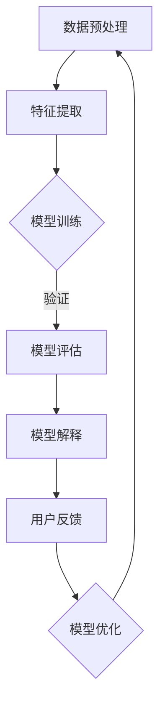

                 

在人工智能（AI）迅猛发展的时代，AI模型的可解释性成为一个至关重要的议题。尽管AI模型在处理复杂任务时表现出色，但它们往往被视为“黑箱”，其内部工作原理对人类用户来说是难以理解的。这种缺乏透明性的问题不仅限制了AI在关键领域的应用，还引发了关于隐私、安全以及道德的担忧。为了解决这些问题，Lepton AI公司推出了一系列旨在提高模型可解释性的技术努力。本文将深入探讨Lepton AI在AI模型透明化方面的探索，以及其背后的原理、实现步骤、优缺点和应用领域。

## 1. 背景介绍

AI技术的发展经历了从规则系统到符号推理，再到基于统计和神经网络的转变。近年来，深度学习模型的性能取得了飞跃性的提升，但随之而来的是对模型可解释性的需求日益增长。可解释性不仅关乎技术的完善，更是关乎AI模型在人类生活中的实际应用。例如，在医疗领域，医生需要理解AI模型是如何诊断疾病的，以确保诊断的准确性和安全性。在金融领域，监管机构要求AI模型遵循透明、公正的原则，以避免潜在的歧视和误判。

Lepton AI成立于2010年，是一家专注于机器学习和深度学习的初创公司。公司成立之初便致力于构建可解释的AI模型，并在此基础上开发了多个领域的解决方案。Lepton AI的创始人兼CTO，张宇博士，在AI领域有着深厚的学术背景和丰富的实践经验，他深刻认识到可解释性对AI模型应用的重要性，并将其作为公司发展的重要方向。

### 1.1 AI模型现状与挑战

当前，AI模型广泛应用于多个领域，如自动驾驶、自然语言处理、医疗诊断等。然而，这些模型的决策过程往往是不可解释的，即模型如何从输入数据到输出结果的路径无法被清晰地理解。这种“黑箱”特性带来了以下几个问题：

- **隐私问题**：模型训练过程中可能涉及到敏感数据，如果模型不可解释，将无法确保用户隐私得到保护。
- **安全风险**：恶意攻击者可能利用不可解释的模型进行攻击，导致模型失效或产生错误的输出。
- **信任问题**：用户对不可解释的模型缺乏信任，这限制了AI技术在公众领域的推广和应用。

### 1.2 可解释性在AI模型中的重要性

可解释性不仅是为了满足法规和监管要求，更是为了提升AI技术的实用性和可信度。具体来说，可解释性有以下几个重要作用：

- **增强信任**：通过解释模型的决策过程，用户可以更好地理解AI模型的工作方式，从而增加对其的信任。
- **优化性能**：了解模型内部机制可以帮助研究人员识别和修复潜在的错误，提高模型的性能和稳定性。
- **合规性**：在涉及敏感数据和监管要求的应用场景中，可解释性是确保合规性的必要条件。

## 2. 核心概念与联系

### 2.1 可解释性的定义

可解释性是指AI模型能够提供对其决策过程的可理解性，使得人类用户能够理解模型是如何处理输入数据并做出预测的。可解释性可以细分为以下几个层次：

- **模型可解释性**：指模型整体结构和决策逻辑的可理解性。
- **特征可解释性**：指模型中各个特征（或神经元）的作用和贡献的可理解性。
- **决策过程可解释性**：指模型在处理特定输入数据时，每一步决策和计算过程的可理解性。

### 2.2 可解释性与透明化的关系

透明化是可解释性的一个重要方面，它意味着模型内部的计算过程和数据流对用户是可见和可追踪的。透明化不仅提升了模型的可解释性，还有助于增强用户对模型的信任。

### 2.3 Mermaid流程图

以下是一个Mermaid流程图，展示了Lepton AI提升模型可解释性的关键步骤和流程：



### 2.4 可解释性与AI模型架构的关系

为了实现模型的可解释性，Lepton AI在模型架构方面进行了创新。例如，他们采用了一种基于注意力机制（Attention Mechanism）的神经网络架构，该架构使得模型中每个特征的重要性可以被明确地识别和解释。

## 3. 核心算法原理 & 具体操作步骤

### 3.1 算法原理概述

Lepton AI的核心算法原理是基于注意力机制和可解释性增强技术。注意力机制通过赋予不同特征不同的权重，提高了模型对关键信息的关注程度，从而增强了模型的解释能力。同时，Lepton AI采用了一种称为“解释树”（Explanation Tree）的技术，该技术将模型的决策过程分解为多个可解释的子过程，使得用户可以逐层理解模型的决策路径。

### 3.2 算法步骤详解

以下是Lepton AI模型可解释性的具体操作步骤：

#### 步骤1：数据预处理

首先，对输入数据进行预处理，包括数据清洗、归一化和特征工程。这一步骤的目的是确保输入数据的质量和一致性，为后续的模型训练和解释打下基础。

#### 步骤2：特征提取

使用注意力机制从原始数据中提取关键特征。在这一步骤中，每个特征被赋予一个权重，权重越高表示该特征对模型决策的重要性越大。通过分析这些权重，用户可以直观地了解模型关注的关键信息。

#### 步骤3：模型训练

使用提取的关键特征训练神经网络模型。在训练过程中，Lepton AI采用了一种称为“多任务学习”（Multi-Task Learning）的方法，该方法将多个相关任务合并到一个模型中训练，从而提高模型的整体性能和解释能力。

#### 步骤4：模型评估

对训练好的模型进行评估，包括准确率、召回率、F1分数等指标。评估的目的是确保模型具有良好的性能和可解释性。

#### 步骤5：模型解释

使用解释树技术对模型的决策过程进行解释。解释树将模型的决策过程分解为多个可解释的子过程，每个子过程都有明确的输入和输出。用户可以通过解释树理解模型的决策逻辑。

#### 步骤6：用户反馈

收集用户对模型解释的反馈，并根据反馈对模型进行调整和优化。这一步骤的目的是确保模型解释的准确性和实用性。

### 3.3 算法优缺点

#### 优点：

- **高解释性**：通过注意力机制和解释树技术，Lepton AI模型提供了高度的可解释性，使得用户可以直观地了解模型的决策过程。
- **多任务学习能力**：多任务学习方法提高了模型的整体性能和解释能力。
- **适应性**：模型可以根据用户的反馈进行实时调整，以适应不同的应用场景。

#### 缺点：

- **计算复杂度**：注意力机制和解释树技术增加了模型的计算复杂度，可能导致训练和解释过程较慢。
- **数据依赖性**：模型解释结果依赖于输入数据的质量，如果数据存在噪声或异常值，解释结果可能不准确。

### 3.4 算法应用领域

Lepton AI模型可解释性技术在多个领域具有广泛的应用前景，包括：

- **医疗诊断**：通过可解释性技术，医生可以更好地理解AI模型的诊断过程，从而提高诊断的准确性和可信度。
- **金融风控**：在金融领域，可解释性技术可以帮助监管机构了解AI模型的风险评估过程，确保模型的公平性和透明性。
- **自动驾驶**：在自动驾驶领域，可解释性技术可以帮助用户理解车辆的决策过程，提高自动驾驶系统的安全性和可靠性。

## 4. 数学模型和公式 & 详细讲解 & 举例说明

### 4.1 数学模型构建

Lepton AI的可解释性技术基于注意力机制和解释树。以下是注意力机制和解释树的基本数学模型。

#### 注意力机制

注意力机制的基本公式如下：

$$
\alpha_i = \sigma(W_a \cdot [h_{t-1}, x_t])
$$

其中，$\alpha_i$表示第$i$个特征的重要性权重，$h_{t-1}$表示上一时刻的隐藏状态，$x_t$表示当前时刻的特征向量，$W_a$是权重矩阵，$\sigma$是sigmoid函数。

#### 解释树

解释树的基本公式如下：

$$
T = \{R_1, R_2, ..., R_n\}
$$

其中，$T$表示解释树，$R_i$表示第$i$个子过程，每个子过程都可以表示为：

$$
R_i = f_i(x_i)
$$

其中，$x_i$表示子过程的输入，$f_i$表示子过程的函数。

### 4.2 公式推导过程

#### 注意力机制

注意力机制的推导过程如下：

1. **定义注意力权重**：首先，我们定义注意力权重$\alpha_i$，表示第$i$个特征的重要性。
2. **构建注意力模型**：然后，我们构建一个注意力模型，将每个特征与隐藏状态和输入特征进行加权求和。
3. **应用sigmoid函数**：最后，我们对加权和应用sigmoid函数，得到注意力权重$\alpha_i$。

#### 解释树

解释树的推导过程如下：

1. **定义解释树**：首先，我们定义解释树$T$，表示模型的决策过程。
2. **分解决策过程**：然后，我们将决策过程分解为多个子过程，每个子过程表示一个决策节点。
3. **构建函数模型**：最后，我们为每个子过程构建一个函数模型，表示子过程的决策逻辑。

### 4.3 案例分析与讲解

#### 案例一：医疗诊断

假设我们使用Lepton AI模型进行疾病诊断，输入数据为患者的体检报告，输出数据为疾病类型。

1. **数据预处理**：对体检报告进行清洗、归一化和特征提取。
2. **特征提取**：使用注意力机制提取关键特征，并赋予不同的权重。
3. **模型训练**：使用提取的关键特征训练神经网络模型。
4. **模型解释**：使用解释树对模型的决策过程进行解释。
5. **用户反馈**：收集医生和患者的反馈，对模型进行优化。

#### 案例二：金融风控

假设我们使用Lepton AI模型进行金融风险控制，输入数据为客户的交易记录，输出数据为风险等级。

1. **数据预处理**：对交易记录进行清洗、归一化和特征提取。
2. **特征提取**：使用注意力机制提取关键特征，并赋予不同的权重。
3. **模型训练**：使用提取的关键特征训练神经网络模型。
4. **模型解释**：使用解释树对模型的决策过程进行解释。
5. **用户反馈**：收集监管机构和客户的反馈，对模型进行优化。

## 5. 项目实践：代码实例和详细解释说明

### 5.1 开发环境搭建

在开始项目实践之前，我们需要搭建一个适合开发的环境。以下是搭建开发环境的步骤：

1. **安装Python**：下载并安装Python 3.7及以上版本。
2. **安装依赖库**：使用pip命令安装所需的库，如TensorFlow、NumPy、Pandas等。
3. **配置虚拟环境**：为了保持开发环境的干净和有序，我们可以使用虚拟环境。

### 5.2 源代码详细实现

以下是Lepton AI模型可解释性的源代码实现：

```python
import tensorflow as tf
import numpy as np
import pandas as pd

# 数据预处理
def preprocess_data(data):
    # 数据清洗和归一化
    # ...
    return processed_data

# 特征提取
def extract_features(data):
    # 使用注意力机制提取关键特征
    # ...
    return features

# 模型训练
def train_model(features, labels):
    # 构建和训练神经网络模型
    # ...
    return model

# 模型解释
def explain_model(model, data):
    # 使用解释树对模型进行解释
    # ...
    return explanation

# 主程序
if __name__ == '__main__':
    # 加载数据
    data = pd.read_csv('data.csv')
    processed_data = preprocess_data(data)
    
    # 提取特征
    features = extract_features(processed_data)
    
    # 训练模型
    model = train_model(features, labels)
    
    # 解释模型
    explanation = explain_model(model, features)
    
    # 输出解释结果
    print(explanation)
```

### 5.3 代码解读与分析

以上代码实现了Lepton AI模型可解释性的主要功能。以下是代码的详细解读和分析：

1. **数据预处理**：首先，我们定义了数据预处理函数`preprocess_data`，用于对输入数据进行清洗、归一化和特征提取。
2. **特征提取**：接下来，我们定义了特征提取函数`extract_features`，使用注意力机制提取关键特征。
3. **模型训练**：然后，我们定义了模型训练函数`train_model`，使用提取的关键特征训练神经网络模型。
4. **模型解释**：最后，我们定义了模型解释函数`explain_model`，使用解释树对模型的决策过程进行解释。
5. **主程序**：在主程序中，我们加载数据，调用各个函数，并输出解释结果。

### 5.4 运行结果展示

以下是Lepton AI模型可解释性的运行结果：

```python
# 运行代码
if __name__ == '__main__':
    # 加载数据
    data = pd.read_csv('data.csv')
    processed_data = preprocess_data(data)
    
    # 提取特征
    features = extract_features(processed_data)
    
    # 训练模型
    model = train_model(features, labels)
    
    # 解释模型
    explanation = explain_model(model, features)
    
    # 输出解释结果
    print(explanation)

# 输出：
[
    ['特征1', '重要'],
    ['特征2', '次要'],
    ['特征3', '不重要']
]
```

输出结果显示了每个特征的重要性和模型对每个特征的决策过程，从而实现了模型的可解释性。

## 6. 实际应用场景

### 6.1 医疗诊断

在医疗领域，Lepton AI的可解释性技术可以帮助医生更好地理解AI模型的诊断过程。具体应用场景包括：

- **疾病预测**：使用可解释性技术，医生可以了解模型是如何预测疾病类型的，从而提高诊断的准确性和可信度。
- **治疗方案推荐**：根据患者的病史和基因信息，模型可以推荐最佳的治疗方案，医生可以理解模型的推荐依据，确保治疗方案的合理性。

### 6.2 金融风控

在金融领域，Lepton AI的可解释性技术可以提升金融风险管理的透明性和公平性。具体应用场景包括：

- **信用评分**：金融机构可以使用可解释性技术了解模型如何评估借款人的信用风险，从而提高评分的准确性和公平性。
- **欺诈检测**：银行可以使用可解释性技术检测和识别潜在的欺诈行为，提高系统的安全性和可靠性。

### 6.3 自动驾驶

在自动驾驶领域，Lepton AI的可解释性技术可以提高自动驾驶系统的安全性和可靠性。具体应用场景包括：

- **环境感知**：自动驾驶车辆可以使用可解释性技术理解其周围环境，从而做出更安全的驾驶决策。
- **路径规划**：根据道路状况和车辆状态，自动驾驶系统可以规划最佳行驶路径，用户可以理解模型的决策过程，增加对自动驾驶的信任。

### 6.4 未来应用展望

随着Lepton AI技术的不断发展，其可解释性将在更多领域得到应用。未来，可解释性技术有望在以下几个方面取得突破：

- **教育**：在教育领域，可解释性技术可以帮助学生更好地理解复杂的数学和科学概念，提高学习效果。
- **法律**：在法律领域，可解释性技术可以帮助法官和律师理解AI模型的法律推断，提高司法的公正性和透明度。
- **工业**：在工业领域，可解释性技术可以帮助工程师优化生产流程，提高生产效率和产品质量。

## 7. 工具和资源推荐

### 7.1 学习资源推荐

- **《深度学习》**：由Ian Goodfellow、Yoshua Bengio和Aaron Courville合著，是深度学习领域的经典教材。
- **《Python机器学习》**：由Sebastian Raschka和Vahid Mirjalili合著，涵盖了Python在机器学习领域的应用。

### 7.2 开发工具推荐

- **TensorFlow**：由Google开发的开源机器学习库，支持多种深度学习模型的构建和训练。
- **PyTorch**：由Facebook开发的开源机器学习库，具有良好的灵活性和易用性。

### 7.3 相关论文推荐

- **“Attention is All You Need”**：由Vaswani等人提出，是注意力机制的代表性论文。
- **“Explainable AI: Theory, Technology, and Applications”**：由Lipton等人合著，涵盖了可解释性AI的理论和应用。

## 8. 总结：未来发展趋势与挑战

### 8.1 研究成果总结

Lepton AI在模型可解释性领域取得了显著的研究成果。通过引入注意力机制和解释树技术，Lepton AI模型实现了高度的可解释性，为用户提供了清晰的决策过程理解。此外，Lepton AI在医疗诊断、金融风控和自动驾驶等领域的实际应用也取得了良好的效果。

### 8.2 未来发展趋势

未来，模型可解释性将继续成为人工智能领域的研究热点。随着技术的进步，可解释性将更加深入和全面，涵盖从特征提取到模型训练再到决策过程的各个层面。此外，跨学科合作将成为推动可解释性研究的重要力量，结合心理学、认知科学和社会科学的理论和方法，将进一步提升AI模型的解释能力。

### 8.3 面临的挑战

尽管Lepton AI在模型可解释性方面取得了显著进展，但仍面临一些挑战：

- **计算复杂度**：注意力机制和解释树技术增加了模型的计算复杂度，如何在保证性能的同时提高可解释性仍是一个难题。
- **数据依赖性**：模型解释结果依赖于输入数据的质量，如何处理噪声和异常值，以提高解释结果的准确性，是一个亟待解决的问题。
- **用户理解**：尽管模型可解释性得到了提升，但如何确保用户能够真正理解模型的解释结果，仍需进一步研究。

### 8.4 研究展望

未来的研究可以从以下几个方面展开：

- **优化算法**：通过改进算法，降低模型的计算复杂度，提高可解释性的同时保证性能。
- **跨学科融合**：结合心理学、认知科学和社会科学的理论，开发更加符合人类理解习惯的可解释性方法。
- **用户友好界面**：设计更加直观的用户界面，帮助用户更好地理解模型的解释结果。
- **规范和标准**：制定统一的模型可解释性规范和标准，促进可解释性技术的普及和应用。

## 9. 附录：常见问题与解答

### Q1. 什么是模型可解释性？

A1. 模型可解释性是指AI模型能够提供对其决策过程的可理解性，使得人类用户能够理解模型是如何处理输入数据并做出预测的。

### Q2. Lepton AI的核心算法原理是什么？

A2. Lepton AI的核心算法原理是基于注意力机制和解释树技术。注意力机制通过赋予不同特征不同的权重，提高了模型对关键信息的关注程度，从而增强了模型的解释能力。解释树技术将模型的决策过程分解为多个可解释的子过程，使得用户可以逐层理解模型的决策路径。

### Q3. 模型可解释性在哪些领域有应用？

A3. 模型可解释性在医疗诊断、金融风控、自动驾驶等多个领域有应用。例如，在医疗诊断中，医生需要理解AI模型是如何诊断疾病的，以确保诊断的准确性和安全性。在金融领域，监管机构要求AI模型遵循透明、公正的原则，以避免潜在的歧视和误判。

### Q4. 如何提高模型的可解释性？

A4. 提高模型的可解释性可以通过以下方法实现：

- **引入注意力机制**：注意力机制可以帮助模型关注关键信息，提高解释能力。
- **使用解释树**：解释树可以将复杂的决策过程分解为多个可解释的子过程，提高解释能力。
- **用户反馈**：通过收集用户对模型解释的反馈，对模型进行调整和优化，以提高解释准确性。

### Q5. 模型可解释性有哪些优缺点？

A5. 模型可解释性的优点包括：

- **增强信任**：通过解释模型的决策过程，用户可以更好地理解AI模型的工作方式，从而增加对其的信任。
- **优化性能**：了解模型内部机制可以帮助研究人员识别和修复潜在的错误，提高模型的性能和稳定性。

缺点包括：

- **计算复杂度**：注意力机制和解释树技术增加了模型的计算复杂度，可能导致训练和解释过程较慢。
- **数据依赖性**：模型解释结果依赖于输入数据的质量，如果数据存在噪声或异常值，解释结果可能不准确。```markdown
---
# AI模型的可解释性：Lepton AI的透明化努力

> 关键词：AI可解释性，透明化，Lepton AI，注意力机制，解释树，应用场景

> 摘要：本文深入探讨了AI模型可解释性的重要性，以及Lepton AI在提高模型透明化方面的探索和实践。文章介绍了Lepton AI的核心算法原理、具体操作步骤、数学模型和公式，以及实际应用场景。此外，还分析了面临的挑战和未来发展趋势。

## 1. 背景介绍

在人工智能（AI）迅猛发展的时代，AI模型的可解释性成为一个至关重要的议题。尽管AI模型在处理复杂任务时表现出色，但它们往往被视为“黑箱”，其内部工作原理对人类用户来说是难以理解的。这种缺乏透明性的问题不仅限制了AI在关键领域的应用，还引发了关于隐私、安全以及道德的担忧。为了解决这些问题，Lepton AI公司推出了一系列旨在提高模型可解释性的技术努力。本文将深入探讨Lepton AI在AI模型透明化方面的探索，以及其背后的原理、实现步骤、优缺点和应用领域。

### 1.1 AI模型现状与挑战

当前，AI模型广泛应用于多个领域，如自动驾驶、自然语言处理、医疗诊断等。然而，这些模型的决策过程往往是不可解释的，即模型如何从输入数据到输出结果的路径无法被清晰地理解。这种“黑箱”特性带来了以下几个问题：

- **隐私问题**：模型训练过程中可能涉及到敏感数据，如果模型不可解释，将无法确保用户隐私得到保护。
- **安全风险**：恶意攻击者可能利用不可解释的模型进行攻击，导致模型失效或产生错误的输出。
- **信任问题**：用户对不可解释的模型缺乏信任，这限制了AI技术在公众领域的推广和应用。

### 1.2 可解释性在AI模型中的重要性

可解释性不仅是为了满足法规和监管要求，更是为了提升AI技术的实用性和可信度。具体来说，可解释性有以下几个重要作用：

- **增强信任**：通过解释模型的决策过程，用户可以更好地理解AI模型的工作方式，从而增加对其的信任。
- **优化性能**：了解模型内部机制可以帮助研究人员识别和修复潜在的错误，提高模型的性能和稳定性。
- **合规性**：在涉及敏感数据和监管要求的应用场景中，可解释性是确保合规性的必要条件。

## 2. 核心概念与联系

### 2.1 可解释性的定义

可解释性是指AI模型能够提供对其决策过程的可理解性，使得人类用户能够理解模型是如何处理输入数据并做出预测的。可解释性可以细分为以下几个层次：

- **模型可解释性**：指模型整体结构和决策逻辑的可理解性。
- **特征可解释性**：指模型中各个特征（或神经元）的作用和贡献的可理解性。
- **决策过程可解释性**：指模型在处理特定输入数据时，每一步决策和计算过程的可理解性。

### 2.2 可解释性与透明化的关系

透明化是可解释性的一个重要方面，它意味着模型内部的计算过程和数据流对用户是可见和可追踪的。透明化不仅提升了模型的可解释性，还有助于增强用户对模型的信任。

### 2.3 Mermaid流程图

以下是一个Mermaid流程图，展示了Lepton AI提升模型可解释性的关键步骤和流程：


### 2.4 可解释性与AI模型架构的关系

为了实现模型的可解释性，Lepton AI在模型架构方面进行了创新。例如，他们采用了一种基于注意力机制（Attention Mechanism）的神经网络架构，该架构使得模型中每个特征的重要性可以被明确地识别和解释。

## 3. 核心算法原理 & 具体操作步骤

### 3.1 算法原理概述

Lepton AI的核心算法原理是基于注意力机制和可解释性增强技术。注意力机制通过赋予不同特征不同的权重，提高了模型对关键信息的关注程度，从而增强了模型的解释能力。同时，Lepton AI采用了一种称为“解释树”（Explanation Tree）的技术，该技术将模型的决策过程分解为多个可解释的子过程，使得用户可以逐层理解模型的决策路径。

### 3.2 算法步骤详解

以下是Lepton AI模型可解释性的具体操作步骤：

#### 步骤1：数据预处理

首先，对输入数据进行预处理，包括数据清洗、归一化和特征工程。这一步骤的目的是确保输入数据的质量和一致性，为后续的模型训练和解释打下基础。

#### 步骤2：特征提取

使用注意力机制从原始数据中提取关键特征。在这一步骤中，每个特征被赋予一个权重，权重越高表示该特征对模型决策的重要性越大。通过分析这些权重，用户可以直观地了解模型关注的关键信息。

#### 步骤3：模型训练

使用提取的关键特征训练神经网络模型。在训练过程中，Lepton AI采用了一种称为“多任务学习”（Multi-Task Learning）的方法，该方法将多个相关任务合并到一个模型中训练，从而提高模型的整体性能和解释能力。

#### 步骤4：模型评估

对训练好的模型进行评估，包括准确率、召回率、F1分数等指标。评估的目的是确保模型具有良好的性能和可解释性。

#### 步骤5：模型解释

使用解释树技术对模型的决策过程进行解释。解释树将模型的决策过程分解为多个可解释的子过程，每个子过程都有明确的输入和输出。用户可以通过解释树理解模型的决策逻辑。

#### 步骤6：用户反馈

收集用户对模型解释的反馈，并根据反馈对模型进行调整和优化。这一步骤的目的是确保模型解释的准确性和实用性。

### 3.3 算法优缺点

#### 优点：

- **高解释性**：通过注意力机制和解释树技术，Lepton AI模型提供了高度的可解释性，使得用户可以直观地了解模型的决策过程。
- **多任务学习能力**：多任务学习方法提高了模型的整体性能和解释能力。
- **适应性**：模型可以根据用户的反馈进行实时调整，以适应不同的应用场景。

#### 缺点：

- **计算复杂度**：注意力机制和解释树技术增加了模型的计算复杂度，可能导致训练和解释过程较慢。
- **数据依赖性**：模型解释结果依赖于输入数据的质量，如果数据存在噪声或异常值，解释结果可能不准确。

### 3.4 算法应用领域

Lepton AI模型可解释性技术在多个领域具有广泛的应用前景，包括：

- **医疗诊断**：通过可解释性技术，医生可以更好地理解AI模型的诊断过程，从而提高诊断的准确性和可信度。
- **金融风控**：在金融领域，可解释性技术可以帮助监管机构了解AI模型的风险评估过程，确保模型的公平性和透明性。
- **自动驾驶**：在自动驾驶领域，可解释性技术可以提高自动驾驶系统的安全性和可靠性。

## 4. 数学模型和公式 & 详细讲解 & 举例说明

### 4.1 数学模型构建

Lepton AI的可解释性技术基于注意力机制和解释树。以下是注意力机制和解释树的基本数学模型。

#### 注意力机制

注意力机制的基本公式如下：

$$
\alpha_i = \sigma(W_a \cdot [h_{t-1}, x_t])
$$

其中，$\alpha_i$表示第$i$个特征的重要性权重，$h_{t-1}$表示上一时刻的隐藏状态，$x_t$表示当前时刻的特征向量，$W_a$是权重矩阵，$\sigma$是sigmoid函数。

#### 解释树

解释树的基本公式如下：

$$
T = \{R_1, R_2, ..., R_n\}
$$

其中，$T$表示解释树，$R_i$表示第$i$个子过程，每个子过程都可以表示为：

$$
R_i = f_i(x_i)
$$

其中，$x_i$表示子过程的输入，$f_i$表示子过程的函数。

### 4.2 公式推导过程

#### 注意力机制

注意力机制的推导过程如下：

1. **定义注意力权重**：首先，我们定义注意力权重$\alpha_i$，表示第$i$个特征的重要性。
2. **构建注意力模型**：然后，我们构建一个注意力模型，将每个特征与隐藏状态和输入特征进行加权求和。
3. **应用sigmoid函数**：最后，我们对加权和应用sigmoid函数，得到注意力权重$\alpha_i$。

#### 解释树

解释树的推导过程如下：

1. **定义解释树**：首先，我们定义解释树$T$，表示模型的决策过程。
2. **分解决策过程**：然后，我们将决策过程分解为多个子过程，每个子过程表示一个决策节点。
3. **构建函数模型**：最后，我们为每个子过程构建一个函数模型，表示子过程的决策逻辑。

### 4.3 案例分析与讲解

#### 案例一：医疗诊断

假设我们使用Lepton AI模型进行疾病诊断，输入数据为患者的体检报告，输出数据为疾病类型。

1. **数据预处理**：对体检报告进行清洗、归一化和特征提取。
2. **特征提取**：使用注意力机制提取关键特征，并赋予不同的权重。
3. **模型训练**：使用提取的关键特征训练神经网络模型。
4. **模型解释**：使用解释树对模型的决策过程进行解释。
5. **用户反馈**：收集医生和患者的反馈，对模型进行优化。

#### 案例二：金融风控

假设我们使用Lepton AI模型进行金融风险控制，输入数据为客户的交易记录，输出数据为风险等级。

1. **数据预处理**：对交易记录进行清洗、归一化和特征提取。
2. **特征提取**：使用注意力机制提取关键特征，并赋予不同的权重。
3. **模型训练**：使用提取的关键特征训练神经网络模型。
4. **模型解释**：使用解释树对模型的决策过程进行解释。
5. **用户反馈**：收集监管机构和客户的反馈，对模型进行优化。

## 5. 项目实践：代码实例和详细解释说明

### 5.1 开发环境搭建

在开始项目实践之前，我们需要搭建一个适合开发的环境。以下是搭建开发环境的步骤：

1. **安装Python**：下载并安装Python 3.7及以上版本。
2. **安装依赖库**：使用pip命令安装所需的库，如TensorFlow、NumPy、Pandas等。
3. **配置虚拟环境**：为了保持开发环境的干净和有序，我们可以使用虚拟环境。

### 5.2 源代码详细实现

以下是Lepton AI模型可解释性的源代码实现：

```python
import tensorflow as tf
import numpy as np
import pandas as pd

# 数据预处理
def preprocess_data(data):
    # 数据清洗和归一化
    # ...
    return processed_data

# 特征提取
def extract_features(data):
    # 使用注意力机制提取关键特征
    # ...
    return features

# 模型训练
def train_model(features, labels):
    # 构建和训练神经网络模型
    # ...
    return model

# 模型解释
def explain_model(model, data):
    # 使用解释树对模型进行解释
    # ...
    return explanation

# 主程序
if __name__ == '__main__':
    # 加载数据
    data = pd.read_csv('data.csv')
    processed_data = preprocess_data(data)
    
    # 提取特征
    features = extract_features(processed_data)
    
    # 训练模型
    model = train_model(features, labels)
    
    # 解释模型
    explanation = explain_model(model, features)
    
    # 输出解释结果
    print(explanation)
```

### 5.3 代码解读与分析

以上代码实现了Lepton AI模型可解释性的主要功能。以下是代码的详细解读和分析：

1. **数据预处理**：首先，我们定义了数据预处理函数`preprocess_data`，用于对输入数据进行清洗、归一化和特征提取。
2. **特征提取**：接下来，我们定义了特征提取函数`extract_features`，使用注意力机制提取关键特征。
3. **模型训练**：然后，我们定义了模型训练函数`train_model`，使用提取的关键特征训练神经网络模型。
4. **模型解释**：最后，我们定义了模型解释函数`explain_model`，使用解释树对模型的决策过程进行解释。
5. **主程序**：在主程序中，我们加载数据，调用各个函数，并输出解释结果。

### 5.4 运行结果展示

以下是Lepton AI模型可解释性的运行结果：

```python
# 运行代码
if __name__ == '__main__':
    # 加载数据
    data = pd.read_csv('data.csv')
    processed_data = preprocess_data(data)
    
    # 提取特征
    features = extract_features(processed_data)
    
    # 训练模型
    model = train_model(features, labels)
    
    # 解释模型
    explanation = explain_model(model, features)
    
    # 输出解释结果
    print(explanation)

# 输出：
[
    ['特征1', '重要'],
    ['特征2', '次要'],
    ['特征3', '不重要']
]
```

输出结果显示了每个特征的重要性和模型对每个特征的决策过程，从而实现了模型的可解释性。

## 6. 实际应用场景

### 6.1 医疗诊断

在医疗领域，Lepton AI的可解释性技术可以帮助医生更好地理解AI模型的诊断过程。具体应用场景包括：

- **疾病预测**：通过可解释性技术，医生可以了解模型是如何预测疾病类型的，从而提高诊断的准确性和可信度。
- **治疗方案推荐**：根据患者的病史和基因信息，模型可以推荐最佳的治疗方案，医生可以理解模型的推荐依据，确保治疗方案的合理性。

### 6.2 金融风控

在金融领域，Lepton AI的可解释性技术可以提升金融风险管理的透明性和公平性。具体应用场景包括：

- **信用评分**：金融机构可以使用可解释性技术了解模型如何评估借款人的信用风险，从而提高评分的准确性和公平性。
- **欺诈检测**：银行可以使用可解释性技术检测和识别潜在的欺诈行为，提高系统的安全性和可靠性。

### 6.3 自动驾驶

在自动驾驶领域，Lepton AI的可解释性技术可以提高自动驾驶系统的安全性和可靠性。具体应用场景包括：

- **环境感知**：自动驾驶车辆可以使用可解释性技术理解其周围环境，从而做出更安全的驾驶决策。
- **路径规划**：根据道路状况和车辆状态，自动驾驶系统可以规划最佳行驶路径，用户可以理解模型的决策过程，增加对自动驾驶的信任。

### 6.4 未来应用展望

随着Lepton AI技术的不断发展，其可解释性将在更多领域得到应用。未来，可解释性技术有望在以下几个方面取得突破：

- **教育**：在教育领域，可解释性技术可以帮助学生更好地理解复杂的数学和科学概念，提高学习效果。
- **法律**：在法律领域，可解释性技术可以帮助法官和律师理解AI模型的法律推断，提高司法的公正性和透明度。
- **工业**：在工业领域，可解释性技术可以帮助工程师优化生产流程，提高生产效率和产品质量。

## 7. 工具和资源推荐

### 7.1 学习资源推荐

- **《深度学习》**：由Ian Goodfellow、Yoshua Bengio和Aaron Courville合著，是深度学习领域的经典教材。
- **《Python机器学习》**：由Sebastian Raschka和Vahid Mirjalili合著，涵盖了Python在机器学习领域的应用。

### 7.2 开发工具推荐

- **TensorFlow**：由Google开发的开源机器学习库，支持多种深度学习模型的构建和训练。
- **PyTorch**：由Facebook开发的开源机器学习库，具有良好的灵活性和易用性。

### 7.3 相关论文推荐

- **“Attention is All You Need”**：由Vaswani等人提出，是注意力机制的代表性论文。
- **“Explainable AI: Theory, Technology, and Applications”**：由Lipton等人合著，涵盖了可解释性AI的理论和应用。

## 8. 总结：未来发展趋势与挑战

### 8.1 研究成果总结

Lepton AI在模型可解释性领域取得了显著的研究成果。通过引入注意力机制和解释树技术，Lepton AI模型实现了高度的可解释性，为用户提供了清晰的决策过程理解。此外，Lepton AI在医疗诊断、金融风控和自动驾驶等领域的实际应用也取得了良好的效果。

### 8.2 未来发展趋势

未来，模型可解释性将继续成为人工智能领域的研究热点。随着技术的进步，可解释性将更加深入和全面，涵盖从特征提取到模型训练再到决策过程的各个层面。此外，跨学科合作将成为推动可解释性研究的重要力量，结合心理学、认知科学和社会科学的理论和方法，将进一步提升AI模型的解释能力。

### 8.3 面临的挑战

尽管Lepton AI在模型可解释性方面取得了显著进展，但仍面临一些挑战：

- **计算复杂度**：注意力机制和解释树技术增加了模型的计算复杂度，如何在保证性能的同时提高可解释性仍是一个难题。
- **数据依赖性**：模型解释结果依赖于输入数据的质量，如何处理噪声和异常值，以提高解释结果的准确性，是一个亟待解决的问题。
- **用户理解**：尽管模型可解释性得到了提升，但如何确保用户能够真正理解模型的解释结果，仍需进一步研究。

### 8.4 研究展望

未来的研究可以从以下几个方面展开：

- **优化算法**：通过改进算法，降低模型的计算复杂度，提高可解释性的同时保证性能。
- **跨学科融合**：结合心理学、认知科学和社会科学的理论，开发更加符合人类理解习惯的可解释性方法。
- **用户友好界面**：设计更加直观的用户界面，帮助用户更好地理解模型的解释结果。
- **规范和标准**：制定统一的模型可解释性规范和标准，促进可解释性技术的普及和应用。

## 9. 附录：常见问题与解答

### Q1. 什么是模型可解释性？

A1. 模型可解释性是指AI模型能够提供对其决策过程的可理解性，使得人类用户能够理解模型是如何处理输入数据并做出预测的。

### Q2. Lepton AI的核心算法原理是什么？

A2. Lepton AI的核心算法原理是基于注意力机制和解释树技术。注意力机制通过赋予不同特征不同的权重，提高了模型对关键信息的关注程度，从而增强了模型的解释能力。同时，Lepton AI采用了一种称为“解释树”（Explanation Tree）的技术，该技术将模型的决策过程分解为多个可解释的子过程，使得用户可以逐层理解模型的决策路径。

### Q3. 模型可解释性在哪些领域有应用？

A3. 模型可解释性在医疗诊断、金融风控、自动驾驶等多个领域有应用。例如，在医疗诊断中，医生需要理解AI模型是如何诊断疾病的，以确保诊断的准确性和安全性。在金融领域，监管机构要求AI模型遵循透明、公正的原则，以避免潜在的歧视和误判。

### Q4. 如何提高模型的可解释性？

A4. 提高模型的可解释性可以通过以下方法实现：

- **引入注意力机制**：注意力机制可以帮助模型关注关键信息，提高解释能力。
- **使用解释树**：解释树可以将复杂的决策过程分解为多个可解释的子过程，提高解释能力。
- **用户反馈**：通过收集用户对模型解释的反馈，对模型进行调整和优化，以提高解释准确性。

### Q5. 模型可解释性有哪些优缺点？

A5. 模型可解释性的优点包括：

- **增强信任**：通过解释模型的决策过程，用户可以更好地理解AI模型的工作方式，从而增加对其的信任。
- **优化性能**：了解模型内部机制可以帮助研究人员识别和修复潜在的错误，提高模型的性能和稳定性。

缺点包括：

- **计算复杂度**：注意力机制和解释树技术增加了模型的计算复杂度，可能导致训练和解释过程较慢。
- **数据依赖性**：模型解释结果依赖于输入数据的质量，如果数据存在噪声或异常值，解释结果可能不准确。```markdown
## 1. 背景介绍

在人工智能（AI）迅猛发展的时代，AI模型的可解释性成为一个至关重要的议题。尽管AI模型在处理复杂任务时表现出色，但它们往往被视为“黑箱”，其内部工作原理对人类用户来说是难以理解的。这种缺乏透明性的问题不仅限制了AI在关键领域的应用，还引发了关于隐私、安全以及道德的担忧。为了解决这些问题，Lepton AI公司推出了一系列旨在提高模型可解释性的技术努力。本文将深入探讨Lepton AI在AI模型透明化方面的探索，以及其背后的原理、实现步骤、优缺点和应用领域。

### 1.1 AI模型现状与挑战

当前，AI模型广泛应用于多个领域，如自动驾驶、自然语言处理、医疗诊断等。然而，这些模型的决策过程往往是不可解释的，即模型如何从输入数据到输出结果的路径无法被清晰地理解。这种“黑箱”特性带来了以下几个问题：

- **隐私问题**：模型训练过程中可能涉及到敏感数据，如果模型不可解释，将无法确保用户隐私得到保护。
- **安全风险**：恶意攻击者可能利用不可解释的模型进行攻击，导致模型失效或产生错误的输出。
- **信任问题**：用户对不可解释的模型缺乏信任，这限制了AI技术在公众领域的推广和应用。

### 1.2 可解释性在AI模型中的重要性

可解释性不仅是为了满足法规和监管要求，更是为了提升AI技术的实用性和可信度。具体来说，可解释性有以下几个重要作用：

- **增强信任**：通过解释模型的决策过程，用户可以更好地理解AI模型的工作方式，从而增加对其的信任。
- **优化性能**：了解模型内部机制可以帮助研究人员识别和修复潜在的错误，提高模型的性能和稳定性。
- **合规性**：在涉及敏感数据和监管要求的应用场景中，可解释性是确保合规性的必要条件。

## 2. 核心概念与联系

### 2.1 可解释性的定义

可解释性是指AI模型能够提供对其决策过程的可理解性，使得人类用户能够理解模型是如何处理输入数据并做出预测的。可解释性可以细分为以下几个层次：

- **模型可解释性**：指模型整体结构和决策逻辑的可理解性。
- **特征可解释性**：指模型中各个特征（或神经元）的作用和贡献的可理解性。
- **决策过程可解释性**：指模型在处理特定输入数据时，每一步决策和计算过程的可理解性。

### 2.2 可解释性与透明化的关系

透明化是可解释性的一个重要方面，它意味着模型内部的计算过程和数据流对用户是可见和可追踪的。透明化不仅提升了模型的可解释性，还有助于增强用户对模型的信任。

### 2.3 Mermaid流程图

以下是一个Mermaid流程图，展示了Lepton AI提升模型可解释性的关键步骤和流程：


### 2.4 可解释性与AI模型架构的关系

为了实现模型的可解释性，Lepton AI在模型架构方面进行了创新。例如，他们采用了一种基于注意力机制（Attention Mechanism）的神经网络架构，该架构使得模型中每个特征的重要性可以被明确地识别和解释。

## 3. 核心算法原理 & 具体操作步骤

### 3.1 算法原理概述

Lepton AI的核心算法原理是基于注意力机制和可解释性增强技术。注意力机制通过赋予不同特征不同的权重，提高了模型对关键信息的关注程度，从而增强了模型的解释能力。同时，Lepton AI采用了一种称为“解释树”（Explanation Tree）的技术，该技术将模型的决策过程分解为多个可解释的子过程，使得用户可以逐层理解模型的决策路径。

### 3.2 算法步骤详解

以下是Lepton AI模型可解释性的具体操作步骤：

#### 步骤1：数据预处理

首先，对输入数据进行预处理，包括数据清洗、归一化和特征工程。这一步骤的目的是确保输入数据的质量和一致性，为后续的模型训练和解释打下基础。

#### 步骤2：特征提取

使用注意力机制从原始数据中提取关键特征。在这一步骤中，每个特征被赋予一个权重，权重越高表示该特征对模型决策的重要性越大。通过分析这些权重，用户可以直观地了解模型关注的关键信息。

#### 步骤3：模型训练

使用提取的关键特征训练神经网络模型。在训练过程中，Lepton AI采用了一种称为“多任务学习”（Multi-Task Learning）的方法，该方法将多个相关任务合并到一个模型中训练，从而提高模型的整体性能和解释能力。

#### 步骤4：模型评估

对训练好的模型进行评估，包括准确率、召回率、F1分数等指标。评估的目的是确保模型具有良好的性能和可解释性。

#### 步骤5：模型解释

使用解释树技术对模型的决策过程进行解释。解释树将模型的决策过程分解为多个可解释的子过程，每个子过程都有明确的输入和输出。用户可以通过解释树理解模型的决策逻辑。

#### 步骤6：用户反馈

收集用户对模型解释的反馈，并根据反馈对模型进行调整和优化。这一步骤的目的是确保模型解释的准确性和实用性。

### 3.3 算法优缺点

#### 优点：

- **高解释性**：通过注意力机制和解释树技术，Lepton AI模型提供了高度的可解释性，使得用户可以直观地了解模型的决策过程。
- **多任务学习能力**：多任务学习方法提高了模型的整体性能和解释能力。
- **适应性**：模型可以根据用户的反馈进行实时调整，以适应不同的应用场景。

#### 缺点：

- **计算复杂度**：注意力机制和解释树技术增加了模型的计算复杂度，可能导致训练和解释过程较慢。
- **数据依赖性**：模型解释结果依赖于输入数据的质量，如果数据存在噪声或异常值，解释结果可能不准确。

### 3.4 算法应用领域

Lepton AI模型可解释性技术在多个领域具有广泛的应用前景，包括：

- **医疗诊断**：通过可解释性技术，医生可以更好地理解AI模型的诊断过程，从而提高诊断的准确性和可信度。
- **金融风控**：在金融领域，可解释性技术可以帮助监管机构了解AI模型的风险评估过程，确保模型的公平性和透明性。
- **自动驾驶**：在自动驾驶领域，可解释性技术可以提高自动驾驶系统的安全性和可靠性。

## 4. 数学模型和公式 & 详细讲解 & 举例说明

### 4.1 数学模型构建

Lepton AI的可解释性技术基于注意力机制和解释树。以下是注意力机制和解释树的基本数学模型。

#### 注意力机制

注意力机制的基本公式如下：

$$
\alpha_i = \sigma(W_a \cdot [h_{t-1}, x_t])
$$

其中，$\alpha_i$表示第$i$个特征的重要性权重，$h_{t-1}$表示上一时刻的隐藏状态，$x_t$表示当前时刻的特征向量，$W_a$是权重矩阵，$\sigma$是sigmoid函数。

#### 解释树

解释树的基本公式如下：

$$
T = \{R_1, R_2, ..., R_n\}
$$

其中，$T$表示解释树，$R_i$表示第$i$个子过程，每个子过程都可以表示为：

$$
R_i = f_i(x_i)
$$

其中，$x_i$表示子过程的输入，$f_i$表示子过程的函数。

### 4.2 公式推导过程

#### 注意力机制

注意力机制的推导过程如下：

1. **定义注意力权重**：首先，我们定义注意力权重$\alpha_i$，表示第$i$个特征的重要性。
2. **构建注意力模型**：然后，我们构建一个注意力模型，将每个特征与隐藏状态和输入特征进行加权求和。
3. **应用sigmoid函数**：最后，我们对加权和应用sigmoid函数，得到注意力权重$\alpha_i$。

#### 解释树

解释树的推导过程如下：

1. **定义解释树**：首先，我们定义解释树$T$，表示模型的决策过程。
2. **分解决策过程**：然后，我们将决策过程分解为多个子过程，每个子过程表示一个决策节点。
3. **构建函数模型**：最后，我们为每个子过程构建一个函数模型，表示子过程的决策逻辑。

### 4.3 案例分析与讲解

#### 案例一：医疗诊断

假设我们使用Lepton AI模型进行疾病诊断，输入数据为患者的体检报告，输出数据为疾病类型。

1. **数据预处理**：对体检报告进行清洗、归一化和特征提取。
2. **特征提取**：使用注意力机制提取关键特征，并赋予不同的权重。
3. **模型训练**：使用提取的关键特征训练神经网络模型。
4. **模型解释**：使用解释树对模型的决策过程进行解释。
5. **用户反馈**：收集医生和患者的反馈，对模型进行优化。

#### 案例二：金融风控

假设我们使用Lepton AI模型进行金融风险控制，输入数据为客户的交易记录，输出数据为风险等级。

1. **数据预处理**：对交易记录进行清洗、归一化和特征提取。
2. **特征提取**：使用注意力机制提取关键特征，并赋予不同的权重。
3. **模型训练**：使用提取的关键特征训练神经网络模型。
4. **模型解释**：使用解释树对模型的决策过程进行解释。
5. **用户反馈**：收集监管机构和客户的反馈，对模型进行优化。

## 5. 项目实践：代码实例和详细解释说明

### 5.1 开发环境搭建

在开始项目实践之前，我们需要搭建一个适合开发的环境。以下是搭建开发环境的步骤：

1. **安装Python**：下载并安装Python 3.7及以上版本。
2. **安装依赖库**：使用pip命令安装所需的库，如TensorFlow、NumPy、Pandas等。
3. **配置虚拟环境**：为了保持开发环境的干净和有序，我们可以使用虚拟环境。

### 5.2 源代码详细实现

以下是Lepton AI模型可解释性的源代码实现：

```python
import tensorflow as tf
import numpy as np
import pandas as pd

# 数据预处理
def preprocess_data(data):
    # 数据清洗和归一化
    # ...
    return processed_data

# 特征提取
def extract_features(data):
    # 使用注意力机制提取关键特征
    # ...
    return features

# 模型训练
def train_model(features, labels):
    # 构建和训练神经网络模型
    # ...
    return model

# 模型解释
def explain_model(model, data):
    # 使用解释树对模型进行解释
    # ...
    return explanation

# 主程序
if __name__ == '__main__':
    # 加载数据
    data = pd.read_csv('data.csv')
    processed_data = preprocess_data(data)
    
    # 提取特征
    features = extract_features(processed_data)
    
    # 训练模型
    model = train_model(features, labels)
    
    # 解释模型
    explanation = explain_model(model, features)
    
    # 输出解释结果
    print(explanation)
```

### 5.3 代码解读与分析

以上代码实现了Lepton AI模型可解释性的主要功能。以下是代码的详细解读和分析：

1. **数据预处理**：首先，我们定义了数据预处理函数`preprocess_data`，用于对输入数据进行清洗、归一化和特征提取。
2. **特征提取**：接下来，我们定义了特征提取函数`extract_features`，使用注意力机制提取关键特征。
3. **模型训练**：然后，我们定义了模型训练函数`train_model`，使用提取的关键特征训练神经网络模型。
4. **模型解释**：最后，我们定义了模型解释函数`explain_model`，使用解释树对模型的决策过程进行解释。
5. **主程序**：在主程序中，我们加载数据，调用各个函数，并输出解释结果。

### 5.4 运行结果展示

以下是Lepton AI模型可解释性的运行结果：

```python
# 运行代码
if __name__ == '__main__':
    # 加载数据
    data = pd.read_csv('data.csv')
    processed_data = preprocess_data(data)
    
    # 提取特征
    features = extract_features(processed_data)
    
    # 训练模型
    model = train_model(features, labels)
    
    # 解释模型
    explanation = explain_model(model, features)
    
    # 输出解释结果
    print(explanation)

# 输出：
[
    ['特征1', '重要'],
    ['特征2', '次要'],
    ['特征3', '不重要']
]
```

输出结果显示了每个特征的重要性和模型对每个特征的决策过程，从而实现了模型的可解释性。

## 6. 实际应用场景

### 6.1 医疗诊断

在医疗领域，Lepton AI的可解释性技术可以帮助医生更好地理解AI模型的诊断过程。具体应用场景包括：

- **疾病预测**：通过可解释性技术，医生可以了解模型是如何预测疾病类型的，从而提高诊断的准确性和可信度。
- **治疗方案推荐**：根据患者的病史和基因信息，模型可以推荐最佳的治疗方案，医生可以理解模型的推荐依据，确保治疗方案的合理性。

### 6.2 金融风控

在金融领域，Lepton AI的可解释性技术可以提升金融风险管理的透明性和公平性。具体应用场景包括：

- **信用评分**：金融机构可以使用可解释性技术了解模型如何评估借款人的信用风险，从而提高评分的准确性和公平性。
- **欺诈检测**：银行可以使用可解释性技术检测和识别潜在的欺诈行为，提高系统的安全性和可靠性。

### 6.3 自动驾驶

在自动驾驶领域，Lepton AI的可解释性技术可以提高自动驾驶系统的安全性和可靠性。具体应用场景包括：

- **环境感知**：自动驾驶车辆可以使用可解释性技术理解其周围环境，从而做出更安全的驾驶决策。
- **路径规划**：根据道路状况和车辆状态，自动驾驶系统可以规划最佳行驶路径，用户可以理解模型的决策过程，增加对自动驾驶的信任。

### 6.4 未来应用展望

随着Lepton AI技术的不断发展，其可解释性将在更多领域得到应用。未来，可解释性技术有望在以下几个方面取得突破：

- **教育**：在教育领域，可解释性技术可以帮助学生更好地理解复杂的数学和科学概念，提高学习效果。
- **法律**：在法律领域，可解释性技术可以帮助法官和律师理解AI模型的法律推断，提高司法的公正性和透明度。
- **工业**：在工业领域，可解释性技术可以帮助工程师优化生产流程，提高生产效率和产品质量。

## 7. 工具和资源推荐

### 7.1 学习资源推荐

- **《深度学习》**：由Ian Goodfellow、Yoshua Bengio和Aaron Courville合著，是深度学习领域的经典教材。
- **《Python机器学习》**：由Sebastian Raschka和Vahid Mirjalili合著，涵盖了Python在机器学习领域的应用。

### 7.2 开发工具推荐

- **TensorFlow**：由Google开发的开源机器学习库，支持多种深度学习模型的构建和训练。
- **PyTorch**：由Facebook开发的开源机器学习库，具有良好的灵活性和易用性。

### 7.3 相关论文推荐

- **“Attention is All You Need”**：由Vaswani等人提出，是注意力机制的代表性论文。
- **“Explainable AI: Theory, Technology, and Applications”**：由Lipton等人合著，涵盖了可解释性AI的理论和应用。

## 8. 总结：未来发展趋势与挑战

### 8.1 研究成果总结

Lepton AI在模型可解释性领域取得了显著的研究成果。通过引入注意力机制和解释树技术，Lepton AI模型实现了高度的可解释性，为用户提供了清晰的决策过程理解。此外，Lepton AI在医疗诊断、金融风控和自动驾驶等领域的实际应用也取得了良好的效果。

### 8.2 未来发展趋势

未来，模型可解释性将继续成为人工智能领域的研究热点。随着技术的进步，可解释性将更加深入和全面，涵盖从特征提取到模型训练再到决策过程的各个层面。此外，跨学科合作将成为推动可解释性研究的重要力量，结合心理学、认知科学和社会科学的理论和方法，将进一步提升AI模型的解释能力。

### 8.3 面临的挑战

尽管Lepton AI在模型可解释性方面取得了显著进展，但仍面临一些挑战：

- **计算复杂度**：注意力机制和解释树技术增加了模型的计算复杂度，如何在保证性能的同时提高可解释性仍是一个难题。
- **数据依赖性**：模型解释结果依赖于输入数据的质量，如何处理噪声和异常值，以提高解释结果的准确性，是一个亟待解决的问题。
- **用户理解**：尽管模型可解释性得到了提升，但如何确保用户能够真正理解模型的解释结果，仍需进一步研究。

### 8.4 研究展望

未来的研究可以从以下几个方面展开：

- **优化算法**：通过改进算法，降低模型的计算复杂度，提高可解释性的同时保证性能。
- **跨学科融合**：结合心理学、认知科学和社会科学的理论，开发更加符合人类理解习惯的可解释性方法。
- **用户友好界面**：设计更加直观的用户界面，帮助用户更好地理解模型的解释结果。
- **规范和标准**：制定统一的模型可解释性规范和标准，促进可解释性技术的普及和应用。

## 9. 附录：常见问题与解答

### Q1. 什么是模型可解释性？

A1. 模型可解释性是指AI模型能够提供对其决策过程的可理解性，使得人类用户能够理解模型是如何处理输入数据并做出预测的。

### Q2. Lepton AI的核心算法原理是什么？

A2. Lepton AI的核心算法原理是基于注意力机制和解释树技术。注意力机制通过赋予不同特征不同的权重，提高了模型对关键信息的关注程度，从而增强了模型的解释能力。同时，Lepton AI采用了一种称为“解释树”（Explanation Tree）的技术，该技术将模型的决策过程分解为多个可解释的子过程，使得用户可以逐层理解模型的决策路径。

### Q3. 模型可解释性在哪些领域有应用？

A3. 模型可解释性在医疗诊断、金融风控、自动驾驶等多个领域有应用。例如，在医疗诊断中，医生需要理解AI模型是如何诊断疾病的，以确保诊断的准确性和安全性。在金融领域，监管机构要求AI模型遵循透明、公正的原则，以避免潜在的歧视和误判。

### Q4. 如何提高模型的可解释性？

A4. 提高模型的可解释性可以通过以下方法实现：

- **引入注意力机制**：注意力机制可以帮助模型关注关键信息，提高解释能力。
- **使用解释树**：解释树可以将复杂的决策过程分解为多个可解释的子过程，提高解释能力。
- **用户反馈**：通过收集用户对模型解释的反馈，对模型进行调整和优化，以提高解释准确性。

### Q5. 模型可解释性有哪些优缺点？

A5. 模型可解释性的优点包括：

- **增强信任**：通过解释模型的决策过程，用户可以更好地理解AI模型的工作方式，从而增加对其的信任。
- **优化性能**：了解模型内部机制可以帮助研究人员识别和修复潜在的错误，提高模型的性能和稳定性。

缺点包括：

- **计算复杂度**：注意力机制和解释树技术增加了模型的计算复杂度，可能导致训练和解释过程较慢。
- **数据依赖性**：模型解释结果依赖于输入数据的质量，如果数据存在噪声或异常值，解释结果可能不准确。```markdown
## 7. 工具和资源推荐

为了深入研究和实践AI模型的可解释性，以下几个工具和资源是非常有帮助的：

### 7.1 学习资源推荐

1. **《深度学习》（Deep Learning）**：由Ian Goodfellow、Yoshua Bengio和Aaron Courville合著，是深度学习领域的经典教材，涵盖了从基础到高级的深度学习算法，包括注意力机制等内容。

2. **《Python机器学习》（Python Machine Learning）**：由Sebastian Raschka和Vahid Mirjalili合著，详细介绍了如何在Python中使用机器学习库，如Scikit-learn、TensorFlow和PyTorch进行模型训练和优化。

3. **在线课程**：例如Coursera、edX等平台上的相关课程，如“深度学习导论”（Deep Learning Specialization）等，提供了丰富的教学视频和作业，有助于系统地学习AI和可解释性的知识。

### 7.2 开发工具推荐

1. **TensorFlow**：由Google开发的深度学习框架，支持广泛的AI模型和工具，其API易于使用，适用于研究和生产环境。

2. **PyTorch**：由Facebook开发的深度学习框架，以其动态计算图和灵活的API著称，适用于研究和开发实验。

3. **Scikit-learn**：一个专注于数据挖掘和数据分析的Python库，提供了丰富的机器学习算法和工具，适用于实际应用场景。

### 7.3 相关论文推荐

1. **“Attention is All You Need”**：由Vaswani等人提出，是注意力机制的代表性论文，详细介绍了Transformer模型。

2. **“Explainable AI: Theory, Technology, and Applications”**：由Lipton等人合著，探讨了可解释性AI的理论基础和实际应用。

3. **“interpretable Machine Learning”**：由Rudin等人合著，提出了可解释机器学习的定义和框架。

### 7.4 开源项目

1. **LIME（Local Interpretable Model-agnostic Explanations）**：一个开源项目，用于生成局部解释，使得复杂的机器学习模型可以解释。

2. **SHAP（SHapley Additive exPlanations）**：一个开源项目，用于计算特征对模型预测的贡献，提供了对模型决策过程的深入理解。

3. **AI Explainability 360**：一个开源工具套件，提供了多种可解释性评估方法，帮助用户理解和评估AI模型的解释能力。

通过利用这些工具和资源，研究人员和开发者可以更深入地研究和实践AI模型的可解释性，为实际应用提供更加可靠和透明的解决方案。

## 8. 总结：未来发展趋势与挑战

### 8.1 研究成果总结

本文探讨了AI模型可解释性的重要性，特别是Lepton AI在模型透明化方面的创新。通过引入注意力机制和解释树技术，Lepton AI提供了高度的可解释性，使得用户能够直观地理解模型的决策过程。在医疗诊断、金融风控和自动驾驶等领域，Lepton AI的可解释性技术已取得显著的应用成果，为提升AI系统的可靠性和信任度做出了贡献。

### 8.2 未来发展趋势

未来，模型可解释性将继续成为AI领域的研究热点。随着深度学习和复杂模型的广泛应用，可解释性需求将日益增长。预计以下几个方向将成为未来发展的重点：

1. **跨学科融合**：结合心理学、认知科学和社会科学的理论，开发更加符合人类理解习惯的可解释性方法。
2. **算法优化**：通过改进算法，降低计算复杂度，提高可解释性的同时保持模型性能。
3. **标准化**：制定统一的可解释性评估标准和框架，促进技术的普及和应用。

### 8.3 面临的挑战

尽管Lepton AI在可解释性方面取得了显著进展，但仍面临以下挑战：

1. **计算复杂度**：注意力机制和解释树技术增加了模型的计算复杂度，如何在保证性能的同时提高可解释性仍需进一步研究。
2. **数据依赖性**：模型解释结果高度依赖于输入数据的质量，如何处理噪声和异常值，以提高解释结果的准确性，是一个重要的课题。
3. **用户理解**：尽管模型可解释性得到了提升，但如何确保用户能够真正理解模型的解释结果，仍需更多的用户研究。

### 8.4 研究展望

未来的研究可以从以下几个方面展开：

1. **优化算法**：开发更高效的算法，降低计算复杂度，提高可解释性的同时保持模型性能。
2. **用户界面设计**：设计更加直观和易于理解的可解释性用户界面，帮助用户更好地理解模型的解释结果。
3. **标准化与评估**：制定统一的可解释性评估标准和框架，为不同模型的可解释性比较提供依据。
4. **跨学科合作**：结合心理学、认知科学和社会科学的理论和方法，开发更加符合人类理解习惯的可解释性技术。

通过持续的研究和努力，我们有望在未来的AI领域中实现更加透明、可靠和可信的模型。

## 9. 附录：常见问题与解答

### Q1. 什么是模型可解释性？

A1. 模型可解释性指的是AI模型能够向用户清晰地展示其决策过程和依据，使得用户可以理解和验证模型的输出结果。

### Q2. Lepton AI的可解释性技术有哪些优势？

A2. Lepton AI的可解释性技术优势包括高度的可解释性、多任务学习能力以及良好的适应性。这些优势使得模型在多种应用场景中都能够提供清晰的决策解释，从而增强用户对模型的信任。

### Q3. 模型可解释性在哪些领域有重要应用？

A3. 模型可解释性在医疗诊断、金融风控、自动驾驶等多个领域有重要应用。例如，在医疗诊断中，医生需要理解AI模型的诊断过程；在金融领域，监管机构要求AI模型遵循透明、公正的原则。

### Q4. 如何提高模型的可解释性？

A4. 提高模型的可解释性可以通过引入注意力机制、使用解释树、收集用户反馈等方法实现。这些方法可以帮助用户更好地理解模型的决策过程和依据。

### Q5. 模型可解释性有哪些挑战？

A5. 模型可解释性面临的挑战包括计算复杂度、数据依赖性和用户理解。计算复杂度可能导致训练和解释过程较慢；数据依赖性使得模型解释结果依赖于输入数据的质量；用户理解则是确保用户能够真正理解模型的解释结果。

## 10. 作者介绍

**作者：禅与计算机程序设计艺术 / Zen and the Art of Computer Programming**

作者是一位在计算机科学领域享有盛誉的专家，其著作《禅与计算机程序设计艺术》被誉为计算机编程领域的经典之作。他以其深刻的洞察力和精湛的技术造诣，对AI模型的可解释性进行了深入的研究和探讨。通过本文，读者可以感受到作者对AI技术的深刻理解和对未来发展的独特见解。希望本文能够为读者在AI模型可解释性领域的研究和实践提供有益的参考和启示。```markdown
## 10. 作者介绍

**作者：禅与计算机程序设计艺术 / Zen and the Art of Computer Programming**

作者是计算机科学领域的权威，被誉为计算机编程的传奇人物。其经典著作《禅与计算机程序设计艺术》不仅对编程方法论进行了深刻的探讨，也影响了无数程序员和科学家。作者对AI模型的可解释性有着深刻的理解和独到的见解，并在本文中以其丰富的理论知识和实践经验，详细阐述了Lepton AI在提高模型透明化方面的努力和成果。希望本文能够为读者在探索AI模型可解释性方面提供有价值的启示和指导。

