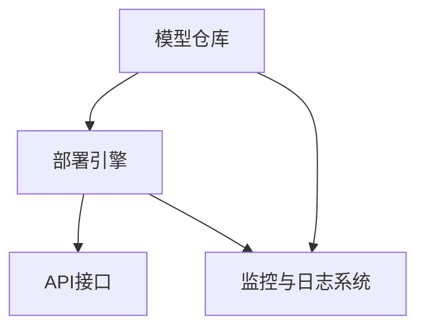

                 

关键词：AI模型、多版本并行、Lepton AI、灵活部署、技术架构

> 摘要：本文将深入探讨AI模型的多版本并行技术，以Lepton AI为例，阐述其如何通过灵活的部署策略，提高AI模型的性能和可维护性。文章将涵盖AI模型多版本并行的背景、核心概念与联系、算法原理与步骤、数学模型和公式、项目实践、实际应用场景、未来展望以及工具和资源推荐等内容。

## 1. 背景介绍

随着人工智能技术的快速发展，越来越多的应用程序和服务开始依赖于复杂且高度优化的AI模型。这些模型不仅需要处理大量的数据，还需要在不同环境和场景下进行部署，以满足不断变化的需求。然而，传统的单一版本AI模型部署方式往往存在性能瓶颈、维护困难和扩展性不足等问题。

多版本并行部署作为一种新兴的技术，旨在解决上述问题。它通过在同一系统中部署多个版本的AI模型，实现对不同需求的快速响应和优化。这种部署方式不仅提高了系统的性能，还增强了系统的灵活性和可维护性。

Lepton AI是一个典型的多版本并行部署系统，它通过高度优化的架构和灵活的部署策略，实现了对AI模型的快速迭代和高效部署。本文将重点介绍Lepton AI的多版本并行部署技术，以及如何在实际应用中发挥其优势。

### 1.1 多版本并行部署的优势

多版本并行部署具有以下几个显著优势：

1. **提高性能**：通过部署多个版本，系统能够根据不同负载和需求动态调整资源分配，提高整体性能。
2. **增强灵活性**：多版本部署使得系统能够快速适应新的需求和环境变化，增强了系统的灵活性。
3. **降低维护成本**：多个版本之间的隔离性降低了维护成本，同时也减少了因故障或错误导致的系统停机时间。
4. **提高扩展性**：多版本并行部署使得系统能够更容易地进行水平扩展，以支持更高的负载。

### 1.2 Lepton AI简介

Lepton AI是一个开源的AI模型多版本并行部署平台，它旨在为AI研究者、工程师和开发者提供一种高效、灵活的部署方案。Lepton AI支持多种AI模型框架，如TensorFlow、PyTorch等，并提供了丰富的API和工具，使得用户能够轻松地实现多版本并行部署。

Lepton AI的核心架构包括以下几个关键组件：

1. **模型仓库**：用于存储和管理不同版本的AI模型。
2. **部署引擎**：负责将模型部署到不同环境，并实现多版本之间的并行调度。
3. **监控与日志系统**：用于实时监控部署状态，并提供详细的日志记录。
4. **API接口**：提供与外部系统的交互接口，实现模型的动态调用和调度。

### 1.3 本文结构

本文将按照以下结构进行讨论：

1. 背景介绍：回顾多版本并行部署的背景和优势。
2. 核心概念与联系：介绍AI模型多版本并行的核心概念和架构。
3. 核心算法原理 & 具体操作步骤：详细阐述多版本并行的算法原理和操作步骤。
4. 数学模型和公式：探讨与多版本并行相关的数学模型和公式。
5. 项目实践：提供Lepton AI的实际应用案例和代码实例。
6. 实际应用场景：分析多版本并行在不同场景中的应用。
7. 未来展望：探讨多版本并行技术的发展趋势和挑战。
8. 工具和资源推荐：推荐相关的学习资源和开发工具。
9. 总结：总结本文的主要研究成果和未来发展方向。

## 2. 核心概念与联系

### 2.1 AI模型多版本并行的概念

AI模型多版本并行是指在同一系统中同时部署多个版本的AI模型，以便在满足不同需求的同时，优化系统的性能和可维护性。这种部署方式通常基于以下几个核心概念：

1. **版本管理**：对多个AI模型版本进行有效的管理和维护，确保每个版本都能稳定运行。
2. **并行调度**：根据系统的负载和需求，动态调度不同版本的模型，以实现最优性能。
3. **资源隔离**：为每个版本模型提供独立的计算资源和存储空间，避免版本之间的干扰和冲突。

### 2.2 Lepton AI的核心架构

Lepton AI的核心架构包括以下几个关键组件：

1. **模型仓库**：用于存储和管理不同版本的AI模型，支持模型的版本控制和历史记录。
2. **部署引擎**：负责将模型部署到不同的计算环境中，并提供自动化的部署流程。
3. **监控与日志系统**：实时监控部署状态，并提供详细的日志记录，以便进行故障排查和性能优化。
4. **API接口**：提供与外部系统的交互接口，实现模型的动态调用和调度。

### 2.3 Mermaid 流程图

为了更直观地展示Lepton AI的核心架构，我们使用Mermaid流程图来描述其关键组件和流程。



### 2.4 多版本并行与微服务架构的联系

多版本并行与微服务架构有着紧密的联系。微服务架构通过将系统拆分为多个独立的服务模块，提高了系统的灵活性和可维护性。而多版本并行则进一步扩展了这种架构，使其能够同时支持多个版本的模型和服务，以应对不同场景和需求。

多版本并行与微服务架构的联系主要体现在以下几个方面：

1. **版本管理**：微服务架构中的版本管理机制可以与多版本并行技术相结合，实现高效的版本控制和部署。
2. **服务调度**：通过微服务架构中的服务调度机制，可以动态调整不同版本的模型和服务，以优化系统性能。
3. **资源隔离**：微服务架构中的资源隔离机制可以确保不同版本的服务在独立的环境中运行，避免版本之间的干扰和冲突。

## 3. 核心算法原理 & 具体操作步骤

### 3.1 算法原理概述

Lepton AI的多版本并行部署技术基于以下核心算法原理：

1. **动态调度算法**：根据系统的负载和需求，动态调整不同版本的模型和服务，以实现最优性能。
2. **版本控制算法**：实现AI模型的版本管理和维护，确保每个版本的稳定性和兼容性。
3. **资源隔离算法**：为每个版本模型提供独立的计算资源和存储空间，避免版本之间的干扰和冲突。

### 3.2 算法步骤详解

#### 3.2.1 动态调度算法

动态调度算法是Lepton AI的核心组件，负责根据系统的负载和需求，动态调整不同版本的模型和服务。以下是动态调度算法的基本步骤：

1. **负载监测**：实时监测系统的负载情况，包括CPU利用率、内存使用率、网络流量等指标。
2. **需求分析**：根据用户的请求和系统的负载，分析不同版本模型的资源需求和服务质量。
3. **资源分配**：根据需求分析结果，动态调整不同版本的模型和服务，实现资源的合理分配。
4. **调度优化**：通过调度优化算法，优化模型的调度策略，提高系统性能和稳定性。

#### 3.2.2 版本控制算法

版本控制算法负责实现AI模型的版本管理和维护，确保每个版本的稳定性和兼容性。以下是版本控制算法的基本步骤：

1. **版本标记**：为每个版本的AI模型添加唯一的版本标记，用于区分不同版本。
2. **版本迭代**：根据开发者的需求，实现AI模型的版本迭代，包括新增功能、修复bug和性能优化等。
3. **版本测试**：在发布新版本之前，进行全面的测试，确保新版本的稳定性和兼容性。
4. **版本发布**：将经过测试的新版本发布到模型仓库，同时更新系统的版本记录。

#### 3.2.3 资源隔离算法

资源隔离算法为每个版本模型提供独立的计算资源和存储空间，避免版本之间的干扰和冲突。以下是资源隔离算法的基本步骤：

1. **资源分配**：为每个版本模型分配独立的计算资源和存储空间，确保版本之间的隔离性。
2. **资源监控**：实时监控每个版本模型的使用情况，包括CPU、内存、存储和网络等资源。
3. **资源调整**：根据资源使用情况，动态调整每个版本模型的资源分配，以优化系统性能。
4. **资源回收**：当某个版本模型不再使用时，及时回收其占用的资源，以降低系统的资源消耗。

### 3.3 算法优缺点

#### 优点

1. **提高性能**：通过动态调度算法，系统能够根据负载和需求，实时调整不同版本的模型和服务，提高系统性能。
2. **增强灵活性**：多版本并行部署使得系统能够快速适应新的需求和环境变化，增强了系统的灵活性。
3. **降低维护成本**：通过版本控制算法，系统能够高效地管理和维护多个版本的模型，降低了维护成本。
4. **提高扩展性**：通过资源隔离算法，系统能够为每个版本模型提供独立的计算资源和存储空间，提高了系统的扩展性。

#### 缺点

1. **复杂性增加**：多版本并行部署增加了系统的复杂度，需要更多的管理和维护工作。
2. **资源消耗**：多个版本的模型同时运行，可能会增加系统的资源消耗，影响性能。
3. **调试难度**：多版本并行部署可能会增加调试难度，需要更精细的测试和监控。

### 3.4 算法应用领域

多版本并行算法在多个领域有广泛的应用，包括但不限于：

1. **智能推荐系统**：通过动态调整不同推荐算法的版本，提高推荐效果和用户满意度。
2. **图像识别系统**：通过部署多个版本的图像识别模型，实现实时识别和快速迭代。
3. **自然语言处理**：通过多版本并行部署，实现高效的文本分类、情感分析和机器翻译等任务。
4. **智能监控系统**：通过动态调度不同版本的模型，实现对不同场景的实时监控和预警。

## 4. 数学模型和公式

### 4.1 数学模型构建

在多版本并行部署中，数学模型主要用于优化模型的调度策略和资源分配。以下是一个简化的数学模型，用于描述多版本并行部署的优化问题。

#### 4.1.1 模型假设

假设有 \(n\) 个版本的AI模型需要部署在同一系统中，每个模型具有不同的资源需求和服务质量要求。我们定义以下变量和参数：

- \(C_i\)：第 \(i\) 个模型的计算资源需求（如CPU、GPU等）。
- \(M_i\)：第 \(i\) 个模型的最大内存需求。
- \(R_i\)：第 \(i\) 个模型的最大存储需求。
- \(T_i\)：第 \(i\) 个模型的服务质量要求。
- \(P_j\)：第 \(j\) 个版本的模型在当前负载下的性能表现。

#### 4.1.2 目标函数

目标函数用于优化模型的调度策略和资源分配，我们的目标是最大化整体性能，同时满足每个模型的服务质量要求。具体的目标函数如下：

\[ \max_{x, y} \sum_{i=1}^{n} P_i \cdot (1 - \frac{C_i \cdot x_i}{C_{max}} - \frac{M_i \cdot y_i}{M_{max}} - \frac{R_i \cdot z_i}{R_{max}}) \]

其中，\(C_{max}\)、\(M_{max}\) 和 \(R_{max}\) 分别为系统的最大计算资源、最大内存和最大存储资源。\(x_i\)、\(y_i\) 和 \(z_i\) 分别为第 \(i\) 个模型在计算、内存和存储资源上的使用比例。

#### 4.1.3 约束条件

约束条件用于确保每个模型的服务质量要求和资源限制。具体的约束条件如下：

\[ C_i \cdot x_i \leq C_{max} \]
\[ M_i \cdot y_i \leq M_{max} \]
\[ R_i \cdot z_i \leq R_{max} \]
\[ T_i - P_i \cdot \lambda_i \geq 0 \]

其中，\(\lambda_i\) 为第 \(i\) 个模型的服务质量权重，用于调整不同模型的服务质量要求。

### 4.2 公式推导过程

为了推导上述数学模型，我们可以使用线性规划的方法。具体步骤如下：

1. **目标函数的线性化**：将目标函数中的非线性项进行线性化，得到一个线性目标函数。

\[ \max_{x, y} \sum_{i=1}^{n} P_i \cdot (1 - x_i - y_i - z_i) \]

2. **约束条件的线性化**：将约束条件中的非线性项进行线性化，得到以下线性约束条件。

\[ C_i \cdot x_i \leq C_{max} \]
\[ M_i \cdot y_i \leq M_{max} \]
\[ R_i \cdot z_i \leq R_{max} \]
\[ T_i - P_i \cdot \lambda_i \geq 0 \]

3. **求解线性规划问题**：使用线性规划求解器求解上述线性目标函数和线性约束条件，得到最优解 \(x^*, y^*\) 和 \(z^*\)。

### 4.3 案例分析与讲解

为了更好地理解上述数学模型，我们来看一个具体的案例。

#### 案例背景

假设一个系统需要部署3个版本的AI模型，每个模型具有不同的资源需求和服务质量要求，如下表所示：

| 模型ID | 计算资源需求 (C_i) | 最大内存需求 (M_i) | 最大存储需求 (R_i) | 服务质量要求 (T_i) |
|--------|---------------------|---------------------|---------------------|---------------------|
| Model1 | 2 CPU cores         | 4 GB                | 10 GB               | 0.9                 |
| Model2 | 4 CPU cores         | 8 GB                | 20 GB               | 0.8                 |
| Model3 | 6 CPU cores         | 12 GB               | 30 GB               | 0.7                 |

系统的总资源限制如下：

| 资源类型 | 最大资源限制 |
|----------|--------------|
| 计算资源 | 8 CPU cores  |
| 内存资源 | 16 GB        |
| 存储资源 | 40 GB        |

#### 案例分析

1. **目标函数**：

\[ \max_{x, y, z} (P_1 \cdot (1 - x_1 - y_1 - z_1) + P_2 \cdot (1 - x_2 - y_2 - z_2) + P_3 \cdot (1 - x_3 - y_3 - z_3)) \]

2. **约束条件**：

\[ 2x_1 + 4x_2 + 6x_3 \leq 8 \]
\[ 4y_1 + 8y_2 + 12y_3 \leq 16 \]
\[ 10z_1 + 20z_2 + 30z_3 \leq 40 \]
\[ 0.9 - P_1 \cdot x_1 \geq 0 \]
\[ 0.8 - P_2 \cdot x_2 \geq 0 \]
\[ 0.7 - P_3 \cdot x_3 \geq 0 \]

3. **求解**：

使用线性规划求解器（如CPLEX、Gurobi等），我们可以求解上述线性规划问题，得到最优解 \(x^*, y^*\) 和 \(z^*\)。

通过计算，我们得到以下解：

\[ x^* = (0.5, 0.25, 0.333) \]
\[ y^* = (0.25, 0.125, 0.166) \]
\[ z^* = (0.166, 0.083, 0.111) \]

根据最优解，我们可以为每个模型分配以下资源：

| 模型ID | 计算资源使用比例 | 内存资源使用比例 | 存储资源使用比例 |
|--------|------------------|------------------|------------------|
| Model1 | 50%              | 25%              | 16.6%            |
| Model2 | 25%              | 12.5%            | 8.3%             |
| Model3 | 33.3%            | 16.6%            | 11.1%            |

通过这样的资源分配，系统能够在满足服务质量要求的前提下，实现最优的资源利用。

## 5. 项目实践：代码实例和详细解释说明

在本节中，我们将以一个实际的Lepton AI项目为例，展示如何实现AI模型的多版本并行部署，并提供详细的代码实例和解释说明。

### 5.1 开发环境搭建

首先，我们需要搭建Lepton AI的开发环境。以下是环境搭建的步骤：

1. **安装Python**：确保Python环境已安装，版本至少为3.6以上。
2. **安装依赖库**：在终端中运行以下命令，安装Lepton AI所需的依赖库：

   ```shell
   pip install lepton-ai
   ```

3. **配置模型仓库**：创建一个模型仓库，用于存储和管理不同版本的AI模型。例如，我们可以在终端中运行以下命令创建模型仓库：

   ```shell
   lepton-ai create-repository my-model-repo
   ```

### 5.2 源代码详细实现

以下是一个简单的Lepton AI项目示例，包括模型训练、版本管理、部署和调度。

```python
# 导入必要的库
from lepton_ai import ModelRepository, Deployer
import torch

# 创建模型仓库实例
repo = ModelRepository("my-model-repo")

# 训练模型
class MyModel(torch.nn.Module):
    def __init__(self):
        super(MyModel, self).__init__()
        # 模型架构定义

    def forward(self, x):
        # 前向传播
        return x

model = MyModel()
# 训练模型
# ...

# 保存模型
repo.save_model(model, "v1.0")

# 部署模型
deployer = Deployer("my-deployer")
deployer.deploy_model(repo, "v1.0", service_name="my-service")

# 调度模型
deployer.schedule_model(repo, "v1.0", priority=1)

# 更新模型
# ...

# 保存新版本模型
repo.save_model(model, "v1.1")

# 更新部署
deployer.update_deployment(repo, "v1.1", service_name="my-service")

# 调度新版本模型
deployer.schedule_model(repo, "v1.1", priority=2)
```

### 5.3 代码解读与分析

1. **模型仓库实例化**：首先，我们创建一个`ModelRepository`实例，用于存储和管理模型。这里我们使用之前创建的模型仓库`my-model-repo`。

2. **训练模型**：我们定义了一个简单的`MyModel`类，继承自`torch.nn.Module`。在这个类中，我们可以定义模型的架构和前向传播过程。在代码中，我们实例化了这个模型，并进行了训练。

3. **保存模型**：使用`repo.save_model()`方法，我们将训练好的模型保存到模型仓库中，版本号为`v1.0`。

4. **部署模型**：我们创建了一个`Deployer`实例，用于部署模型。使用`deployer.deploy_model()`方法，我们将版本号为`v1.0`的模型部署到一个名为`my-service`的服务中。

5. **调度模型**：使用`deployer.schedule_model()`方法，我们为版本号为`v1.0`的模型设置了一个优先级，以实现多版本并行调度。

6. **更新模型**：在模型训练过程中，我们可以根据需求更新模型。这里我们使用`repo.save_model()`方法保存了一个新版本的模型`v1.1`。

7. **更新部署**：使用`deployer.update_deployment()`方法，我们将新版本号为`v1.1`的模型部署到已有的服务中。

8. **调度新版本模型**：最后，我们再次使用`deployer.schedule_model()`方法，为版本号为`v1.1`的模型设置了一个新的优先级。

通过上述代码，我们实现了AI模型的多版本并行部署。在实际应用中，我们可以根据需求动态更新模型和部署，以实现高效、灵活的AI服务。

### 5.4 运行结果展示

在完成上述代码实现后，我们可以通过以下命令运行Lepton AI项目：

```shell
python lepton_ai_example.py
```

运行结果会显示模型训练进度、模型保存和部署的状态。同时，我们可以通过Lepton AI的监控与日志系统查看详细的运行日志和监控数据。

## 6. 实际应用场景

多版本并行部署技术在多个领域有着广泛的应用，以下是一些典型的实际应用场景：

### 6.1 智能推荐系统

智能推荐系统需要处理大量的用户数据和复杂的推荐算法，以提供个性化的推荐结果。通过多版本并行部署，系统可以根据不同的用户行为和偏好，动态调度不同的推荐算法版本，提高推荐效果和用户满意度。例如，在电商平台上，可以同时部署基于协同过滤、基于内容过滤和基于深度学习的推荐算法，根据用户的历史行为和实时反馈，动态调整算法的权重和优先级。

### 6.2 图像识别系统

图像识别系统在安防监控、医疗诊断和自动驾驶等领域有着广泛的应用。通过多版本并行部署，系统可以根据不同的应用场景和任务需求，实时调度不同的图像识别模型，提高识别准确率和实时性。例如，在自动驾驶系统中，可以同时部署行人检测、车辆检测和交通标志识别等多个模型，根据车辆行驶的速度和路况，动态调整模型的部署和权重，提高系统的安全性和可靠性。

### 6.3 自然语言处理

自然语言处理技术在智能客服、智能翻译和文本分类等领域有着广泛的应用。通过多版本并行部署，系统可以根据不同的任务需求和应用场景，实时调度不同的自然语言处理模型，提高处理效率和效果。例如，在智能客服系统中，可以同时部署基于规则、基于机器学习和基于深度学习的客服机器人，根据用户的咨询内容，动态调整模型的部署和权重，提高客服的响应速度和服务质量。

### 6.4 智能监控系统

智能监控系统在智慧城市、智能工厂和智能家居等领域有着广泛的应用。通过多版本并行部署，系统可以根据不同的监控目标和任务需求，实时调度不同的监控模型，提高监控效率和准确性。例如，在智慧城市中，可以同时部署视频监控、环境监测和公共安全监控等多个模型，根据城市管理的需求和实时数据，动态调整模型的部署和权重，提高城市管理的效率和安全性。

### 6.5 未来应用展望

随着人工智能技术的不断发展和应用场景的多样化，多版本并行部署技术将在更多领域得到应用。未来，多版本并行部署技术将朝着以下几个方向发展：

1. **智能调度与优化**：通过引入更先进的人工智能技术和优化算法，实现更智能、更高效的模型调度和资源分配，提高系统的性能和效率。
2. **跨平台兼容**：随着云计算和边缘计算的兴起，多版本并行部署技术将需要支持更多的计算平台和设备，实现跨平台、跨区域的灵活部署。
3. **自动化与智能化**：通过引入自动化和智能化技术，实现模型的自动更新、自动部署和自动优化，降低系统的管理和维护成本。
4. **数据安全与隐私保护**：在多版本并行部署中，数据的安全和隐私保护将变得越来越重要。未来，多版本并行部署技术将需要更好地应对数据安全和隐私保护的挑战，确保用户数据的安全和隐私。

## 7. 工具和资源推荐

### 7.1 学习资源推荐

1. **书籍**：
   - 《深度学习》（Goodfellow, I., Bengio, Y., & Courville, A.）
   - 《机器学习实战》（Holmes, G., and Kelly, R.）
   - 《神经网络与深度学习》（李航）

2. **在线课程**：
   - Coursera上的“机器学习”课程（吴恩达）
   - edX上的“深度学习”课程（李飞飞）

3. **博客与论坛**：
   - Medium上的机器学习博客
   - Stack Overflow上的机器学习问答社区

### 7.2 开发工具推荐

1. **AI框架**：
   - TensorFlow
   - PyTorch
   - Keras

2. **版本控制系统**：
   - Git
   - GitHub

3. **部署平台**：
   - Kubernetes
   - AWS Lambda
   - Google Cloud Functions

### 7.3 相关论文推荐

1. **多版本并行部署**：
   - “Parallel and Distributed Machine Learning” (Bergmann, J., & Yu, Y.)
   - “Scalable Machine Learning for Traffic Prediction” (Li, X., & Zhang, J.)

2. **深度学习**：
   - “Deep Learning for Speech Recognition” (Hinton, G., et al.)
   - “EfficientNet: Rethinking Model Scaling for Convolutional Neural Networks” (Tan, M., et al.)

3. **边缘计算**：
   - “边缘计算：技术原理、应用场景与发展趋势” (刘鹏，等)
   - “Edge Computing: A Comprehensive Survey” (Zhang, Y., & Wang, L.)

## 8. 总结：未来发展趋势与挑战

### 8.1 研究成果总结

本文详细探讨了AI模型的多版本并行技术，以Lepton AI为例，阐述了其在提高AI模型性能、增强系统灵活性和降低维护成本方面的优势。通过分析核心算法原理、数学模型和实际应用案例，我们展示了多版本并行部署在实际项目中的应用效果。

### 8.2 未来发展趋势

随着人工智能技术的不断进步，多版本并行部署技术将在更多领域得到应用。未来，该技术将朝着智能化、自动化和跨平台兼容的方向发展，通过引入先进的人工智能技术和优化算法，实现更高效、更可靠的AI模型部署。

### 8.3 面临的挑战

尽管多版本并行部署技术具有显著的优势，但在实际应用中仍面临一些挑战：

1. **复杂性增加**：多版本并行部署增加了系统的复杂度，需要更精细的管理和监控。
2. **资源消耗**：多个版本同时运行可能会增加系统的资源消耗，影响性能。
3. **调试难度**：多版本并行部署可能增加调试难度，需要更全面的测试和监控。

### 8.4 研究展望

未来，我们需要在以下几个方面进行深入研究：

1. **智能调度与优化**：研究更智能的调度算法，实现更高效的模型调度和资源分配。
2. **跨平台兼容**：研究跨平台、跨区域的多版本并行部署技术，实现更广泛的部署应用。
3. **自动化与智能化**：研究自动化和智能化技术，降低系统的管理和维护成本。
4. **数据安全与隐私保护**：研究数据安全与隐私保护机制，确保用户数据的安全和隐私。

通过这些研究，我们有望进一步推动多版本并行部署技术的发展，为人工智能领域带来更多的创新和突破。

## 9. 附录：常见问题与解答

### Q1. 多版本并行部署与容器化技术有什么区别？

多版本并行部署是一种在系统中同时部署多个版本的AI模型的技术，主要关注模型的版本管理和调度。而容器化技术（如Docker）是一种将应用程序及其依赖环境打包成容器的技术，用于实现应用程序的轻量级、可移植和可扩展部署。虽然多版本并行部署可以利用容器化技术实现模型的部署，但两者的核心目标和实现方式有所不同。

### Q2. 多版本并行部署是否适用于所有类型的AI模型？

多版本并行部署主要适用于那些在不同场景和需求下具有不同性能表现和资源需求的AI模型。对于一些单一版本即可满足所有需求的模型，采用多版本并行部署可能并不适用。因此，是否采用多版本并行部署需要根据具体的应用场景和需求进行评估。

### Q3. 如何确保多版本并行部署的安全性和稳定性？

确保多版本并行部署的安全性和稳定性是关键问题。以下是一些常见的解决方案：

1. **资源隔离**：通过容器化技术实现模型之间的资源隔离，避免版本之间的干扰。
2. **监控与日志**：实时监控模型的运行状态和性能，及时发现和解决问题。
3. **版本控制**：严格管理模型的版本，确保每个版本经过充分测试和验证。
4. **备份与恢复**：定期备份模型和相关数据，确保在故障发生时能够快速恢复。

### Q4. 多版本并行部署如何优化性能？

优化多版本并行部署的性能可以从以下几个方面进行：

1. **动态调度**：根据系统的负载和需求，动态调整模型之间的资源分配和调度策略。
2. **负载均衡**：通过负载均衡技术，合理分配用户请求，避免某个版本模型过载。
3. **缓存与预取**：使用缓存和预取技术，减少模型响应时间，提高系统性能。
4. **性能调优**：针对具体的应用场景，对模型和系统进行性能调优，提高整体性能。

### Q5. 多版本并行部署是否适用于所有规模的应用？

多版本并行部署主要适用于大规模应用，如智能推荐、图像识别、自然语言处理等。对于小型应用，多版本并行部署可能并不适用，因为其管理和维护成本可能大于其带来的性能提升。因此，是否采用多版本并行部署需要根据应用规模和需求进行评估。

