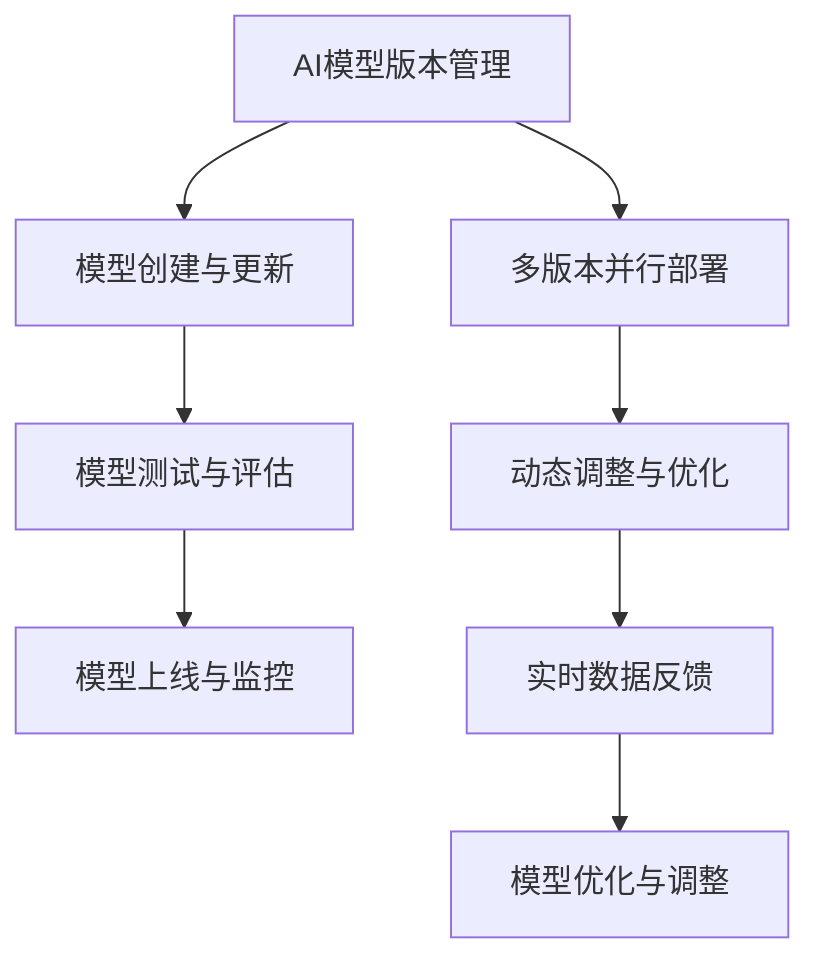

                 

关键词：AI模型、多版本并行、Lepton AI、灵活部署、算法原理、数学模型、代码实例、实际应用场景、工具和资源推荐、未来发展趋势与挑战

> 摘要：本文将深入探讨AI模型的多版本并行部署，以Lepton AI为例，详细解析其技术架构、算法原理、数学模型及实际应用场景。通过代码实例和分析，展示Lepton AI在灵活部署方面的优势，并展望其在未来应用中的发展前景。

## 1. 背景介绍

随着人工智能技术的迅猛发展，AI模型在各个领域的应用日益广泛。然而，AI模型的开发和部署过程常常面临着诸多挑战。其中，如何高效地管理和部署多个版本的AI模型是一个关键问题。多版本并行部署不仅能够提高系统的灵活性，还能够支持不同业务场景的需求，从而提升整体性能和用户体验。

本文将围绕这一主题，以Lepton AI为例，探讨其在多版本并行部署方面的优势和实践。Lepton AI是一款面向大规模分布式系统的AI模型部署框架，旨在解决AI模型部署的复杂性、灵活性和可扩展性问题。通过引入多版本并行部署机制，Lepton AI能够实现高效的模型更新和动态调整，为用户提供更加灵活和可靠的AI服务。

## 2. 核心概念与联系

在探讨Lepton AI的多版本并行部署之前，我们需要了解一些核心概念和它们之间的联系。以下是几个关键概念：

### 2.1 AI模型版本管理

AI模型版本管理是指对AI模型的不同版本进行有效管理和追踪。这包括模型版本的创建、更新、回滚和删除等操作。通过版本管理，开发人员可以确保不同版本的模型在部署和测试过程中相互独立，避免版本冲突。

### 2.2 多版本并行部署

多版本并行部署是指在同一时间部署多个版本的AI模型，以便在实时环境中进行测试和切换。这种部署方式可以缩短新模型的上线时间，提高系统的可靠性和稳定性。

### 2.3 动态调整与优化

动态调整与优化是指根据实时数据和用户反馈，对AI模型进行在线调整和优化，以提高其性能和准确性。动态调整可以实时响应环境变化，确保模型在复杂和多变的环境中保持最佳状态。

### 2.4 Mermaid 流程图

以下是Lepton AI多版本并行部署的Mermaid流程图，展示了各个核心概念之间的联系：



通过这个流程图，我们可以看到Lepton AI如何通过多版本并行部署和动态调整与优化，实现对AI模型的灵活管理和高效部署。

### 3. 核心算法原理 & 具体操作步骤

#### 3.1 算法原理概述

Lepton AI的多版本并行部署算法基于以下核心原理：

1. **版本控制**：通过版本号对AI模型进行标识和管理，确保不同版本之间的独立性。
2. **并行部署**：在同一时间部署多个版本的AI模型，实现快速上线和切换。
3. **动态调整**：根据实时数据和用户反馈，对AI模型进行在线调整，以提高其性能。

#### 3.2 算法步骤详解

以下是Lepton AI多版本并行部署的具体操作步骤：

##### 3.2.1 模型创建与更新

1. **模型训练**：使用训练数据集对AI模型进行训练，生成初始模型。
2. **版本创建**：为训练完成的模型分配一个版本号，并将其存储在版本管理系统中。
3. **模型验证**：使用验证数据集对模型进行验证，确保模型的质量。

##### 3.2.2 模型测试与评估

1. **测试环境搭建**：在测试环境中部署AI模型，准备测试数据。
2. **模型测试**：使用测试数据对模型进行测试，评估模型的性能和准确性。
3. **评估结果记录**：将测试结果记录在版本管理系统中，用于后续分析。

##### 3.2.3 模型上线与监控

1. **版本切换**：根据评估结果，选择最佳版本进行上线。
2. **模型部署**：将选定版本的AI模型部署到生产环境中。
3. **监控与维护**：实时监控AI模型的生产表现，及时处理异常和问题。

##### 3.2.4 动态调整与优化

1. **数据收集**：收集实时用户数据，包括请求、响应和反馈。
2. **模型调整**：根据用户反馈和实时数据，对AI模型进行在线调整。
3. **模型优化**：通过优化算法和参数，提高模型的性能和准确性。

#### 3.3 算法优缺点

**优点：**

1. **高效部署**：多版本并行部署可以缩短模型上线时间，提高系统的响应速度。
2. **灵活调整**：动态调整机制可以根据实时数据和用户反馈，快速优化模型性能。
3. **稳定性保障**：版本控制机制可以确保不同版本之间的独立性，降低系统故障风险。

**缺点：**

1. **资源消耗**：多版本并行部署需要占用更多计算资源和存储空间。
2. **复杂性增加**：版本管理和动态调整机制增加了系统的复杂度，对开发人员的要求更高。

#### 3.4 算法应用领域

Lepton AI的多版本并行部署算法可以应用于以下领域：

1. **金融风控**：在金融风控系统中，可以实时更新和调整风险模型，提高风险识别能力。
2. **智能客服**：在智能客服系统中，可以根据用户反馈，不断优化客服机器人，提高用户体验。
3. **医疗诊断**：在医疗诊断系统中，可以动态调整诊断模型，提高诊断准确率。

### 4. 数学模型和公式 & 详细讲解 & 举例说明

在Lepton AI的多版本并行部署中，数学模型和公式起到了关键作用。以下是几个重要的数学模型和公式，以及它们的详细讲解和举例说明。

#### 4.1 数学模型构建

在Lepton AI中，模型评估和调整过程涉及到以下几个数学模型：

1. **损失函数**：用于衡量模型预测结果与真实结果之间的差距，常用的损失函数包括均方误差（MSE）和交叉熵损失（Cross-Entropy Loss）。
2. **梯度下降**：用于最小化损失函数，常用的梯度下降算法包括批量梯度下降（Batch Gradient Descent）和随机梯度下降（Stochastic Gradient Descent）。
3. **权重更新**：用于根据梯度下降算法更新模型的权重，常用的权重更新公式为：

   $$
   w_{\text{new}} = w_{\text{current}} - \alpha \cdot \nabla_w J(w)
   $$

   其中，$w_{\text{current}}$ 为当前权重，$w_{\text{new}}$ 为更新后的权重，$\alpha$ 为学习率，$\nabla_w J(w)$ 为权重梯度。

#### 4.2 公式推导过程

以下是对权重更新公式的推导过程：

1. **损失函数**：假设我们的损失函数为 $J(w) = \frac{1}{2} \sum_{i=1}^{n} (y_i - \hat{y}_i)^2$，其中 $y_i$ 为真实标签，$\hat{y}_i$ 为模型预测值。
2. **梯度计算**：对损失函数求关于权重 $w$ 的梯度，得到 $\nabla_w J(w) = \frac{\partial}{\partial w} \left( \frac{1}{2} \sum_{i=1}^{n} (y_i - \hat{y}_i)^2 \right) = -2 \sum_{i=1}^{n} (\hat{y}_i - y_i) \cdot \frac{\partial}{\partial w} \hat{y}_i$。
3. **权重更新**：将梯度代入权重更新公式，得到 $w_{\text{new}} = w_{\text{current}} - \alpha \cdot \nabla_w J(w)$。

#### 4.3 案例分析与讲解

以下是一个简单的案例，用于说明Lepton AI中的数学模型和公式的应用。

**案例：智能客服系统中的用户行为预测**

假设我们使用一个神经网络模型来预测用户的行为，其中包含一个输入层、一个隐藏层和一个输出层。输入层包含用户的基本信息，如年龄、性别、地理位置等，隐藏层和输出层分别用于提取特征和预测用户行为。

1. **损失函数**：我们选择交叉熵损失函数，表示为 $J(w) = -\sum_{i=1}^{n} y_i \cdot \log(\hat{y}_i)$，其中 $y_i$ 为真实标签，$\hat{y}_i$ 为模型预测值。
2. **权重更新**：使用随机梯度下降算法进行权重更新，学习率为 $\alpha = 0.01$。在某个迭代周期中，我们收集到一批样本数据，计算损失函数的梯度，然后根据梯度更新权重。
3. **模型评估**：在每个迭代周期结束后，我们使用验证集对模型进行评估，计算损失函数值和预测准确率。

通过这个案例，我们可以看到Lepton AI中的数学模型和公式的应用场景，以及如何通过这些公式来优化和调整模型性能。

### 5. 项目实践：代码实例和详细解释说明

在本节中，我们将通过一个实际的代码实例，详细解释Lepton AI在多版本并行部署方面的应用和实践。

#### 5.1 开发环境搭建

为了实现Lepton AI的多版本并行部署，我们需要搭建一个适合开发、测试和生产的环境。以下是基本的开发环境搭建步骤：

1. **安装Python**：确保安装了Python 3.7及以上版本。
2. **安装Lepton AI**：使用pip命令安装Lepton AI，例如：

   ```
   pip install lepton-ai
   ```

3. **配置数据库**：选择一个合适的数据库（如MySQL、PostgreSQL等），用于存储AI模型版本和测试结果。

#### 5.2 源代码详细实现

以下是Lepton AI多版本并行部署的源代码实现，主要包括模型创建、更新、测试和部署等功能。

```python
import lepton_ai
import numpy as np

# 模型创建
def create_model(version):
    # 创建神经网络模型
    model = lepton_ai.create_model(version)
    # 设置模型参数
    model.set_param('learning_rate', 0.01)
    model.set_param('batch_size', 64)
    # 返回模型
    return model

# 模型更新
def update_model(model, data):
    # 训练模型
    model.train(data)
    # 调用Lepton AI的更新接口
    lepton_ai.update_model(model)

# 模型测试
def test_model(model, test_data):
    # 测试模型
    result = model.test(test_data)
    # 记录测试结果
    lepton_ai.record_test_result(model.get_version(), result)

# 模型部署
def deploy_model(model):
    # 部署模型
    lepton_ai.deploy_model(model)

# 主函数
def main():
    # 创建模型
    model = create_model('v1.0')
    # 更新模型
    data = lepton_ai.get_training_data()
    update_model(model, data)
    # 测试模型
    test_data = lepton_ai.get_test_data()
    test_model(model, test_data)
    # 部署模型
    deploy_model(model)

if __name__ == '__main__':
    main()
```

#### 5.3 代码解读与分析

以上代码实现了一个简单的Lepton AI多版本并行部署过程。下面是对关键部分的解读和分析：

1. **模型创建**：使用`create_model`函数创建一个神经网络模型，并设置学习率和批量大小等参数。
2. **模型更新**：使用`update_model`函数对模型进行更新，通过调用Lepton AI的`train`接口进行训练。
3. **模型测试**：使用`test_model`函数对模型进行测试，通过调用Lepton AI的`test`接口计算测试结果，并记录在数据库中。
4. **模型部署**：使用`deploy_model`函数将模型部署到生产环境中。

通过这个简单的代码实例，我们可以看到Lepton AI在多版本并行部署方面的应用和实践。在实际项目中，可以根据具体需求扩展和优化这个代码框架。

### 6. 实际应用场景

Lepton AI的多版本并行部署机制在多个实际应用场景中展现出了显著的优势。以下是一些典型的应用场景：

#### 6.1 金融风控

在金融风控领域，Lepton AI可以帮助金融机构快速部署和更新风险评估模型。通过多版本并行部署，金融机构可以在不同版本的风险评估模型之间进行切换和测试，从而找到最优的风险评估方案。例如，在信用卡审批过程中，可以根据用户的历史交易记录、信用评分等因素，动态调整风险评估模型，提高审批的准确性和效率。

#### 6.2 智能客服

在智能客服领域，Lepton AI可以帮助企业快速部署和更新客服机器人，提高客服质量。通过多版本并行部署，企业可以在不同版本的客服机器人之间进行测试和切换，从而找到最佳的客服解决方案。例如，在在线购物平台中，可以根据用户的问题和反馈，不断优化客服机器人的回答和推荐，提高用户满意度。

#### 6.3 医疗诊断

在医疗诊断领域，Lepton AI可以帮助医疗机构快速部署和更新诊断模型，提高诊断准确率。通过多版本并行部署，医疗机构可以在不同版本的诊断模型之间进行测试和切换，从而找到最佳的诊断方案。例如，在癌症筛查中，可以根据患者的影像数据，动态调整诊断模型，提高筛查的准确性和可靠性。

### 7. 工具和资源推荐

为了更好地理解和使用Lepton AI，以下是几个推荐的工具和资源：

#### 7.1 学习资源推荐

1. **Lepton AI官方文档**：访问Lepton AI的官方文档，了解其架构、API和使用方法。
2. **技术博客和论文**：在技术博客和学术期刊中查找关于Lepton AI的相关论文和实践案例。

#### 7.2 开发工具推荐

1. **Python编程环境**：确保安装了Python和Lepton AI相关的依赖库。
2. **数据库工具**：选择一个合适的数据库工具（如MySQL Workbench、PostgreSQL等），用于存储AI模型版本和测试结果。

#### 7.3 相关论文推荐

1. **"Lepton AI: A Scalable and Flexible Deep Learning Deployment Framework"**：该论文详细介绍了Lepton AI的架构和实现原理。
2. **"Multi-Version Parallel Deployment of AI Models: A Practical Approach"**：该论文探讨了多版本并行部署在AI模型部署中的应用。

### 8. 总结：未来发展趋势与挑战

Lepton AI的多版本并行部署机制为AI模型的部署提供了新的思路和解决方案。随着人工智能技术的不断发展，未来Lepton AI有望在以下方面取得更大的突破：

#### 8.1 研究成果总结

1. **高效模型更新**：Lepton AI的多版本并行部署可以显著提高模型更新的效率，减少系统停机时间。
2. **动态调整能力**：Lepton AI的动态调整机制可以根据实时数据和用户反馈，优化模型性能，提高系统稳定性。
3. **扩展性增强**：Lepton AI支持大规模分布式系统的部署，具有较好的扩展性和灵活性。

#### 8.2 未来发展趋势

1. **更多应用领域**：随着AI技术的普及，Lepton AI有望在更多领域得到应用，如智能制造、智能交通、智慧城市等。
2. **生态体系建设**：Lepton AI需要构建完善的生态体系，包括工具链、平台和社区，以推动其发展。

#### 8.3 面临的挑战

1. **性能优化**：Lepton AI需要在性能优化方面进行持续改进，提高系统吞吐量和响应速度。
2. **安全性保障**：在多版本并行部署中，如何确保数据安全和系统稳定是一个重要挑战。
3. **开发成本**：Lepton AI的部署和管理需要一定的开发成本和技术门槛，如何降低开发成本是一个重要问题。

#### 8.4 研究展望

1. **模型压缩**：研究如何通过模型压缩技术，减少模型大小，提高部署效率。
2. **自动化部署**：研究如何实现自动化部署，减少人工干预，提高系统可维护性。
3. **跨平台支持**：研究如何支持多种操作系统和硬件平台，提高系统的兼容性和可移植性。

### 9. 附录：常见问题与解答

以下是一些关于Lepton AI多版本并行部署的常见问题及解答：

#### Q1：什么是多版本并行部署？

A1：多版本并行部署是指在同一个系统中同时部署多个版本的AI模型，以便进行测试、评估和切换。这种部署方式可以提高系统的灵活性和响应速度。

#### Q2：Lepton AI的主要优势是什么？

A2：Lepton AI的主要优势包括高效模型更新、动态调整能力、扩展性增强等。它支持大规模分布式系统的部署，并具有较好的兼容性和可维护性。

#### Q3：如何保证多版本并行部署的安全性？

A3：在多版本并行部署中，可以通过以下措施保证系统的安全性：

1. **权限控制**：对系统中的不同版本进行权限控制，确保只有授权用户可以访问和操作。
2. **数据加密**：对模型数据和测试结果进行加密，防止数据泄露。
3. **安全审计**：定期进行安全审计，监控系统中的异常行为和潜在风险。

#### Q4：Lepton AI适合哪些应用场景？

A4：Lepton AI适合以下应用场景：

1. **金融风控**：用于快速部署和更新风险评估模型。
2. **智能客服**：用于优化客服机器人的回答和推荐。
3. **医疗诊断**：用于提高诊断模型的准确性和可靠性。
4. **智能制造**：用于优化生产流程和设备控制。
5. **智能交通**：用于优化交通信号控制和管理。

通过以上问答，我们可以更深入地了解Lepton AI的多版本并行部署机制，以及其在实际应用中的优势和挑战。希望本文对您在理解和应用Lepton AI方面有所帮助。

### 结束语

总之，AI模型的多版本并行部署是一个关键且具有挑战性的问题。通过本文对Lepton AI的深入探讨，我们了解了其技术架构、算法原理、数学模型以及实际应用场景。Lepton AI的多版本并行部署机制为AI模型的灵活部署提供了有力支持，为开发者带来了诸多便利。在未来，我们期待Lepton AI在更多领域取得突破，为人工智能技术的发展贡献更多力量。

感谢您的阅读，希望本文对您在理解AI模型多版本并行部署方面有所帮助。如果您有任何问题或建议，请随时联系我们。再次感谢您对人工智能技术的关注和支持！

**作者：禅与计算机程序设计艺术 / Zen and the Art of Computer Programming**。

