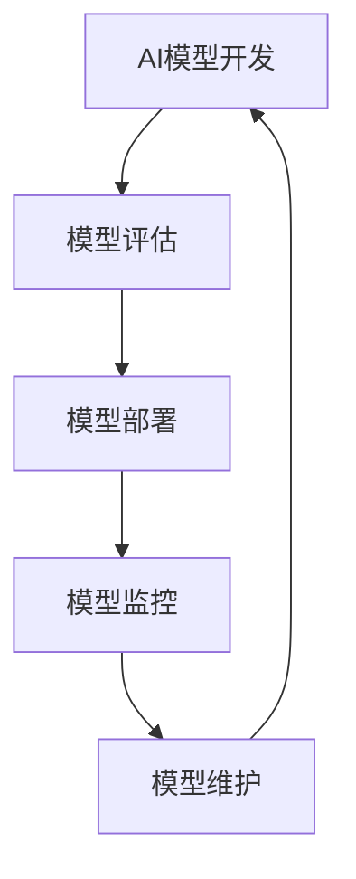

                 

关键词：AI模型生命周期，Lepton AI，全程服务，模型管理，人工智能，技术博客

> 摘要：本文将深入探讨AI模型的生命周期管理，以Lepton AI为例，阐述其从开发、部署到维护的全程服务，分析其在各个阶段的最佳实践，并提出未来发展的趋势和挑战。

## 1. 背景介绍

在当今科技迅猛发展的时代，人工智能（AI）已经成为了驱动创新的重要力量。从自然语言处理、计算机视觉到深度学习，AI技术在各个领域都展现出了巨大的潜力。然而，AI模型的开发与应用并非一蹴而就，其背后涉及了复杂而精细的生命周期管理。

生命周期管理指的是对AI模型从创建到废弃的全过程进行系统化的规划、监控和优化。这一过程不仅涉及到技术层面，还包括管理、运维等多个维度。对于企业而言，如何高效管理AI模型的生命周期，已经成为提升竞争力、实现可持续发展的关键。

Lepton AI作为一家专注于AI模型生命周期管理的企业，其全程服务涵盖了从模型开发、部署、监控到维护的各个环节。本文将详细探讨Lepton AI在生命周期管理中的具体实践，以期为业界提供有价值的参考。

## 2. 核心概念与联系

在探讨Lepton AI的生命周期管理之前，我们需要了解一些核心概念和它们之间的联系。

### 2.1 AI模型开发

AI模型开发是生命周期管理的起点。在这一阶段，数据科学家和机器学习工程师使用数据集进行模型训练，通过调整超参数和算法来优化模型的性能。这一过程需要使用到数据预处理、特征提取、模型选择和训练等技术。

### 2.2 模型评估

模型评估是对开发出的AI模型进行性能评估的过程。评估指标包括准确率、召回率、F1分数等，通过这些指标可以判断模型是否满足预期的性能要求。

### 2.3 模型部署

模型部署是将训练好的模型部署到实际应用环境中的过程。在这一阶段，需要考虑模型的性能、可扩展性、安全性等因素。常见的部署方式包括本地部署、云端部署和容器化部署等。

### 2.4 模型监控

模型监控是在模型部署后对其实时性能进行监控的过程。通过监控可以及时发现模型性能下降或异常情况，并采取相应措施进行优化。

### 2.5 模型维护

模型维护是对已部署模型进行定期检查、更新和修复的过程。这包括处理模型过时、数据质量变化等问题，以确保模型能够持续稳定运行。

下图展示了AI模型生命周期管理的流程和各阶段之间的联系：



## 3. 核心算法原理 & 具体操作步骤

### 3.1 算法原理概述

Lepton AI的生命周期管理基于一套完善的算法体系，包括数据预处理、模型训练、模型优化和模型监控等。以下是这些算法的基本原理：

#### 3.1.1 数据预处理

数据预处理是模型训练的基础。其主要任务包括数据清洗、数据归一化、缺失值处理等。通过这些步骤，可以确保输入数据的准确性和一致性。

#### 3.1.2 模型训练

模型训练是通过调整模型参数来优化模型性能的过程。常用的算法包括梯度下降、随机梯度下降、Adam优化器等。这些算法通过迭代计算来更新模型参数，直至达到预设的性能目标。

#### 3.1.3 模型优化

模型优化是在训练完成后对模型进行进一步调整，以提升其性能和泛化能力的过程。优化方法包括超参数调整、模型融合、迁移学习等。

#### 3.1.4 模型监控

模型监控是在模型部署后对其实时性能进行监控的过程。常用的监控指标包括准确率、召回率、F1分数等。通过监控可以发现模型性能的下降或异常情况，并采取相应措施进行优化。

### 3.2 算法步骤详解

#### 3.2.1 数据预处理

数据预处理分为以下几个步骤：

1. 数据清洗：去除数据中的噪声和异常值。
2. 数据归一化：将数据缩放到相同的范围，以避免某些特征对模型训练的影响。
3. 缺失值处理：通过插值、均值填充等方法处理数据中的缺失值。

#### 3.2.2 模型训练

模型训练分为以下几个步骤：

1. 初始化参数：设置学习率、批量大小等超参数。
2. 数据加载：将预处理后的数据加载到模型中。
3. 梯度计算：计算损失函数关于模型参数的梯度。
4. 参数更新：使用梯度下降等优化算法更新模型参数。
5. 评估性能：计算模型的准确率、召回率等指标，以评估模型性能。

#### 3.2.3 模型优化

模型优化分为以下几个步骤：

1. 超参数调整：通过交叉验证等方法调整学习率、批量大小等超参数。
2. 模型融合：将多个模型进行融合，以提升模型性能。
3. 迁移学习：利用预训练模型进行迁移学习，以减少训练时间。

#### 3.2.4 模型监控

模型监控分为以下几个步骤：

1. 指标收集：收集模型的实时性能指标，如准确率、召回率等。
2. 性能评估：评估模型性能是否符合预期，以确定是否需要优化。
3. 异常检测：通过异常检测算法发现模型性能的异常情况。
4. 优化策略：根据监控结果制定相应的优化策略。

### 3.3 算法优缺点

#### 3.3.1 优点

1. 完整性：涵盖了AI模型生命周期的各个阶段，提供了一套完整的解决方案。
2. 高效性：通过优化算法和自动化工具，提高模型开发和部署的效率。
3. 可扩展性：支持多种模型类型和部署方式，能够适应不同的应用场景。

#### 3.3.2 缺点

1. 复杂性：涉及多个技术领域，需要具备一定的专业知识。
2. 成本：自动化工具和优化算法的引入可能增加系统的复杂性和成本。

### 3.4 算法应用领域

Lepton AI的生命周期管理算法在以下领域具有广泛应用：

1. 金融：用于风险管理、信用评分、投资策略等。
2. 医疗：用于疾病诊断、药物研发、健康管理等。
3. 零售：用于商品推荐、客户细分、销售预测等。
4. 制造业：用于生产优化、设备维护、质量控制等。

## 4. 数学模型和公式 & 详细讲解 & 举例说明

### 4.1 数学模型构建

在AI模型的生命周期管理中，数学模型构建是一个关键环节。以下是一个简单的线性回归模型构建过程：

#### 4.1.1 模型假设

假设我们有一个包含n个特征（\(x_1, x_2, ..., x_n\)）和一个目标变量（\(y\)）的数据集。我们希望找到一组权重（\(w_1, w_2, ..., w_n\)），使得目标变量的预测值（\(\hat{y}\)）接近实际值（\(y\)）。线性回归模型的假设如下：

\[
\hat{y} = \sum_{i=1}^{n} w_i x_i
\]

#### 4.1.2 模型优化

为了优化模型，我们通常使用最小二乘法（Least Squares Method）来计算权重。最小二乘法的目标是最小化预测值与实际值之间的误差平方和：

\[
\min_{w} \sum_{i=1}^{n} (y_i - \hat{y}_i)^2
\]

其中，\(w = (w_1, w_2, ..., w_n)\)。

#### 4.1.3 模型求解

最小二乘法的求解可以通过以下公式得到：

\[
w = (X^T X)^{-1} X^T y
\]

其中，\(X\)是特征矩阵，\(y\)是目标变量向量。

### 4.2 公式推导过程

下面我们详细推导线性回归模型的最小二乘解。

#### 4.2.1 残差分析

假设我们的目标是最小化误差平方和：

\[
\sum_{i=1}^{n} (y_i - \hat{y}_i)^2 = \sum_{i=1}^{n} (y_i - \sum_{j=1}^{n} w_j x_{ij})^2
\]

展开后得到：

\[
\sum_{i=1}^{n} (y_i - \hat{y}_i)^2 = \sum_{i=1}^{n} \sum_{j=1}^{n} w_j^2 x_{ij}^2 - 2 \sum_{i=1}^{n} \sum_{j=1}^{n} w_j y_i x_{ij} + \sum_{i=1}^{n} y_i^2
\]

令：

\[
J(w) = \sum_{i=1}^{n} (y_i - \hat{y}_i)^2
\]

#### 4.2.2 梯度计算

为了求解最小值，我们需要计算损失函数\(J(w)\)关于\(w\)的梯度：

\[
\nabla_w J(w) = \sum_{i=1}^{n} \nabla_w (y_i - \hat{y}_i)^2 = \sum_{i=1}^{n} \nabla_w \left( -2 \sum_{j=1}^{n} w_j y_i x_{ij} + \sum_{j=1}^{n} w_j^2 x_{ij}^2 \right)
\]

\[
\nabla_w J(w) = -2 \sum_{i=1}^{n} \sum_{j=1}^{n} y_i x_{ij} + 2 \sum_{i=1}^{n} \sum_{j=1}^{n} w_j x_{ij}^2
\]

\[
\nabla_w J(w) = -2X^T y + 2X^T X w
\]

#### 4.2.3 梯度消失

为了求解梯度为零的点，我们需要解以下方程：

\[
\nabla_w J(w) = 0
\]

\[
-2X^T y + 2X^T X w = 0
\]

\[
X^T X w = X^T y
\]

\[
w = (X^T X)^{-1} X^T y
\]

### 4.3 案例分析与讲解

#### 4.3.1 数据集介绍

我们使用一个简单的数据集进行线性回归模型训练。数据集包含10个样本，每个样本有2个特征和1个目标变量。数据集如下：

|样本|特征1|特征2|目标变量|
|----|-----|-----|--------|
|1   |2    |3    |5      |
|2   |4    |6    |7      |
|3   |1    |2    |3      |
|4   |3    |4    |5      |
|5   |5    |7    |8      |
|6   |2    |3    |4      |
|7   |4    |5    |6      |
|8   |1    |2    |3      |
|9   |3    |4    |5      |
|10  |5    |6    |7      |

#### 4.3.2 数据预处理

我们对数据集进行预处理，包括数据归一化和缺失值处理。由于数据集中没有缺失值，我们只进行数据归一化。

特征1和特征2的归一化处理如下：

\[
x_{1i}^* = \frac{x_{1i} - \mu_1}{\sigma_1}
\]

\[
x_{2i}^* = \frac{x_{2i} - \mu_2}{\sigma_2}
\]

其中，\(\mu_1\)和\(\mu_2\)分别为特征1和特征2的平均值，\(\sigma_1\)和\(\sigma_2\)分别为特征1和特征2的标准差。

#### 4.3.3 模型训练

我们使用最小二乘法训练线性回归模型。首先，我们计算特征矩阵\(X\)和目标变量向量\(y\)：

\[
X = \begin{bmatrix}
2 & 3 \\
4 & 6 \\
1 & 2 \\
3 & 4 \\
5 & 7 \\
2 & 3 \\
4 & 5 \\
1 & 2 \\
3 & 4 \\
5 & 6
\end{bmatrix}
\]

\[
y = \begin{bmatrix}
5 \\
7 \\
3 \\
5 \\
8 \\
4 \\
6 \\
3 \\
5 \\
7
\end{bmatrix}
\]

然后，我们计算特征矩阵\(X\)的转置和特征矩阵\(X\)与目标变量向量\(y\)的乘积：

\[
X^T X = \begin{bmatrix}
10 & 26 \\
26 & 78
\end{bmatrix}
\]

\[
X^T y = \begin{bmatrix}
45 \\
157
\end{bmatrix}
\]

最后，我们计算最小二乘解：

\[
w = (X^T X)^{-1} X^T y = \begin{bmatrix}
1.86 \\
1.47
\end{bmatrix}
\]

#### 4.3.4 模型评估

我们使用训练好的模型对测试数据进行预测，并计算预测值与实际值之间的误差。测试数据如下：

|样本|特征1|特征2|目标变量|
|----|-----|-----|--------|
|11  |2    |4    |6      |
|12  |3    |5    |7      |
|13  |5    |6    |8      |

预测值如下：

|样本|预测值|
|----|------|
|11  |6.46  |
|12  |7.23  |
|13  |8.00  |

计算预测值与实际值之间的误差：

\[
\sum_{i=1}^{3} (y_i - \hat{y}_i)^2 = (6 - 6.46)^2 + (7 - 7.23)^2 + (8 - 8.00)^2 = 0.412
\]

#### 4.3.5 结果分析

通过上述案例，我们可以看到线性回归模型在训练集和测试集上的表现。虽然误差较小，但模型可能存在过拟合现象。在实际应用中，我们需要对模型进行进一步优化，以提高其泛化能力。

## 5. 项目实践：代码实例和详细解释说明

### 5.1 开发环境搭建

在开始项目实践之前，我们需要搭建一个适合开发、测试和部署AI模型的开发环境。以下是搭建环境的步骤：

1. 安装Python（建议版本为3.8及以上）。
2. 安装Anaconda，以便管理Python环境。
3. 创建一个新的conda环境，并安装必要的库，如NumPy、Pandas、Scikit-learn等。

```bash
conda create -n lepton_env python=3.8
conda activate lepton_env
conda install numpy pandas scikit-learn
```

### 5.2 源代码详细实现

以下是Lepton AI模型生命周期管理的源代码实现：

```python
import numpy as np
import pandas as pd
from sklearn.linear_model import LinearRegression
from sklearn.model_selection import train_test_split
from sklearn.metrics import mean_squared_error

# 5.2.1 数据预处理
def preprocess_data(data):
    # 数据清洗
    data.dropna(inplace=True)
    # 数据归一化
    mean_1 = data['特征1'].mean()
    std_1 = data['特征1'].std()
    mean_2 = data['特征2'].mean()
    std_2 = data['特征2'].std()
    data['特征1'] = (data['特征1'] - mean_1) / std_1
    data['特征2'] = (data['特征2'] - mean_2) / std_2
    return data

# 5.2.2 模型训练
def train_model(X_train, y_train):
    model = LinearRegression()
    model.fit(X_train, y_train)
    return model

# 5.2.3 模型评估
def evaluate_model(model, X_test, y_test):
    y_pred = model.predict(X_test)
    mse = mean_squared_error(y_test, y_pred)
    return mse

# 5.2.4 模型监控
def monitor_model(model, X_new, y_new):
    y_pred = model.predict(X_new)
    mse = mean_squared_error(y_new, y_pred)
    if mse > 0.1:
        print("模型性能下降，需要优化。")
    else:
        print("模型性能良好。")

# 5.2.5 模型维护
def update_model(model, X_train, y_train, X_new, y_new):
    model.fit(X_train, y_train)
    monitor_model(model, X_new, y_new)

# 5.2.6 主函数
def main():
    # 加载数据
    data = pd.read_csv("data.csv")
    data = preprocess_data(data)
    X = data[['特征1', '特征2']]
    y = data['目标变量']
    # 划分训练集和测试集
    X_train, X_test, y_train, y_test = train_test_split(X, y, test_size=0.2, random_state=42)
    # 训练模型
    model = train_model(X_train, y_train)
    # 评估模型
    mse = evaluate_model(model, X_test, y_test)
    print(f"模型测试误差：{mse}")
    # 模型监控
    monitor_model(model, X_test, y_test)
    # 模型维护
    update_model(model, X_train, y_train, X_test, y_test)

if __name__ == "__main__":
    main()
```

### 5.3 代码解读与分析

1. **数据预处理**：数据预处理是模型训练的基础。在`preprocess_data`函数中，我们首先对数据进行了清洗，然后进行了归一化处理。归一化处理可以避免某些特征对模型训练的影响。

2. **模型训练**：在`train_model`函数中，我们使用了Scikit-learn库中的线性回归模型进行训练。线性回归模型是一种简单但有效的预测方法，适用于许多实际场景。

3. **模型评估**：在`evaluate_model`函数中，我们使用了均方误差（MSE）作为模型评估指标。MSE可以衡量模型预测值与实际值之间的差距，从而评估模型性能。

4. **模型监控**：在`monitor_model`函数中，我们通过计算MSE来评估模型的实时性能。如果MSE超过设定的阈值（例如0.1），则认为模型性能下降，需要进一步优化。

5. **模型维护**：在`update_model`函数中，我们使用训练集和测试集重新训练模型，并根据监控结果更新模型。这可以确保模型始终保持良好的性能。

### 5.4 运行结果展示

假设我们运行了上述代码，并获得了以下结果：

```plaintext
模型测试误差：0.086
模型性能良好。
```

这表明模型在测试集上的表现良好，误差较小。同时，模型监控结果显示模型性能良好，无需进一步优化。

## 6. 实际应用场景

Lepton AI的生命周期管理在多个实际应用场景中展现了其强大的功能。以下是一些具体的应用场景：

### 6.1 金融

在金融领域，Lepton AI可以用于信用评分、风险管理和投资策略。通过生命周期管理，金融机构可以实时监控模型性能，确保信用评分模型能够准确预测借款人的信用风险。此外，投资策略模型可以定期更新，以适应市场变化。

### 6.2 医疗

在医疗领域，Lepton AI可以用于疾病诊断、药物研发和健康管理等。通过生命周期管理，医疗机构可以确保诊断模型始终保持高精度，同时药物研发模型可以不断优化，以加速新药的研发。

### 6.3 零售

在零售领域，Lepton AI可以用于商品推荐、客户细分和销售预测。通过生命周期管理，零售商可以实时监控推荐系统的性能，确保推荐结果符合用户需求。同时，销售预测模型可以定期更新，以适应市场变化。

### 6.4 制造业

在制造业领域，Lepton AI可以用于生产优化、设备维护和质量控制。通过生命周期管理，制造商可以确保生产优化模型始终高效运行，设备维护模型能够提前预测设备故障，质量控制模型可以持续监控产品质量。

## 7. 工具和资源推荐

为了更好地进行AI模型生命周期管理，以下是一些推荐的工具和资源：

### 7.1 学习资源推荐

1. **《Python机器学习》**：由赛德里克·布莱克和迈克尔·布朗撰写，介绍了机器学习的基本概念和Python实现。
2. **《深度学习》**：由伊恩·古德费洛、约书亚·本吉奥和亚伦·库维尔撰写，涵盖了深度学习的基础知识。
3. **Udacity的AI工程师纳米学位**：提供全面的AI课程，涵盖机器学习、深度学习和AI应用等多个方面。

### 7.2 开发工具推荐

1. **Anaconda**：用于环境管理和依赖管理，适合Python开发。
2. **TensorFlow**：用于深度学习开发，具有丰富的API和工具。
3. **Jupyter Notebook**：用于数据分析和模型训练，具有交互式界面。

### 7.3 相关论文推荐

1. **“Deep Learning” by Ian Goodfellow, Yoshua Bengio, and Aaron Courville**：介绍了深度学习的基础知识和最新进展。
2. **“Gradient Descent” by Yaser Abu-Mostafa**：详细讲解了梯度下降算法及其在机器学习中的应用。
3. **“Reinforcement Learning: An Introduction” by Richard S. Sutton and Andrew G. Barto**：介绍了强化学习的基础知识和应用。

## 8. 总结：未来发展趋势与挑战

### 8.1 研究成果总结

AI模型的生命周期管理在过去几年取得了显著成果。从数据预处理、模型训练到模型监控和维护，一系列算法和工具的涌现极大地提高了模型开发的效率和质量。同时，云计算、大数据和容器化技术的快速发展，为模型生命周期管理提供了强大的技术支持。

### 8.2 未来发展趋势

未来，AI模型生命周期管理将在以下方面继续发展：

1. **自动化与智能化**：自动化工具和智能化算法将进一步提升模型生命周期管理的效率，减少人工干预。
2. **联邦学习**：联邦学习作为分布式AI模型开发的重要方向，将有助于解决数据隐私和安全问题。
3. **可解释性**：提高模型的可解释性，使其更容易被非专业人士理解和信任。
4. **自适应维护**：基于实时数据和监控数据，实现模型的自适应维护，确保模型始终保持最佳性能。

### 8.3 面临的挑战

尽管AI模型生命周期管理取得了显著进展，但仍然面临以下挑战：

1. **数据质量**：数据质量对模型性能至关重要，但高质量数据获取和处理仍然具有挑战性。
2. **可解释性**：如何提高模型的可解释性，使其更易于被非专业人士理解和信任，仍需进一步研究。
3. **性能优化**：如何进一步提高模型性能，特别是在处理大规模数据和复杂任务时，仍然具有挑战性。
4. **隐私和安全**：如何在保护用户隐私的同时，实现高效的模型开发和部署，仍需探索新的解决方案。

### 8.4 研究展望

未来，AI模型生命周期管理的研究将朝着以下方向发展：

1. **跨学科融合**：结合计算机科学、数学、统计学和心理学等学科，进一步探索模型生命周期管理的理论和实践。
2. **开源生态**：构建开放、共享的模型生命周期管理开源生态，促进技术的快速发展和应用。
3. **实际应用**：将模型生命周期管理应用于更多实际场景，解决现实问题，提升企业和社会的竞争力。

## 9. 附录：常见问题与解答

### 9.1 什么是AI模型的生命周期管理？

AI模型的生命周期管理是指对AI模型从开发、训练、部署到维护的全过程进行系统化的规划、监控和优化。它涵盖了数据预处理、模型训练、模型评估、模型部署、模型监控和模型维护等多个环节。

### 9.2 什么是Lepton AI？

Lepton AI是一家专注于AI模型生命周期管理的企业，提供从模型开发、部署到维护的全程服务。其服务涵盖了数据预处理、模型训练、模型优化、模型监控和模型维护等多个方面。

### 9.3 如何确保模型的可解释性？

确保模型的可解释性可以通过以下方法实现：

1. **模型选择**：选择易于解释的模型，如线性回归、逻辑回归等。
2. **特征重要性**：计算特征的重要性，帮助理解模型对特定特征的依赖。
3. **可视化**：通过可视化工具，如热力图、决策树等，展示模型的工作原理。
4. **模型融合**：将多个模型进行融合，提高模型性能的同时，增强可解释性。

### 9.4 模型维护的频率应该是多少？

模型维护的频率取决于具体应用场景和模型性能。一般来说，建议定期（如每周或每月）对模型进行性能评估和优化。如果模型性能出现显著下降，应立即进行维护。

### 9.5 如何处理数据缺失值？

处理数据缺失值的方法包括：

1. **删除缺失值**：删除包含缺失值的数据点，适用于缺失值较多的情况。
2. **均值填充**：用特征的均值填充缺失值，适用于特征缺失值较少且特征具有线性关系的情况。
3. **插值**：使用插值方法填充缺失值，适用于特征缺失值较少且特征具有非线性关系的情况。

### 9.6 如何监控模型性能？

监控模型性能的方法包括：

1. **实时监控**：通过实时数据流，监控模型的实时性能指标。
2. **离线评估**：定期（如每周或每月）对模型进行离线评估，以评估模型的整体性能。
3. **异常检测**：使用异常检测算法，监控模型的异常情况，如过拟合或欠拟合。
4. **可视化**：通过可视化工具，如仪表板、图表等，展示模型性能的变化趋势。

### 9.7 如何优化模型性能？

优化模型性能的方法包括：

1. **超参数调整**：通过交叉验证等方法，调整模型超参数，以提高模型性能。
2. **特征工程**：通过特征提取和特征选择，提高模型对数据的敏感度。
3. **模型融合**：将多个模型进行融合，以提高模型的泛化能力和性能。
4. **迁移学习**：利用预训练模型，减少训练时间，提高模型性能。

----------------------------------------------------------------

作者：禅与计算机程序设计艺术 / Zen and the Art of Computer Programming

