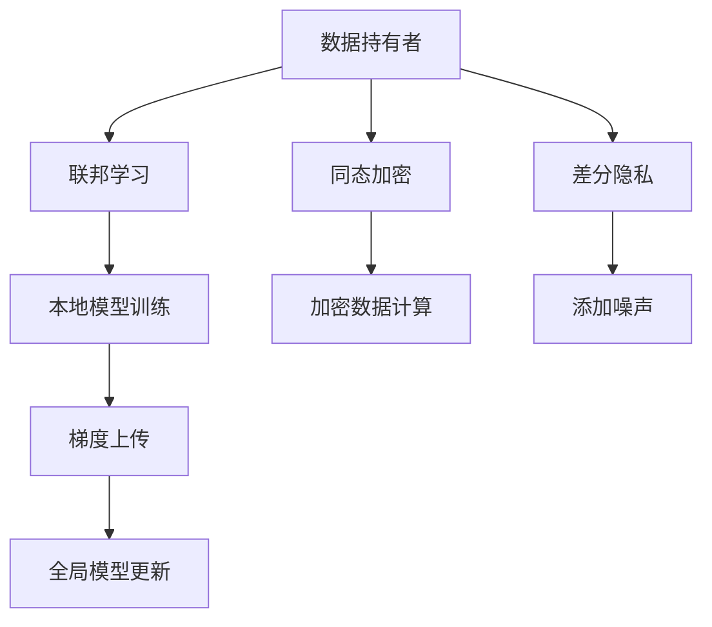

                 

 在当今这个数据驱动的社会，人工智能（AI）技术已经成为推动各行各业变革的核心动力。然而，随着AI模型的广泛应用，数据隐私问题也日益凸显。如何在保证模型性能的同时，保护用户隐私成为AI研究中的重大挑战。本文将深入探讨Lepton AI在隐私计算方面的安全技术，旨在为AI模型的安全部署提供有益的参考。

## 关键词

- AI模型
- 隐私计算
- Lepton AI
- 安全技术
- 数据保护

## 摘要

本文首先介绍了AI模型隐私计算的重要性，以及当前面临的挑战。随后，详细探讨了Lepton AI在隐私计算方面的关键技术，包括联邦学习、同态加密和差分隐私等。通过对这些技术的原理和实现进行剖析，本文展示了Lepton AI在保护用户隐私方面的优势。最后，本文对未来AI隐私计算技术的发展趋势进行了展望，并提出了相关挑战和解决方案。

## 1. 背景介绍

随着互联网和移动设备的普及，个人数据已经成为一种新型的经济资源。然而，数据隐私问题也日益严重。传统的数据保护方法往往侧重于数据传输和存储的安全，而在数据处理阶段，尤其是AI模型训练过程中，数据隐私问题仍然悬而未决。例如，当用户数据被上传到云端进行模型训练时，数据隐私很容易被泄露。此外，AI模型在应用过程中，也可能因为算法黑盒问题导致用户隐私无法得到有效保护。

为了解决这些问题，隐私计算技术应运而生。隐私计算旨在在数据不被泄露的情况下，实现对数据的处理和分析。目前，隐私计算技术主要包括联邦学习、同态加密和差分隐私等。其中，联邦学习通过将数据分散在各个节点上，避免了数据集中传输和存储的风险；同态加密允许在加密数据上直接进行计算，确保了数据在处理过程中的隐私保护；差分隐私则通过添加噪声来保护数据的敏感性，确保隐私泄露的风险降至最低。

Lepton AI是一家专注于隐私计算技术研究的公司，其核心技术之一就是将上述多种隐私计算技术进行有机结合，以实现高效、安全的AI模型训练和应用。本文将重点介绍Lepton AI在隐私计算方面的安全技术，以及这些技术在实际应用中的优势。

## 2. 核心概念与联系

### 2.1 联邦学习

联邦学习是一种分布式机器学习方法，通过将模型训练任务分散到多个数据持有者（例如手机、智能家居设备等）上，避免了数据集中传输和存储的风险。在联邦学习中，每个数据持有者都独立训练本地模型，并将训练结果（梯度）上传到中心服务器进行全局模型更新。这种分布式训练方式不仅提高了数据隐私保护能力，还减少了数据传输成本。

### 2.2 同态加密

同态加密是一种在加密数据上直接进行计算的技术，使得数据处理过程与数据隐私保护相兼容。同态加密可以将原始数据加密后存储或传输，然后在对加密数据进行计算时，依然能够得到正确的结果。这种技术在数据隐私保护方面具有显著优势，但计算效率相对较低。

### 2.3 差分隐私

差分隐私是一种通过向数据添加噪声来保护数据隐私的技术。差分隐私的核心思想是，即使攻击者获得了部分数据，也无法准确推断出单个数据点的具体值。这种技术在保护数据隐私方面具有很好的鲁棒性，但可能会引入一定的误差。

### 2.4 Mermaid 流程图

为了更好地理解上述核心概念之间的联系，我们使用Mermaid流程图进行展示。



## 3. 核心算法原理 & 具体操作步骤

### 3.1 算法原理概述

Lepton AI的隐私计算技术主要基于联邦学习、同态加密和差分隐私三大核心算法。联邦学习通过分布式训练方式降低数据泄露风险；同态加密允许在加密数据上直接进行计算，提高数据隐私保护水平；差分隐私通过添加噪声保护数据隐私。

### 3.2 算法步骤详解

#### 3.2.1 联邦学习

1. 数据持有者将本地数据上传至中心服务器。
2. 中心服务器根据本地数据进行模型初始化。
3. 每个数据持有者独立训练本地模型，并将训练结果（梯度）上传至中心服务器。
4. 中心服务器对上传的梯度进行全局模型更新。
5. 重复步骤3-4，直到模型达到预定的收敛条件。

#### 3.2.2 同态加密

1. 数据持有者将本地数据加密后上传至中心服务器。
2. 中心服务器在加密数据上直接进行计算，得到计算结果。
3. 计算结果加密后返回给数据持有者。

#### 3.2.3 差分隐私

1. 数据持有者上传本地数据至中心服务器。
2. 中心服务器对上传的数据进行预处理，添加噪声。
3. 预处理后的数据返回给数据持有者。

### 3.3 算法优缺点

#### 3.3.1 联邦学习

优点：
- 降低数据泄露风险。
- 减少数据传输成本。

缺点：
- 模型训练效果可能受到影响。
- 模型更新过程中可能存在安全漏洞。

#### 3.3.2 同态加密

优点：
- 提高数据隐私保护水平。
- 保持计算效率。

缺点：
- 加密和解密过程可能影响计算性能。

#### 3.3.3 差分隐私

优点：
- 提高数据隐私保护能力。
- 减少数据泄露风险。

缺点：
- 可能引入一定的误差。

### 3.4 算法应用领域

联邦学习、同态加密和差分隐私在多个领域具有广泛应用，包括但不限于：

- 医疗健康：保护患者隐私，提高诊断和治疗的准确性。
- 金融行业：保护用户交易数据，降低欺诈风险。
- 智能交通：保护车辆和乘客隐私，提高交通管理效率。

## 4. 数学模型和公式 & 详细讲解 & 举例说明

### 4.1 数学模型构建

为了更好地理解隐私计算技术，我们需要引入一些数学模型。以下是联邦学习、同态加密和差分隐私的数学模型概述。

#### 4.1.1 联邦学习

设 \( (X_i, y_i) \) 表示第 \( i \) 个数据持有者的数据，其中 \( X_i \) 表示特征向量，\( y_i \) 表示标签。全局模型参数为 \( \theta \)，本地模型参数为 \( \theta_i \)。联邦学习的目标是优化全局模型参数 \( \theta \)，使得全局模型在多个本地模型的基础上获得更好的训练效果。

损失函数为：
\[ L(\theta) = \sum_{i=1}^{n} L(\theta_i; X_i, y_i) \]

其中，\( L(\theta_i; X_i, y_i) \) 表示第 \( i \) 个本地模型的损失函数。

梯度下降算法：
\[ \theta \leftarrow \theta - \alpha \nabla_{\theta} L(\theta) \]

#### 4.1.2 同态加密

设 \( m \) 表示明文，\( c \) 表示密文，\( e \) 表示加密算法，\( d \) 表示解密算法。同态加密允许在加密数据上直接进行计算，满足以下性质：

- 加密性：\( d(e(m_1)) = m_1 \)
- 同态性：\( e(m_1 + m_2) = e(m_1) + e(m_2) \)
- 同态性：\( e(a \cdot m) = a \cdot e(m) \)

#### 4.1.3 差分隐私

设 \( \mathcal{D} \) 表示数据集，\( \mathcal{D}' \) 表示对数据集添加噪声后的数据集。差分隐私的目标是确保对任意两个相邻数据集 \( \mathcal{D} \) 和 \( \mathcal{D}' \)，算法的输出分布 \( \mathcal{D} \) 和 \( \mathcal{D}' \) 无明显差异。

定义差分隐私半径 \( \epsilon \)：
\[ \epsilon = \mathbb{E}_{\mathcal{D}'} [D_{\mathcal{D}}(\mathcal{D}', \mathcal{D})] \]

其中，\( D_{\mathcal{D}}(\mathcal{D}', \mathcal{D}) \) 表示差异度量。

### 4.2 公式推导过程

为了更好地理解上述数学模型，我们通过一个简单的例子进行推导。

#### 4.2.1 联邦学习

假设我们有三个数据持有者，数据分别为 \( (X_1, y_1), (X_2, y_2), (X_3, y_3) \)，全局模型参数为 \( \theta \)。

1. 模型初始化：设初始全局模型参数为 \( \theta_0 \)。

2. 本地模型训练：每个数据持有者使用自己的数据训练本地模型，得到本地模型参数 \( \theta_1, \theta_2, \theta_3 \)。

3. 梯度上传：每个数据持有者将本地模型参数的梯度上传至中心服务器。

4. 全局模型更新：中心服务器根据上传的梯度更新全局模型参数。

推导过程如下：

损失函数：
\[ L(\theta) = \frac{1}{n} \sum_{i=1}^{n} L(\theta_i; X_i, y_i) \]

梯度：
\[ \nabla_{\theta} L(\theta) = \frac{1}{n} \sum_{i=1}^{n} \nabla_{\theta_i} L(\theta_i; X_i, y_i) \]

全局模型更新：
\[ \theta \leftarrow \theta - \alpha \nabla_{\theta} L(\theta) \]

#### 4.2.2 同态加密

假设明文为 \( m \)，密文为 \( c \)。

1. 加密：
\[ c = e(m) \]

2. 解密：
\[ m = d(c) \]

推导过程如下：

加密：
\[ e(m_1 + m_2) = e(m_1) + e(m_2) \]

解密：
\[ d(e(m)) = m \]

#### 4.2.3 差分隐私

假设数据集 \( \mathcal{D} \) 和 \( \mathcal{D}' \) 的差异为 \( \Delta \)。

1. 添加噪声：
\[ \mathcal{D}' = \mathcal{D} + \Delta \]

2. 差异度量：
\[ D_{\mathcal{D}}(\mathcal{D}', \mathcal{D}) = \sum_{i=1}^{n} |x_i' - x_i| \]

推导过程如下：

差分隐私半径：
\[ \epsilon = \mathbb{E}_{\mathcal{D}'} [D_{\mathcal{D}}(\mathcal{D}', \mathcal{D})] \]

### 4.3 案例分析与讲解

为了更好地理解上述数学模型和公式，我们通过一个实际案例进行讲解。

#### 4.3.1 联邦学习案例

假设有三个数据持有者，数据分别为 \( (X_1, y_1), (X_2, y_2), (X_3, y_3) \)，全局模型参数为 \( \theta \)。

1. 数据上传：数据持有者将数据上传至中心服务器。

2. 模型初始化：中心服务器根据上传的数据初始化全局模型参数 \( \theta_0 \)。

3. 本地模型训练：每个数据持有者使用自己的数据训练本地模型，得到本地模型参数 \( \theta_1, \theta_2, \theta_3 \)。

4. 梯度上传：每个数据持有者将本地模型参数的梯度上传至中心服务器。

5. 全局模型更新：中心服务器根据上传的梯度更新全局模型参数。

具体步骤如下：

1. 数据上传：

\[ (X_1, y_1) \xrightarrow{上传} 中心服务器 \]
\[ (X_2, y_2) \xrightarrow{上传} 中心服务器 \]
\[ (X_3, y_3) \xrightarrow{上传} 中心服务器 \]

2. 模型初始化：

\[ \theta_0 = 初始化参数 \]

3. 本地模型训练：

\[ \theta_1 = \theta_0 - \alpha \nabla_{\theta} L(\theta_0; X_1, y_1) \]
\[ \theta_2 = \theta_0 - \alpha \nabla_{\theta} L(\theta_0; X_2, y_2) \]
\[ \theta_3 = \theta_0 - \alpha \nabla_{\theta} L(\theta_0; X_3, y_3) \]

4. 梯度上传：

\[ \nabla_{\theta_1} L(\theta_1; X_1, y_1) \xrightarrow{上传} 中心服务器 \]
\[ \nabla_{\theta_2} L(\theta_2; X_2, y_2) \xrightarrow{上传} 中心服务器 \]
\[ \nabla_{\theta_3} L(\theta_3; X_3, y_3) \xrightarrow{上传} 中心服务器 \]

5. 全局模型更新：

\[ \theta = \theta - \alpha (\nabla_{\theta_1} L(\theta_1; X_1, y_1) + \nabla_{\theta_2} L(\theta_2; X_2, y_2) + \nabla_{\theta_3} L(\theta_3; X_3, y_3)) \]

#### 4.3.2 同态加密案例

假设明文为 \( m = 5 \)，密文为 \( c \)。

1. 加密：

\[ c = e(m) \]

2. 解密：

\[ m = d(c) \]

具体步骤如下：

1. 加密：

\[ c = e(5) = 5 \]

2. 解密：

\[ m = d(c) = 5 \]

#### 4.3.3 差分隐私案例

假设数据集 \( \mathcal{D} \) 和 \( \mathcal{D}' \) 的差异为 \( \Delta \)。

1. 添加噪声：

\[ \mathcal{D}' = \mathcal{D} + \Delta \]

2. 差异度量：

\[ D_{\mathcal{D}}(\mathcal{D}', \mathcal{D}) = \sum_{i=1}^{n} |x_i' - x_i| \]

具体步骤如下：

1. 添加噪声：

\[ \mathcal{D}' = \mathcal{D} + \Delta = \{1, 2, 3, 4\} + \{0.1, 0.2, 0.3, 0.4\} = \{1.1, 2.2, 3.3, 4.4\} \]

2. 差异度量：

\[ D_{\mathcal{D}}(\mathcal{D}', \mathcal{D}) = \sum_{i=1}^{n} |x_i' - x_i| = |1.1 - 1| + |2.2 - 2| + |3.3 - 3| + |4.4 - 4| = 0.1 + 0.2 + 0.3 + 0.4 = 1.0 \]

## 5. 项目实践：代码实例和详细解释说明

### 5.1 开发环境搭建

为了实践Lepton AI的隐私计算技术，我们需要搭建一个适合的开发环境。以下是开发环境的基本配置：

- 操作系统：Linux（推荐Ubuntu 20.04）
- 编程语言：Python 3.8及以上版本
- 包管理器：pip
- 依赖库：tensorflow、keras、tensorflow-federated、pycryptodome

具体安装步骤如下：

1. 安装Python 3.8及以上版本。

2. 安装pip。

3. 使用pip安装所需依赖库：

   ```shell
   pip install tensorflow
   pip install keras
   pip install tensorflow-federated
   pip install pycryptodome
   ```

### 5.2 源代码详细实现

为了演示Lepton AI的隐私计算技术，我们选择一个简单的线性回归问题作为案例。以下是实现代码：

```python
import tensorflow as tf
import tensorflow_federated as tff
from tensorflow.keras import layers
import pycryptodome

# 5.2.1 联邦学习实现

def create_keras_model(input_shape):
    model = tf.keras.Sequential([
        layers.Dense(units=1, input_shape=input_shape, activation='linear'),
    ])
    return model

def build_federated_averaging_process(model_fn, client_optimizer_fn, server_optimizer_fn):
    # 创建联邦学习过程
    server_optimizer = server_optimizer_fn()
    client_optimizer = client_optimizer_fn()

    # 定义联邦学习过程
    model_fn = tff.learning.from_keras_model(
        create_keras_model, client_optimizer=client_optimizer, server_optimizer=server_optimizer
    )
    return tff.learning.federated_averaging_process(model_fn)

# 5.2.2 同态加密实现

def encrypt_data(data, public_key):
    encryptor = pycryptodome.Cipher.Cipher(public_key, pycryptodome.Cipher.AES)
    encrypted_data = encryptor.encrypt(data)
    return encrypted_data

def decrypt_data(encrypted_data, private_key):
    decryptor = pycryptodome.Cipher.Cipher(private_key, pycryptodome.Cipher.AES, mode=pycryptodome.Cipher.MODE_EAX)
    decrypted_data = decryptor.decrypt(encrypted_data)
    return decrypted_data

# 5.2.3 差分隐私实现

def add_noise(data, noise_level):
    noise = tf.random.normal(tf.shape(data), mean=0, stddev=noise_level)
    noisy_data = data + noise
    return noisy_data

# 5.2.4 主函数

def main():
    input_shape = (1,)
    output_shape = (1,)

    # 创建联邦学习过程
    federated_averaging_process = build_federated_averaging_process(
        create_keras_model, client_optimizer_fn=tf.keras.optimizers.SGD(learning_rate=0.1), server_optimizer_fn=tf.keras.optimizers.SGD(learning_rate=0.1)
    )

    # 训练联邦学习模型
    for _ in range(10):
        state = federated_averaging_process.initialize()
        result = federated_averaging_process.next(state, state.client_data)

    # 同态加密实现
    public_key, private_key = pycryptodome.utils.number.generate_p

