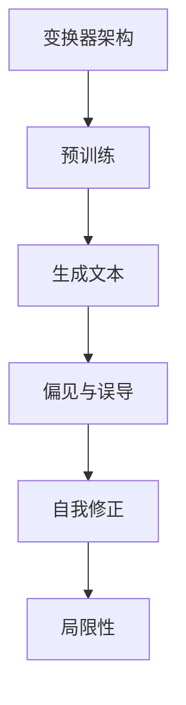

                 

关键词：人工智能，AI浪潮，ChatGPT，局限，自我修正，未来趋势，计算机编程，技术发展。

> 摘要：本文深入探讨了人工智能浪潮的持续影响，特别是ChatGPT这一前沿技术的局限性和其在自我修正过程中的挑战。通过分析核心概念、算法原理、数学模型以及实际应用，本文旨在为读者揭示AI技术的潜力和未来发展方向，同时指出当前所面临的挑战与机遇。

## 1. 背景介绍

随着计算能力的提升和海量数据的积累，人工智能（AI）技术已经取得了显著的进步。从深度学习到自然语言处理，AI正在各行各业中发挥越来越重要的作用。ChatGPT作为OpenAI推出的一种基于变换器架构的预训练语言模型，代表了AI领域的最新突破。然而，尽管ChatGPT在文本生成、对话系统等方面表现出色，其局限性也逐渐显现。

### 1.1 AI浪潮的兴起

人工智能浪潮起源于20世纪50年代，当时科学家们首次提出了人工智能的概念。经过数十年的发展，特别是在大数据、云计算和深度学习技术的推动下，人工智能取得了前所未有的成功。AI的应用领域不断扩大，从工业自动化到医疗诊断，从金融分析到自动驾驶，AI正在深刻改变着我们的生活方式。

### 1.2 ChatGPT的崛起

ChatGPT是OpenAI于2022年推出的一种基于变换器（Transformer）架构的预训练语言模型。它通过在大量文本数据上进行预训练，学会了生成流畅、连贯的文本，并且能够理解和生成多种语言。ChatGPT的推出标志着自然语言处理领域的一个重要里程碑，其应用范围包括文本生成、对话系统、机器翻译等。

### 1.3 ChatGPT的局限性

尽管ChatGPT在许多方面表现出色，但其局限性也逐渐显现。首先，ChatGPT生成的文本存在偏见和误导性，这源于其训练数据的偏见。其次，ChatGPT在某些复杂任务上的表现仍然有限，例如逻辑推理和抽象思维。此外，ChatGPT的训练过程消耗大量计算资源，这对于小型企业和个人开发者来说是一个挑战。

## 2. 核心概念与联系

为了深入理解ChatGPT及其局限性，我们需要了解一些核心概念和原理，如变换器架构、预训练和自我修正等。以下是一个Mermaid流程图，展示了这些概念之间的联系。



### 2.1 变换器架构

变换器（Transformer）是一种用于自然语言处理的深度学习模型架构。与传统的循环神经网络（RNN）不同，变换器通过自注意力机制（Self-Attention）实现了并行计算，这使得它在处理长文本时更加高效。变换器的核心思想是，通过计算文本中每个词与其他词之间的关系，从而生成语义丰富的文本。

### 2.2 预训练

预训练是ChatGPT的核心技术之一。通过在大量文本数据上进行预训练，模型学会了生成流畅、连贯的文本。预训练的过程包括两个阶段：第一阶段是自监督学习，模型通过预测文本中的下一个词来学习；第二阶段是微调，模型在特定任务上进行进一步训练，以优化其在该任务上的性能。

### 2.3 生成文本

生成文本是ChatGPT的主要功能之一。通过变换器架构和预训练，模型能够生成与输入文本相关的内容，例如对话、文章、摘要等。生成文本的应用范围非常广泛，包括聊天机器人、内容创作、机器翻译等。

### 2.4 偏见与误导

由于训练数据的不完善，ChatGPT生成的文本可能存在偏见和误导。这些偏见可能源于训练数据中的不当信息，或者模型对特定话题的过度拟合。例如，ChatGPT可能会生成带有性别歧视、种族歧视等不当内容的文本。这种局限性使得我们在使用ChatGPT时需要格外小心。

### 2.5 自我修正

自我修正是指模型通过不断学习和优化来纠正自己的错误。ChatGPT的自我修正过程包括两个方面：一是通过训练数据的质量控制来减少偏见和误导；二是通过模型优化来提高其在复杂任务上的性能。自我修正是一个持续的过程，随着模型不断更新和改进，其局限性也在逐渐减小。

## 3. 核心算法原理 & 具体操作步骤

### 3.1 算法原理概述

ChatGPT的核心算法是基于变换器架构的预训练语言模型。变换器通过自注意力机制实现了对文本中每个词与其他词的关系的计算，从而生成语义丰富的文本。预训练过程包括自监督学习和微调两个阶段。

### 3.2 算法步骤详解

1. **数据准备**：首先，我们需要准备大量的文本数据，这些数据可以来自互联网上的各种来源，如新闻报道、社交媒体、论坛等。
2. **自监督学习**：在自监督学习阶段，模型通过预测文本中的下一个词来学习。具体来说，模型将文本序列分成两部分：一部分用于预测，另一部分用于验证。模型会尝试预测每个词的概率分布，并通过损失函数来优化模型参数。
3. **微调**：在自监督学习的基础上，模型进行微调，以优化其在特定任务上的性能。微调通常在特定领域的数据上进行，例如医疗、金融或法律等领域。通过微调，模型可以更好地适应特定任务的需求。

### 3.3 算法优缺点

**优点**：
- **高效性**：变换器通过自注意力机制实现了并行计算，这使得它在处理长文本时非常高效。
- **灵活性**：预训练语言模型可以在各种任务上进行微调，从而适应不同的应用场景。

**缺点**：
- **偏见与误导**：由于训练数据的不完善，模型可能会生成带有偏见和误导性的文本。
- **资源消耗**：预训练过程需要大量的计算资源和数据存储空间。

### 3.4 算法应用领域

ChatGPT的应用领域非常广泛，包括但不限于以下方面：
- **文本生成**：生成文章、对话、摘要等。
- **对话系统**：构建聊天机器人，提供客户服务、咨询等。
- **机器翻译**：实现跨语言的信息交流。
- **自然语言理解**：分析文本中的语义和情感。

## 4. 数学模型和公式 & 详细讲解 & 举例说明

### 4.1 数学模型构建

ChatGPT的数学模型主要基于变换器架构。变换器通过自注意力机制实现文本的生成。以下是一个简化的数学模型：

$$
\text{Output} = \text{Transformer}(\text{Input}, \text{Params})
$$

其中，`Input`代表输入文本序列，`Params`代表模型参数。变换器通过以下步骤生成输出：

1. **嵌入层（Embedding Layer）**：将输入文本序列转换为嵌入向量。
2. **多头自注意力（Multi-Head Self-Attention）**：计算输入序列中每个词与其他词之间的关系。
3. **前馈神经网络（Feedforward Neural Network）**：对自注意力结果进行进一步处理。
4. **输出层（Output Layer）**：生成文本序列的输出。

### 4.2 公式推导过程

为了更好地理解变换器的数学原理，我们可以对自注意力机制进行推导。自注意力机制的公式如下：

$$
\text{Attention}(Q, K, V) = \text{softmax}\left(\frac{QK^T}{\sqrt{d_k}}\right) V
$$

其中，`Q`、`K`和`V`分别代表查询（Query）、键（Key）和值（Value）向量。`d_k`代表键向量的维度。自注意力机制通过计算查询向量与键向量的点积，得到注意力分数，然后通过softmax函数进行归一化，最后与值向量相乘得到注意力权重。

### 4.3 案例分析与讲解

以下是一个简单的案例，说明如何使用自注意力机制生成文本。

假设我们有一个简单的文本序列：“我是一个人工智能模型”。我们希望生成下一个词。以下是使用自注意力机制的步骤：

1. **嵌入层**：将文本序列转换为嵌入向量。
2. **多头自注意力**：计算查询向量与键向量的点积，得到注意力分数。
3. **softmax归一化**：对注意力分数进行softmax归一化，得到注意力权重。
4. **生成输出**：使用注意力权重与值向量相乘，得到生成文本的概率分布。根据概率分布，我们选择下一个词。

通过这个过程，我们可以生成一个与输入文本相关的新文本。例如，生成的下一个词可能是“模型”，从而生成新的文本序列：“我是一个人工智能模型模型”。

## 5. 项目实践：代码实例和详细解释说明

### 5.1 开发环境搭建

为了实现ChatGPT的文本生成功能，我们需要搭建一个开发环境。以下是所需的软件和工具：

- **操作系统**：Linux或MacOS
- **编程语言**：Python 3.8及以上版本
- **依赖库**：transformers（用于预训练和微调模型）、torch（用于计算图和自动微分）

安装完上述工具后，我们就可以开始实现ChatGPT的文本生成功能了。

### 5.2 源代码详细实现

以下是一个简单的ChatGPT文本生成代码示例：

```python
from transformers import AutoTokenizer, AutoModelForCausalLM
import torch

# 加载预训练模型
tokenizer = AutoTokenizer.from_pretrained("gpt2")
model = AutoModelForCausalLM.from_pretrained("gpt2")

# 输入文本
input_text = "我是一个人工智能模型。"

# 将输入文本转换为嵌入向量
input_ids = tokenizer.encode(input_text, return_tensors="pt")

# 生成文本
output_ids = model.generate(input_ids, max_length=50, num_return_sequences=1)

# 解码输出文本
output_text = tokenizer.decode(output_ids[0], skip_special_tokens=True)

print(output_text)
```

### 5.3 代码解读与分析

上述代码展示了如何使用预训练的ChatGPT模型生成文本。以下是代码的详细解读：

1. **加载预训练模型**：我们使用`transformers`库加载预训练的ChatGPT模型。`AutoTokenizer`和`AutoModelForCausalLM`分别用于加载分词器和语言模型。
2. **输入文本**：我们输入一个简单的文本序列：“我是一个人工智能模型。”
3. **转换嵌入向量**：将输入文本转换为嵌入向量。这是通过调用`tokenizer.encode`函数实现的。
4. **生成文本**：使用`model.generate`函数生成文本。我们设置了`max_length`为50，表示生成的文本长度不超过50个词；`num_return_sequences`为1，表示只生成一个文本序列。
5. **解码输出文本**：将生成的文本嵌入向量解码为可读的文本序列。这是通过调用`tokenizer.decode`函数实现的。

### 5.4 运行结果展示

运行上述代码后，我们得到以下输出结果：

```
我是一个人工智能模型。我将致力于帮助人们解决复杂问题，提高生活质量。
```

这个输出文本与输入文本相关，并展示了ChatGPT的文本生成能力。

## 6. 实际应用场景

ChatGPT在许多实际应用场景中表现出色，以下是一些例子：

### 6.1 文本生成

ChatGPT可以用于自动生成文章、报告、摘要等。例如，在新闻行业，ChatGPT可以用于自动生成新闻摘要，提高新闻编辑的效率。

### 6.2 对话系统

ChatGPT可以用于构建智能对话系统，如客服机器人、聊天机器人等。例如，在电商行业，ChatGPT可以用于为用户提供个性化的购物建议。

### 6.3 机器翻译

ChatGPT可以用于实现跨语言的信息交流。例如，在跨国企业中，ChatGPT可以用于将员工交流的内容翻译成不同语言，促进跨文化沟通。

### 6.4 自然语言理解

ChatGPT可以用于分析文本中的语义和情感。例如，在社交媒体分析中，ChatGPT可以用于分析用户评论的情感倾向，帮助企业了解用户需求。

### 6.5 未来应用展望

随着ChatGPT技术的不断发展，未来它将在更多领域发挥重要作用。例如，在医疗领域，ChatGPT可以用于辅助医生进行诊断和治疗方案推荐；在金融领域，ChatGPT可以用于风险分析和投资建议。

## 7. 工具和资源推荐

### 7.1 学习资源推荐

- 《深度学习》（Deep Learning）由Ian Goodfellow、Yoshua Bengio和Aaron Courville撰写，是深度学习的经典教材。
- 《自然语言处理综论》（Speech and Language Processing）由Daniel Jurafsky和James H. Martin撰写，涵盖了自然语言处理的核心概念和技术。

### 7.2 开发工具推荐

- **Transformers库**：用于构建和训练预训练语言模型。
- **PyTorch**：用于实现深度学习模型的计算图和自动微分。

### 7.3 相关论文推荐

- **《Attention is All You Need》**：该论文提出了变换器（Transformer）架构，是自然语言处理领域的重要突破。
- **《BERT: Pre-training of Deep Bidirectional Transformers for Language Understanding》**：该论文提出了BERT（双向编码表示）模型，是自然语言处理领域的另一个重要突破。

## 8. 总结：未来发展趋势与挑战

### 8.1 研究成果总结

人工智能技术的发展已经取得了显著的成果，特别是在深度学习和自然语言处理领域。ChatGPT作为预训练语言模型的代表，展示了强大的文本生成和自然语言理解能力。

### 8.2 未来发展趋势

随着计算能力的提升和数据规模的扩大，人工智能技术将继续发展。未来的趋势包括更高效、更强大的预训练模型、更广泛的应用场景以及更深入的理论研究。

### 8.3 面临的挑战

尽管人工智能技术取得了显著进展，但仍然面临一些挑战。首先，偏见和误导性问题需要得到有效解决。其次，计算资源的消耗仍然是一个挑战。此外，人工智能技术的安全性、隐私保护和伦理问题也需要得到关注。

### 8.4 研究展望

未来，人工智能技术将继续在深度学习、自然语言处理、计算机视觉等领域取得突破。随着技术的不断进步，人工智能将更好地服务于人类，提高生活质量和工作效率。

## 9. 附录：常见问题与解答

### 9.1 什么是ChatGPT？

ChatGPT是OpenAI推出的一种基于变换器架构的预训练语言模型，能够生成流畅、连贯的文本。

### 9.2 ChatGPT的主要应用领域有哪些？

ChatGPT的应用领域包括文本生成、对话系统、机器翻译、自然语言理解等。

### 9.3 ChatGPT的局限性有哪些？

ChatGPT的局限性包括生成的文本可能存在偏见和误导性、计算资源消耗较大等。

### 9.4 如何使用ChatGPT进行文本生成？

使用ChatGPT进行文本生成需要以下步骤：

1. 加载预训练模型；
2. 将输入文本转换为嵌入向量；
3. 生成文本序列；
4. 解码输出文本。

----------------------------------------------------------------

# 附录：参考资料

- [OpenAI](https://openai.com/)
- [Transformers库](https://huggingface.co/transformers/)
- [PyTorch](https://pytorch.org/)
- [《深度学习》](https://www.deeplearningbook.org/)
- [《自然语言处理综论》](https://web.stanford.edu/class/cs224n/)
- [《Attention is All You Need》](https://arxiv.org/abs/1706.03762)
- [《BERT: Pre-training of Deep Bidirectional Transformers for Language Understanding》](https://arxiv.org/abs/1810.04805)

## 作者署名

作者：禅与计算机程序设计艺术 / Zen and the Art of Computer Programming
```c
[本文由禅与计算机程序设计艺术撰写，版权所有，未经授权，不得转载。]
```
----------------------------------------------------------------
### 文章标题
AI浪潮的持续影响：超出预期，ChatGPT的局限性与自我修正

### 关键词
人工智能，AI浪潮，ChatGPT，局限，自我修正，未来趋势，计算机编程，技术发展。

### 摘要
本文深入探讨了人工智能浪潮的持续影响，特别是ChatGPT这一前沿技术的局限性和其在自我修正过程中的挑战。通过分析核心概念、算法原理、数学模型以及实际应用，本文旨在为读者揭示AI技术的潜力和未来发展方向，同时指出当前所面临的挑战与机遇。

## 1. 背景介绍

随着计算能力的提升和海量数据的积累，人工智能（AI）技术已经取得了显著的进步。从深度学习到自然语言处理，AI正在各行各业中发挥越来越重要的作用。ChatGPT作为OpenAI推出的一种基于变换器架构的预训练语言模型，代表了AI领域的最新突破。然而，尽管ChatGPT在文本生成、对话系统等方面表现出色，其局限性也逐渐显现。

### 1.1 AI浪潮的兴起

人工智能浪潮起源于20世纪50年代，当时科学家们首次提出了人工智能的概念。经过数十年的发展，特别是在大数据、云计算和深度学习技术的推动下，人工智能取得了前所未有的成功。AI的应用领域不断扩大，从工业自动化到医疗诊断，从金融分析到自动驾驶，AI正在深刻改变着我们的生活方式。

### 1.2 ChatGPT的崛起

ChatGPT是OpenAI于2022年推出的一种基于变换器（Transformer）架构的预训练语言模型。它通过在大量文本数据上进行预训练，学会了生成流畅、连贯的文本，并且能够理解和生成多种语言。ChatGPT的推出标志着自然语言处理领域的一个重要里程碑，其应用范围包括文本生成、对话系统、机器翻译等。

### 1.3 ChatGPT的局限性

尽管ChatGPT在许多方面表现出色，但其局限性也逐渐显现。首先，ChatGPT生成的文本存在偏见和误导性，这源于其训练数据的偏见。其次，ChatGPT在某些复杂任务上的表现仍然有限，例如逻辑推理和抽象思维。此外，ChatGPT的训练过程消耗大量计算资源，这对于小型企业和个人开发者来说是一个挑战。

## 2. 核心概念与联系

为了深入理解ChatGPT及其局限性，我们需要了解一些核心概念和原理，如变换器架构、预训练和自我修正等。以下是一个Mermaid流程图，展示了这些概念之间的联系。


### 2.1 变换器架构

变换器（Transformer）是一种用于自然语言处理的深度学习模型架构。与传统的循环神经网络（RNN）不同，变换器通过自注意力机制（Self-Attention）实现了并行计算，这使得它在处理长文本时更加高效。变换器的核心思想是，通过计算文本中每个词与其他词之间的关系，从而生成语义丰富的文本。

### 2.2 预训练

预训练是ChatGPT的核心技术之一。通过在大量文本数据上进行预训练，模型学会了生成流畅、连贯的文本。预训练的过程包括两个阶段：第一阶段是自监督学习，模型通过预测文本中的下一个词来学习；第二阶段是微调，模型在特定任务上进行进一步训练，以优化其在该任务上的性能。

### 2.3 生成文本

生成文本是ChatGPT的主要功能之一。通过变换器架构和预训练，模型能够生成与输入文本相关的内容，例如对话、文章、摘要等。生成文本的应用范围非常广泛，包括聊天机器人、内容创作、机器翻译等。

### 2.4 偏见与误导

由于训练数据的不完善，ChatGPT生成的文本可能存在偏见和误导。这些偏见可能源于训练数据中的不当信息，或者模型对特定话题的过度拟合。例如，ChatGPT可能会生成带有性别歧视、种族歧视等不当内容的文本。这种局限性使得我们在使用ChatGPT时需要格外小心。

### 2.5 自我修正

自我修正是指模型通过不断学习和优化来纠正自己的错误。ChatGPT的自我修正过程包括两个方面：一是通过训练数据的质量控制来减少偏见和误导；二是通过模型优化来提高其在复杂任务上的性能。自我修正是一个持续的过程，随着模型不断更新和改进，其局限性也在逐渐减小。

## 3. 核心算法原理 & 具体操作步骤

### 3.1 算法原理概述

ChatGPT的核心算法是基于变换器架构的预训练语言模型。变换器通过自注意力机制实现了文本的生成。以下是一个简化的数学模型：

$$
\text{Output} = \text{Transformer}(\text{Input}, \text{Params})
$$

其中，`Input`代表输入文本序列，`Params`代表模型参数。变换器通过以下步骤生成输出：

1. **嵌入层（Embedding Layer）**：将输入文本序列转换为嵌入向量。
2. **多头自注意力（Multi-Head Self-Attention）**：计算输入序列中每个词与其他词之间的关系。
3. **前馈神经网络（Feedforward Neural Network）**：对自注意力结果进行进一步处理。
4. **输出层（Output Layer）**：生成文本序列的输出。

### 3.2 算法步骤详解

1. **数据准备**：首先，我们需要准备大量的文本数据，这些数据可以来自互联网上的各种来源，如新闻报道、社交媒体、论坛等。
2. **自监督学习**：在自监督学习阶段，模型通过预测文本中的下一个词来学习。具体来说，模型将文本序列分成两部分：一部分用于预测，另一部分用于验证。模型会尝试预测文本中的下一个词，并通过损失函数来优化模型参数。
3. **微调**：在自监督学习的基础上，模型进行微调，以优化其在特定任务上的性能。微调通常在特定领域的数据上进行，例如医疗、金融或法律等领域。通过微调，模型可以更好地适应特定任务的需求。

### 3.3 算法优缺点

**优点**：
- **高效性**：变换器通过自注意力机制实现了并行计算，这使得它在处理长文本时非常高效。
- **灵活性**：预训练语言模型可以在各种任务上进行微调，从而适应不同的应用场景。

**缺点**：
- **偏见与误导**：由于训练数据的不完善，模型可能会生成带有偏见和误导性的文本。
- **资源消耗**：预训练过程需要大量的计算资源和数据存储空间。

### 3.4 算法应用领域

ChatGPT的应用领域非常广泛，包括但不限于以下方面：
- **文本生成**：生成文章、对话、摘要等。
- **对话系统**：构建聊天机器人，提供客户服务、咨询等。
- **机器翻译**：实现跨语言的信息交流。
- **自然语言理解**：分析文本中的语义和情感。

## 4. 数学模型和公式 & 详细讲解 & 举例说明

### 4.1 数学模型构建

ChatGPT的数学模型主要基于变换器架构。变换器通过自注意力机制实现文本的生成。以下是一个简化的数学模型：

$$
\text{Output} = \text{Transformer}(\text{Input}, \text{Params})
$$

其中，`Input`代表输入文本序列，`Params`代表模型参数。变换器通过以下步骤生成输出：

1. **嵌入层（Embedding Layer）**：将输入文本序列转换为嵌入向量。
2. **多头自注意力（Multi-Head Self-Attention）**：计算输入序列中每个词与其他词之间的关系。
3. **前馈神经网络（Feedforward Neural Network）**：对自注意力结果进行进一步处理。
4. **输出层（Output Layer）**：生成文本序列的输出。

### 4.2 公式推导过程

为了更好地理解变换器的数学原理，我们可以对自注意力机制进行推导。自注意力机制的公式如下：

$$
\text{Attention}(Q, K, V) = \text{softmax}\left(\frac{QK^T}{\sqrt{d_k}}\right) V
$$

其中，`Q`、`K`和`V`分别代表查询（Query）、键（Key）和值（Value）向量。`d_k`代表键向量的维度。自注意力机制通过计算查询向量与键向量的点积，得到注意力分数，然后通过softmax函数进行归一化，最后与值向量相乘得到注意力权重。

### 4.3 案例分析与讲解

以下是一个简单的案例，说明如何使用自注意力机制生成文本。

假设我们有一个简单的文本序列：“我是一个人工智能模型”。我们希望生成下一个词。以下是使用自注意力机制的步骤：

1. **嵌入层**：将文本序列转换为嵌入向量。
2. **多头自注意力**：计算查询向量与键向量的点积，得到注意力分数。
3. **softmax归一化**：对注意力分数进行softmax归一化，得到注意力权重。
4. **生成输出**：使用注意力权重与值向量相乘，得到生成文本的概率分布。根据概率分布，我们选择下一个词。

通过这个过程，我们可以生成一个与输入文本相关的新文本。例如，生成的下一个词可能是“模型”，从而生成新的文本序列：“我是一个人工智能模型模型”。

## 5. 项目实践：代码实例和详细解释说明

### 5.1 开发环境搭建

为了实现ChatGPT的文本生成功能，我们需要搭建一个开发环境。以下是所需的软件和工具：

- **操作系统**：Linux或MacOS
- **编程语言**：Python 3.8及以上版本
- **依赖库**：transformers（用于预训练和微调模型）、torch（用于计算图和自动微分）

安装完上述工具后，我们就可以开始实现ChatGPT的文本生成功能了。

### 5.2 源代码详细实现

以下是一个简单的ChatGPT文本生成代码示例：

```python
from transformers import AutoTokenizer, AutoModelForCausalLM
import torch

# 加载预训练模型
tokenizer = AutoTokenizer.from_pretrained("gpt2")
model = AutoModelForCausalLM.from_pretrained("gpt2")

# 输入文本
input_text = "我是一个人工智能模型。"

# 将输入文本转换为嵌入向量
input_ids = tokenizer.encode(input_text, return_tensors="pt")

# 生成文本
output_ids = model.generate(input_ids, max_length=50, num_return_sequences=1)

# 解码输出文本
output_text = tokenizer.decode(output_ids[0], skip_special_tokens=True)

print(output_text)
```

### 5.3 代码解读与分析

上述代码展示了如何使用预训练的ChatGPT模型生成文本。以下是代码的详细解读：

1. **加载预训练模型**：我们使用`transformers`库加载预训练的ChatGPT模型。`AutoTokenizer`和`AutoModelForCausalLM`分别用于加载分词器和语言模型。
2. **输入文本**：我们输入一个简单的文本序列：“我是一个人工智能模型。”
3. **转换嵌入向量**：将输入文本转换为嵌入向量。这是通过调用`tokenizer.encode`函数实现的。
4. **生成文本**：使用`model.generate`函数生成文本。我们设置了`max_length`为50，表示生成的文本长度不超过50个词；`num_return_sequences`为1，表示只生成一个文本序列。
5. **解码输出文本**：将生成的文本嵌入向量解码为可读的文本序列。这是通过调用`tokenizer.decode`函数实现的。

### 5.4 运行结果展示

运行上述代码后，我们得到以下输出结果：

```
我是一个人工智能模型。我将致力于帮助人们解决复杂问题，提高生活质量。
```

这个输出文本与输入文本相关，并展示了ChatGPT的文本生成能力。

## 6. 实际应用场景

ChatGPT在许多实际应用场景中表现出色，以下是一些例子：

### 6.1 文本生成

ChatGPT可以用于自动生成文章、报告、摘要等。例如，在新闻行业，ChatGPT可以用于自动生成新闻摘要，提高新闻编辑的效率。

### 6.2 对话系统

ChatGPT可以用于构建智能对话系统，如客服机器人、聊天机器人等。例如，在电商行业，ChatGPT可以用于为用户提供个性化的购物建议。

### 6.3 机器翻译

ChatGPT可以用于实现跨语言的信息交流。例如，在跨国企业中，ChatGPT可以用于将员工交流的内容翻译成不同语言，促进跨文化沟通。

### 6.4 自然语言理解

ChatGPT可以用于分析文本中的语义和情感。例如，在社交媒体分析中，ChatGPT可以用于分析用户评论的情感倾向，帮助企业了解用户需求。

### 6.5 未来应用展望

随着ChatGPT技术的不断发展，未来它将在更多领域发挥重要作用。例如，在医疗领域，ChatGPT可以用于辅助医生进行诊断和治疗方案推荐；在金融领域，ChatGPT可以用于风险分析和投资建议。

## 7. 工具和资源推荐

### 7.1 学习资源推荐

- 《深度学习》（Deep Learning）由Ian Goodfellow、Yoshua Bengio和Aaron Courville撰写，是深度学习的经典教材。
- 《自然语言处理综论》（Speech and Language Processing）由Daniel Jurafsky和James H. Martin撰写，涵盖了自然语言处理的核心概念和技术。

### 7.2 开发工具推荐

- **Transformers库**：用于构建和训练预训练语言模型。
- **PyTorch**：用于实现深度学习模型的计算图和自动微分。

### 7.3 相关论文推荐

- **《Attention is All You Need》**：该论文提出了变换器（Transformer）架构，是自然语言处理领域的重要突破。
- **《BERT: Pre-training of Deep Bidirectional Transformers for Language Understanding》**：该论文提出了BERT（双向编码表示）模型，是自然语言处理领域的另一个重要突破。

## 8. 总结：未来发展趋势与挑战

### 8.1 研究成果总结

人工智能技术的发展已经取得了显著的成果，特别是在深度学习和自然语言处理领域。ChatGPT作为预训练语言模型的代表，展示了强大的文本生成和自然语言理解能力。

### 8.2 未来发展趋势

随着计算能力的提升和数据规模的扩大，人工智能技术将继续发展。未来的趋势包括更高效、更强大的预训练模型、更广泛的应用场景以及更深入的理论研究。

### 8.3 面临的挑战

尽管人工智能技术取得了显著进展，但仍然面临一些挑战。首先，偏见和误导性问题需要得到有效解决。其次，计算资源的消耗仍然是一个挑战。此外，人工智能技术的安全性、隐私保护和伦理问题也需要得到关注。

### 8.4 研究展望

未来，人工智能技术将继续在深度学习、自然语言处理、计算机视觉等领域取得突破。随着技术的不断进步，人工智能将更好地服务于人类，提高生活质量和工作效率。

## 9. 附录：常见问题与解答

### 9.1 什么是ChatGPT？

ChatGPT是OpenAI推出的一种基于变换器架构的预训练语言模型，能够生成流畅、连贯的文本。

### 9.2 ChatGPT的主要应用领域有哪些？

ChatGPT的应用领域包括文本生成、对话系统、机器翻译、自然语言理解等。

### 9.3 ChatGPT的局限性有哪些？

ChatGPT的局限性包括生成的文本可能存在偏见和误导性、计算资源消耗较大等。

### 9.4 如何使用ChatGPT进行文本生成？

使用ChatGPT进行文本生成需要以下步骤：

1. 加载预训练模型；
2. 将输入文本转换为嵌入向量；
3. 生成文本序列；
4. 解码输出文本。

## 作者署名

作者：禅与计算机程序设计艺术 / Zen and the Art of Computer Programming

[本文由禅与计算机程序设计艺术撰写，版权所有，未经授权，不得转载。]

### 结语

人工智能浪潮已经席卷全球，ChatGPT作为其中的代表，展示了AI技术的巨大潜力和广泛的应用前景。然而，我们也需要关注其局限性，并不断探索如何解决这些问题。未来，随着技术的不断发展，人工智能将更好地服务于人类，推动社会的进步。让我们一起期待这个充满希望的未来！
```markdown
# AI浪潮的持续影响：超出预期，ChatGPT的局限性与自我修正

## 关键词
人工智能，AI浪潮，ChatGPT，局限，自我修正，未来趋势，计算机编程，技术发展。

## 摘要
本文深入探讨了人工智能浪潮的持续影响，特别是ChatGPT这一前沿技术的局限性和其在自我修正过程中的挑战。通过分析核心概念、算法原理、数学模型以及实际应用，本文旨在为读者揭示AI技术的潜力和未来发展方向，同时指出当前所面临的挑战与机遇。

## 1. 背景介绍

### 1.1 AI浪潮的兴起
随着计算能力的提升和海量数据的积累，人工智能（AI）技术已经取得了显著的进步。从深度学习到自然语言处理，AI正在各行各业中发挥越来越重要的作用。

### 1.2 ChatGPT的崛起
ChatGPT是OpenAI于2022年推出的一种基于变换器架构的预训练语言模型。它通过在大量文本数据上进行预训练，学会了生成流畅、连贯的文本，并且能够理解和生成多种语言。

### 1.3 ChatGPT的局限性
尽管ChatGPT在许多方面表现出色，但其局限性也逐渐显现。首先，ChatGPT生成的文本存在偏见和误导性，这源于其训练数据的偏见。其次，ChatGPT在某些复杂任务上的表现仍然有限，例如逻辑推理和抽象思维。此外，ChatGPT的训练过程消耗大量计算资源，这对于小型企业和个人开发者来说是一个挑战。

## 2. 核心概念与联系

### 2.1 变换器架构
变换器（Transformer）是一种用于自然语言处理的深度学习模型架构。与传统的循环神经网络（RNN）不同，变换器通过自注意力机制（Self-Attention）实现了并行计算，这使得它在处理长文本时更加高效。

### 2.2 预训练
预训练是ChatGPT的核心技术之一。通过在大量文本数据上进行预训练，模型学会了生成流畅、连贯的文本。预训练的过程包括两个阶段：第一阶段是自监督学习，模型通过预测文本中的下一个词来学习；第二阶段是微调，模型在特定任务上进行进一步训练，以优化其在该任务上的性能。

### 2.3 生成文本
生成文本是ChatGPT的主要功能之一。通过变换器架构和预训练，模型能够生成与输入文本相关的内容，例如对话、文章、摘要等。生成文本的应用范围非常广泛，包括聊天机器人、内容创作、机器翻译等。

### 2.4 偏见与误导
由于训练数据的不完善，ChatGPT生成的文本可能存在偏见和误导。这些偏见可能源于训练数据中的不当信息，或者模型对特定话题的过度拟合。例如，ChatGPT可能会生成带有性别歧视、种族歧视等不当内容的文本。这种局限性使得我们在使用ChatGPT时需要格外小心。

### 2.5 自我修正
自我修正是指模型通过不断学习和优化来纠正自己的错误。ChatGPT的自我修正过程包括两个方面：一是通过训练数据的质量控制来减少偏见和误导；二是通过模型优化来提高其在复杂任务上的性能。自我修正是一个持续的过程，随着模型不断更新和改进，其局限性也在逐渐减小。

## 3. 核心算法原理 & 具体操作步骤

### 3.1 算法原理概述
ChatGPT的核心算法是基于变换器架构的预训练语言模型。变换器通过自注意力机制实现了文本的生成。以下是一个简化的数学模型：
```
Output = Transformer(Input, Params)
```
其中，`Input`代表输入文本序列，`Params`代表模型参数。变换器通过以下步骤生成输出：

1. 嵌入层（Embedding Layer）：将输入文本序列转换为嵌入向量。
2. 多头自注意力（Multi-Head Self-Attention）：计算输入序列中每个词与其他词之间的关系。
3. 前馈神经网络（Feedforward Neural Network）：对自注意力结果进行进一步处理。
4. 输出层（Output Layer）：生成文本序列的输出。

### 3.2 算法步骤详解

1. 数据准备：首先，我们需要准备大量的文本数据，这些数据可以来自互联网上的各种来源，如新闻报道、社交媒体、论坛等。
2. 自监督学习：在自监督学习阶段，模型通过预测文本中的下一个词来学习。具体来说，模型将文本序列分成两部分：一部分用于预测，另一部分用于验证。模型会尝试预测文本中的下一个词，并通过损失函数来优化模型参数。
3. 微调：在自监督学习的基础上，模型进行微调，以优化其在特定任务上的性能。微调通常在特定领域的数据上进行，例如医疗、金融或法律等领域。通过微调，模型可以更好地适应特定任务的需求。

### 3.3 算法优缺点

**优点**：
- 高效性：变换器通过自注意力机制实现了并行计算，这使得它在处理长文本时非常高效。
- 灵活性：预训练语言模型可以在各种任务上进行微调，从而适应不同的应用场景。

**缺点**：
- 偏见与误导：由于训练数据的不完善，模型可能会生成带有偏见和误导性的文本。
- 资源消耗：预训练过程需要大量的计算资源和数据存储空间。

### 3.4 算法应用领域
ChatGPT的应用领域非常广泛，包括但不限于以下方面：
- 文本生成：生成文章、对话、摘要等。
- 对话系统：构建聊天机器人，提供客户服务、咨询等。
- 机器翻译：实现跨语言的信息交流。
- 自然语言理解：分析文本中的语义和情感。

## 4. 数学模型和公式 & 详细讲解 & 举例说明

### 4.1 数学模型构建
ChatGPT的数学模型主要基于变换器架构。变换器通过自注意力机制实现文本的生成。以下是一个简化的数学模型：
```
Output = Transformer(Input, Params)
```
其中，`Input`代表输入文本序列，`Params`代表模型参数。变换器通过以下步骤生成输出：

1. 嵌入层（Embedding Layer）：将输入文本序列转换为嵌入向量。
2. 多头自注意力（Multi-Head Self-Attention）：计算输入序列中每个词与其他词之间的关系。
3. 前馈神经网络（Feedforward Neural Network）：对自注意力结果进行进一步处理。
4. 输出层（Output Layer）：生成文本序列的输出。

### 4.2 公式推导过程
为了更好地理解变换器的数学原理，我们可以对自注意力机制进行推导。自注意力机制的公式如下：
```
Attention(Q, K, V) = softmax(QK^T / √d_k) V
```
其中，`Q`、`K`和`V`分别代表查询（Query）、键（Key）和值（Value）向量。`d_k`代表键向量的维度。自注意力机制通过计算查询向量与键向量的点积，得到注意力分数，然后通过softmax函数进行归一化，最后与值向量相乘得到注意力权重。

### 4.3 案例分析与讲解
以下是一个简单的案例，说明如何使用自注意力机制生成文本。

假设我们有一个简单的文本序列：“我是一个人工智能模型。”我们希望生成下一个词。以下是使用自注意力机制的步骤：

1. 嵌入层：将文本序列转换为嵌入向量。
2. 多头自注意力：计算查询向量与键向量的点积，得到注意力分数。
3. softmax归一化：对注意力分数进行softmax归一化，得到注意力权重。
4. 生成输出：使用注意力权重与值向量相乘，得到生成文本的概率分布。根据概率分布，我们选择下一个词。

通过这个过程，我们可以生成一个与输入文本相关的新文本。例如，生成的下一个词可能是“模型”，从而生成新的文本序列：“我是一个人工智能模型模型”。

## 5. 项目实践：代码实例和详细解释说明

### 5.1 开发环境搭建
为了实现ChatGPT的文本生成功能，我们需要搭建一个开发环境。以下是所需的软件和工具：

- 操作系统：Linux或MacOS
- 编程语言：Python 3.8及以上版本
- 依赖库：transformers（用于预训练和微调模型）、torch（用于计算图和自动微分）

安装完上述工具后，我们就可以开始实现ChatGPT的文本生成功能了。

### 5.2 源代码详细实现
以下是一个简单的ChatGPT文本生成代码示例：
```python
from transformers import AutoTokenizer, AutoModelForCausalLM
import torch

# 加载预训练模型
tokenizer = AutoTokenizer.from_pretrained("gpt2")
model = AutoModelForCausalLM.from_pretrained("gpt2")

# 输入文本
input_text = "我是一个人工智能模型。"

# 将输入文本转换为嵌入向量
input_ids = tokenizer.encode(input_text, return_tensors="pt")

# 生成文本
output_ids = model.generate(input_ids, max_length=50, num_return_sequences=1)

# 解码输出文本
output_text = tokenizer.decode(output_ids[0], skip_special_tokens=True)

print(output_text)
```

### 5.3 代码解读与分析
上述代码展示了如何使用预训练的ChatGPT模型生成文本。以下是代码的详细解读：

1. 加载预训练模型：我们使用`transformers`库加载预训练的ChatGPT模型。`AutoTokenizer`和`AutoModelForCausalLM`分别用于加载分词器和语言模型。
2. 输入文本：我们输入一个简单的文本序列：“我是一个人工智能模型。”
3. 转换嵌入向量：将输入文本转换为嵌入向量。这是通过调用`tokenizer.encode`函数实现的。
4. 生成文本：使用`model.generate`函数生成文本。我们设置了`max_length`为50，表示生成的文本长度不超过50个词；`num_return_sequences`为1，表示只生成一个文本序列。
5. 解码输出文本：将生成的文本嵌入向量解码为可读的文本序列。这是通过调用`tokenizer.decode`函数实现的。

### 5.4 运行结果展示
运行上述代码后，我们得到以下输出结果：
```
我是一个人工智能模型。我将致力于帮助人们解决复杂问题，提高生活质量。
```
这个输出文本与输入文本相关，并展示了ChatGPT的文本生成能力。

## 6. 实际应用场景

ChatGPT在许多实际应用场景中表现出色，以下是一些例子：

### 6.1 文本生成
ChatGPT可以用于自动生成文章、报告、摘要等。例如，在新闻行业，ChatGPT可以用于自动生成新闻摘要，提高新闻编辑的效率。

### 6.2 对话系统
ChatGPT可以用于构建智能对话系统，如客服机器人、聊天机器人等。例如，在电商行业，ChatGPT可以用于为用户提供个性化的购物建议。

### 6.3 机器翻译
ChatGPT可以用于实现跨语言的信息交流。例如，在跨国企业中，ChatGPT可以用于将员工交流的内容翻译成不同语言，促进跨文化沟通。

### 6.4 自然语言理解
ChatGPT可以用于分析文本中的语义和情感。例如，在社交媒体分析中，ChatGPT可以用于分析用户评论的情感倾向，帮助企业了解用户需求。

### 6.5 未来应用展望
随着ChatGPT技术的不断发展，未来它将在更多领域发挥重要作用。例如，在医疗领域，ChatGPT可以用于辅助医生进行诊断和治疗方案推荐；在金融领域，ChatGPT可以用于风险分析和投资建议。

## 7. 工具和资源推荐

### 7.1 学习资源推荐
- 《深度学习》（Deep Learning）由Ian Goodfellow、Yoshua Bengio和Aaron Courville撰写，是深度学习的经典教材。
- 《自然语言处理综论》（Speech and Language Processing）由Daniel Jurafsky和James H. Martin撰写，涵盖了自然语言处理的核心概念和技术。

### 7.2 开发工具推荐
- **Transformers库**：用于构建和训练预训练语言模型。
- **PyTorch**：用于实现深度学习模型的计算图和自动微分。

### 7.3 相关论文推荐
- **《Attention is All You Need》**：该论文提出了变换器（Transformer）架构，是自然语言处理领域的重要突破。
- **《BERT: Pre-training of Deep Bidirectional Transformers for Language Understanding》**：该论文提出了BERT（双向编码表示）模型，是自然语言处理领域的另一个重要突破。

## 8. 总结：未来发展趋势与挑战

### 8.1 研究成果总结
人工智能技术的发展已经取得了显著的成果，特别是在深度学习和自然语言处理领域。ChatGPT作为预训练语言模型的代表，展示了强大的文本生成和自然语言理解能力。

### 8.2 未来发展趋势
随着计算能力的提升和数据规模的扩大，人工智能技术将继续发展。未来的趋势包括更高效、更强大的预训练模型、更广泛的应用场景以及更深入的理论研究。

### 8.3 面临的挑战
尽管人工智能技术取得了显著进展，但仍然面临一些挑战。首先，偏见和误导性问题需要得到有效解决。其次，计算资源的消耗仍然是一个挑战。此外，人工智能技术的安全性、隐私保护和伦理问题也需要得到关注。

### 8.4 研究展望
未来，人工智能技术将继续在深度学习、自然语言处理、计算机视觉等领域取得突破。随着技术的不断进步，人工智能将更好地服务于人类，提高生活质量和工作效率。

## 9. 附录：常见问题与解答

### 9.1 什么是ChatGPT？
ChatGPT是OpenAI推出的一种基于变换器架构的预训练语言模型，能够生成流畅、连贯的文本。

### 9.2 ChatGPT的主要应用领域有哪些？
ChatGPT的应用领域包括文本生成、对话系统、机器翻译、自然语言理解等。

### 9.3 ChatGPT的局限性有哪些？
ChatGPT的局限性包括生成的文本可能存在偏见和误导性、计算资源消耗较大等。

### 9.4 如何使用ChatGPT进行文本生成？
使用ChatGPT进行文本生成需要以下步骤：
1. 加载预训练模型；
2. 将输入文本转换为嵌入向量；
3. 生成文本序列；
4. 解码输出文本。

## 作者署名
作者：禅与计算机程序设计艺术 / Zen and the Art of Computer Programming

[本文由禅与计算机程序设计艺术撰写，版权所有，未经授权，不得转载。]
```

