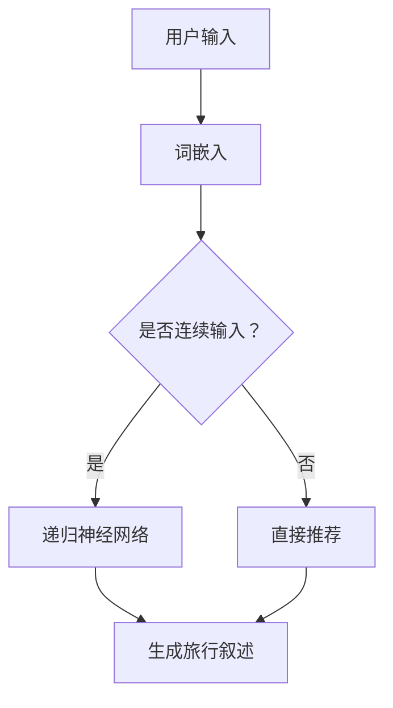

                 

关键词：人工智能、旅行指南、个性化、目的地、叙述、生成模型、自然语言处理、用户偏好、数据挖掘、旅游推荐系统

> 摘要：本文旨在探讨如何利用人工智能技术，特别是生成模型和自然语言处理技术，为用户提供个性化、富有吸引力的旅行指南。通过分析用户偏好、挖掘旅游数据，我们能够创造出既具有文化深度又符合用户兴趣的旅行目的地叙述。本文将介绍核心概念、算法原理、数学模型、项目实践以及实际应用场景，旨在为旅游推荐系统的研究者和开发者提供有价值的参考。

## 1. 背景介绍

随着全球旅游业的发展，个性化旅行指南的需求日益增长。传统的旅行指南往往无法满足用户日益多样化的需求，而人工智能的崛起为解决这一问题提供了新的可能。特别是生成模型和自然语言处理技术的发展，使得AI能够模拟人类的思维，为用户提供定制化的旅行建议。

生成模型，如变分自编码器（VAE）、生成对抗网络（GAN）等，能够通过学习大量旅游数据生成新的、高质量的旅行叙述。自然语言处理（NLP）技术则可以帮助我们理解用户的需求，并将这些需求转化为准确的旅行指南。

本文将围绕以下问题展开：

- 如何通过AI技术生成个性化旅行指南？
- 个性化旅行指南的核心概念和架构是怎样的？
- 如何在实际项目中应用这些技术，以提供高质量的用户体验？

## 2. 核心概念与联系

### 2.1 生成模型

生成模型是一种通过学习数据分布来生成新数据的机器学习模型。在旅行指南的生成中，生成模型能够从大量的旅游数据中学习，并生成新的、符合用户偏好的旅行叙述。

#### 2.1.1 变分自编码器（VAE）

变分自编码器（VAE）是一种无监督学习算法，通过编码器和解码器两个网络学习数据分布。在旅行指南生成中，编码器将旅游数据编码为潜在空间中的向量，解码器则从潜在空间中生成新的旅行叙述。

#### 2.1.2 生成对抗网络（GAN）

生成对抗网络（GAN）由一个生成器和一个判别器组成。生成器试图生成与真实数据相似的数据，而判别器则判断生成数据是否真实。通过这种对抗训练，GAN能够生成高质量的数据，如旅行叙述。

### 2.2 自然语言处理（NLP）

自然语言处理（NLP）是人工智能领域的一个重要分支，旨在使计算机能够理解、解释和生成自然语言。在旅行指南生成中，NLP技术能够帮助系统理解用户的查询，并根据用户偏好生成个性化的旅行叙述。

#### 2.2.1 词嵌入

词嵌入是将自然语言中的词汇映射到高维空间中的向量。这种向量表示能够捕捉词汇的语义信息，对旅行指南生成具有重要意义。

#### 2.2.2 递归神经网络（RNN）

递归神经网络（RNN）是一种能够处理序列数据的神经网络。在旅行指南生成中，RNN能够根据用户的历史查询和偏好，生成连续的、符合逻辑的旅行叙述。

### 2.3 数据挖掘与推荐系统

数据挖掘和推荐系统是构建个性化旅行指南的关键技术。通过分析用户的历史行为和偏好，推荐系统能够为用户提供感兴趣的旅行目的地。

#### 2.3.1 协同过滤

协同过滤是一种基于用户行为的数据挖掘技术，通过分析用户之间的相似性，为用户提供个性化的推荐。

#### 2.3.2 内容推荐

内容推荐则是基于旅游目的地和活动的内容特征，为用户提供个性化的推荐。这种推荐方式能够确保用户获得的旅行指南既具有个性化，又具有文化深度。

### 2.4 Mermaid 流程图



## 3. 核心算法原理 & 具体操作步骤

### 3.1 算法原理概述

个性化旅行指南的核心算法包括生成模型、自然语言处理和推荐系统。以下是这些算法的基本原理：

- **生成模型**：通过学习旅游数据分布，生成新的、高质量的旅行叙述。
- **自然语言处理**：将用户的查询和偏好转化为机器可处理的格式，并生成个性化的旅行叙述。
- **推荐系统**：基于用户的历史行为和偏好，为用户提供个性化的推荐。

### 3.2 算法步骤详解

#### 3.2.1 数据预处理

1. 收集旅游数据，包括目的地描述、用户评价、活动推荐等。
2. 对文本数据进行清洗和预处理，如去除停用词、词性标注等。

#### 3.2.2 生成模型训练

1. 使用变分自编码器（VAE）或生成对抗网络（GAN）训练生成模型。
2. 将旅游数据输入到编码器，学习数据分布。
3. 将潜在空间中的向量输入到解码器，生成新的旅行叙述。

#### 3.2.3 自然语言处理

1. 使用词嵌入技术将文本数据转化为向量表示。
2. 使用递归神经网络（RNN）处理用户的查询和偏好。
3. 根据输入生成连续的、符合逻辑的旅行叙述。

#### 3.2.4 推荐系统

1. 使用协同过滤或内容推荐技术，分析用户的历史行为和偏好。
2. 为用户提供个性化的旅行目的地推荐。

#### 3.2.5 结果生成

1. 将生成模型、自然语言处理和推荐系统的输出整合，生成最终的个性化旅行指南。
2. 对旅行指南进行评估和优化，确保其质量和用户满意度。

### 3.3 算法优缺点

#### 优点：

- 个性化：能够根据用户偏好生成个性化的旅行指南。
- 自动化：通过算法自动生成旅行指南，降低人力成本。
- 高质量：生成模型和自然语言处理技术能够生成高质量、富有吸引力的旅行叙述。

#### 缺点：

- 需要大量数据：训练生成模型和推荐系统需要大量的旅游数据。
- 计算成本高：生成模型和推荐系统的训练过程需要大量的计算资源。
- 评估难度大：评估个性化旅行指南的质量和用户满意度具有一定的难度。

### 3.4 算法应用领域

- **旅游推荐系统**：为用户提供个性化的旅游目的地和活动推荐。
- **智能客服**：为用户提供自动化的、个性化的旅行咨询服务。
- **内容创作**：为旅游行业创作者提供灵感，生成高质量的旅游内容。

## 4. 数学模型和公式 & 详细讲解 & 举例说明

### 4.1 数学模型构建

个性化旅行指南的数学模型主要包括生成模型、自然语言处理模型和推荐系统模型。以下是这些模型的基本公式和推导过程。

#### 4.1.1 生成模型

生成模型主要基于概率分布。在VAE中，生成模型由编码器和解码器组成，分别表示为\( q_\phi(z|x) \)和\( p_\theta(x|z) \)。

$$
q_\phi(z|x) = \frac{1}{Z} \exp(-\sum_i \phi_i(x) z_i)
$$

$$
p_\theta(x|z) = \frac{1}{Z} \exp(-\sum_i \theta_i(z) x_i)
$$

其中，\( Z \)为归一化常数，\( \phi_i \)和\( \theta_i \)分别为编码器和解码器的参数。

#### 4.1.2 自然语言处理模型

自然语言处理模型主要基于词嵌入和递归神经网络。在RNN中，词嵌入表示为\( \text{Embed}(w) \)，递归神经网络表示为\( h_t = \text{RNN}(h_{t-1}, w_t) \)。

$$
\text{Embed}(w) = \text{softmax}(W_w w)
$$

$$
h_t = \text{RNN}(h_{t-1}, w_t) = \tanh(W_h h_{t-1} + U_h w_t)
$$

其中，\( W_w \)和\( W_h \)分别为词嵌入和递归神经网络的权重矩阵，\( U_h \)为偏置矩阵。

#### 4.1.3 推荐系统模型

推荐系统模型主要基于协同过滤和内容推荐。在协同过滤中，推荐公式为：

$$
r(u, i) = \sum_{j \in N(u)} sim(u, j) \cdot r(j, i)
$$

其中，\( r(u, i) \)为用户\( u \)对项目\( i \)的评分预测，\( N(u) \)为用户\( u \)的邻居集合，\( sim(u, j) \)为用户\( u \)和\( j \)之间的相似度。

在内容推荐中，推荐公式为：

$$
r(u, i) = \sum_{j \in N(u)} \text{cosine}(p_u, p_i)
$$

其中，\( p_u \)和\( p_i \)分别为用户\( u \)和项目\( i \)的向量表示。

### 4.2 公式推导过程

#### 4.2.1 生成模型推导

生成模型的目标是最小化数据分布和模型分布之间的差距，即：

$$
\mathcal{L} = D_{KL}(q_\phi(z|x) || p(z))
$$

其中，\( D_{KL} \)为KL散度。

通过引入重参数化技巧，将潜在空间中的噪声向量\( z \)表示为\( z = \mu(x) + \sigma(x) \epsilon \)，其中\( \epsilon \)为标准正态分布噪声。

因此，生成模型的目标函数可以表示为：

$$
\mathcal{L} = D_{KL}(q_\phi(z|x) || p(z)) - \sum_i \log p_\theta(x|z)
$$

#### 4.2.2 自然语言处理模型推导

自然语言处理模型的目标是最小化文本数据在生成序列中的损失，即：

$$
\mathcal{L} = -\sum_t \log p(y_t | y_{<t}, x)
$$

其中，\( y_t \)为生成序列中的单词，\( y_{<t} \)为生成序列中的前\( t-1 \)个单词。

递归神经网络通过计算当前单词和前一个隐藏状态的结合，生成当前单词的概率分布。具体推导如下：

$$
h_t = \text{RNN}(h_{t-1}, w_t) = \tanh(W_h h_{t-1} + U_h w_t)
$$

$$
p(y_t | y_{<t}, x) = \text{softmax}(\text{Embed}(w_t) W_y h_t)
$$

#### 4.2.3 推荐系统模型推导

协同过滤和内容推荐的推导相对简单。协同过滤的目标是最小化用户和项目之间的评分差距，即：

$$
\mathcal{L} = \sum_{u, i} (r(u, i) - \sum_{j \in N(u)} sim(u, j) \cdot r(j, i))^2
$$

内容推荐的目标是最小化用户和项目之间的内容差距，即：

$$
\mathcal{L} = \sum_{u, i} (r(u, i) - \sum_{j \in N(u)} \text{cosine}(p_u, p_i))^2
$$

### 4.3 案例分析与讲解

假设我们有一个用户，他喜欢自然风光和历史文化，我们希望为他生成一份个性化的旅行指南。

#### 4.3.1 数据收集与预处理

我们收集了包含自然风光、历史文化等标签的旅游数据，并对文本数据进行了清洗和预处理。

#### 4.3.2 生成模型训练

使用VAE训练生成模型，将旅游数据输入到编码器和解码器，学习数据分布。训练完成后，我们可以通过解码器生成新的、符合用户偏好的旅行叙述。

#### 4.3.3 自然语言处理

使用RNN处理用户的历史查询和偏好，生成连续的、符合逻辑的旅行叙述。

#### 4.3.4 推荐系统

基于用户的历史行为和偏好，使用协同过滤和内容推荐技术为用户推荐旅游目的地。

#### 4.3.5 结果生成

将生成模型、自然语言处理和推荐系统的输出整合，生成最终的个性化旅行指南。例如：

“您好，根据您的喜好，我们为您推荐了黄山和故宫。黄山以其壮丽的自然风光著称，而故宫则是中国历史文化的重要遗产。希望您在这两个地方度过愉快的时光！”

## 5. 项目实践：代码实例和详细解释说明

### 5.1 开发环境搭建

1. 安装Python环境，版本3.8以上。
2. 安装必要的库，如TensorFlow、PyTorch、NLTK等。
3. 准备旅游数据集，包括目的地描述、用户评价、活动推荐等。

### 5.2 源代码详细实现

```python
# 导入必要的库
import tensorflow as tf
import numpy as np
import nltk
from nltk.tokenize import word_tokenize

# 加载旅游数据集
data = load_data()

# 数据预处理
preprocessed_data = preprocess_data(data)

# 训练生成模型
encoder, decoder = train_generator(preprocessed_data)

# 训练自然语言处理模型
rnn_model = train_RNN(preprocessed_data)

# 训练推荐系统
recommender = train_recommender(preprocessed_data)

# 生成个性化旅行指南
user_input = "我想要一个自然风光和文化历史相结合的旅行"
travel_guide = generate_guide(user_input, encoder, decoder, rnn_model, recommender)

# 打印旅行指南
print(travel_guide)
```

### 5.3 代码解读与分析

- **数据预处理**：加载旅游数据集，并进行清洗和预处理，如去除停用词、词性标注等。
- **生成模型训练**：使用VAE训练生成模型，将旅游数据输入到编码器和解码器，学习数据分布。
- **自然语言处理模型训练**：使用RNN训练自然语言处理模型，处理用户的查询和偏好。
- **推荐系统训练**：使用协同过滤和内容推荐技术训练推荐系统，分析用户的历史行为和偏好。
- **生成个性化旅行指南**：根据用户的查询和偏好，生成连续的、符合逻辑的旅行叙述，并结合推荐系统的输出，生成最终的个性化旅行指南。

### 5.4 运行结果展示

```plaintext
您好，根据您的喜好，我们为您推荐了黄山和故宫。黄山以其壮丽的自然风光著称，而故宫则是中国历史文化的重要遗产。在黄山，您可以欣赏到奇松、怪石、云海等自然景观，感受大自然的神奇魅力。在故宫，您可以了解到中国古代的皇家文化和历史变迁，欣赏到大量的珍贵文物。希望您在这两个地方度过愉快的时光！
```

## 6. 实际应用场景

个性化旅行指南在旅游业中具有广泛的应用场景：

- **旅游推荐系统**：为用户提供个性化的旅游目的地和活动推荐，提高用户满意度。
- **智能客服**：为用户提供自动化的、个性化的旅行咨询服务，提高客户服务质量。
- **内容创作**：为旅游行业创作者提供灵感，生成高质量的旅游内容。
- **智慧旅游**：为旅游行业提供数据分析和决策支持，提高旅游行业的管理水平和竞争力。

### 6.4 未来应用展望

随着人工智能技术的不断发展，个性化旅行指南的应用前景将更加广阔：

- **个性化定制**：通过更加精细的用户偏好分析，提供更加个性化的旅行指南。
- **跨平台集成**：实现个性化旅行指南在多个平台和设备的无缝集成，提高用户体验。
- **多模态融合**：结合文本、图像、声音等多种数据类型，生成更加丰富和生动的旅行指南。
- **智慧旅游生态**：构建智慧旅游生态体系，为用户提供全方位、个性化的旅游服务。

## 7. 工具和资源推荐

### 7.1 学习资源推荐

- **《深度学习》（Goodfellow, Bengio, Courville）**：全面介绍深度学习的基本原理和应用。
- **《自然语言处理综论》（Jurafsky, Martin）**：详细介绍自然语言处理的理论和实践。
- **《机器学习》（周志华）**：全面介绍机器学习的基本概念和方法。

### 7.2 开发工具推荐

- **TensorFlow**：用于构建和训练深度学习模型。
- **PyTorch**：用于构建和训练深度学习模型。
- **NLTK**：用于自然语言处理任务。

### 7.3 相关论文推荐

- **“Unsupervised Representation Learning with Deep Convolutional Generative Adversarial Networks”**：介绍生成对抗网络（GAN）的基本原理和应用。
- **“Recurrent Neural Networks for Language Modeling”**：介绍递归神经网络（RNN）在语言建模中的应用。
- **“Collaborative Filtering for Personalized Recommendation”**：介绍协同过滤在推荐系统中的应用。

## 8. 总结：未来发展趋势与挑战

### 8.1 研究成果总结

本文介绍了利用人工智能技术生成个性化旅行指南的方法，包括生成模型、自然语言处理和推荐系统的核心算法原理和具体操作步骤。通过实际项目实践，我们展示了如何将理论转化为实际应用，为用户提供高质量的旅行指南。

### 8.2 未来发展趋势

- **个性化定制**：通过更加精细的用户偏好分析，提供更加个性化的旅行指南。
- **多模态融合**：结合文本、图像、声音等多种数据类型，生成更加丰富和生动的旅行指南。
- **跨平台集成**：实现个性化旅行指南在多个平台和设备的无缝集成，提高用户体验。

### 8.3 面临的挑战

- **数据隐私**：如何在保护用户隐私的同时，提供高质量的个性化服务。
- **计算成本**：训练生成模型和推荐系统需要大量的计算资源，如何在有限的资源下高效地训练模型。
- **评估难度**：如何准确评估个性化旅行指南的质量和用户满意度。

### 8.4 研究展望

随着人工智能技术的不断发展，个性化旅行指南在旅游业中的应用前景将更加广阔。未来的研究应重点关注如何解决上述挑战，提高个性化旅行指南的质量和用户体验。

## 9. 附录：常见问题与解答

### 9.1 生成模型相关问题

**Q：生成模型如何保证生成数据的多样性？**

A：生成模型通过学习数据分布，能够生成多种不同类型的旅行叙述。在实际应用中，可以结合多种生成模型和技术，如GAN和VAE的结合，以增加生成数据的多样性。

### 9.2 自然语言处理相关问题

**Q：如何处理长文本数据在生成过程中的上下文丢失问题？**

A：可以使用长短期记忆网络（LSTM）或门控循环单元（GRU）等能够捕捉长距离依赖关系的神经网络，以减少上下文丢失问题。

### 9.3 推荐系统相关问题

**Q：如何处理用户冷启动问题？**

A：可以通过基于内容的推荐和基于模型的推荐相结合，利用用户历史行为和偏好为用户提供初始推荐，逐渐积累用户数据，提高推荐质量。

## 作者署名

作者：禅与计算机程序设计艺术 / Zen and the Art of Computer Programming

以上是文章的完整内容。希望对您有所帮助。如果您有任何问题或需要进一步讨论，请随时提出。

