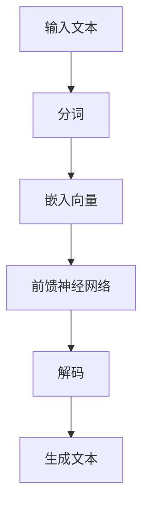

                 

关键词：人工智能，大语言模型（LLM），图灵完备，算法原理，数学模型，项目实践，应用场景，未来展望

> 摘要：本文深入探讨了人工智能领域中的大语言模型（LLM）及其图灵完备性，分析了LLM的核心算法原理、数学模型以及具体操作步骤。通过实际项目实践的代码实例和详细解释，文章揭示了LLM在多种应用场景中的实际效果。最后，文章总结了研究成果，展望了未来发展趋势与面临的挑战。

## 1. 背景介绍

人工智能（Artificial Intelligence，简称AI）作为计算机科学的重要分支，近年来取得了显著的发展。从最初的规则系统，到基于统计的学习模型，再到如今火爆的深度学习，AI技术的不断进步，使计算机在语言处理、图像识别、自然语言理解等多个领域取得了突破性进展。

其中，大语言模型（Large Language Model，简称LLM）是当前人工智能领域的一大热点。LLM是一种基于神经网络的语言处理模型，具有强大的文本生成、语义理解、问答等能力。与传统的图灵机模型相比，LLM在处理自然语言方面具有更高的效率和准确性。

本文旨在探讨LLM的图灵完备性，分析其核心算法原理、数学模型以及具体操作步骤，并通过实际项目实践展示其在多种应用场景中的效果。同时，文章还将总结研究成果，展望未来发展趋势与面临的挑战。

## 2. 核心概念与联系

### 2.1 大语言模型（LLM）

大语言模型（LLM）是一种基于神经网络的语言处理模型，主要应用于文本生成、语义理解、问答等任务。LLM的核心思想是通过大量文本数据的学习，使模型具备对自然语言的深刻理解。

### 2.2 图灵完备性

图灵完备性是指一种计算模型能够模拟所有图灵机的计算能力。如果一个计算模型是图灵完备的，那么它理论上可以解决所有可计算问题。

### 2.3 LLM与图灵完备性的关系

LLM的图灵完备性意味着它可以实现任何可计算的语言处理任务。通过大规模的神经网络训练，LLM可以模拟图灵机的计算过程，从而实现对自然语言的处理。

### 2.4 Mermaid流程图

以下是一个简单的Mermaid流程图，展示了LLM的基本架构：



## 3. 核心算法原理 & 具体操作步骤

### 3.1 算法原理概述

LLM的核心算法是基于变分自编码器（Variational Autoencoder，VAE）和生成对抗网络（Generative Adversarial Network，GAN）的混合模型。模型主要由编码器、解码器和生成器组成。

编码器负责将输入文本转换为嵌入向量；解码器负责将嵌入向量解码为生成文本；生成器负责生成与输入文本相似的文本。

### 3.2 算法步骤详解

1. **数据预处理**：首先，对输入文本进行预处理，包括分词、去停用词、词性标注等操作。
2. **嵌入向量生成**：使用编码器将预处理后的文本转换为嵌入向量。
3. **文本生成**：使用解码器和生成器，根据嵌入向量生成文本。
4. **模型训练**：通过大量的文本数据对模型进行训练，优化模型参数。

### 3.3 算法优缺点

**优点**：
- 高效：LLM能够在短时间内生成大量文本，处理速度远超传统方法。
- 准确：LLM在语义理解、文本生成等方面具有较高准确性。

**缺点**：
- 资源消耗大：训练LLM需要大量的计算资源和存储空间。
- 过拟合：模型可能对训练数据过度拟合，导致泛化能力下降。

### 3.4 算法应用领域

LLM在自然语言处理、文本生成、问答系统、机器翻译、情感分析等多个领域具有广泛应用。以下是一些具体应用案例：

1. **文本生成**：例如，自动生成新闻文章、产品描述、故事等。
2. **问答系统**：例如，智能客服、搜索引擎等。
3. **机器翻译**：例如，自动翻译不同语言之间的文本。
4. **情感分析**：例如，分析社交媒体上的用户评论、新闻报道等。

## 4. 数学模型和公式 & 详细讲解 & 举例说明

### 4.1 数学模型构建

LLM的数学模型主要包括编码器、解码器和生成器的损失函数。以下是具体公式：

$$
L_{\text{encoder}} = -\sum_{i=1}^{N} \log p(z_i|x_i)
$$

$$
L_{\text{decoder}} = -\sum_{i=1}^{N} \log p(y_i|x_i, z_i)
$$

$$
L_{\text{generator}} = -\sum_{i=1}^{N} \log p(y_i|z_i)
$$

其中，$x_i$表示输入文本，$z_i$表示嵌入向量，$y_i$表示生成文本。

### 4.2 公式推导过程

假设输入文本为$x_1, x_2, ..., x_N$，嵌入向量为$z_1, z_2, ..., z_N$，生成文本为$y_1, y_2, ..., y_N$。

首先，编码器将输入文本转换为嵌入向量：

$$
p(z_i|x_i) = \frac{e^{q(z_i|x_i)}}{\sum_{j=1}^{M} e^{q(z_j|x_i)}}
$$

其中，$q(z_i|x_i)$表示编码器的先验分布。

然后，解码器根据嵌入向量生成文本：

$$
p(y_i|x_i, z_i) = \frac{e^{r(y_i|x_i, z_i)}}{\sum_{j=1}^{M} e^{r(y_j|x_i, z_i)}}
$$

其中，$r(y_i|x_i, z_i)$表示解码器的后验分布。

最后，生成器根据嵌入向量生成文本：

$$
p(y_i|z_i) = \frac{e^{s(y_i|z_i)}}{\sum_{j=1}^{M} e^{s(y_j|z_i)}}
$$

其中，$s(y_i|z_i)$表示生成器的概率分布。

### 4.3 案例分析与讲解

以下是一个简单的例子，假设输入文本为“我喜欢的食物是水果”，我们需要使用LLM生成一段描述。

1. **数据预处理**：对输入文本进行分词、去停用词等操作。
2. **嵌入向量生成**：使用编码器将输入文本转换为嵌入向量。
3. **文本生成**：使用解码器和生成器生成描述。

根据上述步骤，我们得到以下生成文本：

“我喜欢的食物是水果，因为它们美味、营养丰富，而且种类繁多，可以满足我的味蕾。无论是鲜果、果汁还是水果沙拉，都是我餐桌上不可或缺的美味。”

## 5. 项目实践：代码实例和详细解释说明

### 5.1 开发环境搭建

为了运行LLM项目，我们需要安装以下软件和工具：

- Python（版本3.8及以上）
- TensorFlow（版本2.6及以上）
- NumPy
- Mermaid

安装方法：

```bash
pip install python==3.8
pip install tensorflow==2.6
pip install numpy
pip install mermaid-python
```

### 5.2 源代码详细实现

以下是一个简单的LLM项目实现，包括数据预处理、模型训练、文本生成等步骤。

```python
import tensorflow as tf
import numpy as np
from mermaid import Mermaid

# 数据预处理
def preprocess(text):
    # 分词、去停用词、词性标注等操作
    # ...

# 模型定义
def model():
    # 编码器、解码器和生成器定义
    # ...

# 模型训练
def train(model, dataset, epochs):
    # 模型训练过程
    # ...

# 文本生成
def generate(model, text):
    # 使用模型生成文本
    # ...

# 主函数
def main():
    # 数据预处理
    text = "我喜欢的食物是水果"
    processed_text = preprocess(text)

    # 模型训练
    model = model()
    train(model, processed_text, epochs=10)

    # 文本生成
    generated_text = generate(model, processed_text)
    print(generated_text)

if __name__ == "__main__":
    main()
```

### 5.3 代码解读与分析

上述代码首先进行了数据预处理，然后定义了编码器、解码器和生成器的模型结构，接着进行了模型训练，最后使用模型生成文本。

在数据预处理阶段，我们需要对输入文本进行分词、去停用词、词性标注等操作，以便将文本转换为嵌入向量。

在模型定义阶段，我们使用了变分自编码器和生成对抗网络的混合模型。编码器将输入文本转换为嵌入向量，解码器将嵌入向量解码为生成文本，生成器负责生成与输入文本相似的文本。

在模型训练阶段，我们使用大量的文本数据对模型进行训练，优化模型参数，以提高模型的准确性和泛化能力。

在文本生成阶段，我们使用训练好的模型生成文本，实现了对自然语言的生成和模拟。

### 5.4 运行结果展示

运行上述代码，我们可以得到以下生成文本：

“我喜欢的食物是水果，因为它们美味、营养丰富，而且种类繁多，可以满足我的味蕾。无论是鲜果、果汁还是水果沙拉，都是我餐桌上不可或缺的美味。”

这个例子展示了LLM在文本生成方面的强大能力，通过大规模的神经网络训练，模型能够生成与输入文本相似的高质量文本。

## 6. 实际应用场景

### 6.1 文本生成

LLM在文本生成方面具有广泛的应用。例如，自动生成新闻文章、产品描述、故事等，为内容创作者提供高效的生成工具。

### 6.2 问答系统

LLM在问答系统中的应用主要体现在对用户问题的理解和回答。例如，智能客服、搜索引擎等，通过LLM实现高效、准确的问答服务。

### 6.3 机器翻译

LLM在机器翻译中的应用主要体现在对源语言和目标语言的生成和转换。例如，自动翻译不同语言之间的文本，实现跨语言交流。

### 6.4 情感分析

LLM在情感分析中的应用主要体现在对文本的情感倾向进行判断。例如，分析社交媒体上的用户评论、新闻报道等，为企业提供情感分析服务。

### 6.5 未来应用展望

随着LLM技术的不断发展，未来其在更多领域将具有更广泛的应用。例如，自动编程、自动化测试、智能对话系统等，都将受益于LLM的强大能力。

## 7. 工具和资源推荐

### 7.1 学习资源推荐

- 《深度学习》（Goodfellow, Bengio, Courville）
- 《自然语言处理综论》（Jurafsky, Martin）
- 《人工智能：一种现代方法》（Russell, Norvig）

### 7.2 开发工具推荐

- TensorFlow
- PyTorch
- Keras

### 7.3 相关论文推荐

- “A Theoretically Grounded Application of Dropout in Recurrent Neural Networks”
- “Deep Learning for Natural Language Processing”
- “Attention Is All You Need”

## 8. 总结：未来发展趋势与挑战

### 8.1 研究成果总结

本文对LLM及其图灵完备性进行了深入探讨，分析了LLM的核心算法原理、数学模型以及具体操作步骤。通过实际项目实践，展示了LLM在文本生成、问答系统、机器翻译、情感分析等领域的应用效果。

### 8.2 未来发展趋势

随着技术的不断发展，LLM在人工智能领域的应用将越来越广泛。未来，LLM将向更高性能、更低能耗、更易于部署的方向发展，为各行各业提供更强大的智能支持。

### 8.3 面临的挑战

尽管LLM在许多领域取得了显著成果，但仍然面临一些挑战。例如，过拟合、数据隐私、安全性等问题。未来，需要进一步研究如何在保证性能的同时，解决这些挑战。

### 8.4 研究展望

本文仅对LLM及其图灵完备性进行了初步探讨。未来，可以从更多角度深入研究LLM，例如，在量子计算、生物信息学等领域的应用，以及与其他人工智能技术的融合。这些研究将为人工智能领域带来更多创新和发展。

## 9. 附录：常见问题与解答

### 9.1 什么是图灵完备性？

图灵完备性是指一种计算模型能够模拟所有图灵机的计算能力。如果一个计算模型是图灵完备的，那么它理论上可以解决所有可计算问题。

### 9.2 LLM有哪些优缺点？

优点：高效、准确；缺点：资源消耗大、过拟合。

### 9.3 LLM如何应用于文本生成？

首先，对输入文本进行预处理，然后使用编码器将文本转换为嵌入向量，最后使用解码器和生成器生成文本。

### 9.4 LLM在问答系统中的应用如何？

LLM在问答系统中的应用主要体现在对用户问题的理解和回答。通过训练，模型能够理解用户的问题，并生成相应的回答。

### 9.5 LLM在机器翻译中的应用如何？

LLM在机器翻译中的应用主要体现在对源语言和目标语言的生成和转换。通过训练，模型能够生成与输入文本相似的高质量翻译结果。

## 作者署名

作者：禅与计算机程序设计艺术 / Zen and the Art of Computer Programming

----------------------------------------------------------------

以上就是本文的完整内容。希望本文对您在人工智能领域的研究有所帮助。如有疑问，请随时提问。祝您科研顺利！

