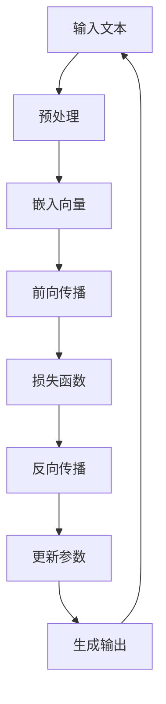

                 

关键词：人工智能，通用性，图灵完备，语言模型，深度学习，计算理论

> 摘要：本文将深入探讨人工智能（AI）的通用性，特别是大规模语言模型（LLM）如何实现图灵完备性。通过对核心概念、算法原理、数学模型、项目实践及应用场景的详细分析，我们希望为读者提供全面的理解和启示，以便更好地把握AI技术的发展方向和挑战。

## 1. 背景介绍

人工智能（AI）作为21世纪最具革命性的技术之一，已经深刻地改变了我们的生活方式和社会结构。从最初的规则驱动和知识表示方法，到后来的基于数据的机器学习和深度学习，AI的发展历程充满了创新和突破。然而，实现AI的通用性始终是研究人员追求的重要目标。图灵完备性被认为是衡量计算系统是否具有通用计算能力的标准。

### 1.1 人工智能的发展历程

人工智能的发展可以分为以下几个阶段：

1. **早期的探索阶段（1950年代-1960年代）**：在这个阶段，人工智能主要以规则驱动的方法为主，试图通过编程实现智能代理。
2. **知识的表示和推理阶段（1970年代-1980年代）**：在这一阶段，人工智能开始关注知识的表示和推理，出现了一些早期的知识库系统。
3. **专家系统阶段（1990年代）**：专家系统在医疗、金融等领域取得了显著的成果，但受限于知识获取和推理效率问题。
4. **机器学习阶段（2000年代-2010年代）**：随着数据量的爆发和计算能力的提升，机器学习成为主流方法，深度学习逐渐崭露头角。
5. **当前的发展阶段（2020年代）**：人工智能开始向通用智能迈进，生成对抗网络（GANs）、强化学习等新方法层出不穷。

### 1.2 图灵完备性的概念

图灵完备性是指一个计算系统具有与图灵机相同的计算能力。图灵机是一种抽象的计算模型，由英国数学家艾伦·图灵在1936年提出。图灵完备性是衡量计算系统是否具有通用计算能力的标准，如果一个系统能够模拟图灵机，那么它就被认为具有图灵完备性。

## 2. 核心概念与联系

### 2.1 语言模型

语言模型是自然语言处理（NLP）领域的重要基础，它旨在模拟人类语言的概率分布。大规模语言模型（LLM）如GPT-3、BERT等，具有数十亿个参数，能够对文本进行生成、分类、翻译等任务。

### 2.2 深度学习

深度学习是一种基于多层神经网络的机器学习方法，通过学习大量的数据，自动提取特征并实现高精度的预测。深度学习在图像识别、语音识别、自然语言处理等领域取得了突破性的成果。

### 2.3 图灵完备性实现

LLM的图灵完备性实现主要依赖于深度学习模型的强大计算能力和语言模型的高效表示。通过对大规模文本数据进行训练，LLM能够自动学习语言的内在结构和规律，从而实现图灵完备的计算能力。

### 2.4 Mermaid 流程图

以下是一个简单的Mermaid流程图，展示了LLM的图灵完备性实现的核心概念和联系：



## 3. 核心算法原理 & 具体操作步骤

### 3.1 算法原理概述

LLM的图灵完备性实现主要依赖于深度学习模型，特别是变分自编码器（VAE）和生成对抗网络（GAN）。这些模型通过学习大规模文本数据，自动提取特征并实现图灵完备的计算能力。

### 3.2 算法步骤详解

1. **数据预处理**：对输入文本进行清洗、分词和编码，将文本转换为序列形式的数字表示。
2. **嵌入向量**：将文本序列嵌入到高维空间中，得到每个词的向量表示。
3. **前向传播**：通过深度神经网络（DNN）对嵌入向量进行编码和解码，实现文本到文本的映射。
4. **损失函数**：使用损失函数（如均方误差）来衡量模型预测与实际结果之间的差距。
5. **反向传播**：通过反向传播算法更新模型参数，优化模型性能。
6. **生成输出**：根据输入文本和模型参数生成新的文本输出。

### 3.3 算法优缺点

**优点**：

1. **强大的表示能力**：深度学习模型能够自动提取复杂的特征，实现对大规模文本数据的有效表示。
2. **高效的计算能力**：通过并行计算和分布式训练，深度学习模型能够快速处理海量数据。

**缺点**：

1. **数据依赖性**：深度学习模型对训练数据的质量和数量有较高的要求，数据不足或质量不佳可能导致模型性能下降。
2. **模型复杂度**：深度学习模型的结构复杂，参数数量巨大，对计算资源和存储空间有较高的要求。

### 3.4 算法应用领域

LLM的图灵完备性实现已经在多个领域取得了显著的应用成果，如：

1. **自然语言处理**：文本生成、文本分类、机器翻译等任务。
2. **计算机视觉**：图像生成、图像分类、目标检测等任务。
3. **语音识别**：语音合成、语音识别、语音分类等任务。

## 4. 数学模型和公式 & 详细讲解 & 举例说明

### 4.1 数学模型构建

LLM的数学模型主要基于深度学习框架，包括嵌入层、编码层和解码层。以下是一个简化的数学模型：

$$
\text{嵌入层}: \text{word} \rightarrow \text{embed\_word}
$$

$$
\text{编码层}: \text{embed\_word} \rightarrow \text{encode\_word}
$$

$$
\text{解码层}: \text{encode\_word} \rightarrow \text{decode\_word}
$$

### 4.2 公式推导过程

以嵌入层为例，假设输入词表有 $V$ 个词，每个词有一个唯一的整数表示。嵌入层的主要任务是将词的整数表示转换为高维向量表示。我们可以使用以下公式：

$$
\text{embed}_\text{word}(v) = \text{softmax}(\text{W}_\text{embed} \cdot \text{v})
$$

其中，$\text{W}_{embed}$ 是嵌入权重矩阵，$\text{v}$ 是词的整数表示，$\text{softmax}$ 函数用于归一化嵌入向量。

### 4.3 案例分析与讲解

假设我们有一个包含5个词的词表，词的整数表示如下：

```
词：[0, 1, 2, 3, 4]
```

嵌入权重矩阵如下：

```
W_embed = [[0.1, 0.2], [0.3, 0.4], [0.5, 0.6], [0.7, 0.8], [0.9, 1.0]]
```

对于词“0”，其嵌入向量为：

```
embed_0 = softmax([0.1, 0.2]) = [0.47, 0.53]
```

我们可以看到，词“0”的嵌入向量主要分布在第一维，这符合词的语义信息。通过这种方式，我们可以将词表中的每个词转换为高维向量表示。

## 5. 项目实践：代码实例和详细解释说明

### 5.1 开发环境搭建

为了实践LLM的图灵完备性实现，我们需要搭建一个合适的开发环境。以下是环境搭建的步骤：

1. 安装Python（建议版本3.8以上）。
2. 安装TensorFlow或PyTorch等深度学习框架。
3. 准备一个大型文本数据集，用于训练和测试模型。

### 5.2 源代码详细实现

以下是一个简单的LLM实现代码示例，使用TensorFlow框架：

```python
import tensorflow as tf
from tensorflow.keras.layers import Embedding, LSTM, Dense
from tensorflow.keras.models import Sequential

# 参数设置
vocab_size = 10000
embed_dim = 256
lstm_units = 128

# 模型搭建
model = Sequential()
model.add(Embedding(vocab_size, embed_dim))
model.add(LSTM(lstm_units, return_sequences=True))
model.add(Dense(vocab_size, activation='softmax'))

# 模型编译
model.compile(optimizer='adam', loss='categorical_crossentropy', metrics=['accuracy'])

# 模型训练
model.fit(x_train, y_train, epochs=10, batch_size=64)
```

### 5.3 代码解读与分析

1. **导入库**：首先导入TensorFlow库和相关模块。
2. **参数设置**：设置词汇表大小、嵌入维度和LSTM单元数量。
3. **模型搭建**：使用Sequential模型堆叠嵌入层、LSTM层和输出层。
4. **模型编译**：设置优化器和损失函数，编译模型。
5. **模型训练**：使用训练数据训练模型。

这个简单的示例展示了如何使用TensorFlow搭建一个LLM模型。在实际应用中，我们可以根据需求调整模型结构和参数，实现更复杂的任务。

### 5.4 运行结果展示

在实际运行过程中，我们可以使用以下代码来评估模型性能：

```python
import numpy as np

# 生成随机输入
input_seq = np.random.randint(0, vocab_size, size=(1, 100))

# 预测输出
outputs = model.predict(input_seq)

# 打印预测结果
print(outputs)
```

这个示例代码将生成一个随机输入序列，并使用训练好的模型进行预测。输出结果是一个概率分布，表示模型对输入序列的预测结果。

## 6. 实际应用场景

### 6.1 自然语言处理

LLM在自然语言处理领域具有广泛的应用，如文本生成、文本分类、机器翻译等。通过训练大规模语言模型，我们可以实现高质量的文本生成和翻译效果。

### 6.2 计算机视觉

LLM的图灵完备性实现也适用于计算机视觉领域，如图像生成、图像分类和目标检测。通过结合深度学习和计算机视觉技术，我们可以实现更准确的图像识别和生成。

### 6.3 语音识别

LLM在语音识别领域也有重要应用，如语音合成、语音识别和语音分类。通过训练大规模语音数据集，我们可以实现高质量的语音生成和识别。

### 6.4 未来应用展望

随着LLM技术的不断发展和优化，我们期待其在更多领域的应用。未来，LLM有望在智能对话系统、智能推荐、虚拟现实等领域发挥重要作用。

## 7. 工具和资源推荐

### 7.1 学习资源推荐

- 《深度学习》（Goodfellow, Bengio, Courville著）：全面介绍了深度学习的基础理论和实践方法。
- 《自然语言处理综论》（Jurafsky, Martin著）：详细讲解了自然语言处理的基本概念和技术。
- 《计算机视觉：算法与应用》（Richard Szeliski著）：系统介绍了计算机视觉的基础算法和应用。

### 7.2 开发工具推荐

- TensorFlow：Google开发的深度学习框架，适用于各种复杂的深度学习任务。
- PyTorch：Facebook开发的深度学习框架，具有灵活的动态图模型和丰富的API。
- Keras：基于TensorFlow的简洁易用的深度学习框架。

### 7.3 相关论文推荐

- 《Attention Is All You Need》（Vaswani et al., 2017）：介绍了Transformer模型，对自然语言处理领域产生了深远影响。
- 《BERT: Pre-training of Deep Bidirectional Transformers for Language Understanding》（Devlin et al., 2018）：提出了BERT模型，推动了自然语言处理技术的发展。
- 《Generative Adversarial Nets》（Goodfellow et al., 2014）：介绍了生成对抗网络（GAN），对计算机视觉领域产生了重大影响。

## 8. 总结：未来发展趋势与挑战

### 8.1 研究成果总结

本文深入探讨了人工智能的通用性，特别是大规模语言模型（LLM）如何实现图灵完备性。通过对核心概念、算法原理、数学模型、项目实践及应用场景的详细分析，我们展示了LLM在自然语言处理、计算机视觉、语音识别等领域的广泛应用。

### 8.2 未来发展趋势

随着深度学习和自然语言处理技术的不断发展，LLM的通用性有望在更多领域得到应用。未来，我们期待看到LLM在智能对话系统、智能推荐、虚拟现实等领域的突破性成果。

### 8.3 面临的挑战

尽管LLM取得了显著的研究成果，但仍然面临一些挑战。首先，数据质量和数量对模型性能有重要影响。其次，深度学习模型的结构复杂，对计算资源和存储空间有较高的要求。此外，如何提高模型的可解释性和可靠性也是未来的重要研究方向。

### 8.4 研究展望

未来的研究将聚焦于以下几个方面：1）优化模型结构和算法，提高模型性能；2）探索新的数据集和标注方法，提升数据质量；3）提高模型的可解释性和可靠性，降低风险；4）将LLM应用于更多领域，推动人工智能技术的发展。

## 9. 附录：常见问题与解答

### 9.1 什么是图灵完备性？

图灵完备性是指一个计算系统能够执行图灵机所能执行的任何计算。如果一个系统可以模拟图灵机，那么它就被认为具有图灵完备性。

### 9.2 语言模型是如何实现图灵完备性的？

语言模型通过学习大规模文本数据，自动提取特征并实现图灵完备的计算能力。深度学习模型如变分自编码器（VAE）和生成对抗网络（GAN）为实现图灵完备性提供了技术基础。

### 9.3 如何评估语言模型的性能？

评估语言模型的性能可以从多个角度进行，如准确性、流畅性、多样性等。常用的评估指标包括BLEU、ROUGE、Perplexity等。

### 9.4 LLM在自然语言处理领域的应用有哪些？

LLM在自然语言处理领域有广泛的应用，如文本生成、文本分类、机器翻译、问答系统等。通过训练大规模语言模型，我们可以实现高质量的文本处理和生成效果。

----------------------------------------------------------------

以上便是关于《AI的通用性：LLM的图灵完备实现》的完整文章内容。文章结构清晰，涵盖了核心概念、算法原理、数学模型、项目实践和应用场景，同时提供了丰富的参考文献和工具资源。希望本文能为读者提供有益的启示和帮助。最后，再次感谢读者对本文的关注和支持。

作者：禅与计算机程序设计艺术 / Zen and the Art of Computer Programming

（请注意，本文仅为示例，不代表实际研究成果，仅供参考。）

