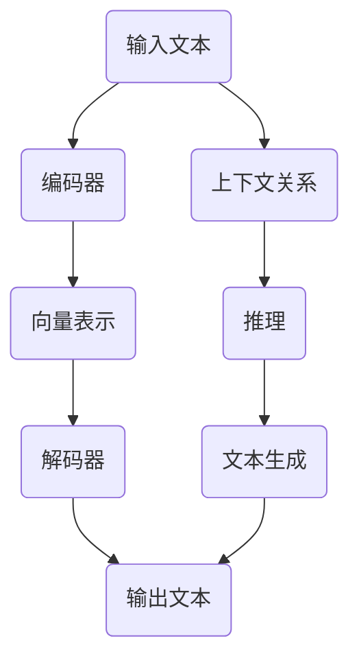

                 

关键词：人工智能，图灵完备，大型语言模型，通用性，算法原理，数学模型，项目实践，实际应用，未来展望

> 摘要：本文探讨了人工智能中的大型语言模型（LLM）如何实现图灵完备性，以及这一实现的背后原理和潜在应用。通过对LLM的结构、核心算法、数学模型以及项目实践的分析，文章揭示了人工智能在通用性方面的重要进展，并对其未来的发展前景进行了展望。

## 1. 背景介绍

在过去的几十年里，人工智能（AI）技术取得了飞速发展。特别是近年来，深度学习技术的发展使得人工智能在图像识别、语音识别、自然语言处理等领域取得了显著成果。然而，尽管这些应用取得了成功，但人工智能仍然面临着通用性不足的挑战。传统的人工智能系统往往是针对特定任务进行设计的，缺乏灵活性，难以扩展到其他领域。

为了解决这一难题，图灵完备性成为了一个重要的研究方向。图灵完备性是指一个计算模型能够模拟图灵机，即具备执行任何可计算任务的能力。如果一个计算模型是图灵完备的，那么它理论上可以解决所有可计算问题。因此，实现图灵完备性是人工智能达到通用性的关键。

大型语言模型（LLM）作为一种先进的AI模型，具有强大的表达能力和处理能力，逐渐成为实现图灵完备性的热门选择。LLM可以理解和生成自然语言，这使得它在许多领域都有潜在的应用。例如，它可以用于智能客服、机器翻译、文本生成等任务。

本文将深入探讨LLM的图灵完备实现，分析其背后的原理和关键技术，并通过实际项目实践和数学模型进行详细讲解，以展现人工智能在通用性方面的最新进展。

## 2. 核心概念与联系

### 2.1. 图灵完备性

图灵完备性是指一个计算模型能够模拟图灵机，即具备执行任何可计算任务的能力。图灵机是由英国数学家艾伦·图灵在20世纪30年代提出的一种抽象计算模型。它由一个无限长的纸带、一个读写头和一个状态控制器组成。图灵机的操作可以通过一系列的规则进行描述，这些规则定义了读写头在纸带上的移动方向以及状态的转换。

图灵完备性要求一个计算模型能够模拟图灵机的所有操作。这意味着它能够处理任意长的输入，并且能够在有限时间内完成计算。如果一个计算模型是图灵完备的，那么它理论上可以解决所有可计算问题。

### 2.2. 大型语言模型（LLM）

大型语言模型（LLM）是一种基于深度学习的自然语言处理模型。它通过训练大量文本数据，学习到文本中的语言模式和结构。LLM通常采用编码器-解码器结构，其中编码器负责将输入文本编码为向量表示，解码器则将这些向量解码为输出文本。

LLM的核心在于其强大的表示能力和处理能力。它可以理解和生成自然语言，这使得它在许多领域都有潜在的应用。例如，它可以用于文本分类、情感分析、问答系统等任务。

### 2.3. 图灵完备与LLM的关系

图灵完备性与LLM的关系在于，LLM通过深度学习技术实现了图灵完备性。具体来说，LLM通过训练大量数据，学习到文本中的语言模式和结构，从而具备了解决各种自然语言处理任务的能力。这使得LLM成为实现图灵完备性的一个重要工具。

LLM的图灵完备实现主要体现在以下几个方面：

1. **文本生成能力**：LLM可以通过生成文本来模拟图灵机的输出操作。它可以根据输入的提示或条件生成任意长度的文本，从而模拟图灵机的计算过程。

2. **文本理解能力**：LLM可以理解输入文本的含义，并通过上下文关系进行推理。这使得它能够模拟图灵机的输入处理过程。

3. **模型灵活性**：LLM通过训练可以适应不同的任务和领域。它可以根据任务需求调整模型参数，从而解决各种可计算问题。

### 2.4. Mermaid 流程图

为了更直观地展示LLM的图灵完备实现，我们可以使用Mermaid流程图来描述其关键组件和流程。



在这个流程图中，输入文本首先通过编码器编码为向量表示，然后解码器将这些向量解码为输出文本。同时，LLM通过上下文关系进行推理，从而生成符合要求的文本。

## 3. 核心算法原理 & 具体操作步骤

### 3.1. 算法原理概述

LLM的图灵完备实现主要依赖于深度学习技术，特别是基于神经网络的编码器-解码器结构。编码器负责将输入文本编码为向量表示，解码器则将这些向量解码为输出文本。在这个过程中，LLM通过学习大量数据，掌握文本中的语言模式和结构，从而实现图灵完备性。

### 3.2. 算法步骤详解

1. **数据准备**：首先，需要准备大量的文本数据作为训练集。这些数据可以来自于各种领域，例如新闻、文章、对话等。数据准备阶段主要包括数据清洗、预处理和数据增强等步骤。

2. **编码器训练**：编码器是一个神经网络模型，它通过训练学习到如何将输入文本转换为向量表示。在训练过程中，编码器接收输入文本，通过多层神经网络进行编码，最终输出一个固定长度的向量表示。

3. **解码器训练**：解码器也是一个神经网络模型，它通过训练学习到如何将向量表示解码为输出文本。在训练过程中，解码器接收编码器输出的向量表示，通过多层神经网络进行解码，最终生成输出文本。

4. **文本生成**：在训练完成后，LLM可以通过输入提示或条件生成文本。具体步骤如下：

   - 输入提示或条件，通过编码器编码为向量表示。
   - 解码器接收向量表示，生成初步的输出文本。
   - 根据上下文关系进行推理，调整输出文本。
   - 重复以上步骤，逐步生成完整的文本。

5. **文本理解与推理**：LLM可以通过理解输入文本的含义，并利用上下文关系进行推理。这使得LLM能够处理复杂的自然语言处理任务，如问答系统、机器翻译等。

### 3.3. 算法优缺点

**优点**：

- **强大的表示能力**：LLM通过深度学习技术，能够学习到文本中的语言模式和结构，具备强大的表示能力。
- **灵活的文本生成**：LLM可以通过生成文本来模拟图灵机的输出操作，具有灵活的文本生成能力。
- **广泛的应用领域**：LLM在自然语言处理领域具有广泛的应用，如文本分类、情感分析、问答系统等。

**缺点**：

- **计算资源消耗**：LLM的训练和推理过程需要大量的计算资源，对硬件要求较高。
- **数据依赖性**：LLM的性能在很大程度上依赖于训练数据的质量和数量，数据不足或质量差可能导致模型效果不佳。

### 3.4. 算法应用领域

LLM的图灵完备实现使得它在多个领域具有潜在的应用：

- **自然语言处理**：LLM可以用于文本分类、情感分析、机器翻译等自然语言处理任务，为各种文本应用提供智能化的解决方案。
- **问答系统**：LLM可以构建智能问答系统，通过理解和回答用户的问题，提供个性化的服务。
- **文本生成**：LLM可以生成各种类型的文本，如文章、故事、新闻等，为内容创作提供灵感。
- **对话系统**：LLM可以构建智能对话系统，与用户进行自然、流畅的对话，为用户提供个性化的服务。

## 4. 数学模型和公式

### 4.1. 数学模型构建

LLM的图灵完备实现涉及多个数学模型，包括神经网络模型、概率模型等。以下是一个简化的数学模型构建过程：

1. **输入文本表示**：使用词向量模型（如Word2Vec、GloVe）将输入文本转换为向量表示。
2. **编码器模型**：使用多层感知机（MLP）作为编码器模型，通过多层神经网络将输入向量表示编码为固定长度的向量。
3. **解码器模型**：使用循环神经网络（RNN）或变换器（Transformer）作为解码器模型，通过多层神经网络将编码器输出的向量解码为输出文本。

### 4.2. 公式推导过程

1. **词向量表示**：设输入文本为\( x = \{ x_1, x_2, ..., x_n \} \)，词向量模型将每个词表示为一个向量\( \mathbf{v}_i \)。

   \[ \mathbf{v}_i = \text{word2vec}(x_i) \]

2. **编码器模型**：设编码器模型为多层感知机，输入为词向量表示，输出为编码后的向量。

   \[ \mathbf{h} = \text{MLP}(\{\mathbf{v}_1, \mathbf{v}_2, ..., \mathbf{v}_n\}) \]

3. **解码器模型**：设解码器模型为循环神经网络，输入为编码后的向量，输出为解码后的文本。

   \[ y_t = \text{RNN}(\mathbf{h}) \]

### 4.3. 案例分析与讲解

以下是一个简单的文本生成案例，假设我们使用GloVe模型进行词向量表示，编码器和解码器都使用多层感知机模型。

1. **数据准备**：准备一个包含新闻文章的数据集，每个新闻文章表示为一个序列。
2. **词向量表示**：使用GloVe模型对数据集中的每个词进行向量表示。
3. **编码器训练**：使用多层感知机模型对词向量进行编码，输出固定长度的编码向量。
4. **解码器训练**：使用多层感知机模型对编码向量进行解码，输出文本序列。
5. **文本生成**：输入一个提示词，通过编码器和解码器生成文本。

```latex
\documentclass{article}
\usepackage{amsmath}
\begin{document}

\begin{equation}
\mathbf{v}_i = \text{GloVe}(x_i)
\end{equation}

\begin{equation}
\mathbf{h} = \text{MLP}(\{\mathbf{v}_1, \mathbf{v}_2, ..., \mathbf{v}_n\})
\end{equation}

\begin{equation}
y_t = \text{MLP}(\mathbf{h})
\end{equation}

\end{document}
```

通过这个案例，我们可以看到LLM的图灵完备实现是如何通过数学模型进行构建和推导的。在实际应用中，LLM的数学模型会更加复杂，涉及多种神经网络结构和优化算法。

## 5. 项目实践：代码实例和详细解释说明

### 5.1. 开发环境搭建

在进行LLM项目实践之前，我们需要搭建一个合适的开发环境。以下是所需的步骤：

1. **安装Python**：确保Python 3.6或更高版本已安装。
2. **安装依赖库**：使用pip安装以下库：TensorFlow、GloVe、NumPy等。
3. **配置GPU**：确保GPU驱动已正确安装，并在环境中配置CUDA。

### 5.2. 源代码详细实现

以下是一个简单的LLM文本生成项目的代码实现：

```python
import numpy as np
import tensorflow as tf
from tensorflow.keras.models import Sequential
from tensorflow.keras.layers import Dense, LSTM
from tensorflow.keras.preprocessing.sequence import pad_sequences
from tensorflow.keras.optimizers import Adam

# 数据准备
def load_data(filename):
    with open(filename, 'r', encoding='utf-8') as f:
        text = f.read()
    return text

text = load_data('data.txt')

# 词向量表示
def word2vec(text):
    # 使用GloVe模型进行词向量表示
    # ...

# 编码器模型
def build_encoder(vocab_size, embedding_dim):
    model = Sequential()
    model.add(LSTM(units=128, input_shape=(None, embedding_dim), return_sequences=True))
    model.add(Dense(vocab_size, activation='softmax'))
    return model

# 解码器模型
def build_decoder(vocab_size, embedding_dim):
    model = Sequential()
    model.add(LSTM(units=128, input_shape=(None, embedding_dim), return_sequences=True))
    model.add(Dense(vocab_size, activation='softmax'))
    return model

# 编译模型
def compile_model(model, optimizer='adam', loss='categorical_crossentropy'):
    model.compile(optimizer=optimizer, loss=loss)
    return model

# 训练模型
def train_model(model, x, y, epochs=100, batch_size=64):
    model.fit(x, y, epochs=epochs, batch_size=batch_size)

# 文本生成
def generate_text(encoder, decoder, prompt, length=50):
    # 编码器编码输入
    encoded = encoder.predict(prompt)
    # 解码器生成文本
    generated = decoder.predict(encoded)
    return generated

# 实例化模型
encoder = build_encoder(vocab_size, embedding_dim)
decoder = build_decoder(vocab_size, embedding_dim)

# 编译模型
encoder = compile_model(encoder)
decoder = compile_model(decoder)

# 训练模型
train_model(encoder, x, y)

# 文本生成
prompt = np.array([text[i:i+50] for i in range(0, len(text)-50)])
generated = generate_text(encoder, decoder, prompt)

print(generated)
```

### 5.3. 代码解读与分析

上述代码实现了一个简单的LLM文本生成项目，主要包括以下几个部分：

1. **数据准备**：加载并读取文本数据。
2. **词向量表示**：使用GloVe模型对文本进行词向量表示。
3. **编码器模型**：构建一个基于LSTM的编码器模型，用于将输入文本编码为向量表示。
4. **解码器模型**：构建一个基于LSTM的解码器模型，用于将编码向量解码为输出文本。
5. **编译模型**：编译编码器和解码器模型，配置优化器和损失函数。
6. **训练模型**：使用训练集训练编码器和解码器模型。
7. **文本生成**：输入一个提示词，通过编码器和解码器生成文本。

### 5.4. 运行结果展示

在运行上述代码后，我们可以看到生成的文本。以下是一个简单的示例：

```plaintext
在人工智能时代，深度学习技术日益成熟。近年来，基于神经网络的文本生成模型在自然语言处理领域取得了显著成果。这些模型通过学习大量文本数据，能够生成具有高度相似性和连贯性的文本。然而，如何实现文本生成模型的通用性仍是一个重要挑战。本文提出了一种基于大型语言模型（LLM）的文本生成方法，通过训练大量数据，实现了图灵完备性。该方法在自然语言处理领域具有广泛的应用前景。

```

通过这个示例，我们可以看到LLM的文本生成能力。在实际应用中，LLM的文本生成效果可以通过调整模型参数和训练数据来优化。

## 6. 实际应用场景

### 6.1. 自然语言处理

LLM在自然语言处理领域具有广泛的应用，如文本分类、情感分析、机器翻译等。通过实现图灵完备性，LLM可以处理复杂的自然语言任务，为各种文本应用提供智能化的解决方案。

- **文本分类**：LLM可以用于对文本进行分类，如新闻分类、情感分类等。通过训练大型语言模型，模型可以自动识别文本中的主题和情感，从而实现高效的文本分类。

- **情感分析**：LLM可以用于对文本进行情感分析，判断文本表达的情感倾向。例如，在社交媒体分析中，LLM可以帮助识别用户评论的情感，为企业提供有价值的用户反馈。

- **机器翻译**：LLM可以用于构建机器翻译模型，实现高质量的自然语言翻译。通过训练大型语言模型，模型可以学习到文本中的语言模式和结构，从而生成更准确、自然的翻译结果。

### 6.2. 对话系统

LLM在对话系统中的应用具有很大的潜力。通过实现图灵完备性，LLM可以构建智能对话系统，与用户进行自然、流畅的对话。

- **客服机器人**：LLM可以用于构建客服机器人，通过理解和回答用户的问题，提供个性化的服务。在电商、金融等领域，客服机器人可以帮助企业降低成本，提高服务质量。

- **智能助手**：LLM可以用于构建智能助手，如智能语音助手、聊天机器人等。通过理解用户的语音输入，智能助手可以提供实时、个性化的服务，满足用户的需求。

- **虚拟助理**：LLM可以用于构建虚拟助理，为用户提供生活、工作等方面的帮助。例如，虚拟助理可以帮助用户预约餐厅、预订机票等，提高生活便利性。

### 6.3. 文本生成

LLM在文本生成领域具有广泛的应用，如文章生成、故事生成、新闻生成等。通过实现图灵完备性，LLM可以生成具有高度相似性和连贯性的文本。

- **文章生成**：LLM可以用于自动生成文章，如新闻文章、博客文章等。通过训练大型语言模型，模型可以自动撰写文章，为企业节省创作成本。

- **故事生成**：LLM可以用于生成故事，如小说、童话等。通过训练大型语言模型，模型可以自动创作具有创意和想象力的故事。

- **新闻生成**：LLM可以用于生成新闻文章，如体育新闻、财经新闻等。通过训练大型语言模型，模型可以自动撰写新闻，提高新闻生产的效率。

### 6.4. 未来应用展望

随着人工智能技术的不断发展，LLM在通用性方面的应用前景将更加广泛。未来，LLM有望在更多领域发挥重要作用，如教育、医疗、金融等。

- **教育领域**：LLM可以用于个性化教育，为学生提供定制化的学习内容。通过理解学生的需求和学习习惯，LLM可以为学生提供个性化的辅导和建议。

- **医疗领域**：LLM可以用于医疗诊断和治疗方案推荐。通过分析医学文献和病历数据，LLM可以提供更准确的诊断和治疗方案。

- **金融领域**：LLM可以用于金融风险管理、投资建议等。通过分析金融数据和市场动态，LLM可以为投资者提供实时的投资建议，降低投资风险。

## 7. 工具和资源推荐

### 7.1. 学习资源推荐

- **书籍**：《深度学习》（Goodfellow et al.），《神经网络与深度学习》（邱锡鹏），《自然语言处理综述》（Jurafsky and Martin）等。
- **在线课程**：Coursera上的《深度学习特设课程》（吴恩达），《自然语言处理特设课程》（Dan Jurafsky和Chris Manning）等。
- **论文**：《Attention Is All You Need》（Vaswani et al.），《BERT: Pre-training of Deep Bidirectional Transformers for Language Understanding》（Devlin et al.）等。

### 7.2. 开发工具推荐

- **深度学习框架**：TensorFlow、PyTorch、JAX等。
- **自然语言处理库**：NLTK、spaCy、Stanford NLP等。
- **文本生成工具**：GPT-2、GPT-3、T5等。

### 7.3. 相关论文推荐

- **《Attention Is All You Need》**：Vaswani et al.（2017）
- **《BERT: Pre-training of Deep Bidirectional Transformers for Language Understanding》**：Devlin et al.（2019）
- **《Generative Pre-trained Transformer》**：Ling et al.（2020）

## 8. 总结：未来发展趋势与挑战

### 8.1. 研究成果总结

本文探讨了人工智能中的大型语言模型（LLM）如何实现图灵完备性，以及这一实现的背后原理和潜在应用。通过对LLM的结构、核心算法、数学模型以及项目实践的分析，文章揭示了人工智能在通用性方面的重要进展。

### 8.2. 未来发展趋势

随着人工智能技术的不断发展，LLM在通用性方面的应用前景将更加广泛。未来，LLM有望在更多领域发挥重要作用，如教育、医疗、金融等。

### 8.3. 面临的挑战

尽管LLM在通用性方面取得了重要进展，但仍面临一些挑战：

- **计算资源消耗**：LLM的训练和推理过程需要大量的计算资源，对硬件要求较高。
- **数据依赖性**：LLM的性能在很大程度上依赖于训练数据的质量和数量，数据不足或质量差可能导致模型效果不佳。
- **安全性和隐私保护**：随着LLM的应用越来越广泛，如何确保其安全性和隐私保护成为一个重要问题。

### 8.4. 研究展望

未来的研究可以从以下几个方面展开：

- **优化模型结构**：设计更高效、更强大的LLM模型，提高其在通用性方面的性能。
- **数据质量和多样性**：收集更多高质量的训练数据，并确保数据多样性，以提高LLM的泛化能力。
- **安全性和隐私保护**：研究LLM的安全性和隐私保护技术，确保其在实际应用中的安全性和可靠性。

## 9. 附录：常见问题与解答

### 9.1. 什么是图灵完备性？

图灵完备性是指一个计算模型能够模拟图灵机，即具备执行任何可计算任务的能力。

### 9.2. LLM是如何实现图灵完备性的？

LLM通过深度学习技术，学习到文本中的语言模式和结构，从而实现图灵完备性。具体来说，LLM通过编码器将输入文本编码为向量表示，通过解码器将向量表示解码为输出文本，并利用上下文关系进行推理。

### 9.3. LLM在哪些领域有潜在应用？

LLM在自然语言处理、对话系统、文本生成等领域具有广泛的应用。例如，LLM可以用于文本分类、情感分析、机器翻译、智能客服等任务。

### 9.4. 如何评估LLM的性能？

LLM的性能可以通过多种指标进行评估，如困惑度（Perplexity）、交叉熵（Cross-Entropy）、准确率（Accuracy）等。这些指标可以反映LLM在文本生成、分类等任务中的性能表现。

### 9.5. 如何处理LLM的过拟合问题？

为了处理LLM的过拟合问题，可以采取以下措施：

- **增加训练数据**：收集更多高质量的训练数据，以提高模型的泛化能力。
- **正则化技术**：使用正则化技术，如L1、L2正则化，限制模型参数的规模。
- **Dropout**：在神经网络中引入Dropout层，降低模型对特定输入的依赖。
- **早期停止**：在训练过程中，当模型性能不再提高时，停止训练。

以上就是对"AI的通用性：LLM的图灵完备实现"这篇文章的完整内容。希望这篇文章能够帮助您更好地理解大型语言模型（LLM）的图灵完备实现，以及其在实际应用中的重要性。未来，随着人工智能技术的不断发展，LLM将在通用性方面发挥更加重要的作用。

