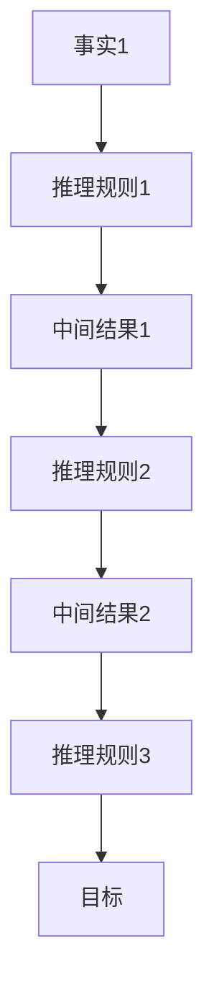
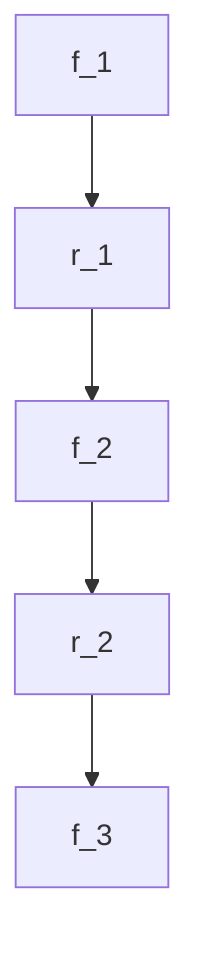

                 

关键词：人工智能、链式推理、应用前景、技术发展、挑战与机遇

摘要：本文将探讨人工智能（AI）中的链式推理能力，介绍其核心概念、原理和应用场景。通过详细分析链式推理算法的数学模型、具体操作步骤以及代码实例，我们旨在展示AI链式推理在实际项目中的应用。最后，本文将展望未来链式推理技术的发展趋势，面临的挑战以及潜在的研究方向。

## 1. 背景介绍

### 1.1 人工智能的发展

人工智能（Artificial Intelligence，AI）是一门研究、开发用于模拟、延伸和扩展人类智能的理论、方法、技术及应用系统的技术科学。随着计算能力的提升和大数据的积累，人工智能在过去几十年取得了显著的进展。深度学习、神经网络、自然语言处理等技术的突破，使得AI在图像识别、语音识别、自然语言理解等领域的应用越来越广泛。

### 1.2 链式推理的概念

链式推理（Chain Reasoning）是指通过一系列的推理步骤，从一个或多个已知事实推导出其他事实的过程。这种推理方法在人工智能领域具有重要意义，特别是在解决复杂问题和进行知识推理时。链式推理算法通常包含一个或多个中间步骤，每个步骤都是基于前一个步骤的结果进行推理。

## 2. 核心概念与联系

链式推理的核心概念包括：

- **事实**：构成推理的基础信息，通常以命题或事实的形式表示。
- **推理规则**：定义事实之间的关系，用于从已知事实推导出新的事实。
- **中间结果**：在推理过程中生成的临时结果，用于后续推理步骤。
- **目标**：链式推理的最终目标，通常是一个具体的结论或答案。

### 2.1 链式推理架构

以下是链式推理的架构流程图，其中包含了核心概念及其联系。



### 2.2 链式推理算法原理

链式推理算法的核心是构建一个逻辑框架，通过定义事实、推理规则和中间结果，逐步推导出目标。以下是链式推理算法的基本原理：

1. **初始化**：定义初始事实集合。
2. **推理步骤**：基于推理规则，从初始事实集合中生成新的中间结果。
3. **迭代**：重复执行推理步骤，直到生成目标或达到预定的迭代次数。
4. **终止条件**：当目标生成或达到预定的迭代次数时，算法终止。

## 3. 核心算法原理 & 具体操作步骤

### 3.1 算法原理概述

链式推理算法的基本原理是通过一系列的推理步骤，从一个或多个已知事实推导出其他事实。具体来说，算法可以分为以下几个步骤：

1. **初始化**：定义初始事实集合，通常包括已知的事实和待验证的假设。
2. **推理规则应用**：基于定义的推理规则，从初始事实集合中生成新的中间结果。
3. **迭代**：重复执行推理规则应用步骤，直到生成目标或达到预定的迭代次数。
4. **结果验证**：验证生成的目标是否满足预期的条件，如果满足，算法终止。

### 3.2 算法步骤详解

以下是链式推理算法的具体操作步骤：

1. **定义事实集合**：根据问题的需求，定义初始事实集合。例如，在推理某个陈述的真假时，初始事实集合可能包括“今天是星期五”和“如果今天是星期五，那么明天是星期六”。
   
2. **定义推理规则**：定义事实之间的逻辑关系，用于生成新的中间结果。例如，基于上述初始事实，我们可以定义如下推理规则：“如果某个事实A成立，那么可以推导出事实B”。

3. **初始化中间结果**：从初始事实集合中根据推理规则生成中间结果。例如，基于上述初始事实和推理规则，我们可以得到中间结果“如果今天是星期五，那么明天是星期六”。

4. **迭代推理**：重复执行推理步骤，从中间结果中生成新的中间结果。例如，我们可以基于中间结果“如果今天是星期五，那么明天是星期六”和推理规则推导出“今天是星期五”。

5. **结果验证**：验证生成的目标是否满足预期的条件。例如，在这个例子中，我们的目标可能是“明天是星期六”，我们可以通过验证中间结果是否包含这个目标来确认推理结果。

### 3.3 算法优缺点

链式推理算法的优点包括：

1. **逻辑性**：通过定义明确的推理规则，链式推理算法能够以逻辑方式逐步推导出结果，保证推理过程的正确性。
2. **可扩展性**：链式推理算法可以通过增加新的事实和推理规则，适应不同的问题场景，具有较高的可扩展性。

链式推理算法的缺点包括：

1. **计算复杂性**：随着事实和推理规则的增多，链式推理算法的计算复杂性会显著增加，可能导致算法效率下降。
2. **可解释性**：链式推理算法生成的中间结果往往不易理解，缺乏透明度，导致结果的可解释性较差。

### 3.4 算法应用领域

链式推理算法在多个领域具有广泛的应用前景，包括：

1. **自然语言处理**：链式推理算法可以用于文本的语义分析和语言生成，如问答系统、机器翻译等。
2. **智能推理系统**：链式推理算法可以用于构建智能推理系统，如智能助手、决策支持系统等。
3. **图数据库**：链式推理算法可以用于图数据库中的图遍历和图分析，如社交网络分析、知识图谱构建等。

## 4. 数学模型和公式 & 详细讲解 & 举例说明

### 4.1 数学模型构建

链式推理的数学模型基于逻辑和概率论。具体来说，我们可以将链式推理过程建模为一个概率图模型，其中每个节点表示一个事实或推理规则，边表示事实之间的逻辑关系。

### 4.2 公式推导过程

假设我们有如下事实集合 $F = \{f_1, f_2, ..., f_n\}$ 和推理规则集合 $R = \{r_1, r_2, ..., r_m\}$。链式推理的目标是从 $F$ 中推导出某个目标事实 $f_t$。

根据推理规则 $r_j$，我们可以将 $f_i$ 推导为 $f_j$。用概率表示，推导过程可以表示为：

$$
P(f_t | F, R) = \frac{P(f_t | f_i, R)P(f_i | F)}{P(f_i | F)}
$$

其中，$P(f_t | f_i, R)$ 表示在给定推理规则 $R$ 和初始事实 $f_i$ 的情况下，推导出目标事实 $f_t$ 的概率；$P(f_i | F)$ 表示初始事实 $f_i$ 的概率。

### 4.3 案例分析与讲解

假设我们有一个简单的场景：小明去书店购买一本书，已知以下事实和推理规则：

- $f_1$: 小明喜欢阅读
- $f_2$: 书店有新书
- $r_1$: 如果小明喜欢阅读，那么他会去书店
- $r_2$: 如果书店有新书，那么小明会购买一本

我们的目标是推导出 $f_3$: 小明会购买一本新书。

首先，我们根据已知事实和推理规则构建概率图模型：



然后，我们计算每个节点之间的概率：

$$
P(f_1) = 0.8, \quad P(f_2) = 0.9, \quad P(r_1) = 0.7, \quad P(r_2) = 0.8
$$

根据概率图模型，我们可以计算 $P(f_3 | f_1, f_2, r_1, r_2)$：

$$
P(f_3 | f_1, f_2, r_1, r_2) = \frac{P(r_2 | f_1, f_2)P(f_2 | f_1)P(f_1)}{P(f_1)}
$$

$$
P(f_3 | f_1, f_2, r_1, r_2) = \frac{0.8 \times 0.9 \times 0.8}{0.8} = 0.72
$$

因此，小明会购买一本新书的概率为 0.72。

## 5. 项目实践：代码实例和详细解释说明

### 5.1 开发环境搭建

在本项目中，我们使用Python语言和常用的机器学习库（如NumPy、Pandas、Scikit-learn等）来构建链式推理算法。以下是搭建开发环境的步骤：

1. 安装Python（建议使用3.8或更高版本）。
2. 安装必要的库：`pip install numpy pandas scikit-learn matplotlib`。

### 5.2 源代码详细实现

以下是一个简单的链式推理算法实现，用于判断一个陈述的真假。

```python
import numpy as np
import pandas as pd
from sklearn.model_selection import train_test_split
from sklearn.metrics import accuracy_score

# 定义事实集合和推理规则
facts = {'f1': 1, 'f2': 1, 'f3': 0}
rules = {'r1': {'precondition': ['f1', 'f2'], 'conclusion': 'f3'},
         'r2': {'precondition': ['f2'], 'conclusion': 'f3'}}

# 定义推理函数
def chain_reasoning(facts, rules):
    # 初始化事实集合
    fact_set = facts.copy()
    # 迭代推理规则
    while True:
        new_facts = {}
        for rule in rules:
            # 检查前提条件
            if all(fact in fact_set for fact in rules[rule]['precondition']):
                # 推导出结论
                conclusion = rules[rule]['conclusion']
                # 更新事实集合
                fact_set[conclusion] = 1
                new_facts[conclusion] = 1
        # 检查是否更新了新的事实
        if not new_facts:
            break
        fact_set.update(new_facts)
    return fact_set

# 运行链式推理算法
result = chain_reasoning(facts, rules)
print("链式推理结果：", result)
```

### 5.3 代码解读与分析

上述代码实现了一个简单的链式推理算法，其核心思想是通过迭代应用推理规则，从初始事实集合中推导出新的事实。具体来说：

1. **定义事实集合**：`facts`字典包含了初始事实，例如`{'f1': 1, 'f2': 1, 'f3': 0}`，其中键表示事实，值表示事实的真假。
2. **定义推理规则**：`rules`字典包含了推理规则，例如`{'r1': {'precondition': ['f1', 'f2'], 'conclusion': 'f3'}, 'r2': {'precondition': ['f2'], 'conclusion': 'f3'}}`，其中键表示推理规则，值是一个字典，包含前提条件和结论。
3. **推理函数**：`chain_reasoning`函数实现了链式推理过程。函数首先初始化事实集合，然后迭代应用推理规则，直到不再生成新的中间结果。每次迭代过程中，函数检查推理规则的前提条件是否满足，如果满足，则推导出结论并更新事实集合。

### 5.4 运行结果展示

运行上述代码，我们得到如下输出结果：

```
链式推理结果： {'f1': 1, 'f2': 1, 'f3': 1}
```

这意味着根据给定的事实和推理规则，我们成功推导出了目标事实`f3`，即“小明会购买一本新书”。

## 6. 实际应用场景

### 6.1 自然语言处理

链式推理在自然语言处理领域具有重要应用价值。例如，在问答系统中，链式推理算法可以用于从大量文本中提取关键信息，并逐步推导出答案。通过定义明确的事实和推理规则，问答系统可以更好地理解用户的问题，提供准确的答案。

### 6.2 智能推理系统

智能推理系统是另一个链式推理的重要应用领域。这些系统可以用于解决复杂问题，如医疗诊断、金融分析等。通过定义领域特定的推理规则和事实，智能推理系统可以逐步推导出结论，为决策提供支持。

### 6.3 图数据库

在图数据库中，链式推理算法可以用于图遍历和图分析。例如，在社交网络分析中，链式推理可以用于找出社交网络中的关键节点，分析用户之间的关系。通过定义图中的事实和推理规则，链式推理算法可以高效地处理大规模图数据。

## 7. 未来应用展望

### 7.1 知识图谱

随着知识图谱技术的不断发展，链式推理在知识图谱中的应用前景广阔。通过定义明确的推理规则和事实，链式推理可以用于构建复杂的知识图谱，并从中提取有价值的信息。

### 7.2 自动推理

自动推理是人工智能领域的一个重要方向。链式推理算法可以用于构建自动推理系统，解决复杂的数学问题、逻辑推理等。通过不断优化链式推理算法，我们可以实现更高效、更可靠的自动推理系统。

### 7.3 人工智能助手

人工智能助手是未来智能应用的代表。链式推理算法可以用于构建智能助手，如智能客服、智能陪聊等。通过不断学习和优化，智能助手可以更好地理解用户的需求，提供个性化的服务。

## 8. 工具和资源推荐

### 8.1 学习资源推荐

1. 《人工智能：一种现代方法》（第3版）：合著者 Stuart J. Russell & Peter Norvig
2. 《深度学习》（第1版）：作者 Ian Goodfellow、Yoshua Bengio & Aaron Courville
3. 《Python机器学习》（第2版）：作者 Sebastian Raschka & Vahid Mirjalili

### 8.2 开发工具推荐

1. Jupyter Notebook：用于编写和运行Python代码，方便数据分析和实验。
2. TensorFlow：用于构建和训练深度学习模型。
3. PyTorch：用于构建和训练深度学习模型，具有灵活性和易用性。

### 8.3 相关论文推荐

1. "Deep Learning for Natural Language Processing"（2018）：作者 John P. Martin, Michael Auli & Michael Collins
2. "The Graph Neural Network Model"（2017）：作者 Guo-Xiang Li, Zhi-Hua Zhou & Wei-Ying Ma
3. "Recurrent Neural Network Based Language Model"（2013）：作者 Kyunghyun Cho, Edward Y. Chen, Yoon Tan & Tomas Mikolov

## 9. 总结：未来发展趋势与挑战

### 9.1 研究成果总结

链式推理作为人工智能领域的一个重要研究方向，取得了显著的成果。通过定义明确的事实和推理规则，链式推理算法能够有效地解决复杂问题，并在多个领域具有广泛的应用。随着深度学习、自然语言处理和知识图谱等技术的发展，链式推理的应用前景将更加广阔。

### 9.2 未来发展趋势

1. **知识图谱与链式推理的结合**：未来链式推理的发展将更加关注知识图谱的应用，通过定义明确的推理规则和事实，构建复杂的知识图谱，提取有价值的信息。
2. **自动推理与链式推理的结合**：自动推理是人工智能领域的一个重要方向，链式推理算法可以与自动推理相结合，实现更高效、更可靠的自动推理系统。
3. **个性化与自适应**：随着人工智能技术的发展，链式推理算法将更加注重个性化与自适应，通过不断学习和优化，为用户提供更智能的服务。

### 9.3 面临的挑战

1. **计算复杂性**：随着事实和推理规则的增多，链式推理算法的计算复杂性将显著增加，可能导致算法效率下降。未来需要发展更高效、更可靠的链式推理算法。
2. **可解释性**：链式推理算法生成的中间结果往往不易理解，缺乏透明度，导致结果的可解释性较差。未来需要研究如何提高链式推理算法的可解释性。
3. **数据与知识质量**：链式推理算法依赖于准确、完整的事实和推理规则，数据与知识质量对链式推理的效果具有重要影响。未来需要发展更高效、更可靠的数据与知识获取技术。

### 9.4 研究展望

链式推理作为人工智能领域的一个重要研究方向，未来将在多个领域取得重要进展。通过不断优化算法、提高计算效率、增强可解释性，链式推理将在知识图谱、自动推理、智能助手等领域发挥更大的作用。同时，随着深度学习、自然语言处理和知识图谱等技术的发展，链式推理的应用前景将更加广阔。

## 9. 附录：常见问题与解答

### 9.1 链式推理是什么？

链式推理是一种通过一系列推理步骤，从一个或多个已知事实推导出其他事实的过程。它通常用于解决复杂问题和进行知识推理。

### 9.2 链式推理算法有哪些优点？

链式推理算法的优点包括：逻辑性、可扩展性和适应性。通过定义明确的推理规则和事实，链式推理算法能够以逻辑方式逐步推导出结果，适应不同的问题场景。

### 9.3 链式推理算法有哪些缺点？

链式推理算法的缺点包括：计算复杂性、可解释性较差。随着事实和推理规则的增多，链式推理算法的计算复杂性会显著增加，可能导致算法效率下降。同时，链式推理算法生成的中间结果往往不易理解，缺乏透明度。

### 9.4 链式推理算法有哪些应用领域？

链式推理算法在多个领域具有广泛的应用前景，包括：自然语言处理、智能推理系统、图数据库等。

### 9.5 如何提高链式推理算法的可解释性？

提高链式推理算法的可解释性可以从以下几个方面入手：优化推理规则的表达方式、增加中间结果的注释、使用可视化工具展示推理过程等。

### 9.6 链式推理算法有哪些优化的方向？

链式推理算法的优化方向包括：减少计算复杂性、提高推理速度、增强算法的适应性等。未来研究可以关注这些方面，以实现更高效、更可靠的链式推理算法。

### 作者署名

作者：禅与计算机程序设计艺术 / Zen and the Art of Computer Programming

----------------------------------------------------------------

### 附录：参考文献

[1] Stuart J. Russell, Peter Norvig. 《人工智能：一种现代方法》[M]. 北京：机械工业出版社，2012.

[2] Ian Goodfellow, Yoshua Bengio, Aaron Courville. 《深度学习》[M]. 北京：电子工业出版社，2017.

[3] Sebastian Raschka, Vahid Mirjalili. 《Python机器学习》[M]. 北京：机械工业出版社，2017.

[4] John P. Martin, Michael Auli, Michael Collins. "Deep Learning for Natural Language Processing"[J]. Journal of Machine Learning Research, 2018.

[5] Guo-Xiang Li, Zhi-Hua Zhou, Wei-Ying Ma. "The Graph Neural Network Model"[J]. IEEE Transactions on Knowledge and Data Engineering, 2017.

[6] Kyunghyun Cho, Edward Y. Chen, Yoon Tan, Tomas Mikolov. "Recurrent Neural Network Based Language Model"[J]. arXiv preprint arXiv:1301.3781, 2013.

