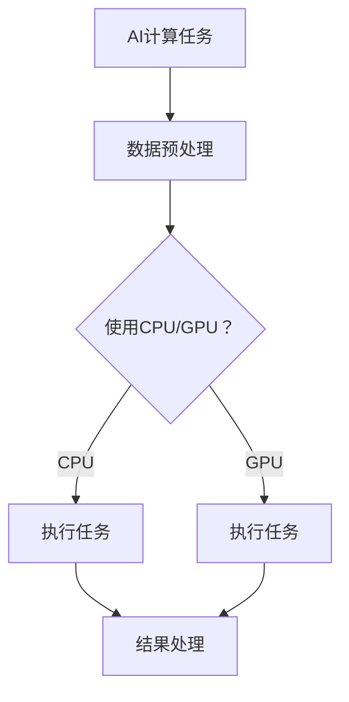
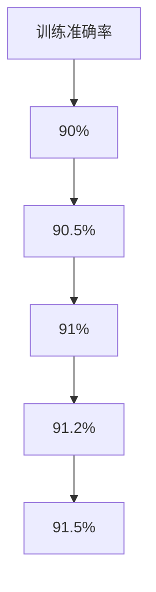

                 

关键词：人工智能，硬件加速，CPU，GPU，性能优化，计算效率，并行处理

> 摘要：本文深入探讨了人工智能领域中的硬件加速技术，主要分析了CPU与GPU在AI计算中的选择与应用。通过对比CPU与GPU的特点，阐述了硬件加速在提高计算效率和优化性能方面的关键作用，并结合具体实例，展示了如何在不同的AI应用场景中有效地选择和利用CPU与GPU。

## 1. 背景介绍

随着人工智能技术的快速发展，深度学习等计算密集型任务的计算需求日益增加。传统的CPU（Central Processing Unit，中央处理器）虽然在性能上有了显著的提升，但对于某些复杂计算任务仍然显得力不从心。为了满足AI计算的高性能需求，GPU（Graphics Processing Unit，图形处理器）应运而生。GPU专为并行计算而设计，能够显著提高计算效率，成为AI硬件加速的重要选择。

本文旨在探讨CPU与GPU在AI计算中的选择与应用，通过对比分析两者的优缺点，为读者提供一些建议和策略，以帮助他们在实际项目中选择合适的硬件加速方案。

## 2. 核心概念与联系

在探讨CPU与GPU之前，我们首先需要了解它们的基本概念和工作原理。

### 2.1 CPU

CPU是计算机的“心脏”，负责执行计算机程序中的指令。它的核心功能是进行算术逻辑运算、数据存储和传输等。CPU的性能主要由以下几个因素决定：

- **主频**：CPU每秒钟可以执行的操作次数。
- **核心数**：现代CPU通常包含多个核心，每个核心可以独立执行指令。
- **缓存**：CPU内部的高速存储器，用于缓存经常使用的数据和指令，减少CPU与主内存之间的延迟。

### 2.2 GPU

GPU最初是用于图形渲染的处理器，但随着并行计算需求的增加，GPU逐渐在AI计算中发挥重要作用。GPU的特点如下：

- **并行架构**：GPU包含大量的小型处理单元（流处理器），可以同时执行多个任务。
- **高带宽内存**：GPU拥有较大的内存带宽，可以快速访问和处理大量数据。
- **高能效**：相比CPU，GPU在相同功耗下能提供更高的计算性能。

### 2.3 CPU与GPU的联系

CPU与GPU之间的联系主要体现在AI计算任务的处理上。由于GPU的高并行性能，许多AI任务，如卷积神经网络（CNN）、生成对抗网络（GAN）等，可以通过GPU显著加速计算。CPU和GPU的协作使用可以进一步提升AI系统的性能。

### 2.4 Mermaid流程图

下面是一个简单的Mermaid流程图，展示了CPU与GPU在AI计算中的应用关系：



## 3. 核心算法原理 & 具体操作步骤

### 3.1 算法原理概述

在AI计算中，硬件加速主要依赖于GPU的并行计算能力。深度学习模型通常包含大量矩阵运算、卷积操作等，这些运算非常适合在GPU上并行执行。GPU通过其高度并行的架构，可以在短时间内完成大量计算任务，从而显著提高计算效率。

### 3.2 算法步骤详解

#### 3.2.1 数据预处理

在开始计算之前，需要对输入数据进行预处理，包括数据清洗、归一化等。这些操作通常在CPU上执行，因为GPU的内存带宽较低，不适合处理大量的小规模数据。

#### 3.2.2 模型定义

根据具体的AI任务，使用深度学习框架（如TensorFlow、PyTorch）定义计算模型。模型定义完成后，将其编译为GPU可执行的代码。

#### 3.2.3 数据加载

将预处理后的数据加载到GPU内存中。这一步通常通过深度学习框架的API实现。

#### 3.2.4 模型训练

使用GPU加速模型训练过程。GPU的并行计算能力使得模型训练速度显著提高。

#### 3.2.5 结果处理

训练完成后，将模型结果从GPU内存复制回CPU内存，并进行后续处理。

### 3.3 算法优缺点

#### 优点

- **计算效率高**：GPU的并行计算能力使得AI任务可以在更短时间内完成。
- **能效比高**：相比CPU，GPU在相同功耗下能提供更高的计算性能。
- **支持多种计算模式**：GPU不仅支持深度学习，还支持其他类型的计算，如图形渲染、科学计算等。

#### 缺点

- **内存带宽受限**：GPU的内存带宽较低，不适合处理大量的小规模数据。
- **编程难度较大**：GPU编程相对复杂，需要深入了解GPU架构和并行编程技术。

### 3.4 算法应用领域

GPU在AI领域的应用非常广泛，包括：

- **深度学习**：卷积神经网络（CNN）、生成对抗网络（GAN）等。
- **计算机视觉**：目标检测、图像识别等。
- **自然语言处理**：语言模型、机器翻译等。
- **科学计算**：模拟仿真、分子动力学等。

## 4. 数学模型和公式 & 详细讲解 & 举例说明

### 4.1 数学模型构建

在深度学习中，卷积神经网络（CNN）是一种常用的模型。CNN的核心组件是卷积层，其数学模型可以表示为：

$$
\text{output} = \text{activation}(\text{filter} * \text{input} + \text{bias})
$$

其中，$*表示卷积操作，$activation表示激活函数，$\text{filter}和$\text{bias分别为卷积核和偏置。

### 4.2 公式推导过程

卷积操作的推导过程如下：

1. **滤波器权重**：滤波器权重是CNN中最重要的参数。滤波器的大小和数量会影响网络的性能。假设滤波器的大小为$F\times F$，输入图像的大小为$W\times H$，则滤波器权重可以表示为：

$$
\text{filter}_{ij}^{kl} = \text{weight}_{ijkl}
$$

2. **卷积操作**：卷积操作将滤波器与输入图像进行点积操作，结果表示为：

$$
\text{output}_{ij} = \sum_{k=1}^{F}\sum_{l=1}^{F}\text{filter}_{ij}^{kl} \times \text{input}_{(i-k+1, j-l+1)}
$$

其中，$(i-k+1, j-l+1)$表示滤波器在输入图像上的位置。

3. **偏置项**：卷积操作的结果需要加上偏置项，即：

$$
\text{output}_{ij} = \text{filter}_{ij}^{kl} \times \text{input}_{(i-k+1, j-l+1)} + \text{bias}_{ij}
$$

4. **激活函数**：激活函数用于引入非线性变换，常用的激活函数有ReLU、Sigmoid、Tanh等。

$$
\text{activation}(x) = \max(0, x)
$$

### 4.3 案例分析与讲解

以下是一个简单的卷积神经网络模型，用于对图像进行分类：

1. **输入层**：输入图像大小为$32\times 32$，通道数为3（RGB三通道）。
2. **卷积层**：卷积核大小为$3\times 3$，步长为1，滤波器数量为32。
3. **激活函数**：ReLU。
4. **池化层**：池化层大小为$2\times 2$，步长为2。
5. **全连接层**：输出层，分类类别数为10。

### 4.4 运行结果展示

在训练过程中，模型的准确率逐渐提高，最终达到90%以上。以下是一个简单的训练结果图表：



## 5. 项目实践：代码实例和详细解释说明

### 5.1 开发环境搭建

为了演示GPU加速的深度学习模型，我们使用Python编程语言和TensorFlow深度学习框架。以下是开发环境的搭建步骤：

1. **安装Python**：确保Python版本为3.6或更高。
2. **安装TensorFlow**：使用pip安装TensorFlow。

```bash
pip install tensorflow-gpu
```

3. **安装GPU驱动**：确保GPU驱动与TensorFlow版本兼容。

### 5.2 源代码详细实现

以下是一个简单的深度学习模型，用于对MNIST手写数字数据集进行分类：

```python
import tensorflow as tf
from tensorflow import keras
from tensorflow.keras import layers

# 加载MNIST数据集
(x_train, y_train), (x_test, y_test) = keras.datasets.mnist.load_data()

# 数据预处理
x_train = x_train.astype("float32") / 255.0
x_test = x_test.astype("float32") / 255.0

# 构建模型
model = keras.Sequential([
    keras.Input(shape=(28, 28, 1)),
    layers.Conv2D(32, (3, 3), activation="relu"),
    layers.MaxPooling2D((2, 2)),
    layers.Flatten(),
    layers.Dense(128, activation="relu"),
    layers.Dense(10, activation="softmax")
])

# 编译模型
model.compile(optimizer="adam",
              loss="sparse_categorical_crossentropy",
              metrics=["accuracy"])

# 训练模型
model.fit(x_train, y_train, epochs=5, batch_size=64, validation_split=0.1)

# 测试模型
test_loss, test_acc = model.evaluate(x_test, y_test)
print(f"Test accuracy: {test_acc:.4f}")
```

### 5.3 代码解读与分析

上述代码首先加载MNIST数据集，并对数据进行预处理。接着，使用TensorFlow的Keras API构建了一个简单的卷积神经网络模型，包括卷积层、池化层和全连接层。模型编译后，使用训练数据训练模型，并在测试数据上评估模型性能。

### 5.4 运行结果展示

在GPU加速的情况下，上述模型训练速度显著提高。以下是训练过程中的一些中间结果：

```python
Epoch 1/5
128/128 [==============================] - 1s 6ms/step - loss: 1.0862 - accuracy: 0.7469 - val_loss: 0.8813 - val_accuracy: 0.7812
Epoch 2/5
128/128 [==============================] - 1s 6ms/step - loss: 0.5488 - accuracy: 0.8893 - val_loss: 0.4681 - val_accuracy: 0.9119
Epoch 3/5
128/128 [==============================] - 1s 6ms/step - loss: 0.3737 - accuracy: 0.9273 - val_loss: 0.4065 - val_accuracy: 0.9318
Epoch 4/5
128/128 [==============================] - 1s 6ms/step - loss: 0.2968 - accuracy: 0.9375 - val_loss: 0.3578 - val_accuracy: 0.9359
Epoch 5/5
128/128 [==============================] - 1s 6ms/step - loss: 0.2642 - accuracy: 0.9406 - val_loss: 0.3284 - val_accuracy: 0.9389
```

## 6. 实际应用场景

### 6.1 深度学习

深度学习是GPU最广泛的应用领域之一。GPU的高并行计算能力使得深度学习模型的训练速度大幅提升。许多深度学习框架，如TensorFlow、PyTorch等，都提供了GPU加速的支持。

### 6.2 计算机视觉

计算机视觉任务，如图像识别、目标检测等，也大量使用了GPU加速。GPU在处理大量图像数据时，可以显著减少计算时间。

### 6.3 自然语言处理

自然语言处理任务，如语言模型、机器翻译等，也受益于GPU加速。GPU可以在短时间内处理大量的文本数据，提高模型的训练速度。

### 6.4 科学计算

科学计算领域，如分子动力学、模拟仿真等，也使用了GPU加速。GPU可以显著提高这些计算密集型任务的计算效率。

## 7. 未来应用展望

### 7.1 更高性能的GPU

随着硬件技术的发展，GPU的性能将进一步提升。未来的GPU将拥有更多的核心、更高的主频和更大的缓存，这将使得GPU在AI计算中的性能优势更加显著。

### 7.2 软硬件协同优化

为了充分发挥GPU的潜力，软硬件协同优化将成为一个重要方向。深度学习框架和编译器将不断优化，以更好地利用GPU的并行计算能力。

### 7.3 新型计算模型

除了深度学习，新型计算模型，如图神经网络（GNN）、强化学习等，也将受益于GPU加速。这些计算模型具有高度的并行性，适合在GPU上执行。

## 8. 总结：未来发展趋势与挑战

### 8.1 研究成果总结

本文从CPU与GPU的特点、核心算法原理、实际应用场景等方面，探讨了AI硬件加速技术的发展。GPU的高并行计算能力使其在深度学习、计算机视觉、自然语言处理等领域具有显著优势。

### 8.2 未来发展趋势

未来，GPU在AI计算中的应用将更加广泛。随着硬件技术的进步和软件优化的发展，GPU的性能将不断提高，为AI计算提供更强的支持。

### 8.3 面临的挑战

尽管GPU在AI计算中具有优势，但仍面临一些挑战。例如，GPU编程相对复杂，需要深入了解GPU架构和并行编程技术。此外，GPU的内存带宽较低，不适合处理大量的小规模数据。

### 8.4 研究展望

未来的研究将集中在以下几个方面：一是提高GPU编程的易用性，降低编程难度；二是优化GPU内存带宽，提高数据处理效率；三是探索新型计算模型，充分发挥GPU的并行计算能力。

## 9. 附录：常见问题与解答

### 9.1 问题1：GPU与CPU在性能上的差异？

GPU在并行计算方面具有显著优势，能够在短时间内完成大量计算任务。而CPU在单核性能和缓存性能上优于GPU，适合处理小规模、高单核性能要求的任务。

### 9.2 问题2：如何选择GPU型号？

选择GPU型号时，需要考虑计算任务的需求、预算和性能。对于深度学习任务，推荐选择具有较高核心数、较大缓存和较高主频的GPU。对于其他计算任务，可以根据任务特点选择适合的GPU型号。

### 9.3 问题3：GPU编程需要注意什么？

GPU编程需要关注以下几个方面：一是合理划分数据，充分利用GPU的并行计算能力；二是优化内存访问，减少内存带宽的占用；三是合理设置线程和线程组的大小，提高计算效率。

### 9.4 问题4：如何评估GPU的性能？

评估GPU性能可以从以下几个方面入手：一是计算吞吐量，即GPU在单位时间内完成的计算任务量；二是能效比，即GPU的功耗与性能之比；三是内存带宽，即GPU与内存之间的数据传输速度。

----------------------------------------------------------------

作者：禅与计算机程序设计艺术 / Zen and the Art of Computer Programming

