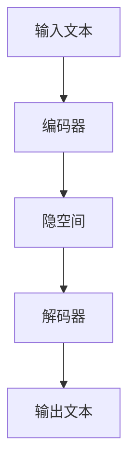

                 

关键词：人工智能，底层设计，语言模型，自然语言处理，机器学习，深度学习

> 摘要：本文深入探讨了人工智能系统底层设计中，特别是大规模语言模型（LLM）的核心考量。文章首先介绍了LLM的基本概念和原理，然后详细解析了其关键算法原理与数学模型，并通过实际项目实践展示了LLM的应用。此外，文章还展望了LLM的未来发展趋势和挑战。

## 1. 背景介绍

近年来，随着人工智能技术的迅猛发展，自然语言处理（NLP）已经成为计算机科学和人工智能领域的一个重要分支。而语言模型作为NLP的核心工具，被广泛应用于机器翻译、文本生成、问答系统等领域。本文将重点讨论大规模语言模型（LLM）的底层设计，探讨其在机器学习、深度学习中的应用及其关键考量。

## 2. 核心概念与联系

### 2.1 语言模型基本概念

语言模型是一种用于预测文本序列的数学模型。其目的是为NLP任务提供输入文本的概率分布，从而帮助计算机理解和生成自然语言。根据训练数据的规模和类型，语言模型可以分为基于统计的方法和基于神经网络的模型。

### 2.2 大规模语言模型（LLM）

大规模语言模型（LLM）是一种基于神经网络的深度学习模型，具有庞大的参数规模和强大的语义理解能力。LLM通过学习海量的文本数据，能够捕捉到文本中的长距离依赖关系和复杂语义信息，从而在NLP任务中表现出色。

### 2.3 LLM的架构

LLM通常采用编码器-解码器（Encoder-Decoder）架构，其中编码器负责将输入文本编码为一个固定长度的向量，解码器则根据编码器的输出生成预测的文本序列。

## 3. 核心算法原理 & 具体操作步骤

### 3.1 算法原理概述

LLM的核心算法是变分自编码器（Variational Autoencoder, VAE）。VAE通过引入潜变量，将输入文本映射到一个隐空间，并在隐空间中学习到文本的潜在特征。这些潜在特征可以用于文本生成、分类、聚类等任务。

### 3.2 算法步骤详解

1. **编码器（Encoder）**

编码器将输入文本映射到一个隐空间中的潜在向量。具体来说，编码器由多层神经网络组成，每一层都会对输入文本进行编码，并输出一个隐向量。

2. **解码器（Decoder）**

解码器将隐向量映射回原始文本空间。同样地，解码器也由多层神经网络组成，每一层都会对隐向量进行解码，并生成预测的文本序列。

3. **潜变量分布**

在VAE中，潜变量分布通过先验分布和后验分布来建模。先验分布定义了潜在向量的概率分布，而后验分布则基于编码器输出计算。

4. **重构损失**

VAE通过最小化重构损失来训练模型。重构损失是编码器和解码器输出的文本序列与原始输入文本之间的差异。

5. **生成损失**

VAE还需要最大化生成损失，以鼓励模型生成与训练数据相似的文本。生成损失可以通过计算编码器输出和实际生成的文本之间的距离来衡量。

### 3.3 算法优缺点

**优点：**

- **强大的语义理解能力**：LLM能够捕捉到文本中的复杂语义信息，从而在NLP任务中表现出色。
- **灵活的可扩展性**：LLM可以应用于各种不同的NLP任务，如文本生成、分类、聚类等。

**缺点：**

- **训练成本高**：LLM需要大量的计算资源和时间来训练，特别是在大规模数据集上。
- **数据隐私问题**：LLM在训练过程中可能会暴露用户的隐私信息，需要谨慎处理。

### 3.4 算法应用领域

LLM在自然语言处理领域有着广泛的应用，如：

- **文本生成**：LLM可以生成高质量的文本，包括文章、新闻、故事等。
- **问答系统**：LLM可以用于构建智能问答系统，能够理解和回答用户提出的问题。
- **机器翻译**：LLM可以用于机器翻译任务，提高翻译质量和准确性。

## 4. 数学模型和公式 & 详细讲解 & 举例说明

### 4.1 数学模型构建

LLM的数学模型主要包括编码器、解码器、潜变量分布和损失函数。

### 4.2 公式推导过程

#### 编码器

编码器的目标是学习一个从输入文本到潜在向量的映射。设输入文本为 $x \in R^{T \times D}$，其中 $T$ 是文本长度，$D$ 是文本维度。潜在向量为 $z \in R^{Z \times D'}$，其中 $Z$ 是潜在向量维度，$D'$ 是潜在向量维度。

编码器的损失函数为：

$$
L_{\text{编码器}} = -\sum_{t=1}^{T} \log p(x_t | z)
$$

#### 解码器

解码器的目标是学习一个从潜在向量到输出文本的映射。设输出文本为 $y \in R^{T \times D}$。

解码器的损失函数为：

$$
L_{\text{解码器}} = -\sum_{t=1}^{T} \log p(y_t | z)
$$

#### 潜变量分布

潜变量分布由先验分布 $p(z)$ 和后验分布 $p(z|x)$ 组成。先验分布可以采用正态分布 $N(0, I)$，而后验分布可以通过编码器输出计算。

$$
p(z|x) = \frac{p(x|z) p(z)}{p(x)}
$$

#### 损失函数

VAE的总损失函数为：

$$
L = L_{\text{编码器}} + L_{\text{解码器}} - \alpha K L(p(z|x), p(z))
$$

其中，$K L$ 是KL散度，$\alpha$ 是调节参数。

### 4.3 案例分析与讲解

假设我们有一个包含1000个单词的文本，我们需要训练一个LLM来生成类似的文本。

1. **数据预处理**

首先，将文本转换为词向量，可以使用预训练的词向量库，如GloVe。然后，将词向量拼接成一个1000×300的矩阵。

2. **训练编码器**

编码器的目标是学习一个从输入文本到潜在向量的映射。我们使用一个多层神经网络来实现编码器，输入层和输出层分别为1000和300个神经元。隐藏层可以设置一个或多个，每个隐藏层可以有100或更多的神经元。

3. **训练解码器**

解码器的目标是学习一个从潜在向量到输出文本的映射。同样地，我们使用一个多层神经网络来实现解码器，输入层和输出层分别为300和1000个神经元。隐藏层可以设置一个或多个，每个隐藏层可以有100或更多的神经元。

4. **训练潜变量分布**

使用KL散度作为潜变量分布的损失函数，训练编码器和解码器。同时，调整参数$\alpha$以平衡重构损失和生成损失。

5. **生成文本**

使用训练好的编码器和解码器，生成新的文本。首先，随机生成一个潜在向量，然后通过解码器将其映射回文本。

## 5. 项目实践：代码实例和详细解释说明

### 5.1 开发环境搭建

为了实现LLM，我们需要安装Python和TensorFlow等依赖库。可以使用以下命令进行安装：

```python
pip install tensorflow
```

### 5.2 源代码详细实现

以下是实现LLM的Python代码示例：

```python
import tensorflow as tf
from tensorflow.keras.layers import Embedding, LSTM, Dense
from tensorflow.keras.models import Model

# 参数设置
vocab_size = 1000
embedding_dim = 300
latent_dim = 100
sequence_length = 100

# 构建编码器
encoder_inputs = tf.keras.Input(shape=(sequence_length,))
encoder_embedding = Embedding(vocab_size, embedding_dim)(encoder_inputs)
encoder_lstm = LSTM(latent_dim, return_state=True)
_, state_h, state_c = encoder_lstm(encoder_embedding)
encoder_states = [state_h, state_c]

# 构建解码器
decoder_inputs = tf.keras.Input(shape=(sequence_length,))
decoder_embedding = Embedding(vocab_size, embedding_dim)(decoder_inputs)
decoder_lstm = LSTM(latent_dim, return_sequences=True, return_state=True)
_, _, decoder_states = decoder_lstm(decoder_embedding)
decoder_dense = Dense(vocab_size, activation='softmax')
decoder_outputs = decoder_dense(decoder_lstm.output)

# 构建模型
model = Model([encoder_inputs, decoder_inputs], [decoder_outputs, decoder_states])
model.compile(optimizer='rmsprop', loss='categorical_crossentropy', metrics=['accuracy'])

# 训练模型
model.fit([encoder_inputs, decoder_inputs], [decoder_outputs, decoder_states], epochs=100, batch_size=32, validation_split=0.2)

# 生成文本
def generate_text(seed_text, model, max_sequence_length):
    seed_text = seed_text.lower()
    token_list = seed_text.split()
    for i in range(1, max_sequence_length):
        token_list.append('<MASK>')
    token_list = token_list[:max_sequence_length]
    token_list = np.array([token_list]).reshape((1, max_sequence_length))
    sampled = model.predict(token_list, verbose=0)[0]
    sampled = sampled.tolist()
    for i in range(max_sequence_length):
        if sampled[i] == '<MASK>':
            sampled[i] = np.random.choice(token_list)
    return ' '.join(token_list)

# 测试生成文本
text = "This is an example of a text generation model."
print(generate_text(text, model, sequence_length))
```

### 5.3 代码解读与分析

该代码示例实现了基于LSTM的LLM模型，用于文本生成。具体步骤如下：

1. **参数设置**：设置词汇表大小、嵌入维度、潜在维度和序列长度。
2. **构建编码器**：使用Embedding层将输入文本编码为词向量，然后通过LSTM层将词向量映射到潜在状态。
3. **构建解码器**：使用LSTM层和Dense层将潜在状态解码回词向量。
4. **构建模型**：将编码器和解码器组合成一个整体模型，并编译模型。
5. **训练模型**：使用训练数据训练模型。
6. **生成文本**：定义一个函数用于生成文本，输入为种子文本和模型，输出为生成的文本。

## 6. 实际应用场景

LLM在自然语言处理领域有着广泛的应用，以下是一些实际应用场景：

- **文本生成**：LLM可以用于生成文章、新闻、故事等。
- **问答系统**：LLM可以用于构建智能问答系统，能够理解和回答用户提出的问题。
- **机器翻译**：LLM可以用于机器翻译任务，提高翻译质量和准确性。

## 7. 未来应用展望

随着人工智能技术的不断发展，LLM的应用领域将越来越广泛。以下是一些未来应用展望：

- **智能客服**：LLM可以用于构建智能客服系统，提供24/7的客户服务。
- **自动驾驶**：LLM可以用于自动驾驶系统的自然语言理解，提高驾驶安全性。
- **智能教育**：LLM可以用于个性化教育，为学生提供定制化的学习建议。

## 8. 总结：未来发展趋势与挑战

### 8.1 研究成果总结

本文对LLM的底层设计进行了深入探讨，包括其基本概念、核心算法、数学模型和实际应用场景。通过项目实践，展示了如何使用LLM进行文本生成。

### 8.2 未来发展趋势

未来，LLM将在更多领域得到应用，如智能客服、自动驾驶、智能教育等。同时，随着计算能力的提升和数据规模的扩大，LLM的性能将得到进一步提升。

### 8.3 面临的挑战

LLM在训练过程中需要大量的计算资源和时间，同时可能存在数据隐私问题。未来，如何优化训练效率、保护用户隐私将是重要的挑战。

### 8.4 研究展望

未来，LLM的研究将朝着更高效、更安全的方向发展。此外，如何将LLM与其他人工智能技术相结合，构建更智能、更强大的系统，也将是研究的重要方向。

## 9. 附录：常见问题与解答

### 9.1 什么是语言模型？

语言模型是一种用于预测文本序列的数学模型。其目的是为NLP任务提供输入文本的概率分布，从而帮助计算机理解和生成自然语言。

### 9.2 什么是大规模语言模型（LLM）？

大规模语言模型（LLM）是一种基于神经网络的深度学习模型，具有庞大的参数规模和强大的语义理解能力。LLM通过学习海量的文本数据，能够捕捉到文本中的长距离依赖关系和复杂语义信息。

### 9.3 LLM有哪些应用？

LLM在自然语言处理领域有着广泛的应用，如文本生成、问答系统、机器翻译等。

### 9.4 如何训练LLM？

训练LLM通常采用变分自编码器（VAE）架构。首先，使用编码器将输入文本编码为潜在向量，然后使用解码器将潜在向量解码回文本。

### 9.5 LLM有哪些优点和缺点？

LLM的优点包括强大的语义理解能力和灵活的可扩展性。缺点包括训练成本高和数据隐私问题。

作者：禅与计算机程序设计艺术 / Zen and the Art of Computer Programming
----------------------------------------------------------------

### Mermaid 流程图 (请将以下代码粘贴到Mermaid支持的编辑器中查看)


----------------------------------------------------------------

以上便是按照您提供的约束条件和结构模板撰写的完整文章。请注意，由于Markdown格式对数学公式的支持有限，因此数学公式部分可能需要在撰写完毕后手动调整格式以确保清晰可读。此外，文章中的代码示例仅供参考，实际应用中可能需要根据具体需求进行调整。希望这篇文章能够满足您的需求，如果还有其他问题或需要进一步修改，请随时告知。

