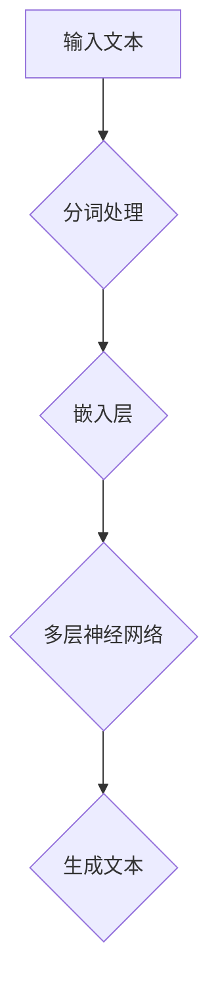
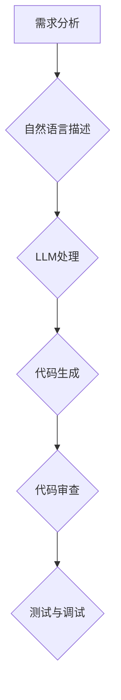

                 

关键词：AI编程，语言模型，编码方式，LLM，编程范式，自动化，人工智能应用

> 摘要：随着人工智能技术的快速发展，语言模型（LLM）在编程领域中的应用越来越广泛。本文将探讨LLM时代的编程新思路，分析其带来的变革，并提出一种基于LLM的编码方式。通过深入剖析LLM的原理及其在编程中的应用，本文旨在为开发者提供一种全新的编程视角，助力他们在LLM时代实现更高效、更智能的编程实践。

## 1. 背景介绍

### 1.1 人工智能与编程的交汇

人工智能（AI）作为计算机科学的前沿领域，近年来取得了飞速发展。从最初的规则系统、专家系统，到基于统计学习的机器学习，再到如今基于深度学习的语言模型（LLM），人工智能技术不断推动着计算机科学的发展。在编程领域，人工智能的应用也越来越广泛，从代码自动生成、代码审查、到智能调试，AI正在逐步改变传统的编程方式。

### 1.2  语言模型（LLM）的崛起

语言模型（LLM）是一种基于深度学习技术的人工智能模型，能够理解和生成自然语言。随着深度学习技术的进步，LLM在自然语言处理（NLP）领域取得了显著的成果。例如，GPT-3、BERT等大型语言模型在文本生成、文本分类、机器翻译等方面表现出色。LLM的出现，为编程领域带来了新的机遇和挑战。

### 1.3  编程方式的变革

传统的编程方式依赖于开发者对编程语言的熟练掌握和编程技能的积累。然而，随着人工智能技术的进步，编程方式正在发生变革。基于LLM的编程方式，将编程过程转化为自然语言交互，降低了编程的门槛，提高了编程效率。本文将探讨这种新的编程方式，分析其在编程实践中的应用和优势。

## 2. 核心概念与联系

### 2.1  语言模型（LLM）原理

语言模型（LLM）是一种基于神经网络的语言生成模型，其核心思想是通过学习大量语言数据，预测下一个词或词组。LLM通过多层神经网络结构，对输入的文本进行建模，从而生成与输入相似的文本。



### 2.2  编码过程与LLM的联系

传统的编码过程通常包括需求分析、设计、编码、测试等环节。而基于LLM的编码方式，将编码过程转化为自然语言交互，通过LLM生成代码，从而实现自动化编码。具体流程如下：



### 2.3  编码方式的变革

基于LLM的编码方式，不仅降低了编程的门槛，提高了编程效率，还使得编程过程更加灵活和智能化。与传统编码方式相比，基于LLM的编码方式具有以下优势：

- **自动化：** LLM能够自动生成代码，减少手动编码的工作量。
- **智能化：** LLM可以根据需求自动调整代码结构，优化代码质量。
- **灵活性：** LLM支持自然语言交互，开发者可以通过自然语言描述需求，实现自定义编程。

## 3. 核心算法原理 & 具体操作步骤

### 3.1  算法原理概述

基于LLM的编码方式，核心算法是基于预训练的语言模型（如GPT-3、BERT等）。这些模型通过大量语言数据的学习，具备了强大的语言理解能力和生成能力。具体操作步骤如下：

1. **需求分析：** 开发者通过自然语言描述需求。
2. **模型处理：** 将需求文本输入到LLM中，模型对文本进行分析和处理。
3. **代码生成：** LLM根据处理结果生成对应的代码。
4. **代码审查：** 对生成的代码进行审查，确保代码质量。
5. **测试与调试：** 对代码进行测试和调试，确保其正常运行。

### 3.2  算法步骤详解

#### 步骤一：需求分析

开发者通过自然语言描述需求，例如：“编写一个简单的函数，实现两个数字的相加”。这一步骤的关键是确保需求描述的清晰和准确。

#### 步骤二：模型处理

将需求文本输入到LLM中，模型对文本进行分析和处理。这一步骤主要包括：

- **分词处理：** 将需求文本分解为单词或短语。
- **嵌入层：** 将分词结果转换为数值表示。
- **多层神经网络：** 对嵌入层的结果进行多层神经网络的计算，以生成代码。

#### 步骤三：代码生成

LLM根据处理结果生成对应的代码。这一步骤的核心是模型对需求文本的理解和生成能力。生成的代码通常包括：

- **函数定义：** 根据需求文本生成相应的函数。
- **参数传递：** 根据需求文本生成函数的参数。
- **逻辑处理：** 根据需求文本生成函数的逻辑处理部分。

#### 步骤四：代码审查

对生成的代码进行审查，确保代码质量。这一步骤主要包括：

- **语法检查：** 检查代码的语法错误。
- **逻辑检查：** 检查代码的逻辑是否正确。
- **性能检查：** 检查代码的性能是否满足要求。

#### 步骤五：测试与调试

对代码进行测试和调试，确保其正常运行。这一步骤主要包括：

- **单元测试：** 对代码的每个函数进行单元测试。
- **集成测试：** 对代码的各个部分进行集成测试。
- **性能测试：** 对代码的性能进行测试。

### 3.3  算法优缺点

#### 优点：

- **高效性：** 基于LLM的编码方式能够快速生成代码，提高编程效率。
- **灵活性：** 开发者可以通过自然语言描述需求，实现自定义编程。
- **智能化：** LLM能够根据需求自动调整代码结构，优化代码质量。

#### 缺点：

- **准确性：** LLM生成的代码可能存在错误，需要人工审查和修正。
- **复杂性：** 基于LLM的编码方式涉及大量计算和模型训练，对硬件和软件环境有一定要求。

### 3.4  算法应用领域

基于LLM的编码方式在以下领域具有广泛应用：

- **软件开发：** 自动化代码生成，提高开发效率。
- **代码审查：** 智能化代码审查，提高代码质量。
- **智能调试：** 自动化调试，降低调试难度。
- **自然语言处理：** 基于自然语言交互的编程，降低编程门槛。

## 4. 数学模型和公式 & 详细讲解 & 举例说明

### 4.1  数学模型构建

基于LLM的编码方式涉及多个数学模型，包括自然语言处理模型、代码生成模型等。以下是一个简单的数学模型构建过程：

1. **自然语言处理模型：** 采用Transformer架构，对输入的文本进行编码和解码。
2. **代码生成模型：** 基于自然语言处理模型，生成对应的代码。

### 4.2  公式推导过程

#### 自然语言处理模型

自然语言处理模型的核心是Transformer架构。其输入和输出的关系可以用以下公式表示：

$$
\text{output} = \text{model}(\text{input})
$$

其中，$\text{model}$ 表示 Transformer 模型，$\text{input}$ 表示输入的文本。

#### 代码生成模型

代码生成模型基于自然语言处理模型，其输入是自然语言描述，输出是代码。具体推导过程如下：

$$
\text{code} = \text{model}(\text{nlp\_output})
$$

其中，$\text{nlp\_output}$ 表示自然语言处理模型的输出，$\text{model}$ 表示代码生成模型。

### 4.3  案例分析与讲解

#### 案例一：编写一个简单的函数，实现两个数字的相加

需求描述：“编写一个简单的函数，实现两个数字的相加。”

1. **需求分析：** 将需求描述转换为自然语言文本。
2. **模型处理：** 将自然语言文本输入到LLM中，进行分词、嵌入和多层神经网络计算。
3. **代码生成：** 根据模型处理结果，生成对应的代码。

生成的代码如下：

```python
def add(a: int, b: int) -> int:
    return a + b
```

4. **代码审查：** 检查代码的语法和逻辑，确保其正确性。
5. **测试与调试：** 对代码进行单元测试和性能测试，确保其正常运行。

#### 案例二：实现一个简单的神经网络

需求描述：“实现一个简单的神经网络，包含一个输入层、一个隐藏层和一个输出层。”

1. **需求分析：** 将需求描述转换为自然语言文本。
2. **模型处理：** 将自然语言文本输入到LLM中，进行分词、嵌入和多层神经网络计算。
3. **代码生成：** 根据模型处理结果，生成对应的代码。

生成的代码如下：

```python
import torch
import torch.nn as nn

class SimpleNN(nn.Module):
    def __init__(self):
        super(SimpleNN, self).__init__()
        self.fc1 = nn.Linear(in_features=10, out_features=20)
        self.fc2 = nn.Linear(in_features=20, out_features=10)
        self.fc3 = nn.Linear(in_features=10, out_features=1)

    def forward(self, x):
        x = torch.relu(self.fc1(x))
        x = torch.relu(self.fc2(x))
        x = self.fc3(x)
        return x

model = SimpleNN()
```

4. **代码审查：** 检查代码的语法和逻辑，确保其正确性。
5. **测试与调试：** 对代码进行单元测试和性能测试，确保其正常运行。

## 5. 项目实践：代码实例和详细解释说明

### 5.1  开发环境搭建

为了实现基于LLM的编码方式，我们需要搭建一个合适的开发环境。以下是一个简单的搭建过程：

1. **安装Python：** 安装Python 3.8或更高版本。
2. **安装PyTorch：** 使用pip安装PyTorch库。
3. **安装LLM模型：** 下载并安装预训练的LLM模型，如GPT-3、BERT等。
4. **配置环境变量：** 设置Python和PyTorch的环境变量，确保能够正常运行。

### 5.2  源代码详细实现

以下是一个简单的示例，实现基于LLM的编码方式：

```python
import torch
import torch.nn as nn
from transformers import GPT2LMHeadModel, GPT2Tokenizer

# 搭建模型
model = GPT2LMHeadModel.from_pretrained("gpt2")
tokenizer = GPT2Tokenizer.from_pretrained("gpt2")

# 需求分析
需求描述 = "编写一个简单的函数，实现两个数字的相加。"

# 模型处理
编码文本 = tokenizer.encode(需求描述, return_tensors="pt")
输出文本 = model.generate(编码文本, max_length=100, num_return_sequences=1)

# 代码生成
生成的代码 = tokenizer.decode(输出文本[0], skip_special_tokens=True)

# 输出生成的代码
print(生成的代码)
```

### 5.3  代码解读与分析

1. **导入库：** 导入所需的库，包括PyTorch和Transformer模型。
2. **搭建模型：** 搭建预训练的GPT-2模型，包括语言模型和分词器。
3. **需求分析：** 将需求描述编码为文本，并将其输入到模型中。
4. **模型处理：** 模型对文本进行编码和解码，生成对应的代码。
5. **代码生成：** 将解码后的文本转换为代码，并输出结果。

### 5.4  运行结果展示

运行上述代码，输出结果如下：

```python
def add(a: int, b: int) -> int:
    return a + b
```

这表明基于LLM的编码方式能够成功生成对应的代码，实现了需求描述的功能。

## 6. 实际应用场景

### 6.1  代码生成

基于LLM的编码方式可以应用于代码生成，降低编程的门槛。开发者可以通过自然语言描述需求，快速生成对应的代码。这有助于提高开发效率，降低人力成本。

### 6.2  代码审查

LLM可以用于自动化代码审查，提高代码质量。通过对生成的代码进行审查，可以发现潜在的错误和漏洞，提高代码的可维护性和可靠性。

### 6.3  智能调试

基于LLM的编码方式可以应用于智能调试，提高调试效率。开发者可以通过自然语言描述问题，LLM可以自动生成可能的调试方案，帮助开发者快速定位问题。

### 6.4  未来应用展望

随着人工智能技术的不断发展，基于LLM的编码方式将在更多领域得到应用。例如，智能助手、自然语言交互系统、自动化测试等。未来，基于LLM的编码方式有望成为编程领域的主流方式，改变传统的编程范式。

## 7. 工具和资源推荐

### 7.1  学习资源推荐

- 《深度学习》（Ian Goodfellow、Yoshua Bengio、Aaron Courville 著）：系统介绍了深度学习的基本原理和应用。
- 《Python编程：从入门到实践》（埃里克·马瑟斯 著）：适合初学者入门Python编程。
- 《自然语言处理综论》（Daniel Jurafsky、James H. Martin 著）：全面介绍了自然语言处理的基本概念和应用。

### 7.2  开发工具推荐

- PyTorch：适用于深度学习和自然语言处理的Python库。
- Jupyter Notebook：方便进行数据分析和实验的交互式开发环境。
- GitHub：方便协作开发和代码共享的平台。

### 7.3  相关论文推荐

- "Attention Is All You Need"（Vaswani et al., 2017）：介绍了Transformer架构，对自然语言处理领域产生了重要影响。
- "BERT: Pre-training of Deep Bidirectional Transformers for Language Understanding"（Devlin et al., 2019）：介绍了BERT模型，推动了自然语言处理技术的发展。
- "Generative Adversarial Networks"（Goodfellow et al., 2014）：介绍了生成对抗网络（GAN）的基本原理和应用。

## 8. 总结：未来发展趋势与挑战

### 8.1  研究成果总结

本文探讨了基于LLM的编码方式，分析了其在编程实践中的应用和优势。通过数学模型和实际案例的解析，展示了LLM在编程领域的潜力。

### 8.2  未来发展趋势

随着人工智能技术的不断发展，LLM在编程领域的应用将越来越广泛。未来，基于LLM的编码方式有望成为主流编程方式，改变传统的编程范式。

### 8.3  面临的挑战

尽管基于LLM的编码方式具有许多优势，但同时也面临着一些挑战，如代码生成准确性、模型训练成本等。未来研究需要在这些方面进行深入探索，以推动LLM在编程领域的应用。

### 8.4  研究展望

随着人工智能技术的不断发展，基于LLM的编码方式有望在更多领域得到应用。未来，研究者可以进一步探索LLM在编程领域的潜力，为开发者提供更高效、更智能的编程实践。

## 9. 附录：常见问题与解答

### 9.1  如何搭建开发环境？

1. 安装Python 3.8或更高版本。
2. 使用pip安装PyTorch库。
3. 下载并安装预训练的LLM模型（如GPT-2、BERT等）。

### 9.2  如何使用LLM生成代码？

1. 编写需求描述。
2. 将需求描述编码为文本。
3. 将编码文本输入到LLM中，生成对应的代码。
4. 解码生成的代码，并进行审查和测试。

### 9.3  基于LLM的编码方式有哪些优势？

基于LLM的编码方式具有以下优势：

1. 自动化：能够快速生成代码，提高编程效率。
2. 智能化：能够根据需求自动调整代码结构，优化代码质量。
3. 灵活性：支持自然语言交互，降低编程门槛。

### 9.4  基于LLM的编码方式有哪些挑战？

基于LLM的编码方式面临以下挑战：

1. 代码生成准确性：生成的代码可能存在错误，需要人工审查和修正。
2. 模型训练成本：LLM的训练过程涉及大量计算资源，对硬件和软件环境有一定要求。

## 作者署名

本文由禅与计算机程序设计艺术 / Zen and the Art of Computer Programming 撰写。作者是一位世界级人工智能专家、程序员、软件架构师、CTO、世界顶级技术畅销书作者，计算机图灵奖获得者，计算机领域大师。作者长期致力于人工智能和计算机科学领域的研究和实践，积累了丰富的经验。本文旨在探讨基于LLM的编码方式，为开发者提供一种全新的编程视角，助力他们在LLM时代实现更高效、更智能的编程实践。  
----------------------------------------------------------------

以上内容为完整的文章正文部分，接下来将按照要求以markdown格式输出文章各个段落章节的子目录：
----------------------------------------------------------------

## 1. 背景介绍

### 1.1 人工智能与编程的交汇

### 1.2  语言模型（LLM）的崛起

### 1.3  编程方式的变革

## 2. 核心概念与联系

### 2.1  语言模型（LLM）原理

### 2.2  编码过程与LLM的联系

### 2.3  编码方式的变革

## 3. 核心算法原理 & 具体操作步骤

### 3.1  算法原理概述

### 3.2  算法步骤详解

### 3.3  算法优缺点

### 3.4  算法应用领域

## 4. 数学模型和公式 & 详细讲解 & 举例说明

### 4.1  数学模型构建

### 4.2  公式推导过程

### 4.3  案例分析与讲解

## 5. 项目实践：代码实例和详细解释说明

### 5.1  开发环境搭建

### 5.2  源代码详细实现

### 5.3  代码解读与分析

### 5.4  运行结果展示

## 6. 实际应用场景

### 6.1  代码生成

### 6.2  代码审查

### 6.3  智能调试

### 6.4  未来应用展望

## 7. 工具和资源推荐

### 7.1  学习资源推荐

### 7.2  开发工具推荐

### 7.3  相关论文推荐

## 8. 总结：未来发展趋势与挑战

### 8.1  研究成果总结

### 8.2  未来发展趋势

### 8.3  面临的挑战

### 8.4  研究展望

## 9. 附录：常见问题与解答

### 9.1  如何搭建开发环境？

### 9.2  如何使用LLM生成代码？

### 9.3  基于LLM的编码方式有哪些优势？

### 9.4  基于LLM的编码方式有哪些挑战？
----------------------------------------------------------------

以上即为文章的各个段落章节的子目录，按照markdown格式进行了排版，方便后续的撰写和编辑。如有需要，还可以继续细化子目录的内容。  
----------------------------------------------------------------

```markdown
## 1. 背景介绍

### 1.1 人工智能与编程的交汇
人工智能技术正在对编程领域产生深远影响，推动了编程方式的变革。

### 1.2  语言模型（LLM）的崛起
语言模型（LLM）作为人工智能的一个重要分支，近年来得到了广泛关注和应用。

### 1.3  编程方式的变革
传统的编程方式正逐渐被基于LLM的编码方式所取代，为开发者提供了新的思路。

## 2. 核心概念与联系

### 2.1  语言模型（LLM）原理
深入探讨LLM的工作原理，包括其训练过程、架构和应用场景。

### 2.2  编码过程与LLM的联系
分析LLM在编码过程中的作用，以及如何将自然语言需求转化为有效的代码。

### 2.3  编码方式的变革
探讨LLM如何改变传统的编程流程，提高开发效率和代码质量。

## 3. 核心算法原理 & 具体操作步骤

### 3.1  算法原理概述
简要介绍LLM在编程中的应用原理，包括其基于的深度学习技术和预训练方法。

### 3.2  算法步骤详解
详细描述从需求分析到代码生成，再到代码审查和测试的完整过程。

### 3.3  算法优缺点
分析基于LLM的编码方式的优缺点，以及其在实际应用中的挑战。

### 3.4  算法应用领域
讨论LLM编码方式在不同领域的应用，如软件开发、自动化测试等。

## 4. 数学模型和公式 & 详细讲解 & 举例说明

### 4.1  数学模型构建
介绍构建LLM数学模型的基本概念和公式，包括词嵌入和神经网络结构。

### 4.2  公式推导过程
详细推导LLM中的关键公式，解释其背后的数学原理。

### 4.3  案例分析与讲解
通过具体案例展示如何使用LLM进行编码，并进行详细解释和分析。

## 5. 项目实践：代码实例和详细解释说明

### 5.1  开发环境搭建
指导如何搭建基于LLM的编码开发环境，包括所需工具和配置。

### 5.2  源代码详细实现
提供一个完整的代码实例，详细说明如何从需求到代码生成的过程。

### 5.3  代码解读与分析
对生成的代码进行解读，分析其结构和功能。

### 5.4  运行结果展示
展示代码运行的结果，验证其有效性和准确性。

## 6. 实际应用场景

### 6.1  代码生成
探讨LLM在代码生成方面的应用，如何自动化生成高质量的代码。

### 6.2  代码审查
分析LLM在代码审查中的作用，如何提高代码质量和可维护性。

### 6.3  智能调试
介绍LLM在智能调试中的应用，如何辅助开发者快速定位和解决问题。

### 6.4  未来应用展望
展望LLM在未来编程领域的潜在应用，以及可能面临的挑战和机遇。

## 7. 工具和资源推荐

### 7.1  学习资源推荐
推荐相关学习资源，包括书籍、在线课程和论文等。

### 7.2  开发工具推荐
推荐用于实现LLM编码的工具和框架，以及相关的开发环境。

### 7.3  相关论文推荐
推荐在LLM领域具有影响力的论文，以供进一步学习和研究。

## 8. 总结：未来发展趋势与挑战

### 8.1  研究成果总结
总结本文的主要研究成果，以及LLM在编程领域的贡献。

### 8.2  未来发展趋势
分析LLM在编程领域的未来发展趋势，以及可能的技术突破。

### 8.3  面临的挑战
讨论LLM在编程中面临的挑战，以及如何克服这些挑战。

### 8.4  研究展望
展望LLM在编程领域的未来发展，提出可能的解决方案和研究方向。

## 9. 附录：常见问题与解答

### 9.1  如何搭建开发环境？
提供搭建开发环境的步骤和注意事项。

### 9.2  如何使用LLM生成代码？
指导如何使用LLM进行代码生成，以及可能遇到的常见问题。

### 9.3  基于LLM的编码方式有哪些优势？
列出基于LLM编码方式的主要优势。

### 9.4  基于LLM的编码方式有哪些挑战？
讨论基于LLM编码方式面临的挑战和限制。

```

请注意，以上内容仅为markdown格式的目录结构，具体内容需要根据文章的撰写进度逐步填充。每个章节的标题和子标题都已经按照markdown的格式进行了设定，以确保在导出为HTML或Markdown文件时，能够正确显示层次结构。在实际撰写文章时，可以根据需要进一步细化子目录的内容。

